# 什么是资源

资源就是Kubernetes中的一切


## 基本概述 - 1


## 基本概述 - 2


## 资源类别


# 资源清单的编写(结构、定义、编写)

## 资源清单 - 结构 - apiVersion - 1


## 资源清单 - 结构 - apiVersion - 2


## 资源清单 - 结构 - apiVersion - 3

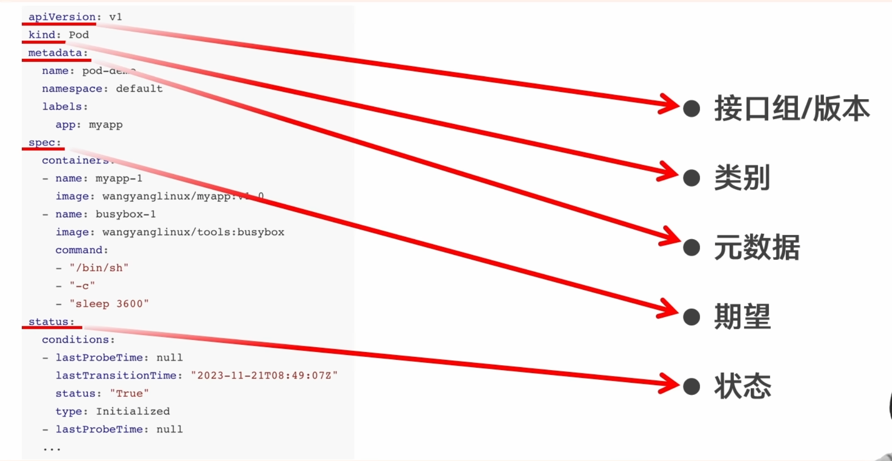

## 资源清单 - 对象属性查询

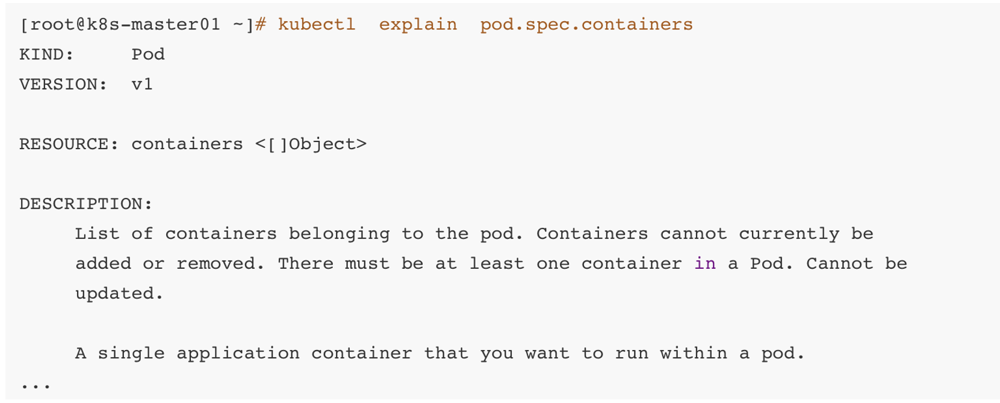

## 资源清单 - pod demo

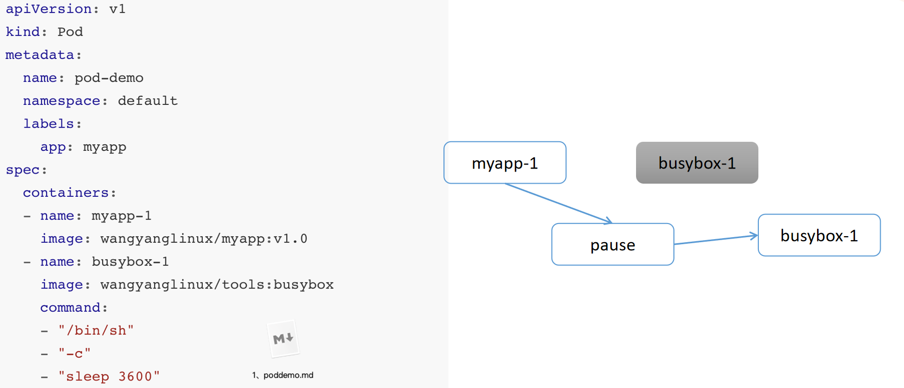

```shell
cd
mkdir 4
cd 4
vi 1.pod.yaml

```
将下面这个粘贴进我们的1.pod.yaml中

```yaml
apiVersion: v1
kind: Pod
metadata:
  name: pod-demo
spec:
  containers:
    - name: myapp-1
      image: nginx:alpine  
    - name: busybox-1
      image: busybox:latest  
      command: ["/bin/sh", "-c", "sleep 3600"]
```

然后执行: `kubectl create -f 1.pod.yaml`

等待资源创建成功


如果失败，可能是docker源的问题，可以去/etc/docker/daemon.json中，将这个文件里面改成如下，记得所有节点都要更改

```json
{
    "registry-mirrors": [
    	"https://docker.m.daocloud.io",
    	"https://docker.imgdb.de",
    	"https://docker-0.unsee.tech",
    	"https://docker.hlmirror.com",
    	"https://docker.1ms.run",
    	"https://func.ink",
    	"https://lispy.org",
    	"https://docker.xiaogenban1993.com"
    ]
}


```

然后执行: `sudo systemctl restart docker`

然后删除刚刚创建失败的pod `kubectl delete pod pod-demo`

然后执行:

```shell
kubectl create -f 1.pod.yaml
kubectl get pod 
```

通过`kubectl describe pod pod-demo`可以查看资源创建情况

## kubectl常用命令

doc/kubectl 常用命令.docx

### **Kubectl 常用命令整理**

#### **1. 查看资源**
| 命令 | 说明 |
|------|------|
| `kubectl get pod` | 查看当前命名空间的 Pod |
| `kubectl get pod -A` 或 `kubectl get pod --all-namespaces` | 查看所有命名空间的 Pod |
| `kubectl get pod -n kube-system` | 查看 `kube-system` 命名空间的 Pod |
| `kubectl get pod --show-labels` | 显示 Pod 的标签 |
| `kubectl get pod -l app=nginx` | 筛选 `app=nginx` 的 Pod |
| `kubectl get pod -o wide` | 显示 Pod 的详细信息（IP、节点等） |
|`kubectl get pod -o yaml` |  获取 Pod 完整 YAML 配置|
| `kubectl get pod -w` | 实时监控 Pod 变化 |

#### **2. 进入 Pod 执行命令**
| 命令 | 说明 |
|------|------|
| `kubectl exec -it podName -- /bin/sh` | 进入 Pod 默认容器 |
| `kubectl exec -it podName -c containerName -- /bin/bash` | 进入指定容器 |

#### **3. 查看资源描述**
| 命令 | 说明 |
|------|------|
| `kubectl explain pod.spec` | 查看 Pod 的 `spec` 字段说明 |
| `kubectl describe pod podName` | 查看 Pod 的详细描述（事件、状态等） |

#### **4. 查看日志**
| 命令 | 说明 |
|------|------|
| `kubectl logs podName` | 查看 Pod 默认容器的日志 |
| `kubectl logs podName -c containerName` | 查看指定容器的日志 |
| `kubectl logs -f podName` | 实时查看日志（类似 `tail -f`） |

#### **5. 删除资源**
| 命令 | 说明 |
|------|------|
| `kubectl delete pod podName` | 删除指定 Pod |
| `kubectl delete pod --all` | 删除当前命名空间的所有 Pod |
| `kubectl delete pod -l app=nginx` | 删除所有 `app=nginx` 的 Pod |

---

### **常用场景示例**
#### **1. 查看所有 Pod 的详细信息**
```bash
kubectl get pod -A -o wide
```

#### **2. 筛选并查看特定标签的 Pod**
```bash
kubectl get pod -l app=nginx --show-labels
```

#### **3. 进入 Pod 调试**
```bash
kubectl exec -it nginx-pod -- /bin/sh
```

#### **4. 查看 Pod 日志**
```bash
kubectl logs nginx-pod -f
```

#### **5. 删除所有 `app=nginx` 的 Pod**
```bash
kubectl delete pod -l app=nginx
```

---

### **总结**
- **`kubectl get`**：查看资源，支持筛选、监控、显示详细信息。
- **`kubectl exec`**：进入 Pod 调试或执行命令。
- **`kubectl logs`**：查看容器日志，支持实时监控。
- **`kubectl describe`**：查看资源详细状态和事件。
- **`kubectl delete`**：删除资源，支持按标签批量删除。

这些命令覆盖了 **80% 的日常 Kubernetes 运维场景**，熟练掌握后可以高效管理集群资源。🚀


# Pod的生命周期(从创建至死亡的全部流程)

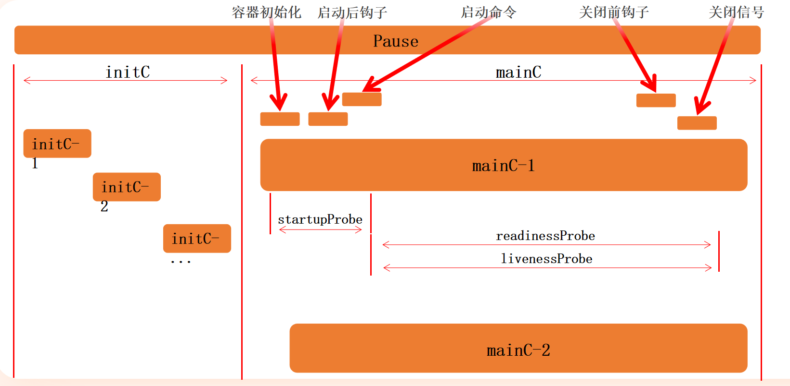


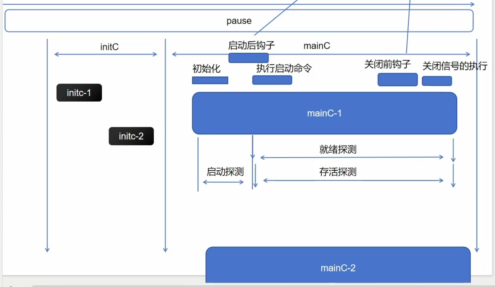

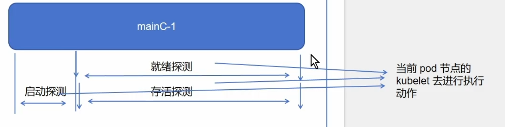

可以按照需要，为不同容器设置不同的钩子或者探针，所有的探测机制/探针依然是通过当前节点的kubelet去完成执行

## Pod 生命周期 - initC - 1


## Pod 生命周期 - initC - 2

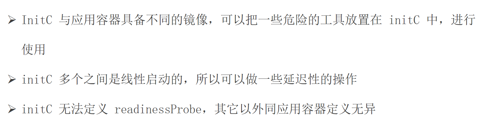

## 检测initC的阻塞性

### 文件: `initc.pod.yaml`

```yaml
apiVersion: v1
kind: Pod
metadata:
  name: initc-1
  labels:
    app: initc
spec:
  containers:
    - name: myapp-container
      image: busybox:1.36
      command: ['sh', '-c', 'echo The app is running! && sleep 3600']
  initContainers:
    - name: init-myservice
      image: busybox:1.36
      command: ['sh', '-c', 'until wget -q --spider --timeout=2 http://myservice; do echo "等待 myservice..."; sleep 2; done;']
    - name: init-mydb
      image: busybox:1.36
      command: ['sh', '-c', 'until wget -q --spider --timeout=2 http://mydb; do echo "等待 mydb..."; sleep 2; done;']
```

```shell
kubectl apply -f initc.pod.yaml
```


现在initc-1这个pod会阻塞，我们需要创建myservice和mydb这两个service，这个initc-1才可以创建成功


### 文件 1: `myservice-and-pod.yaml`（创建 myservice 及其后端 Pod）
```yaml
apiVersion: v1
kind: Service
metadata:
  name: myservice
spec:
  selector:
    app: myservice  
  ports:
    - protocol: TCP
      port: 80
      targetPort: 80
---
apiVersion: v1
kind: Pod
metadata:
  name: myservice-backend
  labels:
    app: myservice  
spec:
  containers:
  - name: nginx
    image: nginx:1.25
    ports:
    - containerPort: 80
```

### 文件 2: `mydb-and-pod.yaml`（创建 mydb 及其后端 Pod）
```yaml
apiVersion: v1
kind: Service
metadata:
  name: mydb
spec:
  selector:
    app: mydb  
  ports:
    - protocol: TCP
      port: 80
      targetPort: 80
---
apiVersion: v1
kind: Pod
metadata:
  name: mydb-backend
  labels:
    app: mydb  
spec:
  containers:
  - name: nginx
    image: nginx:1.25
    ports:
    - containerPort: 80
```


### 部署步骤：
1. 创建服务资源和后端 Pods：
```bash
kubectl apply -f myservice-and-pod.yaml
kubectl apply -f mydb-and-pod.yaml
```


## Pod 生命周期 - 探针

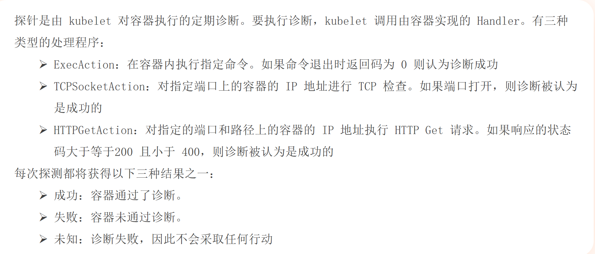


## Pod 生命周期 - 探针分类

- startupProbe: 开始检测吗？
- livenessProbe: 还活着吗？
- readinessProbe: 准备提供服务了吗？


## Pod 生命周期 - readinessProbe 就绪探针

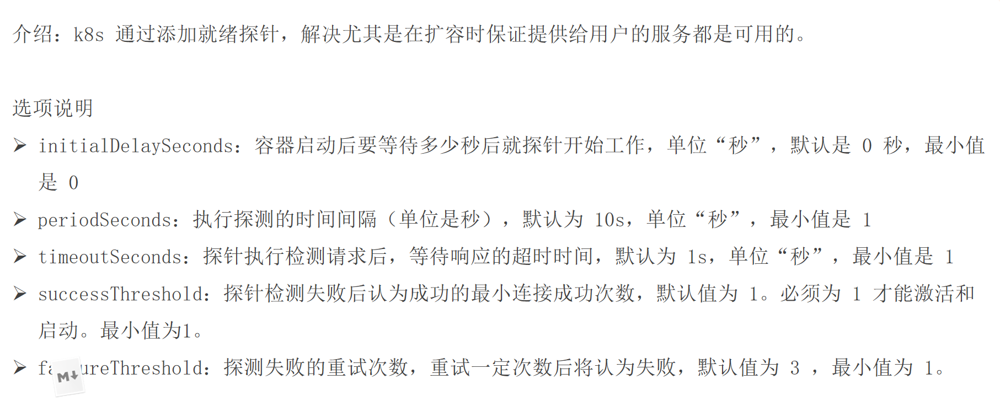


> 就绪探测：如果pod内部的C不添加就绪探测，默认就绪。如果添加了就绪探测，只有就绪通过以后，才标记修改为就绪状态。当前pod内的所有的C都就绪，才标记当前Pod就绪

- 成功：将当前的C标记为就绪
- 失败：静默
- 未知：静默


### 实验

#### 1.pod.yaml

```yaml
apiVersion: v1
kind: Pod
metadata:
  name: pod-1
  namespace: default
  labels:
    app: myapp
spec:
  containers:
    - name: myapp-1
      image: nginx:alpine  
```

#### 2.pod.yaml

```yaml
apiVersion: v1
kind: Pod
metadata:
  name: pod-2
  namespace: default
  labels:
    app: myapp
    version: v1
spec:
  containers:
    - name: myapp-1
      image: nginx:alpine  
```


#### 创建service

```shell
kubectl create svc clusterip myapp --tcp=80:80
```

#### 3.pod.yaml

```yaml
apiVersion: v1
kind: Pod
metadata:
  name: pod-3
  namespace: default
  labels:
    app: test
    version: v1
spec:
  containers:
    - name: myapp-1
      image: nginx:alpine  
```


我们会发现，当我们使用 `curl`命令去访问我们service的地址时，会发现只会负载均衡pod-1,pod-2,pod-3因为标签无法匹配上，所以不会负载均衡到


## 就绪检测

### 基于 HTTP Get方式

#### 4.pod.yaml

```yaml
apiVersion: v1
kind: Pod
metadata:
  name: readiness-httpget-pod
  namespace: default
  labels:
    app: myapp
    env: test
spec:
  containers:
    - name: readiness-httpget-container
      image: nginx:1.23  # 替换为公共镜像
      imagePullPolicy: IfNotPresent
      readinessProbe:
        httpGet:
          port: 80
          path: /index1.html  # nginx 默认首页路径（原配置是 /index1.html，若需测试探针失败可保留原路径）
        initialDelaySeconds: 1
        periodSeconds: 3
```

然后我们执行

```shell
kubectl apply -f 4.pod.yaml
kubectl get pod --show-labels
```

我们会发现:
`readiness-httpget-pod   0/1     Running   0          72s   app=myapp,env=test`

```shell
kubectl describe pod readiness-httpget-pod
```

我们会发现就绪探测失败:

```
Events:
  Type     Reason     Age                   From               Message
  ----     ------     ----                  ----               -------
  Normal   Scheduled  3m30s                 default-scheduler  Successfully assigned default/readiness-httpget-pod to k8s-node01
  Normal   Pulling    3m30s                 kubelet            Pulling image "nginx:1.23"
  Normal   Pulled     2m27s                 kubelet            Successfully pulled image "nginx:1.23" in 1m2.803s (1m2.803s including waiting)
  Normal   Created    2m26s                 kubelet            Created container readiness-httpget-container
  Normal   Started    2m26s                 kubelet            Started container readiness-httpget-container
  Warning  Unhealthy  90s (x21 over 2m25s)  kubelet            Readiness probe failed: HTTP probe failed with statuscode: 404

```

如果想让探测成功，执行：

```shell
kubectl exec -it readiness-httpget-pod -- /bin/sh  # 进入容器
# 在容器内执行（以 Nginx 为例）：
echo "Hello" > /usr/share/nginx/html/index1.html  # Nginx 默认站点目录
exit
```


### 基于 EXEC方式


#### 5.pod.yaml

```yaml
apiVersion: v1
kind: Pod
metadata:
  name: readiness-exec-pod
  namespace: default
spec:
  containers:
    - name: readiness-exec-container
      image: busybox:latest  # 替换为官方公开镜像
      imagePullPolicy: IfNotPresent
      command: ["/bin/sh", "-c", "touch /tmp/live ; sleep 60; rm -rf /tmp/live; sleep 3600"]
      readinessProbe:
        exec:
          command: ["test", "-e", "/tmp/live"]  # 检查 /tmp/live 文件是否存在
        initialDelaySeconds: 1
        periodSeconds: 3
```

然后执行:

```shell
kubectl get pod -w
```

我们可以发现：

```
NAME                    READY   STATUS    RESTARTS   AGE
readiness-exec-pod      1/1     Running   0          22s
readiness-exec-pod      0/1     Running   0          69s

```


这段代码定义了一个 Kubernetes **Pod**，其核心功能是通过 **就绪探针（readinessProbe）** 动态检测容器是否就绪。以下是逐部分解析：

---

### 1. **基础信息**
```yaml
apiVersion: v1  # Kubernetes API 版本
kind: Pod       # 资源类型为 Pod
metadata:
  name: readiness-exec-pod   # Pod 名称
  namespace: default         # 部署到 default 命名空间
```
- **作用**：声明一个名为 `readiness-exec-pod` 的 Pod，使用最基础的 `v1` API 版本。

---

### 2. **容器配置**
```yaml
spec:
  containers:
    - name: readiness-exec-container  # 容器名称
      image: busybox:latest          # 使用官方 busybox 镜像
      imagePullPolicy: IfNotPresent  # 本地有镜像则不拉取
      command: ["/bin/sh", "-c", "touch /tmp/live ; sleep 60; rm -rf /tmp/live; sleep 3600"]
```
- **关键行为**：
    - **启动时**：创建文件 `/tmp/live`，表示服务就绪。
    - **60 秒后**：删除 `/tmp/live`，模拟服务故障。
    - **后续**：睡眠 3600 秒保持容器运行（避免退出）。

---

### 3. **就绪探针（核心机制）**
```yaml
readinessProbe:
  exec:
    command: ["test", "-e", "/tmp/live"]  # 检查文件是否存在
  initialDelaySeconds: 1   # 容器启动后 1 秒开始探测
  periodSeconds: 3         # 每 3 秒检测一次
```
- **工作原理**：
    1. **探测方式**：通过 `exec` 执行 `test -e /tmp/live` 命令，返回 `0`（文件存在）则判定为就绪。
    2. **状态变化**：
        - **前 60 秒**：文件存在 → 探针成功 → Pod 状态为 `Ready`。
        - **60 秒后**：文件被删除 → 探针失败 → Pod 状态为 `Not Ready`（流量不再路由到该 Pod）。

---

### 4. **设计意图**
- **模拟服务状态变化**：
    - 通过文件存在与否动态控制 Pod 的就绪状态，测试 Kubernetes 的**流量自动切换能力**。
- **典型场景**：
    - 当容器内服务崩溃时（如删除 `/tmp/live`），Kubernetes 会自动将 Pod 标记为未就绪，并从 Service 的负载均衡中剔除。

---

### 5. **验证方法**
```bash
kubectl apply -f pod.yaml
kubectl get pods -w  # 观察 Pod 状态变化
```
- **预期输出**：
  ```
  NAME                  READY   STATUS    RESTARTS   AGE
  readiness-exec-pod     1/1     Running   0          10s  # 初始就绪
  readiness-exec-pod     0/1     Running   0          61s  # 60 秒后未就绪
  ```

---

### 总结
这段配置是一个经典的**就绪探针实验**，通过以下机制实现服务可用性控制：
1. **文件作为健康标志**：`/tmp/live` 存在与否决定就绪状态。
2. **自动流量管理**：Kubernetes 根据探针结果动态调整 Pod 的流量接收权限。
3. **故障模拟**：60 秒后自动触发“故障”，测试集群的自我修复能力。


### 基于 TCP Check方式(不常用)

```yaml
apiVersion: v1
kind: Pod
metadata:
  name: readiness-tcp-pod  
spec:
  containers:
    - name: readiness-exec-container  
      image: nginx:1.23  
      readinessProbe:
        tcpSocket:
          port: 80  # 检测80端口的TCP连接性
        initialDelaySeconds: 5  # 容器启动后5秒开始探测
        timeoutSeconds: 1  # 探测超时时间为1秒
```


## Pod 生命周期 - livenessProbe 存活探针

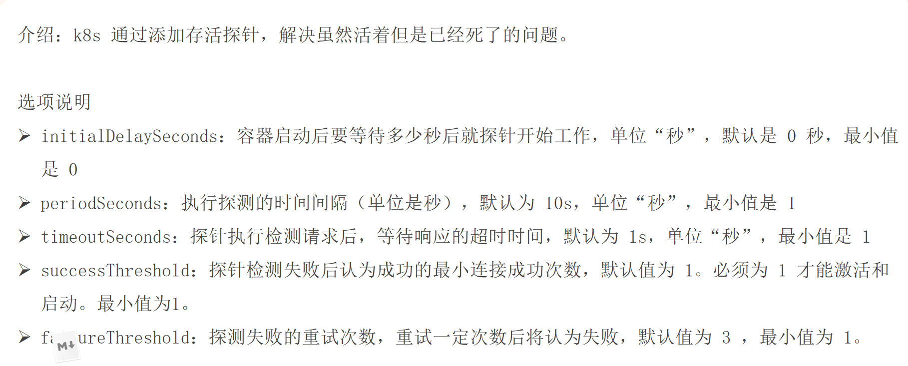


> 存活探测：如果Pod内部不指定存活探测，可能会发生容器运行但是无法提供服务的情况

- 成功：静默
- 失败：根据重启的策略进行重启的动作
- 未知：静默


## 存活检测

### 基于 Exec方式

```yaml
apiVersion: v1
kind: Pod
metadata:
  name: liveness-exec-pod
  namespace: default
spec:
  containers:
    - name: liveness-exec-container
      image: busybox:latest  
      imagePullPolicy: IfNotPresent
      command: ["/bin/sh", "-c", "touch /tmp/live ; sleep 60; rm -rf /tmp/live; sleep 3600"]
      livenessProbe:
        exec:
          command: ["test", "-e", "/tmp/live"]  # 检查文件是否存在
        initialDelaySeconds: 1  # 容器启动1秒后开始探测
        periodSeconds: 3       # 每3秒检测一次
```


这段代码定义了一个 Kubernetes **Pod**，其核心功能是通过**存活探针（livenessProbe）**动态检测容器健康状态，并在异常时自动重启容器。以下是逐部分解析：

---

### 1. **基础信息**
```yaml
apiVersion: v1  # Kubernetes 基础 API 版本
kind: Pod       # 资源类型为 Pod
metadata:
  name: liveness-exec-pod    # Pod 名称
  namespace: default         # 部署到默认命名空间
```
- **作用**：声明一个名为 `liveness-exec-pod` 的 Pod，用于演示存活探针的自动恢复机制。

---

### 2. **容器配置**
```yaml
spec:
  containers:
    - name: liveness-exec-container  # 容器名称
      image: busybox:latest         # 轻量级 Linux 工具集镜像
      imagePullPolicy: IfNotPresent # 本地有镜像则不拉取
      command: ["/bin/sh", "-c", "touch /tmp/live ; sleep 60; rm -rf /tmp/live; sleep 3600"]
```
- **关键行为**：
    1. **启动时**：创建文件 `/tmp/live`（表示服务健康）。
    2. **60 秒后**：删除 `/tmp/live`（模拟服务崩溃）。
    3. **后续**：睡眠 3600 秒保持容器运行（避免直接退出）。

---

### 3. **存活探针（核心机制）**
```yaml
livenessProbe:
  exec:
    command: ["test", "-e", "/tmp/live"]  # 检查文件是否存在
  initialDelaySeconds: 1  # 容器启动后 1 秒开始探测
  periodSeconds: 3        # 每 3 秒检测一次
```
- **工作原理**：
    - **探测逻辑**：通过执行 `test -e /tmp/live` 命令检测文件是否存在。
        - **文件存在**（返回 `0`）：容器健康。
        - **文件不存在**（返回非 `0`）：判定容器异常，触发重启。
    - **参数意义**：
        - `initialDelaySeconds: 1`：避免容器启动过程中的误判。
        - `periodSeconds: 3`：高频检测（生产环境通常设为 10~30 秒）。

---

### 4. **设计意图**
- **模拟服务崩溃场景**：
    - 60 秒后删除文件 → 探针失败 → Kubernetes 自动重启容器（`RESTARTS` 计数增加）。
- **与就绪探针的区别**：
    - **存活探针**：失败时重启容器（解决死锁、僵死等问题）。
    - **就绪探针**：失败时仅停止流量路由（解决依赖项未就绪等问题）。

---

### 5. **验证方法**
```bash
# 部署 Pod
kubectl apply -f pod.yaml

# 观察状态（60秒后容器会重启）
kubectl get pods -w

# 查看重启历史
kubectl describe pod liveness-exec-pod | grep Restart
```
- **预期输出**：
  ```
  NAME                 READY   STATUS    RESTARTS   AGE
  liveness-exec-pod    1/1     Running   1          61s  # 60秒后触发重启
  ```

---

### 总结
这段配置通过**存活探针**实现了以下功能：
1. **自动故障恢复**：当服务崩溃（文件被删除）时，自动重启容器。
2. **轻量级检测**：基于文件存在性检查，无需依赖网络或复杂命令。
3. **快速响应**：高频探测（3 秒）确保及时发现问题。

**典型应用场景**：
- 监控长时间运行进程的健康状态（如定时任务、后台服务）。
- 处理内存泄漏或死锁问题（通过重启恢复服务）。


### 基于 HTTP Get方式

```yaml
apiVersion: v1
kind: Pod
metadata:
  name: liveness-httpget-pod
  namespace: default
spec:
  containers:
    - name: liveness-httpget-container
      image: nginx:1.23  
      imagePullPolicy: IfNotPresent
      ports:
        - name: http
          containerPort: 80  # Nginx 默认监听端口
      livenessProbe:
        httpGet:
          port: 80
          path: /index.html  # Nginx 默认首页路径
        initialDelaySeconds: 1  # 容器启动1秒后开始探测
        periodSeconds: 3        # 每3秒检测一次
        timeoutSeconds: 3       # 探测超时时间
```


这是一个 Kubernetes Pod 配置，使用 HTTP GET 存活探针来监控 Nginx 容器的健康状态。以下是详细解释：

### 1. 基础配置
```yaml
apiVersion: v1
kind: Pod
metadata:
  name: liveness-httpget-pod
  namespace: default
```
- 定义了一个名为 `liveness-httpget-pod` 的 Pod，部署在默认命名空间

### 2. 容器配置
```yaml
spec:
  containers:
    - name: liveness-httpget-container
      image: nginx:1.23
      imagePullPolicy: IfNotPresent
      ports:
        - name: http
          containerPort: 80
```
- 使用官方 Nginx 1.23 镜像
- 镜像拉取策略：本地存在就不重新拉取
- 暴露 80 端口，命名为 "http"

### 3. 存活探针配置（核心）
```yaml
livenessProbe:
  httpGet:
    port: 80
    path: /index.html
  initialDelaySeconds: 1
  periodSeconds: 3
  timeoutSeconds: 3
```

#### 探针工作机制：
1. **探测方式**：通过 HTTP GET 请求 `http://容器IP:80/index.html`
    - 返回 2xx/3xx 状态码 → 健康
    - 连接超时或返回 4xx/5xx → 不健康

2. **时间参数**：
    - `initialDelaySeconds: 1`：容器启动后等待1秒开始第一次探测
    - `periodSeconds: 3`：每3秒执行一次健康检查
    - `timeoutSeconds: 3`：探测请求3秒未响应则视为失败

3. **失败处理**：
    - 连续失败达到阈值（默认3次）后，Kubernetes 会重启容器
    - 可通过 `kubectl describe pod` 查看重启次数和事件

### 4. 实际效果
- 当 Nginx 正常运行（能响应/index.html）时：容器保持运行
- 当 Nginx 崩溃（无法响应请求）时：
    1. 探针检测失败
    2. Kubernetes 自动重启容器
    3. 在 `kubectl get pods` 中会看到 RESTARTS 计数增加

### 5. 测试方法
```bash
# 强制使探针失败（删除默认页面）
kubectl exec liveness-httpget-pod -- rm /usr/share/nginx/html/index.html

# 观察Pod状态变化
kubectl get pods -w
```
大约9秒后（3次探测失败）会看到容器重启。

这个配置非常适合监控 Web 服务的可用性，确保故障时能自动恢复。


### 基于TCP Check方式(不常用)

```yaml
apiVersion: v1
kind: Pod
metadata:
  name: liveness-tcp-pod  
spec:
  containers:
    - name: liveness-tcp-container  
      image: nginx:1.23  
      imagePullPolicy: IfNotPresent
      ports:
        - containerPort: 80  # 明确声明容器暴露的端口（可选）
      livenessProbe:
        tcpSocket:
          port: 80  # 检测80端口的TCP连接性
        initialDelaySeconds: 5  # 容器启动5秒后开始探测
        timeoutSeconds: 1       # 探测超时时间为1秒
```


## Pod 生命周期 - startupProbe 启动探针


> 启动探针：保障存活探针在执行的时候不会因为时间设定问题导致无限死亡或者延迟很长的情况

- 成功：开始允许存活探测 就绪探测开始执行
- 失败：静默
- 未知：静默


### 开始探针

```yaml
apiVersion: v1
kind: Pod
metadata:
  name: startupprobe-1
  namespace: default
spec:
  containers:
    - name: myapp-container
      image: nginx:1.23  
      imagePullPolicy: IfNotPresent
      ports:
        - name: http
          containerPort: 80
      readinessProbe:
        httpGet:
          port: 80
          path: /index2.html  # 建议改为/index.html（Nginx默认存在）
        initialDelaySeconds: 1
        periodSeconds: 3
      startupProbe:
        httpGet:
          path: /index1.html  # 建议改为/index.html（Nginx默认存在）
          port: 80
        failureThreshold: 30
        periodSeconds: 10
```

> 应用程序将会有最多5分钟 failureThreshold * periodSeconds (30 * 10 = 300s)的时间来完成其启动过程。


然后我们执行：

```shell
kubectl exec -it startupprobe-1 -- sh -c \
  "echo 'Startup Probe OK' > /usr/share/nginx/html/index1.html && \
   echo 'Readiness Probe OK' > /usr/share/nginx/html/index2.html"
```

然后我们执行:

```shell
kubectl get pod
```

会发现启动成功!


## pod 生命周期 - 钩子


### lifecycle

```yaml
apiVersion: v1
kind: Pod
metadata:
  name: lifecycle-exec-pod 
spec:
  containers:
    - name: lifecycle-exec-container  
      image: nginx:1.23  
      imagePullPolicy: IfNotPresent
      lifecycle:
        postStart:
          exec:
            command: ["/bin/sh", "-c", "echo postStart > /usr/share/nginx/html/message"]
        preStop:
          exec:
            command: ["/bin/sh", "-c", "echo preStop > /usr/share/nginx/html/message"]
```


验证方法：

```yaml
# 部署Pod
kubectl apply -f pod.yaml

# 查看文件内容（postStart应已写入）
kubectl exec -it lifecycle-exec-pod -- cat /usr/share/nginx/html/message

# 删除Pod时触发preStop（观察文件变化）
kubectl delete pod lifecycle-exec-pod
kubectl exec -it lifecycle-exec-pod -- cat /usr/share/nginx/html/message
```

> tip:我们其实删除Pod的时候，再去查看文件变化，其实查看不到了，因为pod都没了，所以可能要写一个死循环不断读取这文件的内容，然后开启另外一个终端删除pod，就能读取出来

### 基于 HTTP Get方式

```shell
docker run -it --rm -p 1234:80 nginx:1.23
```

再开一个终端，创建下面的这个pod:

```yaml
apiVersion: v1
kind: Pod
metadata:
  name: lifecycle-httpget-pod
  labels:
    name: lifecycle-httpget-pod
spec:
  containers:
    - name: lifecycle-httpget-container
      image: nginx:1.23  
      ports:
        - containerPort: 80
      lifecycle:
        postStart:
          httpGet:
            host: 192.168.120.11  # 需改为实际可访问的域名/IP
            path: /index.html
            port: 1234
        preStop:
          httpGet:
            host: 192.168.120.11  # 需改为实际可访问的域名/IP
            path: /index.html
            port: 1234
```

我们可以发现:

```shell
192.168.120.13 - - [06/Jul/2025:06:36:50 +0000] "GET /index.html HTTP/1.1" 200 615 "-" "kube-lifecycle/1.29" "-"
```

然后我们执行:

```shell
kubectl delete pod lifecycle-httpget-pod
```

我们可以发现:

```shell
192.168.120.13 - - [06/Jul/2025:06:37:55 +0000] "GET /index.html HTTP/1.1" 200 615 "-" "kube-lifecycle/1.29" "-"
```


## pod生命周期 - 关于preStop的延伸话题


## pod生命周期 - 最后


```shell
docker run --name test -p 1234:80 -d nginx:1.23
```


```yaml
apiVersion: v1
kind: Pod
metadata:
  name: lifecycle-pod
  labels:
    app: lifecycle-pod
spec:
  initContainers:
    - name: init-myservice
      image: busybox:1.36
      command: ['sh', '-c', 'until wget -q --spider --timeout=2 http://myservice; do echo "等待 myservice..."; sleep 2; done;']
    - name: init-mydb
      image: busybox:1.36
      command: ['sh', '-c', 'until wget -q --spider --timeout=2 http://mydb; do echo "等待 mydb..."; sleep 2; done;']
  containers:
    - name: busybox-container
      image: busybox:latest
      command: ["/bin/sh","-c","touch /tmp/live ; sleep 600; rm -rf /tmp/live; sleep 3600"]
      livenessProbe:
        exec:
          command: ["test","-e","/tmp/live"]
        initialDelaySeconds: 1
        periodSeconds: 3
      lifecycle:
        postStart:
          httpGet:
            host: 192.168.120.11
            path: index.html
            port: 1234
        preStop:
          httpGet:
            host: 192.168.120.11
            path: index.html
            port: 1234
    - name: myapp-container
      image: nginx:latest
      livenessProbe:
        httpGet:
          port: 80
          path: /index.html
        initialDelaySeconds: 1
        periodSeconds: 3
        timeoutSeconds: 3
      readinessProbe:
        httpGet:
          port: 80
          path: /index1.html
        initialDelaySeconds: 1
        periodSeconds: 3
```


现在这个pod会阻塞，我们需要创建myservice和mydb这两个service


### 文件 1: `myservice-and-pod.yaml`（创建 myservice 及其后端 Pod）
```yaml
apiVersion: v1
kind: Service
metadata:
  name: myservice
spec:
  selector:
    app: myservice  
  ports:
    - protocol: TCP
      port: 80
      targetPort: 80
---
apiVersion: v1
kind: Pod
metadata:
  name: myservice-backend
  labels:
    app: myservice  
spec:
  containers:
  - name: nginx
    image: nginx:1.25
    ports:
    - containerPort: 80
```

### 文件 2: `mydb-and-pod.yaml`（创建 mydb 及其后端 Pod）
```yaml
apiVersion: v1
kind: Service
metadata:
  name: mydb
spec:
  selector:
    app: mydb  
  ports:
    - protocol: TCP
      port: 80
      targetPort: 80
---
apiVersion: v1
kind: Pod
metadata:
  name: mydb-backend
  labels:
    app: mydb  
spec:
  containers:
  - name: nginx
    image: nginx:1.25
    ports:
    - containerPort: 80
```


### 部署步骤：
1. 创建服务资源和后端 Pods：
```bash
kubectl apply -f myservice-and-pod.yaml
kubectl apply -f mydb-and-pod.yaml
```

```bash
kubectl exec -it lifecycle-pod -c myapp-container -- sh -c "echo 'OK' > /usr/share/nginx/html/index1.html"
```

现在这个pod就创建成功了

通过:
```bash
docker logs test
```

可以看到：

```bash
192.168.120.13 - - [06/Jul/2025:07:42:15 +0000] "GET /index.html HTTP/1.1" 200 615 "-" "kube-lifecycle/1.29" "-"
```


# Pod是如何被调度运行的？

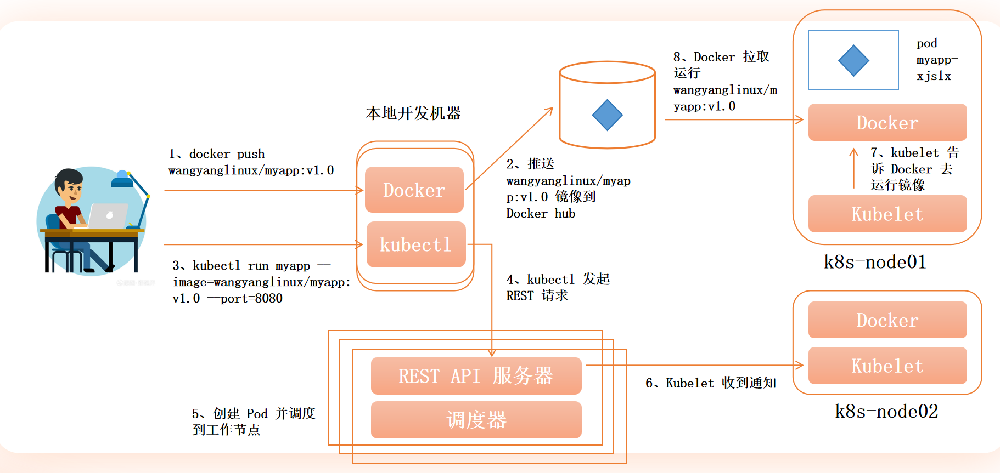

根据提供的图像内容和Kubernetes（k8s）架构原理，以下是完整的Pod运行调度流程解析（已补充关键步骤和组件交互）：

---

### **完整Pod调度运行流程**
1. **镜像准备阶段**
    - 开发者构建镜像 `wangyanglinux/myapp:v1.0` 并推送到 Docker Hub（图中步骤1、2、8）。
    - 节点上的 Docker 可随时拉取此镜像（`docker pull wangyanglinux/myapp:v1.0`）。

2. **用户发起创建请求**
    - 用户通过 `kubectl run` 命令创建 Pod（图中步骤3）：
      ```bash
      kubectl run myapp --image=wangyanglinux/myapp:v1.0 --port=8080
      ```
    - `kubectl` 将请求转换为 **REST API 调用**（图中步骤4），发送给 k8s 控制平面的 `API Server`。

3. **控制平面处理**
    - **API Server** 接收到请求后：
        - 验证请求合法性（身份认证、资源配额等）。
        - 将 Pod 配置信息持久化存储到 `etcd`（图中未展示但关键）。
    - **调度器（Scheduler）** 监听未调度的 Pod：
        - 根据节点资源、亲和性等策略选择合适的工作节点（如 `k8s-node01` 或 `k8s-node02`）。
        - 将节点绑定信息写回 API Server（图中“调度器”部分）。

4. **工作节点执行**
    - 目标节点（如 `k8s-node01`）的 **kubelet** 监听到新任务：
        - 从 API Server 获取 Pod 配置（图中步骤7）。
        - 指令 **Docker** 拉取镜像（若本地不存在）并启动容器（图中步骤8）：
          ```bash
          docker run -p 8080:8080 wangyanglinux/myapp:v1.0
          ```  
        - 监控容器状态，定期向 API Server 报告 Pod 状态。

5. **网络与服务就绪**
    - 容器启动后暴露端口 `8080`（通过 `--port=8080` 指定）。
    - 用户可通过 `kubectl` 或集群内服务访问该 Pod（图中未展示 Service/Ingress 但属于后续流程）。

---

### **核心组件交互流程图**
```mermaid
graph LR
A[用户] -->|kubectl run| B[API Server]
B -->|存储配置| C[etcd]
B -->|通知| D[Scheduler]
D -->|分配节点| B
B -->|通知目标节点| E[kubelet on k8s-node01]
E -->|拉取镜像| F[Docker on k8s-node01]
F -->|运行容器| G[Pod: myapp]
G -->|上报状态| E --> B
```

---

### **关键补充说明**
1. **调度器决策依据**
    - 节点资源（CPU/Memory 剩余量）。
    - 标签选择器（nodeSelector）、亲和性（affinity）。
    - 污点和容忍（taints/tolerations）。

2. **kubelet 的核心职责**
    - 管理 Pod 生命周期（创建/销毁）。
    - 挂载存储卷（Volumes）。
    - 执行容器健康检查（Liveness/Readiness Probes）。

3. **跨节点协作**
    - 若 `k8s-node01` 资源不足，调度器会选择 `k8s-node02`（图中展示多节点）。
    - 所有节点上的 kubelet 均与 API Server 保持长连接。

4. **镜像拉取安全**
    - 私有镜像需配置 `imagePullSecrets`（图中未体现但生产环境必备）。

---

### **异常处理场景**
- **镜像拉取失败**：kubelet 上报 `ImagePullBackOff` 事件至 API Server。
- **节点故障**：调度器将 Pod 重新分配到健康节点（由控制器自动触发）。
- **资源不足**：调度器持续等待直到满足条件的节点出现（Pending 状态）。

此流程体现了 Kubernetes 声明式 API 和控制器模式的核心设计，实现了从用户命令到容器运行的自动化闭环。


### 补充：List


在 Kubernetes (k8s) 中，`List` 是一个核心概念，主要用于表示多个同类资源的集合。以下是关于 `List` 的详细介绍：

---

### **1. List 的定义**
`List` 是 Kubernetes API 中的一种特殊资源类型，用于封装**多个同类型资源对象**。它遵循以下结构：
```yaml
apiVersion: v1
kind: List
metadata:
  name: example-list
items:
- apiVersion: v1
  kind: Pod
  metadata: { ... }
  spec: { ... }
- apiVersion: v1
  kind: Pod
  metadata: { ... }
  spec: { ... }
```
- **`items` 字段**：包含多个资源对象的数组，所有对象必须是同一类型（如全是 `Pod` 或全是 `Service`）。

---

### **2. List 的常见使用场景**
#### **(1) 批量操作资源**
通过 `List` 可以一次性创建、更新或删除多个资源：
```bash
# 批量创建多个 Pod
kubectl apply -f pod-list.yaml
```

#### **(2) 获取资源集合**
API 请求返回的结果通常是 `List` 类型：
```bash
kubectl get pods -o yaml  # 返回 PodList
```

#### **(3) 自定义资源集合**
将多个相关资源打包在一起管理：
```yaml
# deployment-and-service-list.yaml
apiVersion: v1
kind: List
items:
- apiVersion: apps/v1
  kind: Deployment
  metadata: { name: nginx-deploy }
  spec: { ... }
- apiVersion: v1
  kind: Service
  metadata: { name: nginx-svc }
  spec: { ... }
```

---

### **3. Kubernetes 中的 List 类型**
Kubernetes 为每种资源定义了对应的 `List` 类型，例如：
| 资源类型 | 对应的 List 类型 |
|----------|------------------|
| Pod      | `PodList`        |
| Service  | `ServiceList`    |
| Node     | `NodeList`       |
| ConfigMap | `ConfigMapList` |

通过 API 访问时，会自动返回对应的 `List` 类型：
```bash
curl http://localhost:8080/api/v1/pods  # 返回 PodList
```

---

### **4. 实际操作示例**
#### **(1) 创建 List 资源**
```yaml
# pod-list.yaml
apiVersion: v1
kind: List
items:
- apiVersion: v1
  kind: Pod
  metadata:
    name: pod-1
  spec:
    containers:
    - name: nginx
      image: nginx
- apiVersion: v1
  kind: Pod
  metadata:
    name: pod-2
  spec:
    containers:
    - name: busybox
      image: busybox
      command: ["sleep", "3600"]
```
应用配置：
```bash
kubectl apply -f pod-list.yaml
```

#### **(2) 查询 List 资源**
```bash
kubectl get pods  # 返回 PodList
kubectl get services  # 返回 ServiceList
```

#### **(3) 删除 List 资源**
```bash
kubectl delete -f pod-list.yaml
```

---

### **5. List 与其他概念的区别**
| 概念          | 作用                           | 示例                     |
|---------------|-------------------------------|--------------------------|
| **List**      | 多个同类资源的集合             | `PodList`, `ServiceList` |
| **ConfigMap** | 存储键值对配置数据             | 环境变量配置             |
| **Secret**    | 存储敏感数据                   | TLS 证书                |
| **ResourceQuota** | 限制命名空间资源总量       | CPU/内存限额            |

---

### **6. 注意事项**
1. **类型一致性**：`List` 中的 `items` 必须是同一类型（不能混合 `Pod` 和 `Service`）。
2. **原子性**：对 `List` 的操作（如删除）不是原子性的，可能部分成功。
3. **性能**：大型 `List` 可能影响 API 响应速度，建议分页查询：
   ```bash
   kubectl get pods --chunk-size=50
   ```

---

### **7. 高级用法**
#### **(1) 分页查询**
通过 API 的 `limit` 和 `continue` 字段实现分页：
```bash
curl "http://localhost:8080/api/v1/pods?limit=50"
```

#### **(2) 字段选择器**
过滤 `List` 中的资源：
```bash
kubectl get pods --field-selector=status.phase=Running
```

#### **(3) 自定义列输出**
```bash
kubectl get pods -o custom-columns=NAME:.metadata.name,STATUS:.status.phase
```

---

通过理解 `List` 的概念和使用方法，可以更高效地管理 Kubernetes 中的批量资源操作。