# Service - 暴露服务的重要方式


## Service概念原理

集群中服务外露的重要方式

### Service - 概述

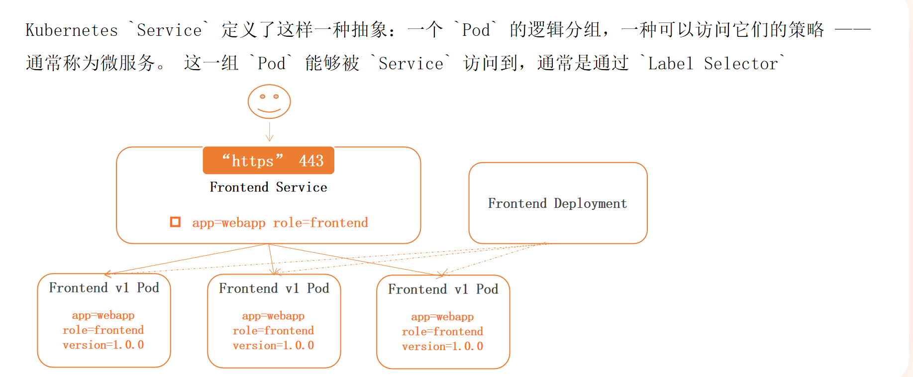


### Service - 为什么需要 - 1


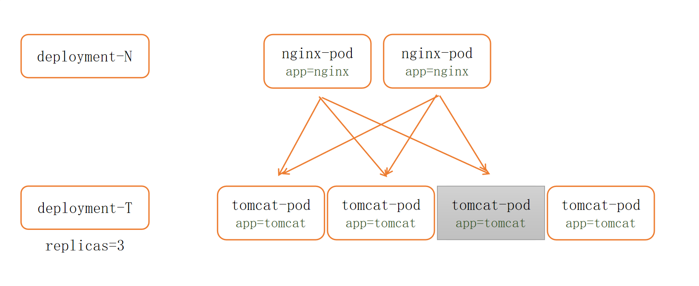


### Service - 为什么需要 - 2

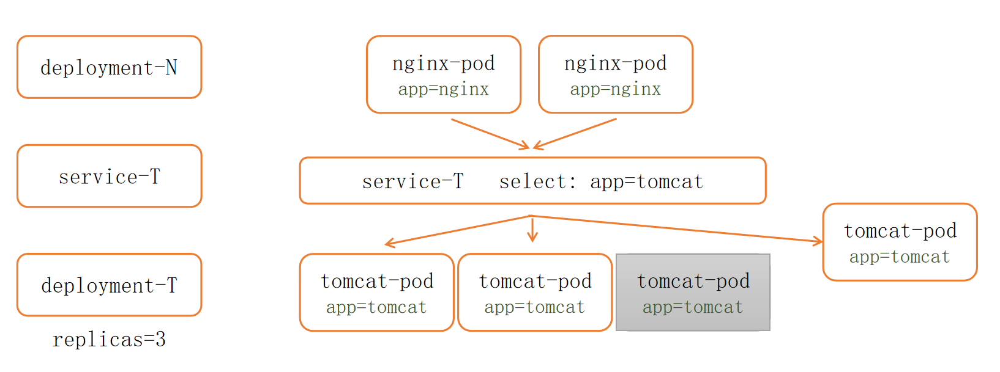

### Service - 核心迭代

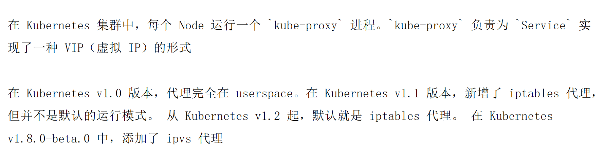

---


Kubernetes 中的 **Deployment** 是管理无状态应用的核心控制器，它的作用可以总结为以下关键点：

---

### **1. 核心功能**
- **声明式更新**：通过 YAML 文件定义应用的目标状态（镜像版本、副本数等），Deployment 自动确保实际状态匹配目标状态。
- **Pod 生命周期管理**：自动创建、销毁和替换 Pod，无需手动干预。
- **滚动更新（Rolling Update）**：逐步替换旧版本 Pod，实现零停机升级。
- **版本回滚**：一键回退到历史版本（通过 `kubectl rollout undo`）。
- **扩缩容**：手动（`kubectl scale`）或自动（HPA）调整 Pod 数量。

---

### **2. 典型使用场景**
| 场景                | 操作示例                                                                 |
|---------------------|-------------------------------------------------------------------------|
| 部署应用            | `kubectl create deployment myapp --image=nginx:1.25`                    |
| 更新镜像版本         | `kubectl set image deployment/myapp nginx=nginx:1.26`                  |
| 回滚到上一版本       | `kubectl rollout undo deployment/myapp`                                |
| 查看更新状态         | `kubectl rollout status deployment/myapp`                              |
| 水平扩缩容           | `kubectl scale deployment/myapp --replicas=5`                          |

---

### **3. 底层工作原理**
1. **控制循环**：  
   Deployment 通过 ReplicaSet 控制 Pod 数量，每个更新版本会生成新的 ReplicaSet。
   ```mermaid
   graph LR
     Deployment --> ReplicaSet-v1 --> Pod-1
     Deployment --> ReplicaSet-v2 --> Pod-2
   ```

2. **滚动更新流程**：
    - 创建新 ReplicaSet 并逐步扩容
    - 旧 ReplicaSet 同步缩容
    - 确保始终有可用 Pod 处理流量

---

### **4. 与相关资源的区别**
| 资源类型       | 适用场景                  | 关键差异                          |
|---------------|-------------------------|---------------------------------|
| **Deployment** | 无状态应用（如Web服务）    | 支持滚动更新、版本回滚              |
| **StatefulSet**| 有状态应用（如数据库）      | 提供稳定的网络标识和持久化存储        |
| **DaemonSet**  | 节点级守护进程（如日志收集）| 每个节点运行一个 Pod                |

---

### **5. 配置示例**
```yaml
apiVersion: apps/v1
kind: Deployment
metadata:
  name: nginx-deployment
spec:
  replicas: 3
  selector:
    matchLabels:
      app: nginx
  template:
    metadata:
      labels:
        app: nginx
    spec:
      containers:
      - name: nginx
        image: nginx:1.25
        ports:
        - containerPort: 80
```

---

### **6. 优势总结**
- **自动化运维**：减少手动管理 Pod 的复杂度
- **高可用性**：确保指定数量的 Pod 始终运行
- **灵活更新**：支持蓝绿部署、金丝雀发布等策略
- **自愈能力**：节点故障时自动重新调度 Pod

Deployment 是 Kubernetes 中最常用的工作负载控制器，适合部署 90% 以上的无状态服务。掌握其用法是 K8s 入门的关键一步！

---

```bash
[root@k8s-master01 5]# kubectl get node
NAME           STATUS   ROLES           AGE     VERSION
k8s-master01   Ready    control-plane   5d13h   v1.29.2
k8s-node01     Ready    <none>          5d13h   v1.29.2
k8s-node02     Ready    <none>          5d13h   v1.29.2

[root@k8s-master01 5]# kubectl create deployment myapp --image=crpi-cd1z0kbw072xy0ao.cn-guangzhou.personal.cr.aliyuncs.com/tangfire/myversion:v1
deployment.apps/myapp created
[root@k8s-master01 5]# kubectl get secret
NAME            TYPE                             DATA   AGE
aliyun-secret   kubernetes.io/dockerconfigjson   1      16h
[root@k8s-master01 5]# kubectl patch deployment myapp -p '{"spec":{"template":{"spec":{"imagePullSecrets":[{"name":"aliyun-secret"}]}}}}'
deployment.apps/myapp patched
[root@k8s-master01 5]# 
[root@k8s-master01 5]# 
[root@k8s-master01 5]# kubectl get pod
NAME                    READY   STATUS    RESTARTS   AGE
myapp-59469d48b-n767n   1/1     Running   0          4s
[root@k8s-master01 5]# kubectl scale deployment myapp --replicas=10
deployment.apps/myapp scaled
[root@k8s-master01 5]# 
[root@k8s-master01 5]# 
[root@k8s-master01 5]# kubectl get pod
NAME                    READY   STATUS    RESTARTS   AGE
myapp-59469d48b-5lv5c   1/1     Running   0          6s
myapp-59469d48b-7twlk   1/1     Running   0          6s
myapp-59469d48b-fwr7r   1/1     Running   0          6s
myapp-59469d48b-h9n4t   1/1     Running   0          6s
myapp-59469d48b-n767n   1/1     Running   0          101s
myapp-59469d48b-pvnnx   1/1     Running   0          6s
myapp-59469d48b-qfzg4   1/1     Running   0          6s
myapp-59469d48b-qqf2w   1/1     Running   0          6s
myapp-59469d48b-tbtb9   1/1     Running   0          6s
myapp-59469d48b-wm88q   1/1     Running   0          6s

[root@k8s-master01 5]# kubectl create svc clusterip myapp --tcp=80:80
service/myapp created
[root@k8s-master01 5]# ipvsadm -Ln
IP Virtual Server version 1.2.1 (size=4096)
Prot LocalAddress:Port Scheduler Flags
  -> RemoteAddress:Port           Forward Weight ActiveConn InActConn
 
[root@k8s-master01 5]# kubectl get svc
NAME         TYPE        CLUSTER-IP     EXTERNAL-IP   PORT(S)   AGE
kubernetes   ClusterIP   10.0.0.1       <none>        443/TCP   5d16h
myapp        ClusterIP   10.6.216.173   <none>        80/TCP    3m11s
[root@k8s-master01 5]# curl 10.6.216.173
<!DOCTYPE html>
<html>
<head>
    <title>Nginx Version</title>
</head>
<body>
    <h1>当前版本: v1.0</h1>
    <p>这是自定义的 Nginx 镜像</p>
</body>
</html>
```


我们可以看到，当前并没有我们对应的ipvs的规则存在，所以可以确认，它目前以iptables的方式在工作


### Service - userspace

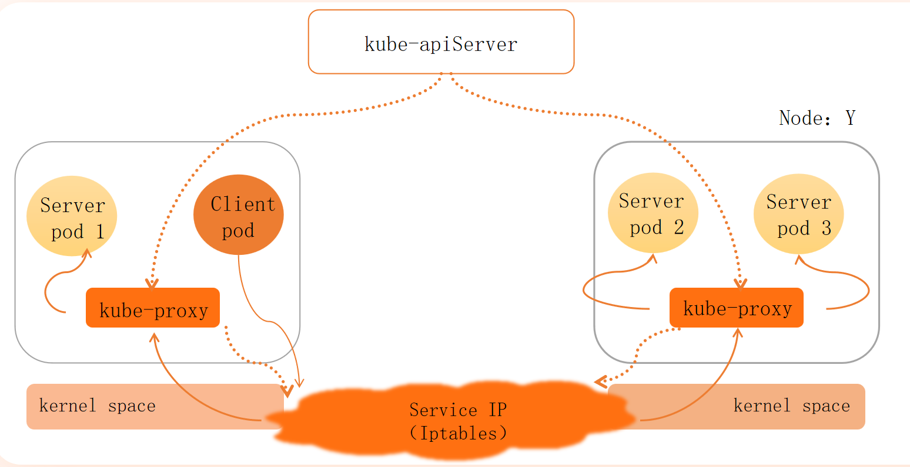


用更直观的方式解释 Kubernetes 中 Service 和 `userspace` 模式的工作原理：


---

### **关键角色功能**
1. **kube-apiServer**
    - 集群的"大脑"，负责下发 Service 和 Endpoints 的配置规则。

2. **kube-proxy**
    - 每个节点上运行的代理组件，监听 kube-apiServer 的规则变化。
    - 在 `userspace` 模式下：
        - 在用户空间监听 Service 的虚拟 IP（VIP）
        - 通过 iptables 将流量重定向到自己
        - 再转发到实际 Pod（如图中的 Server pod 1/2/3）

3. **Service IP (Iptables)**
    - 虚拟 IP（VIP），通过 iptables 规则实现流量拦截和转发。

4. **Kernel space**
    - 操作系统内核空间，处理网络包的路由和转发。

---

### **流量流程示例**
假设 `Client pod` 访问 Service：

1. **请求发出**  
   `Client pod` → 目标 Service IP（如 `10.96.0.1:80`）

2. **内核拦截**
    - 内核的 iptables 规则将流量重定向到本机 `kube-proxy` 监听的随机端口（如 `12345`）

3. **kube-proxy 处理**
    - 查看当前 Service 关联的 Pod（如 `Server pod 1`）
    - 将请求转发到目标 Pod 的真实 IP（如 `10.244.1.2:80`）

4. **响应返回**  
   `Server pod 1` → 原路返回响应 → `Client pod`

---

### **为什么需要 userspace 模式？**
1. **早期解决方案**
    - Kubernetes 初期网络功能简单，靠用户态代理实现灵活转发。

2. **兼容性保障**
    - 某些特殊网络环境（如旧内核）可能不支持纯 iptables 模式。

3. **逐步演进**
    - 现代集群已默认用 `iptables` 或 `ipvs` 模式（性能更高）。

---

### **对比现代模式**
| **动作**         | **userspace 模式**                  | **iptables/ipvs 模式**             |
|------------------|------------------------------------|-----------------------------------|
| 流量拦截         | 需经过用户态 kube-proxy             | 纯内核态 iptables/ipvs 规则         |
| 性能             | 低（用户态-内核态切换）              | 高（内核直接处理）                   |
| 负载均衡         | 简单轮询                           | 支持更多算法（随机、最少连接等）       |

---

### **一句话总结**
图片展示了 `userspace` 模式下：**kube-proxy 像是一个"邮局"**，Client 的请求先被 iptables 送到邮局（kube-proxy），再由邮局决定投递到哪个 Pod（Server pod）。虽然能工作，但效率较低，所以新版 Kubernetes 让"邮局"下岗了，改由内核直接处理（iptables/ipvs）。


### Service - Iptables


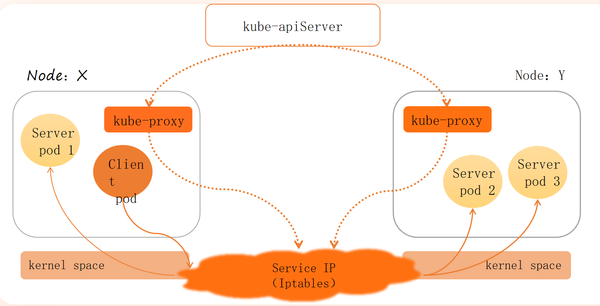

这是典型的 **iptables 模式** 架构图。以下是针对该图的精准解析：

---

### **1. 核心组件分工（iptables模式）**
| **组件**               | **角色**                                  |
|------------------------|------------------------------------------|
| **kube-apiserver**     | 集群控制中心，存储所有 Service 和 Endpoints 规则 |
| **kube-proxy**         | 监听 apiserver 变化，动态生成 iptables 规则   |
| **Service IP**         | 虚拟 IP（VIP），由 iptables 规则直接转发到 Pod  |
| **Pod**                | 实际工作负载                             |

---

### **2. iptables 模式流量路径（图中红线示意）**

```mermaid
graph LR
    ClientPod -->|1.请求ServiceIP| ServiceIP
    ServiceIP -->|2.iptables规则| ServerPod
```

1. **请求发起**  
   `Client pod`（Node X）访问 Service 的虚拟 IP（如 `10.96.0.1:80`）。

2. **内核层转发**
    - **kube-proxy** 已预先在 `iptables` 中生成规则链（如 `KUBE-SVC-XXX`）。
    - 内核直接匹配规则，将流量 **DNAT** 到后端 Pod（如 `Server pod 2` 的 `10.244.1.2:80`）。
    - **全程在内核态完成**，无需经过用户态代理。

3. **响应返回**  
   响应通过 **conntrack** 记录自动原路返回。

---

### **3. 图中关键细节解析**
| **图示元素**          | **技术含义**                                                                 |
|-----------------------|-----------------------------------------------------------------------------|
| **kube-proxy 无流量经过** | 在 iptables 模式下，kube-proxy 仅维护规则，不参与实际流量转发（与 userspace 模式本质区别） |
| **Service IP 云状图标**  | 表示虚拟 IP 通过 iptables 规则链实现负载均衡                                   |
| **Kernel space 区域**   | 强调流量转发完全在内核层处理                                                  |

---

### **4. iptables 规则示例（简化版）**
```bash
# 查看生成的规则链（实际集群中更复杂）
sudo iptables-save | grep KUBE-SVC

# 示例规则：
-A KUBE-SVC-XXXXX -m statistic --mode random --probability 0.333 -j KUBE-SEP-YYYYY
-A KUBE-SVC-XXXXX -m statistic --mode random --probability 0.5 -j KUBE-SEP-ZZZZZ
-A KUBE-SVC-XXXXX -j KUBE-SEP-WWWWW
```
- **随机负载均衡**：通过 `statistic` 模块实现概率分流。
- **多级链式规则**：`KUBE-SVC-XXX` 为主链，`KUBE-SEP-XXX` 对应具体 Pod 的终结点。

---

### **5. 为什么 iptables 模式更高效？**
| **对比项**       | **userspace 模式**                  | **iptables 模式**                  |
|------------------|-------------------------------------|------------------------------------|
| **转发路径**      | 用户态 → 内核态 → 用户态 → Pod        | 内核态直接转发到 Pod                |
| **性能开销**      | 高（数据拷贝 + 上下文切换）           | 低（纯内核处理）                    |
| **规则维护**      | kube-proxy 动态代理                  | kube-proxy 生成 iptables 规则       |
| **适用场景**      | 旧版本 Kubernetes                    | 现代集群默认模式                    |

---

### **6. 验证您的集群模式**
```bash
# 确认 kube-proxy 运行模式
kubectl get pods -n kube-system -l k8s-app=kube-proxy -o yaml | grep proxy-mode

# 预期输出（如果是iptables模式）：
- --proxy-mode=iptables
```

---

### **总结**
图片精准展示了 **iptables 模式** 的核心特征：
1. **控制平面**：kube-apiserver 统一管理规则，kube-proxy 负责同步。
2. **数据平面**：流量通过内核层 iptables 直接转发，完全绕过用户态代理。
3. **性能优势**：避免了用户态-内核态切换，适合高并发场景。


### Service - ipvs

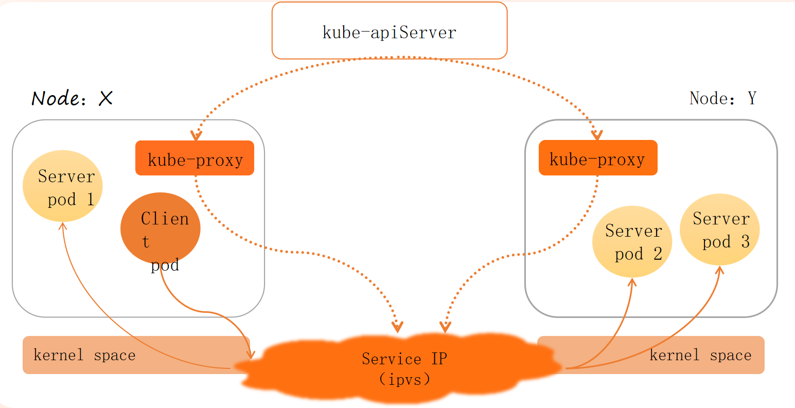


### **IPVS 模式深度解析（基于您的架构图）**

---

#### **1. 核心组件分工（IPVS模式）**
| **组件**               | **角色**                                                                 |
|------------------------|-------------------------------------------------------------------------|
| **kube-apiserver**     | 集群控制中心，存储所有 Service 和 Endpoints 规则         |
| **kube-proxy**         | 监听 apiserver 变化，动态管理 IPVS 规则     |
| **Service IP (IPVS)**  | 虚拟 IP（VIP），由内核级 IPVS 模块实现负载均衡         |
| **Pod**                | 实际工作负载（Client pod 发起请求，Server pod 处理请求）                     |

---

#### **2. IPVS 流量路径（图中红线示意）**
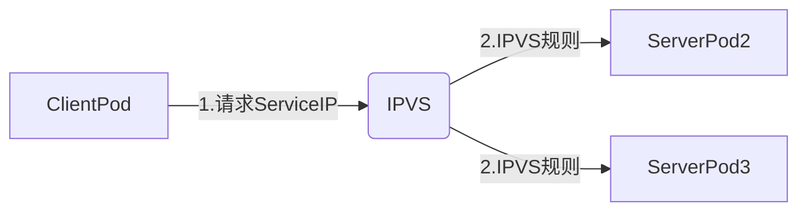
```mermaid
graph LR
    ClientPod -->|1.请求ServiceIP| ServiceIP(IPVS)
    ServiceIP -->|2.IPVS规则| ServerPod2
    ServiceIP -->|2.IPVS规则| ServerPod3
```

1. **请求发起**  
   `Client pod`（Node X）访问 Service 的虚拟 IP（如 `10.96.0.1:80`）。

2. **内核层负载均衡**
    - **IPVS** 直接在内核空间匹配规则，通过以下算法选择目标 Pod（无需用户态介入）：
        - `rr`（轮询）
        - `lc`（最少连接）
        - `sh`（源地址哈希）等
    - 流量 **DNAT** 到后端 Pod（如 `Server pod 2` 的 `10.244.1.2:80`）。

3. **响应返回**  
   响应通过 **conntrack** 记录自动原路返回。

---

#### **3. 图中关键细节解析**
| **图示元素**          | **技术含义**                                                                 |
|-----------------------|-----------------------------------------------------------------------------|
| **Service IP (IPVS) 云状图标** | 表示虚拟 IP 由内核 IPVS 模块管理，支持多种负载均衡算法                          |
| **kube-proxy 无流量经过**     | kube-proxy 仅维护 IPVS 规则，不参与数据转发（与 userspace 模式本质区别）        |
| **Kernel space 区域**         | 强调 IPVS 和流量转发完全在内核层处理（高性能关键）                              |

---

#### **4. IPVS 核心优势**
| **对比项**       | **iptables 模式**                  | **IPVS 模式**                          |
|------------------|------------------------------------|----------------------------------------|
| **规则复杂度**   | 线性链式规则（O(n)查询效率）         | 哈希表存储规则（O(1)查询效率）           |
| **负载均衡算法** | 仅随机（random）                   | 支持 8 种算法（rr/lc/sh/dh/wrr 等）      |
| **性能**         | 规则量大时延迟高                   | 规则规模几乎不影响性能                    |
| **适用场景**     | 中小规模集群                       | 大规模/高性能集群（如 10k+ Service）      |

---

#### **5. 验证集群是否使用 IPVS**
```bash
# 查看 kube-proxy 模式
kubectl get pods -n kube-system -l k8s-app=kube-proxy -o yaml | grep proxy-mode

# 检查内核 IPVS 规则
sudo ipvsadm -Ln
```
**预期输出**：
```
TCP  10.96.0.1:80 rr
  -> 10.244.1.2:80     Masq    1      0          0
  -> 10.244.2.3:80     Masq    1      0          0
```

---

#### **6. 为什么图中 kube-proxy 仍存在？**
- **控制平面职责**：  
  kube-proxy 在 IPVS 模式下负责：
    1. 监听 apiserver 的 Service/Endpoints 变化
    2. 调用 `ipvsadm` 工具动态更新内核规则
    3. 维护 `iptables` 辅助规则（如包过滤、SNAT）

---

#### **7. 典型数据流（跨节点示例）**
1. `Client pod`（Node X）→ `Service IP`
2. IPVS 选择 `Server pod 3`（Node Y）
3. 流量经节点间网络（如 Calico/VXLAN）到达目标 Pod
4. 响应通过原连接返回（IPVS 保留连接跟踪）

---

### **总结**
您的图片精准展示了 **IPVS 模式** 的核心架构：
1. **控制平面**：kube-apiserver + kube-proxy 协同维护规则。
2. **数据平面**：流量由内核 IPVS 模块直接处理，实现高性能负载均衡。
3. **设计哲学**：将复杂度下沉到内核（类似 eBPF），避免用户态-内核态切换开销。


### kubectl edit
执行

```bash
kubectl edit deployment myapp
```
将版本从v1改成v2

再执行：

```bash
[root@k8s-master01 5]# kubectl get svc
NAME         TYPE        CLUSTER-IP     EXTERNAL-IP   PORT(S)   AGE
kubernetes   ClusterIP   10.0.0.1       <none>        443/TCP   5d16h
myapp        ClusterIP   10.6.216.173   <none>        80/TCP    16m
[root@k8s-master01 5]# curl 10.6.216.173
<!DOCTYPE html>
<html>
<head>
    <title>Nginx Version</title>
</head>
<body>
    <h1>当前版本: v2.0</h1>
    <p>这是自定义的 Nginx 镜像</p>
</body>
</html>
```


### Service - 修改 kube-proxy模式

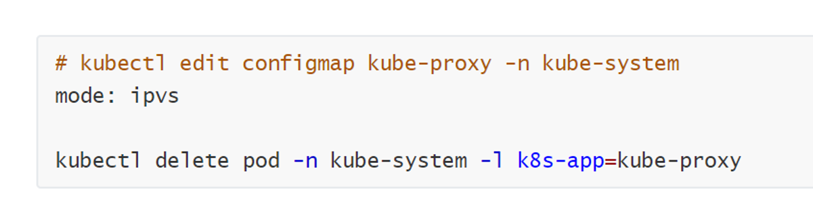


```bash
kubectl edit configmap kube-proxy -n kube-system
```

:/mode

将mode改成`"ipvs"`

:wq

```bash
[root@k8s-master01 5]# kubectl get pod -n kube-system -l k8s-app=kube-proxy
NAME               READY   STATUS    RESTARTS       AGE
kube-proxy-55nrl   1/1     Running   3 (5d3h ago)   5d16h
kube-proxy-9xjxq   1/1     Running   2 (5d2h ago)   5d16h
kube-proxy-kkffb   1/1     Running   1              5d16h
```

```bash
[root@k8s-master01 5]# kubectl delete pod -n kube-system -l k8s-app=kube-proxy
pod "kube-proxy-55nrl" deleted
pod "kube-proxy-9xjxq" deleted
pod "kube-proxy-kkffb" deleted
```


```bash
[root@k8s-master01 5]# ipvsadm -Ln
IP Virtual Server version 1.2.1 (size=4096)
Prot LocalAddress:Port Scheduler Flags
  -> RemoteAddress:Port           Forward Weight ActiveConn InActConn
TCP  10.0.0.1:443 rr
  -> 192.168.120.11:6443          Masq    1      0          0         
TCP  10.0.0.10:53 rr
  -> 10.244.32.138:53             Masq    1      0          0         
  -> 10.244.32.139:53             Masq    1      0          0         
TCP  10.0.0.10:9153 rr
  -> 10.244.32.138:9153           Masq    1      0          0         
  -> 10.244.32.139:9153           Masq    1      0          0         
TCP  10.6.216.173:80 rr
  -> 10.244.58.248:80             Masq    1      0          0         
  -> 10.244.58.249:80             Masq    1      0          0         
  -> 10.244.58.250:80             Masq    1      0          0         
  -> 10.244.58.251:80             Masq    1      0          0         
  -> 10.244.58.252:80             Masq    1      0          0         
  -> 10.244.85.231:80             Masq    1      0          0         
  -> 10.244.85.232:80             Masq    1      0          0         
  -> 10.244.85.233:80             Masq    1      0          0         
  -> 10.244.85.234:80             Masq    1      0          0         
  -> 10.244.85.235:80             Masq    1      0          0         
TCP  10.13.13.181:5473 rr
  -> 192.168.120.12:5473          Masq    1      0          0         
UDP  10.0.0.10:53 rr
  -> 10.244.32.138:53             Masq    1      0          0         
  -> 10.244.32.139:53             Masq    1      0          0
  
  
[root@k8s-master01 5]# kubectl get svc
NAME         TYPE        CLUSTER-IP     EXTERNAL-IP   PORT(S)   AGE
kubernetes   ClusterIP   10.0.0.1       <none>        443/TCP   5d16h
myapp        ClusterIP   10.6.216.173   <none>        80/TCP    37m

[root@k8s-master01 5]# kubectl get pod -o wide
NAME                    READY   STATUS    RESTARTS   AGE   IP              NODE         NOMINATED NODE   READINESS GATES
myapp-9b46d9744-69f97   1/1     Running   0          25m   10.244.85.232   k8s-node01   <none>           <none>
myapp-9b46d9744-7s2tc   1/1     Running   0          25m   10.244.85.235   k8s-node01   <none>           <none>
myapp-9b46d9744-bcpdc   1/1     Running   0          25m   10.244.58.251   k8s-node02   <none>           <none>
myapp-9b46d9744-h9x46   1/1     Running   0          25m   10.244.85.234   k8s-node01   <none>           <none>
myapp-9b46d9744-jb4kc   1/1     Running   0          25m   10.244.85.233   k8s-node01   <none>           <none>
myapp-9b46d9744-n2gnd   1/1     Running   0          25m   10.244.58.249   k8s-node02   <none>           <none>
myapp-9b46d9744-ql2j2   1/1     Running   0          25m   10.244.85.231   k8s-node01   <none>           <none>
myapp-9b46d9744-slskq   1/1     Running   0          25m   10.244.58.250   k8s-node02   <none>           <none>
myapp-9b46d9744-w4vp9   1/1     Running   0          25m   10.244.58.248   k8s-node02   <none>           <none>
myapp-9b46d9744-w6m7t   1/1     Running   0          25m   10.244.58.252   k8s-node02   <none>           <none>
```


## Service工作模式及使用

适合的才是好的


### Service - 类型

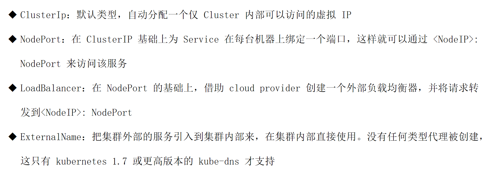


#### 为什么需要ClusterIp

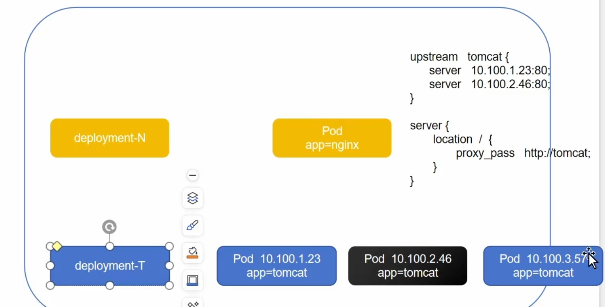


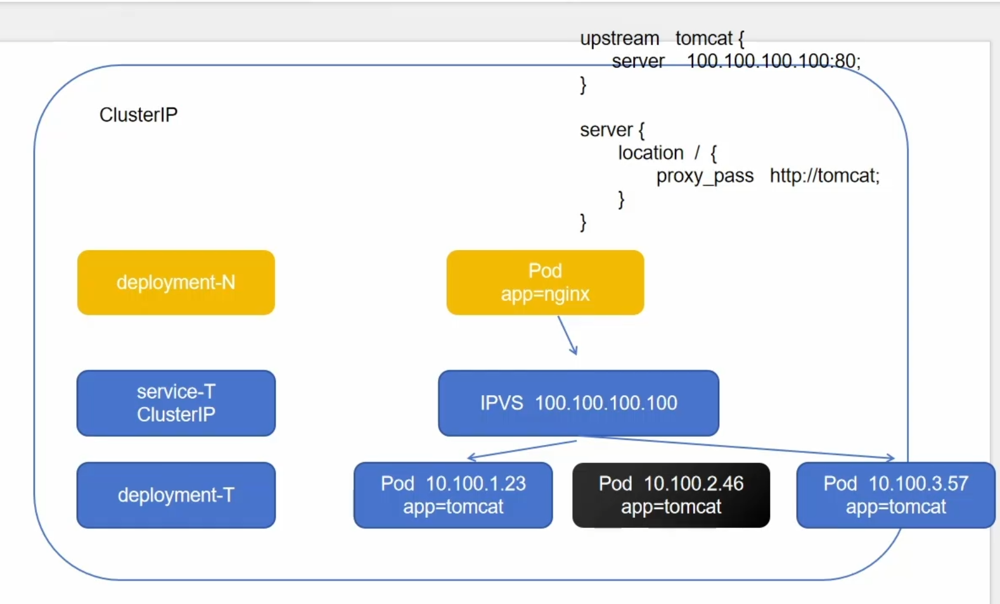


### NodePort

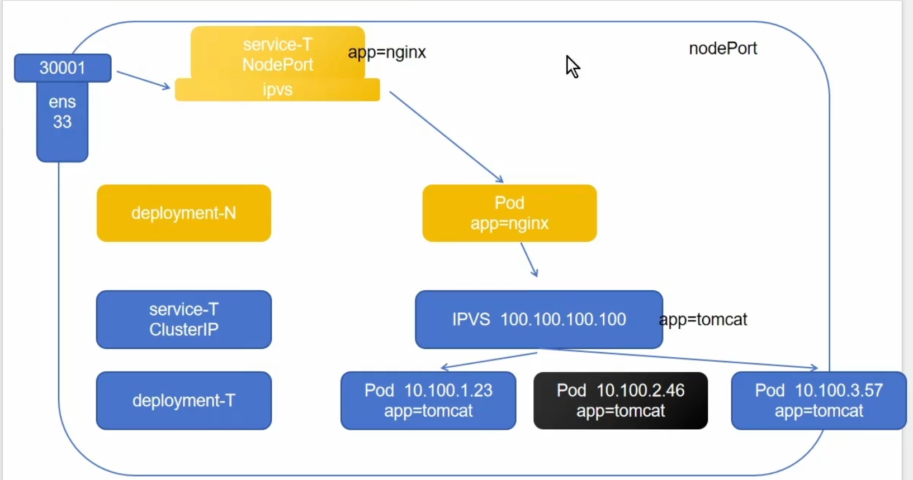


### LoadBalancer


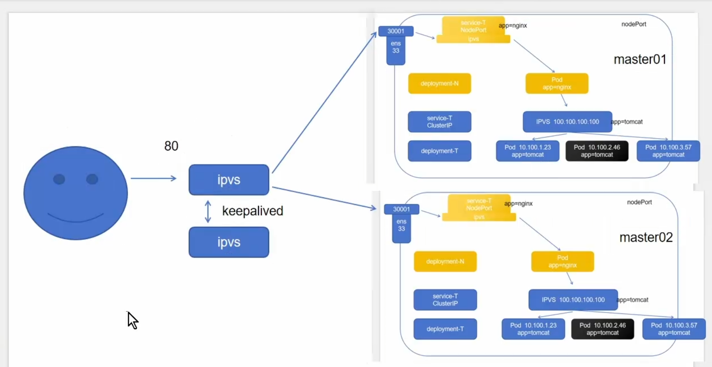


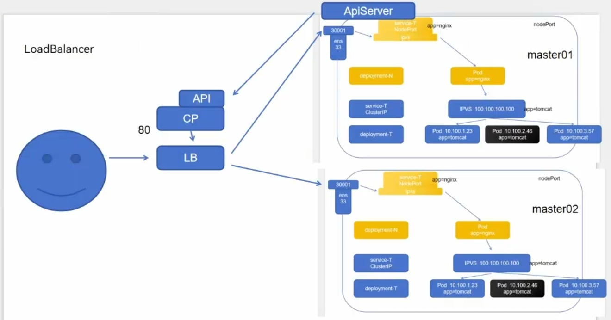


### ExternalName

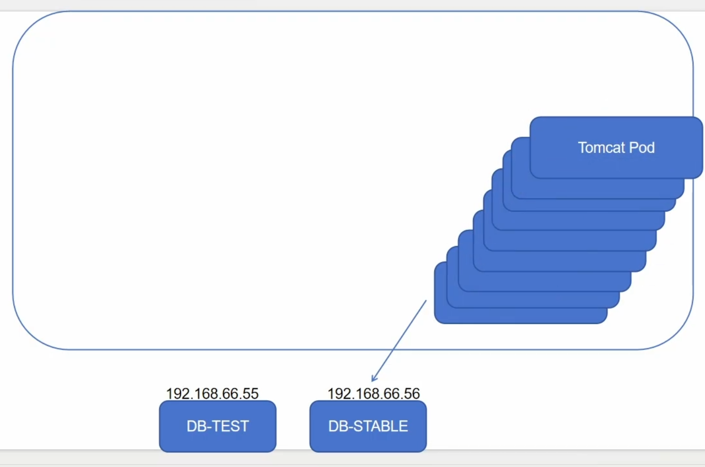


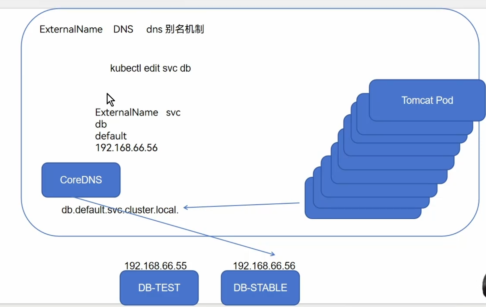


### Service - 组件协同


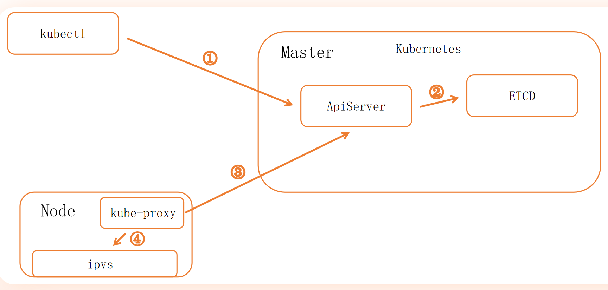


### Service - ClusterIP - 结构


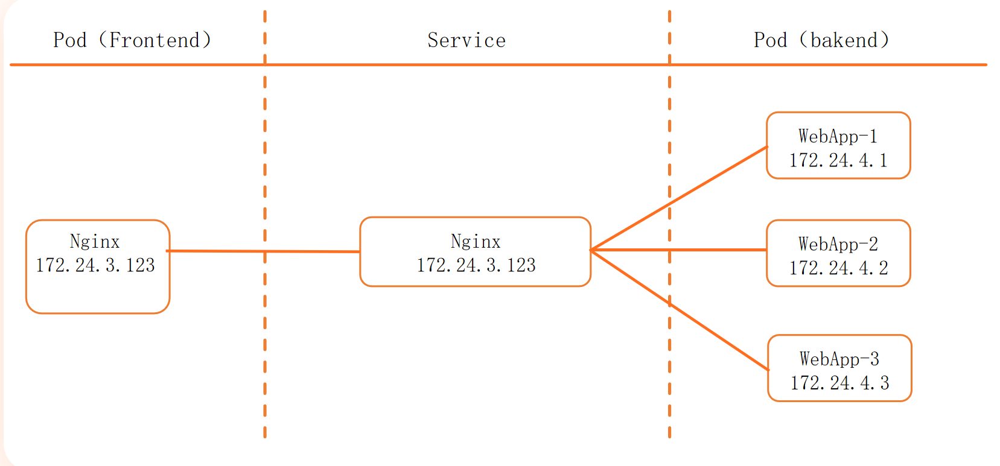


### ipvs

IPVS（IP Virtual Server）是Linux内核的一部分，用于实现高性能的负载均衡。它支持多种工作模式，主要包括 **NAT**、**DR（Direct Routing）** 和 **TUN（Tunneling）**。以下是它们的详细介绍和对比：

---

### 1. **NAT 模式（Network Address Translation）**
- **原理**：
    - 负载均衡器（LVS）修改请求和响应的IP地址和端口，将客户端请求转发给后端真实服务器（Real Server），并将响应返回给客户端。
    - 请求和响应流量都经过负载均衡器。
- **特点**：
    - **双向流量**：负载均衡器需要处理入站（请求）和出站（响应）流量。
    - **IP转换**：后端服务器的响应必须经过负载均衡器，由负载均衡器将目标IP改回客户端IP。
    - **端口映射**：支持端口转换（如将VIP的80端口映射到后端服务器的8080端口）。
- **优点**：
    - 后端服务器可以位于私有网络，无需暴露真实IP。
    - 配置简单，适用于大多数场景。
- **缺点**：
    - 负载均衡器可能成为性能瓶颈（需要处理所有响应流量）。
    - 后端服务器的默认网关必须指向负载均衡器。

---

### 2. **DR 模式（Direct Routing）**
- **原理**：
    - 负载均衡器仅修改请求的MAC地址，将请求直接转发给后端服务器，后端服务器直接响应客户端（不经过负载均衡器）。
    - 响应流量由后端服务器通过其他路由返回客户端。
- **特点**：
    - **单路径流量**：只有请求经过负载均衡器，响应由后端服务器直接返回。
    - **MAC层转发**：负载均衡器和后端服务器必须在同一物理网络（不能跨子网）。
    - **VIP配置**：后端服务器的Loopback接口需要绑定VIP，但需避免ARP冲突（通常通过`arp_ignore`和`arp_announce`内核参数实现）。
- **优点**：
    - 高性能，负载均衡器仅处理请求流量。
    - 支持高并发场景（如大型Web服务）。
- **缺点**：
    - 后端服务器必须与负载均衡器在同一局域网（不能跨子网）。
    - 需要手动配置后端服务器的ARP抑制。

---

### 3. **TUN 模式（Tunneling）**
- **原理**：
    - 负载均衡器将请求通过IP隧道（如IPIP封装）转发给后端服务器，后端服务器解封装后直接响应客户端。
    - 响应流量不经过负载均衡器。
- **特点**：
    - **跨子网支持**：后端服务器可以位于不同物理网络（通过隧道封装）。
    - **IP层转发**：请求通过隧道传输，后端服务器需支持隧道协议（如IPIP）。
    - **VIP配置**：后端服务器的隧道接口需要绑定VIP。
- **优点**：
    - 负载均衡器和后端服务器可以跨子网部署。
    - 响应流量不经过负载均衡器，性能较高。
- **缺点**：
    - 隧道封装/解封装消耗CPU资源。
    - 配置复杂，需后端服务器支持隧道协议。

---

### **对比总结**
| **模式** | **流量路径**           | **网络要求**               | **性能** | **配置复杂度** | **适用场景**               |
|----------|------------------------|---------------------------|----------|----------------|---------------------------|
| NAT      | 请求和响应均经过LVS     | 后端服务器需与LVS同子网    | 较低     | 简单           | 小型私有网络              |
| DR       | 仅请求经过LVS           | 必须同局域网，不可跨子网   | 最高     | 中等           | 高性能、同机房部署        |
| TUN      | 仅请求经过LVS（隧道）   | 可跨子网，需支持隧道       | 较高     | 复杂           | 跨机房或异地负载均衡      |

---

### **选择建议**
- **NAT**：适合小规模场景，后端服务器无需公网IP。
- **DR**：推荐用于高性能、同局域网的负载均衡（如Web集群）。
- **TUN**：用于需要跨子网或异地部署的场景（如混合云）。

根据实际网络环境和性能需求选择合适模式。


### Service - ClusterIP - 实验

```yaml
apiVersion: v1
kind: Service
metadata:
  name: myapp-clusterip
  namespace: default
spec:
  type: ClusterIP
  selector:
    app: myapp
    release: stable
    svc: clusterip
  ports:
  - name: http
    port: 80
    targetPort: 80
```

#### 1.deployment.yaml

```yaml
apiVersion: apps/v1
kind: Deployment
metadata:
  name: myapp-clusterip-deploy
  namespace: default
spec:
  replicas: 3
  selector:
    matchLabels:
      app: myapp
      release: stable
      svc: clusterip
  template:
    metadata:
      labels:
        app: myapp
        release: stable
        env: test
        svc: clusterip
    spec:
      imagePullSecrets:
        - name: aliyun-secret
      containers:
        - name: myapp-container
          image: crpi-cd1z0kbw072xy0ao.cn-guangzhou.personal.cr.aliyuncs.com/tangfire/myversion:v1
          imagePullPolicy: IfNotPresent
          ports:
            - name: http
              containerPort: 80
          readinessProbe:
            httpGet:
              port: 80
              path: /index.html
            initialDelaySeconds: 1
            periodSeconds: 3
```


```bash
[root@k8s-master01 6.1]# kubectl apply -f 1.deployment.yaml 
deployment.apps/myapp-clusterip-deploy created
[root@k8s-master01 6.1]# 
[root@k8s-master01 6.1]# 
[root@k8s-master01 6.1]# kubectl get pod
NAME                                    READY   STATUS    RESTARTS   AGE
myapp-clusterip-deploy-98786f9c-fpkq2   1/1     Running   0          7s
myapp-clusterip-deploy-98786f9c-q7jhg   1/1     Running   0          7s
myapp-clusterip-deploy-98786f9c-tll6j   1/1     Running   0          7s
```

#### 创建Service信息(2.svc.yaml)

```yaml
apiVersion: v1
kind: Service
metadata:
  name: myapp-clusterip
  namespace: default
spec:
  type: ClusterIP
  selector:
    app: myapp
    release: stable
    svc: clusterip
  ports:
    - name: http
      port: 80
      targetPort: 80
```

```bash
[root@k8s-master01 6.1]# kubectl apply -f 2.svc.yaml 
service/myapp-clusterip created
[root@k8s-master01 6.1]# 
[root@k8s-master01 6.1]# 
[root@k8s-master01 6.1]# kubectl get svc
NAME              TYPE        CLUSTER-IP     EXTERNAL-IP   PORT(S)   AGE
kubernetes        ClusterIP   10.0.0.1       <none>        443/TCP   5d19h
myapp-clusterip   ClusterIP   10.15.212.21   <none>        80/TCP    34s
[root@k8s-master01 6.1]# curl 10.15.212.21
<!DOCTYPE html>
<html>
<head>
    <title>Nginx Version</title>
</head>
<body>
    <h1>当前版本: v1.0</h1>
    <p>这是自定义的 Nginx 镜像</p>
</body>
</html>
```

### 查看svc的ip的两种方式

#### 第一种

```bash
kubectl get svc
```

#### 第二种

借助DNS插件，每一个service在创建完成后，都会有一个DNS的域名在我们的插件中被解析，解析的结果就是当前svc的ip地址


```bash
yum -y install bind-utils
```

```bash
[root@k8s-master01 6.1]# kubectl get pod -n kube-system -o wide | grep dns
coredns-857d9ff4c9-drmqk                   1/1     Running   3 (5d6h ago)   5d19h   10.244.32.138    k8s-master01   <none>           <none>
coredns-857d9ff4c9-jknr4                   1/1     Running   3 (5d6h ago)   5d19h   10.244.32.139    k8s-master01   <none>           <none>
[root@k8s-master01 6.1]# ipvsadm -Ln
IP Virtual Server version 1.2.1 (size=4096)
Prot LocalAddress:Port Scheduler Flags
  -> RemoteAddress:Port           Forward Weight ActiveConn InActConn
TCP  10.0.0.1:443 rr
  -> 192.168.120.11:6443          Masq    1      0          0         
TCP  10.0.0.10:53 rr
  -> 10.244.32.138:53             Masq    1      0          0         
  -> 10.244.32.139:53             Masq    1      0          0         
TCP  10.0.0.10:9153 rr
  -> 10.244.32.138:9153           Masq    1      0          0         
  -> 10.244.32.139:9153           Masq    1      0          0         
TCP  10.13.13.181:5473 rr
  -> 192.168.120.12:5473          Masq    1      0          0         
TCP  10.15.212.21:80 rr
  -> 10.244.58.253:80             Masq    1      0          0         
  -> 10.244.58.254:80             Masq    1      0          0         
  -> 10.244.85.236:80             Masq    1      0          0         
UDP  10.0.0.10:53 rr
  -> 10.244.32.138:53             Masq    1      0          0         
  -> 10.244.32.139:53             Masq    1      0          0         
```

```bash
[root@k8s-master01 6.1]# dig -t A myapp-clusterip.default.svc.cluster.local. @10.0.0.10

; <<>> DiG 9.16.23-RH <<>> -t A myapp-clusterip.default.svc.cluster.local. @10.0.0.10
;; global options: +cmd
;; Got answer:
;; WARNING: .local is reserved for Multicast DNS
;; You are currently testing what happens when an mDNS query is leaked to DNS
;; ->>HEADER<<- opcode: QUERY, status: NOERROR, id: 52975
;; flags: qr aa rd; QUERY: 1, ANSWER: 1, AUTHORITY: 0, ADDITIONAL: 1
;; WARNING: recursion requested but not available

;; OPT PSEUDOSECTION:
; EDNS: version: 0, flags:; udp: 4096
; COOKIE: fe6261b5c53acadf (echoed)
;; QUESTION SECTION:
;myapp-clusterip.default.svc.cluster.local. IN A

;; ANSWER SECTION:
myapp-clusterip.default.svc.cluster.local. 30 IN A 10.15.212.21

;; Query time: 48 msec
;; SERVER: 10.0.0.10#53(10.0.0.10)
;; WHEN: Wed Jul 09 16:56:39 CST 2025
;; MSG SIZE  rcvd: 139

[root@k8s-master01 6.1]# kubectl get svc
NAME              TYPE        CLUSTER-IP     EXTERNAL-IP   PORT(S)   AGE
kubernetes        ClusterIP   10.0.0.1       <none>        443/TCP   5d20h
myapp-clusterip   ClusterIP   10.15.212.21   <none>        80/TCP    26m
```

这段内容展示了在 Kubernetes 集群中通过 `dig` 命令查询 Service 的 DNS 记录，并通过 `kubectl` 验证 Service 信息的过程。以下是详细解释：

---

### **1. dig 命令解析**
```bash
dig -t A myapp-clusterip.default.svc.cluster.local. @10.0.0.10
```
- **目的**：查询 Service `myapp-clusterip` 的 DNS A 记录（IP 地址）。
- **参数**：
    - `-t A`：指定查询类型为 A 记录（IPv4 地址）。
    - `@10.0.0.10`：指定 DNS 服务器地址（这里是 Kubernetes 内置的 CoreDNS 服务 IP）。
- **查询的域名**：  
  `myapp-clusterip.default.svc.cluster.local.`  
  这是 Kubernetes Service 的完全限定域名（FQDN），格式为：  
  `<ServiceName>.<Namespace>.svc.<ClusterDomain>`
    - `myapp-clusterip`：Service 名称。
    - `default`：Service 所在的命名空间。
    - `svc.cluster.local`：集群的默认域名（`cluster.local` 是常见配置）。

---

### **2. dig 输出解析**
#### **警告信息**
```
WARNING: .local is reserved for Multicast DNS
```
- 提示 `.local` 通常用于本地网络的多播 DNS（mDNS），但在 Kubernetes 中这是默认集群域名，可忽略。

#### **应答部分**
- **ANSWER SECTION**：  
  ```myapp-clusterip.default.svc.cluster.local. 30 IN A 10.15.212.21```
    - 返回的 A 记录显示 Service 的 ClusterIP 是 `10.15.212.21`。
    - `30` 是 TTL（生存时间），表示此记录缓存 30 秒。

- **SERVER**：  
  `10.0.0.10#53`
    - 表示 DNS 查询是通过 `10.0.0.10`（CoreDNS 服务）的 53 端口完成的。

---

### **3. kubectl 验证**
```bash
kubectl get svc
```
输出显示：
```
NAME              TYPE        CLUSTER-IP     EXTERNAL-IP   PORT(S)   AGE
kubernetes        ClusterIP   10.0.0.1       <none>        443/TCP   5d20h
myapp-clusterip   ClusterIP   10.15.212.21   <none>        80/TCP    26m
```
- **`myapp-clusterip`**：
    - ClusterIP 为 `10.15.212.21`，与 `dig` 查询结果一致。
    - 类型为 `ClusterIP`（仅集群内可访问），端口为 80。
- **`kubernetes`**：  
  这是 Kubernetes API Server 的默认 Service，ClusterIP 为 `10.0.0.1`。

---

### **4. 关键结论**
1. **DNS 解析**：  
   Kubernetes 的 CoreDNS 服务（`10.0.0.10`）会自动为 Service 创建 DNS 记录，格式为 `<Service>.<Namespace>.svc.cluster.local`。

2. **ClusterIP**：  
   Service 的 ClusterIP（`10.15.212.21`）是集群内访问的虚拟 IP，通过 DNS 或直接 IP 均可访问。

3. **用途**：  
   这种机制允许 Pod 通过 Service 名称（而非硬编码 IP）访问其他服务，实现服务发现。

---

### **5. 补充说明**
- **为什么用 `.local`？**  
  Kubernetes 默认集群域名是 `cluster.local`，但可配置。若需避免 mDNS 警告，可以修改集群配置使用其他域名（如 `k8s.internal`）。
- **递归查询警告**：  
  `recursion requested but not available` 表示 CoreDNS 未启用递归查询（正常现象，因它只处理集群内 DNS）。

如果需要进一步调试，可以使用 `nslookup` 或 `kubectl describe svc myapp-clusterip` 查看详细信息。


---

### service的两种访问方式


在 Kubernetes 中，Service 是用于暴露 Pod 的网络服务的抽象层，主要有两种访问方式：**ClusterIP** 和 **DNS 名称**。此外，还有其他类型的 Service（如 NodePort、LoadBalancer、ExternalName），但它们通常用于外部访问。以下是两种主要的集群内访问方式：

---

## **1. 通过 ClusterIP 访问**
**ClusterIP** 是 Service 的默认类型，它会自动分配一个集群内部的虚拟 IP（VIP），只能在集群内部访问。

### **特点**
- 只能在 Kubernetes 集群内部访问（Pod 或节点）。
- 不暴露到公网。
- 通过 IP 直接访问，例如 `curl 10.15.212.21:80`（如你的示例中的 `myapp-clusterip`）。

### **示例**
```bash
# 查看 Service 的 ClusterIP
kubectl get svc myapp-clusterip
```
输出：
```
NAME              TYPE        CLUSTER-IP     EXTERNAL-IP   PORT(S)   AGE
myapp-clusterip   ClusterIP   10.15.212.21   <none>        80/TCP    26m
```
- 访问方式：
  ```bash
  curl http://10.15.212.21  # 直接使用 ClusterIP
  ```

---

## **2. 通过 DNS 名称访问**
Kubernetes 内置的 **CoreDNS**（或 kube-dns）会自动为 Service 创建 DNS 记录，格式为：
```
<service-name>.<namespace>.svc.cluster.local
```
### **特点**
- 无需记住 IP，直接通过 Service 名称访问。
- 适用于 Pod 之间的通信（如微服务调用）。
- 如果 Pod 和 Service 在同一个 Namespace，可以省略 `<namespace>.svc.cluster.local`，直接使用 `<service-name>`。

### **示例**
#### **(1) 完全限定域名（FQDN）访问**
```bash
curl http://myapp-clusterip.default.svc.cluster.local
```
- `myapp-clusterip`：Service 名称。
- `default`：Namespace。
- `svc.cluster.local`：集群域名（默认）。

#### **(2) 短名称访问（同一 Namespace）**
如果 Pod 和 Service 都在 `default` Namespace，可以直接用 Service 名称：
```bash
curl http://myapp-clusterip
```
- Kubernetes 会自动解析为 `myapp-clusterip.default.svc.cluster.local`。

---

## **其他访问方式（补充）**
虽然 ClusterIP 和 DNS 是主要的集群内访问方式，但 Service 还支持以下类型：
1. **NodePort**
    - 在集群的每个节点上开放一个端口（如 `30080`），外部可以通过 `<NodeIP>:<NodePort>` 访问。
    - 示例：
      ```bash
      kubectl expose deployment myapp --type=NodePort --port=80
      curl http://<NodeIP>:30080
      ```

2. **LoadBalancer**
    - 适用于云平台（如 AWS、GCP），自动创建外部负载均衡器，分配公网 IP。
    - 示例：
      ```bash
      kubectl expose deployment myapp --type=LoadBalancer --port=80
      curl http://<LoadBalancer-IP>
      ```

3. **ExternalName**
    - 将 Service 映射到外部 DNS 名称（如数据库服务）。
    - 示例：
      ```yaml
      apiVersion: v1
      kind: Service
      metadata:
        name: my-external-db
      spec:
        type: ExternalName
        externalName: mydb.example.com
      ```

---

## **总结**
| 访问方式          | 适用场景               | 示例                          |
|-------------------|-----------------------|-------------------------------|
| **ClusterIP**     | 集群内部访问（IP）     | `curl 10.15.212.21`           |
| **DNS 名称**      | 集群内部访问（名称）   | `curl myapp-clusterip`        |
| NodePort          | 外部通过节点端口访问   | `curl <NodeIP>:30080`         |
| LoadBalancer      | 云平台公网访问         | `curl <LB-IP>`               |
| ExternalName      | 映射外部服务           | `curl my-external-db`        |

**推荐**：
- **集群内 Pod 通信** → 优先使用 **DNS 名称**（如 `myapp-clusterip`）。
- **调试或临时访问** → 可以使用 **ClusterIP**。
- **外部访问** → 使用 **NodePort** 或 **LoadBalancer**。


---

### Service - internalTrafficPolicy

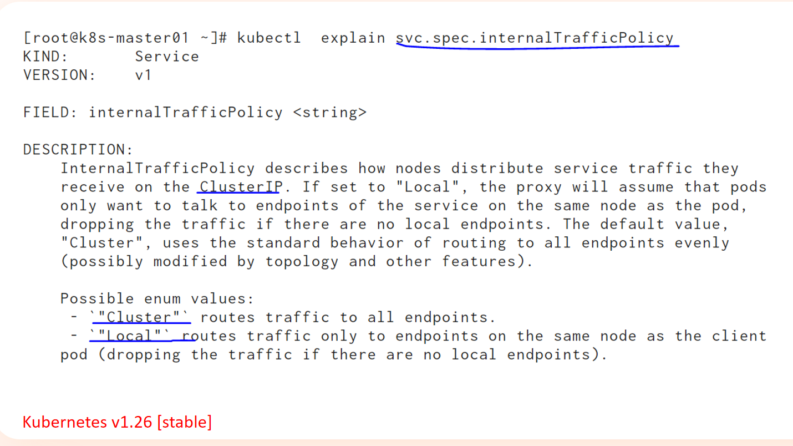


在 Kubernetes 的 Service 配置中，`internalTrafficPolicy` 是一个控制**集群内部流量路由策略**的字段，它有两个可选值：**`Cluster`** 和 **`Local`**。这个配置主要影响 Service 的 ClusterIP 流量如何被路由到后端 Pod，特别是在多节点集群中。

---

## **1. `internalTrafficPolicy: Cluster`（默认值）**
### **行为**
- **流量可以跨节点路由**：  
  Service 的请求会被均匀分发到所有可用的后端 Pod，**无论这些 Pod 是否运行在请求来源的节点上**。
- **适用于大多数场景**：  
  默认行为，确保负载均衡最大化，即使 Pod 不在同一节点上。

### **示例**
```yaml
apiVersion: v1
kind: Service
metadata:
  name: my-service
spec:
  selector:
    app: my-app
  ports:
    - protocol: TCP
      port: 80
      targetPort: 9376
  internalTrafficPolicy: Cluster  # 默认值，可省略
```

### **适用场景**
- 集群内所有 Pod 都可以处理请求，无需考虑网络延迟或跨节点流量成本。
- 适用于无状态服务（如 HTTP API、无状态微服务）。

---

## **2. `internalTrafficPolicy: Local`**
### **行为**
- **流量优先保持在本地节点**：  
  如果请求来自某个节点，Service 只会将流量路由到**同一节点上的 Pod**。如果本地没有可用的 Pod，请求会被丢弃（返回 `503 Service Unavailable`）。
- **减少跨节点流量**：  
  避免不必要的网络跳转，降低延迟和跨节点带宽消耗。

### **示例**
```yaml
apiVersion: v1
kind: Service
metadata:
  name: my-service
spec:
  selector:
    app: my-app
  ports:
    - protocol: TCP
      port: 80
      targetPort: 9376
  internalTrafficPolicy: Local  # 启用本地流量策略
```

### **适用场景**
1. **需要低延迟**：
    - 例如，Service 访问本地缓存（如 Redis、Memcached），避免跨节点网络延迟。
2. **节省跨节点带宽**：
    - 大数据处理或高吞吐量服务，减少不必要的跨节点流量。
3. **节点本地存储**：
    - 如果 Pod 依赖本地存储（如 `hostPath` 或本地 PV），必须确保请求由同一节点的 Pod 处理。

---

## **关键区别对比**
| 特性                     | `Cluster` (默认)               | `Local`                     |
|--------------------------|--------------------------------|-----------------------------|
| **流量路由范围**         | 集群范围内所有 Pod             | 仅限当前节点的 Pod          |
| **跨节点流量**           | 允许                          | 禁止（除非本地无 Pod）      |
| **请求失败处理**         | 自动重试其他节点               | 返回 `503`（如果本地无 Pod）|
| **适用场景**             | 通用无状态服务                 | 低延迟、本地存储、节省带宽  |
| **是否需要 DaemonSet？** | 否                            | 建议配合 DaemonSet 使用     |

---

## **注意事项**
1. **`Local` 模式需配合 DaemonSet**：
    - 如果使用 `Local` 策略，建议用 `DaemonSet` 部署 Pod，确保每个节点都有可用的副本，避免 `503` 错误。
2. **外部流量策略（`externalTrafficPolicy`）**：
    - `internalTrafficPolicy` 仅影响 ClusterIP 流量，而 `externalTrafficPolicy` 控制 NodePort/LoadBalancer 的流量路由（同样支持 `Cluster` 和 `Local`）。
3. **`Local` 可能降低可用性**：
    - 如果某节点的 Pod 崩溃，该节点的 Service 请求会直接失败，而不会转发到其他节点。

---

## **总结**
- **`Cluster`（默认）**：  
  通用场景，流量均匀分发，适合无状态服务。
- **`Local`**：  
  优化性能，减少跨节点流量，适合低延迟或本地存储需求，但需确保每个节点有 Pod。

根据业务需求选择合适的策略，通常默认值 `Cluster` 即可满足大多数场景！


### LVS 持久化连接

# **LVS 持久化连接（Persistent Connection）详解**

LVS（Linux Virtual Server）是 Linux 内核内置的高性能负载均衡技术，常用于 Kubernetes、OpenStack 等平台的流量分发。**持久化连接（Persistent Connection）** 是 LVS 的一项重要功能，用于确保来自同一客户端的请求在一定时间内被分配到同一台后端服务器（Real Server），适用于需要会话保持（Session Affinity）的场景。

---

## **1. 持久化连接的作用**
在标准的负载均衡策略（如轮询 `rr`、最少连接 `lc`）下，LVS 默认会将每个新请求分配给不同的后端服务器。但在某些场景下（如 HTTP 会话、数据库连接），需要确保**同一客户端的多个请求始终落到同一台后端服务器**，这就是持久化连接的作用。

### **典型应用场景**
- **HTTP 会话保持**（如购物车、登录状态）
- **数据库长连接**（避免频繁切换后端导致连接重建）
- **文件上传/下载**（确保大文件传输不中断）
- **WebSocket 连接**（保持长连接）

---

## **2. LVS 持久化连接的工作原理**
LVS 通过 **`persistence_timeout`** 参数控制持久化时间，在指定时间内，来自同一客户端的请求会被分配到同一台后端服务器。

### **持久化实现方式**
LVS 支持多种持久化方式，主要依赖 **`-p`（persistent）** 参数：
1. **基于客户端 IP 的持久化（默认）**
    - 相同源 IP 的请求会被分配到同一台后端服务器。
    - 适用于普通 HTTP/HTTPS 流量。
    - 示例：
      ```bash
      ipvsadm -A -t 192.168.1.100:80 -s rr -p 300  # 300秒持久化
      ```

2. **基于端口/协议的持久化**
    - 可结合 IP + 端口进行更细粒度的控制。
    - 适用于 FTP、RDP 等多端口协议。
    - 示例：
      ```bash
      ipvsadm -A -t 192.168.1.100:21 -s rr -p 600  # FTP 持久化600秒
      ```

3. **基于 Cookie 的持久化（适用于 HTTP）**
    - 通过应用层（如 Nginx/Apache）插入 Cookie 实现会话保持。
    - LVS 本身不直接处理 Cookie，但可以配合应用层实现。

---

## **3. 持久化连接的关键参数**
| 参数 | 说明 |
|------|------|
| `-p` 或 `--persistent` | 启用持久化模式 |
| `--persistent-timeout <秒>` | 持久化超时时间（默认 300 秒） |
| `-M` 或 `--netmask` | 定义 IP 匹配范围（如 `/24` 表示同一子网） |

### **示例：配置一个 10 分钟（600秒）的持久化服务**
```bash
ipvsadm -A -t 192.168.1.100:80 -s rr -p 600
ipvsadm -a -t 192.168.1.100:80 -r 192.168.1.2:80 -g
ipvsadm -a -t 192.168.1.100:80 -r 192.168.1.3:80 -g
```
- `-A`：添加虚拟服务（VIP）。
- `-a`：添加后端 Real Server。
- `-s rr`：使用轮询调度算法。
- `-p 600`：持久化超时 600 秒。
- `-g`：使用 DR（Direct Routing）模式。

---

## **4. 持久化连接 vs. 会话保持（Session Affinity）**
| 特性 | LVS 持久化连接 | 应用层会话保持（如 Nginx/Apache） |
|------|--------------|-----------------------------|
| **实现层级** | 传输层（L4） | 应用层（L7） |
| **依赖** | 客户端 IP 或端口 | HTTP Cookie / Header |
| **灵活性** | 较简单，仅基于 IP/端口 | 更灵活，可基于 Cookie、URL 等 |
| **适用协议** | TCP/UDP | HTTP/HTTPS |
| **典型用例** | 数据库连接、FTP | Web 会话（如登录状态） |

---

## **5. 持久化连接的优缺点**
### **✅ 优点**
- **减少连接重建开销**（如数据库、WebSocket）。
- **确保会话一致性**（如 HTTP 购物车）。
- **适用于非 HTTP 协议**（如 FTP、RDP）。

### **❌ 缺点**
- **可能导致负载不均**（某些客户端长期占用同一后端）。
- **不适用于动态 IP 环境**（如移动端 NAT）。
- **需合理设置超时时间**（过长影响弹性，过短失去意义）。

---

## **6. 在 Kubernetes 中的应用**
Kubernetes 的 `kube-proxy` 默认使用 `iptables` 或 `ipvs` 模式做负载均衡。如果使用 **`ipvs` 模式**，可以通过 `service.spec.sessionAffinity` 实现类似功能：
```yaml
apiVersion: v1
kind: Service
metadata:
  name: my-service
spec:
  selector:
    app: my-app
  ports:
    - protocol: TCP
      port: 80
      targetPort: 9376
  sessionAffinity: ClientIP  # 基于客户端 IP 的会话保持
  sessionAffinityConfig:
    clientIP:
      timeoutSeconds: 3600  # 1小时超时
```

---

## **7. 总结**
- **LVS 持久化连接** 主要用于 L4 层的会话保持，基于 **IP/端口** 分配请求。
- **适用场景**：数据库、FTP、RDP、WebSocket 等需要稳定连接的服务。
- **关键参数**：`-p`（持久化）、`--persistent-timeout`（超时时间）。
- **在 Kubernetes 中**，可通过 `sessionAffinity: ClientIP` 实现类似功能。

合理使用持久化连接可以提升服务稳定性，但需注意负载均衡的公平性！

# **LVS 持久化连接 vs. SH（源哈希）调度算法对比**

LVS（Linux Virtual Server）提供了多种负载均衡调度算法，其中 **持久化连接（Persistent Connection）** 和 **SH（Source Hashing，源哈希）算法** 都可以用于会话保持（Session Affinity），但它们的实现方式和适用场景有所不同。以下是详细对比：

---

## **1. 核心概念对比**
| 特性                | **LVS 持久化连接（-p）**                     | **SH（Source Hashing）调度算法**          |
|---------------------|--------------------------------------------|------------------------------------------|
| **实现方式**        | 基于时间窗口（`persistence_timeout`）       | 基于哈希计算（固定映射）                  |
| **调度算法依赖**    | 可与 `rr`（轮询）、`lc`（最少连接）等结合   | 本身就是一种调度算法（`-s sh`）           |
| **会话保持机制**    | 在一定时间内，相同客户端 IP 分配到同一后端   | 通过哈希计算，相同客户端 IP 永远固定分配  |
| **动态调整能力**    | 超时后可重新分配                            | 除非后端服务器变化，否则分配关系不变      |
| **适用协议**        | TCP/UDP（L4 层）                           | TCP/UDP（L4 层）                         |

---

## **2. 工作机制对比**
### **(1) LVS 持久化连接（-p）**
- 通过 `-p <timeout>` 参数启用，例如 `-p 300` 表示 300 秒内保持连接。
- **优点**：
    - 灵活性强，超时后可以重新分配后端。
    - 适用于需要**临时会话保持**的场景（如 HTTP 短连接）。
- **缺点**：
    - 如果超时时间设置不合理，可能导致连接过早切换或长期占用。

**示例：**
```bash
ipvsadm -A -t 192.168.1.100:80 -s rr -p 300  # 300秒持久化
```

### **(2) SH（Source Hashing）算法**
- 通过 `-s sh` 指定调度算法，基于**客户端 IP 的哈希值**固定分配后端。
- **优点**：
    - 分配关系稳定，适合**长连接场景**（如数据库、SSH）。
    - 无超时限制，客户端 IP 和后端服务器的绑定关系长期不变。
- **缺点**：
    - 缺乏动态调整能力，如果后端服务器宕机，可能导致哈希失衡。
    - 不适用于**客户端 IP 频繁变化**的环境（如移动端 NAT）。

**示例：**
```bash
ipvsadm -A -t 192.168.1.100:80 -s sh  # 使用 SH 算法
```

---

## **3. 适用场景对比**
| **场景**                | **推荐方式**              | **原因**                                                                 |
|-------------------------|--------------------------|--------------------------------------------------------------------------|
| HTTP 短连接（会话保持） | LVS 持久化连接（`-p`）    | 灵活控制超时时间，避免长期占用后端。                                     |
| 数据库长连接            | SH 算法（`-s sh`）        | 固定分配，避免连接重建开销。                                             |
| 动态 IP 环境（如移动端）| LVS 持久化连接（`-p`）    | SH 算法对 IP 变化敏感，可能导致分配不均。                                |
| 高可用集群（后端可变）  | LVS 持久化连接（`-p`）    | SH 算法在后端服务器变化时需重新计算哈希，可能导致短暂服务中断。          |

---

## **4. 与其他调度算法的结合**
### **(1) LVS 持久化连接 + 轮询（rr）**
```bash
ipvsadm -A -t 192.168.1.100:80 -s rr -p 300
```
- 在持久化超时窗口内，同一客户端 IP 的请求固定分配到一个后端；超时后重新轮询。

### **(2) SH 算法（独立使用）**
```bash
ipvsadm -A -t 192.168.1.100:80 -s sh
```
- 完全依赖哈希计算，无超时机制。

---

## **5. 在 Kubernetes 中的类比**
- **LVS 持久化连接** ≈ Kubernetes `service.spec.sessionAffinity: ClientIP`  
  （基于时间窗口的会话保持）
- **SH 算法** ≈ Kubernetes `service.spec.sessionAffinity: ClientIP` + **固定哈希**  
  （无超时时间，完全依赖 IP 哈希）

**Kubernetes 示例：**
```yaml
apiVersion: v1
kind: Service
metadata:
  name: my-service
spec:
  sessionAffinity: ClientIP
  sessionAffinityConfig:
    clientIP:
      timeoutSeconds: 3600  # 类似 LVS 的 -p 3600
```

---

## **6. 总结**
| **需求**                | **选择**                  |
|-------------------------|--------------------------|
| 需要灵活会话保持（如 HTTP） | LVS 持久化连接（`-p`）    |
| 需要固定分配（如数据库）    | SH 算法（`-s sh`）        |
| 后端服务器可能动态变化      | LVS 持久化连接（`-p`）    |
| 客户端 IP 固定且长期连接    | SH 算法（`-s sh`）        |

**最终建议**：
- 如果是 **短连接 + 临时会话保持** → **LVS 持久化连接（`-p`）**。
- 如果是 **长连接 + 固定分配** → **SH 算法（`-s sh`）**。
- 在 Kubernetes 中，优先使用 `sessionAffinity: ClientIP`，它更接近 LVS 持久化连接的行为。


### 会话保持(IPVS持久化连接)

执行

```bash
[root@k8s-master01 6.1]# kubectl edit svc myapp-clusterip
```

将`service.spec.sessionAffinity:None`改成`service.spec.sessionAffinity:ClientIP`


这段命令和操作的含义是：**修改 Kubernetes 中名为 `myapp-clusterip` 的 Service，将其会话亲和性（Session Affinity）从 `None`（无会话保持）改为 `ClientIP`（基于客户端 IP 的会话保持）**。以下是详细解释：

---

### **1. 命令解析**
```bash
kubectl edit svc myapp-clusterip
```
- **作用**：交互式编辑名为 `myapp-clusterip` 的 Service 配置。
- 执行后会打开一个临时文件（如 `vi` 或 `nano`），允许直接修改 YAML 定义。

---

### **2. 修改内容**
```yaml
service.spec.sessionAffinity: None   →   service.spec.sessionAffinity: ClientIP
```
- **`sessionAffinity`**：控制 Service 的会话保持策略，有两个可选值：
    - **`None`**（默认）：不启用会话保持，请求可能被随机分配到不同 Pod。
    - **`ClientIP`**：基于客户端 IP 地址进行会话保持，**同一客户端的请求始终被路由到同一个 Pod**。

---

### **3. 修改后的效果**
- **启用 `ClientIP` 后**：
    - 来自同一客户端 IP 的所有请求（如 HTTP 连接）会被固定分配到同一个后端 Pod。
    - 适用于需要会话状态（Session）的服务，例如：
        - 用户登录状态（如购物车、身份认证）。
        - 文件上传/下载（避免中断）。
        - WebSocket 长连接。
- **默认超时时间**：`10800` 秒（3 小时），可通过 `sessionAffinityConfig` 调整：
  ```yaml
  spec:
    sessionAffinity: ClientIP
    sessionAffinityConfig:
      clientIP:
        timeoutSeconds: 3600  # 自定义超时时间（单位：秒）
  ```

---

### **4. 底层实现原理**
- Kubernetes 的 `kube-proxy` 会根据 `ClientIP` 策略：
    1. 对客户端 IP 进行哈希计算。
    2. 将哈希结果映射到后端 Pod 列表中的一个固定 Pod。
    3. **在超时时间内**，相同 IP 的请求始终命中该 Pod。

---

### **5. 对比其他会话保持方式**
| 方式                | 适用场景                     | 优缺点                                  |
|---------------------|----------------------------|----------------------------------------|
| **`None`**          | 无状态服务（如静态网站）     | 负载均衡更均匀，但无法保持会话。        |
| **`ClientIP`**      | 需要会话状态的服务           | 会话保持，但可能导致负载不均。          |
| **Cookie 会话保持** | 七层代理（如 Ingress/Nginx） | 更灵活，但需应用层支持（非 L4 层功能）。|

---

### **6. 注意事项**
1. **负载均衡影响**：  
   `ClientIP` 可能导致某些 Pod 负载较高（如大量请求来自同一 IP）。
2. **Pod 扩缩容**：  
   如果 Pod 数量变化（如扩容/缩容），哈希映射会重新计算，部分连接可能被重新分配。
3. **IP 变化问题**：  
   如果客户端 IP 发生变化（如移动网络切换），会话会丢失。

---

### **7. 示例场景**
假设有一个电商网站，用户登录后需要保持会话：
- **`sessionAffinity: None`**：  
  用户刷新页面时可能被分配到不同 Pod，导致登录状态丢失。
- **`sessionAffinity: ClientIP`**：  
  用户的所有请求始终由同一 Pod 处理，会话状态保持稳定。

---

### **总结**
- **为什么修改？**  
  为了确保客户端请求的会话一致性（如 HTTP 登录状态）。
- **修改后的影响**：  
  同一 IP 的请求固定访问同一 Pod，但需监控负载均衡是否均匀。
- **替代方案**：  
  如果需要更灵活的会话保持（如基于 Cookie），建议使用 **Ingress 或 Service Mesh**（如 Nginx、Istio）。


```bash
[root@k8s-master01 6.1]# kubectl explain svc.spec.sessionAffinityConfig.clientIP
KIND:       Service
VERSION:    v1

FIELD: clientIP <ClientIPConfig>

DESCRIPTION:
    clientIP contains the configurations of Client IP based session affinity.
    ClientIPConfig represents the configurations of Client IP based session
    affinity.
    
FIELDS:
  timeoutSeconds	<integer>
    timeoutSeconds specifies the seconds of ClientIP type session sticky time.
    The value must be >0 && <=86400(for 1 day) if ServiceAffinity == "ClientIP".
    Default value is 10800(for 3 hours).


```


```bash
[root@k8s-master01 6.1]# ipvsadm -Ln
IP Virtual Server version 1.2.1 (size=4096)
Prot LocalAddress:Port Scheduler Flags
  -> RemoteAddress:Port           Forward Weight ActiveConn InActConn
TCP  10.0.0.1:443 rr
  -> 192.168.120.11:6443          Masq    1      0          0         
TCP  10.0.0.10:53 rr
  -> 10.244.32.138:53             Masq    1      0          0         
  -> 10.244.32.139:53             Masq    1      0          0         
TCP  10.0.0.10:9153 rr
  -> 10.244.32.138:9153           Masq    1      0          0         
  -> 10.244.32.139:9153           Masq    1      0          0         
TCP  10.13.13.181:5473 rr
  -> 192.168.120.12:5473          Masq    1      0          0         
TCP  10.15.212.21:80 rr persistent 10800
  -> 10.244.58.253:80             Masq    1      0          0         
  -> 10.244.58.254:80             Masq    1      0          0         
  -> 10.244.85.236:80             Masq    1      0          0         
UDP  10.0.0.10:53 rr
  -> 10.244.32.138:53             Masq    1      0          0         
  -> 10.244.32.139:53             Masq    1      0          0  
```


### Service - NodePort - 结构


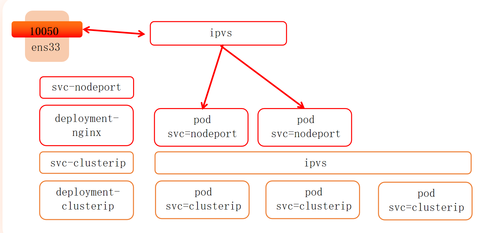


#### 5.deployment.yaml

```yaml
apiVersion: apps/v1
kind: Deployment
metadata:
  name: myapp-nodeport-deploy
  namespace: default
spec:
  replicas: 3
  selector:
    matchLabels:
      app: myapp
      release: stable  
      svc: nodeport
  template:
    metadata:
      labels:
        app: myapp
        release: stable       
        svc: nodeport
    spec:
      imagePullSecrets:
      - name: aliyun-secret
      containers:
      - name: myapp-container
        image: crpi-cd1z0kbw072xy0ao.cn-guangzhou.personal.cr.aliyuncs.com/tangfire/myversion:v1
        imagePullPolicy: IfNotPresent
        ports:
        - name: http
          containerPort: 80
```

```bash
[root@k8s-master01 6.1]# kubectl get pod
NAME                                     READY   STATUS    RESTARTS   AGE
myapp-nodeport-deploy-64f45bd56b-nf7qp   1/1     Running   0          7s
myapp-nodeport-deploy-64f45bd56b-qkfnw   1/1     Running   0          7s
myapp-nodeport-deploy-64f45bd56b-r7kbj   1/1     Running   0          7s
```

#### 6.nodeport.yaml


```yaml
apiVersion: v1
kind: Service
metadata:
  name: myapp-nodeport
  namespace: default
spec:
  type: NodePort
  selector:
    app: myapp
    release: stable
    svc: nodeport
  ports:
    - name: http
      port: 80
      targetPort: 80
      nodePort: 30010
```


```bash
[root@k8s-master01 6.1]# kubectl get svc
NAME              TYPE        CLUSTER-IP     EXTERNAL-IP   PORT(S)        AGE
kubernetes        ClusterIP   10.0.0.1       <none>        443/TCP        6d12h
myapp-nodeport    NodePort    10.1.41.58     <none>        80:30010/TCP   6s
```

```bash
[root@k8s-master01 6.1]# ipvsadm -Ln
IP Virtual Server version 1.2.1 (size=4096)
Prot LocalAddress:Port Scheduler Flags
  -> RemoteAddress:Port           Forward Weight ActiveConn InActConn
TCP  172.17.0.1:30010 rr
  -> 10.244.58.192:80             Masq    1      0          0         
  -> 10.244.58.255:80             Masq    1      0          0         
  -> 10.244.85.237:80             Masq    1      0          0         
TCP  192.168.120.11:30010 rr
  -> 10.244.58.192:80             Masq    1      0          0         
  -> 10.244.58.255:80             Masq    1      0          0         
  -> 10.244.85.237:80             Masq    1      0          0         
TCP  10.0.0.1:443 rr
  -> 192.168.120.11:6443          Masq    1      0          0         
TCP  10.0.0.10:53 rr
  -> 10.244.32.138:53             Masq    1      0          0         
  -> 10.244.32.139:53             Masq    1      0          0         
TCP  10.0.0.10:9153 rr
  -> 10.244.32.138:9153           Masq    1      0          0         
  -> 10.244.32.139:9153           Masq    1      0          0         
TCP  10.1.41.58:80 rr
  -> 10.244.58.192:80             Masq    1      0          0         
  -> 10.244.58.255:80             Masq    1      0          0         
  -> 10.244.85.237:80             Masq    1      0          0         
TCP  10.13.13.181:5473 rr
  -> 192.168.120.12:5473          Masq    1      0          0         
TCP  10.15.212.21:80 rr persistent 10800
  -> 10.244.58.253:80             Masq    1      0          0         
  -> 10.244.58.254:80             Masq    1      0          0         
  -> 10.244.85.236:80             Masq    1      0          0         
UDP  10.0.0.10:53 rr
  -> 10.244.32.138:53             Masq    1      0          0         
  -> 10.244.32.139:53             Masq    1      0          0      
```

```bash
[root@k8s-master01 6.1]# curl 10.1.41.58:80
<!DOCTYPE html>
<html>
<head>
    <title>Nginx Version</title>
</head>
<body>
    <h1>当前版本: v1.0</h1>
    <p>这是自定义的 Nginx 镜像</p>
</body>
</html>
```

```bash
[root@k8s-master01 6.1]# ip addr show
1: lo: <LOOPBACK,UP,LOWER_UP> mtu 65536 qdisc noqueue state UNKNOWN group default qlen 1000
    link/loopback 00:00:00:00:00:00 brd 00:00:00:00:00:00
    inet 127.0.0.1/8 scope host lo
       valid_lft forever preferred_lft forever
    inet6 ::1/128 scope host 
       valid_lft forever preferred_lft forever
2: ens160: <BROADCAST,MULTICAST,UP,LOWER_UP> mtu 1500 qdisc mq state UP group default qlen 1000
    link/ether 00:0c:29:c6:d6:6b brd ff:ff:ff:ff:ff:ff
    altname enp3s0
    inet 192.168.120.11/24 brd 192.168.120.255 scope global noprefixroute ens160
       valid_lft forever preferred_lft forever
    inet6 fe80::20c:29ff:fec6:d66b/64 scope link noprefixroute 
       valid_lft forever preferred_lft forever
3: ens192: <BROADCAST,MULTICAST,UP,LOWER_UP> mtu 1500 qdisc mq state UP group default qlen 1000
    link/ether 00:0c:29:c6:d6:75 brd ff:ff:ff:ff:ff:ff
    altname enp11s0
4: docker0: <BROADCAST,MULTICAST,UP,LOWER_UP> mtu 1500 qdisc noqueue state UP group default 
    link/ether 4e:03:00:27:d0:69 brd ff:ff:ff:ff:ff:ff
    inet 172.17.0.1/16 brd 172.17.255.255 scope global docker0
       valid_lft forever preferred_lft forever
    inet6 fe80::4c03:ff:fe27:d069/64 scope link 
       valid_lft forever preferred_lft forever
16: calif3921b98ee7@if3: <BROADCAST,MULTICAST,UP,LOWER_UP> mtu 1500 qdisc noqueue state UP group default qlen 1000
    link/ether ee:ee:ee:ee:ee:ee brd ff:ff:ff:ff:ff:ff link-netnsid 0
    inet6 fe80::ecee:eeff:feee:eeee/64 scope link 
       valid_lft forever preferred_lft forever
17: cali702a7bce811@if3: <BROADCAST,MULTICAST,UP,LOWER_UP> mtu 1500 qdisc noqueue state UP group default qlen 1000
    link/ether ee:ee:ee:ee:ee:ee brd ff:ff:ff:ff:ff:ff link-netnsid 1
    inet6 fe80::ecee:eeff:feee:eeee/64 scope link 
       valid_lft forever preferred_lft forever
18: cali6f6020ede3d@if3: <BROADCAST,MULTICAST,UP,LOWER_UP> mtu 1500 qdisc noqueue state UP group default qlen 1000
    link/ether ee:ee:ee:ee:ee:ee brd ff:ff:ff:ff:ff:ff link-netnsid 2
    inet6 fe80::ecee:eeff:feee:eeee/64 scope link 
       valid_lft forever preferred_lft forever
25: veth6838dbe@if2: <BROADCAST,MULTICAST,UP,LOWER_UP> mtu 1500 qdisc noqueue master docker0 state UP group default 
    link/ether 7e:32:12:ec:a5:27 brd ff:ff:ff:ff:ff:ff link-netnsid 3
    inet6 fe80::7c32:12ff:feec:a527/64 scope link 
       valid_lft forever preferred_lft forever
30: kube-ipvs0: <BROADCAST,NOARP> mtu 1500 qdisc noop state DOWN group default 
    link/ether 66:99:80:3c:64:9a brd ff:ff:ff:ff:ff:ff
    inet 10.0.0.1/32 scope global kube-ipvs0
       valid_lft forever preferred_lft forever
    inet 10.13.13.181/32 scope global kube-ipvs0
       valid_lft forever preferred_lft forever
    inet 10.0.0.10/32 scope global kube-ipvs0
       valid_lft forever preferred_lft forever
    inet 10.15.212.21/32 scope global kube-ipvs0
       valid_lft forever preferred_lft forever
    inet 10.1.41.58/32 scope global kube-ipvs0
       valid_lft forever preferred_lft forever
```

同样我们可以发现，nodeport就是将我们当前的物理网卡，做了一个负载均衡集群，负载到当前每个pod上

```bash
[root@k8s-master01 6.1]# ipvsadm -Ln | grep 30010
TCP  172.17.0.1:30010 rr
TCP  192.168.120.11:30010 rr
[root@k8s-master01 6.1]# 
[root@k8s-master01 6.1]# 
[root@k8s-master01 6.1]# ip addr show | grep 172.17.0.1
    inet 172.17.0.1/16 brd 172.17.255.255 scope global docker0
[root@k8s-master01 6.1]# ip addr show | grep 192.168.120.11
    inet 192.168.120.11/24 brd 192.168.120.255 scope global noprefixroute ens160
```

```bash
[root@k8s-master01 6.1]# kubectl get pod -o wide
NAME                                     READY   STATUS    RESTARTS   AGE   IP              NODE         NOMINATED NODE   READINESS GATES
myapp-nodeport-deploy-64f45bd56b-nf7qp   1/1     Running   0          42m   10.244.58.255   k8s-node02   <none>           <none>
myapp-nodeport-deploy-64f45bd56b-qkfnw   1/1     Running   0          42m   10.244.85.237   k8s-node01   <none>           <none>
myapp-nodeport-deploy-64f45bd56b-r7kbj   1/1     Running   0          42m   10.244.58.192   k8s-node02   <none>           <none>
```


---

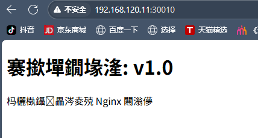


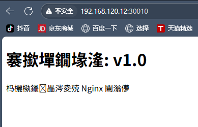


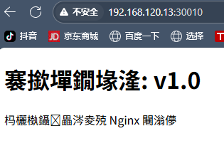


---


在 `kubectl get svc` 的输出中，`80:30010/TCP` 是 Kubernetes **NodePort 类型服务**的端口映射信息，具体含义如下：

---

### **`80:30010/TCP` 的组成**
| 部分       | 说明                                                                 |
|------------|----------------------------------------------------------------------|
| `80`       | **Service 的集群内部端口**（ClusterIP 端口）                         |
| `30010`    | **节点的外部暴露端口**（NodePort 端口）                              |
| `TCP`      | 使用的协议类型（这里是 TCP）                                        |

---

### **详细解释**
1. **`80`（ClusterIP 端口）**
    - 集群内其他 Pod 或服务通过该端口访问 `myapp-nodeport` 服务。
    - 例如：在集群内访问 `10.1.41.58:80`（ClusterIP + 端口）即可访问后端 Pod。

2. **`30010`（NodePort 端口）**
    - Kubernetes 会在所有节点（Master 和 Worker）上开放此端口。
    - 外部用户通过任意节点的 `IP:30010` 访问服务（如 `http://<节点IP>:30010`）。
    - NodePort 的默认范围是 `30000-32767`，此处显式指定为 `30010`。

3. **`TCP`**
    - 表示服务仅支持 TCP 协议（如果是 HTTP 服务，底层仍使用 TCP）。

---

### **流量流向**
1. **外部访问**：
   ```mermaid
   graph LR
   A[用户] -->|访问节点IP:30010| B[Kubernetes 节点]
   B -->|转发到 ClusterIP:80| C[Service]
   C -->|负载均衡| D[后端 Pod 的 80 端口]
   ```

2. **内部访问**：  
   集群内直接通过 `myapp-nodeport.default.svc.cluster.local:80` 或 `10.1.41.58:80` 访问。

---

### **关联配置**
- 对应的 Service YAML 中会有如下定义：
  ```yaml
  ports:
    - port: 80       # ClusterIP 端口
      targetPort: 80 # Pod 的容器端口
      nodePort: 30010 # 节点端口
  ```

---

### **总结**
- **`80:30010/TCP` 表示**：
    - 集群内用 `80` 端口访问服务，集群外通过节点的 `30010` 端口访问。
    - 所有流量最终会被路由到后端 Pod 的 `80` 端口（由 `targetPort` 指定）。


---


### **Kubernetes Deployment 和 Service 的关系解析**
两个 YAML 文件分别定义了 **Deployment** 和 **Service**，并通过 `80:30010/TCP` 建立关联。以下是它们的协作关系：

---

## **1. Deployment（应用部署）**
```yaml
apiVersion: apps/v1
kind: Deployment
metadata:
  name: myapp-nodeport-deploy
  namespace: default
spec:
  replicas: 3
  selector:
    matchLabels:
      app: myapp
      release: stable  
      svc: nodeport
  template:
    metadata:
      labels:
        app: myapp
        release: stable       
        svc: nodeport
    spec:
      imagePullSecrets:
      - name: aliyun-secret
      containers:
      - name: myapp-container
        image: crpi-cd1z0kbw072xy0ao.cn-guangzhou.personal.cr.aliyuncs.com/tangfire/myversion:v1
        imagePullPolicy: IfNotPresent
        ports:
        - name: http
          containerPort: 80
```
#### **关键点**
- **Pod 副本数**：`replicas: 3`，表示运行 3 个 Pod。
- **Pod 标签**：`app: myapp`、`release: stable`、`svc: nodeport`（Service 靠这些标签选择 Pod）。
- **容器端口**：`containerPort: 80`，Pod 内的应用监听 80 端口。

---

## **2. Service（服务暴露）**
```yaml
apiVersion: v1
kind: Service
metadata:
  name: myapp-nodeport
  namespace: default
spec:
  type: NodePort
  selector:
    app: myapp
    release: stable  
    svc: nodeport
  ports:
    - name: http
      port: 80       # Service 的集群内部端口（ClusterIP）
      targetPort: 80 # 转发到 Pod 的 80 端口
      nodePort: 30010 # 节点暴露的端口
```
#### **关键点**
- **Service 类型**：`NodePort`，允许外部通过节点 IP + 端口访问。
- **端口映射**：
    - `port: 80` → Service 在集群内的端口（如 `10.1.41.58:80`）。
    - `targetPort: 80` → 转发到 Pod 的 `containerPort: 80`。
    - `nodePort: 30010` → 节点对外暴露的端口（如 `http://<节点IP>:30010`）。

---

## **3. `80:30010/TCP` 的关系**
在 `kubectl get svc` 输出中，`80:30010/TCP` 表示：
| 部分       | 说明                                                                 |
|------------|----------------------------------------------------------------------|
| `80`       | **Service 的集群内部端口**（`port: 80`）                            |
| `30010`    | **节点的外部暴露端口**（`nodePort: 30010`）                          |
| `TCP`      | 协议类型                                                            |

#### **流量流向**
1. **外部访问**：用户访问 `<节点IP>:30010` → Service → 负载均衡到 3 个 Pod 的 `80` 端口。
2. **集群内访问**：其他 Pod 通过 `myapp-nodeport.default.svc.cluster.local:80` 或 `ClusterIP:80` 访问。

---


---

### **总结**
- **`80:30010/TCP`** 是 Service 的端口映射，表示：
    - 集群内通过 `80` 访问。
    - 集群外通过 `30010` 访问。
- **Deployment 和 Service 通过标签（`app: myapp`、`svc: nodeport`、`release: stable`）关联**。


---


### Service - externalTrafficPolicy


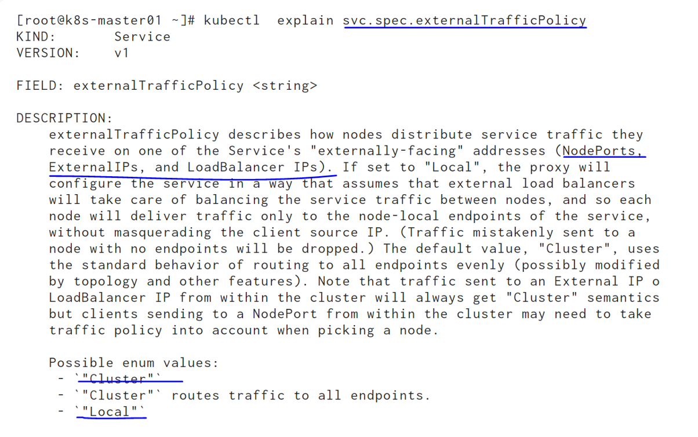


### **Kubernetes Service `externalTrafficPolicy` 详解**

`externalTrafficPolicy` 是 Kubernetes **Service** 的一个关键配置项，用于控制**外部流量**（通过 `NodePort` 或 `LoadBalancer` 类型 Service 进入的流量）如何路由到后端 Pod。它有两个可选值：
1. **`Cluster`**（默认值）
2. **`Local`**

---

## **1. `externalTrafficPolicy: Cluster`（默认）**
#### **行为特点**
- **流量可能跨节点转发**：  
  外部请求到达某个节点后，如果该节点没有运行目标 Pod，流量会被转发到其他有 Pod 的节点。
- **保留客户端 IP**：  
  客户端的原始 IP 会被替换为节点的 IP（需要通过 `service.spec.loadBalancerSourceRanges` 或网络插件额外配置才能保留）。
- **负载均衡**：  
  流量均匀分布到所有 Pod，无论 Pod 在哪个节点。

#### **适用场景**
- 需要均匀分配流量到所有 Pod。
- 不严格要求保留客户端原始 IP。

#### **示例配置**
```yaml
apiVersion: v1
kind: Service
metadata:
  name: my-service
spec:
  type: NodePort
  externalTrafficPolicy: Cluster  # 默认值，可省略
  ports:
    - port: 80
      targetPort: 80
  selector:
    app: myapp
```

---

## **2. `externalTrafficPolicy: Local`**
#### **行为特点**
- **流量不跨节点转发**：  
  外部请求到达某个节点后，**仅转发给该节点上运行的 Pod**。如果节点没有 Pod，请求会被丢弃（返回 `Connection refused`）。
- **保留客户端 IP**：  
  客户端的原始 IP 会直接传递给 Pod（无需额外配置）。
- **负载均衡不均衡**：  
  流量只分发给接收请求的节点上的 Pod，可能导致负载不均。

#### **适用场景**
- 需要保留客户端原始 IP（如审计、日志记录）。
- 避免跨节点流量（节省网络开销或满足网络策略）。
- 使用本地缓存或节点亲和性（如 DaemonSet 部署的 Pod）。

#### **示例配置**
```yaml
apiVersion: v1
kind: Service
metadata:
  name: my-service
spec:
  type: NodePort
  externalTrafficPolicy: Local  # 显式指定
  ports:
    - port: 80
      targetPort: 80
  selector:
    app: myapp
```

---

## **3. 核心区别对比**
| 特性                     | `Cluster` (默认)               | `Local`                        |
|--------------------------|--------------------------------|--------------------------------|
| **流量是否跨节点**       | ✅ 是（可能转发到其他节点）     | ❌ 否（仅本地 Pod）             |
| **客户端 IP 保留**       | ❌ 默认不保留（需额外配置）     | ✅ 自动保留                    |
| **负载均衡**             | ✅ 均匀分布到所有 Pod          | ❌ 仅本地 Pod，可能不均衡       |
| **健康检查影响**         | 依赖 kube-proxy 的健康检查     | 依赖节点上的 Pod 是否存在      |

---

## **4. 实际影响示例**
### **场景 1：`externalTrafficPolicy: Cluster`**
- 有 3 个节点，其中 2 个节点运行 Pod。
- 请求到达没有 Pod 的节点时，会被转发到其他节点。
- **结果**：所有 Pod 都可能接收流量，但客户端 IP 可能丢失。

### **场景 2：`externalTrafficPolicy: Local`**
- 有 3 个节点，其中 2 个节点运行 Pod。
- 请求到达没有 Pod 的节点时，直接拒绝连接。
- **结果**：只有运行 Pod 的节点能处理流量，客户端 IP 被保留。

---

## **5. 如何选择？**
- 选 **`Cluster`**：
    - 需要简单的负载均衡。
    - 不关心客户端 IP。
- 选 **`Local`**：
    - 需要客户端真实 IP（如日志、安全策略）。
    - 避免跨节点流量（如节点本地缓存）。

---

## **6. 注意事项**
1. **`Local` 模式可能导致流量不均**：
    - 如果 Pod 分布不均匀，某些节点可能负载过高。
    - 解决方案：配合 `PodAntiAffinity` 或 `DaemonSet` 使用。
2. **`LoadBalancer` 服务的特殊行为**：
    - 云厂商的 LoadBalancer 可能根据 `externalTrafficPolicy` 调整流量路由逻辑。
3. **健康检查**：
    - `Local` 模式下，Service 仅将流量发给健康的节点上的 Pod。

---

### **总结**
- **`externalTrafficPolicy` 控制外部流量的路由和客户端 IP 保留**。
- **默认 `Cluster` 适合通用场景**，而 **`Local` 适合需要客户端 IP 或避免跨节点流量的场景**。
- 生产环境中，根据需求谨慎选择，并测试流量分布和 IP 保留效果。


### LAAS

### **LAAS（Location as a Service）详解**

LAAS（**Location as a Service**，位置即服务）是一种基于云计算的定位服务模式，通过 API 或 SDK 提供**地理位置数据**和**相关功能**，使开发者无需自建定位基础设施即可集成地图、导航、地理围栏等功能。以下是其核心内容：

---

## **1. LAAS 的核心功能**
| 功能                | 说明                                                                 |
|---------------------|----------------------------------------------------------------------|
| **地理编码/逆编码** | 将地址转换为经纬度（如“北京市海淀区” → `116.3, 39.9`），或反向解析。 |
| **路径规划**        | 提供驾车、步行、骑行等导航路线（如高德、Google Maps 的路线计算）。   |
| **地理围栏**        | 设定虚拟边界，触发进出区域的事件（如共享单车电子围栏）。             |
| **位置搜索**        | 基于关键词或类别搜索附近 POI（如“附近的加油站”）。                   |
| **实时定位**        | 追踪设备或用户的实时位置（如物流跟踪、外卖员位置）。                  |

---

## **2. LAAS 的主要提供商**
| 服务商        | 特点                                                                 |
|---------------|----------------------------------------------------------------------|
| **Google Maps Platform** | 全球覆盖，高精度，支持丰富的 API（如 Places API、Directions API）。 |
| **高德地图开放平台**     | 中国本土化数据，支持车道级导航、逆地理编码等。                       |
| **百度地图开放平台**     | 国内市场份额高，提供 LBS 云存储、轨迹分析等扩展功能。                |
| **Mapbox**             | 高度可定制的地图渲染，适合开发者深度集成。                          |
| **Here Technologies**  | 专注企业级服务，如车载导航、物流优化。                              |

---

## **3. LAAS 的技术实现**
### **（1）数据来源**
- **卫星定位**（GPS、北斗）：提供基础经纬度数据。
- **Wi-Fi/蓝牙信标**：辅助室内定位。
- **蜂窝基站三角测量**：弥补 GPS 信号盲区。
- **众包数据**：通过用户设备反馈实时路况、POI 更新。

### **（2）典型架构**
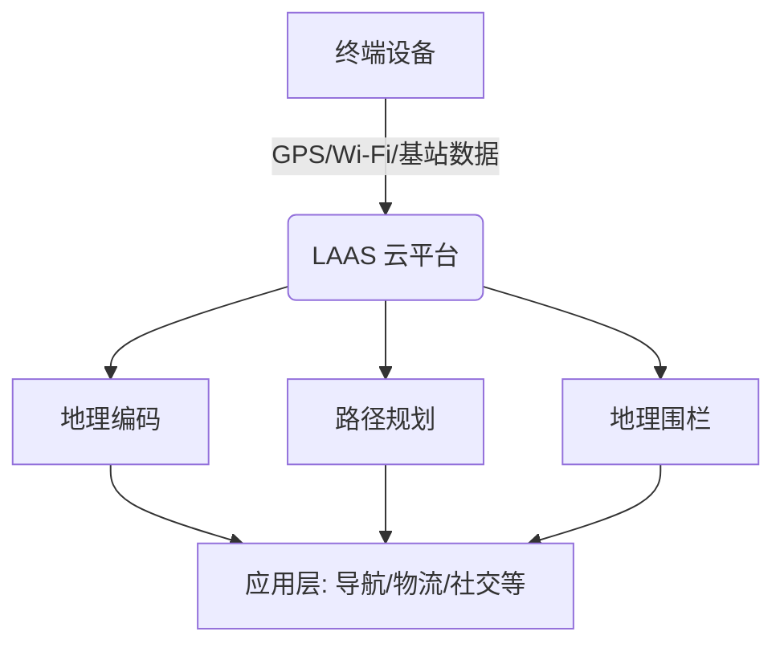
```mermaid
graph TB
A[终端设备] -->|GPS/Wi-Fi/基站数据| B(LAAS 云平台)
B --> C[地理编码]
B --> D[路径规划]
B --> E[地理围栏]
C & D & E --> F[应用层: 导航/物流/社交等]
```

---

## **4. LAAS 的应用场景**
| 行业       | 用例                                                                 |
|------------|----------------------------------------------------------------------|
| **出行**   | 网约车（如滴滴）、共享单车（如美团单车）的实时调度。                 |
| **物流**   | 快递轨迹跟踪、配送路线优化（如顺丰、京东）。                         |
| **社交**   | 附近的人、签到打卡（如微信“附近的人”）。                            |
| **零售**   | 基于位置的广告推送（如走进商场后收到优惠券）。                       |
| **IoT**    | 资产追踪（如集装箱、冷链运输监控）。                                |

---

## **5. LAAS 的优势与挑战**
### **优势**
- **降低成本**：无需自研定位算法或维护地图数据。
- **快速集成**：通过 API 即可调用成熟服务。
- **高精度**：依赖专业服务商的多源数据融合。

### **挑战**
- **隐私问题**：需合规处理用户位置数据（如 GDPR）。
- **依赖网络**：离线场景下功能受限。
- **费用模型**：高频调用可能导致成本上升（如 Google Maps 按请求收费）。

---

## **6. LAAS vs. 传统定位方案**
| 对比项         | LAAS                          | 传统自建方案                     |
|----------------|-------------------------------|----------------------------------|
| **开发成本**   | 低（直接调用 API）            | 高（需开发算法、采集地图数据）   |
| **维护成本**   | 由服务商负责更新              | 需持续维护基础设施               |
| **灵活性**     | 受限于服务商功能              | 可完全自定义                     |
| **适用场景**   | 通用型应用                    | 特殊需求（如军事、保密场景）     |

---

### **总结**
LAAS 通过云计算将**地理位置能力**标准化、服务化，成为现代应用（如导航、物流、社交）的底层支撑。选择 LAAS 时需权衡**数据精度、成本、合规性**，并结合业务需求选择服务商（如国内用高德/百度，全球用 Google/Mapbox）。


### Service - LoadBalancer - 结构(要在云供应商的环境中使用)


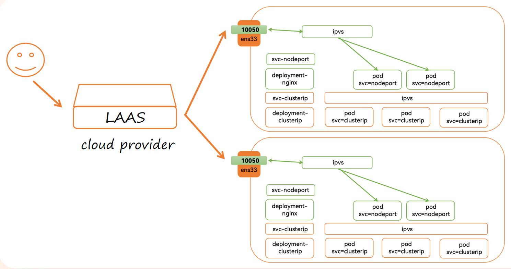


### Service - LoadBalancer - 实验

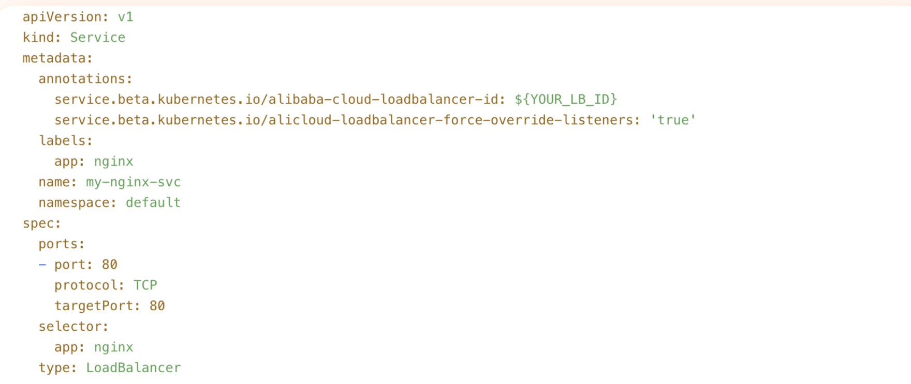

原始地址：https://help.aliyun.com/zh/ack/ack-managed-and-ack-dedicated/user-guide/use-an-existing-slb-instance-to-expose-an-application


### **Kubernetes LoadBalancer Service 配置详解**

您提供的 YAML 文件定义了一个 **LoadBalancer 类型的 Service**，用于将 Nginx 服务暴露到公网，并通过阿里云负载均衡器（SLB）实现流量分发。以下是逐项解析：

---

#### **1. 基础信息**
```yaml
apiVersion: v1
kind: Service
metadata:
  name: my-nginx-svc
  namespace: default
```
- **作用**：定义一个名为 `my-nginx-svc` 的 Service，位于 `default` 命名空间。
- **类型**：`LoadBalancer`（见 `spec.type`），表示由云厂商自动创建外部负载均衡器。

---

#### **2. 标签与选择器**
```yaml
metadata:
  labels:
    app: nginx
spec:
  selector:
    app: nginx
```
- **标签**：Service 自身被打上 `app: nginx` 标签（可用于监控或分类）。
- **选择器**：Service 通过 `selector` 关联到后端 Pod，要求 Pod 必须有 `app: nginx` 标签。

---

#### **3. 端口配置**
```yaml
spec:
  ports:
    - port: 80         # 负载均衡器对外暴露的端口
      protocol: TCP    # 使用 TCP 协议
      targetPort: 80   # 转发到 Pod 的 80 端口
```
- **流量流向**：  
  外部用户访问负载均衡器的 `80` 端口 → 转发到集群内所有匹配 `app: nginx` 的 Pod 的 `80` 端口。

---

#### **4. 阿里云负载均衡器注解**
```yaml
metadata:
  annotations:
    service.beta.kubernetes.io/alibaba-cloud-loadbalancer-id: ${YOUR_LB_ID}
    service.beta.kubernetes.io/alicloud-loadbalancer-force-override-listeners: 'true'
```
- **关键注解**：
    - **`alibaba-cloud-loadbalancer-id`**：指定已有阿里云 SLB 的 ID（需替换 `${YOUR_LB_ID}`）。  
      *若省略，阿里云会自动新建一个 SLB。*
    - **`force-override-listeners: 'true'`**：强制覆盖 SLB 的监听配置（避免与已有配置冲突）。

---

#### **5. 完整流量路径**
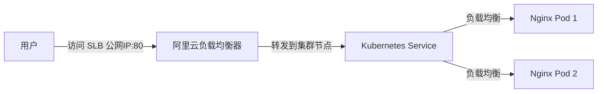
```mermaid
graph LR
A[用户] -->|访问 SLB 公网IP:80| B[阿里云负载均衡器]
B -->|转发到集群节点| C[Kubernetes Service]
C -->|负载均衡| D[Nginx Pod 1]
C -->|负载均衡| E[Nginx Pod 2]
```

---

### **注意事项**
1. **`${YOUR_LB_ID}` 需替换**：  
   使用前需填写真实的阿里云 SLB ID，否则会报错。
2. **费用问题**：  
   LoadBalancer 类型的 Service 会按小时计费（阿里云 SLB 费用）。
3. **安全组配置**：  
   确保阿里云安全组放行 SLB 的 `80` 端口入站流量。

---

### **如何获取 SLB ID？**
1. 登录 [阿里云 SLB 控制台](https://slb.console.aliyun.com)。
2. 复制目标负载均衡器的 ID（格式类似 `lb-xxx`）。  
    *（示意图）*

---

### **总结**
- 此配置通过阿里云 SLB 实现 Nginx 服务的公网暴露。
- 核心控制项：**端口映射**、**选择器标签**、**阿里云注解**。
- 适用场景：需公网访问的 Web 服务（如官网、API 网关）。

### Service - ExternalName - 结构

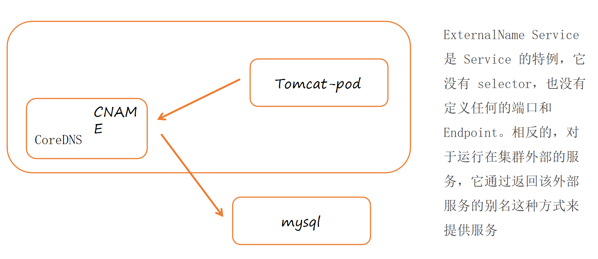


#### 7.ensvc.yaml


```yaml
kind: Service
apiVersion: v1
metadata:
  name: my-service-1
  namespace: default
spec:
  type: ExternalName
  externalName: www.baidu.com
```


### **Kubernetes `ExternalName` Service 详解**

您提供的 YAML 定义了一个 **`ExternalName` 类型的 Service**，这是一种特殊服务，用于将集群内部的服务名映射到**外部域名**（如公网服务或另一个集群的服务）。以下是逐行解析：

---

#### **YAML 配置**
```yaml
apiVersion: v1
kind: Service
metadata:
  name: my-service-1      # Service 名称
  namespace: default      # 所属命名空间
spec:
  type: ExternalName      # 服务类型为 ExternalName
  externalName: www.baidu.com  # 映射的外部域名
```

---

### **核心作用**
1. **DNS 别名**：  
   当集群内的 Pod 访问 `my-service-1.default.svc.cluster.local` 时，DNS 会直接解析为 `www.baidu.com`。
    - **示例**：
      ```bash
      curl http://my-service-1.default.svc.cluster.local
      ```
      实际请求会被转发到 `http://www.baidu.com`。

2. **解耦外部依赖**：  
   允许在代码中固定使用集群内 Service 名称（如 `my-service-1`），而无需硬编码外部域名（如 `www.baidu.com`）。
    - **优势**：未来若外部服务地址变更，只需修改 `externalName`，无需修改应用代码。

---

### **适用场景**
1. **集成外部服务**：
    - 连接公网 API（如百度、Google）。
    - 访问其他集群的服务（如数据库、消息队列）。

2. **环境切换**：
    - 开发环境指向测试域名，生产环境指向真实域名。

3. **简化配置**：
    - 避免在 Pod 中直接配置外部服务的 IP 或域名。

---

### **工作原理**
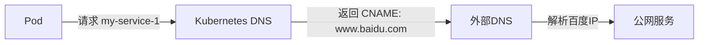
```mermaid
graph LR
A[Pod] -->|请求 my-service-1| B[Kubernetes DNS]
B -->|返回 CNAME: www.baidu.com| C[外部DNS]
C -->|解析百度IP| D[公网服务]
```

1. Pod 发起对 `my-service-1` 的请求。
2. Kubernetes DNS 返回 `www.baidu.com` 的 CNAME 记录。
3. 外部 DNS 解析 `www.baidu.com` 的真实 IP。
4. 流量直接到达外部服务。

---

### **注意事项**
1. **无负载均衡或代理**：  
   `ExternalName` 仅做 DNS 转发，**不提供** Kubernetes 的负载均衡、健康检查或流量控制功能。

2. **协议与端口**：
    - 外部服务的协议（HTTP/HTTPS/TCP）需由调用方处理。
    - Service YAML 中**无需也不能**定义 `ports`（因为无流量拦截）。

3. **依赖集群 DNS**：  
   需确保集群的 CoreDNS 或 kube-dns 正常运行。

4. **不支持 IP 地址**：  
   `externalName` 必须是域名（如 `www.baidu.com`），不能是 IP（如 `1.2.3.4`）。

---

### **对比其他 Service 类型**
| 特性               | `ExternalName`       | `ClusterIP`/`NodePort`/`LoadBalancer` |
|--------------------|----------------------|----------------------------------------|
| **流量目标**       | 外部域名             | 集群内 Pod                             |
| **DNS 解析**       | 返回 CNAME 记录      | 返回 ClusterIP 或节点 IP               |
| **负载均衡**       | 无                   | 有                                     |
| **适用场景**       | 集成外部服务         | 暴露集群内服务                         |

---

### **示例场景**
#### **场景：将数据库服务抽象为 ExternalName**
```yaml
apiVersion: v1
kind: Service
metadata:
  name: prod-mysql
spec:
  type: ExternalName
  externalName: mysql.database.aliyun.com
```
- **效果**：  
  应用代码中只需连接 `prod-mysql.default.svc.cluster.local`，无需关心数据库实际地址。
- **切换环境**：  
  若测试环境使用本地数据库，只需修改 `externalName` 为 `test-mysql.local`。

---

### **总结**
- `ExternalName` Service 是 Kubernetes 的**“DNS 别名”**，用于将内部服务名映射到外部域名。
- 优势：**解耦配置**、**简化迁移**，适合集成公网服务或跨集群访问。
- 限制：**不处理流量**，需依赖外部服务的可用性。


```yaml
apiVersion: v1
kind: Pod
metadata:
  name: ping-tester
  namespace: default
spec:
  containers:
  - name: network-tools
    image: alpine:latest  # 轻量级 Linux 镜像，包含 ping 和 curl
    command: ["sh", "-c", "sleep infinity"]  # 保持 Pod 运行
```


```bash
[root@k8s-master01 6.1]# kubectl get pod
NAME          READY   STATUS    RESTARTS   AGE
ping-tester   1/1     Running   0          7s
[root@k8s-master01 6.1]# kubectl exec -it ping-tester -- /bin/sh
/ # 
/ # 
/ # ping my-service-1.default.svc.cluster.local.
PING my-service-1.default.svc.cluster.local. (157.148.69.151): 56 data bytes
64 bytes from 157.148.69.151: seq=0 ttl=126 time=47.762 ms
64 bytes from 157.148.69.151: seq=1 ttl=126 time=32.615 ms
64 bytes from 157.148.69.151: seq=3 ttl=126 time=25.881 ms
64 bytes from 157.148.69.151: seq=4 ttl=126 time=46.857 ms
64 bytes from 157.148.69.151: seq=5 ttl=126 time=29.199 ms
64 bytes from 157.148.69.151: seq=6 ttl=126 time=27.353 ms
```

得到百度的域名：`157.148.69.151`


 
 


## Endpoints

Service的底层模型

### Endpoint与Service和Pod间的关联


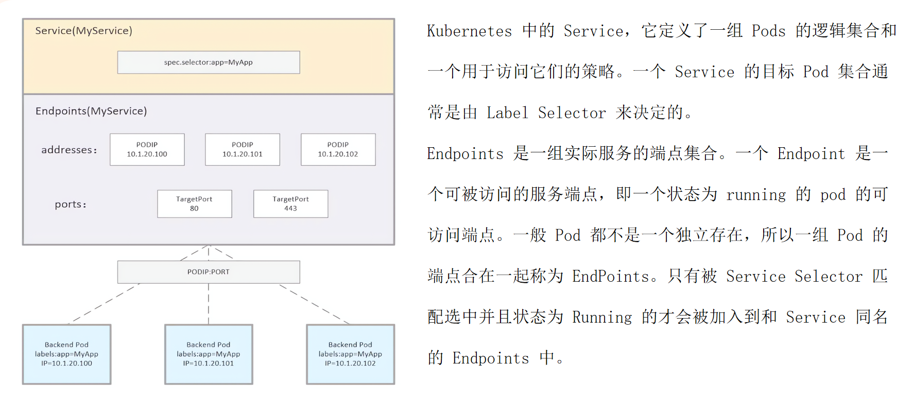


### Endpoint与Service和Pod间的关联


- 自动关联体系：配置selector
- 手动关联体系：无配置selector


Service endpoints
- 有标签选择器
  - 自动创建一个同名的endpoints资源对象
    - 匹配对象
      - 当前名字空间中的pod
        - 标签子集运算
        - 就绪的
- 没有定义标签选择器
  - 不会创建同名的endpoints资源对象，需要管理员手动创建
    - 匹配对象
      - 管理员填写的端点信息

在 Kubernetes 中，`Endpoint` 是连接 `Service` 和 `Pod` 的关键资源，它记录了 Service 对应的 Pod 的网络地址（IP:Port）。根据 Service 是否配置了 `selector`，Endpoint 的关联方式分为自动关联体系和手动关联体系：

---

### 1. **自动关联体系（配置 selector）**
当 Service 定义了 `selector` 时，Kubernetes 会自动管理 Endpoint 对象，并动态关联到匹配的 Pod。

#### 关联流程：
1. **Service 配置 selector**  
   在 Service 的 YAML 中，通过 `spec.selector` 指定标签选择器（如 `app: nginx`）。
   ```yaml
   apiVersion: v1
   kind: Service
   metadata:
     name: my-service
   spec:
     selector:
       app: nginx  # 匹配具有此标签的Pod
     ports:
       - protocol: TCP
         port: 80
         targetPort: 9376
   ```

2. **Kubernetes 自动创建/更新 Endpoint**
    - 控制器（`endpoint-controller`）持续监听集群中与 `selector` 匹配的 Pod。
    - 将匹配的 Pod 的 `IP:Port` 列表写入同名的 `Endpoint` 对象（如 `my-service`）。
    - 如果 Pod 发生扩缩容或重启（IP 变化），Endpoint 会自动更新。

3. **Endpoint 内容示例**
   ```yaml
   apiVersion: v1
   kind: Endpoints
   metadata:
     name: my-service  # 与Service同名
   subsets:
     - addresses:
         - ip: 10.1.0.1  # Pod IP
         - ip: 10.1.0.2
       ports:
         - port: 9376    # targetPort
   ```

#### 特点：
- **动态性**：无需手动干预，完全由 Kubernetes 维护。
- **依赖 Pod 标签**：Service 的流量只会路由到标签匹配的 Pod。

---

### 2. **手动关联体系（无配置 selector）**
当 Service **不定义 `selector`** 时，Kubernetes 不会自动创建 Endpoint，需要用户手动创建同名的 `Endpoint` 对象，指向特定的 IP 和端口。

#### 使用场景：
- 连接外部服务（如数据库、传统系统）。
- 需要灵活控制流量路由（如指向其他 Namespace 的 Pod 或集群外服务）。

#### 操作步骤：
1. **创建无 selector 的 Service**
   ```yaml
   apiVersion: v1
   kind: Service
   metadata:
     name: external-service
   spec:
     ports:
       - protocol: TCP
         port: 80
         targetPort: 9376
   # 注意：无selector字段！
   ```

2. **手动创建同名的 Endpoint**  
   在 Endpoint 中明确指定目标地址（如外部服务的 IP）：
   ```yaml
   apiVersion: v1
   kind: Endpoints
   metadata:
     name: external-service  # 必须与Service同名
   subsets:
     - addresses:
         - ip: 192.168.1.1  # 外部服务IP
       ports:
         - port: 9376
   ```

#### 特点：
- **静态配置**：需手动维护 Endpoint 的 IP 列表。
- **灵活性**：可指向任意网络可达的端点（甚至非 Kubernetes 服务）。

---

### 对比总结
| **特性**               | 自动关联体系（有 selector）          | 手动关联体系（无 selector）          |
|------------------------|-------------------------------------|-------------------------------------|
| **Endpoint 维护方**    | Kubernetes 自动管理                 | 用户手动维护                        |
| **适用场景**           | 集群内 Pod 服务                     | 外部服务或特殊路由需求              |
| **动态更新**           | 支持（随 Pod 变化自动更新）         | 需手动更新 Endpoint                 |
| **Service 配置**       | 必须定义 `selector`                 | 无 `selector`                       |

---

### 示例场景
#### 自动关联（常见场景）
- 部署一个 Deployment（带标签 `app: nginx`），并创建 Service 通过 `selector: app: nginx` 关联 Pod。

#### 手动关联（连接外部数据库）
- 创建一个无 selector 的 Service `mysql-service`，手动配置 Endpoint 指向云数据库的 IP `10.2.3.4:3306`。

---

通过理解这两种关联方式，可以灵活设计 Kubernetes 服务路由策略，适应不同架构需求。


### 自动关联体系：配置selector


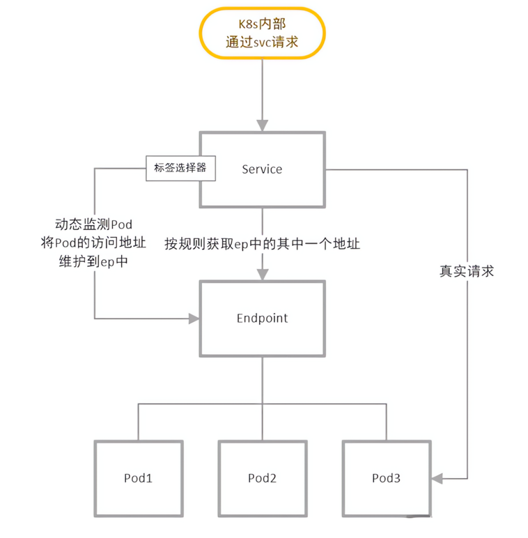

```yaml
apiVersion: apps/v1
kind: Deployment
metadata:
  name: myapp-clusterip-deploy
  namespace: default
spec:
  replicas: 3
  selector:
    matchLabels:
      app: myapp
      release: stable
      svc: clusterip
  template:
    metadata:
      labels:
        app: myapp
        release: stable
        env: test
        svc: clusterip
    spec:
      imagePullSecrets:
        - name: aliyun-secret
      containers:
        - name: myapp-container
          image: crpi-cd1z0kbw072xy0ao.cn-guangzhou.personal.cr.aliyuncs.com/tangfire/myversion:v1
          imagePullPolicy: IfNotPresent
          ports:
            - name: http
              containerPort: 80
          readinessProbe:
            httpGet:
              port: 80
              path: /index.html
            initialDelaySeconds: 1
            periodSeconds: 3
```


```yaml
apiVersion: v1
kind: Service
metadata:
  name: myapp-clusterip
  namespace: default
spec:
  type: ClusterIP
  selector:
    app: myapp
    release: stable
    svc: clusterip
  ports:
    - name: http
      port: 80
      targetPort: 80
```

```bash
[root@k8s-master01 6.1]# kubectl get pod
NAME                                    READY   STATUS    RESTARTS   AGE
myapp-clusterip-deploy-98786f9c-4p7d7   1/1     Running   0          22s
myapp-clusterip-deploy-98786f9c-chg42   1/1     Running   0          22s
myapp-clusterip-deploy-98786f9c-d8hbc   1/1     Running   0          22s
```


```bash
[root@k8s-master01 6.1]# kubectl get endpoints
NAME              ENDPOINTS                                            AGE
kubernetes        192.168.120.11:6443                                  6d17h
myapp-clusterip   10.244.58.195:80,10.244.58.196:80,10.244.85.238:80   5s
```


### 手动关联体系：无配置selector


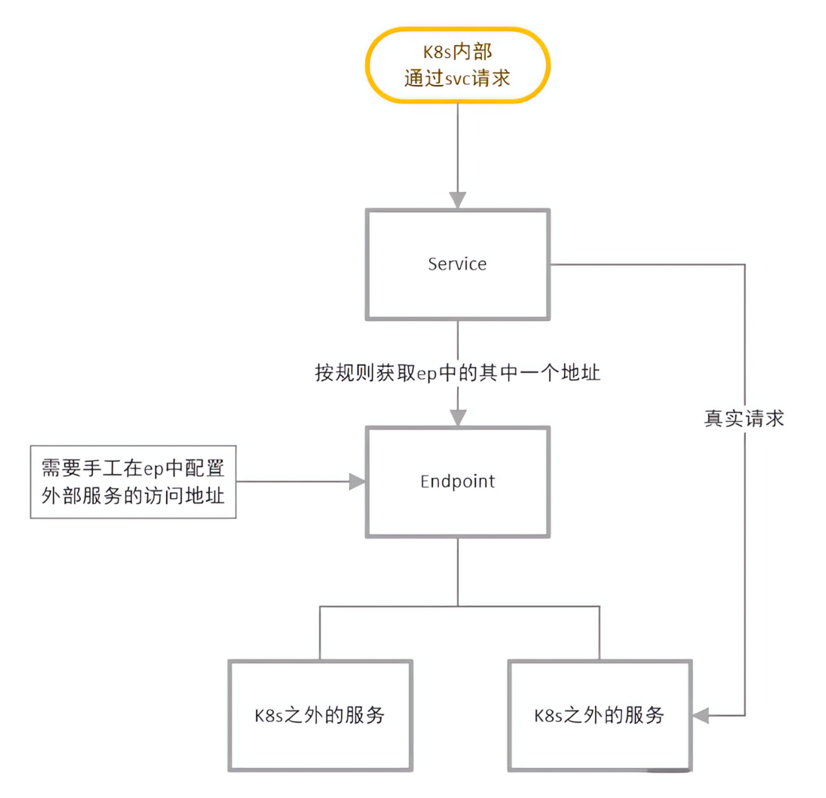

#### Service 配置（将集群内 6666 端口代理到外部 80 端口）

```yaml
apiVersion: v1
kind: Service
metadata:
  name: nginx
spec:
  ports:
    - protocol: TCP
      port: 6666      # 集群内访问端口
      targetPort: 80  # 外部服务的实际端口


```

#### Endpoints 配置（手动指定外部服务地址）


```yaml
apiVersion: v1
kind: Endpoints
metadata:
  name: nginx        # 必须与 Service 同名
subsets:
  - addresses:
      - ip: 192.168.120.12  # 外部服务的 IP
    ports:
      - port: 80           # 外部服务的端口
```

在`192.168.120.12`这个节点上执行

```bash
docker run -itd -p 80:80 --net host nginx:1.25
```


```bash
[root@k8s-master01 6.1]# kubectl get svc
NAME              TYPE        CLUSTER-IP    EXTERNAL-IP   PORT(S)    AGE
kubernetes        ClusterIP   10.0.0.1      <none>        443/TCP    6d17h
nginx             ClusterIP   10.2.83.164   <none>        6666/TCP   26s

[root@k8s-master01 6.1]# kubectl get ep
NAME              ENDPOINTS                                            AGE
kubernetes        192.168.120.11:6443                                  6d17h
nginx             192.168.120.12:80                                    3m51s
```

```bash
[root@k8s-master01 6.1]# curl 10.2.83.164:6666
<!DOCTYPE html>
<html>
<head>
<title>Welcome to nginx!</title>
<style>
html { color-scheme: light dark; }
body { width: 35em; margin: 0 auto;
font-family: Tahoma, Verdana, Arial, sans-serif; }
</style>
</head>
<body>
<h1>Welcome to nginx!</h1>
<p>If you see this page, the nginx web server is successfully installed and
working. Further configuration is required.</p>

<p>For online documentation and support please refer to
<a href="http://nginx.org/">nginx.org</a>.<br/>
Commercial support is available at
<a href="http://nginx.com/">nginx.com</a>.</p>

<p><em>Thank you for using nginx.</em></p>
</body>
</html>
```

## publishNotReadyAddresses

#### 10.pod.yaml

```yaml
apiVersion: v1
kind: Pod
metadata:
  name: readiness-httpget-pod
  namespace: default
  labels:
    app: myapp
    env: test
spec:
  imagePullSecrets:
    - name: aliyun-secret
  containers:
    - name: myapp-container
      image: crpi-cd1z0kbw072xy0ao.cn-guangzhou.personal.cr.aliyuncs.com/tangfire/myversion:v1
      imagePullPolicy: IfNotPresent
      readinessProbe:
        httpGet:
          port: 80
          path: /index1.html
        initialDelaySeconds: 1
        periodSeconds: 3
```


```bash
[root@k8s-master01 6.1]# kubectl apply -f 10.pod.yaml 
pod/readiness-httpget-pod created
[root@k8s-master01 6.1]# 
[root@k8s-master01 6.1]# 
[root@k8s-master01 6.1]# kubectl get pod
NAME                    READY   STATUS    RESTARTS   AGE
readiness-httpget-pod   0/1     Running   0          4s

[root@k8s-master01 6.1]# kubectl create svc clusterip myapp --tcp=80:80
service/myapp created
[root@k8s-master01 6.1]# kubectl get svc
NAME         TYPE        CLUSTER-IP      EXTERNAL-IP   PORT(S)   AGE
kubernetes   ClusterIP   10.0.0.1        <none>        443/TCP   6d18h
myapp        ClusterIP   10.13.161.153   <none>        80/TCP    8s
[root@k8s-master01 6.1]# curl 10.13.161.153
curl: (7) Failed to connect to 10.13.161.153 port 80: Connection refused


```

#### 添加publishNotReadyAddress: true

```bash
[root@k8s-master01 6.1]# kubectl patch service myapp -p '{"spec":{"publishNotReadyAddresses": true}}'
service/myapp patched
[root@k8s-master01 6.1]# curl 10.13.161.153
<!DOCTYPE html>
<html>
<head>
    <title>Nginx Version</title>
</head>
<body>
    <h1>当前版本: v1.0</h1>
    <p>这是自定义的 Nginx 镜像</p>
</body>
</html>
[root@k8s-master01 6.1]# kubectl get pod
NAME                    READY   STATUS    RESTARTS   AGE
readiness-httpget-pod   0/1     Running   0          5m46s
```


