# Pod控制器-核心灵魂

## 控制器

### 控制器 - 概述

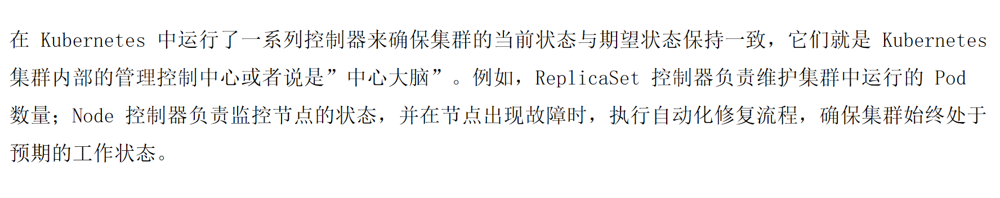


### 控制器 - 控制循环


### 控制器 - Pod控制器


## Pod控制器(pod的监护人)

### pod控制器 - ReplicationController和ReplicaSet


- RC控制器：保障当前的Pod数量与期望值一致
- RS控制器：功能与RC控制器类似，但是多了标签选择的运算方式


### RC控制器

#### 1.rc.yaml

```yaml
apiVersion: v1
kind: ReplicationController
metadata:
  name: rc-demo
spec:
  replicas: 3
  selector:
    app: rc-demo
  template:
    metadata:
      labels:
        app: rc-demo
    spec:
      containers:
      - name: rc-demo-container
        image: nginx:1.25  
        env:
        - name: GET_HOSTS_FROM
          value: dns
        - name: zhangsan    # 修正原YAML中的格式错误（原配置缺少`-`）
          value: "123"
        ports:
        - containerPort: 80
```

```bash
kubectl apply -f 1.rc.yaml
kubectl get rc
kubectl get pod
```

如果我们删除某个pod,rc会自动帮我们重新创建一个pod，以保持pod的数量为3

#### 测试改变label，rc的情况


执行如下：

```bash
[root@k8s-master01 5]# kubectl get pod --show-labels
```

得到下面的结果：

```bash
NAME            READY   STATUS    RESTARTS   AGE     LABELS
rc-demo-84wkq   1/1     Running   0          9m23s   app=rc-demo
rc-demo-fbpbr   1/1     Running   0          9m23s   app=rc-demo
rc-demo-sxvx5   1/1     Running   0          7m18s   app=rc-demo
```

执行:

```bash
kubectl label pod rc-demo-84wkq app=tangfire --overwrite
```

然后我们再执行：

```bash
[root@k8s-master01 5]# kubectl get pod --show-labels

```

可以发现：

```bash
NAME            READY   STATUS    RESTARTS   AGE     LABELS
rc-demo-84wkq   1/1     Running   0          11m     app=tangfire
rc-demo-fbpbr   1/1     Running   0          11m     app=rc-demo
rc-demo-sxvx5   1/1     Running   0          9m32s   app=rc-demo
rc-demo-t6n57   1/1     Running   0          3s      app=rc-demo
```


然后我们再执行：

```bash
kubectl label pod rc-demo-84wkq app=rc-demo --overwrite
```

```bash
kubectl get pod --show-labels
```

得到如下：

```bash
NAME            READY   STATUS    RESTARTS   AGE   LABELS
rc-demo-84wkq   1/1     Running   0          15m   app=rc-demo
rc-demo-fbpbr   1/1     Running   0          15m   app=rc-demo
rc-demo-sxvx5   1/1     Running   0          13m   app=rc-demo
```

会优先删除最新创建的pod


#### 调整当前副本数量

```bash
kubectl scale rc rc-demo --replicas=10
```
```bash
[root@k8s-master01 5]# kubectl get pod --show-labels
NAME            READY   STATUS    RESTARTS   AGE   LABELS
rc-demo-78qh4   1/1     Running   0          16s   app=rc-demo
rc-demo-7prln   1/1     Running   0          16s   app=rc-demo
rc-demo-84wkq   1/1     Running   0          19m   app=rc-demo
rc-demo-8v79g   1/1     Running   0          16s   app=rc-demo
rc-demo-fbpbr   1/1     Running   0          19m   app=rc-demo
rc-demo-j7tbn   1/1     Running   0          17s   app=rc-demo
rc-demo-kz757   1/1     Running   0          17s   app=rc-demo
rc-demo-sgtm5   1/1     Running   0          16s   app=rc-demo
rc-demo-sxvx5   1/1     Running   0          17m   app=rc-demo
rc-demo-tm88g   1/1     Running   0          17s   app=rc-demo
```


### RS控制器

#### 2.rs.yaml

```yaml
apiVersion: apps/v1
kind: ReplicaSet
metadata:
  name: rs-ml-demo
spec:
  replicas: 3
  selector:
    matchLabels:
      app: rs-ml-demo
      domain: fire
  template:
    metadata:
      labels:
        app: rs-ml-demo
        domain: fire
        version: v1
    spec:
      containers:
      - name: rs-ml-demo-container
        image: nginx:1.25  
        env:
        - name: GET_HOSTS_FROM
          value: dns
        ports:
        - containerPort: 80
```

```shell
kubectl apply -f 2.rs.yaml
kubectl get pod
kubectl get rs
```

### selector.matchExpressions


rs在标签选择器上，除了可以定义键值对的选择形式，还支持matchExpressions字段，可以提供多种选择。
目前支持的操作包括：

- In: label的值在某个列表中
- Notin: label的值不在某个列表中
- Exists: 某个label存在
- DoesNotExist: 某个label不存在

#### 3.rs.yaml

```yaml
apiVersion: apps/v1
kind: ReplicaSet
metadata:
  name: rs-me-exists-demo
spec:
  selector:
    matchExpressions:
      - key: app
        operator: Exists
  template:
    metadata:
      labels:
        app: spring-k8s
    spec:
      containers:
      - name: rs-me-exists-demo-container
        image: nginx:1.25  
        ports:
        - containerPort: 80
```

```bash
kubectl get pod --show-labels
rs-me-exists-demo-z8g4m   1/1     Running   0          8m38s   app=spring-k8s
```

```bash
kubectl label pod rs-me-exists-demo-z8g4m app=tangfire --overwrite
```

会发现label改掉了，但是rs控制器并没有创建新pod，只要当前label存在，key为app即可

#### 4.rs.yaml

```yaml
apiVersion: apps/v1
kind: ReplicaSet
metadata:
  name: rs-me-in-demo
spec:
  selector:
    matchExpressions:
      - key: app
        operator: In
        values:
          - spring-k8s
          - hahahah
  template:
    metadata:
      labels:
        app: sg-k8s
    spec:
      containers:
      - name: rs-me-in-demo-container
        image: nginx:1.25  
        ports:
        - containerPort: 80
```

```bash
[root@k8s-master01 5]# kubectl apply -f 4.rs.yaml 
The ReplicaSet "rs-me-in-demo" is invalid: spec.template.metadata.labels: Invalid value: map[string]string{"app":"sg-k8s"}: `selector` does not match template `labels`
```


#### 4.rs.yaml

```yaml
apiVersion: apps/v1
kind: ReplicaSet
metadata:
  name: rs-me-in-demo
spec:
  selector:
    matchExpressions:
      - key: app
        operator: In
        values:
          - spring-k8s
          - hahahah
  template:
    metadata:
      labels:
        app: hahahah
    spec:
      containers:
      - name: rs-me-in-demo-container
        image: nginx:1.25  
        ports:
        - containerPort: 80
```


```bash
[root@k8s-master01 5]# kubectl get pod --show-labels
NAME                      READY   STATUS    RESTARTS   AGE     LABELS
rs-me-in-demo-fnk5q       1/1     Running   0          4m59s   app=hahahah
```

```bash
kubectl label pod rs-me-in-demo-fnk5q app=spring-k8s --overwrite
```

```bash
[root@k8s-master01 5]# kubectl get pod --show-labels
NAME                      READY   STATUS    RESTARTS   AGE     LABELS
rs-me-in-demo-fnk5q       1/1     Running   0          6m24s   app=spring-k8s
```


### pod控制器 - Deployment - 基本概念


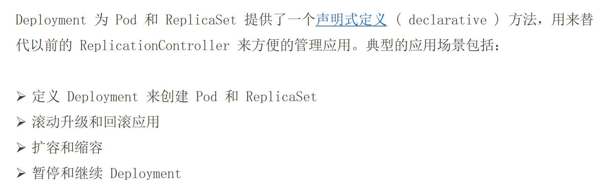

- 支持了声明式表达
- 支持滚动更新和回滚
- 原理：deployment > RS > pod


#### 滚动升级和回滚应用

Kubernetes Deployment 的 **滚动升级（Rolling Update）** 和 **回滚（Rollback）** 功能，这是 Deployment 管理应用更新的核心优势。

**核心思想：** Deployment 旨在以**可控、最小化服务中断**的方式更新运行中的应用程序。

---

### 一、滚动升级 (Rolling Update)

当您需要更新应用程序（例如，使用新版本的容器镜像、修改环境变量、更新资源请求等）时，Deployment 默认采用 **RollingUpdate** 策略。

**滚动升级的过程：**

1.  **触发升级：** 您修改 Deployment 的配置（通常是 `.spec.template` 部分，比如 `image: nginx:1.25` -> `image: nginx:1.26`），然后使用 `kubectl apply -f deployment.yaml` 或 `kubectl set image deployment/myapp-deploy myapp=nginx:1.26` 应用更改。
2.  **创建新 ReplicaSet：** Deployment 控制器检测到 Pod 模板（`.spec.template`）发生了变化。它不会直接修改现有的 Pod，而是会创建一个**新的 ReplicaSet** 对象。这个新 ReplicaSet 的模板包含您的新配置（例如，`nginx:1.26`）。
3.  **逐步扩展新 Pod：** Deployment 控制器开始根据新模板**创建新的 Pod**。新 Pod 会带上新模板中定义的标签（例如，`version: v2`）。
4.  **逐步缩减旧 Pod：** 在创建新 Pod 的同时，Deployment 控制器开始**优雅地终止**旧 ReplicaSet 管理的旧 Pod（例如，运行 `nginx:1.25` 的 Pod）。
5.  **控制节奏：** 这个过程不是一次性完成的。Deployment 严格按照定义的 **滚动更新策略** (`spec.strategy.rollingUpdate`) 来控制节奏：
    *   **`maxSurge`** (默认为 25%)： 允许创建的、超过期望副本数 (`replicas`) 的新 Pod 的最大数量。可以是绝对数（如 `2`）或百分比（如 `25%`）。例如，如果 `replicas: 4` 且 `maxSurge: 1`，则在升级过程中，最多允许同时存在 `4 (期望) + 1 (maxSurge) = 5` 个 Pod。
    *   **`maxUnavailable`** (默认为 25%)： 在更新过程中，相对于期望副本数，允许**不可用**的旧 Pod 的最大数量。可以是绝对数或百分比。例如，如果 `replicas: 4` 且 `maxUnavailable: 1`，则在升级过程中的任何时刻，至少要有 `4 - 1 = 3` 个 Pod（可以是旧的、新的或混合）处于可用状态。
6.  **持续监控与替换：** 新 Pod 启动并通过**就绪探针 (Readiness Probe)** 后（如果配置了），会被视为可用。控制器会继续按策略创建新 Pod 并终止旧 Pod，直到**所有旧 Pod 被新 Pod 替换**，且新 Pod 的数量达到 `replicas` 指定的期望值。
7.  **完成：** 当所有旧 Pod 被终止，新 ReplicaSet 完全接管并管理着指定数量的新 Pod 时，滚动升级完成。旧的 ReplicaSet 会被保留（但缩容到 0 个副本），这是为了支持回滚。

**滚动升级的关键优势：**

*   **零停机（或接近零停机）：** 在整个更新过程中，始终有 Pod 在运行并处理请求（受 `maxUnavailable` 约束），确保服务持续可用。
*   **渐进式：** 更新是逐步进行的，降低了风险。如果新版本有问题，通常只会在部分新 Pod 上体现，影响范围有限。
*   **可控性：** 通过 `maxSurge` 和 `maxUnavailable` 参数，您可以精细控制更新速度和允许的服务中断程度。
*   **自动健康检查：** 结合就绪探针，Kubernetes 可以确保新 Pod 真正准备好接收流量后才将旧 Pod 下线。

**查看滚动升级状态：**

```bash
kubectl rollout status deployment/myapp-deploy  # 实时查看更新进度
kubectl describe deployment/myapp-deploy       # 查看详细事件和状态
kubectl get replicasets                        # 查看新旧 ReplicaSet
kubectl get pods                               # 查看新旧 Pod 的状态和标签
```

---

### 二、回滚应用 (Rollback)

如果在滚动升级后，您发现新版本的应用存在问题（例如，Bug、性能下降、配置错误），Deployment 提供了简便的**回滚（Rollback）** 机制，可以将应用**快速恢复到之前的稳定状态**。

**回滚的过程：**

1.  **触发回滚：** 使用 `kubectl rollout undo` 命令：
    ```bash
    kubectl rollout undo deployment/myapp-deploy
    ```
2.  **识别历史版本：** Deployment 控制器会查找该 Deployment 的**修订历史（Revision History）**。每次对 Pod 模板 (`spec.template`) 的更改（触发滚动升级）都会创建一个新的修订版本（Revision）。默认情况下，Deployment 会保留一定数量的旧 ReplicaSet（及其配置）来支持回滚（保留数量由 `spec.revisionHistoryLimit` 指定，默认为 10）。
3.  **回滚到上一版：** 默认情况下，`kubectl rollout undo` 会将 Deployment **回滚到上一个修订版本**。这意味着：
    *   控制器会找到**上一个稳定版本**对应的 ReplicaSet（例如，之前运行 `nginx:1.25` 的那个）。
    *   它会启动一个**新的滚动升级过程**（可以看作是“逆向滚动升级”）：
        *   逐步扩展旧稳定版（`nginx:1.25`）的 Pod（通过旧 ReplicaSet）。
        *   逐步缩减问题新版（`nginx:1.26`）的 Pod。
4.  **完成回滚：** 过程与滚动升级类似，受相同的 `maxSurge` 和 `maxUnavailable` 策略控制。最终，旧稳定版 ReplicaSet 再次管理所有 Pod，应用恢复到升级前的状态。
5.  **回滚到特定版本：** 如果需要回滚到更早的某个特定修订版本，可以先查看历史，然后指定版本号：
    ```bash
    kubectl rollout history deployment/myapp-deploy          # 查看修订历史
    kubectl rollout history deployment/myapp-deploy --revision=2  # 查看某个修订的详细信息
    kubectl rollout undo deployment/myapp-deploy --to-revision=2  # 回滚到特定修订版本 (e.g., rev=2)
    ```

**回滚的关键优势：**

*   **快速恢复：** 在发现新版本有问题时，能迅速恢复到已知稳定的旧版本，最小化故障影响时间和范围。
*   **操作简单：** 使用简单的 `kubectl` 命令即可完成，无需手动操作 Pod 或 ReplicaSet。
*   **基于历史：** 依赖保留的 ReplicaSet 历史记录，确保了回滚目标的准确性。

---

### 总结

*   **滚动升级**是 Deployment 更新应用的标准方式，通过逐步用新 Pod 替换旧 Pod，确保服务不中断或中断最小化。它由 `maxSurge` 和 `maxUnavailable` 策略控制节奏。
*   **回滚**是 Deployment 的安全网。当升级导致问题时，它能快速、可靠地将应用恢复到之前的稳定版本，依赖于保存的修订历史（旧 ReplicaSet）。

**常用命令回顾：**

```bash
# 触发更新 (修改yaml后应用)
kubectl apply -f deployment.yaml

# 触发更新 (直接修改镜像)
kubectl set image deployment/myapp-deploy myapp=nginx:1.26

# 查看滚动升级状态
kubectl rollout status deployment/myapp-deploy

# 暂停滚动升级 (用于金丝雀发布等)
kubectl rollout pause deployment/myapp-deploy

# 恢复暂停的滚动升级
kubectl rollout resume deployment/myapp-deploy

# 回滚到上一版本
kubectl rollout undo deployment/myapp-deploy

# 查看修订历史
kubectl rollout history deployment/myapp-deploy

# 回滚到特定版本
kubectl rollout undo deployment/myapp-deploy --to-revision=2
```

掌握滚动升级和回滚是安全、可靠地在 Kubernetes 上部署和管理应用程序的关键。


### 声明式与命令式


```bash
kubectl replace -f deployment.yaml
kubectl apply -f deployment.yaml
kubectl diff -f deployment.yaml
```

以下是关于 `kubectl replace`、`kubectl apply` 和 `kubectl diff` 命令的详细解释和对比：

---

### **1. `kubectl replace -f deployment.yaml`**
#### **作用**
- **完全替换**：用 YAML 文件中的配置 **强制覆盖** 集群中现有的资源。
- **要求**：资源必须已存在，否则会报错（`Error from server (NotFound)`）。

#### **使用场景**
- 当需要 **完全重置** 资源的配置时（如修复错误的更新）。
- 不保留任何原有配置（如未在 YAML 中定义的字段会被删除）。

#### **示例**
```bash
kubectl replace -f deployment.yaml
```
#### **注意事项**
- 如果资源不存在，必须改用 `kubectl create -f deployment.yaml`。
- **破坏性操作**：可能触发 Pod 重建（若模板字段被修改）。

---

### **2. `kubectl apply -f deployment.yaml`**
#### **作用**
- **声明式更新**：将 YAML 文件的配置 **合并到** 集群中现有的资源。
- **智能合并**：
    - 如果资源不存在，则创建它（等同于 `create`）。
    - 如果资源已存在，则按字段差异进行更新（保留未修改的字段）。

#### **使用场景**
- **日常部署和更新**（推荐使用）。
- 支持 **幂等操作**（多次执行结果一致）。

#### **示例**
```bash
kubectl apply -f deployment.yaml
```
#### **底层机制**
- Kubernetes 会记录当前配置的 **最后应用版本**（存储在 `metadata.annotations` 中），用于计算差异。

---

### **3. `kubectl diff -f deployment.yaml`**
#### **作用**
- **预览变更**：显示 YAML 文件与集群中现有资源之间的差异（**dry-run**）。
- **只读操作**：不会实际修改集群状态。

#### **使用场景**
- 确认修改是否符合预期，避免直接操作导致意外后果。
- 调试或审计变更内容。

#### **示例**
```bash
kubectl diff -f deployment.yaml
```
#### **输出示例**
```diff
spec.template.spec.containers[0].image:
- nginx:1.25
+ nginx:1.26
```

---

### **三者的核心区别**
| **命令**               | **资源不存在时** | **更新策略**       | **是否触发重建**       | **典型用途**               |
|------------------------|----------------|-------------------|----------------------|--------------------------|
| `kubectl replace`      | 报错            | 完全覆盖           | 是（若模板修改）       | 强制回滚或修复配置           |
| `kubectl apply`        | 自动创建         | 智能合并           | 仅更新变化的字段       | 日常部署和滚动更新（推荐）    |
| `kubectl diff`         | 无效果          | 仅显示差异         | 否                   | 变更预检或调试             |

---

### **使用建议**
1. **优先使用 `apply`**
    - 适合大多数场景，避免意外覆盖未修改的字段。
    - 例如更新镜像版本：
      ```bash
      kubectl apply -f deployment.yaml
      ```

2. **谨慎使用 `replace`**
    - 仅在需要完全重置配置时使用（如修复损坏的资源）。
    - 示例：
      ```bash
      kubectl replace -f deployment.yaml --force --grace-period=0
      ```

3. **预检变更用 `diff`**
    - 在关键操作前验证修改：
      ```bash
      kubectl diff -f deployment.yaml
      ```

---

### **补充：其他相关命令**
- **创建资源**（仅首次）：
  ```bash
  kubectl create -f deployment.yaml
  ```
- **删除资源**：
  ```bash
  kubectl delete -f deployment.yaml
  ```


### replace于apply对比 - 1

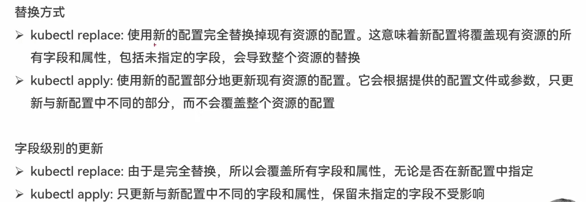

### replace于apply对比 - 2


### Deployment

#### 5.deployment.yaml

```yaml
apiVersion: apps/v1
kind: Deployment
metadata:
  labels:
    app: myapp-deploy
  name: myapp-deploy
spec:
  selector:
    matchLabels:
      app: myapp-deploy
  template:
    metadata:
      labels:
        app: myapp-deploy
        version: v1
    spec:
      containers:
      - image: nginx:1.25  
        name: myapp
        ports:
        - containerPort: 80 
```

```bash
kubectl apply -f 5.deployment.yaml
kubectl get pod
```


这是一个 Kubernetes **Deployment** 的 YAML 配置文件。它的核心目的是声明式地定义和管理一个 **Pod** 以及多个该 Pod 的副本（Replicas），确保指定数量的 Pod 实例始终在运行。即使某个 Pod 崩溃或被删除，Deployment 控制器会自动创建新的 Pod 来替换它。

让我们逐部分解释：

1.  **`apiVersion: apps/v1`**
    *   指定使用的 Kubernetes API 版本。`apps/v1` 是当前稳定版本，用于 Deployment、StatefulSet 等应用工作负载资源。

2.  **`kind: Deployment`**
    *   明确声明要创建的资源类型是 `Deployment`。

3.  **`metadata:`**
    *   定义 Deployment 自身的元数据。
    *   **`labels:`**
        *   `app: myapp-deploy`: 给这个 Deployment 对象打上一个标签 `app=myapp-deploy`。标签用于组织和选择资源。
    *   **`name: myapp-deploy`**
        *   这个 Deployment 对象在 Kubernetes 集群中的唯一名称。

4.  **`spec:`**
    *   定义 Deployment 的**期望状态**（Desired State），即你希望这个 Deployment 最终呈现的样子。
    *   **`selector:`**
        *   定义 Deployment 如何查找由它管理的 Pod。这是连接 Deployment 和它创建/管理的 Pod 的关键。
        *   **`matchLabels:`**
            *   `app: myapp-deploy`: Deployment 将管理所有拥有标签 `app=myapp-deploy` 的 Pod。**必须**与下面 Pod 模板中定义的标签匹配。
    *   **`template:`**
        *   定义由 Deployment 创建的 Pod 的模板。每当 Deployment 需要创建一个新的 Pod（比如启动时、滚动更新时、替换故障 Pod 时），它就会使用这个模板。
        *   **`metadata:`**
            *   定义 Pod 的元数据。
            *   **`labels:`**
                *   `app: myapp-deploy`: 给 Pod 打上标签 `app=myapp-deploy`。这个标签**必须**与上面 `spec.selector.matchLabels` 中定义的选择器匹配，这样 Deployment 才能识别和管理这些 Pod。
                *   `version: v1`: 给 Pod 打上另一个标签 `version=v1`。这常用于区分不同版本的 Pod（例如，在蓝绿部署或金丝雀发布中）。
        *   **`spec:`**
            *   定义 Pod 内部容器的期望状态。
            *   **`containers:`**
                *   一个数组，列出 Pod 中运行的一个或多个容器。
                *   **`- image: nginx:1.25`**
                    *   指定容器使用的镜像及其版本标签。这里使用官方 Nginx 镜像的 1.25 版本。
                *   **`name: myapp`**
                    *   给这个容器命名（在 Pod 内部唯一）。用于日志、命令执行等。
                *   **`ports:`**
                    *   声明容器**暴露**的端口列表。这主要是信息性的，告诉 Kubernetes 这个容器监听了哪些端口。
                    *   **`- containerPort: 80`**
                        *   声明容器内部监听的端口号是 80（Nginx 的默认 HTTP 端口）。**注意：这并不会自动在节点上开放端口或提供外部访问！** 要外部访问 Pod，通常需要创建一个 `Service` 资源。

**总结这个配置文件的作用：**

1.  **创建 Deployment：** 在 Kubernetes 集群中创建一个名为 `myapp-deploy` 的 Deployment 对象。
2.  **管理 Pod 副本：** 这个 Deployment 的目标是确保**至少一个**（因为 `spec.replicas` 没有显式设置，默认为 1）符合特定标签的 Pod 始终在运行。
3.  **识别 Pod：** Deployment 通过标签选择器 `app=myapp-deploy` 来识别哪些 Pod 是由它管理的。
4.  **Pod 模板：** 当需要创建新的 Pod 时，Deployment 使用模板中的定义：
    *   Pod 会被打上两个标签：`app=myapp-deploy` (用于被 Deployment 管理) 和 `version=v1` (用于版本标识)。
    *   Pod 内部运行**一个**容器：
        *   容器名为 `myapp`。
        *   使用 `nginx:1.25` 镜像启动。
        *   容器内部监听端口 `80`。
5.  **自动恢复：** 如果这个 Pod 意外终止（崩溃、节点故障等），Deployment 控制器会检测到当前状态（1个 Pod）与期望状态（1个 Pod）不符，并**立即自动创建一个新的 Pod** 来替换它，确保始终有 1 个 Pod 在运行。

**关键点强调：**

*   **`selector.matchLabels` 和 `template.metadata.labels` 必须匹配：** 这是 Deployment 能够找到并管理它创建的那些 Pod 的机制。如果它们不匹配，Deployment 将无法关联到它创建的 Pod。
*   **`containerPort` 是声明性的：** 它告诉 Kubernetes 容器监听了哪个端口，但**本身并不提供网络访问**。要让外部流量或集群内其他服务访问这个 Nginx Pod，你需要创建一个 Kubernetes `Service` 资源（例如 `ClusterIP`, `NodePort`, 或 `LoadBalancer` 类型），该 Service 会使用标签选择器（如 `app=myapp-deploy`）找到这些 Pod 并将流量转发到它们的 `80` 端口。
*   **默认副本数：** 这个配置没有显式设置 `spec.replicas` 字段，所以 Kubernetes 默认会创建并维护 **1 个** Pod 副本。如果你想运行多个副本（例如 3 个以实现高可用），需要在 `spec:` 下添加 `replicas: 3`。

**部署后的效果：**

运行 `kubectl apply -f your-file.yaml` 后，你会看到：

1.  一个名为 `myapp-deploy` 的 Deployment 被创建 (`kubectl get deployments`).
2.  该 Deployment 创建了一个对应的 ReplicaSet (`kubectl get replicasets`，名字通常以 `myapp-deploy-` 开头加哈希值)。ReplicaSet 是 Deployment 用来管理 Pod 副本的实际控制器。
3.  ReplicaSet 创建了一个（或指定数量的）Pod (`kubectl get pods`，名字通常以 `myapp-deploy-` 开头加 ReplicaSet 哈希值再加 Pod 哈希值)。这些 Pod 会有标签 `app=myapp-deploy` 和 `version=v1`。
4.  这个 Pod 内部运行着 `nginx:1.25` 容器。


### pod控制器 - Deployment - 与RS的关联


### pod控制器 - Deployment - 常用命令

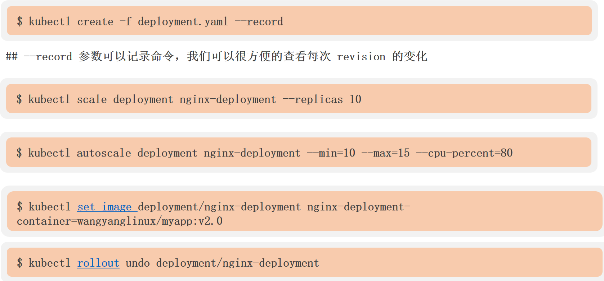


---

### **1. 创建 Deployment 并记录历史**
```bash
kubectl create -f deployment.yaml --record
```
- **作用**：  
  通过 YAML 文件创建 Deployment，`--record` 参数会记录当前命令到修订历史中。
- **关键点**：
    - 后续可通过 `kubectl rollout history deployment/nginx-deployment` 查看每次变更的命令记录。
    - 适用于需要审计或回滚的场景。

---

### **2. 手动扩缩容**
```bash
kubectl scale deployment nginx-deployment --replicas 10
```
- **作用**：  
  将 `nginx-deployment` 的 Pod 副本数调整为 10 个。
- **典型场景**：
    - 应对流量突发，快速增加实例数。
    - 与自动扩缩容（HPA）互补，手动调整更直接。

---

### **3. 配置自动扩缩容（HPA）**
```bash
kubectl autoscale deployment nginx-deployment --min=10 --max=15 --cpu-percent=80
```
- **作用**：  
  创建 Horizontal Pod Autoscaler (HPA)，根据 CPU 使用率自动调整 Pod 数量：
    - **`--min=10`**：最少 10 个副本
    - **`--max=15`**：最多 15 个副本
    - **`--cpu-percent=80`**：CPU 使用率达 80% 时触发扩容。
- **注意事项**：
    - 需确保 Deployment 配置了 `resources.requests.cpu`，否则 HPA 无法计算资源使用率。

---

### **4. 更新容器镜像**
```bash
kubectl set image deployment/nginx-deployment nginx-deployment-container=wangyanglinux/myapp:v2.0
```
- **作用**：  
  将 `nginx-deployment` 中名为 `nginx-deployment-container` 的容器镜像更新为 `wangyanglinux/myapp:v2.0`。
- **底层机制**：
    - 触发滚动更新（RollingUpdate），逐步替换旧版本 Pod。
    - 更新过程可通过 `kubectl rollout status deployment/nginx-deployment` 监控。

---

### **5. 回滚 Deployment**
```bash
kubectl rollout undo deployment/nginx-deployment
```
- **作用**：  
  回滚到上一个修订版本（rollback）。
- **扩展操作**：
    - 回滚到指定版本：
      ```bash
      kubectl rollout undo deployment/nginx-deployment --to-revision=2
      ```
    - 查看历史版本：
      ```bash
      kubectl rollout history deployment/nginx-deployment
      ```

---

### **命令之间的关系**
1. **创建时记录历史**（`--record`）→ **便于后续回滚**（`rollout undo`）。
2. **手动扩缩容**（`scale`）和 **自动扩缩容**（`autoscale`）可结合使用。
3. **镜像更新**（`set image`）会生成新修订版本，回滚时依赖历史记录。

---

### **完整操作流程示例**
```bash
# 1. 创建 Deployment（记录命令）
kubectl create -f deployment.yaml --record

# 2. 手动扩容到 10 个副本
kubectl scale deployment nginx-deployment --replicas=10

# 3. 设置自动扩缩容
kubectl autoscale deployment nginx-deployment --min=10 --max=15 --cpu-percent=80

# 4. 更新镜像（触发滚动更新）
kubectl set image deployment/nginx-deployment nginx=nginx:1.25

# 5. 发现新版本有问题，立即回滚
kubectl rollout undo deployment/nginx-deployment
```

---

### **总结**
| 命令                | 核心功能                     | 常用参数                     |
|---------------------|----------------------------|----------------------------|
| `create --record`   | 创建资源并记录命令           | `--record`                 |
| `scale`             | 手动调整副本数               | `--replicas`              |
| `autoscale`         | 自动扩缩容                   | `--min`/`--max`/`--cpu-percent` |
| `set image`         | 更新镜像触发部署             | `deployment/容器名=新镜像`  |
| `rollout undo`      | 回滚到上一版本               | `--to-revision`           |

这些命令是 Kubernetes 日常运维的核心工具，熟练掌握后可高效管理应用生命周期。


#### Deployment

```yaml
apiVersion: apps/v1
kind: Deployment
metadata:
  labels:
    app: deployment-demo
  name: deployment-demo
spec:
  replicas: 5
  selector:
    matchLabels:
      app: deployment-demo
  template:
    metadata:
      labels:
        app: deployment-demo
    spec:
      containers:
      - image: nginx:1.25 
        name: deployment-demo-container
```


### kubectl create、apply、replace


- create 创建资源对象
  - -f 通过基于文件的创建，但是如果此文件描述的对象存在，那么那怕文件描述的信息发生了改变，再次提交时也不会应用
- apply 创建资源对象、修改资源对象
  - -f 基于文件创建，如果目标对象与文件本身发生改变，那么会根据文件的指定一一修改目标对象的属性（部分更新）
- replace 创建资源对象、修改资源对象
  - -f 基于文件创建，如果目标对象与文件本身发生改变，那么会重建此对象（替换)


### pod控制器 - Deployment - 更新策略 - 1

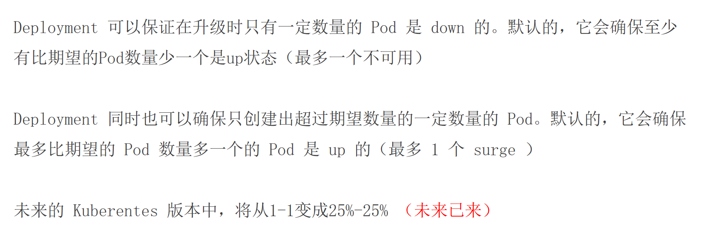

### pod控制器 - Deployment - 更新策略 - 2


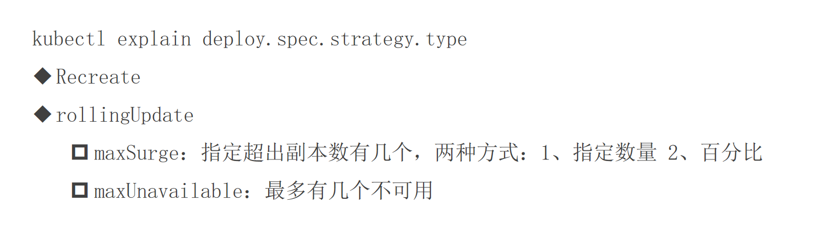


### pod控制器 - Deployment - 金丝雀部署 - 1


> 理念：用极小的版本数量去测试当前代码的稳定性


### **Kubernetes 金丝雀部署（Canary Deployment）完整案例**

本案例将演示如何通过 Kubernetes 的 **Deployment + Service + Ingress** 实现金丝雀发布，逐步将流量从旧版本（v1）切换到新版本（v2）。

---

#### **1. 实验环境准备**
- Kubernetes 集群（Minikube 或云服务）
- `kubectl` 命令行工具
- Nginx Ingress Controller（已安装）

---

#### **2. 部署初始版本（v1）**
##### **2.1 创建 v1 版本的 Deployment**
```yaml
# v1-deployment.yaml
apiVersion: apps/v1
kind: Deployment
metadata:
  name: myapp-v1
spec:
  replicas: 3
  selector:
    matchLabels:
      app: myapp
      version: v1
  template:
    metadata:
      labels:
        app: myapp
        version: v1
    spec:
      containers:
      - name: nginx
        image: nginx:1.25  # 初始版本
        ports:
        - containerPort: 80
```

##### **2.2 创建 Service（统一流量入口）**
```yaml
# service.yaml
apiVersion: v1
kind: Service
metadata:
  name: myapp-service
spec:
  selector:
    app: myapp  # 同时选择 v1 和 v2 的 Pod
  ports:
    - protocol: TCP
      port: 80
      targetPort: 80
```

##### **2.3 部署并验证**
```bash
kubectl apply -f v1-deployment.yaml -f service.yaml
kubectl get pods -l app=myapp  # 应看到 3 个 v1 Pod
```

---

#### **3. 金丝雀发布新版本（v2）**
##### **3.1 部署 v2 版本（少量 Pod）**
```yaml
# v2-deployment.yaml
apiVersion: apps/v1
kind: Deployment
metadata:
  name: myapp-v2
spec:
  replicas: 1  # 仅启动 1 个 Pod（占总流量的 25%）
  selector:
    matchLabels:
      app: myapp
      version: v2
  template:
    metadata:
      labels:
        app: myapp
        version: v2
    spec:
      containers:
      - name: nginx
        image: nginx:1.26  # 新版本
        ports:
        - containerPort: 80
```

##### **3.2 应用变更**
```bash
kubectl apply -f v2-deployment.yaml
kubectl get pods -l app=myapp  # 应看到 3 个 v1 + 1 个 v2
```

---

#### **4. 配置 Ingress 流量分割**
##### **4.1 创建 Ingress 规则（基于权重路由）**
```yaml
# ingress.yaml
apiVersion: networking.k8s.io/v1
kind: Ingress
metadata:
  name: myapp-ingress
  annotations:
    nginx.ingress.kubernetes.io/canary: "true"
    nginx.ingress.kubernetes.io/canary-weight: "25"  # 25% 流量到 v2
spec:
  rules:
  - host: myapp.example.com
    http:
      paths:
      - path: /
        pathType: Prefix
        backend:
          service:
            name: myapp-service
            port:
              number: 80
```

##### **4.2 启用 Ingress**
```bash
kubectl apply -f ingress.yaml
```

---

#### **5. 验证金丝雀发布**
##### **5.1 测试流量分配**
```bash
# 本地 hosts 添加解析（或使用 curl 的 --resolve 参数）
echo "服务器IP myapp.example.com" >> /etc/hosts

# 多次访问观察版本分布
curl http://myapp.example.com
```
- **预期结果**：约 25% 请求返回 `nginx:1.26`（v2），其余返回 `nginx:1.25`（v1）。

##### **5.2 监控与扩缩**
```bash
# 查看 Pod 日志
kubectl logs -l version=v2 --tail=50

# 若 v2 运行稳定，逐步扩大比例
kubectl patch ingress myapp-ingress -p '{"metadata":{"annotations":{"nginx.ingress.kubernetes.io/canary-weight":"50"}}}'
```

---

#### **6. 完成全量发布**
##### **6.1 将 v2 扩缩至 100%**
```bash
# 修改 Ingress 权重为 100%
kubectl patch ingress myapp-ingress -p '{"metadata":{"annotations":{"nginx.ingress.kubernetes.io/canary-weight":"100"}}}'

# 删除 v1 Deployment
kubectl delete deployment myapp-v1
```

---

### **关键点总结**
| 步骤               | 操作要点                                                                 |
|--------------------|--------------------------------------------------------------------------|
| **初始部署**       | 创建 v1 Deployment 和 Service                                            |
| **金丝雀发布**     | 部署少量 v2 Pod，通过 Ingress 权重控制流量                               |
| **验证**           | 使用 `curl` 测试流量分配比例                                             |
| **全量发布**       | 逐步调整权重至 100%，最终删除旧版本                                      |

### **扩展实验**
1. **基于 Header 的金丝雀**：  
   添加注解 `nginx.ingress.kubernetes.io/canary-by-header: "X-Canary"`，仅对特定 Header 请求发送到 v2。
2. **自动回滚**：  
   结合 Prometheus 监控，若 v2 错误率超过阈值，自动将权重降为 0。

通过此案例，您可以完整体验金丝雀发布的流程和原理！


### pod控制器 - Deployment - 回滚命令


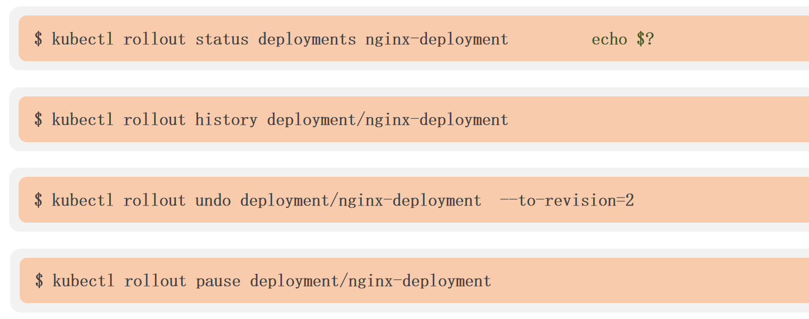


---

### **1. 查看部署状态 & 返回值**
```bash
kubectl rollout status deployment/nginx-deployment
echo $?
```
- **作用**：
    - 检查 `nginx-deployment` 的滚动更新状态（如是否完成、是否卡住）。
    - `echo $?` 显示上一条命令的退出状态码：
        - `0`：成功（部署已完成且所有 Pod 就绪）。
        - `非0`：失败（需结合日志排查）。
- **输出示例**：
  ```bash
  Waiting for rollout to finish: 2 out of 3 new replicas have been updated...
  ```

---

### **2. 查看部署历史**
```bash
kubectl rollout history deployment/nginx-deployment
```
- **作用**：  
  显示 `nginx-deployment` 的所有修订版本（revision），包括：
    - 版本号（如 `revision 1`、`revision 2`）。
    - 触发变更的命令（若创建时使用了 `--record`）。
- **输出示例**：
  ```bash
  REVISION  CHANGE-CAUSE
  1         kubectl apply --filename=deploy.yaml --record=true
  2         kubectl set image deployment/nginx-deployment nginx=nginx:1.25
  ```

---

### **3. 回滚到指定版本**
```bash
kubectl rollout undo deployment/nginx-deployment --to-revision=2
```
- **作用**：  
  将 `nginx-deployment` 回退到历史版本 `2`（如从有问题的 `nginx:1.26` 回滚到稳定的 `nginx:1.25`）。
- **底层机制**：
    - Kubernetes 会重新应用修订版本 `2` 的配置，触发滚动更新。
- **注意事项**：
    - 回滚后，原历史记录仍保留，但会生成新记录（如 `revision 3` 为回滚操作）。

---

### **4. 暂停部署**
```bash
kubectl rollout pause deployment/nginx-deployment
```
- **作用**：  
  暂停 `nginx-deployment` 的滚动更新（如临时停止自动扩容或镜像更新）。
- **典型场景**：
    - 分阶段发布时，先暂停部署，手动验证金丝雀版本后再继续。
- **恢复命令**：
  ```bash
  kubectl rollout resume deployment/nginx-deployment
  ```

---

### **命令之间的关系**
1. **查看历史**（`history`）→ **选择回滚版本** → **执行回滚**（`undo`）。
2. **暂停**（`pause`）和 **恢复**（`resume`）用于控制更新流程。
3. **状态检查**（`status`）用于监控操作结果。

---

### **完整操作流程示例**
```bash
# 1. 发现当前版本有问题，先暂停部署
kubectl rollout pause deployment/nginx-deployment

# 2. 查看历史版本，确认稳定版本号
kubectl rollout history deployment/nginx-deployment

# 3. 回滚到 revision 2
kubectl rollout undo deployment/nginx-deployment --to-revision=2

# 4. 监控回滚状态
kubectl rollout status deployment/nginx-deployment

# 5. 验证无误后，恢复自动更新（如需）
kubectl rollout resume deployment/nginx-deployment
```

---

### **总结**
| 命令                          | 核心功能                     | 常用参数                  |
|-------------------------------|----------------------------|--------------------------|
| `rollout status`             | 检查部署状态               | -                        |
| `rollout history`            | 查看修订历史               | -                        |
| `rollout undo --to-revision` | 回滚到指定版本             | `--to-revision=<版本号>` |
| `rollout pause`              | 暂停更新                   | -                        |

这些命令是 Kubernetes 部署管理的核心工具，尤其适用于 CI/CD 流水线中的版本控制和故障恢复。


### pod控制器 - Deployment - 清理策略


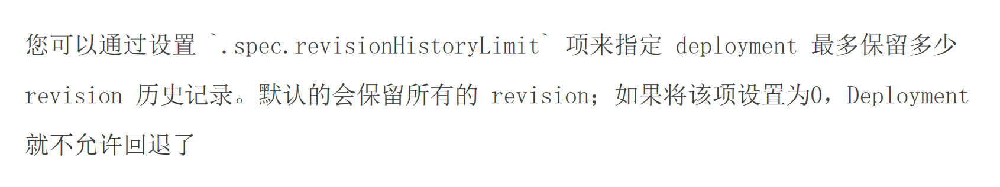


### ks8 yaml模版

在 Kubernetes 中，`kubectl run` 命令用于快速创建单次运行的 Pod 或 Deployment。如果您想生成 YAML 格式的配置（而不是直接创建资源），可以结合 `--dry-run=client` 和 `-o yaml` 参数。以下是具体用法和示例：

---

### **1. 生成 Pod 的 YAML 配置**
```bash
kubectl run mypod --image=nginx:1.25 --port=80 --dry-run=client -o yaml
```
**输出示例**：
```yaml
apiVersion: v1
kind: Pod
metadata:
  creationTimestamp: null
  labels:
    run: mypod
  name: mypod
spec:
  containers:
  - image: nginx:1.25
    name: mypod
    ports:
    - containerPort: 80
    resources: {}
  dnsPolicy: ClusterFirst
  restartPolicy: Always
status: {}
```

---

### **2. 生成 Deployment 的 YAML 配置**
```bash
kubectl run mydeploy --image=nginx:1.25 --port=80 --dry-run=client -o yaml --replicas=3
```
**输出示例**：
```yaml
apiVersion: apps/v1
kind: Deployment
metadata:
  creationTimestamp: null
  labels:
    run: mydeploy
  name: mydeploy
spec:
  replicas: 3
  selector:
    matchLabels:
      run: mydeploy
  strategy: {}
  template:
    metadata:
      creationTimestamp: null
      labels:
        run: mydeploy
    spec:
      containers:
      - image: nginx:1.25
        name: mydeploy
        ports:
        - containerPort: 80
        resources: {}
status: {}
```

---

### **3. 生成 Job 的 YAML 配置**
```bash
kubectl run myjob --image=busybox --dry-run=client -o yaml -- /bin/sh -c "sleep 30"
```
**输出示例**：
```yaml
apiVersion: batch/v1
kind: Job
metadata:
  creationTimestamp: null
  labels:
    run: myjob
  name: myjob
spec:
  template:
    metadata:
      creationTimestamp: null
      labels:
        run: myjob
    spec:
      containers:
      - args:
        - /bin/sh
        - -c
        - sleep 30
        image: busybox
        name: myjob
        resources: {}
      restartPolicy: OnFailure
status: {}
```

---

### **关键参数说明**
| 参数                  | 作用                                                                 |
|-----------------------|----------------------------------------------------------------------|
| `--dry-run=client`    | 仅模拟运行，不实际创建资源                                           |
| `-o yaml`             | 输出 YAML 格式的配置                                                 |
| `--image`             | 指定容器镜像                                                         |
| `--port`              | 声明容器暴露的端口                                                   |
| `--replicas`          | 指定 Deployment 的副本数（默认为 1）                                 |
| `-- /bin/sh -c "..."` | 覆盖容器的启动命令（用于 Job/CronJob）                                |

---

### **使用建议**
1. **保存到文件**：  
   将生成的 YAML 保存到文件后进一步编辑：
   ```bash
   kubectl run mypod --image=nginx --dry-run=client -o yaml > pod.yaml
   ```

2. **直接创建资源**：  
   去掉 `--dry-run=client` 即可直接应用配置：
   ```bash
   kubectl run mypod --image=nginx -o yaml | kubectl apply -f -
   ```

3. **自定义标签**：  
   通过 `--labels` 添加自定义标签：
   ```bash
   kubectl run mypod --image=nginx --labels=env=prod,app=web -o yaml
   ```

---

通过这种方式，您可以快速生成标准的 Kubernetes YAML 模板，并根据需求进行定制化修改。


### pod控制器 - DaemonSet

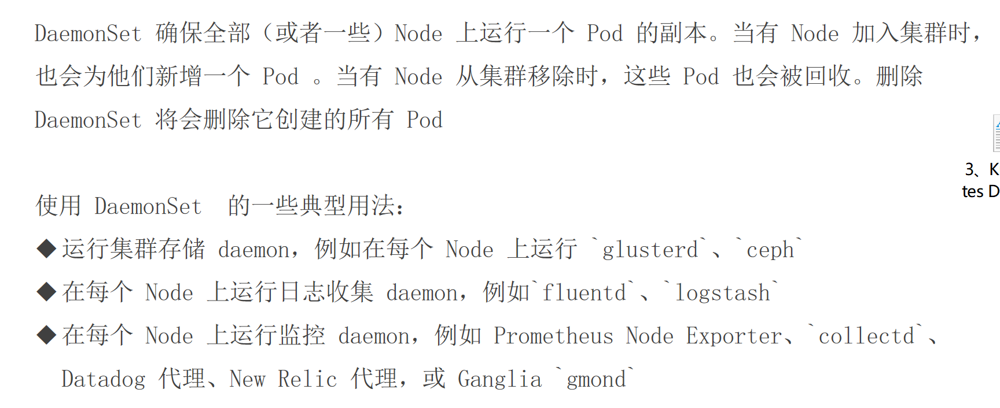

- 保障每个节点有且只有一个Pod的运行，动态

#### 8.ds.yaml


```yaml
apiVersion: apps/v1
kind: DaemonSet
metadata:
  name: deamonset-demo
  labels:
    app: deamonset-demo
spec:
  selector:
    matchLabels:
      name: deamonset-demo
  template:
    metadata:
      labels:
        name: deamonset-demo
    spec:
      containers:
      - name: daemonset-demo-container  
        image: nginx:1.25  
        ports:
        - containerPort: 80  
```

```bash
[root@k8s-master01 5]# kubectl get pod
NAME                   READY   STATUS    RESTARTS   AGE
deamonset-demo-5npxv   1/1     Running   0          5s
deamonset-demo-khxvh   1/1     Running   0          5s
```

```bash
kubectl describe node k8s-master01

```
存在污点，导致deamonset不会在主节点创建pod

```bash
Taints:             node-role.kubernetes.io/control-plane:NoSchedule
```


### pod控制器 - Job - 特性

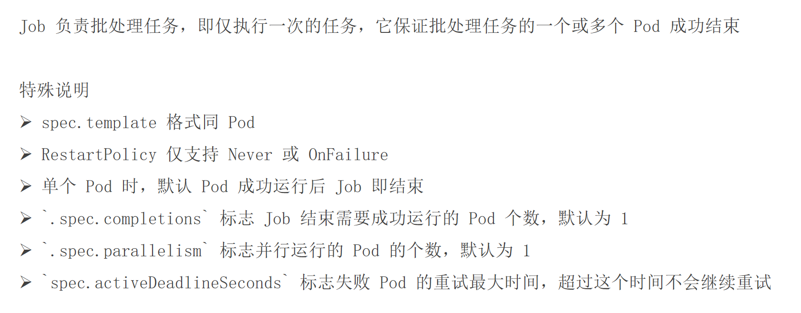

- Job：保障批处理任务一个或多个成功为止


### pod控制器 - Job - Madhava's formula


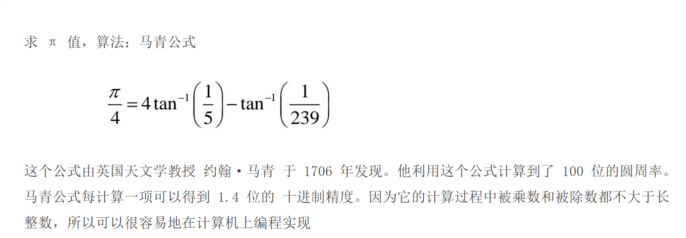


以下是根据提供的文件内容整理和修正的代码：

### 1. Python 圆周率计算脚本 (`main.py`)

```python
# -*- coding: utf-8 -*-
from __future__ import division
import time

# 记录开始时间
time1 = time.time()

# 使用马青公式计算圆周率
number = 1000
number1 = number + 10  # 多计算10位防止舍入误差
b = 10 ** number1      # 基数

# 初始化首项
x1 = b * 4 // 5        # 4/5 项 (使用整除确保整数运算)
x2 = b // -239         # -1/239 项
he = x1 + x2           # 当前总和

# 迭代计算 (步长为2)
for i in xrange(3, number * 2, 2):
    x1 //= -25         # 更新 1/5 的项 (含符号)
    x2 //= -57121      # 更新 1/239 的项 (含符号)
    x = (x1 + x2) // i # 当前项值
    he += x            # 累加到总和

# 最终计算并调整精度
pai = he * 4           # 乘以4得到π
pai //= 10 ** 10       # 移除多余的10位

# 格式化输出结果
paistring = str(pai)
result = paistring[0] + '.' + paistring[1:]
print(result)

# 计算并输出耗时
time2 = time.time()
print('Total time: {:.3f}s'.format(time2 - time1))
```

### 2. Dockerfile (构建计算镜像)

```dockerfile
FROM python:2.7
ADD ./main.py /root/main.py
CMD ["python", "/root/main.py"]
```

### 3. Kubernetes Job 配置文件 (`job.yaml`)

```yaml
apiVersion: batch/v1
kind: Job
metadata:
  name: job-demo
spec:
  template:
    metadata:
      name: job-demo-pod
    spec:
      containers:
      - name: job-demo-container
        image: wangyanglinux/tools:magingpythonv1
      restartPolicy: Never
  backoffLimit: 4  # 失败重试次数
```

---


> **部署流程**：
> 1. 构建 Docker 镜像：`docker build -t wangyanglinux/tools:magingpythonv1 .`
> 2. 推送镜像到仓库：`docker push wangyanglinux/tools:magingpythonv1`
> 3. 部署到 Kubernetes：`kubectl apply -f job.yaml`
> 4. 查看结果：`kubectl logs job/job-demo`


---


要创建并使用自己的 Docker 镜像，需要完成以下步骤：

### 完整操作流程

#### 1. 创建 Python 脚本文件
新建 `main.py` 文件，内容如下：
```python
# -*- coding: utf-8 -*-
from __future__ import division
import time

time1 = time.time()

number = 1000
number1 = number + 10
b = 10 ** number1
x1 = b * 4 // 5
x2 = b // -239
he = x1 + x2

for i in xrange(3, number * 2, 2):
    x1 //= -25
    x2 //= -57121
    x = (x1 + x2) // i
    he += x

pai = he * 4
pai //= 10 ** 10
paistring = str(pai)
result = paistring[0] + '.' + paistring[1:]
print(result)

time2 = time.time()
print('Total time: {:.3f}s'.format(time2 - time1))
```

#### 2. 创建 Dockerfile
新建 `Dockerfile` 文件（无扩展名），内容如下：
```dockerfile
FROM python:2.7
COPY main.py /app/
WORKDIR /app
CMD ["python", "main.py"]
```

#### 3. 构建自定义 Docker 镜像
在终端执行（替换 `your-dockerhub-username` 为你的实际用户名）：
```bash
docker build -t your-dockerhub-username/pi-calculator:v1 .
```

#### 4. 测试镜像
```bash
docker run --rm your-dockerhub-username/pi-calculator:v1
```

#### 5. 推送镜像到阿里云容器服务

[Docker——发布本地镜像到Docker Hub和阿里云容器服务](https://blog.csdn.net/wpc2018/article/details/121779047?ops_request_misc=%257B%2522request%255Fid%2522%253A%252206f9ce2d7323cc8e57fe58114ca16518%2522%252C%2522scm%2522%253A%252220140713.130102334..%2522%257D&request_id=06f9ce2d7323cc8e57fe58114ca16518&biz_id=0&utm_medium=distribute.pc_search_result.none-task-blog-2~all~sobaiduend~default-3-121779047-null-null.142^v102^control&utm_term=docker%20hub&spm=1018.2226.3001.4187)


# 使用阿里云容器服务创建和部署镜像的完整指南

您已经成功注册了阿里云容器服务，下面是完整的操作流程，包括创建镜像、上传到阿里云容器镜像服务（ACR）以及修改YAML文件：

## 完整操作流程

### 1. 准备工作
```bash
# 确保您有Dockerfile和main.py文件
ls
# 应该看到: Dockerfile main.py

# 登录阿里云Docker Registry（替换<username>为您的阿里云账号）
docker login --username=<username> registry.<region>.aliyuncs.com
# 密码：开通服务时设置的密码或AccessKey密码
```

### 2. 构建本地镜像
```bash
# 构建镜像
docker build -t pi-calculator:v1 .
```

### 3. 配置阿里云镜像仓库
1. 登录[阿里云容器镜像服务控制台](https://cr.console.aliyun.com)
2. 创建命名空间（例如：your-namespace）
3. 创建镜像仓库（例如：pi-calculator）
4. 选择"本地仓库"类型

### 4. 标记并推送镜像到ACR
```bash
# 获取完整镜像地址（在仓库详情页面查看）
# 格式：registry.<region>.aliyuncs.com/<namespace>/<repo-name>:<tag>

# 标记本地镜像
docker tag pi-calculator:v1 registry.<region>.aliyuncs.com/your-namespace/pi-calculator:v1

# 推送镜像到阿里云ACR
docker push registry.<region>.aliyuncs.com/your-namespace/pi-calculator:v1
```

### 5. 修改Kubernetes Job YAML
```yaml
apiVersion: batch/v1
kind: Job
metadata:
  name: job-demo
spec:
  template:
    metadata:
      name: job-demo-pod
    spec:
      containers:
      - name: job-demo-container
        image: registry.<region>.aliyuncs.com/your-namespace/pi-calculator:v1
      restartPolicy: Never
  backoffLimit: 4
```

### 6. 配置Kubernetes拉取私有镜像凭证
```bash
# 创建Secret存储Docker凭证
kubectl create secret docker-registry aliyun-regcred \
  --docker-server=registry.<region>.aliyuncs.com \
  --docker-username=<username> \
  --docker-password=<password>
```

### 7. 更新Job YAML使用凭证
```yaml
apiVersion: batch/v1
kind: Job
metadata:
  name: job-demo
spec:
  template:
    metadata:
      name: job-demo-pod
    spec:
      imagePullSecrets:
      - name: aliyun-regcred  # 添加这行
      containers:
      - name: job-demo-container
        image: registry.<region>.aliyuncs.com/your-namespace/pi-calculator:v1
      restartPolicy: Never
  backoffLimit: 4
```

### 8. 部署并验证
```bash
# 应用Job配置
kubectl apply -f job.yaml

# 查看Job状态
kubectl get jobs

# 查看Pod日志
kubectl logs $(kubectl get pods -l job-name=job-demo -o jsonpath='{.items[0].metadata.name}')
```

## 阿里云容器服务关键概念说明

1. **地域(Region)**：
    - 阿里云服务的物理位置（如：cn-hangzhou, cn-beijing）
    - 在镜像地址中体现为：`registry.cn-hangzhou.aliyuncs.com`

2. **命名空间(Namespace)**：
    - 用于隔离不同项目或团队的镜像仓库
    - 例如：`your-company` 或 `your-team`

3. **镜像仓库(Repository)**：
    - 存储特定镜像的不同版本
    - 例如：`pi-calculator`

4. **完整镜像地址格式**：
   ```
   registry.<region>.aliyuncs.com/<namespace>/<repository>:<tag>
   ```
   示例：
   ```
   registry.cn-hangzhou.aliyuncs.com/dev-team/pi-calculator:v1
   ```

## 常见问题解决方案

### 1. 推送镜像时权限不足
```bash
# 检查是否已登录
docker logout registry.<region>.aliyuncs.com
docker login --username=<username> registry.<region>.aliyuncs.com

# 如果使用RAM子账号，确保有ACR推送权限
```

### 2. Kubernetes无法拉取私有镜像
```bash
# 验证Secret是否正确
kubectl get secret aliyun-regcred --output=yaml

# 查看Pod事件获取错误信息
kubectl describe pod <pod-name>
```

### 3. 跨地域访问优化
```yaml
# 在Job YAML中添加亲和性设置（如果集群在相同地域）
spec:
  template:
    spec:
      affinity:
        nodeAffinity:
          preferredDuringSchedulingIgnoredDuringExecution:
          - weight: 1
            preference:
              matchExpressions:
              - key: topology.kubernetes.io/region
                operator: In
                values:
                - <region>  # 如 cn-hangzhou
```

### 4. 使用阿里云ACR免密拉取（如果使用ACK集群）

如果您的Kubernetes集群是阿里云ACK集群：
1. 在ACR控制台开启"自动创建RAM角色"
2. 在ACK集群关联该RAM角色
3. 无需创建Secret即可拉取同账号下的ACR镜像

## 最佳实践建议

1. **镜像标签策略**：
    - 使用语义化版本：v1.0.0
    - 避免使用latest标签
    - 添加构建日期：v1-20230708

2. **安全加固**：
   ```dockerfile
   # 使用非root用户运行
   RUN adduser -D pi-user
   USER pi-user
   ```

3. **镜像大小优化**：
   ```dockerfile
   # 使用多阶段构建
   FROM python:2.7-slim AS builder
   # ...构建步骤...
   
   FROM python:2.7-alpine
   COPY --from=builder /app /app
   ```

4. **YAML模板参数化**：
   ```yaml
   # 使用Kustomize或Helm管理不同环境的镜像地址
   images:
   - name: job-demo-container
     newName: registry.cn-hangzhou.aliyuncs.com/your-namespace/pi-calculator
     newTag: v1
   ```

完成以上步骤后，您的应用将使用阿里云容器服务托管的自定义镜像运行在Kubernetes集群中。


#### 6. 修改 Kubernetes Job 配置
更新 `job.yaml` 文件：
```yaml
apiVersion: batch/v1
kind: Job
metadata:
  name: job-demo
spec:
  template:
    metadata:
      name: job-demo-pod
    spec:
      containers:
      - name: job-demo-container
        image: your-dockerhub-username/pi-calculator:v1  # 修改为你的镜像
      restartPolicy: Never
  backoffLimit: 4
```


修改后，如下：

#### 9.job.yaml

```yaml
apiVersion: batch/v1
kind: Job
metadata:
  name: job-demo
spec:
  template:
    metadata:
      name: job-demo-pod
    spec:
      containers:
      - name: job-demo-container
        image: crpi-cd1z0kbw072xy0ao.cn-guangzhou.personal.cr.aliyuncs.com/tangfire/pi-calculator:v1
      restartPolicy: Never
  backoffLimit: 4  # 失败重试次数
```
```bash
kubectl apply -f 9.job.yaml
```

报错：

```bash
Events:
  Type     Reason     Age               From               Message
  ----     ------     ----              ----               -------
  Normal   Scheduled  22s               default-scheduler  Successfully assigned default/job-demo-76s6c to k8s-node02
  Normal   BackOff    20s               kubelet            Back-off pulling image "crpi-cd1z0kbw072xy0ao.cn-guangzhou.personal.cr.aliyuncs.com/tangfire/pi-calculator:v1"
  Warning  Failed     20s               kubelet            Error: ImagePullBackOff
  Normal   Pulling    8s (x2 over 21s)  kubelet            Pulling image "crpi-cd1z0kbw072xy0ao.cn-guangzhou.personal.cr.aliyuncs.com/tangfire/pi-calculator:v1"
  Warning  Failed     7s (x2 over 20s)  kubelet            Failed to pull image "crpi-cd1z0kbw072xy0ao.cn-guangzhou.personal.cr.aliyuncs.com/tangfire/pi-calculator:v1": Error response from daemon: pull access denied for crpi-cd1z0kbw072xy0ao.cn-guangzhou.personal.cr.aliyuncs.com/tangfire/pi-calculator, repository does not exist or may require 'docker login': denied: requested access to the resource is denied
  Warning  Failed     7s (x2 over 20s)  kubelet            Error: ErrImagePull
```


根据您的描述，问题在于 Kubernetes Pod 无法拉取私有镜像，尽管您已在节点上成功使用 `docker pull`。根本原因是 **Kubernetes 未获得访问私有镜像仓库的凭证**。以下是详细分析和解决方案：

---

### **原因分析**
1. **私有仓库认证问题**
    - 镜像地址 `crpi-cd1z0kbw072xy0ao.cn-guangzhou.personal.cr.aliyuncs.com` 是阿里云私有仓库，需要登录凭证。
    - 虽然您通过 `docker login` 在节点上手动拉取了镜像，但 Kubernetes 不会自动使用这些凭证。
    - 错误信息明确提示：  
      `pull access denied ... repository may require 'docker login'`

2. **Kubernetes 的拉取机制**
    - Kubelet 在节点上独立运行，不共享宿主机的 Docker 认证信息。
    - 必须通过 Kubernetes Secret 显式提供凭证。

---

### **解决方案**
#### **步骤 1：创建镜像拉取 Secret**
使用您的阿里云容器镜像服务账号（通常是阿里云账号的 AccessKey）创建 Secret：

```bash
kubectl create secret docker-registry aliyun-secret \
  --docker-server=crpi-cd1z0kbw072xy0ao.cn-guangzhou.personal.cr.aliyuncs.com \
  --docker-username=<阿里云账号或AccessKey ID> \
  --docker-password=<阿里云密码或AccessKey Secret> \
  --namespace=default  # 确保与Job在同一个Namespace
```

#### **步骤 2：修改 YAML 添加 Secret 引用**
在 Pod 模板的 `spec` 中添加 `imagePullSecrets` 字段：

```yaml
apiVersion: batch/v1
kind: Job
metadata:
  name: job-demo
spec:
  template:
    metadata:
      name: job-demo-pod
    spec:
      containers:
      - name: job-demo-container
        image: crpi-cd1z0kbw072xy0ao.cn-guangzhou.personal.cr.aliyuncs.com/tangfire/pi-calculator:v1
      imagePullSecrets:  # 关键添加项
        - name: aliyun-secret  # 与Secret名称一致
      restartPolicy: Never
  backoffLimit: 4
```

---

### **验证与调试**
1. **应用更新后的配置**：
   ```bash
   kubectl delete job job-demo  # 删除旧Job
   kubectl apply -f 9.job.yaml  # 重新部署
   ```

2. **检查 Pod 状态**：
   ```bash
   kubectl get pods
   kubectl describe pod <pod-name>  # 查看Events确认是否拉取成功
   ```

3. **常见问题排查**：
    - **Secret 名称或命名空间不匹配**：确保 Secret 和 Job 在同一个 Namespace（默认为 `default`）。
    - **凭证错误**：确认 AccessKey 有仓库的拉取权限（阿里云控制台 -> 容器镜像服务 -> 访问凭证）。
    - **仓库地址拼写错误**：检查 `--docker-server` 地址是否与镜像地址完全一致（包括域名大小写）。

---

### **补充说明**
- **为什么 `docker pull` 能成功但 Pod 不行？**  
  Docker 客户端使用 `~/.docker/config.json` 存储凭证，而 Kubelet 不读取该文件，必须通过 Secret 注入凭证。
- **内网加速建议**（可选）：  
  如果集群在阿里云 VPC 内，可将镜像地址改为 **VPC 专属地址**（以 `-vpc` 结尾），加速拉取并免流量费：
  ```yaml
  image: crpi-cd1z0kbw072xy0ao-vpc.cn-guangzhou.personal.cr.aliyuncs.com/tangfire/pi-calculator:v1
  ```

通过以上步骤，Pod 将获得私有仓库的访问权限，镜像拉取问题即可解决。


```bash
[root@k8s-master01 5]# kubectl get job
NAME       COMPLETIONS   DURATION   AGE
job-demo   1/1           4m51s      6m31s

```

```bash
[root@k8s-master01 5]# kubectl get pod
NAME                   READY   STATUS      RESTARTS   AGE
job-demo-2sv6d         0/1     Completed   0          6m55s
```

```bash
[root@k8s-master01 5]# kubectl logs  job-demo-2sv6d
3.1415926535897932384626433832795028841971693993751058209749445923078164062862089986280348253421170679821480865132823066470938446095505822317253594081284811174502841027019385211055596446229489549303819644288109756659334461284756482337867831652712019091456485669234603486104543266482133936072602491412737245870066063155881748815209209628292540917153643678925903600113305305488204665213841469519415116094330572703657595919530921861173819326117931051185480744623799627495673518857527248912279381830119491298336733624406566430860213949463952247371907021798609437027705392171762931767523846748184676694051320005681271452635608277857713427577896091736371787214684409012249534301465495853710507922796892589235420199561121290219608640344181598136297747713099605187072113499999983729780499510597317328160963185950244594553469083026425223082533446850352619311881710100031378387528865875332083814206171776691473035982534904287554687311595628638823537875937519577818577805321712268066130019278766111959092164201989
Total time: 0.001s
```


### 补充一些私人镜像

### myversion:v1,myversion:v2,myversion:v3

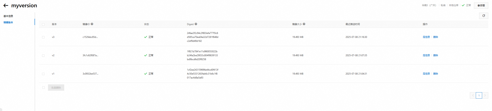

#### index.html

```html
<!DOCTYPE html>
<html>
<head>
    <title>Nginx Version</title>
</head>
<body>
    <h1>当前版本: v1.0</h1>
    <p>这是自定义的 Nginx 镜像</p>
</body>
</html>

```

#### Dockerfile

```Dockerfile
# 使用官方 Nginx 镜像
FROM nginx:1.25-alpine

# 替换默认主页
COPY index.html /usr/share/nginx/html/index.html
```

创建`myversion:v1`,`myversion:v2`,`myversion:v3`镜像


### randexit

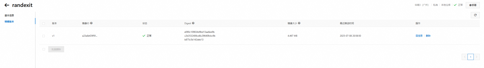


#### randexit.go

```go
package main

import (
	"flag"
	"fmt"
	"math/rand"
	"os"
	"time"
)

func main() {
	// 解析命令行参数
	exitCode := flag.Int("exitcode", 0, "Exit code to return (0-255)")
	flag.Parse()

	// 设置随机种子
	rand.Seed(time.Now().UnixNano())

	// 检查是否指定了有效的退出码
	if *exitCode >= 0 && *exitCode <= 255 {
		fmt.Printf("Exiting with specified code: %d\n", *exitCode)
		os.Exit(*exitCode)
	}

	// 生成随机退出码 (0-255)
	code := rand.Intn(256)
	fmt.Printf("Exiting with random code: %d\n", code)
	os.Exit(code)
}
```

#### Dockerfile

```Dockerfile
# 构建阶段
FROM golang:1.21-alpine AS builder
WORKDIR /app
COPY randexit.go .
RUN go build -o randexit randexit.go

# 最终镜像
FROM alpine:3.18
COPY --from=builder /app/randexit /randexit
ENTRYPOINT ["/randexit"]
```


### pod控制器 - Job - 正常退出完成

Job负责批处理任务，即仅执行一次的任务，它保证批处理任务的一个或多个Pod成功结束


#### 10.pod.yaml(失败版本)

```yaml
apiVersion: batch/v1
kind: Job
metadata:
  name: rand-exit
spec:
  template:
    spec:
      containers:
      - name: rand-container
        image: crpi-cd1z0kbw072xy0ao.cn-guangzhou.personal.cr.aliyuncs.com/tangfire/randexit:v1
        args: ["--exitcode=1"]  # 指定退出码为1
      imagePullSecrets:
        - name: aliyun-secret  # 私有仓库认证Secret
      restartPolicy: Never
  backoffLimit: 4
```


```bash
[root@k8s-master01 5]# kubectl get pod
NAME                   READY   STATUS      RESTARTS   AGE
rand-exit-28n5m        0/1     Error       0          93s
rand-exit-ct7kx        0/1     Error       0          2m10s
rand-exit-dsfdr        0/1     Error       0          52s
rand-exit-k65wp        0/1     Error       0          113s
```


```bash
[root@k8s-master01 5]# kubectl logs rand-exit-ct7kx
Exiting with specified code: 1
```

```bash
[root@k8s-master01 5]# kubectl get job
NAME        COMPLETIONS   DURATION   AGE
rand-exit   0/1           3m1s       3m1s
```

可以发现job是记录成功的数量值，并不是pod创建了几份


#### 11.pod.yaml(成功版本)

```yaml
apiVersion: batch/v1
kind: Job
metadata:
  name: rand-exit
spec:
  template:
    spec:
      containers:
      - name: rand-container
        image: crpi-cd1z0kbw072xy0ao.cn-guangzhou.personal.cr.aliyuncs.com/tangfire/randexit:v1
        args: ["--exitcode=0"]  # 指定退出码为0
      imagePullSecrets:
        - name: aliyun-secret  # 私有仓库认证Secret
      restartPolicy: Never
  backoffLimit: 4
```


```bash
[root@k8s-master01 5]# kubectl get pod
NAME                   READY   STATUS      RESTARTS   AGE
rand-exit-28sr6        0/1     Completed   0          11s
```

```bash
[root@k8s-master01 5]# kubectl get job
NAME        COMPLETIONS   DURATION   AGE
rand-exit   1/1           4s         82s
```


### pod控制器 - CronJob - 特性


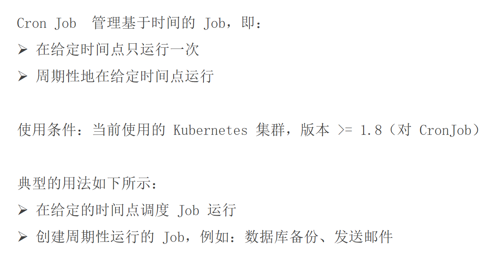


- CronJob：周期性的创建Job,典型的场景：数据库的周期性备份...


### pod控制器 - CronJob - Spec - 1

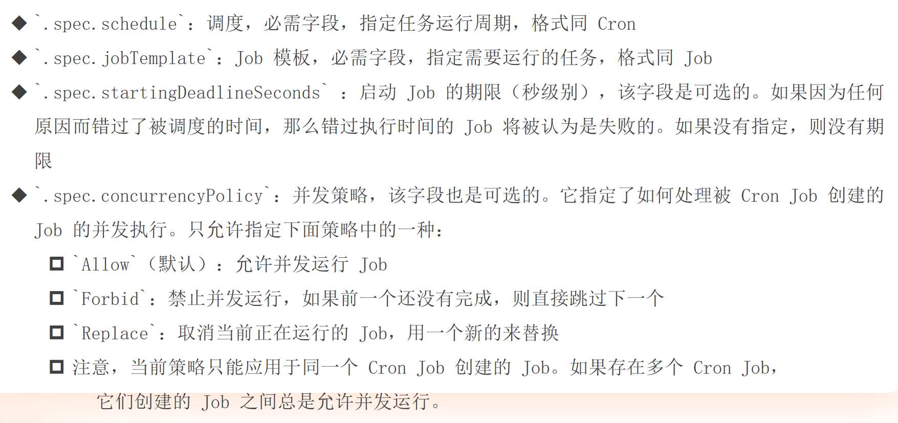


### pod控制器 - CronJob - Spec - 2

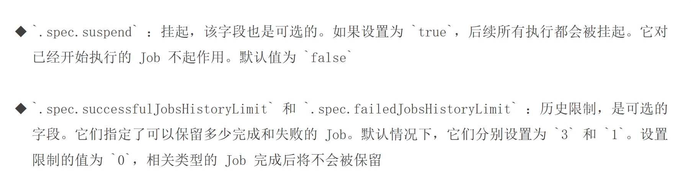


#### 12.cronjob.yaml

```yaml
apiVersion: batch/v1
kind: CronJob
metadata:
  name: cronjob-demo
spec:
  schedule: "*/1 * * * *"  # 修正为标准的每分钟调度表达式
  jobTemplate:
    spec:
      completions: 3       # 每次Job需要完成3个Pod
      template:
        spec:
          containers:
          - name: cronjob-demo-container  # 修正容器名称格式
            image: busybox
            command:                     # 使用command+args更规范的写法
              - /bin/sh
              - -c
              - date; echo "Hello from the Kubernetes cluster"
          restartPolicy: OnFailure
```


```bash
[root@k8s-master01 5]# kubectl get cronjob
NAME           SCHEDULE      SUSPEND   ACTIVE   LAST SCHEDULE   AGE
cronjob-demo   */1 * * * *   False     1        10s             14s

[root@k8s-master01 5]# kubectl get cronjob
NAME           SCHEDULE      SUSPEND   ACTIVE   LAST SCHEDULE   AGE
cronjob-demo   */1 * * * *   False     1        1s              65s
```

```bash
[root@k8s-master01 5]# kubectl get pod
NAME                          READY   STATUS      RESTARTS   AGE
cronjob-demo-29200381-46lgh   0/1     Completed   0          2m5s
cronjob-demo-29200381-5gb59   0/1     Completed   0          118s
cronjob-demo-29200381-6pxm5   0/1     Completed   0          2m14s
cronjob-demo-29200382-lfvzn   0/1     Completed   0          71s
cronjob-demo-29200382-t5vt2   0/1     Completed   0          67s
cronjob-demo-29200382-tp4mb   0/1     Completed   0          74s
cronjob-demo-29200383-kn94c   0/1     Completed   0          10s
cronjob-demo-29200383-mzhfl   0/1     Completed   0          14s
cronjob-demo-29200383-tmcp8   0/1     Completed   0          6s
```


### pod控制器 - CronJob - 限制

创建Job操作应该是幂等的


