# 存储 - 给数æ®ä¸€ä¸ªå¯é çš„家

## 01. 存储分类


## 02. configMap

é…置信æ¯çš„ä¿å­˜æ–¹å¼

### configMap - 模å‹

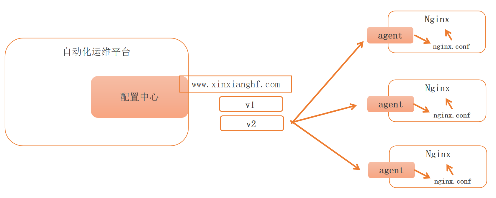


### configMap - 定义


### 多个æœåŠ¡ä¹‹é—´çš„文件（如é…置文件ã€é™æ€èµ„æºã€æ•°æ®æ–‡ä»¶ç­‰ï¼‰ä¿æŒä¸€è‡´æ€§çš„两ç§æ€æƒ³ï¼šå…±äº«å’Œæ³¨å…¥


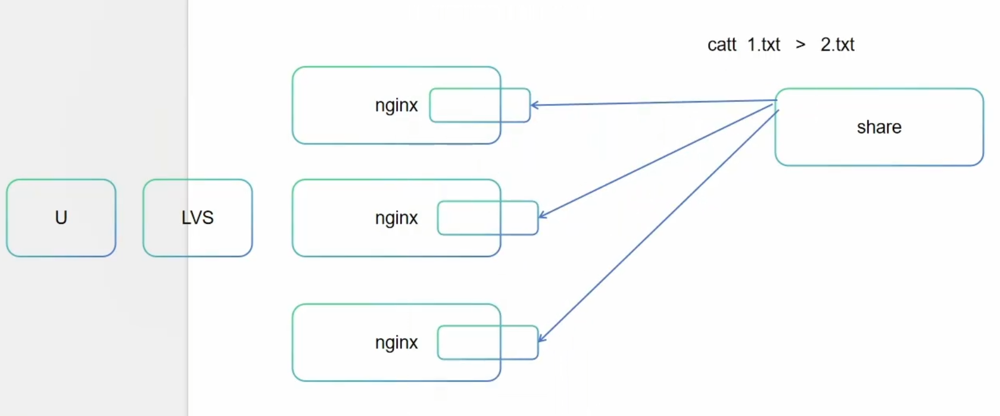

- 多个ä¸åŒçš„æœåŠ¡å†…部的文件达到一致
  - 共享
    - æ¯ä¸€æ¬¡åœ¨è¯»å–文件的时候，都会å‘生网络IO
  - 注入  configmap
    - 一次注入å，多次读å–ä¸å†æ¶ˆè€—网络IO


---

在分布å¼ç³»ç»Ÿæˆ–å¾®æœåŠ¡æ¶æ„中，确ä¿å¤šä¸ªæœåŠ¡ä¹‹é—´çš„文件（如é…置文件ã€é™æ€èµ„æºã€æ•°æ®æ–‡ä»¶ç­‰ï¼‰ä¿æŒä¸€è‡´æ€§æ˜¯ä¸€ä¸ªå¸¸è§éœ€æ±‚。以下是两ç§æ ¸å¿ƒæ€æƒ³ï¼š**共享（Sharing）** å’Œ **注入（Injection）**，分别通过ä¸åŒçš„机制å®ç°æ–‡ä»¶ä¸€è‡´æ€§ã€‚

---

## 1. **共享（Sharing）æ€æƒ³**
**核心逻辑**：多个æœåŠ¡é€šè¿‡è®¿é—®åŒä¸€ä¸ªå…±äº«å­˜å‚¨æˆ–中间媒介æ¥è·å–文件，确ä¿æ‰€æœ‰æœåŠ¡è¯»å–的内容始终一致。  
**适用场景**：文件较大ã€æ›´æ–°é¢‘ç‡ä½ã€éœ€è¦å¤šæœåŠ¡å®æ—¶åŒæ­¥çš„场景（如é…置文件ã€é™æ€èµ„æºï¼‰ã€‚

### å®ç°æ–¹å¼ï¼š
#### （1）**共享存储å·ï¼ˆVolume）**
- **工具**：Kubernetes çš„ `PersistentVolume (PV)`ã€`PersistentVolumeClaim (PVC)`，或云存储（如 AWS S3ã€NFS）。
- **åŸç†**：将文件存储在共享å·ä¸­ï¼Œå¤šä¸ªæœåŠ¡æŒ‚è½½åŒä¸€å·ï¼Œç›´æ¥è¯»å–åŒä¸€ä»½æ–‡ä»¶ã€‚
- **示例**：
  ```yaml
  # Kubernetes Deployment挂载共享PVC
  volumes:
    - name: shared-config
      persistentVolumeClaim:
        claimName: my-pvc  # 多个Pod共用åŒä¸€ä¸ªPVC
  ```

#### （2）**分布å¼æ–‡ä»¶ç³»ç»Ÿ**
- **工具**：HDFSã€Cephã€GlusterFS。
- **åŸç†**：文件在分布å¼ç³»ç»Ÿä¸­å…¨å±€å¯è§ï¼ŒæœåŠ¡é€šè¿‡ç»Ÿä¸€æ¥å£è®¿é—®ã€‚

#### （3）**中间件åŒæ­¥**
- **工具**：数æ®åº“（如 MySQL）ã€é…置中心（如 Apolloã€Nacos）。
- **åŸç†**：将文件内容存入数æ®åº“或é…置中心，æœåŠ¡å®šæœŸæ‹‰å–或监å¬å˜æ›´ã€‚

### 优缺点：
| **优点**                     | **缺点**                     |
|------------------------------|------------------------------|
| 文件å•ç‚¹å­˜å‚¨ï¼Œå¼ºä¸€è‡´æ€§       | 共享存储å¯èƒ½æˆä¸ºæ€§èƒ½ç“¶é¢ˆ     |
| æ›´æ–°æ—¶åªéœ€ä¿®æ”¹ä¸€æ¬¡           | 需è¦å¤„ç†å¹¶å‘è¯»å†™å†²çª         |
| 适åˆå¤§æ–‡ä»¶æˆ–频ç¹è¯»åœºæ™¯       | ä¾èµ–外部存储系统，å¤æ‚度高   |

---

## 2. **注入（Injection）æ€æƒ³**
**核心逻辑**：将文件内容通过æŸç§æœºåˆ¶ä¸»åŠ¨åˆ†å‘到å„个æœåŠ¡ä¸­ï¼ŒæœåŠ¡æœ¬åœ°æŒæœ‰æ–‡ä»¶çš„副本。  
**适用场景**：文件较å°ã€éœ€è¦ç‰ˆæœ¬æ§åˆ¶ã€æˆ–æœåŠ¡éœ€ç¦»çº¿è¿è¡Œçš„场景（如容器å¯åŠ¨é…置）。

### å®ç°æ–¹å¼ï¼š
#### （1）**é…ç½®å³ä»£ç ï¼ˆConfiguration as Code）**
- **工具**：Git 仓库 + CI/CD（如 Jenkinsã€GitLab CI）。
- **åŸç†**：文件存储在代ç åº“中，æœåŠ¡éƒ¨ç½²æ—¶é€šè¿‡æµæ°´çº¿å°†æ–‡ä»¶æ‰“包到容器镜åƒæˆ–ç›´æ¥æ³¨å…¥ç¯å¢ƒå˜é‡ã€‚
- **示例**：
  ```dockerfile
  # Dockerfile中å¤åˆ¶é…置文件
  COPY ./configs/app.conf /etc/service/app.conf
  ```

#### （2）**é…置管ç†å·¥å…·**
- **工具**：Ansibleã€Chefã€Puppet。
- **åŸç†**：工具将文件æ¨é€åˆ°å„个æœåŠ¡çš„本地目录。

#### （3）**容器å¯åŠ¨æ—¶æ³¨å…¥**
- **工具**：Kubernetes çš„ `ConfigMap`ã€`Secret`。
- **åŸç†**：将文件内容定义为 `ConfigMap`，挂载为容器的å·æˆ–ç¯å¢ƒå˜é‡ã€‚
- **示例**：
  ```yaml
  # 将ConfigMap挂载为Pod的文件
  volumes:
    - name: config-volume
      configMap:
        name: app-config
  ```

### 优缺点：
| **优点**                     | **缺点**                     |
|------------------------------|------------------------------|
| æœåŠ¡æœ¬åœ°è®¿é—®æ–‡ä»¶ï¼Œæ€§èƒ½é«˜     | 更新需é‡æ–°åˆ†å‘，å¯èƒ½å»¶è¿Ÿ     |
| 无共享ä¾èµ–ï¼Œéƒ¨ç½²æ›´ç®€å•       | 多副本间å¯èƒ½å­˜åœ¨çŸ­æš‚ä¸ä¸€è‡´   |
| 适åˆæ•æ„Ÿé…置（如密钥）       | 文件版本管ç†éœ€é¢å¤–设计       |

---

## **对比ä¸é€‰å‹å»ºè®®**
| **维度**         | **共享（Sharing）**          | **注入（Injection）**        |
|------------------|-----------------------------|-----------------------------|
| **一致性强度**   | 强一致性（å®æ—¶åŒæ­¥ï¼‰        | 最终一致性（需分å‘时间）     |
| **性能影å“**     | ä¾èµ–共享存储性能            | 本地读å–，性能高            |
| **å¤æ‚度**       | 需维护共享存储系统          | 需设计分å‘机制              |
| **适用场景**     | 多æœåŠ¡å®æ—¶è¯»å†™å¤§æ–‡ä»¶        | æ•æ„Ÿé…置或离线æœåŠ¡          |

### **å®é™…组åˆä½¿ç”¨æ¡ˆä¾‹**
- **Kubernetes 最佳å®è·µ**：
    - 用 `ConfigMap`（注入）管ç†é…置文件，通过å·æŒ‚载到多个 Pod。
    - 用 `PV/PVC`（共享）存储日志或大数æ®æ–‡ä»¶ã€‚
- **æ··åˆæ¶æ„**：
    - æ•°æ®åº“è¿æ¥å­—符串通过 `Secret`（注入）分å‘，é™æ€èµ„æºé€šè¿‡ CDN（共享）访问。

---

## **总结**
- **选择共享**：当需è¦å¼ºä¸€è‡´æ€§ã€æ–‡ä»¶è¾ƒå¤§æˆ–多æœåŠ¡é¢‘ç¹è¯»å†™æ—¶ï¼ˆå¦‚共享日志存储）。
- **选择注入**：当需è¦å¿«é€Ÿå¯åŠ¨ã€éš”离性高或é…ç½®æ•æ„Ÿæ—¶ï¼ˆå¦‚å¾®æœåŠ¡é…置）。

两ç§æ€æƒ³å¹¶é互斥，å®é™…系统中常结åˆä½¿ç”¨ï¼Œä¾‹å¦‚用共享存储存放大数æ®ï¼ŒåŒæ—¶ç”¨ ConfigMap 注入关键é…置。


---


### **通俗版解释：共享 vs 注入**

想象一下，你和几个åŒäº‹ï¼ˆä»£è¡¨ä¸åŒçš„æœåŠ¡ï¼‰éœ€è¦ä¸€èµ·å®Œæˆä¸€ä¸ªé¡¹ç›®ï¼Œè€Œé¡¹ç›®èµ„料（文件）需è¦ä¿æŒä¸€è‡´ã€‚有两ç§æ–¹æ³•å¯ä»¥åšåˆ°ï¼š

---

### **1. 共享（Sharing）——大家一起看åŒä¸€ä»½èµ„æ–™**
**场景**：
- 你们所有人都在一个åŠå…¬å®¤é‡Œï¼Œèµ„料放在åŠå…¬å®¤ä¸­å¤®çš„一个共享文件夹里。
- è°éœ€è¦çœ‹èµ„料，就直æ¥å»æ–‡ä»¶å¤¹é‡Œæ‹¿ã€‚
- 如æœæœ‰äººæ›´æ–°äº†èµ„料，其他人立刻就能看到最新版本。

**例å­**：
- **云盘共享**：比如用百度网盘或Google Drive存文件，所有人访问åŒä¸€ä¸ªé“¾æ¥ï¼Œæ–‡ä»¶ä¸€æ”¹å¤§å®¶éƒ½èƒ½çœ‹åˆ°ã€‚
- **Kubernetes共享存储**：多个æœåŠ¡æŒ‚è½½åŒä¸€ä¸ªç£ç›˜ï¼ˆæ¯”如NFS），文件改了所有æœåŠ¡éƒ½èƒ½è¯»åˆ°ã€‚

**优点**：
- 文件åªæœ‰ä¸€ä»½ï¼Œä¸ä¼šä¹±ï¼ˆå¼ºä¸€è‡´æ€§ï¼‰ã€‚
- 改一次，所有人马上生效。

**缺点**：
- 如æœå…±äº«æ–‡ä»¶å¤¹æŒ‚了（比如网盘崩了），所有人都没法干活。
- 如æœå¾ˆå¤šäººåŒæ—¶æ”¹æ–‡ä»¶ï¼Œå¯èƒ½ä¼šå†²çªï¼ˆæ¯”如两个人åŒæ—¶æ”¹åŒä¸€è¡Œï¼‰ã€‚

---

### **2. 注入（Injection）——æ¯äººå‘一份资料副本**
**场景**：
- 你们ä¸åœ¨ä¸€ä¸ªåŠå…¬å®¤ï¼Œæ²¡æ³•å®æ—¶å…±äº«æ–‡ä»¶ã€‚
- 领导（系统管ç†å‘˜ï¼‰æŠŠèµ„料打å°å¥½ï¼Œæ¯äººå‘一份，放å„自桌上。
- 如æœèµ„料有更新，领导得é‡æ–°æ‰“å°ï¼Œå†å‘一é（å¯èƒ½æœ‰ç‚¹å»¶è¿Ÿï¼‰ã€‚

**例å­**：
- **é…置文件打包进软件**：比如APPçš„é…置直æ¥å†™åœ¨ä»£ç é‡Œï¼Œæ›´æ–°æ—¶è¦é‡æ–°å‘布新版本。
- **Kubernetes ConfigMap**：把é…置文件“注入â€åˆ°æ¯ä¸ªæœåŠ¡é‡Œï¼Œæ”¹é…ç½®åè¦é‡å¯æœåŠ¡æ‰èƒ½ç”Ÿæ•ˆã€‚

**优点**：
- æ¯äººæœ‰è‡ªå·±çš„文件，ä¸ä¾èµ–别人（高å¯ç”¨ï¼‰ã€‚
- 适åˆæ•æ„Ÿä¿¡æ¯ï¼ˆæ¯”如密ç ï¼‰ï¼Œå› ä¸ºä¸ç”¨å…±äº«å­˜å‚¨ã€‚

**缺点**：
- 如æœæ–‡ä»¶æ›´æ–°äº†ï¼Œä¸èƒ½é©¬ä¸ŠåŒæ­¥ï¼ˆå¾—等领导é‡æ–°å‘）。
- 如æœæ¯äººæ‰‹é‡Œçš„版本ä¸ä¸€æ ·ï¼Œå¯èƒ½ä¼šä¹±ï¼ˆæœ€ç»ˆä¸€è‡´æ€§ï¼‰ã€‚

---

### **ç°å®ä¸­çš„例å­**
- **共享（Sharing）**
  - å…¬å¸ç”¨ **Excel 在线å作**（比如腾讯文档），所有人编辑åŒä¸€ä»½è¡¨æ ¼ã€‚
  - é£é™©ï¼šå¦‚æœè…¾è®¯æ–‡æ¡£å´©äº†ï¼Œæ‰€æœ‰äººéƒ½æ²¡æ³•å·¥ä½œã€‚

- **注入（Injection）**
  - å…¬å¸å‘ **PDF 文件**ç»™æ¯ä¸ªå‘˜å·¥ï¼Œå¦‚æœæ›´æ–°äº†å¾—é‡æ–°å‘邮件。
  - é£é™©ï¼šæœ‰äººå¯èƒ½æ²¡æ”¶åˆ°æœ€æ–°ç‰ˆï¼Œè¿˜åœ¨ç”¨æ—§æ–‡ä»¶ã€‚

---

### **æ€ä¹ˆé€‰ï¼Ÿ**
| **æ–¹å¼** | **适åˆåœºæ™¯** | **ä¸é€‚用场景** |
|----------|------------|--------------|
| **共享** | 需è¦å®æ—¶åŒæ­¥ï¼ˆå¦‚多人编辑文档） | 文件很大ã€å…±äº«å­˜å‚¨ä¸å¯é  |
| **注入** | 需è¦ç‹¬ç«‹è¿è¡Œï¼ˆå¦‚APPé…置） | è¦æ±‚强一致性（ä¸èƒ½å®¹å¿å»¶è¿Ÿï¼‰ |

**å®é™…应用**：
- **å¾®æœåŠ¡é…ç½®**：用 **注入**（ConfigMap），因为æ¯ä¸ªæœåŠ¡è¦ç‹¬ç«‹è¿è¡Œã€‚
- **日志存储**：用 **共享**（NFS），因为日志è¦é›†ä¸­ç®¡ç†ã€‚

简å•æ¥è¯´ï¼š
- **共享** = 大家一起看åŒä¸€æœ¬ä¹¦ï¼ˆå®æ—¶ï¼Œä½†ä¾èµ–书ä¸èƒ½ä¸¢ï¼‰ã€‚
- **注入** = æ¯äººå‘一本（独立，但更新慢）。

æ ¹æ®ä½ çš„éœ€æ±‚é€‰å°±è¡Œï¼ ğŸ˜Š

---


### configMap - 创建

- `kubectl create configmap game-config --from-file=fire.file`
- `kubectl create configmap literal-config --from-literal=name=dave --from-literal=password=pass`

### **通俗解释：`kubectl create configmap game-config --from-file=fire.file`**

è¿™æ¡å‘½ä»¤çš„作用是：**把本地的一个文件（`fire.file`）å˜æˆ Kubernetes 里的一个“é…置包â€ï¼ˆ`ConfigMap`），åå­—å« `game-config`，方便 Pod（容器）读å–里é¢çš„内容。**

---

### **1. 什么是 `ConfigMap`？**
- **`ConfigMap` 是 Kubernetes 用æ¥å­˜é…置的东西**，比如é…置文件ã€ç¯å¢ƒå˜é‡ç­‰ã€‚
- 它ä¸ä¼šå­˜æ•æ„Ÿä¿¡æ¯ï¼ˆå¯†ç ç”¨ `Secret`），适åˆå­˜æ™®é€šé…置，比如游æˆå‚æ•°ã€æœåŠ¡å™¨åœ°å€ç­‰ã€‚
- Pod å¯ä»¥åƒè¯»æ–‡ä»¶æˆ–ç¯å¢ƒå˜é‡ä¸€æ ·è¯»å– `ConfigMap` 的内容。

---

### **2. `--from-file=fire.file` 是什么æ„æ€ï¼Ÿ**
- **`fire.file`**：是你电脑上的一个文件（比如内容å¯èƒ½æ˜¯ `max_players=10`）。
- **`--from-file`**：告诉 Kubernetes “把这个文件的内容å¡è¿› `ConfigMap` 里â€ã€‚
- 文件内容会被存到 `ConfigMap` çš„ `data` 字段下，键å默认是文件å（`fire.file`）。

---

### **3. 执行命令å会å‘生什么？**
- Kubernetes ä¼šåˆ›å»ºä¸€ä¸ªå« `game-config` çš„ `ConfigMap`。
- `fire.file` 的内容会被存进å»ï¼Œæ¯”如：
  ```yaml
  apiVersion: v1
  kind: ConfigMap
  metadata:
    name: game-config
  data:
    fire.file: |  # é”®å是文件å，值是文件内容
      max_players=10
      level=hard
  ```

---

### **4. Pod æ€ä¹ˆç”¨è¿™ä¸ª `ConfigMap`？**
#### **æ–¹å¼1：挂载æˆæ–‡ä»¶ï¼ˆæœ€å¸¸ç”¨ï¼‰**
让 Pod 把 `ConfigMap` 的内容å˜æˆä¸€ä¸ªæ–‡ä»¶ï¼ˆæ¯”如 `/etc/game/config`）：
```yaml
volumes:
  - name: config-volume
    configMap:
      name: game-config  # 使用刚创建的ConfigMap
containers:
  volumeMounts:
    - name: config-volume
      mountPath: /etc/game  # Pod内会看到文件：/etc/game/fire.file
```

#### **æ–¹å¼2：注入ç¯å¢ƒå˜é‡**
把 `ConfigMap` 的值å˜æˆç¯å¢ƒå˜é‡ï¼š
```yaml
env:
  - name: MAX_PLAYERS  # ç¯å¢ƒå˜é‡å
    valueFrom:
      configMapKeyRef:
        name: game-config
        key: fire.file  # ç›´æ¥å¼•ç”¨æ•´ä¸ªæ–‡ä»¶å†…容
```

---

### **5. å®é™…例å­**
å‡è®¾ `fire.file` 内容：
```ini
max_players=10
level=hard
```

**创建 ConfigMap：**
```bash
kubectl create configmap game-config --from-file=fire.file
```

**查看内容：**
```bash
kubectl get configmap game-config -o yaml
```
输出：
```yaml
data:
  fire.file: |
    max_players=10
    level=hard
```

---

### **6. 其他用法**
- **多个文件**：å¯ä»¥ä¸€æ¬¡å¡å¤šä¸ªæ–‡ä»¶è¿›å»ï¼š
  ```bash
  kubectl create configmap my-config --from-file=file1 --from-file=file2
  ```
- **目录**：直æ¥å¡æ•´ä¸ªç›®å½•çš„文件：
  ```bash
  kubectl create configmap dir-config --from-file=./configs/
  ```

---

### **总结**
- **è¿™æ¡å‘½ä»¤çš„作用**：把本地文件 `fire.file` å˜æˆ Kubernetes çš„ `ConfigMap`（`game-config`）。
- **Pod æ€ä¹ˆç”¨**：挂载æˆæ–‡ä»¶æˆ–ç¯å¢ƒå˜é‡ã€‚
- **适用场景**：存游æˆçš„é…ç½®ã€æœåŠ¡å™¨å‚æ•°ç­‰éæ•æ„Ÿä¿¡æ¯ã€‚

相当äºæŠŠæ–‡ä»¶â€œä¸Šä¼ â€åˆ° Kubernetes，让所有 Pod 都能方便地读å–ï¼ ğŸš€


---


### **通俗解释：`kubectl create configmap literal-config --from-literal=name=dave --from-literal=password=pass`**

è¿™æ¡å‘½ä»¤çš„作用是：**ç›´æ¥åœ¨ Kubernetes é‡Œåˆ›å»ºä¸€ä¸ªå« `literal-config` 的“é…置包â€ï¼ˆ`ConfigMap`），并往里é¢å­˜ä¸¤å¯¹é”®å€¼ï¼ˆ`name=dave` å’Œ `password=pass`），方便 Pod（容器）读å–这些值。**

---

### **1. 什么是 `ConfigMap`？**
- **`ConfigMap` 是 Kubernetes 用æ¥å­˜é…置的东西**，比如ç¯å¢ƒå˜é‡ã€é…置文件内容等。
- 它**ä¸é€‚åˆå­˜æ•æ„Ÿä¿¡æ¯**（比如密ç ï¼‰ï¼Œæ•æ„Ÿä¿¡æ¯åº”该用 `Secret`。
- 这里åªæ˜¯ä¸¾ä¾‹ï¼Œå®é™…密ç ä¸è¦ç”¨ `ConfigMap` å­˜ï¼

---

### **2. `--from-literal` 是什么æ„æ€ï¼Ÿ**
- **`--from-literal`**：直æ¥å‘Šè¯‰ Kubernetes “我è¦å­˜ä¸€ä¸ªé”®å€¼å¯¹â€ã€‚
- **`name=dave`**：键是 `name`，值是 `dave`。
- **`password=pass`**：键是 `password`，值是 `pass`ï¼ˆâš ï¸ å®é™…别这么干，用 `Secret`）。

---

### **3. 执行命令å会å‘生什么？**
Kubernetes 会创建一个 `ConfigMap`，内容如下：
```yaml
apiVersion: v1
kind: ConfigMap
metadata:
  name: literal-config  # 你指定的åå­—
data:
  name: dave      # 键值对1
  password: pass  # 键值对2ï¼ˆâš ï¸ å®é™…别这么存密ç ï¼ï¼‰
```

---

### **4. Pod æ€ä¹ˆç”¨è¿™ä¸ª `ConfigMap`？**
#### **æ–¹å¼1：作为ç¯å¢ƒå˜é‡ï¼ˆå¸¸ç”¨ï¼‰**
让 Pod è¯»å– `ConfigMap` 的值å˜æˆç¯å¢ƒå˜é‡ï¼š
```yaml
env:
  - name: PLAYER_NAME  # Pod内的ç¯å¢ƒå˜é‡å
    valueFrom:
      configMapKeyRef:
        name: literal-config  # ConfigMapåå­—
        key: name             # 读å–的键（dave）
  - name: PLAYER_PASSWORD    # å¦ä¸€ä¸ªç¯å¢ƒå˜é‡
    valueFrom:
      configMapKeyRef:
        name: literal-config
        key: password         # 读å–的键（pass）
```

#### **æ–¹å¼2：挂载æˆæ–‡ä»¶**
把 `ConfigMap` 的键值对å˜æˆæ–‡ä»¶ï¼š
```yaml
volumes:
  - name: config-volume
    configMap:
      name: literal-config
containers:
  volumeMounts:
    - name: config-volume
      mountPath: /etc/config
```
Pod 内会看到：
```
/etc/config/name      # 内容：dave
/etc/config/password  # 内容：pass
```

---

### **5. å®é™…例å­**
**创建 ConfigMap：**
```bash
kubectl create configmap literal-config --from-literal=name=dave --from-literal=password=pass
```

**查看内容：**
```bash
kubectl get configmap literal-config -o yaml
```
输出：
```yaml
data:
  name: dave
  password: pass
```

---

### **6. 注æ„事项**
1. **ä¸è¦ç”¨ `ConfigMap` 存密ç ï¼**
  - 这个例å­æ˜¯ä¸ºäº†æ¼”示，å®é™…密ç è¦ç”¨ `Secret`：
    ```bash
    kubectl create secret generic my-secret --from-literal=password=pass
    ```
2. **`--from-literal` vs `--from-file`**
  - `--from-literal`：直æ¥å†™é”®å€¼å¯¹ï¼ˆé€‚åˆå°‘é‡é…置）。
  - `--from-file`：ä»æ–‡ä»¶åŠ è½½ï¼ˆé€‚åˆå¤§é…置）。

---

### **总结**
- **è¿™æ¡å‘½ä»¤çš„作用**：直æ¥åˆ›å»ºä¸€ä¸ª `ConfigMap`，并往里存 `name=dave` å’Œ `password=pass`。
- **Pod æ€ä¹ˆç”¨**：å¯ä»¥å˜æˆç¯å¢ƒå˜é‡æˆ–文件。
- **适用场景**：存普通é…置（如用户åã€æœåŠ¡å™¨åœ°å€ï¼‰ï¼Œ**密ç ç”¨ `Secret`**ï¼

相当äºå¾€ Kubernetes 里“手写â€äº†ä¸€ä¸ªé…置表，让 Pod éšä¾¿å–ç”¨ï¼ ğŸ› ï¸


#### fire.file

```yaml
name=tangfire
password=123
```


```bash
[root@k8s-master01 ~]# vim fire.file
[root@k8s-master01 ~]# 
[root@k8s-master01 ~]# 
[root@k8s-master01 ~]# kubectl create configmap game-config --from-file=fire.file
configmap/game-config created
[root@k8s-master01 ~]# 
[root@k8s-master01 ~]# kubectl get cm
NAME               DATA   AGE
game-config        1      6s
kube-root-ca.crt   1      7d1h

```

```bash
[root@k8s-master01 ~]# kubectl get cm game-config -o yaml
apiVersion: v1
data:
  fire.file: |
    name=tangfire
    password=123
kind: ConfigMap
metadata:
  creationTimestamp: "2025-07-10T14:09:14Z"
  name: game-config
  namespace: default
  resourceVersion: "925246"
  uid: 4f99811f-996b-4294-89f6-b2149065b981

```


```bash
[root@k8s-master01 ~]# kubectl describe cm game-config
Name:         game-config
Namespace:    default
Labels:       <none>
Annotations:  <none>

Data
====
fire.file:
----
name=tangfire
password=123


BinaryData
====

Events:  <none>
```


```bash
[root@k8s-master01 ~]# kubectl create configmap literal-config --from-literal=name=dave --from-literal=password=pass
configmap/literal-config created
```

```bash
[root@k8s-master01 ~]# kubectl get cm
NAME               DATA   AGE
game-config        1      7m1s
kube-root-ca.crt   1      7d1h
literal-config     2      91s
[root@k8s-master01 ~]# kubectl get cm literal-config -o yaml
apiVersion: v1
data:
  name: dave
  password: pass
kind: ConfigMap
metadata:
  creationTimestamp: "2025-07-10T14:14:44Z"
  name: literal-config
  namespace: default
  resourceVersion: "925746"
  uid: 2defc3aa-84e3-4de5-9163-a076d2000436
```


### configMap - ç¯å¢ƒå˜é‡

```yaml
apiVersion: v1
kind: ConfigMap
metadata:
  name: literal-config
  namespace: default
data:
  name: dave
  password: pass

```

```yaml
apiVersion: v1
kind: ConfigMap
metadata:
  name: env-config
  namespace: default
data:
  log_level: INFO
```


```yaml
apiVersion: v1
kind: Pod
metadata:
  name: cm-env-test-pod
spec:
  imagePullSecrets:
    - name: aliyun-regcred
  containers:
    - name: test-container
      image: crpi-cd1z0kbw072xy0ao.cn-guangzhou.personal.cr.aliyuncs.com/tangfire/myversion:v1
      command: ["/bin/sh", "-c", "env"]  # å¯åŠ¨å执行env命令显示所有ç¯å¢ƒå˜é‡
      env:
        - name: USERNAME  # å•ä¸ªç¯å¢ƒå˜é‡å®šä¹‰
          valueFrom:
            configMapKeyRef:
              name: literal-config  # ä»å为literal-configçš„ConfigMapè·å–
              key: name             # è·å–name键对应的值(dave)
        - name: PASSWORD  # å¦ä¸€ä¸ªç¯å¢ƒå˜é‡
          valueFrom:
            configMapKeyRef:
              name: literal-config
              key: password         # è·å–password键对应的值(pass)
      envFrom:
        - configMapRef:
            name: env-config  # 批é‡å¯¼å…¥env-config ConfigMap的所有键值
  restartPolicy: Never  # 容器退出åä¸é‡å¯
```

#### ConfigMap - ENV(2.pod.yaml)


```yaml
apiVersion: v1
kind: ConfigMap
metadata:
  name: literal-config
  namespace: default
data:
  name: dave
  password: pass

---

apiVersion: v1
kind: ConfigMap
metadata:
  name: env-config
  namespace: default
data:
  log_level: INFO


---

apiVersion: v1
kind: Pod
metadata:
  name: cm-env-test-pod
spec:
  imagePullSecrets:
    - name: aliyun-secret
  containers:
    - name: test-container
      image: crpi-cd1z0kbw072xy0ao.cn-guangzhou.personal.cr.aliyuncs.com/tangfire/myversion:v1
      command: ["/bin/sh", "-c", "env"]  # å¯åŠ¨å执行env命令显示所有ç¯å¢ƒå˜é‡
      env:
        - name: USERNAME  # å•ä¸ªç¯å¢ƒå˜é‡å®šä¹‰
          valueFrom:
            configMapKeyRef:
              name: literal-config  # ä»å为literal-configçš„ConfigMapè·å–
              key: name             # è·å–name键对应的值(dave)
        - name: PASSWORD  # å¦ä¸€ä¸ªç¯å¢ƒå˜é‡
          valueFrom:
            configMapKeyRef:
              name: literal-config
              key: password         # è·å–password键对应的值(pass)
      envFrom:
        - configMapRef:
            name: env-config  # 批é‡å¯¼å…¥env-config ConfigMap的所有键值
  restartPolicy: Never  # 容器退出åä¸é‡å¯

```


```bash
[root@k8s-master01 7]# kubectl apply -f 2.pod.yaml 
configmap/literal-config created
configmap/env-config created
pod/cm-env-test-pod created
[root@k8s-master01 7]# kubectl get pod
NAME                    READY   STATUS      RESTARTS   AGE
cm-env-test-pod         0/1     Completed   0          5s
readiness-httpget-pod   0/1     Running     0          19h
[root@k8s-master01 7]# kubectl logs cm-env-test-pod
KUBERNETES_SERVICE_PORT=443
KUBERNETES_PORT=tcp://10.0.0.1:443
HOSTNAME=cm-env-test-pod
SHLVL=1
HOME=/root
MYAPP_SERVICE_HOST=10.13.161.153
PKG_RELEASE=1
MYAPP_PORT=tcp://10.13.161.153:80
MYAPP_SERVICE_PORT=80
USERNAME=dave
KUBERNETES_PORT_443_TCP_ADDR=10.0.0.1
NGINX_VERSION=1.25.5
PATH=/usr/local/sbin:/usr/local/bin:/usr/sbin:/usr/bin:/sbin:/bin
MYAPP_PORT_80_TCP_ADDR=10.13.161.153
KUBERNETES_PORT_443_TCP_PORT=443
NJS_VERSION=0.8.4
KUBERNETES_PORT_443_TCP_PROTO=tcp
MYAPP_SERVICE_PORT_80_80=80
MYAPP_PORT_80_TCP_PORT=80
NJS_RELEASE=3
MYAPP_PORT_80_TCP_PROTO=tcp
log_level=INFO
KUBERNETES_PORT_443_TCP=tcp://10.0.0.1:443
KUBERNETES_SERVICE_PORT_HTTPS=443
KUBERNETES_SERVICE_HOST=10.0.0.1
MYAPP_PORT_80_TCP=tcp://10.13.161.153:80
PWD=/
PASSWORD=pass
```


### configMap - å¯åŠ¨å‘½ä»¤


```yaml
apiVersion: v1
kind: ConfigMap
metadata:
  name: literal-config
  namespace: default
data:
  name: dave
  password: pass

```

#### 3.pod.yaml

```yaml
apiVersion: v1
kind: Pod
metadata:
  name: cm-command-pod
spec:
  imagePullSecrets:
    - name: aliyun-secret
  containers:
    - name: myapp-container
      image: crpi-cd1z0kbw072xy0ao.cn-guangzhou.personal.cr.aliyuncs.com/tangfire/myversion:v1
      command: ["/bin/sh", "-c", "echo $(USERNAME) $(PASSWORD)"]
      env:
        - name: USERNAME
          valueFrom:
            configMapKeyRef:
              name: literal-config
              key: name
        - name: PASSWORD
          valueFrom:
            configMapKeyRef:
              name: literal-config
              key: password
  restartPolicy: Never
```

```bash
[root@k8s-master01 7]# kubectl apply -f 3.pod.yaml 
pod/cm-command-pod created
[root@k8s-master01 7]# kubectl get pod
NAME                    READY   STATUS      RESTARTS   AGE
cm-command-pod          0/1     Completed   0          5s
cm-env-test-pod         0/1     Completed   0          5m1s
readiness-httpget-pod   0/1     Running     0          19h
[root@k8s-master01 7]# kubectl logs cm-command-pod
dave pass
```


### configMap - 文件


```yaml
apiVersion: v1
kind: Pod
metadata:
  name: cm-volume-pod
spec:
  imagePullSecrets:
    - name: aliyun-secret
  containers:
    - name: myapp-container
      image: crpi-cd1z0kbw072xy0ao.cn-guangzhou.personal.cr.aliyuncs.com/tangfire/myversion:v1
      volumeMounts:
        - name: config-volume
          mountPath: /etc/config
  volumes:
    - name: config-volume
      configMap:
        name: literal-config
  restartPolicy: Never
```

```bash
[root@k8s-master01 7]# kubectl apply -f 4.pod.yaml 
pod/cm-volume-pod created
[root@k8s-master01 7]# kubectl exec -it cm-volume-pod -- /bin/sh
/ # cd /etc/config
/etc/config # ls
name      password
/etc/config # cat name
dave/etc/config # cat password
pass/etc/config # ^C

/etc/config # exit
command terminated with exit code 130
[root@k8s-master01 7]# ^C
```


### configMap - 热更新 - 1

#### default.conf

```nginx
server {
    listen 80 default_server;
    server_name example.com www.example.com;
    
    location / {
        root /usr/share/nginx/html;
        index index.html index.htm;
    }
}
```

```bash
[root@k8s-master01 5]# kubectl create cm default-nginx --from-file=default.conf
configmap/default-nginx created
[root@k8s-master01 5]# kubectl get cm
NAME               DATA   AGE
default-nginx      1      18s

[root@k8s-master01 5]# kubectl create cm default-nginx --from-file=default.conf
configmap/default-nginx created
[root@k8s-master01 5]# kubectl get cm
NAME               DATA   AGE
default-nginx      1      18s
env-config         1      3h30m
game-config        1      15h
kube-root-ca.crt   1      7d16h
literal-config     2      3h30m
[root@k8s-master01 5]# ^C
[root@k8s-master01 5]# kubectl get cm default-nginx -o yaml
apiVersion: v1
data:
  default.conf: "server {\n    listen 80 default_server;\n    server_name example.com
    www.example.com;\n    \n    location / {\n        root /usr/share/nginx/html;\n
    \       index index.html index.htm;\n    }\n}\n"
kind: ConfigMap
metadata:
  creationTimestamp: "2025-07-11T05:34:46Z"
  name: default-nginx
  namespace: default
  resourceVersion: "1008811"
  uid: 7c1dfcda-8a7e-4fff-829f-c2b13f2f6c25
  
  
```


#### deployment.yaml

```yaml
apiVersion: apps/v1
kind: Deployment
metadata:
  labels:
    app: hotupdate-deploy
  name: hotupdate-deploy
spec:
  replicas: 5
  selector:
    matchLabels:
      app: hotupdate-deploy
  template:
    metadata:
      labels:
        app: hotupdate-deploy
    spec:
      containers:
      - image: nginx:1.25
        name: nginx
        volumeMounts:
        - name: config-volume
          mountPath: /etc/nginx/conf.d/
      volumes:
      - name: config-volume
        configMap:
          name: default-nginx
```


```bash
[root@k8s-master01 5]# kubectl apply -f deployment.yaml 
deployment.apps/hotupdate-deploy created
[root@k8s-master01 5]# kubectl get pod
NAME                                READY   STATUS    RESTARTS   AGE
hotupdate-deploy-685f59b5d7-8pb9r   1/1     Running   0          6s
hotupdate-deploy-685f59b5d7-j62fw   1/1     Running   0          6s
hotupdate-deploy-685f59b5d7-mcphd   1/1     Running   0          6s
hotupdate-deploy-685f59b5d7-ql5wg   1/1     Running   0          6s
hotupdate-deploy-685f59b5d7-xvg9p   1/1     Running   0          6s
[root@k8s-master01 5]# ^C
[root@k8s-master01 5]# 
[root@k8s-master01 5]# 
[root@k8s-master01 5]# kubectl exec -it hotupdate-deploy-685f59b5d7-8pb9r -- /bin/bash
root@hotupdate-deploy-685f59b5d7-8pb9r:/# 
root@hotupdate-deploy-685f59b5d7-8pb9r:/# 
root@hotupdate-deploy-685f59b5d7-8pb9r:/# cd /etc/nginx/conf.d
root@hotupdate-deploy-685f59b5d7-8pb9r:/etc/nginx/conf.d# ls
default.conf
root@hotupdate-deploy-685f59b5d7-8pb9r:/etc/nginx/conf.d# cat default.conf 
server {
    listen 80 default_server;
    server_name example.com www.example.com;
    
    location / {
        root /usr/share/nginx/html;
        index index.html index.htm;
    }
}
```
å†èµ·ä¸€ä¸ªç»ˆç«¯ï¼Œæ‰§è¡Œï¼š

```bash
[root@k8s-master01 6]# kubectl edit cm default-nginx
configmap/default-nginx edited
```

将端å£ä»80改æˆ8080

```bash
[root@k8s-master01 6]# kubectl get cm default-nginx -o yaml
apiVersion: v1
data:
  default.conf: "server {\n    listen 8080 default_server;\n    server_name example.com
    www.example.com;\n    \n    location / {\n        root /usr/share/nginx/html;\n
    \       index index.html index.htm;\n    }\n}\n"
kind: ConfigMap
metadata:
  creationTimestamp: "2025-07-11T05:34:46Z"
  name: default-nginx
  namespace: default
  resourceVersion: "1011934"
  uid: 7c1dfcda-8a7e-4fff-829f-c2b13f2f6c25
```

```bash
root@hotupdate-deploy-685f59b5d7-8pb9r:/etc/nginx/conf.d# cat default.conf 
server {
    listen 8080 default_server;
    server_name example.com www.example.com;
    
    location / {
        root /usr/share/nginx/html;
        index index.html index.htm;
    }
}
```

```bash
[root@k8s-master01 5]# kubectl get pod -o wide
NAME                                READY   STATUS    RESTARTS   AGE   IP              NODE         NOMINATED NODE   READINESS GATES
hotupdate-deploy-685f59b5d7-8pb9r   1/1     Running   0          38m   10.244.58.202   k8s-node02   <none>           <none>
hotupdate-deploy-685f59b5d7-j62fw   1/1     Running   0          38m   10.244.85.245   k8s-node01   <none>           <none>
hotupdate-deploy-685f59b5d7-mcphd   1/1     Running   0          38m   10.244.58.204   k8s-node02   <none>           <none>
hotupdate-deploy-685f59b5d7-ql5wg   1/1     Running   0          38m   10.244.58.201   k8s-node02   <none>           <none>
hotupdate-deploy-685f59b5d7-xvg9p   1/1     Running   0          38m   10.244.85.244   k8s-node01   <none>           <none>
[root@k8s-master01 5]# curl 10.244.58.202
<!DOCTYPE html>
<html>
<head>
<title>Welcome to nginx!</title>
<style>
html { color-scheme: light dark; }
body { width: 35em; margin: 0 auto;
font-family: Tahoma, Verdana, Arial, sans-serif; }
</style>
</head>
<body>
<h1>Welcome to nginx!</h1>
<p>If you see this page, the nginx web server is successfully installed and
working. Further configuration is required.</p>

<p>For online documentation and support please refer to
<a href="http://nginx.org/">nginx.org</a>.<br/>
Commercial support is available at
<a href="http://nginx.com/">nginx.com</a>.</p>

<p><em>Thank you for using nginx.</em></p>
</body>
</html>
[root@k8s-master01 5]# curl 10.244.58.202:8080
curl: (7) Failed to connect to 10.244.58.202 port 8080: Connection refused
```


### configMap - 热更新 - 2


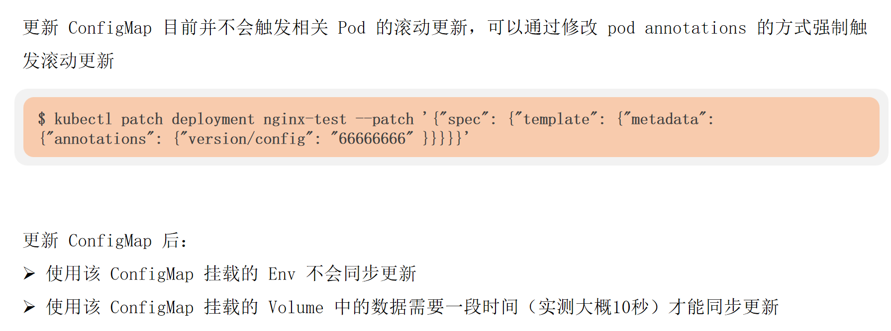


```bash
kubectl patch deployment hotupdate-deploy --patch '{"spec":{"template":{"metadata":{"annotations":{"version/config":"666666666"}}}}}'
```


```bash
[root@k8s-master01 5]# kubectl patch deployment hotupdate-deploy --patch '{"spec":{"template":{"metadata":{"annotations":{"version/config":"666666666"}}}}}'
deployment.apps/hotupdate-deploy patched

[root@k8s-master01 5]# kubectl get pod -o wide
NAME                                READY   STATUS    RESTARTS   AGE    IP              NODE         NOMINATED NODE   READINESS GATES
hotupdate-deploy-7b4b64978c-2djbf   1/1     Running   0          115s   10.244.85.247   k8s-node01   <none>           <none>
hotupdate-deploy-7b4b64978c-7d79b   1/1     Running   0          116s   10.244.85.246   k8s-node01   <none>           <none>
hotupdate-deploy-7b4b64978c-m4jhm   1/1     Running   0          114s   10.244.58.209   k8s-node02   <none>           <none>
hotupdate-deploy-7b4b64978c-t8g8m   1/1     Running   0          116s   10.244.58.203   k8s-node02   <none>           <none>
hotupdate-deploy-7b4b64978c-w52dw   1/1     Running   0          116s   10.244.58.206   k8s-node02   <none>           <none>
[root@k8s-master01 5]# curl 10.244.85.247:8080
<!DOCTYPE html>
<html>
<head>
<title>Welcome to nginx!</title>
<style>
html { color-scheme: light dark; }
body { width: 35em; margin: 0 auto;
font-family: Tahoma, Verdana, Arial, sans-serif; }
</style>
</head>
<body>
<h1>Welcome to nginx!</h1>
<p>If you see this page, the nginx web server is successfully installed and
working. Further configuration is required.</p>

<p>For online documentation and support please refer to
<a href="http://nginx.org/">nginx.org</a>.<br/>
Commercial support is available at
<a href="http://nginx.com/">nginx.com</a>.</p>

<p><em>Thank you for using nginx.</em></p>
</body>
</html>

[root@k8s-master01 5]# curl 10.244.85.247:80
curl: (7) Failed to connect to 10.244.85.247 port 80: Connection refused
```


### configMap - ä¸å¯æ”¹å˜


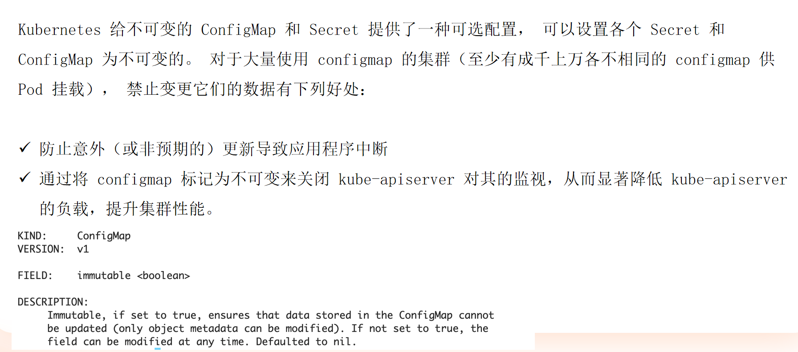

```bash
kubectl edit cm default-nginx
```

添加`immutable: true`

```yaml
# Please edit the object below. Lines beginning with a '#' will be ignored,
# and an empty file will abort the edit. If an error occurs while saving this file will be
# reopened with the relevant failures.
#
apiVersion: v1
data:
  default.conf: "server {\n    listen 8080 default_server;\n    server_name example.com
    www.example.com;\n    \n    location / {\n        root /usr/share/nginx/html;\n
    \       index index.html index.htm;\n    }\n}\n"
kind: ConfigMap
immutable: true
metadata:
  creationTimestamp: "2025-07-11T05:34:46Z"
  name: default-nginx
  namespace: default
  resourceVersion: "1011934"
  uid: 7c1dfcda-8a7e-4fff-829f-c2b13f2f6c25
```


- cm 如æœä¿®æ”¹ä¸ºä¸å¯æ”¹å˜çš„状æ€ï¼Œæ˜¯ä¸å…许å›é€€çš„，是ä¸å¯é€†çš„。
- å¯ä»¥åˆ é™¤æ­¤cm，然åé‡æ–°åˆ›å»ºä¸€ä¸ªæ— ä¸å¯æ”¹å˜æ ‡è®°çš„cm
- 优点：
  - 防止出ç°ä¸€äº›é”™è¯¯çš„修改
  - å‡å°‘对apiServer请求å‹åŠ›

  

 

## 03. Secret

ç¼–ç è€Œæ¥çš„安全

### Secret - 定义


### Secret - 特性

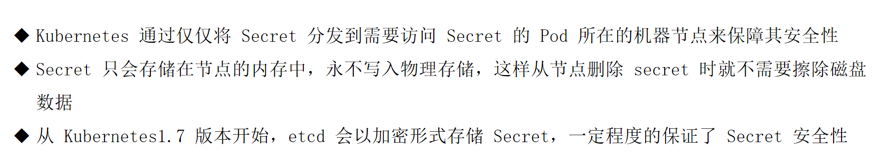


### Secret - ç±»å‹

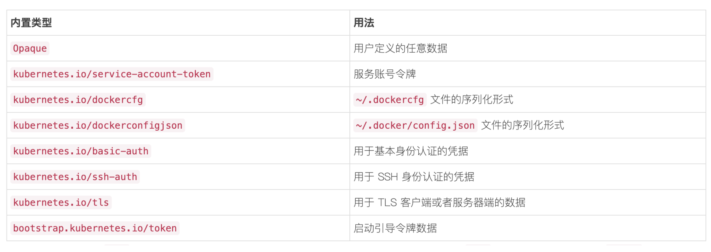


### Secret - Opaque - 概念


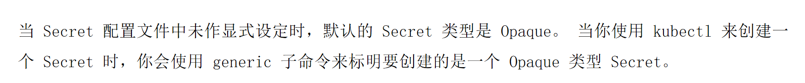

### Secret - Opaque - 创建


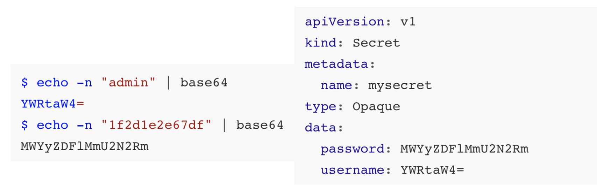

```bash
[root@k8s-master01 5]# echo -n "tangfire" | base64
dGFuZ2ZpcmU=
[root@k8s-master01 5]# echo -n "dGFuZ2ZpcmU=" | base64 -d
tangfire[root@k8s-master01 5]# 
[root@k8s-master01 5]#  echo -n "123456" | base64
MTIzNDU2
```

#### 7.secret.yaml


```yaml
apiVersion: v1
kind: Secret
metadata:
  name: mysecret
type: Opaque
data:
  password: MTIzNDU2
  username: dGFuZ2ZpcmU=
```


```bash
[root@k8s-master01 5]# vim 7.secret.yaml 
[root@k8s-master01 5]# 
[root@k8s-master01 5]# kubectl apply -f 7.secret.yaml 
secret/mysecret created
[root@k8s-master01 5]# kubectl get secret
NAME            TYPE                             DATA   AGE
aliyun-secret   kubernetes.io/dockerconfigjson   1      2d22h
mysecret        Opaque                           2      5s
[root@k8s-master01 5]# kubectl describe secret mysecret
Name:         mysecret
Namespace:    default
Labels:       <none>
Annotations:  <none>

Type:  Opaque

Data
====
password:  6 bytes
username:  8 bytes
```

```bash
[root@k8s-master01 5]# kubectl get secret mysecret -o yaml
apiVersion: v1
data:
  password: MTIzNDU2
  username: dGFuZ2ZpcmU=
kind: Secret
metadata:
  annotations:
    kubectl.kubernetes.io/last-applied-configuration: |
      {"apiVersion":"v1","data":{"password":"MTIzNDU2","username":"dGFuZ2ZpcmU="},"kind":"Secret","metadata":{"annotations":{},"name":"mysecret","namespace":"default"},"type":"Opaque"}
  creationTimestamp: "2025-07-11T11:03:44Z"
  name: mysecret
  namespace: default
  resourceVersion: "1038681"
  uid: 79c4de3e-6b3a-48ce-9121-0b4110a8c910
type: Opaque
[root@k8s-master01 5]# echo -n "MTIzNDU2" | base64 -d
123456[root@k8s-master01 5]# 
```


### Secret - Opaque - ENV

```yaml
apiVersion: apps/v1
kind: Deployment
metadata:
  labels:
    app: opaque-secret-env
  name: opaque-secret-env-deploy
spec:
  replicas: 5
  selector:
    matchLabels:
      app: op-se-env-pod
  template:
    metadata:
      labels:
        app: op-se-env-pod
    spec:
      imagePullSecrets:
        - name: aliyun-secret
      containers:
      - name: myapp-container
        image: crpi-cd1z0kbw072xy0ao.cn-guangzhou.personal.cr.aliyuncs.com/tangfire/myversion:v1
        ports:
        - containerPort: 80
        env:
        - name: TEST_USER
          valueFrom:
            secretKeyRef:
              name: mysecret
              key: username
        - name: TEST_PASSWORD
          valueFrom:
            secretKeyRef:
              name: mysecret
              key: password
```


```bash
[root@k8s-master01 5]# vim 8.deployment.yaml
[root@k8s-master01 5]# 
[root@k8s-master01 5]# 
[root@k8s-master01 5]# kubectl apply -f 8.deployment.yaml 
deployment.apps/opaque-secret-env-deploy created
```

```bash
[root@k8s-master01 5]# kubectl get pod
NAME                                        READY   STATUS    RESTARTS   AGE
opaque-secret-env-deploy-7b945c5f98-9mzzp   1/1     Running   0          43s
opaque-secret-env-deploy-7b945c5f98-f5252   1/1     Running   0          43s
opaque-secret-env-deploy-7b945c5f98-hxfcx   1/1     Running   0          43s
opaque-secret-env-deploy-7b945c5f98-qfwnj   1/1     Running   0          43s
opaque-secret-env-deploy-7b945c5f98-xrxw5   1/1     Running   0          43s
[root@k8s-master01 5]# kubectl exec -it opaque-secret-env-deploy-7b945c5f98-9mzzp -- /bin/sh 
/ # env
KUBERNETES_SERVICE_PORT=443
KUBERNETES_PORT=tcp://10.0.0.1:443
HOSTNAME=opaque-secret-env-deploy-7b945c5f98-9mzzp
SHLVL=1
HOME=/root
TEST_PASSWORD=123456
PKG_RELEASE=1
TEST_USER=tangfire
TERM=xterm
KUBERNETES_PORT_443_TCP_ADDR=10.0.0.1
NGINX_VERSION=1.25.5
PATH=/usr/local/sbin:/usr/local/bin:/usr/sbin:/usr/bin:/sbin:/bin
KUBERNETES_PORT_443_TCP_PORT=443
NJS_VERSION=0.8.4
KUBERNETES_PORT_443_TCP_PROTO=tcp
NJS_RELEASE=3
KUBERNETES_SERVICE_PORT_HTTPS=443
KUBERNETES_PORT_443_TCP=tcp://10.0.0.1:443
KUBERNETES_SERVICE_HOST=10.0.0.1
PWD=/
/ # 
```


### Secret - Opaque - Volume


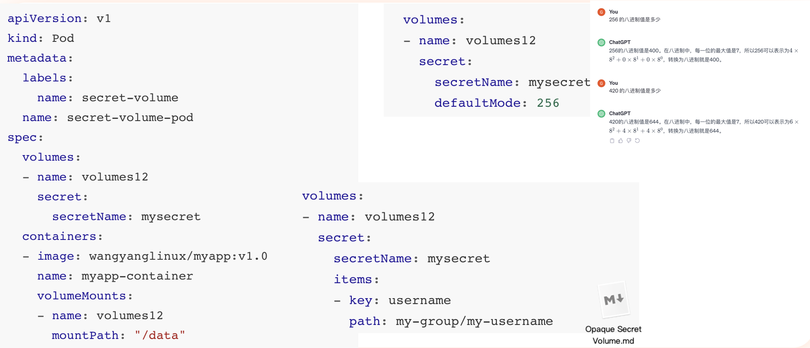

#### 9.pod.yaml

```yaml
apiVersion: v1
kind: Pod
metadata:
  labels:
    name: secret-volume
  name: secret-volume-pod
spec:
  imagePullSecrets:
    - name: aliyun-secret
  volumes:
    - name: volumes12
      secret:
        secretName: mysecret
  containers:
    - image: crpi-cd1z0kbw072xy0ao.cn-guangzhou.personal.cr.aliyuncs.com/tangfire/myversion:v1
      name: myapp-container
      volumeMounts:
        - name: volumes12
          mountPath: /data
```

```bash
[root@k8s-master01 5]# vim 9.pod.yaml
[root@k8s-master01 5]# 
[root@k8s-master01 5]# 
[root@k8s-master01 5]# kubectl apply -f 9.pod.yaml 
pod/secret-volume-pod created
[root@k8s-master01 5]# 
[root@k8s-master01 5]# kubectl get pod
NAME                READY   STATUS    RESTARTS   AGE
secret-volume-pod   1/1     Running   0          27s
[root@k8s-master01 5]# kubectl exec -it secret-volume-pod -- /bin/sh
/ # 
/ # cd /data/
/data # ls
password  username
/data # cat username
tangfire/data # cat password
123456/data # 
```


### Secret - Opaque - Volume - 热更新


### Secret - Opaque - Volume - ä¸å¯æ›´æ”¹

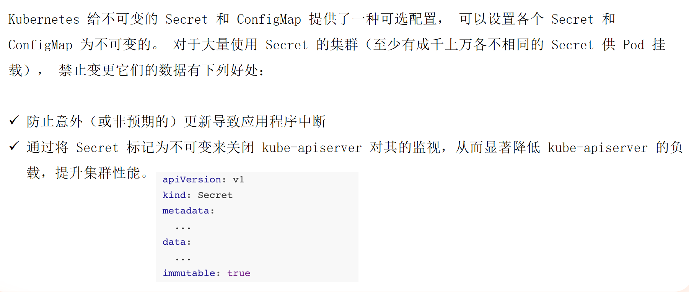


## 04. Downward API


容器在è¿è¡Œæ—¶ä»Kubernetes APIæœåŠ¡å™¨è·å–有关它们自身的信æ¯


### Downward API - 存在的æ„义


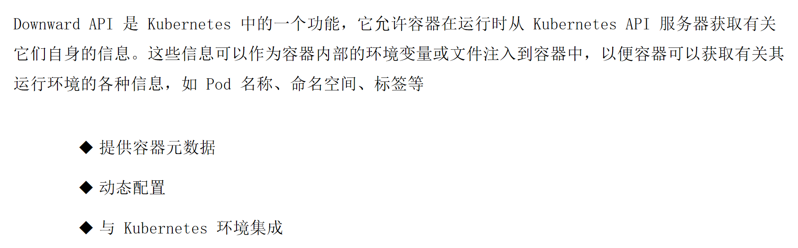


### Downward API - env案例

#### 12.pod.yaml

```yaml
apiVersion: v1
kind: Pod
metadata:
  name: downward-api-env-example
spec:
  containers:
    - name: my-container
      image: wangyanglinux/myapp:v1.0
      env:
        - name: POD_NAME
          valueFrom:
            fieldRef:
              fieldPath: metadata.name
        - name: POD_NAMESPACE
          valueFrom:
            fieldRef:
              fieldPath: metadata.namespace
        - name: POD_IP
          valueFrom:
            fieldRef:
              fieldPath: status.podIP
        - name: CPU_REQUEST
          valueFrom:
            resourceFieldRef:
              containerName: my-container
              resource: requests.cpu
        - name: CPU_LIMIT
          valueFrom:
            resourceFieldRef:
              containerName: my-container
              resource: limits.cpu
        - name: MEMORY_REQUEST
          valueFrom:
            resourceFieldRef:
              containerName: my-container
              resource: requests.memory
        - name: MEMORY_LIMIT
          valueFrom:
            resourceFieldRef:
              containerName: my-container
              resource: limits.memory
  restartPolicy: Never
```

```bash
[root@k8s-master01 5]# vim 12.pod.yaml
[root@k8s-master01 5]# 
[root@k8s-master01 5]# 
[root@k8s-master01 5]# kubectl apply -f 12.pod.yaml 
pod/downward-api-env-example created
[root@k8s-master01 5]# 
[root@k8s-master01 5]# 
[root@k8s-master01 5]# kubectl get pod
NAME                       READY   STATUS              RESTARTS   AGE
downward-api-env-example   0/1     ContainerCreating   0          6s
secret-volume-pod          1/1     Running             0          96m
[root@k8s-master01 5]# kubectl get pod
NAME                       READY   STATUS    RESTARTS   AGE
downward-api-env-example   1/1     Running   0          48s
secret-volume-pod          1/1     Running   0          96m
[root@k8s-master01 5]# kubectl exec -it downward-api-env-example -- /bin/bash
downward-api-env-example:/# 
downward-api-env-example:/# env
KUBERNETES_SERVICE_PORT_HTTPS=443
KUBERNETES_SERVICE_PORT=443
CHARSET=UTF-8
HOSTNAME=downward-api-env-example
CPU_REQUEST=0
POD_NAME=downward-api-env-example
POD_NAMESPACE=default
PWD=/
HOME=/root
LANG=C.UTF-8
KUBERNETES_PORT_443_TCP=tcp://10.0.0.1:443
TERM=xterm
SHLVL=1
KUBERNETES_PORT_443_TCP_PROTO=tcp
KUBERNETES_PORT_443_TCP_ADDR=10.0.0.1
POD_IP=10.244.58.213
CPU_LIMIT=4
MEMORY_LIMIT=3698946048
KUBERNETES_SERVICE_HOST=10.0.0.1
KUBERNETES_PORT=tcp://10.0.0.1:443
MEMORY_REQUEST=0
KUBERNETES_PORT_443_TCP_PORT=443
LC_COLLATE=C
PATH=/usr/local/sbin:/usr/local/bin:/usr/sbin:/usr/bin:/sbin:/bin
_=/usr/bin/env
downward-api-env-example:/# 
```

### Downward API - volume案例

#### 13.pod.yaml

```yaml
apiVersion: v1
kind: Pod
metadata:
  name: downward-api-volume-example
spec:
  containers:
    - name: my-container
      image: wangyanglinux/myapp:v1.0
      resources:
        limits:
          cpu: "1"
          memory: "512Mi"
        requests:
          cpu: "0.5"
          memory: "256Mi"
      volumeMounts:
        - name: downward-api-volume
          mountPath: /etc/podinfo
  volumes:
    - name: downward-api-volume
      downwardAPI:
        items:
          - path: "annotations"
            fieldRef:
              fieldPath: metadata.annotations
          - path: "labels"
            fieldRef:
              fieldPath: metadata.labels
          - path: "name"
            fieldRef:
              fieldPath: metadata.name
          - path: "namespace"
            fieldRef:
              fieldPath: metadata.namespace
          - path: "uid"
            fieldRef:
              fieldPath: metadata.uid
          - path: "cpuRequest"
            resourceFieldRef:
              containerName: my-container
              resource: requests.cpu
          - path: "memoryRequest"
            resourceFieldRef:
              containerName: my-container
              resource: requests.memory
          - path: "cpuLimit"
            resourceFieldRef:
              containerName: my-container
              resource: limits.cpu
          - path: "memoryLimit"
            resourceFieldRef:
              containerName: my-container
              resource: limits.memory
  restartPolicy: Never
```

### **通俗解释：Kubernetes Downward API å·æŒ‚è½½é…ç½®**

这个 YAML 定义了一个 Pod，å为 `downward-api-volume-example`，它通过 **Downward API** å°† Pod 自身的元数æ®ï¼ˆå¦‚å称ã€å‘½å空间ã€æ ‡ç­¾ç­‰ï¼‰å’Œèµ„æºé™åˆ¶ï¼ˆCPUã€å†…存）以文件的形å¼æŒ‚载到容器内部（`/etc/podinfo`）。

---

## **1. 核心功能**
- **Downward API**：Kubernetes æ供的一ç§æœºåˆ¶ï¼Œå…许 Pod **è·å–自身的è¿è¡Œæ—¶ä¿¡æ¯**（如 Pod å称ã€IPã€èµ„æºé™åˆ¶ç­‰ï¼‰ã€‚
- **用途**：应用程åºå¯ä»¥é€šè¿‡è¯»å– `/etc/podinfo` 目录下的文件，动æ€è·å– Pod 的元数æ®å’Œèµ„æºé…é¢ï¼Œè€Œæ— éœ€ç¡¬ç¼–ç æˆ–ä¾èµ–外部查询。

---

## **2. 关键é…置解æ**
### **(1) Pod 基本信æ¯**
```yaml
apiVersion: v1
kind: Pod
metadata:
  name: downward-api-volume-example
```
- **`apiVersion: v1`**：使用 Kubernetes 核心 API。
- **`kind: Pod`**：定义的是一个 Pod 资æºã€‚
- **`metadata.name`**：Pod å称是 `downward-api-volume-example`。

---

### **(2) 容器é…ç½®**
```yaml
spec:
  containers:
    - name: my-container
      image: wangyanglinux/myapp:v1.0
      resources:
        limits:
          cpu: "1"
          memory: "512Mi"
        requests:
          cpu: "0.5"
          memory: "256Mi"
```
- **`image: wangyanglinux/myapp:v1.0`**：容器使用的镜åƒã€‚
- **`resources`**：定义容器的资æºé™åˆ¶å’Œè¯·æ±‚：
  - **`limits`**（硬é™åˆ¶ï¼‰ï¼š
    - CPU：最多 1 核
    - 内存：最多 512MB
  - **`requests`**（最ä½éœ€æ±‚）：
    - CPU：至少 0.5 核
    - 内存：至少 256MB

---

### **(3) Downward API å·æŒ‚è½½**
```yaml
volumeMounts:
  - name: downward-api-volume
    mountPath: /etc/podinfo  # 挂载到容器内的路径
```
- **`volumeMounts`**：将 `downward-api-volume` 挂载到容器的 `/etc/podinfo` 目录。
- **容器内会生æˆä»¥ä¸‹æ–‡ä»¶**：
  - `/etc/podinfo/annotations`（Pod 的注解）
  - `/etc/podinfo/labels`（Pod 的标签）
  - `/etc/podinfo/name`（Pod å称）
  - `/etc/podinfo/namespace`（Pod 所在的命å空间）
  - `/etc/podinfo/uid`（Pod 的唯一 ID）
  - `/etc/podinfo/cpuRequest`（CPU 请求值）
  - `/etc/podinfo/memoryRequest`（内存请求值）
  - `/etc/podinfo/cpuLimit`（CPU é™åˆ¶å€¼ï¼‰
  - `/etc/podinfo/memoryLimit`（内存é™åˆ¶å€¼ï¼‰

---

### **(4) Downward API å·å®šä¹‰**
```yaml
volumes:
  - name: downward-api-volume
    downwardAPI:
      items:
        - path: "annotations"  # 文件å
          fieldRef:
            fieldPath: metadata.annotations  # æ•°æ®æ¥æº
        - path: "labels"
          fieldRef:
            fieldPath: metadata.labels
        - path: "name"
          fieldRef:
            fieldPath: metadata.name
        - path: "namespace"
          fieldRef:
            fieldPath: metadata.namespace
        - path: "uid"
          fieldRef:
            fieldPath: metadata.uid
        - path: "cpuRequest"
          resourceFieldRef:
            containerName: my-container  # 指定容器
            resource: requests.cpu      # è·å– CPU 请求值
        - path: "memoryRequest"
          resourceFieldRef:
            containerName: my-container
            resource: requests.memory
        - path: "cpuLimit"
          resourceFieldRef:
            containerName: my-container
            resource: limits.cpu
        - path: "memoryLimit"
          resourceFieldRef:
            containerName: my-container
            resource: limits.memory
```
- **`downwardAPI`**：定义 Downward API å·ï¼Œå°† Pod ä¿¡æ¯å†™å…¥æ–‡ä»¶ã€‚
- **`items`**：指定è¦æš´éœ²å“ªäº›ä¿¡æ¯ï¼Œæ¯ä¸ª `path` 对应一个文件å，`fieldRef` 或 `resourceFieldRef` 指定数æ®æ¥æºã€‚

---

### **(5) é‡å¯ç­–ç•¥**
```yaml
restartPolicy: Never
```
- **`Never`**：Pod 退出åä¸ä¼šè‡ªåŠ¨é‡å¯ï¼ˆé€‚åˆä¸€æ¬¡æ€§ä»»åŠ¡ï¼‰ã€‚

---

## **3. å®é™…应用场景**
1. **日志收集**：应用程åºå¯ä»¥è¯»å– `/etc/podinfo/name` è·å– Pod å称，用äºæ—¥å¿—标记。
2. **动æ€é…ç½®**ï¼šæ ¹æ® Pod 的命å空间（`namespace`）或标签（`labels`）调整è¿è¡Œå‚数。
3. **资æºç›‘æ§**：通过 `cpuLimit`ã€`memoryLimit` 等文件，让应用知é“自己的资æºé…é¢ã€‚

---

## **4. 示例：容器内查看文件**
```bash
kubectl exec downward-api-volume-example -- cat /etc/podinfo/name
# 输出：downward-api-volume-example

kubectl exec downward-api-volume-example -- cat /etc/podinfo/cpuLimit
# 输出：1
```

---

## **总结**
- **Downward API** 让 Pod 能è·å–自身信æ¯ï¼Œæ— éœ€ä¾èµ–外部查询。
- **挂载æˆæ–‡ä»¶** å，应用程åºå¯ä»¥ç›´æ¥è¯»å–，适用äºåŠ¨æ€é…ç½®ã€æ—¥å¿—标记等场景。
- **资æºé™åˆ¶**（CPU/内存）也能通过文件暴露，方便应用自适应调整。

这样设计的好处是 **解耦**，应用程åºä¸éœ€è¦ç¡¬ç¼–ç  Pod ä¿¡æ¯ï¼Œè€Œæ˜¯åŠ¨æ€è·å–，æ高å¯ç§»æ¤æ€§ã€‚ 🚀

```bash
[root@k8s-master01 5]# vim 13.pod.yaml
[root@k8s-master01 5]# 
[root@k8s-master01 5]# 
[root@k8s-master01 5]# kubectl apply -f 13.pod.yaml 
pod/downward-api-volume-example created
[root@k8s-master01 5]# kubectl get pod
NAME                          READY   STATUS              RESTARTS   AGE
downward-api-env-example      1/1     Running             0          22m
downward-api-volume-example   0/1     ContainerCreating   0          3s
secret-volume-pod             1/1     Running             0          118m
[root@k8s-master01 5]# kubectl exec -it downward-api-volume-example /bin/bash
kubectl exec [POD] [COMMAND] is DEPRECATED and will be removed in a future version. Use kubectl exec [POD] -- [COMMAND] instead.
error: unable to upgrade connection: container not found ("my-container")
[root@k8s-master01 5]# kubectl exec -it downward-api-volume-example --  /bin/bash
downward-api-volume-example:/# cd /etc/podinfo/
downward-api-volume-example:/etc/podinfo# ls
annotations    cpuRequest     memoryLimit    name           uid
cpuLimit       labels         memoryRequest  namespace
downward-api-volume-example:/etc/podinfo# ls -l
total 0
lrwxrwxrwx    1 root     root            18 Jul 11 21:36 annotations -> ..data/annotations
lrwxrwxrwx    1 root     root            15 Jul 11 21:36 cpuLimit -> ..data/cpuLimit
lrwxrwxrwx    1 root     root            17 Jul 11 21:36 cpuRequest -> ..data/cpuRequest
lrwxrwxrwx    1 root     root            13 Jul 11 21:36 labels -> ..data/labels
lrwxrwxrwx    1 root     root            18 Jul 11 21:36 memoryLimit -> ..data/memoryLimit
lrwxrwxrwx    1 root     root            20 Jul 11 21:36 memoryRequest -> ..data/memoryRequest
lrwxrwxrwx    1 root     root            11 Jul 11 21:36 name -> ..data/name
lrwxrwxrwx    1 root     root            16 Jul 11 21:36 namespace -> ..data/namespace
lrwxrwxrwx    1 root     root            10 Jul 11 21:36 uid -> ..data/uid
downward-api-volume-example:/etc/podinfo# cat annotations 
cni.projectcalico.org/containerID="ab58059ec2c7afc061d7c50794cf459ef4ab2702a68f3611f3fe1eb613daa028"
cni.projectcalico.org/podIP="10.244.85.251/32"
cni.projectcalico.org/podIPs="10.244.85.251/32"
kubectl.kubernetes.io/last-applied-configuration="{\"apiVersion\":\"v1\",\"kind\":\"Pod\",\"metadata\":{\"annotations\":{},\"name\":\"downward-api-volume-example\",\"namespace\":\"default\"},\"spec\":{\"containers\":[{\"image\":\"wangyanglinux/myapp:v1.0\",\"name\":\"my-container\",\"resources\":{\"limits\":{\"cpu\":\"1\",\"memory\":\"512Mi\"},\"requests\":{\"cpu\":\"0.5\",\"memory\":\"256Mi\"}},\"volumeMounts\":[{\"mountPath\":\"/etc/podinfo\",\"name\":\"downward-api-volume\"}]}],\"restartPolicy\":\"Never\",\"volumes\":[{\"downwardAPI\":{\"items\":[{\"fieldRef\":{\"fieldPath\":\"metadata.annotations\"},\"path\":\"annotations\"},{\"fieldRef\":{\"fieldPath\":\"metadata.labels\"},\"path\":\"labels\"},{\"fieldRef\":{\"fieldPath\":\"metadata.name\"},\"path\":\"name\"},{\"fieldRef\":{\"fieldPath\":\"metadata.namespace\"},\"path\":\"namespace\"},{\"fieldRef\":{\"fieldPath\":\"metadata.uid\"},\"path\":\"uid\"},{\"path\":\"cpuRequest\",\"resourceFieldRef\":{\"containerName\":\"my-container\",\"resource\":\"requests.cpu\"}},{\"path\":\"memoryRequest\",\"resourceFieldRef\":{\"containerName\":\"my-container\",\"resource\":\"requests.memory\"}},{\"path\":\"cpuLimit\",\"resourceFieldRef\":{\"containerName\":\"my-container\",\"resource\":\"limits.cpu\"}},{\"path\":\"memoryLimit\",\"resourceFieldRef\":{\"containerName\":\"my-container\",\"resource\":\"limits.memory\"}}]},\"name\":\"downward-api-volume\"}]}}\n"
kubernetes.io/config.seen="2025-07-11T21:36:18.116842185+08:00"
kubernetes.io/config.source="api"downward-api-volume-example:/etc/podinfo# cat cpuRequest 
downward-api-volume-example:/etc/podinfo# 
downward-api-volume-example:/etc/podinfo# cat cpuRequest 
downward-api-volume-example:/etc/podinfo# cat memoryRequest 
268435456downward-api-volume-example:/etc/podinfo# cat namespace 
defaultdownward-api-volume-example:/etc/podinfo# 
```

```bash
defaultdownward-api-volume-example:/etc/podinfo# cat labels 
downward-api-volume-example:/etc/podinfo# 
```

```bash
[root@k8s-master01 6]# kubectl get pod --show-labels
NAME                          READY   STATUS    RESTARTS   AGE    LABELS
downward-api-env-example      1/1     Running   0          35m    <none>
downward-api-volume-example   1/1     Running   0          13m    <none>
secret-volume-pod             1/1     Running   0          131m   name=secret-volume
[root@k8s-master01 6]# kubectl label pod downward-api-volume-example domain=tangfire.com
pod/downward-api-volume-example labeled
```

```bash
downward-api-volume-example:/etc/podinfo# cat labels 
domain="tangfire.com"downward-api-volume-example:/etc/podinfo# 
```

所以，以å·çš„绑定方å¼å¯ä»¥çƒ­æ›´æ–°ï¼Œåªè¦ä½ å¯¹å½“å‰podå‘生的一些修改，都会被å馈到文件内部的å˜åŒ–


### Downward API - volume ç›¸è¾ƒäº env 优势

- 会ä¿æŒçƒ­æ›´æ–°çš„特性
- 传递一个容器的资æºå­—段到å¦ä¸€ä¸ªå®¹å™¨ä¸­


### Downward API - 扩展

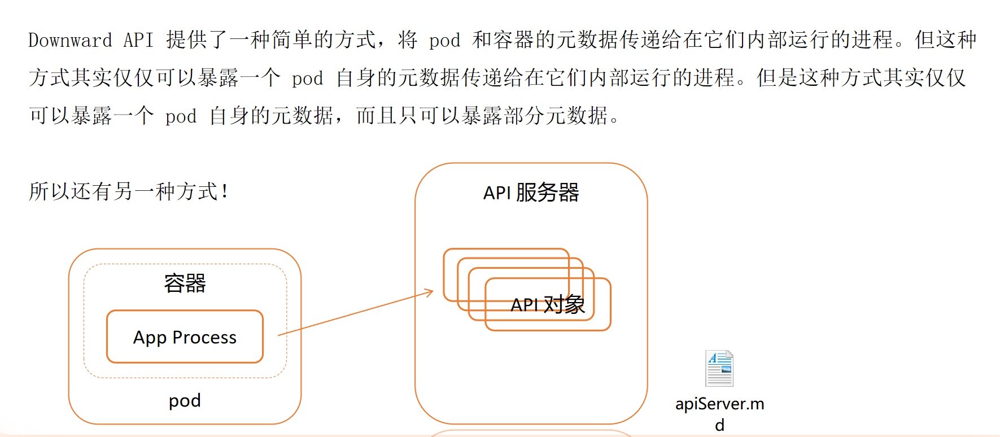


以下是完整的 Kubernetes RBAC å’Œ Pod 定义代ç ï¼š

### 1. RBAC æƒé™é…ç½® (`1.rbac.yaml`)
```yaml
apiVersion: rbac.authorization.k8s.io/v1
kind: ClusterRoleBinding
metadata:
  name: test-api-cluster-admin-binding
subjects:
- kind: ServiceAccount
  name: test-api
  namespace: default
roleRef:
  kind: ClusterRole
  name: cluster-admin
  apiGroup: rbac.authorization.k8s.io
```

### 2. Pod 定义 (`2.pod.yaml`)
```yaml
apiVersion: v1
kind: Pod
metadata:
  name: curl
spec:
  serviceAccountName: test-api
  containers:
  - name: main
    image: curlimages/curl
    command: ["sleep", "9999"]
```

### 3. 容器内执行的 API 访问命令
```bash
# è·å–访问凭è¯
TOKEN=$(cat /var/run/secrets/kubernetes.io/serviceaccount/token)
CAPATH="/var/run/secrets/kubernetes.io/serviceaccount/ca.crt"
NS=$(cat /var/run/secrets/kubernetes.io/serviceaccount/namespace)

# 调用 Kubernetes API
curl -H "Authorization: Bearer $TOKEN" --cacert $CAPATH \
https://kubernetes/api/v1/namespaces/$NS/pods
```

### 关键说æ˜ï¼š
1. **RBAC é…ç½®**：
  - 创建了 `ClusterRoleBinding`，将 `cluster-admin` 角色绑定到 `default` 命å空间下的 `test-api` æœåŠ¡è´¦å·
  - æˆäºˆäº†æœ€é«˜æƒé™ï¼ˆç”Ÿäº§ç¯å¢ƒåº”éµå¾ªæœ€å°æƒé™åŸåˆ™ï¼‰

2. **Pod é…ç½®**：
  - 使用 `tutum/curl` é•œåƒåˆ›å»ºå为 `curl` çš„ Pod
  - 指定使用 `test-api` æœåŠ¡è´¦å·
  - 容器å¯åŠ¨å执行 `sleep 9999` ä¿æŒè¿è¡Œ

3. **API 访问æµç¨‹**：
  - 自动挂载的æœåŠ¡è´¦å·ä»¤ç‰Œæ供认è¯ä¿¡æ¯
  - 使用 CA è¯ä¹¦éªŒè¯ API Server 身份
  - 通过 Bearer Token 认è¯è®¿é—®å½“å‰å‘½å空间的 Pod 列表

### 使用步骤：


```bash
[root@k8s-master01 14]# vim 1.rbac.yaml
[root@k8s-master01 14]# kubectl apply -f 1.rbac.yaml 
clusterrolebinding.rbac.authorization.k8s.io/test-api-cluster-admin-binding created
[root@k8s-master01 14]# 
[root@k8s-master01 14]# 
[root@k8s-master01 14]# kubectl create sa test-api
serviceaccount/test-api created
[root@k8s-master01 14]# 
[root@k8s-master01 14]# 
[root@k8s-master01 14]# vim 2.pod.yaml
[root@k8s-master01 14]# 
[root@k8s-master01 14]# 
[root@k8s-master01 14]# kubectl apply -f 2.pod.yaml 
pod/curl created
[root@k8s-master01 14]# kubectl get pod
NAME                          READY   STATUS    RESTARTS   AGE
curl                          1/1     Running   0          46s
downward-api-env-example      1/1     Running   0          11h
downward-api-volume-example   1/1     Running   0          11h
secret-volume-pod             1/1     Running   0          13h

[root@k8s-master01 14]# kubectl exec -it curl /bin/sh
kubectl exec [POD] [COMMAND] is DEPRECATED and will be removed in a future version. Use kubectl exec [POD] -- [COMMAND] instead.
~ $ 
~ $ TOKEN=$(cat /var/run/secrets/kubernetes.io/serviceaccount/token)
~ $ CAPATH="/var/run/secrets/kubernetes.io/serviceaccount/ca.crt"
~ $ NS=$(cat /var/run/secrets/kubernetes.io/serviceaccount/namespace)
~ $ curl -H "Authorization: Bearer $TOKEN" --cacert $CAPATH \
> https://kubernetes/api/v1/namespaces/$NS/pods
```


### Downward API - Kubernetes API 文档

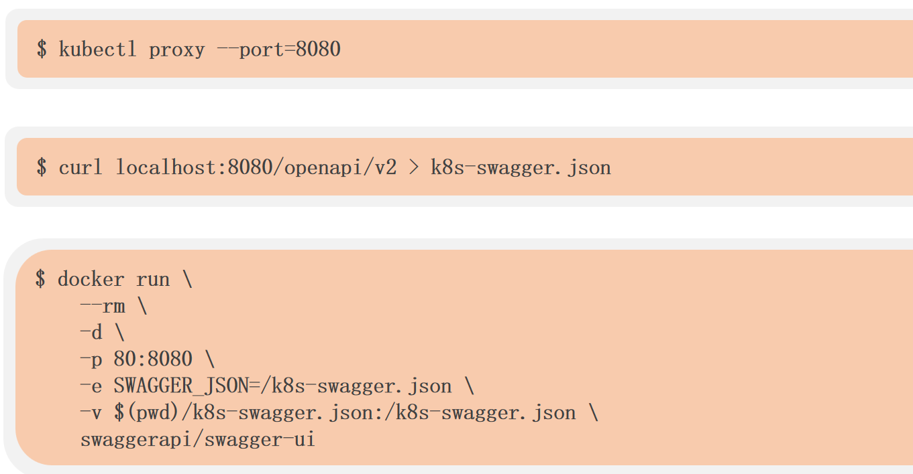

```bash
kubectl proxy --port=8080
```

å†èµ·ä¸€ä¸ªç»ˆç«¯æ‰§è¡Œï¼š

```bash
curl localhost:8080/openapi/v2 > k8s-swagger.json
```

```bash
[root@k8s-master01 14]# ls
1.rbac.yaml  2.pod.yaml  k8s-swagger.json
```


```bash
docker run \
  --rm \
  -d \
  -p 80:8080 \
  -e SWAGGER_JSON=/k8s-swagger.json \
  -v $(pwd)/k8s-swagger.json:/k8s-swagger.json \
  swaggerapi/swagger-ui
```


```bash
[root@k8s-master01 14]# docker run \
  --rm \
  -d \
  -p 80:8080 \
  -e SWAGGER_JSON=/k8s-swagger.json \
  -v $(pwd)/k8s-swagger.json:/k8s-swagger.json \
  swaggerapi/swagger-ui
Unable to find image 'swaggerapi/swagger-ui:latest' locally
latest: Pulling from swaggerapi/swagger-ui
fe07684b16b8: Already exists 
3b7062d09e02: Already exists 
fb746e72516f: Already exists 
a9ff9baf1741: Already exists 
2c127093dfc7: Already exists 
63dda2adf85b: Already exists 
b55ed7d7b2de: Already exists 
92971aeb101e: Already exists 
f8757389f534: Pull complete 
9bace28d4d83: Pull complete 
6ca57faa02b3: Pull complete 
857dfce664dd: Pull complete 
6d4a4ac230eb: Pull complete 
d940957079a7: Pull complete 
Digest: sha256:13e9885605519c4ecbe06854e212b10fce703e3c233771de5e58571e459eb9a8
Status: Downloaded newer image for swaggerapi/swagger-ui:latest
6a2654e5a847a0a79aa959e33d994996c8855c4163c178f185702a7b06905d32
```

然å访问：

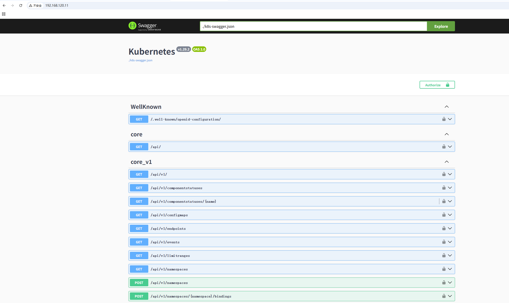


## 05. volume

æ•°æ®çš„æŒä¹…化方案


### Volume - 存在的æ„义


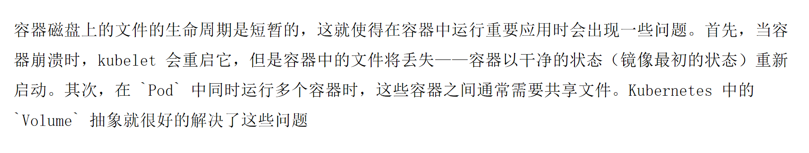


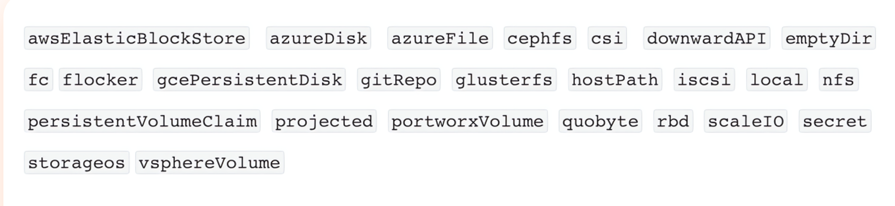


以下是针对图片中列出的 Kubernetes æŒä¹…化存储å·ï¼ˆPersistent Volume）类å‹çš„分类和解释：

---

### **一ã€äº‘æœåŠ¡å•†å­˜å‚¨å·**
| ç±»å‹ | è¯´æ˜ | å…¸å‹ä½¿ç”¨åœºæ™¯ |
|------|------|-------------|
| **awsElasticBlockStore** | AWS EBS å—å­˜å‚¨å· | 需è¦æŒä¹…化数æ®çš„ AWS EC2 å®ä¾‹ |
| **azureDisk** | Azure 托管ç£ç›˜ | Azure 虚拟机上的æŒä¹…化存储 |
| **azureFile** | Azure 文件存储（SMB） | 多 Pod 共享存储（如 WordPress 媒体文件） |
| **gcePersistentDisk** | Google Cloud æŒä¹…化ç£ç›˜ | GCP 上的æŒä¹…化数æ®å­˜å‚¨ |

---

### **二ã€ç½‘络存储å·**
| ç±»å‹ | è¯´æ˜ | 特点 |
|------|------|------|
| **nfs** | 网络文件系统 | 多节点共享读写，适åˆé™æ€å†…容 |
| **cephfs** | Ceph 分布å¼æ–‡ä»¶ç³»ç»Ÿ | 高性能分布å¼å­˜å‚¨ |
| **glusterfs** | GlusterFS 集群文件系统 | 大规模å¯æ‰©å±•å­˜å‚¨ |
| **iscsi** | iSCSI å—存储 | 需è¦è£¸è®¾å¤‡æ˜ å°„的场景 |
| **rbd** | Ceph å—设备 | 高性能å—存储（如数æ®åº“） |

---

### **三ã€æœ¬åœ°å­˜å‚¨å·**
| ç±»å‹ | è¯´æ˜ | 注æ„事项 |
|------|------|----------|
| **hostPath** | 挂载宿主机目录 | ä»…å¼€å‘测试用（ä¸å®‰å…¨ï¼‰ |
| **local** | 本地æŒä¹…åŒ–å· | 需è¦ç»“åˆèŠ‚点亲和性调度 |
| **emptyDir** | 临时空目录 | Pod 删除åæ•°æ®é”€æ¯ |

---

### **å››ã€ç‰¹æ®Šç”¨é€”存储å·**
| ç±»å‹ | è¯´æ˜ | å…¸å‹ç”¨ä¾‹ |
|------|------|---------|
| **secret** | 挂载æ•æ„Ÿä¿¡æ¯ï¼ˆå¦‚密ç ï¼‰ | æ•°æ®åº“å‡­è¯ |
| **downwardAPI** | å°† Pod 元数æ®æŒ‚载为文件 | è·å– Pod å称/IP ç­‰ |
| **gitRepo** | 克隆 Git ä»“åº“åˆ°å· | é…置文件动æ€æ›´æ–° |
| **projected** | åˆå¹¶å¤šä¸ªå­˜å‚¨æºï¼ˆå¦‚ secret+downwardAPI） | å¤æ‚é…ç½®ç®¡ç† |

---

### **五ã€ä¼ä¸šçº§å­˜å‚¨æ–¹æ¡ˆ**
| ç±»å‹ | è¯´æ˜ | 适用场景 |
|------|------|---------|
| **portworxVolume** | Portworx 容器åŸç”Ÿå­˜å‚¨ | 有状æ€å®¹å™¨ç¼–æ’ |
| **storageos** | StorageOS 软件定义存储 | ä½å»¶è¿ŸæŒä¹…化存储 |
| **vsphereVolume** | VMware vSphere 存储 | ä¼ä¸šè™šæ‹ŸåŒ–ç¯å¢ƒ |
| **scaleIO** | EMC ScaleIO 存储 | 超èåˆåŸºç¡€æ¶æ„ |

---

### **å…­ã€å·²å¼ƒç”¨/过时类å‹**
| ç±»å‹ | 替代方案 | 弃用åŸå›  |
|------|---------|---------|
| **flocker** | 使用 CSI 驱动 | 项目已åœæ­¢ç»´æŠ¤ |
| **quobyte** | 改用 CSI 驱动 | 社区支æŒæœ‰é™ |
| **fc** (Fibre Channel) | 使用 CSI 驱动 | é…ç½®å¤æ‚ |

---

### **选择建议**
1. **云ç¯å¢ƒ**：优先使用云å‚商åŸç”Ÿå­˜å‚¨ï¼ˆå¦‚ AWS EBS）
2. **共享存储**：选择 `nfs` 或 `cephfs`
3. **æ•æ„Ÿæ•°æ®**：使用 `secret` 或 `configMap`
4. **未æ¥å…¼å®¹æ€§**：优先选择 **CSI**（Container Storage Interface）驱动

> 注：生产ç¯å¢ƒæ¨è通过 **StorageClass** 动æ€åˆ†é…存储，而éç›´æ¥ä½¿ç”¨ PV。


### MFS


### **什么是 MFS？**
**MFS（Moose File System）** 是一个开æºçš„分布å¼æ–‡ä»¶ç³»ç»Ÿï¼Œä¸“为大规模数æ®å­˜å‚¨å’Œé«˜å¯ç”¨æ€§è®¾è®¡ã€‚å®ƒç±»ä¼¼äº **HDFS（Hadoop DFS）** 或 **CephFS**，但更注é‡æ˜“用性和 POSIX 兼容性（å³å¯ä»¥åƒæ™®é€šæ–‡ä»¶ç³»ç»Ÿä¸€æ ·ä½¿ç”¨ï¼‰ã€‚

---

## **1. MFS 的核心特点**
| 特性 | è¯´æ˜ |
|------|------|
| **分布å¼å­˜å‚¨** | æ•°æ®åˆ†æ•£åœ¨å¤šä¸ªæœåŠ¡å™¨ä¸Šï¼Œæ高å¯é æ€§å’Œæ€§èƒ½ |
| **高å¯ç”¨æ€§** | 支æŒä¸»å¤‡å…ƒæ•°æ®æœåŠ¡å™¨ï¼ˆMaster Server），é¿å…å•ç‚¹æ•…éšœ |
| **POSIX 兼容** | åƒæœ¬åœ°æ–‡ä»¶ç³»ç»Ÿä¸€æ ·ä½¿ç”¨ï¼ˆæ”¯æŒ `ls`ã€`cp`ã€`mv` 等命令） |
| **动æ€æ‰©å±•** | å¯åœ¨çº¿æ·»åŠ å­˜å‚¨èŠ‚点（Chunk Server），无需åœæœº |
| **æ•°æ®å†—ä½™** | 支æŒå‰¯æœ¬æœºåˆ¶ï¼ˆç±»ä¼¼ RAID），防止数æ®ä¸¢å¤± |
| **快照功能** | å¯åˆ›å»ºæ–‡ä»¶ç³»ç»Ÿå¿«ç…§ï¼Œç”¨äºå¤‡ä»½æˆ–æ¢å¤ |

---

## **2. MFS çš„æ¶æ„**
MFS 采用 **主ä»æ¶æ„**，主è¦åŒ…å«ä»¥ä¸‹ç»„件：
### **(1) 管ç†æœåŠ¡å™¨ï¼ˆMaster Server）**
- **作用**：存储文件的元数æ®ï¼ˆå¦‚文件åã€ç›®å½•ç»“æ„ã€æƒé™ç­‰ï¼‰ã€‚
- **高å¯ç”¨**：å¯é…ç½® **Metalogger**（元数æ®å¤‡ä»½æœåŠ¡å™¨ï¼‰å’Œ **Shadow Master**（影å­ä¸»æœåŠ¡å™¨ï¼‰å®ç°æ•…障转移。

### **(2) æ•°æ®å­˜å‚¨èŠ‚点（Chunk Server）**
- **作用**：å®é™…存储文件数æ®ï¼ˆåˆ†æˆå¤šä¸ª **Chunk**，默认 64MB/å—）。
- **扩展性**：å¯åŠ¨æ€æ·»åŠ èŠ‚点，存储容é‡éšèŠ‚点å¢åŠ è€Œå¢é•¿ã€‚

### **(3) 客户端（Client）**
- **作用**：通过 **FUSE**（用户æ€æ–‡ä»¶ç³»ç»Ÿï¼‰æŒ‚è½½ MFS，åƒæœ¬åœ°ç£ç›˜ä¸€æ ·è®¿é—®ã€‚
- **å议支æŒ**ï¼šæ”¯æŒ NFSã€SMBã€FTP 等。


---

## **3. MFS çš„å…¸å‹åº”用场景**
1. **大数æ®å­˜å‚¨**
  - 替代 HDFSï¼Œç”¨äº Hadoop/Spark 等分布å¼è®¡ç®—框æ¶ã€‚
2. **媒体文件托管**
  - 存储图片ã€è§†é¢‘等大文件（如 CDN å端）。
3. **虚拟化存储**
  - 为 KVM/VMware æ供共享存储。
4. **备份ä¸å®¹ç¾**
  - 利用快照功能å®ç°æ•°æ®ä¿æŠ¤ã€‚

---

## **4. MFS vs 其他分布å¼æ–‡ä»¶ç³»ç»Ÿ**
| 文件系统 | 特点 | 适用场景 |
|----------|------|----------|
| **MFS** | POSIX 兼容，易部署 | 通用存储ã€åª’体库 |
| **HDFS** | 适åˆæ‰¹å¤„ç†ï¼Œä¸æ”¯æŒéšæœºå†™ | Hadoop ç”Ÿæ€ |
| **CephFS** | 高扩展性，但é…ç½®å¤æ‚ | 云åŸç”Ÿå­˜å‚¨ |
| **GlusterFS** | 无元数æ®æœåŠ¡å™¨ï¼Œæ€§èƒ½è¾ƒä½ | 共享文件存储 |

---

## **5. 快速体验 MFS**
### **步骤 1：安装 Master Server**
```bash
wget -O /etc/yum.repos.d/MooseFS.repo https://ppa.moosefs.com/src/moosefs-3-el7.repo
yum install moosefs-master moosefs-metalogger moosefs-chunkserver
systemctl start moosefs-master
```

### **步骤 2：挂载 MFS 客户端**
```bash
yum install moosefs-client
mkdir /mnt/mfs
mfsmount /mnt/mfs -H mfsmaster
```

### **步骤 3：验è¯**
```bash
df -h | grep mfs  # 查看挂载情况
echo "Hello MFS" > /mnt/mfs/test.txt  # 测试写入
```

---

## **6. 注æ„事项**
- **性能瓶颈**：Master Server 是å•ç‚¹ï¼Œè¶…大规模集群建议用 Ceph。
- **安全性**：默认未加密，生产ç¯å¢ƒéœ€é…ç½® SSL/TLS。
- **社区支æŒ**：MFS å¼€æºç‰ˆæ›´æ–°è¾ƒæ…¢ï¼Œä¼ä¸šéœ€æ±‚å¯è€ƒè™‘商业版（MooseFS Pro）。


### Volume - emptyDir - 概念


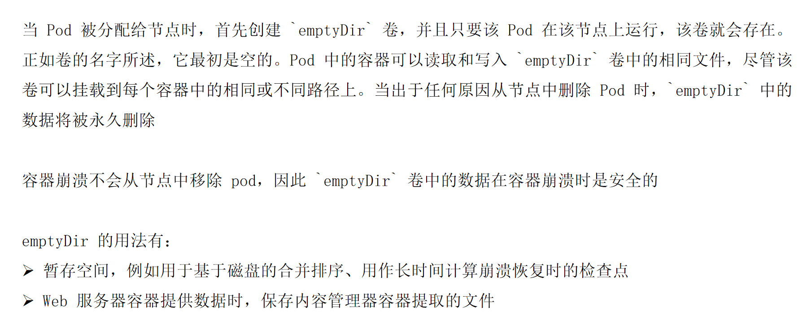


### Volume - emptyDir - 创建使用

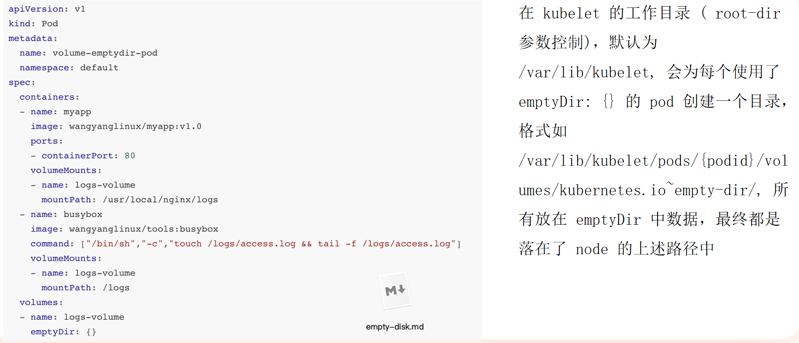


#### 15.pod.yaml


```yaml
apiVersion: v1
kind: Pod
metadata:
  name: volume-emptydir-pod
  namespace: default
spec:
  containers:
    - name: myapp
      image: nginx:alpine  
      ports:
        - containerPort: 80
      volumeMounts:
        - name: logs-volume
          mountPath: /var/log/nginx  # 标准Nginx日志路径
    - name: busybox
      image: busybox:latest  
      command: ["/bin/sh","-c","touch /logs/access.log && tail -f /logs/access.log"]
      volumeMounts:
        - name: logs-volume
          mountPath: /logs
  volumes:
    - name: logs-volume
      emptyDir: {}
```

这是一个使用 `emptyDir` å·å®ç°å®¹å™¨é—´å…±äº«æ—¥å¿—çš„ Kubernetes Pod é…置，我æ¥ä¸ºæ‚¨è¯¦ç»†è§£é‡Šï¼š

### é…置解æ：
```yaml
apiVersion: v1
kind: Pod
metadata:
  name: volume-emptydir-pod  # Podå称
  namespace: default         # 部署在default命å空间
spec:
  containers:
  - name: myapp             # 第一个容器：NginxæœåŠ¡
    image: nginx:alpine     # 使用官方Nginxé•œåƒ
    ports:
    - containerPort: 80     # 暴露80端å£
    volumeMounts:
    - name: logs-volume     # 挂载存储å·
      mountPath: /var/log/nginx  # Nginx默认日志目录
      
  - name: busybox           # 第二个容器：日志监æ§
    image: busybox:latest    # 使用官方BusyBoxé•œåƒ
    command: ["/bin/sh","-c","touch /logs/access.log && tail -f /logs/access.log"] 
    volumeMounts:
    - name: logs-volume     # 挂载åŒä¸€ä¸ªå­˜å‚¨å·
      mountPath: /logs      # 挂载到ä¸åŒè·¯å¾„

  volumes:
  - name: logs-volume       # 定义存储å·
    emptyDir: {}            # 临时空目录å·
```

### 核心机制：
1. **emptyDir å·**：
  - 生命周期ä¸Pod绑定（Pod删除åæ•°æ®æ¶ˆå¤±ï¼‰
  - 两个容器通过挂载åŒä¸€ä¸ªå·å®ç°æ–‡ä»¶å…±äº«
  - 适åˆä¸´æ—¶æ•°æ®äº¤æ¢åœºæ™¯

2. **日志æµå·¥ä½œåŸç†**：
  - Nginx容器将日志写入 `/var/log/nginx/access.log`
  - ç”±äºæŒ‚载了åŒä¸€ä¸ªå·ï¼Œå®é™…写入的是 `emptyDir` 的存储空间
  - BusyBoxå®¹å™¨ä» `/logs/access.log` 读å–相åŒæ–‡ä»¶
  - `tail -f` 命令å®ç°æ—¥å¿—å®æ—¶ç›‘æ§

3. **路径差异处ç†**：
  - 虽然挂载点ä¸åŒï¼ˆ`/var/log/nginx` å’Œ `/logs`）
  - 但指å‘的是åŒä¸€ä¸ªç‰©ç†å­˜å‚¨ä½ç½®

### å…¸å‹ä½¿ç”¨åœºæ™¯ï¼š
- å¼€å‘调试时å®æ—¶æŸ¥çœ‹å®¹å™¨æ—¥å¿—
- 临时性的容器间数æ®äº¤æ¢
- ä¸éœ€è¦æŒä¹…化的中间数æ®å¤„ç†

### 注æ„事项：
1. 生产ç¯å¢ƒå¦‚需æŒä¹…化存储，应改用 `persistentVolumeClaim`
2. `emptyDir` 默认使用节点存储介质（å¯èƒ½å½±å“IO性能）
3. å¯ä»¥é€šè¿‡ `emptyDir.medium: Memory` 指定使用内存（临时性更高）

您å¯ä»¥é€šè¿‡ä»¥ä¸‹å‘½ä»¤éªŒè¯æ—¥å¿—共享：
```bash
kubectl exec volume-emptydir-pod -c myapp -- ls /var/log/nginx
kubectl exec volume-emptydir-pod -c busybox -- ls /logs
```

这个方案比通过 `kubectl logs` 命令查看日志的优势在äºå¯ä»¥å®æ—¶ç›‘æ§æ—¥å¿—å˜åŒ–，适åˆè°ƒè¯•åœºæ™¯ã€‚


```bash
[root@k8s-master01 7]# vim 15.pod.yaml
[root@k8s-master01 7]# kubectl apply -f 15.pod.yaml 
pod/volume-emptydir-pod created
[root@k8s-master01 7]# 
[root@k8s-master01 7]# kubectl get pod
NAME                          READY   STATUS    RESTARTS   AGE
curl                          1/1     Running   0          100m
downward-api-env-example      1/1     Running   0          13h
downward-api-volume-example   1/1     Running   0          13h
secret-volume-pod             1/1     Running   0          15h
volume-emptydir-pod           2/2     Running   0          60s
```

```bash
[root@k8s-master01 7]# kubectl get pod -o wide
NAME                          READY   STATUS    RESTARTS   AGE     IP              NODE         NOMINATED NODE   READINESS GATES
curl                          1/1     Running   0          108m    10.244.58.216   k8s-node02   <none>           <none>
downward-api-env-example      1/1     Running   0          13h     10.244.58.213   k8s-node02   <none>           <none>
downward-api-volume-example   1/1     Running   0          13h     10.244.85.251   k8s-node01   <none>           <none>
secret-volume-pod             1/1     Running   0          15h     10.244.58.212   k8s-node02   <none>           <none>
volume-emptydir-pod           2/2     Running   0          8m31s   10.244.58.214   k8s-node02   <none>           <none>
[root@k8s-master01 7]# while true;
> do
> curl 10.244.58.214
> done
```


å†èµ·ä¸€ä¸ªç»ˆç«¯ï¼š

```bash
[root@k8s-master01 14]# kubectl get pod
NAME                          READY   STATUS    RESTARTS   AGE
curl                          1/1     Running   0          104m
downward-api-env-example      1/1     Running   0          13h
downward-api-volume-example   1/1     Running   0          13h
secret-volume-pod             1/1     Running   0          15h
volume-emptydir-pod           2/2     Running   0          4m54s
[root@k8s-master01 14]# kubectl logs volume-emptydir-pod -c busybox
192.168.120.11 - - [12/Jul/2025:02:45:53 +0000] "GET / HTTP/1.1" 200 615 "-" "curl/7.76.1" "-"
192.168.120.11 - - [12/Jul/2025:02:45:55 +0000] "GET / HTTP/1.1" 200 615 "-" "curl/7.76.1" "-"
192.168.120.11 - - [12/Jul/2025:02:45:56 +0000] "GET / HTTP/1.1" 200 615 "-" "curl/7.76.1" "-"
192.168.120.11 - - [12/Jul/2025:02:45:57 +0000] "GET / HTTP/1.1" 200 615 "-" "curl/7.76.1" "-"
192.168.120.11 - - [12/Jul/2025:02:45:58 +0000] "GET / HTTP/1.1" 200 615 "-" "curl/7.76.1" "-"
192.168.120.11 - - [12/Jul/2025:02:45:59 +0000] "GET / HTTP/1.1" 200 615 "-" "curl/7.76.1" "-"
192.168.120.11 - - [12/Jul/2025:02:46:00 +0000] "GET / HTTP/1.1" 200 615 "-" "curl/7.76.1" "-"
192.168.120.11 - - [12/Jul/2025:02:46:01 +0000] "GET / HTTP/1.1" 200 615 "-" "curl/7.76.1" "-"
192.168.120.11 - - [12/Jul/2025:02:46:02 +0000] "GET / HTTP/1.1" 200 615 "-" "curl/7.76.1" "-"
192.168.120.11 - - [12/Jul/2025:02:46:03 +0000] "GET / HTTP/1.1" 200 615 "-" "curl/7.76.1" "-"
192.168.120.11 - - [12/Jul/2025:02:46:04 +0000] "GET / HTTP/1.1" 200 615 "-" "curl/7.76.1" "-"
192.168.120.11 - - [12/Jul/2025:02:46:05 +0000] "GET / HTTP/1.1" 200 615 "-" "curl/7.76.1" "-"
192.168.120.11 - - [12/Jul/2025:02:46:06 +0000] "GET / HTTP/1.1" 200 615 "-" "curl/7.76.1" "-"
192.168.120.11 - - [12/Jul/2025:02:46:07 +0000] "GET / HTTP/1.1" 200 615 "-" "curl/7.76.1" "-"
192.168.120.11 - - [12/Jul/2025:02:46:08 +0000] "GET / HTTP/1.1" 200 615 "-" "curl/7.76.1" "-"
192.168.120.11 - - [12/Jul/2025:02:46:09 +0000] "GET / HTTP/1.1" 200 615 "-" "curl/7.76.1" "-"
192.168.120.11 - - [12/Jul/2025:02:46:10 +0000] "GET / HTTP/1.1" 200 615 "-" "curl/7.76.1" "-"
192.168.120.11 - - [12/Jul/2025:02:46:11 +0000] "GET / HTTP/1.1" 200 615 "-" "curl/7.76.1" "-"
```

```bash
[root@k8s-master01 14]# kubectl exec -it volume-emptydir-pod -c myapp /bin/sh
kubectl exec [POD] [COMMAND] is DEPRECATED and will be removed in a future version. Use kubectl exec [POD] -- [COMMAND] instead.
/ # cd /var
/var # cd log
/var/log # ls
nginx
/var/log # cd nginx
/var/log/nginx # ls
access.log  error.log
/var/log/nginx # 
```


### 查看pod的uid

```bash
[root@k8s-master01 7]# kubectl get pod -o wide
NAME                          READY   STATUS    RESTARTS   AGE    IP              NODE         NOMINATED NODE   READINESS GATES
volume-emptydir-pod           2/2     Running   0          39m    10.244.58.214   k8s-node02   <none>           <none>
[root@k8s-master01 7]# 
[root@k8s-master01 7]# 
[root@k8s-master01 7]# 
[root@k8s-master01 7]# kubectl get pod volume-emptydir-pod -o yaml | grep uid
  uid: 5628286e-2fba-4fa1-9101-37d0e515d779
```
然å到node02节点

执行：

```bash
[root@k8s-node02 docker]# cd /var/lib/kubelet/pods
[root@k8s-node02 pods]# ls
2e02ae83-5e9e-4f13-bd50-31eda9ba034b  d435644c-9464-4878-87b6-5de57384822b
5628286e-2fba-4fa1-9101-37d0e515d779  d8f842b0-a567-4572-95cd-e2d8dd0ca939
71845854-3a1a-4e5e-8ea3-be4821ecb7e2  e5656dc1-a051-46a1-ad96-402228f761d9
[root@k8s-node02 pods]# cd 5628286e-2fba-4fa1-9101-37d0e515d779
[root@k8s-node02 5628286e-2fba-4fa1-9101-37d0e515d779]# ls
containers  etc-hosts  plugins  volumes
[root@k8s-node02 5628286e-2fba-4fa1-9101-37d0e515d779]# yum -y install tree
Last metadata expiration check: 0:37:10 ago on Sat Jul 12 12:39:55 2025.
Dependencies resolved.
=========================================================================================
 Package          Architecture       Version                    Repository          Size
=========================================================================================
Installing:
 tree             x86_64             1.8.0-10.el9               baseos              55 k

Transaction Summary
=========================================================================================
Install  1 Package

Total download size: 55 k
Installed size: 113 k
Downloading Packages:
tree-1.8.0-10.el9.x86_64.rpm                             107 kB/s |  55 kB     00:00    
-----------------------------------------------------------------------------------------
Total                                                    106 kB/s |  55 kB     00:00     
Running transaction check
Transaction check succeeded.
Running transaction test
Transaction test succeeded.
Running transaction
  Preparing        :                                                                 1/1 
  Installing       : tree-1.8.0-10.el9.x86_64                                        1/1 
  Running scriptlet: tree-1.8.0-10.el9.x86_64                                        1/1 
  Verifying        : tree-1.8.0-10.el9.x86_64                                        1/1 

Installed:
  tree-1.8.0-10.el9.x86_64                                                               

Complete!
[root@k8s-node02 5628286e-2fba-4fa1-9101-37d0e515d779]# tree .
.
├── containers
│   ├── busybox
│   │   └── bee3a6d5
│   └── myapp
│       └── bb4a9bcd
├── etc-hosts
├── plugins
│   └── kubernetes.io~empty-dir
│       ├── logs-volume
│       │   └── ready
│       └── wrapped_kube-api-access-jkzlt
│           └── ready
└── volumes
    ├── kubernetes.io~empty-dir
    │   └── logs-volume
    │       ├── access.log
    │       └── error.log
    └── kubernetes.io~projected
        └── kube-api-access-jkzlt
            ├── ca.crt -> ..data/ca.crt
            ├── namespace -> ..data/namespace
            └── token -> ..data/token

12 directories, 10 files
[root@k8s-node02 5628286e-2fba-4fa1-9101-37d0e515d779]# cd volumes/
[root@k8s-node02 volumes]# cd kubernetes.io~empty-dir/
[root@k8s-node02 kubernetes.io~empty-dir]# cd logs-volume/
[root@k8s-node02 logs-volume]# ls
access.log  error.log
[root@k8s-node02 logs-volume]# echo "tangfire216" >> access.log 
```


```bash
[root@k8s-node02 logs-volume]# kubectl logs volume-emptydir-pod -c busybox 
192.168.120.11 - - [12/Jul/2025:02:49:45 +0000] "GET / HTTP/1.1" 200 615 "-" "curl/7.76.1" "-"
192.168.120.11 - - [12/Jul/2025:02:49:45 +0000] "GET / HTTP/1.1" 200 615 "-" "curl/7.76.1" "-"
192.168.120.11 - - [12/Jul/2025:02:49:45 +0000] "GET / HTTP/1.1" 200 615 "-" "curl/7.76.1" "-"
tangfire216
```


### Volume - emptyDir - 共享内存

#### 16.pod.yaml

```yaml
apiVersion: v1
kind: Pod
metadata:
  name: volume-emptydir-mem
  namespace: default
spec:
  containers:
    - name: myapp
      image: nginx:1.25
      ports:
        - containerPort: 80
      resources:
        limits:
          cpu: "1"
          memory: "1024Mi"
        requests:
          cpu: "1"
          memory: "1024Mi"
      volumeMounts:
        - name: mem-volume
          mountPath: /data
  volumes:
    - name: mem-volume
      emptyDir:
        medium: Memory
        sizeLimit: 500Mi
```


### **Kubernetes Pod é…置解æ**
这个 YAML 文件定义了一个使用 **内存临时å·ï¼ˆemptyDir）** çš„ Pod，以下是é€éƒ¨åˆ†è§£é‡Šï¼š

---

#### **1. 基础信æ¯**
```yaml
apiVersion: v1
kind: Pod
metadata:
  name: volume-emptydir-mem  # Podå称
  namespace: default          # 部署在default命å空间
```
- **作用**：定义一个å为 `volume-emptydir-mem` çš„ Pod，ä½äºé»˜è®¤å‘½å空间。

---

#### **2. 容器é…ç½®**
```yaml
spec:
  containers:
    - name: myapp                     # 容器å称
      image: wangyanglinux/myapp:v1.0 # 使用ç§æœ‰é•œåƒ
      ports:
        - containerPort: 80           # 暴露80端å£
```
- **功能**：容器è¿è¡Œ `myapp` æœåŠ¡ï¼Œç›‘å¬ 80 端å£ã€‚

---

#### **3. 资æºé™åˆ¶**
```yaml
resources:
  limits:
    cpu: "1"         # 最多使用1核CPU
    memory: "1024Mi" # 最多使用1GB内存
  requests:
    cpu: "1"         # 至少需è¦1æ ¸CPU
    memory: "1024Mi" # 至少需è¦1GB内存
```
- **关键点**：
  - `limits` 是硬性é™åˆ¶ï¼ˆè¶…过会被终止）
  - `requests` 是调度ä¾æ®ï¼ˆK8s æ ¹æ®æ­¤å€¼åˆ†é…资æºï¼‰
  - 这里设置为相åŒå€¼ï¼Œè¡¨ç¤ºè¦æ±‚独å èµ„æºã€‚

---

#### **4. 内存临时å·ï¼ˆemptyDir）**
```yaml
volumeMounts:
  - name: mem-volume
    mountPath: /data  # 挂载到容器内的/data路径

volumes:
  - name: mem-volume
    emptyDir:
      medium: Memory   # 使用内存而éç£ç›˜
      sizeLimit: 500Mi # é™åˆ¶å·å¤§å°ä¸º500MB
```
- **核心特性**：
  - **内存存储**：数æ®å­˜å‚¨åœ¨å†…存中，读写速度æ快，但 **Pod é‡å¯åæ•°æ®ä¸¢å¤±**。
  - **容é‡é™åˆ¶**：å·å¤§å°ä¸è¶…过 500MBï¼ˆè¶…è¿‡ä¼šè§¦å‘ eviction）。
  - **共享性**：å¯è¢«åŒä¸€ Pod 内的多个容器挂载（本例中仅 `myapp` 容器使用）。

---

### **å…¸å‹åº”用场景**
1. **临时缓存**
  - 例如缓存计算结æœï¼ŒåŠ é€Ÿå续处ç†ã€‚
2. **æ•æ„Ÿæ•°æ®å¤„ç†**
  - 内存数æ®ä¸ä¼šè½ç›˜ï¼Œé€‚åˆå¤„ç†å¯†ç ç­‰æ•æ„Ÿä¿¡æ¯ã€‚
3. **高性能读写**
  - é¿å…ç£ç›˜ IO 瓶颈（如å®æ—¶æ•°æ®åˆ†æ）。

---

### **注æ„事项**
1. **æ•°æ®æ˜“失性**
  - Pod 崩溃或é‡å¯ä¼šå¯¼è‡´æ•°æ®ä¸¢å¤±ï¼Œ**ä¸å¯ç”¨äºæŒä¹…化存储**。
2. **资æºç›‘æ§**
  - 内存å·ä¼šè®¡å…¥å®¹å™¨çš„内存使用é‡ï¼Œéœ€ç¡®ä¿ `sizeLimit` ≤ 容器内存é™åˆ¶ã€‚
3. **生产建议**
  - 替æ¢ç§æœ‰é•œåƒ `wangyanglinux/myapp:v1.0` 为公共镜åƒï¼ˆå¦‚ `nginx:alpine`）。
  - 如需æŒä¹…化，改用 `persistentVolumeClaim`。

---

### **æ“作验è¯**
```bash
# 1. 创建Pod
kubectl apply -f pod.yaml

# 2. 进入容器查看挂载点
kubectl exec volume-emptydir-mem -- ls /data

# 3. 监æ§èµ„æºä½¿ç”¨
kubectl top pod volume-emptydir-mem
```


### Volume - hostPath - 概念


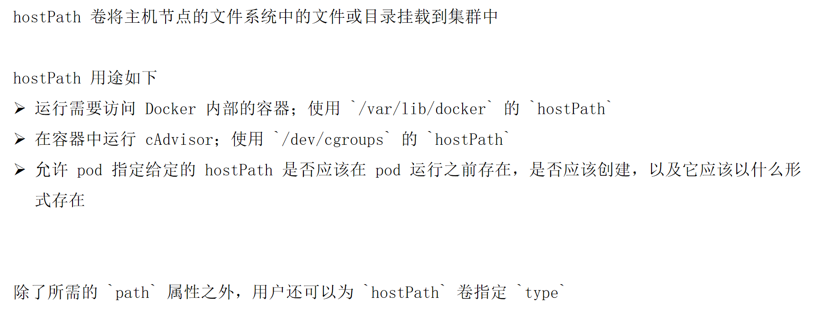

### Volume - hostPath - ç±»å‹

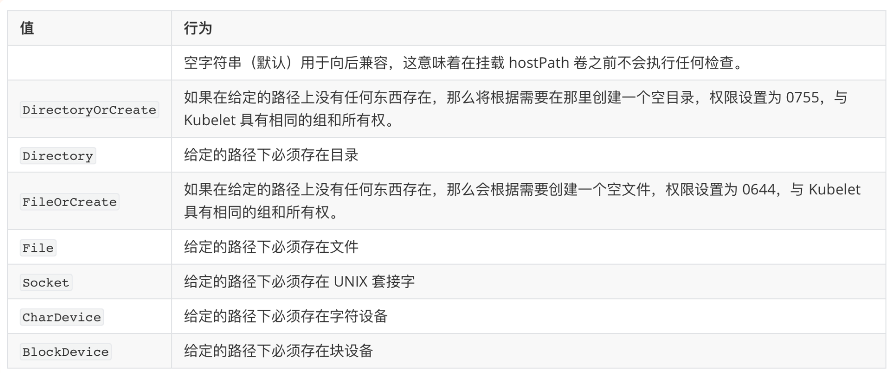


### Volume - hostPath - 注æ„

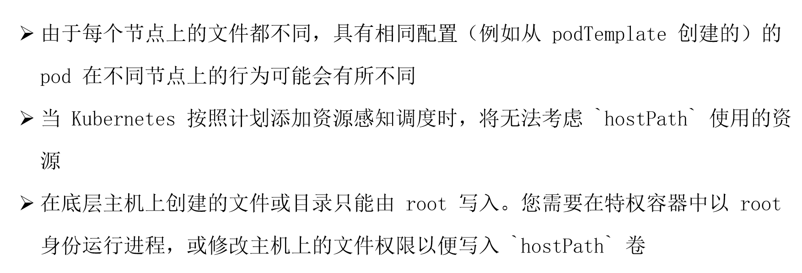


### Volume - hostPath å®éªŒ


#### 17.pod.yaml

```bash
apiVersion: v1
kind: Pod
metadata:
  name: hostpath-pod
spec:
  containers:
    - name: myapp
      image: nginx:1.25
      volumeMounts:
        - name: test-volume
          mountPath: /test-pd
  volumes:
    - name: test-volume
      hostPath:
        path: /test
        type: Directory
```


```bash
[root@k8s-master01 7]# kubectl get pod
NAME                          READY   STATUS              RESTARTS       AGE
curl                          1/1     Running             1 (160m ago)   5h27m
downward-api-env-example      1/1     Running             0              17h
downward-api-volume-example   1/1     Running             0              16h
hostpath-pod                  0/1     ContainerCreating   0              19m
secret-volume-pod             1/1     Running             0              18h
volume-emptydir-mem           1/1     Running             0              50m
volume-emptydir-pod           2/2     Running             0              3h47m
[root@k8s-master01 7]# kubectl describe pod hostpath-pod
Name:             hostpath-pod
Namespace:        default
Priority:         0
Service Account:  default
Node:             k8s-node02/192.168.120.13
Start Time:       Sat, 12 Jul 2025 14:06:49 +0800
Labels:           <none>
Annotations:      <none>
Status:           Pending
IP:               
IPs:              <none>
Containers:
  myapp:
    Container ID:   
    Image:          linux:1.25
    Image ID:       
    Port:           <none>
    Host Port:      <none>
    State:          Waiting
      Reason:       ContainerCreating
    Ready:          False
    Restart Count:  0
    Environment:    <none>
    Mounts:
      /test-pd from test-volume (rw)
      /var/run/secrets/kubernetes.io/serviceaccount from kube-api-access-v7g4h (ro)
Conditions:
  Type                        Status
  PodReadyToStartContainers   False 
  Initialized                 True 
  Ready                       False 
  ContainersReady             False 
  PodScheduled                True 
Volumes:
  test-volume:
    Type:          HostPath (bare host directory volume)
    Path:          /test
    HostPathType:  Directory
  kube-api-access-v7g4h:
    Type:                    Projected (a volume that contains injected data from multiple sources)
    TokenExpirationSeconds:  3607
    ConfigMapName:           kube-root-ca.crt
    ConfigMapOptional:       <nil>
    DownwardAPI:             true
QoS Class:                   BestEffort
Node-Selectors:              <none>
Tolerations:                 node.kubernetes.io/not-ready:NoExecute op=Exists for 300s
                             node.kubernetes.io/unreachable:NoExecute op=Exists for 300s
Events:
  Type     Reason       Age                 From               Message
  ----     ------       ----                ----               -------
  Normal   Scheduled    19m                 default-scheduler  Successfully assigned default/hostpath-pod to k8s-node02
  Warning  FailedMount  64s (x17 over 19m)  kubelet            MountVolume.SetUp failed for volume "test-volume" : hostPath type check failed: /test is not a directory
```


无法创建æˆåŠŸï¼Œå› ä¸ºå½“å‰æ¯ä¸ªèŠ‚点上根本没有test目录


```bash
[root@k8s-master01 7]# kubectl delete -f 17.pod.yaml 
pod "hostpath-pod" deleted
```

å»èŠ‚点node1,节点node2执行：

```bash
[root@k8s-node01 pods]# cd ~
[root@k8s-node01 ~]# mkdir /test

[root@k8s-node01 ~]# hostname > /test/index.html
```

```bash
[root@k8s-node02 logs-volume]# cd ~
[root@k8s-node02 ~]# mkdir /test

[root@k8s-node02 ~]# hostname > /test/index.html
```


```bash
[root@k8s-master01 7]# kubectl apply -f 17.pod.yaml 
pod/hostpath-pod created
[root@k8s-master01 7]# kubectl get pod -o wide
NAME                          READY   STATUS    RESTARTS        AGE     IP              NODE         NOMINATED NODE   READINESS GATES
hostpath-pod                  1/1     Running   0               9s      10.244.58.220   k8s-node02   <none>           <none>

[root@k8s-master01 7]# kubectl exec -it hostpath-pod -- /bin/sh
# 
# cd /test-pd    
# ls
index.html
# cat index.html        
k8s-node02
```


## 06. pv/pvc


存储中的å„å¸å…¶èŒ

### PV/PVC


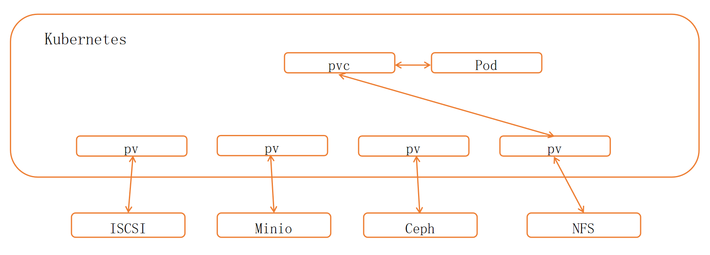


### PV/PVC - å…³è”æ¡ä»¶


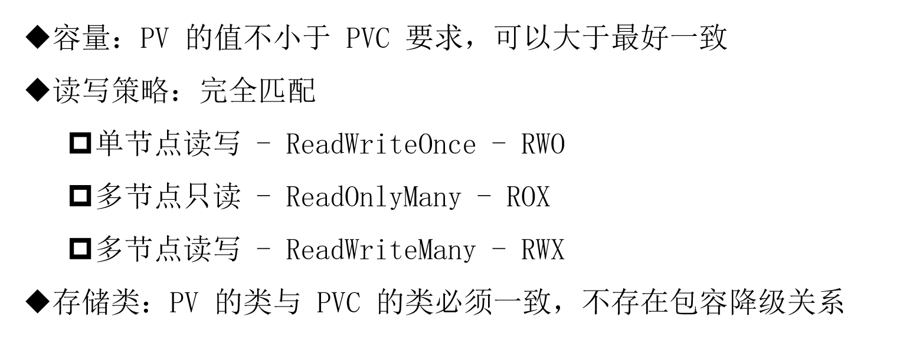


### PV/PVC - å›æ”¶ç­–ç•¥

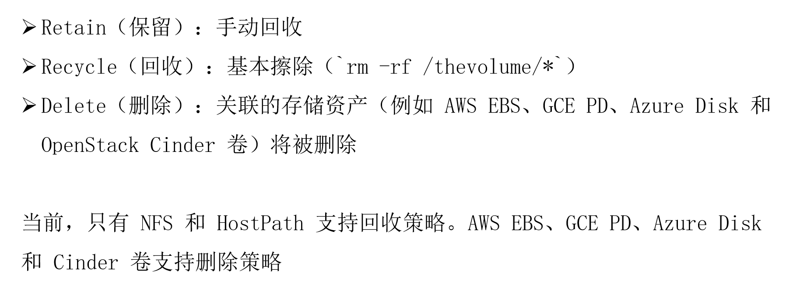

### PV/PVC - 状æ€


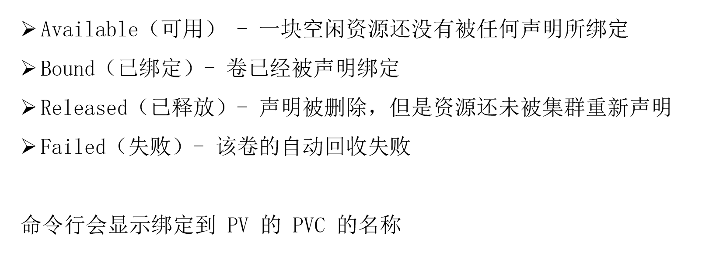


### PV/PVC - PVCä¿æŠ¤

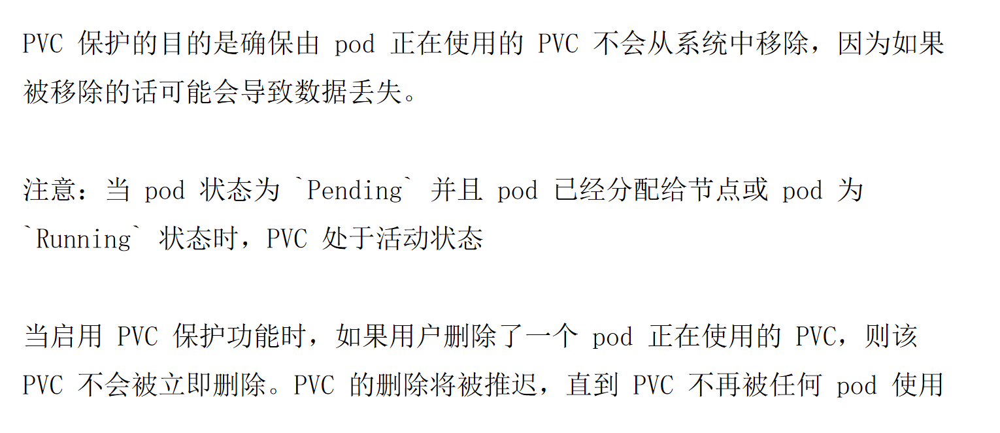


### PV/PVC - StatefulSet - 部署


#### 安装NFSæœåŠ¡å™¨

在æ¯ä¸ªèŠ‚点上执行：

##### 安装 NFS æœåŠ¡ç«¯è½¯ä»¶åŒ…

```bash
yum install -y nfs-utils rpcbind
```

正常情况下，我们会在一个独立的机器上部署这个NFSæœåŠ¡å™¨ï¼Œè¿™è¾¹ä¸ºäº†ç®€å•èµ·è§ï¼Œå°±ç›´æ¥åœ¨master01上部署了

在master01节点是执行：

##### 创建共享目录并设置æƒé™

```bash
mkdir -p /nfsdata
chmod 666 /nfsdata
chown nobody /nfsdata
```
##### é…ç½® NFS 共享（/etc/exports）


```bash
cat > /etc/exports <<EOF
/nfsdata *(rw,no_root_squash,no_all_squash,sync)
EOF
```


```bash
[root@k8s-master01 7]# cd /nfsdata/
[root@k8s-master01 nfsdata]# ls
[root@k8s-master01 nfsdata]# mkdir {1..10}
[root@k8s-master01 nfsdata]# ls
1  10  2  3  4  5  6  7  8  9
[root@k8s-master01 nfsdata]# echo "1" > 1/index.html
[root@k8s-master01 nfsdata]# echo "2" > 2/index.html
[root@k8s-master01 nfsdata]# echo "3" > 3/index.html
[root@k8s-master01 nfsdata]# echo "4" > 4/index.html
[root@k8s-master01 nfsdata]# echo "5" > 5/index.html
[root@k8s-master01 nfsdata]# echo "6" > 6/index.html
[root@k8s-master01 nfsdata]# echo "7" > 7/index.html
[root@k8s-master01 nfsdata]# echo "8" > 8/index.html
[root@k8s-master01 nfsdata]# echo "9" > 9/index.html
[root@k8s-master01 nfsdata]# echo "10" > 10/index.html
[root@k8s-master01 nfsdata]# cat 1/index.html 
1
```

```bash
[root@k8s-master01 nfsdata]# vim /etc/exports
```

改æˆè¿™æ ·ï¼š

```bash
/nfsdata/1 *(rw,no_root_squash,no_all_squash,sync)
/nfsdata/2 *(rw,no_root_squash,no_all_squash,sync)
/nfsdata/3 *(rw,no_root_squash,no_all_squash,sync)
/nfsdata/4 *(rw,no_root_squash,no_all_squash,sync)
/nfsdata/5 *(rw,no_root_squash,no_all_squash,sync)
/nfsdata/6 *(rw,no_root_squash,no_all_squash,sync)
/nfsdata/7 *(rw,no_root_squash,no_all_squash,sync)
/nfsdata/8 *(rw,no_root_squash,no_all_squash,sync)
/nfsdata/9 *(rw,no_root_squash,no_all_squash,sync)
/nfsdata/10 *(rw,no_root_squash,no_all_squash,sync)
```

```bash
systemctl restart rpcbind
systemctl restart nfs-server
```

```bash
[root@k8s-master01 nfsdata]# systemctl restart rpcbind
systemctl restart nfs-server
[root@k8s-master01 nfsdata]# showmount -e 192.168.120.11
Export list for 192.168.120.11:
/nfsdata/10 *
/nfsdata/9  *
/nfsdata/8  *
/nfsdata/7  *
/nfsdata/6  *
/nfsdata/5  *
/nfsdata/4  *
/nfsdata/3  *
/nfsdata/2  *
/nfsdata/1  *
```


在node1节点上执行：

```bash
[root@k8s-node01 ~]# mkdir /nfstest
[root@k8s-node01 ~]# mount -t nfs 192.168.120.11:/nfsdata/1 /nfstest/
[root@k8s-node01 ~]# cd /nfstest/
[root@k8s-node01 nfstest]# ls
index.html
[root@k8s-node01 nfstest]# cat index.html 
1
[root@k8s-node01 nfstest]# echo "tangfire" >> index.html
[root@k8s-node01 nfstest]# cat index.html 
1
tangfire
```

然å我们å†çœ‹çœ‹master01节点：

```bash
[root@k8s-master01 nfsdata]# cat 1/index.html 
1
tangfire
```

然å我们在node1节点上执行：

```bash
[root@k8s-node01 nfstest]# umount /nfstest/
umount.nfs4: /nfstest: device is busy
[root@k8s-node01 nfstest]# cd 
[root@k8s-node01 ~]# umount /nfstest/
```


#### 部署PV

#### pv.yaml

```yaml
apiVersion: v1
kind: PersistentVolume
metadata:
  name: nfspv1
spec:
  capacity:
    storage: 1Gi
  accessModes:
    - ReadWriteOnce
  persistentVolumeReclaimPolicy: Recycle
  storageClassName: nfs
  nfs:
    path: /nfsdata/1
    server: 192.168.120.11

---


apiVersion: v1
kind: PersistentVolume
metadata:
  name: nfspv2
spec:
  capacity:
    storage: 0.9Gi
  accessModes:
    - ReadWriteOnce
  persistentVolumeReclaimPolicy: Recycle
  storageClassName: nfs
  nfs:
    path: /nfsdata/2
    server: 192.168.120.11

---


apiVersion: v1
kind: PersistentVolume
metadata:
  name: nfspv3
spec:
  capacity:
    storage: 1.2Gi
  accessModes:
    - ReadWriteOnce
  persistentVolumeReclaimPolicy: Recycle
  storageClassName: nfs
  nfs:
    path: /nfsdata/3
    server: 192.168.120.11

---


apiVersion: v1
kind: PersistentVolume
metadata:
  name: nfspv4
spec:
  capacity:
    storage: 1Gi
  accessModes:
    - ReadWriteOnce
  persistentVolumeReclaimPolicy: Recycle
  storageClassName: nfs
  nfs:
    path: /nfsdata/4
    server: 192.168.120.11

---


apiVersion: v1
kind: PersistentVolume
metadata:
  name: nfspv5
spec:
  capacity:
    storage: 1Gi
  accessModes:
    - ReadWriteMany
  persistentVolumeReclaimPolicy: Recycle
  storageClassName: nfs
  nfs:
    path: /nfsdata/5
    server: 192.168.120.11

---


apiVersion: v1
kind: PersistentVolume
metadata:
  name: nfspv6
spec:
  capacity:
    storage: 1Gi
  accessModes:
    - ReadWriteOnce
  persistentVolumeReclaimPolicy: Recycle
  storageClassName: nfs1
  nfs:
    path: /nfsdata/6
    server: 192.168.120.11

---


apiVersion: v1
kind: PersistentVolume
metadata:
  name: nfspv7
spec:
  capacity:
    storage: 1Gi
  accessModes:
    - ReadWriteOnce
  persistentVolumeReclaimPolicy: Retain
  storageClassName: nfs
  nfs:
    path: /nfsdata/7
    server: 192.168.120.11


```


```bash
[root@k8s-master01 18]# kubectl apply -f pv.yaml 
persistentvolume/nfspv1 created
persistentvolume/nfspv2 created
persistentvolume/nfspv3 created
persistentvolume/nfspv4 created
persistentvolume/nfspv5 created
persistentvolume/nfspv6 created
persistentvolume/nfspv7 created

[root@k8s-master01 18]# kubectl get pv
NAME     CAPACITY         ACCESS MODES   RECLAIM POLICY   STATUS      CLAIM   STORAGECLASS   VOLUMEATTRIBUTESCLASS   REASON   AGE
nfspv1   1Gi              RWO            Recycle          Available           nfs            <unset>                          25s
nfspv2   966367641600m    RWO            Recycle          Available           nfs            <unset>                          25s
nfspv3   1288490188800m   RWO            Recycle          Available           nfs            <unset>                          25s
nfspv4   1Gi              RWO            Recycle          Available           nfs            <unset>                          25s
nfspv5   1Gi              RWX            Recycle          Available           nfs            <unset>                          25s
nfspv6   1Gi              RWO            Recycle          Available           nfs1           <unset>                          25s
nfspv7   1Gi              RWO            Retain           Available           nfs            <unset>                          25s
```


#### 创建æœåŠ¡å¹¶ä½¿ç”¨PVC


#### statefulSet.yaml

```yaml
apiVersion: v1
kind: Service
metadata:
  name: nginx
  labels:
    app: nginx
spec:
  ports:
  - port: 80
    name: web
  clusterIP: None  # Headless Service 标识
  selector:
    app: nginx

---

apiVersion: apps/v1
kind: StatefulSet
metadata:
  name: web
spec:
  serviceName: "nginx"
  replicas: 3
  selector:
    matchLabels:
      app: nginx
  template:
    metadata:
      labels:
        app: nginx
    spec:
      containers:
        - name: nginx
          image: nginx:alpine  # 使用官方Nginxé•œåƒæ›¿ä»£ç§æœ‰é•œåƒ
          ports:
            - containerPort: 80
              name: web
          volumeMounts:
            - name: www
              mountPath: /usr/share/nginx/html  # 调整为标准Nginx路径
  volumeClaimTemplates:
    - metadata:
        name: www
      spec:
        accessModes: [ "ReadWriteOnce" ]
        storageClassName: "nfs"
        resources:
          requests:
            storage: 1Gi
```


```bash
[root@k8s-master01 18]# kubectl apply -f statefulSet.yaml 
service/nginx created
statefulset.apps/web created
[root@k8s-master01 18]# kubectl get pod
NAME    READY   STATUS    RESTARTS   AGE
web-0   1/1     Running   0          105s
web-1   1/1     Running   0          103s
web-2   1/1     Running   0          101s
```


#### 查看k8s中DNSæœåŠ¡å™¨çš„VIP

在 Kubernetes 中，DNS æœåŠ¡çš„ VIP（虚拟 IP）通常是 **CoreDNS** 或 **kube-dns** æœåŠ¡çš„ ClusterIP。以下是查看方法：

---

### **1. 确认 DNS æœåŠ¡å称**
```bash
kubectl get svc -n kube-system | grep -E 'kube-dns|CoreDNS'
```
输出示例：
```
NAME       TYPE        CLUSTER-IP     PORT(S)
coredns    ClusterIP   10.96.0.10     53/UDP,53/TCP
```
- **`10.96.0.10`** 就是 DNS æœåŠ¡çš„ VIP（ClusterIP）。

---

### **2. 查看 DNS æœåŠ¡çš„详细é…ç½®**
```bash
kubectl describe svc coredns -n kube-system
```
关键输出：
```
IP:                       10.96.0.10
Port:                      dns  53/UDP
TargetPort:                53/UDP
Endpoints:                 10.244.0.5:53,10.244.0.6:53
```
- **`IP: 10.96.0.10`** 是 VIP（所有 DNS 请求都会å‘往此 IP）。
- **`Endpoints`** 是å®é™…è¿è¡Œ CoreDNS çš„ Pod IP。

---

### **3. 查看 Pod çš„ DNS é…ç½®**
```bash
kubectl exec -it <ä»»æ„Podå称> -- cat /etc/resolv.conf
```
输出示例：
```
nameserver 10.96.0.10
search default.svc.cluster.local svc.cluster.local cluster.local
```
- **`nameserver 10.96.0.10`** 就是集群的 DNS VIP。

---

### **4. ç›´æ¥æµ‹è¯• DNS 解æ**
```bash
# 进入一个临时Pod测试
kubectl run -it --rm --image=busybox:latest test --restart=Never -- nslookup kubernetes.default
```
输出示例：
```
Server:    10.96.0.10
Address 1: 10.96.0.10 kube-dns.kube-system.svc.cluster.local
```
- **`Server: 10.96.0.10`** å³ä¸º DNS æœåŠ¡çš„ VIP。

---

### **5. 特殊情况说æ˜**
1. **如æœä½¿ç”¨è‡ªå®šä¹‰ DNS**：
  - 检查 `kubelet` é…置中的 `--cluster-dns` å‚数：
    ```bash
    ps aux | grep kubelet | grep cluster-dns
    ```
2. **å¦‚æœ VIP 无法访问**：
  - 检查 CoreDNS Pod 是å¦æ­£å¸¸è¿è¡Œï¼š
    ```bash
    kubectl get pods -n kube-system -l k8s-app=kube-dns
    ```

---

### **总结**
| 项目               | å…¸å‹å€¼          | æŸ¥çœ‹æ–¹å¼                      |
|--------------------|----------------|-----------------------------|
| **DNS VIP**        | `10.96.0.10`   | `kubectl get svc -n kube-system` |
| **DNS 解æ测试**   | `nslookup`     | 临时 Pod 测试                  |
| **自定义é…ç½®**     | `kubelet` å‚æ•° | 检查节点æœåŠ¡é…ç½®                |


---

```bash
[root@k8s-master01 18]# kubectl get pod
NAME    READY   STATUS    RESTARTS   AGE
web-0   1/1     Running   0          105s
web-1   1/1     Running   0          103s
web-2   1/1     Running   0          101s
[root@k8s-master01 18]# 
[root@k8s-master01 18]# kubectl get svc
NAME         TYPE        CLUSTER-IP   EXTERNAL-IP   PORT(S)   AGE
kubernetes   ClusterIP   10.0.0.1     <none>        443/TCP   8d
nginx        ClusterIP   None         <none>        80/TCP    3m51s
[root@k8s-master01 18]# kubectl get endpoints
NAME         ENDPOINTS                                            AGE
kubernetes   192.168.120.11:6443                                  8d
nginx        10.244.58.222:80,10.244.85.254:80,10.244.85.255:80   4m10s
[root@k8s-master01 18]# kubectl get svc -n kube-system | grep -E 'kube-dns|CoreDNS'
kube-dns       ClusterIP   10.0.0.10      <none>        53/UDP,53/TCP,9153/TCP   8d
[root@k8s-master01 18]# dig -t A nginx.default.svc.cluster.local. @10.0.0.10

; <<>> DiG 9.16.23-RH <<>> -t A nginx.default.svc.cluster.local. @10.0.0.10
;; global options: +cmd
;; Got answer:
;; WARNING: .local is reserved for Multicast DNS
;; You are currently testing what happens when an mDNS query is leaked to DNS
;; ->>HEADER<<- opcode: QUERY, status: NOERROR, id: 11981
;; flags: qr aa rd; QUERY: 1, ANSWER: 3, AUTHORITY: 0, ADDITIONAL: 1
;; WARNING: recursion requested but not available

;; OPT PSEUDOSECTION:
; EDNS: version: 0, flags:; udp: 4096
; COOKIE: 96df3d5dbd1006f9 (echoed)
;; QUESTION SECTION:
;nginx.default.svc.cluster.local. IN	A

;; ANSWER SECTION:
nginx.default.svc.cluster.local. 30 IN	A	10.244.85.255
nginx.default.svc.cluster.local. 30 IN	A	10.244.58.222
nginx.default.svc.cluster.local. 30 IN	A	10.244.85.254

;; Query time: 56 msec
;; SERVER: 10.0.0.10#53(10.0.0.10)
;; WHEN: Sat Jul 12 19:21:18 CST 2025
;; MSG SIZE  rcvd: 213

[root@k8s-master01 18]# kubectl get pod -o wide
NAME    READY   STATUS    RESTARTS   AGE     IP              NODE         NOMINATED NODE   READINESS GATES
web-0   1/1     Running   0          8m57s   10.244.85.254   k8s-node01   <none>           <none>
web-1   1/1     Running   0          8m55s   10.244.58.222   k8s-node02   <none>           <none>
web-2   1/1     Running   0          8m53s   10.244.85.255   k8s-node01   <none>           <none>
```

无头æœåŠ¡ä¼šå°†å½“å‰æˆ‘们的标签选择器匹é…到的pod，添加到当å‰çš„DNS解æ结æœé‡Œå»


```bash
[root@k8s-master01 18]# kubectl get statefulSet
NAME   READY   AGE
web    3/3     12m
[root@k8s-master01 18]# kubectl scale statefulSet web --replicas=10
statefulset.apps/web scaled
[root@k8s-master01 18]# kubectl get pod
NAME    READY   STATUS    RESTARTS   AGE
web-0   1/1     Running   0          12m
web-1   1/1     Running   0          12m
web-2   1/1     Running   0          12m
web-3   1/1     Running   0          5s
web-4   0/1     Pending   0          3s

[root@k8s-master01 18]# kubectl describe pod web-4
Name:             web-4
Namespace:        default
Priority:         0
Service Account:  default
Node:             <none>
Labels:           app=nginx
                  apps.kubernetes.io/pod-index=4
                  controller-revision-hash=web-6578c54df4
                  statefulset.kubernetes.io/pod-name=web-4
Annotations:      <none>
Status:           Pending
IP:               
IPs:              <none>
Controlled By:    StatefulSet/web
Containers:
  nginx:
    Image:        nginx:alpine
    Port:         80/TCP
    Host Port:    0/TCP
    Environment:  <none>
    Mounts:
      /usr/share/nginx/html from www (rw)
      /var/run/secrets/kubernetes.io/serviceaccount from kube-api-access-wzkdn (ro)
Conditions:
  Type           Status
  PodScheduled   False 
Volumes:
  www:
    Type:       PersistentVolumeClaim (a reference to a PersistentVolumeClaim in the same namespace)
    ClaimName:  www-web-4
    ReadOnly:   false
  kube-api-access-wzkdn:
    Type:                    Projected (a volume that contains injected data from multiple sources)
    TokenExpirationSeconds:  3607
    ConfigMapName:           kube-root-ca.crt
    ConfigMapOptional:       <nil>
    DownwardAPI:             true
QoS Class:                   BestEffort
Node-Selectors:              <none>
Tolerations:                 node.kubernetes.io/not-ready:NoExecute op=Exists for 300s
                             node.kubernetes.io/unreachable:NoExecute op=Exists for 300s
Events:
  Type     Reason            Age                    From               Message
  ----     ------            ----                   ----               -------
  Warning  FailedScheduling  2m24s (x2 over 7m47s)  default-scheduler  0/3 nodes are available: pod has unbound immediate PersistentVolumeClaims. preemption: 0/3 nodes are available: 3 Preemption is not helpful for scheduling.
[root@k8s-master01 18]# kubectl get pv
NAME     CAPACITY         ACCESS MODES   RECLAIM POLICY   STATUS      CLAIM               STORAGECLASS   VOLUMEATTRIBUTESCLASS   REASON   AGE
nfspv1   1Gi              RWO            Recycle          Bound       default/www-web-1   nfs            <unset>                          34m
nfspv2   966367641600m    RWO            Recycle          Available                       nfs            <unset>                          34m
nfspv3   1288490188800m   RWO            Recycle          Bound       default/www-web-3   nfs            <unset>                          34m
nfspv4   1Gi              RWO            Recycle          Bound       default/www-web-2   nfs            <unset>                          34m
nfspv5   1Gi              RWX            Recycle          Available                       nfs            <unset>                          34m
nfspv6   1Gi              RWO            Recycle          Available                       nfs1           <unset>                          34m
nfspv7   1Gi              RWO            Retain           Bound       default/www-web-0   nfs            <unset>                          34m
```


```bash
[root@k8s-master01 18]# kubectl get pod -o wide
NAME    READY   STATUS    RESTARTS   AGE   IP              NODE         NOMINATED NODE   READINESS GATES
web-0   1/1     Running   0          32m   10.244.85.254   k8s-node01   <none>           <none>
web-1   1/1     Running   0          32m   10.244.58.222   k8s-node02   <none>           <none>
web-2   1/1     Running   0          32m   10.244.85.255   k8s-node01   <none>           <none>
web-3   1/1     Running   0          20m   10.244.58.221   k8s-node02   <none>           <none>
web-4   0/1     Pending   0          20m   <none>          <none>       <none>           <none>
[root@k8s-master01 18]# curl 10.244.85.254
7
[root@k8s-master01 18]# kubectl get pvc
NAME        STATUS    VOLUME   CAPACITY         ACCESS MODES   STORAGECLASS   VOLUMEATTRIBUTESCLASS   AGE
www-web-0   Bound     nfspv7   1Gi              RWO            nfs            <unset>                 34m
www-web-1   Bound     nfspv1   1Gi              RWO            nfs            <unset>                 33m
www-web-2   Bound     nfspv4   1Gi              RWO            nfs            <unset>                 33m
www-web-3   Bound     nfspv3   1288490188800m   RWO            nfs            <unset>                 21m
www-web-4   Pending                                            nfs            <unset>                 21m
```


```bash
[root@k8s-master01 18]# kubectl exec -it web-0 -- /bin/sh
/ # cd /usr/share/nginx/html
/usr/share/nginx/html # ls
index.html
/usr/share/nginx/html # echo "tangfire" >> index.html
/usr/share/nginx/html # exit
[root@k8s-master01 18]# curl 10.244.85.254
7
tangfire
[root@k8s-master01 18]# kubectl delete pod web-0
pod "web-0" deleted
[root@k8s-master01 18]# kubectl get pod -o wide
NAME    READY   STATUS    RESTARTS   AGE   IP              NODE         NOMINATED NODE   READINESS GATES
web-0   1/1     Running   0          11s   10.244.85.192   k8s-node01   <none>           <none>
web-1   1/1     Running   0          37m   10.244.58.222   k8s-node02   <none>           <none>
web-2   1/1     Running   0          37m   10.244.85.255   k8s-node01   <none>           <none>
web-3   1/1     Running   0          26m   10.244.58.221   k8s-node02   <none>           <none>
web-4   0/1     Pending   0          26m   <none>          <none>       <none>           <none>
[root@k8s-master01 18]# curl 10.244.85.192
7
tangfire
```


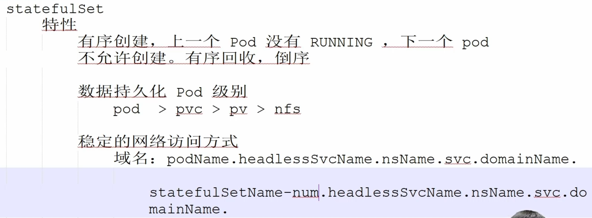


```bash
[root@k8s-master01 18]# kubectl delete -f statefulSet.yaml 
service "nginx" deleted
statefulset.apps "web" deleted
[root@k8s-master01 18]# kubectl get pod
No resources found in default namespace.
[root@k8s-master01 18]# kubectl get pv
NAME     CAPACITY         ACCESS MODES   RECLAIM POLICY   STATUS      CLAIM               STORAGECLASS   VOLUMEATTRIBUTESCLASS   REASON   AGE
nfspv1   1Gi              RWO            Recycle          Bound       default/www-web-1   nfs            <unset>                          62m
nfspv2   966367641600m    RWO            Recycle          Available                       nfs            <unset>                          62m
nfspv3   1288490188800m   RWO            Recycle          Bound       default/www-web-3   nfs            <unset>                          62m
nfspv4   1Gi              RWO            Recycle          Bound       default/www-web-2   nfs            <unset>                          62m
nfspv5   1Gi              RWX            Recycle          Available                       nfs            <unset>                          62m
nfspv6   1Gi              RWO            Recycle          Available                       nfs1           <unset>                          62m
nfspv7   1Gi              RWO            Retain           Bound       default/www-web-0   nfs            <unset>                          62m
[root@k8s-master01 18]# kubectl get pvc
NAME        STATUS    VOLUME   CAPACITY         ACCESS MODES   STORAGECLASS   VOLUMEATTRIBUTESCLASS   AGE
www-web-0   Bound     nfspv7   1Gi              RWO            nfs            <unset>                 48m
www-web-1   Bound     nfspv1   1Gi              RWO            nfs            <unset>                 48m
www-web-2   Bound     nfspv4   1Gi              RWO            nfs            <unset>                 48m
www-web-3   Bound     nfspv3   1288490188800m   RWO            nfs            <unset>                 36m
www-web-4   Pending                                            nfs            <unset>                 36m
[root@k8s-master01 18]# kubectl apply -f statefulSet.yaml 
service/nginx created
statefulset.apps/web created
[root@k8s-master01 18]# kubectl get pod -o wide
NAME    READY   STATUS    RESTARTS   AGE   IP              NODE         NOMINATED NODE   READINESS GATES
web-0   1/1     Running   0          9s    10.244.58.223   k8s-node02   <none>           <none>
web-1   1/1     Running   0          8s    10.244.85.193   k8s-node01   <none>           <none>
web-2   1/1     Running   0          6s    10.244.58.225   k8s-node02   <none>           <none>
[root@k8s-master01 18]# curl 10.244.58.223
7
tangfire
```


```bash
[root@k8s-master01 18]# kubectl delete -f statefulSet.yaml 
service "nginx" deleted
statefulset.apps "web" deleted
[root@k8s-master01 18]# kubectl delete pvc --all
persistentvolumeclaim "www-web-0" deleted
persistentvolumeclaim "www-web-1" deleted
persistentvolumeclaim "www-web-2" deleted
persistentvolumeclaim "www-web-3" deleted
persistentvolumeclaim "www-web-4" deleted
[root@k8s-master01 18]# kubectl get pv
NAME     CAPACITY         ACCESS MODES   RECLAIM POLICY   STATUS      CLAIM               STORAGECLASS   VOLUMEATTRIBUTESCLASS   REASON   AGE
nfspv1   1Gi              RWO            Recycle          Released    default/www-web-1   nfs            <unset>                          68m
nfspv2   966367641600m    RWO            Recycle          Available                       nfs            <unset>                          68m
nfspv3   1288490188800m   RWO            Recycle          Failed      default/www-web-3   nfs            <unset>                          68m
nfspv4   1Gi              RWO            Recycle          Failed      default/www-web-2   nfs            <unset>                          68m
nfspv5   1Gi              RWX            Recycle          Available                       nfs            <unset>                          68m
nfspv6   1Gi              RWO            Recycle          Available                       nfs1           <unset>                          68m
nfspv7   1Gi              RWO            Retain           Released    default/www-web-0   nfs            <unset>                          68m
```

---

#### PersistentVolume (PV) ä» `Released` 状æ€æ¢å¤ä¸º `Available` 状æ€


在 Kubernetes 中，将 PersistentVolume (PV) ä» `Released` 状æ€æ¢å¤ä¸º `Available` 状æ€ï¼Œéœ€è¦æ‰‹åŠ¨æ¸…ç†å…¶ç»‘定关系。以下是具体æ“作步骤和代ç ç¤ºä¾‹ï¼š

---

### **1. æŸ¥çœ‹å½“å‰ PV 状æ€**
```bash
kubectl get pv
```
输出示例：
```
NAME      CAPACITY  STATUS      CLAIM             STORAGECLASS
pv-nfs    1Gi       Released    default/www-web-0 nfs
```

---

### **2. 手动释放 PV（关键步骤）**
编辑 PV é…置，删除 `claimRef` 字段（这是导致状æ€ä¸º Released çš„æ ¹æºï¼‰ï¼š
```bash
kubectl edit pv <pv-name>
```
找到并删除以下部分：
```yaml
spec:
  claimRef:
    apiVersion: v1
    kind: PersistentVolumeClaim
    name: www-web-0  # åŸç»‘定的PVCå称
    namespace: default
```

---

### **3. 强制å›æ”¶ PV（如æœä»ä¸ç”Ÿæ•ˆï¼‰**
å¦‚æœ PV çš„å›æ”¶ç­–略是 `Retain`，需手动清ç†æ•°æ®å¹¶é‡ç½®çŠ¶æ€ï¼š
```bash
kubectl patch pv <pv-name> -p '{"spec":{"claimRef":null}}'
```

---

### **4. 验è¯çŠ¶æ€å˜æ›´**
```bash
kubectl get pv <pv-name>
```
预期输出：
```
NAME      CAPACITY  STATUS      CLAIM  STORAGECLASS
pv-nfs    1Gi       Available          nfs
```

---

### **完整æ“作示例**
å‡è®¾ PV å称为 `pv-nfs`：
```bash
# 1. 查看PV
kubectl get pv pv-nfs -o yaml

# 2. 解除绑定
kubectl patch pv pv-nfs --type=json -p '[{"op":"remove","path":"/spec/claimRef"}]'

# 3. 验è¯
kubectl get pv pv-nfs
```

---

### **根本åŸå› åˆ†æ**
| çŠ¶æ€ | 触å‘æ¡ä»¶ | 解决方案 |
|------|----------|----------|
| `Released` | PVC 被删除，但 PV ä»ä¿ç•™ç»‘定记录 | 删除 `claimRef` |
| `Failed` | 存储å端故障 | 检查存储系统日志 |

---

### **注æ„事项**
1. **æ•°æ®å®‰å…¨**：
  - å¦‚æœ PV 中åŸæœ‰æ•°æ®é‡è¦ï¼Œæ“作å‰å…ˆå¤‡ä»½ï¼ˆå°¤å…¶æ˜¯å›æ”¶ç­–略为 `Delete` 时）。
2. **StatefulSet å…³è”**：
  - ç¡®ä¿å¯¹åº”çš„ StatefulSet 已删除或缩容，å¦åˆ™æ–° PVC 会å†æ¬¡ç»‘定。
3. **NFS 存储**：
  - 如æœæ˜¯ NFS PV，需确ä¿æœåŠ¡å™¨å…±äº«ç›®å½• `/data/nfs` 已清空或å¯å¤ç”¨ã€‚


---

### PV/PVC - StatefulSet - 特性


## 07. storageClass

一ç§åŠ¨æ€çš„申请存储的机制


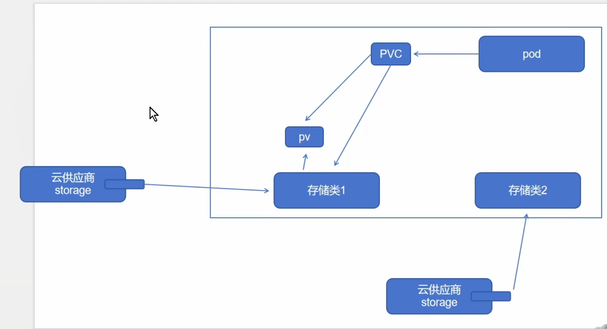


### storageClass概念


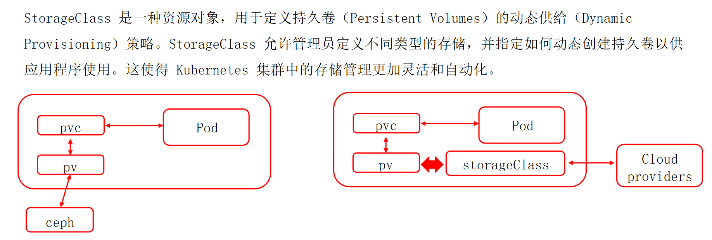


### nfs-client-provisioner

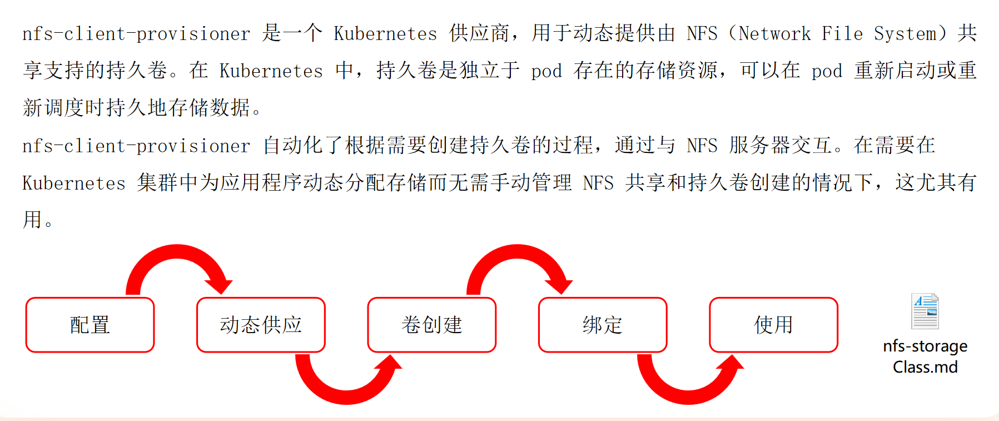


#### æ­å»ºNFSæœåŠ¡å™¨

略，上文已ç»æ­å»º

#### 部署nfs-client-provisioner

```bash
[root@k8s-master01 18]# vim /etc/exports
```


加入这个：

```bash
/nfsdata/share *(rw,no_root_squash,no_all_squash,sync)
```

```bash
[root@k8s-master01 18]# mkdir -p /nfsdata/share
[root@k8s-master01 18]# chown -R nobody /nfsdata/share/
[root@k8s-master01 18]# systemctl restart nfs-server
[root@k8s-master01 18]# systemctl enable nfs-server
[root@k8s-master01 18]# systemctl enable rpcbind

[root@k8s-master01 18]# showmount -e 192.168.120.11
Export list for 192.168.120.11:
/nfsdata/share *
/nfsdata/10    *
/nfsdata/9     *
/nfsdata/8     *
/nfsdata/7     *
/nfsdata/6     *
/nfsdata/5     *
/nfsdata/4     *
/nfsdata/3     *
/nfsdata/2     *
/nfsdata/1     *
```

#### 部署nfs-client-provisioner

#### deployment.yaml

```yaml
apiVersion: apps/v1
kind: Deployment
metadata:
  name: nfs-client-provisioner
  namespace: nfs-storageclass
spec:
  replicas: 1
  selector:
    matchLabels:
      app: nfs-client-provisioner
  strategy:
    type: Recreate
  template:
    metadata:
      labels:
        app: nfs-client-provisioner
    spec:
      serviceAccountName: nfs-client-provisioner
      containers:
      - name: nfs-client-provisioner
        image: dyrnq/nfs-subdir-external-provisioner:v4.0.2
        volumeMounts:
        - name: nfs-client-root
          mountPath: /persistentvolumes
        env:
        - name: PROVISIONER_NAME
          value: k8s-sigs.io/nfs-subdir-external-provisioner
        - name: NFS_SERVER
          value: 192.168.120.11
        - name: NFS_PATH
          value: /nfsdata/share
      volumes:
      - name: nfs-client-root
        nfs:
          server: 192.168.120.11
          path: /nfsdata/share

```

#### rbac.yaml

```yaml
apiVersion: v1
kind: ServiceAccount
metadata:
  name: nfs-client-provisioner
  namespace: nfs-storageclass
---

apiVersion: rbac.authorization.k8s.io/v1
kind: ClusterRole
metadata:
  name: nfs-client-provisioner-runner
rules:
- apiGroups: [""]
  resources: ["nodes"]
  verbs: ["get", "list", "watch"]
- apiGroups: [""]
  resources: ["persistentvolumes"]
  verbs: ["get", "list", "watch", "create", "delete"]
- apiGroups: [""]
  resources: ["persistentvolumeclaims"]
  verbs: ["get", "list", "watch", "update"]
- apiGroups: ["storage.k8s.io"]
  resources: ["storageclasses"]
  verbs: ["get", "list", "watch"]
- apiGroups: [""]
  resources: ["events"]
  verbs: ["create", "update", "patch"]
---

apiVersion: rbac.authorization.k8s.io/v1
kind: ClusterRoleBinding
metadata:
  name: run-nfs-client-provisioner
subjects:
- kind: ServiceAccount
  name: nfs-client-provisioner
  namespace: nfs-storageclass
roleRef:
  kind: ClusterRole
  name: nfs-client-provisioner-runner
  apiGroup: rbac.authorization.k8s.io
---

apiVersion: rbac.authorization.k8s.io/v1
kind: Role
metadata:
  name: leader-locking-nfs-client-provisioner
  namespace: nfs-storageclass
rules:
- apiGroups: [""]
  resources: ["endpoints"]
  verbs: ["get", "list", "watch", "create", "update", "patch"]
---

apiVersion: rbac.authorization.k8s.io/v1
kind: RoleBinding
metadata:
  name: leader-locking-nfs-client-provisioner
  namespace: nfs-storageclass
subjects:
- kind: ServiceAccount
  name: nfs-client-provisioner
  namespace: nfs-storageclass
roleRef:
  kind: Role
  name: leader-locking-nfs-client-provisioner
  apiGroup: rbac.authorization.k8s.io
```


#### storageclass.yaml

```yaml
apiVersion: storage.k8s.io/v1
kind: StorageClass
metadata:
  name: nfs-client
  namespace: nfs-storageclass
provisioner: k8s-sigs.io/nfs-subdir-external-provisioner
parameters:
  pathPattern: "${.PVC.namespace}/${.PVC.name}"
  onDelete: "delete"
```


#### 创建å字空间

```bash
kubectl create ns nfs-storageclass
```

```bash
[root@k8s-master01 19]# vim deployment.yaml
[root@k8s-master01 19]# 
[root@k8s-master01 19]# vim rbac.yaml
[root@k8s-master01 19]# 
[root@k8s-master01 19]# vim storageclass.yaml
[root@k8s-master01 19]# 
[root@k8s-master01 19]# kubectl apply -f ../19/
clusterrole.rbac.authorization.k8s.io/nfs-client-provisioner-runner created
clusterrolebinding.rbac.authorization.k8s.io/run-nfs-client-provisioner created
storageclass.storage.k8s.io/nfs-client created
Error from server (NotFound): error when creating "../19/deployment.yaml": namespaces "nfs-storageclass" not found
Error from server (NotFound): error when creating "../19/rbac.yaml": namespaces "nfs-storageclass" not found
Error from server (NotFound): error when creating "../19/rbac.yaml": namespaces "nfs-storageclass" not found
Error from server (NotFound): error when creating "../19/rbac.yaml": namespaces "nfs-storageclass" not found

[root@k8s-master01 19]# kubectl create ns nfs-storageclass
namespace/nfs-storageclass created
[root@k8s-master01 19]# kubectl apply -f ../19/
deployment.apps/nfs-client-provisioner created
serviceaccount/nfs-client-provisioner created
clusterrole.rbac.authorization.k8s.io/nfs-client-provisioner-runner unchanged
clusterrolebinding.rbac.authorization.k8s.io/run-nfs-client-provisioner unchanged
role.rbac.authorization.k8s.io/leader-locking-nfs-client-provisioner created
rolebinding.rbac.authorization.k8s.io/leader-locking-nfs-client-provisioner created
storageclass.storage.k8s.io/nfs-client unchanged
```


```bash
[root@k8s-master01 19]# kubectl get pod -A
NAMESPACE          NAME                                       READY   STATUS              RESTARTS     AGE
default            recycler-for-nfspv3                        0/1     Terminating         0            33s
default            recycler-for-nfspv4                        0/1     ContainerCreating   0            18s
kube-system        calico-kube-controllers-558d465845-d8msr   1/1     Running             1            9d
kube-system        calico-node-59bdv                          1/1     Running             6 (8d ago)   9d
kube-system        calico-node-f7pk5                          1/1     Running             1            9d
kube-system        calico-node-wn5vm                          1/1     Running             1            9d
kube-system        calico-typha-5b56944f9b-t8n4m              1/1     Running             1            9d
kube-system        coredns-857d9ff4c9-drmqk                   1/1     Running             3 (8d ago)   9d
kube-system        coredns-857d9ff4c9-jknr4                   1/1     Running             3 (8d ago)   9d
kube-system        etcd-k8s-master01                          1/1     Running             3 (8d ago)   9d
kube-system        kube-apiserver-k8s-master01                1/1     Running             3 (8d ago)   9d
kube-system        kube-controller-manager-k8s-master01       1/1     Running             3 (8d ago)   9d
kube-system        kube-proxy-275ph                           1/1     Running             0            3d19h
kube-system        kube-proxy-n89sz                           1/1     Running             0            3d19h
kube-system        kube-proxy-pmv8z                           1/1     Running             0            3d19h
kube-system        kube-scheduler-k8s-master01                1/1     Running             3 (8d ago)   9d
nfs-storageclass   nfs-client-provisioner-8c5b9b749-z8v7p     1/1     Running             0            8m41s
[root@k8s-master01 19]# kubectl get storageclass
NAME         PROVISIONER                                   RECLAIMPOLICY   VOLUMEBINDINGMODE   ALLOWVOLUMEEXPANSION   AGE
nfs-client   k8s-sigs.io/nfs-subdir-external-provisioner   Delete          Immediate           false                  11h
```


#### 测试Pod

#### sctest.yaml

```yaml
---
# PersistentVolumeClaim é…ç½®
apiVersion: v1
kind: PersistentVolumeClaim
metadata:
  name: test-claim
spec:
  accessModes:
    - ReadWriteMany
  resources:
    requests:
      storage: 1Mi
  storageClassName: nfs-client

---
# Pod é…ç½®
apiVersion: v1
kind: Pod
metadata:
  name: test-pod
spec:
  containers:
  - name: nginx-container
    image: nginx:1.25  # 使用官方公共镜åƒæ›¿ä»£ç§æœ‰é•œåƒ
    volumeMounts:
    - name: nfs-pvc
      mountPath: "/usr/share/nginx/html"  # 修改为标准路径
  restartPolicy: Never
  volumes:
  - name: nfs-pvc
    persistentVolumeClaim:
      claimName: test-claim
```


```bash
[root@k8s-master01 19]# vim sctest.yaml
[root@k8s-master01 19]# 
[root@k8s-master01 19]# 
[root@k8s-master01 19]# kubectl apply -f sctest.yaml 
persistentvolumeclaim/test-claim created
pod/test-pod created
[root@k8s-master01 19]# kubectl get pvc
NAME         STATUS   VOLUME                                     CAPACITY   ACCESS MODES   STORAGECLASS   VOLUMEATTRIBUTESCLASS   AGE
test-claim   Bound    pvc-0e77feef-020f-493e-9912-b4f049ba1668   1Mi        RWX            nfs-client     <unset>                 60s
[root@k8s-master01 19]# kubectl get pv
NAME                                       CAPACITY         ACCESS MODES   RECLAIM POLICY   STATUS      CLAIM                STORAGECLASS   VOLUMEATTRIBUTESCLASS   REASON   AGE
nfspv2                                     966367641600m    RWO            Recycle          Available                        nfs            <unset>                          14h
nfspv3                                     1288490188800m   RWO            Recycle          Failed      default/www-web-3    nfs            <unset>                          14h
nfspv4                                     1Gi              RWO            Recycle          Failed      default/www-web-2    nfs            <unset>                          14h
nfspv5                                     1Gi              RWX            Recycle          Available                        nfs            <unset>                          14h
nfspv6                                     1Gi              RWO            Recycle          Available                        nfs1           <unset>                          14h
nfspv7                                     1Gi              RWO            Retain           Released    default/www-web-0    nfs            <unset>                          14h
pvc-0e77feef-020f-493e-9912-b4f049ba1668   1Mi              RWX            Delete           Bound       default/test-claim   nfs-client     <unset>                          71s
```


```bash
[root@k8s-master01 19]# kubectl get pod
NAME                  READY   STATUS             RESTARTS   AGE
recycler-for-nfspv4   0/1     ImagePullBackOff   0          3m35s
test-pod              1/1     Running            0          12m
[root@k8s-master01 19]# kubectl exec -it test-pod -- /bin/sh
# 
# cd /usr/share/nginx/html    
# ls 
# hostname > /usr/share/nginx/html/hostname.html  
# echo "123" > index.html
# ls
hostname.html  index.html
# exit
[root@k8s-master01 19]# 
[root@k8s-master01 19]# 
[root@k8s-master01 19]# kubectl get pod -o wide
NAME       READY   STATUS    RESTARTS   AGE   IP              NODE         NOMINATED NODE   READINESS GATES
test-pod   1/1     Running   0          14m   10.244.58.244   k8s-node02   <none>           <none>
[root@k8s-master01 19]# curl 10.244.58.244
123
[root@k8s-master01 19]# cd /nfsdata/share/default/test-claim
[root@k8s-master01 test-claim]# ls
hostname.html  index.html
[root@k8s-master01 test-claim]# cat index.html 
123
[root@k8s-master01 test-claim]# echo "good morning" >> index.html
[root@k8s-master01 test-claim]# curl 10.244.58.244
123
good morning
```


## 08. æ’曲

释放键入速度

### 命令补全

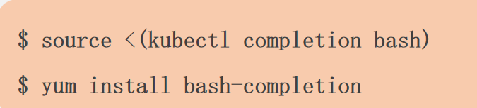

```bash
[root@k8s-master01 19]# yum -y install bash-completion
Last metadata expiration check: 3:26:45 ago on Sun Jul 13 06:40:40 2025.
Dependencies resolved.
=========================================================================================
 Package                     Architecture    Version               Repository       Size
=========================================================================================
Installing:
 bash-completion             noarch          1:2.11-5.el9          baseos          291 k
Installing dependencies:
 libpkgconf                  x86_64          1.7.3-10.el9          baseos           35 k
 pkgconf                     x86_64          1.7.3-10.el9          baseos           40 k
 pkgconf-m4                  noarch          1.7.3-10.el9          baseos           14 k
 pkgconf-pkg-config          x86_64          1.7.3-10.el9          baseos           10 k

Transaction Summary
=========================================================================================
Install  5 Packages

Total download size: 390 k
Installed size: 1.2 M
Downloading Packages:
(1/5): pkgconf-1.7.3-10.el9.x86_64.rpm                    93 kB/s |  40 kB     00:00    
(2/5): libpkgconf-1.7.3-10.el9.x86_64.rpm                 74 kB/s |  35 kB     00:00    
(3/5): bash-completion-2.11-5.el9.noarch.rpm             281 kB/s | 291 kB     00:01    
(4/5): pkgconf-m4-1.7.3-10.el9.noarch.rpm                 20 kB/s |  14 kB     00:00    
(5/5): pkgconf-pkg-config-1.7.3-10.el9.x86_64.rpm         15 kB/s |  10 kB     00:00    
-----------------------------------------------------------------------------------------
Total                                                    337 kB/s | 390 kB     00:01     
Running transaction check
Transaction check succeeded.
Running transaction test
Transaction test succeeded.
Running transaction
  Preparing        :                                                                 1/1 
  Installing       : pkgconf-m4-1.7.3-10.el9.noarch                                  1/5 
  Installing       : libpkgconf-1.7.3-10.el9.x86_64                                  2/5 
  Installing       : pkgconf-1.7.3-10.el9.x86_64                                     3/5 
  Installing       : pkgconf-pkg-config-1.7.3-10.el9.x86_64                          4/5 
  Installing       : bash-completion-1:2.11-5.el9.noarch                             5/5 
  Running scriptlet: bash-completion-1:2.11-5.el9.noarch                             5/5 
  Verifying        : bash-completion-1:2.11-5.el9.noarch                             1/5 
  Verifying        : pkgconf-1.7.3-10.el9.x86_64                                     2/5 
  Verifying        : libpkgconf-1.7.3-10.el9.x86_64                                  3/5 
  Verifying        : pkgconf-m4-1.7.3-10.el9.noarch                                  4/5 
  Verifying        : pkgconf-pkg-config-1.7.3-10.el9.x86_64                          5/5 

Installed:
  bash-completion-1:2.11-5.el9.noarch             libpkgconf-1.7.3-10.el9.x86_64         
  pkgconf-1.7.3-10.el9.x86_64                     pkgconf-m4-1.7.3-10.el9.noarch         
  pkgconf-pkg-config-1.7.3-10.el9.x86_64         

Complete!
[root@k8s-master01 19]# cd ~
[root@k8s-master01 ~]# vim .bashrc
```
在`bashrc`文件中添加

```bash
source <(kubectl completion bash)
```

然å退出终端，é‡æ–°è¿æ¥ä¸€ä¸‹

```bash
[root@k8s-master01 ~]# kubectl ge
```

按tab，å‘ç°è‡ªåŠ¨è¡¥å…¨


```bash
[root@k8s-master01 ~]# kubectl get 
```

按tab tab,会出ç°

```bash
apiservices.apiregistration.k8s.io
bgpconfigurations.crd.projectcalico.org
bgpfilters.crd.projectcalico.org
bgppeers.crd.projectcalico.org
blockaffinities.crd.projectcalico.org
caliconodestatuses.crd.projectcalico.org
certificatesigningrequests.certificates.k8s.io
clusterinformations.crd.projectcalico.org
clusterrolebindings.rbac.authorization.k8s.io
clusterroles.rbac.authorization.k8s.io
componentstatuses
configmaps
controllerrevisions.apps
cronjobs.batch
csidrivers.storage.k8s.io
csinodes.storage.k8s.io
csistoragecapacities.storage.k8s.io
customresourcedefinitions.apiextensions.k8s.io
daemonsets.apps
deployments.apps
endpoints
endpointslices.discovery.k8s.io
events
events.events.k8s.io
felixconfigurations.crd.projectcalico.org
flowschemas.flowcontrol.apiserver.k8s.io
globalnetworkpolicies.crd.projectcalico.org
globalnetworksets.crd.projectcalico.org
horizontalpodautoscalers.autoscaling
hostendpoints.crd.projectcalico.org
ingressclasses.networking.k8s.io
ingresses.networking.k8s.io
ipamblocks.crd.projectcalico.org
ipamconfigs.crd.projectcalico.org
ipamhandles.crd.projectcalico.org
ippools.crd.projectcalico.org
ipreservations.crd.projectcalico.org
jobs.batch
kubecontrollersconfigurations.crd.projectcalico.org
[root@k8s-master01 ~]# kubectl get 
apiservices.apiregistration.k8s.io
bgpconfigurations.crd.projectcalico.org
bgpfilters.crd.projectcalico.org
bgppeers.crd.projectcalico.org
blockaffinities.crd.projectcalico.org
caliconodestatuses.crd.projectcalico.org
certificatesigningrequests.certificates.k8s.io
clusterinformations.crd.projectcalico.org
clusterrolebindings.rbac.authorization.k8s.io
clusterroles.rbac.authorization.k8s.io
componentstatuses
configmaps
controllerrevisions.apps
cronjobs.batch
csidrivers.storage.k8s.io
csinodes.storage.k8s.io
csistoragecapacities.storage.k8s.io
customresourcedefinitions.apiextensions.k8s.io
daemonsets.apps
deployments.apps
endpoints
endpointslices.discovery.k8s.io
events
events.events.k8s.io
felixconfigurations.crd.projectcalico.org
flowschemas.flowcontrol.apiserver.k8s.io
globalnetworkpolicies.crd.projectcalico.org
globalnetworksets.crd.projectcalico.org
horizontalpodautoscalers.autoscaling
hostendpoints.crd.projectcalico.org
ingressclasses.networking.k8s.io
ingresses.networking.k8s.io
ipamblocks.crd.projectcalico.org
ipamconfigs.crd.projectcalico.org
ipamhandles.crd.projectcalico.org
ippools.crd.projectcalico.org
ipreservations.crd.projectcalico.org
jobs.batch
kubecontrollersconfigurations.crd.projectcalico.org
```

`q`退出


