# 存储 - 给数据一个可靠的家

## 01. 存储分类


## 02. configMap

配置信息的保存方式

### configMap - 模型


### configMap - 定义


### 多个服务之间的文件（如配置文件、静态资源、数据文件等）保持一致性的两种思想：共享和注入


- 多个不同的服务内部的文件达到一致
  - 共享
    - 每一次在读取文件的时候，都会发生网络IO
  - 注入  configmap
    - 一次注入后，多次读取不再消耗网络IO


---

在分布式系统或微服务架构中，确保多个服务之间的文件（如配置文件、静态资源、数据文件等）保持一致性是一个常见需求。以下是两种核心思想：**共享（Sharing）** 和 **注入（Injection）**，分别通过不同的机制实现文件一致性。

---

## 1. **共享（Sharing）思想**
**核心逻辑**：多个服务通过访问同一个共享存储或中间媒介来获取文件，确保所有服务读取的内容始终一致。  
**适用场景**：文件较大、更新频率低、需要多服务实时同步的场景（如配置文件、静态资源）。

### 实现方式：
#### （1）**共享存储卷（Volume）**
- **工具**：Kubernetes 的 `PersistentVolume (PV)`、`PersistentVolumeClaim (PVC)`，或云存储（如 AWS S3、NFS）。
- **原理**：将文件存储在共享卷中，多个服务挂载同一卷，直接读取同一份文件。
- **示例**：
  ```yaml
  # Kubernetes Deployment挂载共享PVC
  volumes:
    - name: shared-config
      persistentVolumeClaim:
        claimName: my-pvc  # 多个Pod共用同一个PVC
  ```

#### （2）**分布式文件系统**
- **工具**：HDFS、Ceph、GlusterFS。
- **原理**：文件在分布式系统中全局可见，服务通过统一接口访问。

#### （3）**中间件同步**
- **工具**：数据库（如 MySQL）、配置中心（如 Apollo、Nacos）。
- **原理**：将文件内容存入数据库或配置中心，服务定期拉取或监听变更。

### 优缺点：
| **优点**                     | **缺点**                     |
|------------------------------|------------------------------|
| 文件单点存储，强一致性       | 共享存储可能成为性能瓶颈     |
| 更新时只需修改一次           | 需要处理并发读写冲突         |
| 适合大文件或频繁读场景       | 依赖外部存储系统，复杂度高   |

---

## 2. **注入（Injection）思想**
**核心逻辑**：将文件内容通过某种机制主动分发到各个服务中，服务本地持有文件的副本。  
**适用场景**：文件较小、需要版本控制、或服务需离线运行的场景（如容器启动配置）。

### 实现方式：
#### （1）**配置即代码（Configuration as Code）**
- **工具**：Git 仓库 + CI/CD（如 Jenkins、GitLab CI）。
- **原理**：文件存储在代码库中，服务部署时通过流水线将文件打包到容器镜像或直接注入环境变量。
- **示例**：
  ```dockerfile
  # Dockerfile中复制配置文件
  COPY ./configs/app.conf /etc/service/app.conf
  ```

#### （2）**配置管理工具**
- **工具**：Ansible、Chef、Puppet。
- **原理**：工具将文件推送到各个服务的本地目录。

#### （3）**容器启动时注入**
- **工具**：Kubernetes 的 `ConfigMap`、`Secret`。
- **原理**：将文件内容定义为 `ConfigMap`，挂载为容器的卷或环境变量。
- **示例**：
  ```yaml
  # 将ConfigMap挂载为Pod的文件
  volumes:
    - name: config-volume
      configMap:
        name: app-config
  ```

### 优缺点：
| **优点**                     | **缺点**                     |
|------------------------------|------------------------------|
| 服务本地访问文件，性能高     | 更新需重新分发，可能延迟     |
| 无共享依赖，部署更简单       | 多副本间可能存在短暂不一致   |
| 适合敏感配置（如密钥）       | 文件版本管理需额外设计       |

---

## **对比与选型建议**
| **维度**         | **共享（Sharing）**          | **注入（Injection）**        |
|------------------|-----------------------------|-----------------------------|
| **一致性强度**   | 强一致性（实时同步）        | 最终一致性（需分发时间）     |
| **性能影响**     | 依赖共享存储性能            | 本地读取，性能高            |
| **复杂度**       | 需维护共享存储系统          | 需设计分发机制              |
| **适用场景**     | 多服务实时读写大文件        | 敏感配置或离线服务          |

### **实际组合使用案例**
- **Kubernetes 最佳实践**：
    - 用 `ConfigMap`（注入）管理配置文件，通过卷挂载到多个 Pod。
    - 用 `PV/PVC`（共享）存储日志或大数据文件。
- **混合架构**：
    - 数据库连接字符串通过 `Secret`（注入）分发，静态资源通过 CDN（共享）访问。

---

## **总结**
- **选择共享**：当需要强一致性、文件较大或多服务频繁读写时（如共享日志存储）。
- **选择注入**：当需要快速启动、隔离性高或配置敏感时（如微服务配置）。

两种思想并非互斥，实际系统中常结合使用，例如用共享存储存放大数据，同时用 ConfigMap 注入关键配置。


---


### **通俗版解释：共享 vs 注入**

想象一下，你和几个同事（代表不同的服务）需要一起完成一个项目，而项目资料（文件）需要保持一致。有两种方法可以做到：

---

### **1. 共享（Sharing）——大家一起看同一份资料**
**场景**：
- 你们所有人都在一个办公室里，资料放在办公室中央的一个共享文件夹里。
- 谁需要看资料，就直接去文件夹里拿。
- 如果有人更新了资料，其他人立刻就能看到最新版本。

**例子**：
- **云盘共享**：比如用百度网盘或Google Drive存文件，所有人访问同一个链接，文件一改大家都能看到。
- **Kubernetes共享存储**：多个服务挂载同一个磁盘（比如NFS），文件改了所有服务都能读到。

**优点**：
- 文件只有一份，不会乱（强一致性）。
- 改一次，所有人马上生效。

**缺点**：
- 如果共享文件夹挂了（比如网盘崩了），所有人都没法干活。
- 如果很多人同时改文件，可能会冲突（比如两个人同时改同一行）。

---

### **2. 注入（Injection）——每人发一份资料副本**
**场景**：
- 你们不在一个办公室，没法实时共享文件。
- 领导（系统管理员）把资料打印好，每人发一份，放各自桌上。
- 如果资料有更新，领导得重新打印，再发一遍（可能有点延迟）。

**例子**：
- **配置文件打包进软件**：比如APP的配置直接写在代码里，更新时要重新发布新版本。
- **Kubernetes ConfigMap**：把配置文件“注入”到每个服务里，改配置后要重启服务才能生效。

**优点**：
- 每人有自己的文件，不依赖别人（高可用）。
- 适合敏感信息（比如密码），因为不用共享存储。

**缺点**：
- 如果文件更新了，不能马上同步（得等领导重新发）。
- 如果每人手里的版本不一样，可能会乱（最终一致性）。

---

### **现实中的例子**
- **共享（Sharing）**
  - 公司用 **Excel 在线协作**（比如腾讯文档），所有人编辑同一份表格。
  - 风险：如果腾讯文档崩了，所有人都没法工作。

- **注入（Injection）**
  - 公司发 **PDF 文件**给每个员工，如果更新了得重新发邮件。
  - 风险：有人可能没收到最新版，还在用旧文件。

---

### **怎么选？**
| **方式** | **适合场景** | **不适用场景** |
|----------|------------|--------------|
| **共享** | 需要实时同步（如多人编辑文档） | 文件很大、共享存储不可靠 |
| **注入** | 需要独立运行（如APP配置） | 要求强一致性（不能容忍延迟） |

**实际应用**：
- **微服务配置**：用 **注入**（ConfigMap），因为每个服务要独立运行。
- **日志存储**：用 **共享**（NFS），因为日志要集中管理。

简单来说：
- **共享** = 大家一起看同一本书（实时，但依赖书不能丢）。
- **注入** = 每人发一本（独立，但更新慢）。

根据你的需求选就行！ 😊

---


### configMap - 创建

- `kubectl create configmap game-config --from-file=fire.file`
- `kubectl create configmap literal-config --from-literal=name=dave --from-literal=password=pass`

### **通俗解释：`kubectl create configmap game-config --from-file=fire.file`**

这条命令的作用是：**把本地的一个文件（`fire.file`）变成 Kubernetes 里的一个“配置包”（`ConfigMap`），名字叫 `game-config`，方便 Pod（容器）读取里面的内容。**

---

### **1. 什么是 `ConfigMap`？**
- **`ConfigMap` 是 Kubernetes 用来存配置的东西**，比如配置文件、环境变量等。
- 它不会存敏感信息（密码用 `Secret`），适合存普通配置，比如游戏参数、服务器地址等。
- Pod 可以像读文件或环境变量一样读取 `ConfigMap` 的内容。

---

### **2. `--from-file=fire.file` 是什么意思？**
- **`fire.file`**：是你电脑上的一个文件（比如内容可能是 `max_players=10`）。
- **`--from-file`**：告诉 Kubernetes “把这个文件的内容塞进 `ConfigMap` 里”。
- 文件内容会被存到 `ConfigMap` 的 `data` 字段下，键名默认是文件名（`fire.file`）。

---

### **3. 执行命令后会发生什么？**
- Kubernetes 会创建一个叫 `game-config` 的 `ConfigMap`。
- `fire.file` 的内容会被存进去，比如：
  ```yaml
  apiVersion: v1
  kind: ConfigMap
  metadata:
    name: game-config
  data:
    fire.file: |  # 键名是文件名，值是文件内容
      max_players=10
      level=hard
  ```

---

### **4. Pod 怎么用这个 `ConfigMap`？**
#### **方式1：挂载成文件（最常用）**
让 Pod 把 `ConfigMap` 的内容变成一个文件（比如 `/etc/game/config`）：
```yaml
volumes:
  - name: config-volume
    configMap:
      name: game-config  # 使用刚创建的ConfigMap
containers:
  volumeMounts:
    - name: config-volume
      mountPath: /etc/game  # Pod内会看到文件：/etc/game/fire.file
```

#### **方式2：注入环境变量**
把 `ConfigMap` 的值变成环境变量：
```yaml
env:
  - name: MAX_PLAYERS  # 环境变量名
    valueFrom:
      configMapKeyRef:
        name: game-config
        key: fire.file  # 直接引用整个文件内容
```

---

### **5. 实际例子**
假设 `fire.file` 内容：
```ini
max_players=10
level=hard
```

**创建 ConfigMap：**
```bash
kubectl create configmap game-config --from-file=fire.file
```

**查看内容：**
```bash
kubectl get configmap game-config -o yaml
```
输出：
```yaml
data:
  fire.file: |
    max_players=10
    level=hard
```

---

### **6. 其他用法**
- **多个文件**：可以一次塞多个文件进去：
  ```bash
  kubectl create configmap my-config --from-file=file1 --from-file=file2
  ```
- **目录**：直接塞整个目录的文件：
  ```bash
  kubectl create configmap dir-config --from-file=./configs/
  ```

---

### **总结**
- **这条命令的作用**：把本地文件 `fire.file` 变成 Kubernetes 的 `ConfigMap`（`game-config`）。
- **Pod 怎么用**：挂载成文件或环境变量。
- **适用场景**：存游戏的配置、服务器参数等非敏感信息。

相当于把文件“上传”到 Kubernetes，让所有 Pod 都能方便地读取！ 🚀


---


### **通俗解释：`kubectl create configmap literal-config --from-literal=name=dave --from-literal=password=pass`**

这条命令的作用是：**直接在 Kubernetes 里创建一个叫 `literal-config` 的“配置包”（`ConfigMap`），并往里面存两对键值（`name=dave` 和 `password=pass`），方便 Pod（容器）读取这些值。**

---

### **1. 什么是 `ConfigMap`？**
- **`ConfigMap` 是 Kubernetes 用来存配置的东西**，比如环境变量、配置文件内容等。
- 它**不适合存敏感信息**（比如密码），敏感信息应该用 `Secret`。
- 这里只是举例，实际密码不要用 `ConfigMap` 存！

---

### **2. `--from-literal` 是什么意思？**
- **`--from-literal`**：直接告诉 Kubernetes “我要存一个键值对”。
- **`name=dave`**：键是 `name`，值是 `dave`。
- **`password=pass`**：键是 `password`，值是 `pass`（⚠️ 实际别这么干，用 `Secret`）。

---

### **3. 执行命令后会发生什么？**
Kubernetes 会创建一个 `ConfigMap`，内容如下：
```yaml
apiVersion: v1
kind: ConfigMap
metadata:
  name: literal-config  # 你指定的名字
data:
  name: dave      # 键值对1
  password: pass  # 键值对2（⚠️ 实际别这么存密码！）
```

---

### **4. Pod 怎么用这个 `ConfigMap`？**
#### **方式1：作为环境变量（常用）**
让 Pod 读取 `ConfigMap` 的值变成环境变量：
```yaml
env:
  - name: PLAYER_NAME  # Pod内的环境变量名
    valueFrom:
      configMapKeyRef:
        name: literal-config  # ConfigMap名字
        key: name             # 读取的键（dave）
  - name: PLAYER_PASSWORD    # 另一个环境变量
    valueFrom:
      configMapKeyRef:
        name: literal-config
        key: password         # 读取的键（pass）
```

#### **方式2：挂载成文件**
把 `ConfigMap` 的键值对变成文件：
```yaml
volumes:
  - name: config-volume
    configMap:
      name: literal-config
containers:
  volumeMounts:
    - name: config-volume
      mountPath: /etc/config
```
Pod 内会看到：
```
/etc/config/name      # 内容：dave
/etc/config/password  # 内容：pass
```

---

### **5. 实际例子**
**创建 ConfigMap：**
```bash
kubectl create configmap literal-config --from-literal=name=dave --from-literal=password=pass
```

**查看内容：**
```bash
kubectl get configmap literal-config -o yaml
```
输出：
```yaml
data:
  name: dave
  password: pass
```

---

### **6. 注意事项**
1. **不要用 `ConfigMap` 存密码！**
  - 这个例子是为了演示，实际密码要用 `Secret`：
    ```bash
    kubectl create secret generic my-secret --from-literal=password=pass
    ```
2. **`--from-literal` vs `--from-file`**
  - `--from-literal`：直接写键值对（适合少量配置）。
  - `--from-file`：从文件加载（适合大配置）。

---

### **总结**
- **这条命令的作用**：直接创建一个 `ConfigMap`，并往里存 `name=dave` 和 `password=pass`。
- **Pod 怎么用**：可以变成环境变量或文件。
- **适用场景**：存普通配置（如用户名、服务器地址），**密码用 `Secret`**！

相当于往 Kubernetes 里“手写”了一个配置表，让 Pod 随便取用！ 🛠️


#### fire.file

```yaml
name=tangfire
password=123
```


```bash
[root@k8s-master01 ~]# vim fire.file
[root@k8s-master01 ~]# 
[root@k8s-master01 ~]# 
[root@k8s-master01 ~]# kubectl create configmap game-config --from-file=fire.file
configmap/game-config created
[root@k8s-master01 ~]# 
[root@k8s-master01 ~]# kubectl get cm
NAME               DATA   AGE
game-config        1      6s
kube-root-ca.crt   1      7d1h

```

```bash
[root@k8s-master01 ~]# kubectl get cm game-config -o yaml
apiVersion: v1
data:
  fire.file: |
    name=tangfire
    password=123
kind: ConfigMap
metadata:
  creationTimestamp: "2025-07-10T14:09:14Z"
  name: game-config
  namespace: default
  resourceVersion: "925246"
  uid: 4f99811f-996b-4294-89f6-b2149065b981

```


```bash
[root@k8s-master01 ~]# kubectl describe cm game-config
Name:         game-config
Namespace:    default
Labels:       <none>
Annotations:  <none>

Data
====
fire.file:
----
name=tangfire
password=123


BinaryData
====

Events:  <none>
```


```bash
[root@k8s-master01 ~]# kubectl create configmap literal-config --from-literal=name=dave --from-literal=password=pass
configmap/literal-config created
```

```bash
[root@k8s-master01 ~]# kubectl get cm
NAME               DATA   AGE
game-config        1      7m1s
kube-root-ca.crt   1      7d1h
literal-config     2      91s
[root@k8s-master01 ~]# kubectl get cm literal-config -o yaml
apiVersion: v1
data:
  name: dave
  password: pass
kind: ConfigMap
metadata:
  creationTimestamp: "2025-07-10T14:14:44Z"
  name: literal-config
  namespace: default
  resourceVersion: "925746"
  uid: 2defc3aa-84e3-4de5-9163-a076d2000436
```


### configMap - 环境变量

```yaml
apiVersion: v1
kind: ConfigMap
metadata:
  name: literal-config
  namespace: default
data:
  name: dave
  password: pass

```

```yaml
apiVersion: v1
kind: ConfigMap
metadata:
  name: env-config
  namespace: default
data:
  log_level: INFO
```


```yaml
apiVersion: v1
kind: Pod
metadata:
  name: cm-env-test-pod
spec:
  imagePullSecrets:
    - name: aliyun-regcred
  containers:
    - name: test-container
      image: crpi-cd1z0kbw072xy0ao.cn-guangzhou.personal.cr.aliyuncs.com/tangfire/myversion:v1
      command: ["/bin/sh", "-c", "env"]  # 启动后执行env命令显示所有环境变量
      env:
        - name: USERNAME  # 单个环境变量定义
          valueFrom:
            configMapKeyRef:
              name: literal-config  # 从名为literal-config的ConfigMap获取
              key: name             # 获取name键对应的值(dave)
        - name: PASSWORD  # 另一个环境变量
          valueFrom:
            configMapKeyRef:
              name: literal-config
              key: password         # 获取password键对应的值(pass)
      envFrom:
        - configMapRef:
            name: env-config  # 批量导入env-config ConfigMap的所有键值
  restartPolicy: Never  # 容器退出后不重启
```

#### ConfigMap - ENV(2.pod.yaml)


```yaml
apiVersion: v1
kind: ConfigMap
metadata:
  name: literal-config
  namespace: default
data:
  name: dave
  password: pass

---

apiVersion: v1
kind: ConfigMap
metadata:
  name: env-config
  namespace: default
data:
  log_level: INFO


---

apiVersion: v1
kind: Pod
metadata:
  name: cm-env-test-pod
spec:
  imagePullSecrets:
    - name: aliyun-secret
  containers:
    - name: test-container
      image: crpi-cd1z0kbw072xy0ao.cn-guangzhou.personal.cr.aliyuncs.com/tangfire/myversion:v1
      command: ["/bin/sh", "-c", "env"]  # 启动后执行env命令显示所有环境变量
      env:
        - name: USERNAME  # 单个环境变量定义
          valueFrom:
            configMapKeyRef:
              name: literal-config  # 从名为literal-config的ConfigMap获取
              key: name             # 获取name键对应的值(dave)
        - name: PASSWORD  # 另一个环境变量
          valueFrom:
            configMapKeyRef:
              name: literal-config
              key: password         # 获取password键对应的值(pass)
      envFrom:
        - configMapRef:
            name: env-config  # 批量导入env-config ConfigMap的所有键值
  restartPolicy: Never  # 容器退出后不重启

```


```bash
[root@k8s-master01 7]# kubectl apply -f 2.pod.yaml 
configmap/literal-config created
configmap/env-config created
pod/cm-env-test-pod created
[root@k8s-master01 7]# kubectl get pod
NAME                    READY   STATUS      RESTARTS   AGE
cm-env-test-pod         0/1     Completed   0          5s
readiness-httpget-pod   0/1     Running     0          19h
[root@k8s-master01 7]# kubectl logs cm-env-test-pod
KUBERNETES_SERVICE_PORT=443
KUBERNETES_PORT=tcp://10.0.0.1:443
HOSTNAME=cm-env-test-pod
SHLVL=1
HOME=/root
MYAPP_SERVICE_HOST=10.13.161.153
PKG_RELEASE=1
MYAPP_PORT=tcp://10.13.161.153:80
MYAPP_SERVICE_PORT=80
USERNAME=dave
KUBERNETES_PORT_443_TCP_ADDR=10.0.0.1
NGINX_VERSION=1.25.5
PATH=/usr/local/sbin:/usr/local/bin:/usr/sbin:/usr/bin:/sbin:/bin
MYAPP_PORT_80_TCP_ADDR=10.13.161.153
KUBERNETES_PORT_443_TCP_PORT=443
NJS_VERSION=0.8.4
KUBERNETES_PORT_443_TCP_PROTO=tcp
MYAPP_SERVICE_PORT_80_80=80
MYAPP_PORT_80_TCP_PORT=80
NJS_RELEASE=3
MYAPP_PORT_80_TCP_PROTO=tcp
log_level=INFO
KUBERNETES_PORT_443_TCP=tcp://10.0.0.1:443
KUBERNETES_SERVICE_PORT_HTTPS=443
KUBERNETES_SERVICE_HOST=10.0.0.1
MYAPP_PORT_80_TCP=tcp://10.13.161.153:80
PWD=/
PASSWORD=pass
```


### configMap - 启动命令


```yaml
apiVersion: v1
kind: ConfigMap
metadata:
  name: literal-config
  namespace: default
data:
  name: dave
  password: pass

```

#### 3.pod.yaml

```yaml
apiVersion: v1
kind: Pod
metadata:
  name: cm-command-pod
spec:
  imagePullSecrets:
    - name: aliyun-secret
  containers:
    - name: myapp-container
      image: crpi-cd1z0kbw072xy0ao.cn-guangzhou.personal.cr.aliyuncs.com/tangfire/myversion:v1
      command: ["/bin/sh", "-c", "echo $(USERNAME) $(PASSWORD)"]
      env:
        - name: USERNAME
          valueFrom:
            configMapKeyRef:
              name: literal-config
              key: name
        - name: PASSWORD
          valueFrom:
            configMapKeyRef:
              name: literal-config
              key: password
  restartPolicy: Never
```

```bash
[root@k8s-master01 7]# kubectl apply -f 3.pod.yaml 
pod/cm-command-pod created
[root@k8s-master01 7]# kubectl get pod
NAME                    READY   STATUS      RESTARTS   AGE
cm-command-pod          0/1     Completed   0          5s
cm-env-test-pod         0/1     Completed   0          5m1s
readiness-httpget-pod   0/1     Running     0          19h
[root@k8s-master01 7]# kubectl logs cm-command-pod
dave pass
```


### configMap - 文件


```yaml
apiVersion: v1
kind: Pod
metadata:
  name: cm-volume-pod
spec:
  imagePullSecrets:
    - name: aliyun-secret
  containers:
    - name: myapp-container
      image: crpi-cd1z0kbw072xy0ao.cn-guangzhou.personal.cr.aliyuncs.com/tangfire/myversion:v1
      volumeMounts:
        - name: config-volume
          mountPath: /etc/config
  volumes:
    - name: config-volume
      configMap:
        name: literal-config
  restartPolicy: Never
```

```bash
[root@k8s-master01 7]# kubectl apply -f 4.pod.yaml 
pod/cm-volume-pod created
[root@k8s-master01 7]# kubectl exec -it cm-volume-pod -- /bin/sh
/ # cd /etc/config
/etc/config # ls
name      password
/etc/config # cat name
dave/etc/config # cat password
pass/etc/config # ^C

/etc/config # exit
command terminated with exit code 130
[root@k8s-master01 7]# ^C
```


### configMap - 热更新 - 1

#### default.conf

```nginx
server {
    listen 80 default_server;
    server_name example.com www.example.com;
    
    location / {
        root /usr/share/nginx/html;
        index index.html index.htm;
    }
}
```

```bash
[root@k8s-master01 5]# kubectl create cm default-nginx --from-file=default.conf
configmap/default-nginx created
[root@k8s-master01 5]# kubectl get cm
NAME               DATA   AGE
default-nginx      1      18s

[root@k8s-master01 5]# kubectl create cm default-nginx --from-file=default.conf
configmap/default-nginx created
[root@k8s-master01 5]# kubectl get cm
NAME               DATA   AGE
default-nginx      1      18s
env-config         1      3h30m
game-config        1      15h
kube-root-ca.crt   1      7d16h
literal-config     2      3h30m
[root@k8s-master01 5]# ^C
[root@k8s-master01 5]# kubectl get cm default-nginx -o yaml
apiVersion: v1
data:
  default.conf: "server {\n    listen 80 default_server;\n    server_name example.com
    www.example.com;\n    \n    location / {\n        root /usr/share/nginx/html;\n
    \       index index.html index.htm;\n    }\n}\n"
kind: ConfigMap
metadata:
  creationTimestamp: "2025-07-11T05:34:46Z"
  name: default-nginx
  namespace: default
  resourceVersion: "1008811"
  uid: 7c1dfcda-8a7e-4fff-829f-c2b13f2f6c25
  
  
```


#### deployment.yaml

```yaml
apiVersion: apps/v1
kind: Deployment
metadata:
  labels:
    app: hotupdate-deploy
  name: hotupdate-deploy
spec:
  replicas: 5
  selector:
    matchLabels:
      app: hotupdate-deploy
  template:
    metadata:
      labels:
        app: hotupdate-deploy
    spec:
      containers:
      - image: nginx:1.25
        name: nginx
        volumeMounts:
        - name: config-volume
          mountPath: /etc/nginx/conf.d/
      volumes:
      - name: config-volume
        configMap:
          name: default-nginx
```


```bash
[root@k8s-master01 5]# kubectl apply -f deployment.yaml 
deployment.apps/hotupdate-deploy created
[root@k8s-master01 5]# kubectl get pod
NAME                                READY   STATUS    RESTARTS   AGE
hotupdate-deploy-685f59b5d7-8pb9r   1/1     Running   0          6s
hotupdate-deploy-685f59b5d7-j62fw   1/1     Running   0          6s
hotupdate-deploy-685f59b5d7-mcphd   1/1     Running   0          6s
hotupdate-deploy-685f59b5d7-ql5wg   1/1     Running   0          6s
hotupdate-deploy-685f59b5d7-xvg9p   1/1     Running   0          6s
[root@k8s-master01 5]# ^C
[root@k8s-master01 5]# 
[root@k8s-master01 5]# 
[root@k8s-master01 5]# kubectl exec -it hotupdate-deploy-685f59b5d7-8pb9r -- /bin/bash
root@hotupdate-deploy-685f59b5d7-8pb9r:/# 
root@hotupdate-deploy-685f59b5d7-8pb9r:/# 
root@hotupdate-deploy-685f59b5d7-8pb9r:/# cd /etc/nginx/conf.d
root@hotupdate-deploy-685f59b5d7-8pb9r:/etc/nginx/conf.d# ls
default.conf
root@hotupdate-deploy-685f59b5d7-8pb9r:/etc/nginx/conf.d# cat default.conf 
server {
    listen 80 default_server;
    server_name example.com www.example.com;
    
    location / {
        root /usr/share/nginx/html;
        index index.html index.htm;
    }
}
```
再起一个终端，执行：

```bash
[root@k8s-master01 6]# kubectl edit cm default-nginx
configmap/default-nginx edited
```

将端口从80改成8080

```bash
[root@k8s-master01 6]# kubectl get cm default-nginx -o yaml
apiVersion: v1
data:
  default.conf: "server {\n    listen 8080 default_server;\n    server_name example.com
    www.example.com;\n    \n    location / {\n        root /usr/share/nginx/html;\n
    \       index index.html index.htm;\n    }\n}\n"
kind: ConfigMap
metadata:
  creationTimestamp: "2025-07-11T05:34:46Z"
  name: default-nginx
  namespace: default
  resourceVersion: "1011934"
  uid: 7c1dfcda-8a7e-4fff-829f-c2b13f2f6c25
```

```bash
root@hotupdate-deploy-685f59b5d7-8pb9r:/etc/nginx/conf.d# cat default.conf 
server {
    listen 8080 default_server;
    server_name example.com www.example.com;
    
    location / {
        root /usr/share/nginx/html;
        index index.html index.htm;
    }
}
```

```bash
[root@k8s-master01 5]# kubectl get pod -o wide
NAME                                READY   STATUS    RESTARTS   AGE   IP              NODE         NOMINATED NODE   READINESS GATES
hotupdate-deploy-685f59b5d7-8pb9r   1/1     Running   0          38m   10.244.58.202   k8s-node02   <none>           <none>
hotupdate-deploy-685f59b5d7-j62fw   1/1     Running   0          38m   10.244.85.245   k8s-node01   <none>           <none>
hotupdate-deploy-685f59b5d7-mcphd   1/1     Running   0          38m   10.244.58.204   k8s-node02   <none>           <none>
hotupdate-deploy-685f59b5d7-ql5wg   1/1     Running   0          38m   10.244.58.201   k8s-node02   <none>           <none>
hotupdate-deploy-685f59b5d7-xvg9p   1/1     Running   0          38m   10.244.85.244   k8s-node01   <none>           <none>
[root@k8s-master01 5]# curl 10.244.58.202
<!DOCTYPE html>
<html>
<head>
<title>Welcome to nginx!</title>
<style>
html { color-scheme: light dark; }
body { width: 35em; margin: 0 auto;
font-family: Tahoma, Verdana, Arial, sans-serif; }
</style>
</head>
<body>
<h1>Welcome to nginx!</h1>
<p>If you see this page, the nginx web server is successfully installed and
working. Further configuration is required.</p>

<p>For online documentation and support please refer to
<a href="http://nginx.org/">nginx.org</a>.<br/>
Commercial support is available at
<a href="http://nginx.com/">nginx.com</a>.</p>

<p><em>Thank you for using nginx.</em></p>
</body>
</html>
[root@k8s-master01 5]# curl 10.244.58.202:8080
curl: (7) Failed to connect to 10.244.58.202 port 8080: Connection refused
```


### configMap - 热更新 - 2


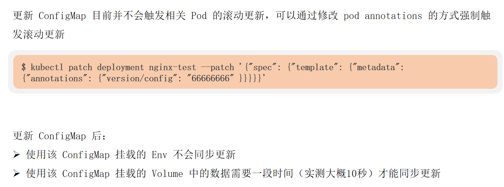


```bash
kubectl patch deployment hotupdate-deploy --patch '{"spec":{"template":{"metadata":{"annotations":{"version/config":"666666666"}}}}}'
```


```bash
[root@k8s-master01 5]# kubectl patch deployment hotupdate-deploy --patch '{"spec":{"template":{"metadata":{"annotations":{"version/config":"666666666"}}}}}'
deployment.apps/hotupdate-deploy patched

[root@k8s-master01 5]# kubectl get pod -o wide
NAME                                READY   STATUS    RESTARTS   AGE    IP              NODE         NOMINATED NODE   READINESS GATES
hotupdate-deploy-7b4b64978c-2djbf   1/1     Running   0          115s   10.244.85.247   k8s-node01   <none>           <none>
hotupdate-deploy-7b4b64978c-7d79b   1/1     Running   0          116s   10.244.85.246   k8s-node01   <none>           <none>
hotupdate-deploy-7b4b64978c-m4jhm   1/1     Running   0          114s   10.244.58.209   k8s-node02   <none>           <none>
hotupdate-deploy-7b4b64978c-t8g8m   1/1     Running   0          116s   10.244.58.203   k8s-node02   <none>           <none>
hotupdate-deploy-7b4b64978c-w52dw   1/1     Running   0          116s   10.244.58.206   k8s-node02   <none>           <none>
[root@k8s-master01 5]# curl 10.244.85.247:8080
<!DOCTYPE html>
<html>
<head>
<title>Welcome to nginx!</title>
<style>
html { color-scheme: light dark; }
body { width: 35em; margin: 0 auto;
font-family: Tahoma, Verdana, Arial, sans-serif; }
</style>
</head>
<body>
<h1>Welcome to nginx!</h1>
<p>If you see this page, the nginx web server is successfully installed and
working. Further configuration is required.</p>

<p>For online documentation and support please refer to
<a href="http://nginx.org/">nginx.org</a>.<br/>
Commercial support is available at
<a href="http://nginx.com/">nginx.com</a>.</p>

<p><em>Thank you for using nginx.</em></p>
</body>
</html>

[root@k8s-master01 5]# curl 10.244.85.247:80
curl: (7) Failed to connect to 10.244.85.247 port 80: Connection refused
```


### configMap - 不可改变


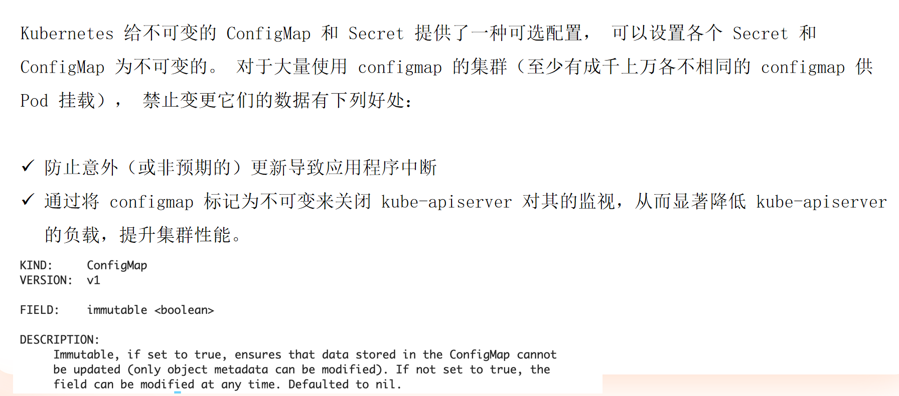

```bash
kubectl edit cm default-nginx
```

添加`immutable: true`

```yaml
# Please edit the object below. Lines beginning with a '#' will be ignored,
# and an empty file will abort the edit. If an error occurs while saving this file will be
# reopened with the relevant failures.
#
apiVersion: v1
data:
  default.conf: "server {\n    listen 8080 default_server;\n    server_name example.com
    www.example.com;\n    \n    location / {\n        root /usr/share/nginx/html;\n
    \       index index.html index.htm;\n    }\n}\n"
kind: ConfigMap
immutable: true
metadata:
  creationTimestamp: "2025-07-11T05:34:46Z"
  name: default-nginx
  namespace: default
  resourceVersion: "1011934"
  uid: 7c1dfcda-8a7e-4fff-829f-c2b13f2f6c25
```


- cm 如果修改为不可改变的状态，是不允许回退的，是不可逆的。
- 可以删除此cm，然后重新创建一个无不可改变标记的cm
- 优点：
  - 防止出现一些错误的修改
  - 减少对apiServer请求压力

  

 

## 03. Secret

编码而来的安全

### Secret - 定义


### Secret - 特性

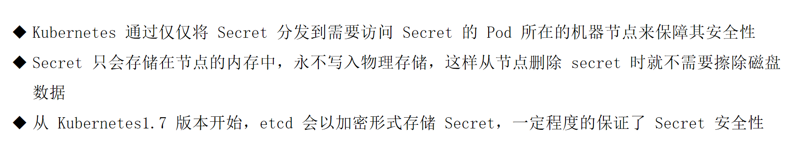


### Secret - 类型

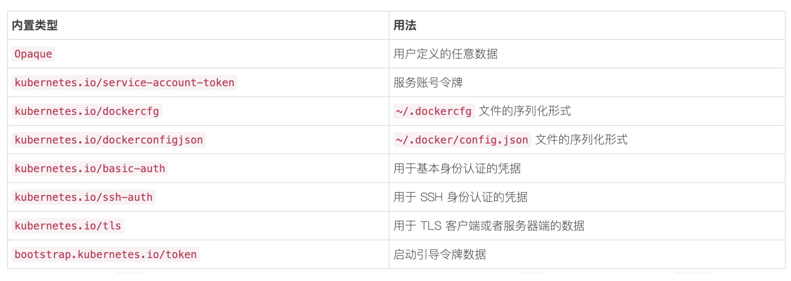


### Secret - Opaque - 概念


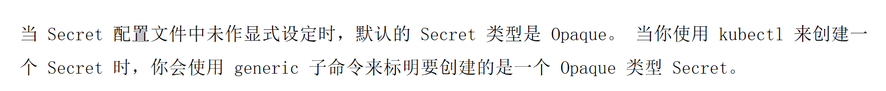

### Secret - Opaque - 创建


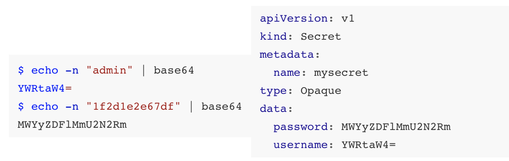

```bash
[root@k8s-master01 5]# echo -n "tangfire" | base64
dGFuZ2ZpcmU=
[root@k8s-master01 5]# echo -n "dGFuZ2ZpcmU=" | base64 -d
tangfire[root@k8s-master01 5]# 
[root@k8s-master01 5]#  echo -n "123456" | base64
MTIzNDU2
```

#### 7.secret.yaml


```yaml
apiVersion: v1
kind: Secret
metadata:
  name: mysecret
type: Opaque
data:
  password: MTIzNDU2
  username: dGFuZ2ZpcmU=
```


```bash
[root@k8s-master01 5]# vim 7.secret.yaml 
[root@k8s-master01 5]# 
[root@k8s-master01 5]# kubectl apply -f 7.secret.yaml 
secret/mysecret created
[root@k8s-master01 5]# kubectl get secret
NAME            TYPE                             DATA   AGE
aliyun-secret   kubernetes.io/dockerconfigjson   1      2d22h
mysecret        Opaque                           2      5s
[root@k8s-master01 5]# kubectl describe secret mysecret
Name:         mysecret
Namespace:    default
Labels:       <none>
Annotations:  <none>

Type:  Opaque

Data
====
password:  6 bytes
username:  8 bytes
```

```bash
[root@k8s-master01 5]# kubectl get secret mysecret -o yaml
apiVersion: v1
data:
  password: MTIzNDU2
  username: dGFuZ2ZpcmU=
kind: Secret
metadata:
  annotations:
    kubectl.kubernetes.io/last-applied-configuration: |
      {"apiVersion":"v1","data":{"password":"MTIzNDU2","username":"dGFuZ2ZpcmU="},"kind":"Secret","metadata":{"annotations":{},"name":"mysecret","namespace":"default"},"type":"Opaque"}
  creationTimestamp: "2025-07-11T11:03:44Z"
  name: mysecret
  namespace: default
  resourceVersion: "1038681"
  uid: 79c4de3e-6b3a-48ce-9121-0b4110a8c910
type: Opaque
[root@k8s-master01 5]# echo -n "MTIzNDU2" | base64 -d
123456[root@k8s-master01 5]# 
```


### Secret - Opaque - ENV

```yaml
apiVersion: apps/v1
kind: Deployment
metadata:
  labels:
    app: opaque-secret-env
  name: opaque-secret-env-deploy
spec:
  replicas: 5
  selector:
    matchLabels:
      app: op-se-env-pod
  template:
    metadata:
      labels:
        app: op-se-env-pod
    spec:
      imagePullSecrets:
        - name: aliyun-secret
      containers:
      - name: myapp-container
        image: crpi-cd1z0kbw072xy0ao.cn-guangzhou.personal.cr.aliyuncs.com/tangfire/myversion:v1
        ports:
        - containerPort: 80
        env:
        - name: TEST_USER
          valueFrom:
            secretKeyRef:
              name: mysecret
              key: username
        - name: TEST_PASSWORD
          valueFrom:
            secretKeyRef:
              name: mysecret
              key: password
```


```bash
[root@k8s-master01 5]# vim 8.deployment.yaml
[root@k8s-master01 5]# 
[root@k8s-master01 5]# 
[root@k8s-master01 5]# kubectl apply -f 8.deployment.yaml 
deployment.apps/opaque-secret-env-deploy created
```

```bash
[root@k8s-master01 5]# kubectl get pod
NAME                                        READY   STATUS    RESTARTS   AGE
opaque-secret-env-deploy-7b945c5f98-9mzzp   1/1     Running   0          43s
opaque-secret-env-deploy-7b945c5f98-f5252   1/1     Running   0          43s
opaque-secret-env-deploy-7b945c5f98-hxfcx   1/1     Running   0          43s
opaque-secret-env-deploy-7b945c5f98-qfwnj   1/1     Running   0          43s
opaque-secret-env-deploy-7b945c5f98-xrxw5   1/1     Running   0          43s
[root@k8s-master01 5]# kubectl exec -it opaque-secret-env-deploy-7b945c5f98-9mzzp -- /bin/sh 
/ # env
KUBERNETES_SERVICE_PORT=443
KUBERNETES_PORT=tcp://10.0.0.1:443
HOSTNAME=opaque-secret-env-deploy-7b945c5f98-9mzzp
SHLVL=1
HOME=/root
TEST_PASSWORD=123456
PKG_RELEASE=1
TEST_USER=tangfire
TERM=xterm
KUBERNETES_PORT_443_TCP_ADDR=10.0.0.1
NGINX_VERSION=1.25.5
PATH=/usr/local/sbin:/usr/local/bin:/usr/sbin:/usr/bin:/sbin:/bin
KUBERNETES_PORT_443_TCP_PORT=443
NJS_VERSION=0.8.4
KUBERNETES_PORT_443_TCP_PROTO=tcp
NJS_RELEASE=3
KUBERNETES_SERVICE_PORT_HTTPS=443
KUBERNETES_PORT_443_TCP=tcp://10.0.0.1:443
KUBERNETES_SERVICE_HOST=10.0.0.1
PWD=/
/ # 
```


### Secret - Opaque - Volume


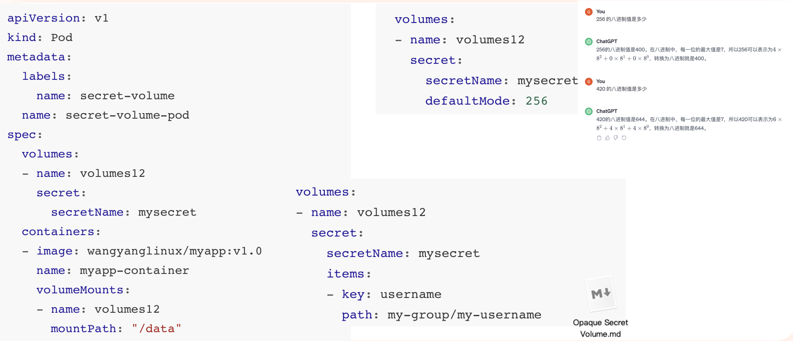

#### 9.pod.yaml

```yaml
apiVersion: v1
kind: Pod
metadata:
  labels:
    name: secret-volume
  name: secret-volume-pod
spec:
  imagePullSecrets:
    - name: aliyun-secret
  volumes:
    - name: volumes12
      secret:
        secretName: mysecret
  containers:
    - image: crpi-cd1z0kbw072xy0ao.cn-guangzhou.personal.cr.aliyuncs.com/tangfire/myversion:v1
      name: myapp-container
      volumeMounts:
        - name: volumes12
          mountPath: /data
```

```bash
[root@k8s-master01 5]# vim 9.pod.yaml
[root@k8s-master01 5]# 
[root@k8s-master01 5]# 
[root@k8s-master01 5]# kubectl apply -f 9.pod.yaml 
pod/secret-volume-pod created
[root@k8s-master01 5]# 
[root@k8s-master01 5]# kubectl get pod
NAME                READY   STATUS    RESTARTS   AGE
secret-volume-pod   1/1     Running   0          27s
[root@k8s-master01 5]# kubectl exec -it secret-volume-pod -- /bin/sh
/ # 
/ # cd /data/
/data # ls
password  username
/data # cat username
tangfire/data # cat password
123456/data # 
```


### Secret - Opaque - Volume - 热更新


### Secret - Opaque - Volume - 不可更改

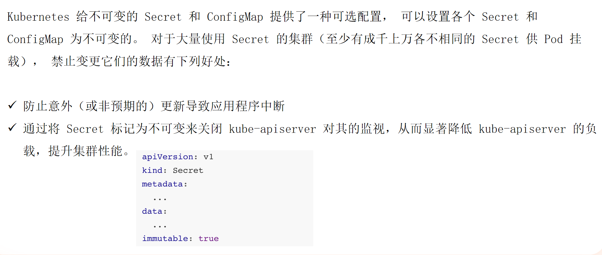


## 04. Downward API


容器在运行时从Kubernetes API服务器获取有关它们自身的信息


### Downward API - 存在的意义


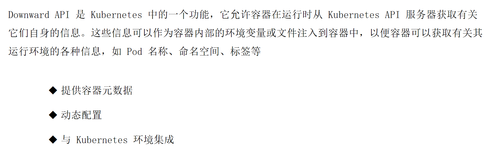


### Downward API - env案例

#### 12.pod.yaml

```yaml
apiVersion: v1
kind: Pod
metadata:
  name: downward-api-env-example
spec:
  containers:
    - name: my-container
      image: wangyanglinux/myapp:v1.0
      env:
        - name: POD_NAME
          valueFrom:
            fieldRef:
              fieldPath: metadata.name
        - name: POD_NAMESPACE
          valueFrom:
            fieldRef:
              fieldPath: metadata.namespace
        - name: POD_IP
          valueFrom:
            fieldRef:
              fieldPath: status.podIP
        - name: CPU_REQUEST
          valueFrom:
            resourceFieldRef:
              containerName: my-container
              resource: requests.cpu
        - name: CPU_LIMIT
          valueFrom:
            resourceFieldRef:
              containerName: my-container
              resource: limits.cpu
        - name: MEMORY_REQUEST
          valueFrom:
            resourceFieldRef:
              containerName: my-container
              resource: requests.memory
        - name: MEMORY_LIMIT
          valueFrom:
            resourceFieldRef:
              containerName: my-container
              resource: limits.memory
  restartPolicy: Never
```

```bash
[root@k8s-master01 5]# vim 12.pod.yaml
[root@k8s-master01 5]# 
[root@k8s-master01 5]# 
[root@k8s-master01 5]# kubectl apply -f 12.pod.yaml 
pod/downward-api-env-example created
[root@k8s-master01 5]# 
[root@k8s-master01 5]# 
[root@k8s-master01 5]# kubectl get pod
NAME                       READY   STATUS              RESTARTS   AGE
downward-api-env-example   0/1     ContainerCreating   0          6s
secret-volume-pod          1/1     Running             0          96m
[root@k8s-master01 5]# kubectl get pod
NAME                       READY   STATUS    RESTARTS   AGE
downward-api-env-example   1/1     Running   0          48s
secret-volume-pod          1/1     Running   0          96m
[root@k8s-master01 5]# kubectl exec -it downward-api-env-example -- /bin/bash
downward-api-env-example:/# 
downward-api-env-example:/# env
KUBERNETES_SERVICE_PORT_HTTPS=443
KUBERNETES_SERVICE_PORT=443
CHARSET=UTF-8
HOSTNAME=downward-api-env-example
CPU_REQUEST=0
POD_NAME=downward-api-env-example
POD_NAMESPACE=default
PWD=/
HOME=/root
LANG=C.UTF-8
KUBERNETES_PORT_443_TCP=tcp://10.0.0.1:443
TERM=xterm
SHLVL=1
KUBERNETES_PORT_443_TCP_PROTO=tcp
KUBERNETES_PORT_443_TCP_ADDR=10.0.0.1
POD_IP=10.244.58.213
CPU_LIMIT=4
MEMORY_LIMIT=3698946048
KUBERNETES_SERVICE_HOST=10.0.0.1
KUBERNETES_PORT=tcp://10.0.0.1:443
MEMORY_REQUEST=0
KUBERNETES_PORT_443_TCP_PORT=443
LC_COLLATE=C
PATH=/usr/local/sbin:/usr/local/bin:/usr/sbin:/usr/bin:/sbin:/bin
_=/usr/bin/env
downward-api-env-example:/# 
```

### Downward API - volume案例

#### 13.pod.yaml

```yaml
apiVersion: v1
kind: Pod
metadata:
  name: downward-api-volume-example
spec:
  containers:
    - name: my-container
      image: wangyanglinux/myapp:v1.0
      resources:
        limits:
          cpu: "1"
          memory: "512Mi"
        requests:
          cpu: "0.5"
          memory: "256Mi"
      volumeMounts:
        - name: downward-api-volume
          mountPath: /etc/podinfo
  volumes:
    - name: downward-api-volume
      downwardAPI:
        items:
          - path: "annotations"
            fieldRef:
              fieldPath: metadata.annotations
          - path: "labels"
            fieldRef:
              fieldPath: metadata.labels
          - path: "name"
            fieldRef:
              fieldPath: metadata.name
          - path: "namespace"
            fieldRef:
              fieldPath: metadata.namespace
          - path: "uid"
            fieldRef:
              fieldPath: metadata.uid
          - path: "cpuRequest"
            resourceFieldRef:
              containerName: my-container
              resource: requests.cpu
          - path: "memoryRequest"
            resourceFieldRef:
              containerName: my-container
              resource: requests.memory
          - path: "cpuLimit"
            resourceFieldRef:
              containerName: my-container
              resource: limits.cpu
          - path: "memoryLimit"
            resourceFieldRef:
              containerName: my-container
              resource: limits.memory
  restartPolicy: Never
```

### **通俗解释：Kubernetes Downward API 卷挂载配置**

这个 YAML 定义了一个 Pod，名为 `downward-api-volume-example`，它通过 **Downward API** 将 Pod 自身的元数据（如名称、命名空间、标签等）和资源限制（CPU、内存）以文件的形式挂载到容器内部（`/etc/podinfo`）。

---

## **1. 核心功能**
- **Downward API**：Kubernetes 提供的一种机制，允许 Pod **获取自身的运行时信息**（如 Pod 名称、IP、资源限制等）。
- **用途**：应用程序可以通过读取 `/etc/podinfo` 目录下的文件，动态获取 Pod 的元数据和资源配额，而无需硬编码或依赖外部查询。

---

## **2. 关键配置解析**
### **(1) Pod 基本信息**
```yaml
apiVersion: v1
kind: Pod
metadata:
  name: downward-api-volume-example
```
- **`apiVersion: v1`**：使用 Kubernetes 核心 API。
- **`kind: Pod`**：定义的是一个 Pod 资源。
- **`metadata.name`**：Pod 名称是 `downward-api-volume-example`。

---

### **(2) 容器配置**
```yaml
spec:
  containers:
    - name: my-container
      image: wangyanglinux/myapp:v1.0
      resources:
        limits:
          cpu: "1"
          memory: "512Mi"
        requests:
          cpu: "0.5"
          memory: "256Mi"
```
- **`image: wangyanglinux/myapp:v1.0`**：容器使用的镜像。
- **`resources`**：定义容器的资源限制和请求：
  - **`limits`**（硬限制）：
    - CPU：最多 1 核
    - 内存：最多 512MB
  - **`requests`**（最低需求）：
    - CPU：至少 0.5 核
    - 内存：至少 256MB

---

### **(3) Downward API 卷挂载**
```yaml
volumeMounts:
  - name: downward-api-volume
    mountPath: /etc/podinfo  # 挂载到容器内的路径
```
- **`volumeMounts`**：将 `downward-api-volume` 挂载到容器的 `/etc/podinfo` 目录。
- **容器内会生成以下文件**：
  - `/etc/podinfo/annotations`（Pod 的注解）
  - `/etc/podinfo/labels`（Pod 的标签）
  - `/etc/podinfo/name`（Pod 名称）
  - `/etc/podinfo/namespace`（Pod 所在的命名空间）
  - `/etc/podinfo/uid`（Pod 的唯一 ID）
  - `/etc/podinfo/cpuRequest`（CPU 请求值）
  - `/etc/podinfo/memoryRequest`（内存请求值）
  - `/etc/podinfo/cpuLimit`（CPU 限制值）
  - `/etc/podinfo/memoryLimit`（内存限制值）

---

### **(4) Downward API 卷定义**
```yaml
volumes:
  - name: downward-api-volume
    downwardAPI:
      items:
        - path: "annotations"  # 文件名
          fieldRef:
            fieldPath: metadata.annotations  # 数据来源
        - path: "labels"
          fieldRef:
            fieldPath: metadata.labels
        - path: "name"
          fieldRef:
            fieldPath: metadata.name
        - path: "namespace"
          fieldRef:
            fieldPath: metadata.namespace
        - path: "uid"
          fieldRef:
            fieldPath: metadata.uid
        - path: "cpuRequest"
          resourceFieldRef:
            containerName: my-container  # 指定容器
            resource: requests.cpu      # 获取 CPU 请求值
        - path: "memoryRequest"
          resourceFieldRef:
            containerName: my-container
            resource: requests.memory
        - path: "cpuLimit"
          resourceFieldRef:
            containerName: my-container
            resource: limits.cpu
        - path: "memoryLimit"
          resourceFieldRef:
            containerName: my-container
            resource: limits.memory
```
- **`downwardAPI`**：定义 Downward API 卷，将 Pod 信息写入文件。
- **`items`**：指定要暴露哪些信息，每个 `path` 对应一个文件名，`fieldRef` 或 `resourceFieldRef` 指定数据来源。

---

### **(5) 重启策略**
```yaml
restartPolicy: Never
```
- **`Never`**：Pod 退出后不会自动重启（适合一次性任务）。

---

## **3. 实际应用场景**
1. **日志收集**：应用程序可以读取 `/etc/podinfo/name` 获取 Pod 名称，用于日志标记。
2. **动态配置**：根据 Pod 的命名空间（`namespace`）或标签（`labels`）调整运行参数。
3. **资源监控**：通过 `cpuLimit`、`memoryLimit` 等文件，让应用知道自己的资源配额。

---

## **4. 示例：容器内查看文件**
```bash
kubectl exec downward-api-volume-example -- cat /etc/podinfo/name
# 输出：downward-api-volume-example

kubectl exec downward-api-volume-example -- cat /etc/podinfo/cpuLimit
# 输出：1
```

---

## **总结**
- **Downward API** 让 Pod 能获取自身信息，无需依赖外部查询。
- **挂载成文件** 后，应用程序可以直接读取，适用于动态配置、日志标记等场景。
- **资源限制**（CPU/内存）也能通过文件暴露，方便应用自适应调整。

这样设计的好处是 **解耦**，应用程序不需要硬编码 Pod 信息，而是动态获取，提高可移植性。 🚀

```bash
[root@k8s-master01 5]# vim 13.pod.yaml
[root@k8s-master01 5]# 
[root@k8s-master01 5]# 
[root@k8s-master01 5]# kubectl apply -f 13.pod.yaml 
pod/downward-api-volume-example created
[root@k8s-master01 5]# kubectl get pod
NAME                          READY   STATUS              RESTARTS   AGE
downward-api-env-example      1/1     Running             0          22m
downward-api-volume-example   0/1     ContainerCreating   0          3s
secret-volume-pod             1/1     Running             0          118m
[root@k8s-master01 5]# kubectl exec -it downward-api-volume-example /bin/bash
kubectl exec [POD] [COMMAND] is DEPRECATED and will be removed in a future version. Use kubectl exec [POD] -- [COMMAND] instead.
error: unable to upgrade connection: container not found ("my-container")
[root@k8s-master01 5]# kubectl exec -it downward-api-volume-example --  /bin/bash
downward-api-volume-example:/# cd /etc/podinfo/
downward-api-volume-example:/etc/podinfo# ls
annotations    cpuRequest     memoryLimit    name           uid
cpuLimit       labels         memoryRequest  namespace
downward-api-volume-example:/etc/podinfo# ls -l
total 0
lrwxrwxrwx    1 root     root            18 Jul 11 21:36 annotations -> ..data/annotations
lrwxrwxrwx    1 root     root            15 Jul 11 21:36 cpuLimit -> ..data/cpuLimit
lrwxrwxrwx    1 root     root            17 Jul 11 21:36 cpuRequest -> ..data/cpuRequest
lrwxrwxrwx    1 root     root            13 Jul 11 21:36 labels -> ..data/labels
lrwxrwxrwx    1 root     root            18 Jul 11 21:36 memoryLimit -> ..data/memoryLimit
lrwxrwxrwx    1 root     root            20 Jul 11 21:36 memoryRequest -> ..data/memoryRequest
lrwxrwxrwx    1 root     root            11 Jul 11 21:36 name -> ..data/name
lrwxrwxrwx    1 root     root            16 Jul 11 21:36 namespace -> ..data/namespace
lrwxrwxrwx    1 root     root            10 Jul 11 21:36 uid -> ..data/uid
downward-api-volume-example:/etc/podinfo# cat annotations 
cni.projectcalico.org/containerID="ab58059ec2c7afc061d7c50794cf459ef4ab2702a68f3611f3fe1eb613daa028"
cni.projectcalico.org/podIP="10.244.85.251/32"
cni.projectcalico.org/podIPs="10.244.85.251/32"
kubectl.kubernetes.io/last-applied-configuration="{\"apiVersion\":\"v1\",\"kind\":\"Pod\",\"metadata\":{\"annotations\":{},\"name\":\"downward-api-volume-example\",\"namespace\":\"default\"},\"spec\":{\"containers\":[{\"image\":\"wangyanglinux/myapp:v1.0\",\"name\":\"my-container\",\"resources\":{\"limits\":{\"cpu\":\"1\",\"memory\":\"512Mi\"},\"requests\":{\"cpu\":\"0.5\",\"memory\":\"256Mi\"}},\"volumeMounts\":[{\"mountPath\":\"/etc/podinfo\",\"name\":\"downward-api-volume\"}]}],\"restartPolicy\":\"Never\",\"volumes\":[{\"downwardAPI\":{\"items\":[{\"fieldRef\":{\"fieldPath\":\"metadata.annotations\"},\"path\":\"annotations\"},{\"fieldRef\":{\"fieldPath\":\"metadata.labels\"},\"path\":\"labels\"},{\"fieldRef\":{\"fieldPath\":\"metadata.name\"},\"path\":\"name\"},{\"fieldRef\":{\"fieldPath\":\"metadata.namespace\"},\"path\":\"namespace\"},{\"fieldRef\":{\"fieldPath\":\"metadata.uid\"},\"path\":\"uid\"},{\"path\":\"cpuRequest\",\"resourceFieldRef\":{\"containerName\":\"my-container\",\"resource\":\"requests.cpu\"}},{\"path\":\"memoryRequest\",\"resourceFieldRef\":{\"containerName\":\"my-container\",\"resource\":\"requests.memory\"}},{\"path\":\"cpuLimit\",\"resourceFieldRef\":{\"containerName\":\"my-container\",\"resource\":\"limits.cpu\"}},{\"path\":\"memoryLimit\",\"resourceFieldRef\":{\"containerName\":\"my-container\",\"resource\":\"limits.memory\"}}]},\"name\":\"downward-api-volume\"}]}}\n"
kubernetes.io/config.seen="2025-07-11T21:36:18.116842185+08:00"
kubernetes.io/config.source="api"downward-api-volume-example:/etc/podinfo# cat cpuRequest 
downward-api-volume-example:/etc/podinfo# 
downward-api-volume-example:/etc/podinfo# cat cpuRequest 
downward-api-volume-example:/etc/podinfo# cat memoryRequest 
268435456downward-api-volume-example:/etc/podinfo# cat namespace 
defaultdownward-api-volume-example:/etc/podinfo# 
```

```bash
defaultdownward-api-volume-example:/etc/podinfo# cat labels 
downward-api-volume-example:/etc/podinfo# 
```

```bash
[root@k8s-master01 6]# kubectl get pod --show-labels
NAME                          READY   STATUS    RESTARTS   AGE    LABELS
downward-api-env-example      1/1     Running   0          35m    <none>
downward-api-volume-example   1/1     Running   0          13m    <none>
secret-volume-pod             1/1     Running   0          131m   name=secret-volume
[root@k8s-master01 6]# kubectl label pod downward-api-volume-example domain=tangfire.com
pod/downward-api-volume-example labeled
```

```bash
downward-api-volume-example:/etc/podinfo# cat labels 
domain="tangfire.com"downward-api-volume-example:/etc/podinfo# 
```

所以，以卷的绑定方式可以热更新，只要你对当前pod发生的一些修改，都会被反馈到文件内部的变化


### Downward API - volume 相较于 env 优势

- 会保持热更新的特性
- 传递一个容器的资源字段到另一个容器中


### Downward API - 扩展

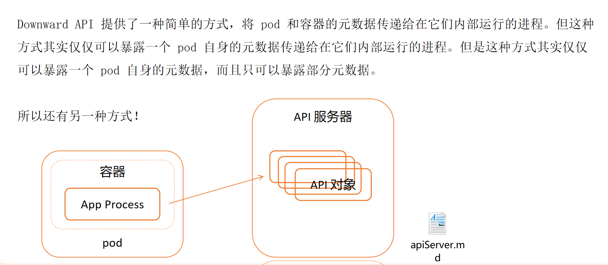


以下是完整的 Kubernetes RBAC 和 Pod 定义代码：

### 1. RBAC 权限配置 (`1.rbac.yaml`)
```yaml
apiVersion: rbac.authorization.k8s.io/v1
kind: ClusterRoleBinding
metadata:
  name: test-api-cluster-admin-binding
subjects:
- kind: ServiceAccount
  name: test-api
  namespace: default
roleRef:
  kind: ClusterRole
  name: cluster-admin
  apiGroup: rbac.authorization.k8s.io
```

### 2. Pod 定义 (`2.pod.yaml`)
```yaml
apiVersion: v1
kind: Pod
metadata:
  name: curl
spec:
  serviceAccountName: test-api
  containers:
  - name: main
    image: curlimages/curl
    command: ["sleep", "9999"]
```

### 3. 容器内执行的 API 访问命令
```bash
# 获取访问凭证
TOKEN=$(cat /var/run/secrets/kubernetes.io/serviceaccount/token)
CAPATH="/var/run/secrets/kubernetes.io/serviceaccount/ca.crt"
NS=$(cat /var/run/secrets/kubernetes.io/serviceaccount/namespace)

# 调用 Kubernetes API
curl -H "Authorization: Bearer $TOKEN" --cacert $CAPATH \
https://kubernetes/api/v1/namespaces/$NS/pods
```

### 关键说明：
1. **RBAC 配置**：
  - 创建了 `ClusterRoleBinding`，将 `cluster-admin` 角色绑定到 `default` 命名空间下的 `test-api` 服务账号
  - 授予了最高权限（生产环境应遵循最小权限原则）

2. **Pod 配置**：
  - 使用 `tutum/curl` 镜像创建名为 `curl` 的 Pod
  - 指定使用 `test-api` 服务账号
  - 容器启动后执行 `sleep 9999` 保持运行

3. **API 访问流程**：
  - 自动挂载的服务账号令牌提供认证信息
  - 使用 CA 证书验证 API Server 身份
  - 通过 Bearer Token 认证访问当前命名空间的 Pod 列表

### 使用步骤：


```bash
[root@k8s-master01 14]# vim 1.rbac.yaml
[root@k8s-master01 14]# kubectl apply -f 1.rbac.yaml 
clusterrolebinding.rbac.authorization.k8s.io/test-api-cluster-admin-binding created
[root@k8s-master01 14]# 
[root@k8s-master01 14]# 
[root@k8s-master01 14]# kubectl create sa test-api
serviceaccount/test-api created
[root@k8s-master01 14]# 
[root@k8s-master01 14]# 
[root@k8s-master01 14]# vim 2.pod.yaml
[root@k8s-master01 14]# 
[root@k8s-master01 14]# 
[root@k8s-master01 14]# kubectl apply -f 2.pod.yaml 
pod/curl created
[root@k8s-master01 14]# kubectl get pod
NAME                          READY   STATUS    RESTARTS   AGE
curl                          1/1     Running   0          46s
downward-api-env-example      1/1     Running   0          11h
downward-api-volume-example   1/1     Running   0          11h
secret-volume-pod             1/1     Running   0          13h

[root@k8s-master01 14]# kubectl exec -it curl /bin/sh
kubectl exec [POD] [COMMAND] is DEPRECATED and will be removed in a future version. Use kubectl exec [POD] -- [COMMAND] instead.
~ $ 
~ $ TOKEN=$(cat /var/run/secrets/kubernetes.io/serviceaccount/token)
~ $ CAPATH="/var/run/secrets/kubernetes.io/serviceaccount/ca.crt"
~ $ NS=$(cat /var/run/secrets/kubernetes.io/serviceaccount/namespace)
~ $ curl -H "Authorization: Bearer $TOKEN" --cacert $CAPATH \
> https://kubernetes/api/v1/namespaces/$NS/pods
```


### Downward API - Kubernetes API 文档

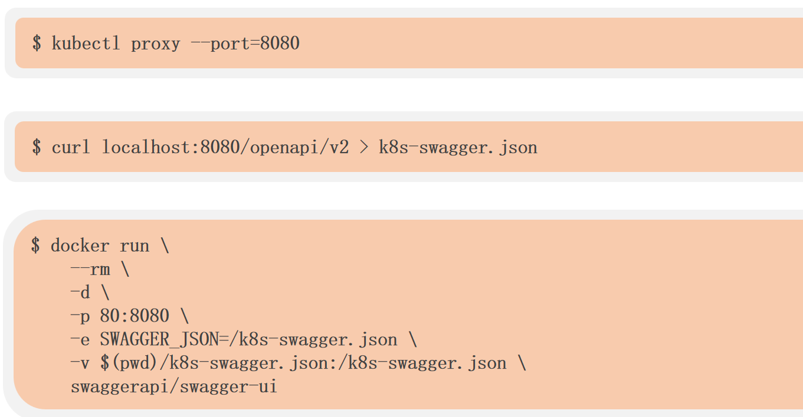

```bash
kubectl proxy --port=8080
```

再起一个终端执行：

```bash
curl localhost:8080/openapi/v2 > k8s-swagger.json
```

```bash
[root@k8s-master01 14]# ls
1.rbac.yaml  2.pod.yaml  k8s-swagger.json
```


```bash
docker run \
  --rm \
  -d \
  -p 80:8080 \
  -e SWAGGER_JSON=/k8s-swagger.json \
  -v $(pwd)/k8s-swagger.json:/k8s-swagger.json \
  swaggerapi/swagger-ui
```


```bash
[root@k8s-master01 14]# docker run \
  --rm \
  -d \
  -p 80:8080 \
  -e SWAGGER_JSON=/k8s-swagger.json \
  -v $(pwd)/k8s-swagger.json:/k8s-swagger.json \
  swaggerapi/swagger-ui
Unable to find image 'swaggerapi/swagger-ui:latest' locally
latest: Pulling from swaggerapi/swagger-ui
fe07684b16b8: Already exists 
3b7062d09e02: Already exists 
fb746e72516f: Already exists 
a9ff9baf1741: Already exists 
2c127093dfc7: Already exists 
63dda2adf85b: Already exists 
b55ed7d7b2de: Already exists 
92971aeb101e: Already exists 
f8757389f534: Pull complete 
9bace28d4d83: Pull complete 
6ca57faa02b3: Pull complete 
857dfce664dd: Pull complete 
6d4a4ac230eb: Pull complete 
d940957079a7: Pull complete 
Digest: sha256:13e9885605519c4ecbe06854e212b10fce703e3c233771de5e58571e459eb9a8
Status: Downloaded newer image for swaggerapi/swagger-ui:latest
6a2654e5a847a0a79aa959e33d994996c8855c4163c178f185702a7b06905d32
```

然后访问：

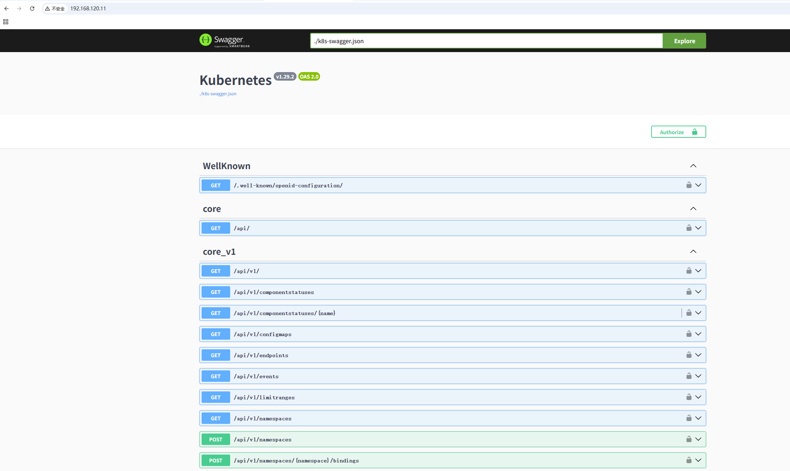


## 05. volume

数据的持久化方案


### Volume - 存在的意义


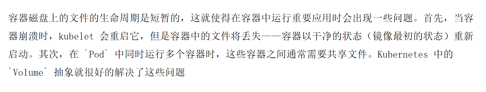


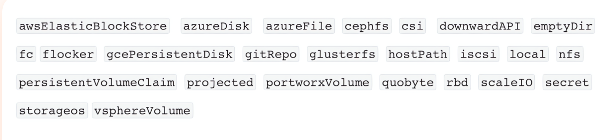


以下是针对图片中列出的 Kubernetes 持久化存储卷（Persistent Volume）类型的分类和解释：

---

### **一、云服务商存储卷**
| 类型 | 说明 | 典型使用场景 |
|------|------|-------------|
| **awsElasticBlockStore** | AWS EBS 块存储卷 | 需要持久化数据的 AWS EC2 实例 |
| **azureDisk** | Azure 托管磁盘 | Azure 虚拟机上的持久化存储 |
| **azureFile** | Azure 文件存储（SMB） | 多 Pod 共享存储（如 WordPress 媒体文件） |
| **gcePersistentDisk** | Google Cloud 持久化磁盘 | GCP 上的持久化数据存储 |

---

### **二、网络存储卷**
| 类型 | 说明 | 特点 |
|------|------|------|
| **nfs** | 网络文件系统 | 多节点共享读写，适合静态内容 |
| **cephfs** | Ceph 分布式文件系统 | 高性能分布式存储 |
| **glusterfs** | GlusterFS 集群文件系统 | 大规模可扩展存储 |
| **iscsi** | iSCSI 块存储 | 需要裸设备映射的场景 |
| **rbd** | Ceph 块设备 | 高性能块存储（如数据库） |

---

### **三、本地存储卷**
| 类型 | 说明 | 注意事项 |
|------|------|----------|
| **hostPath** | 挂载宿主机目录 | 仅开发测试用（不安全） |
| **local** | 本地持久化卷 | 需要结合节点亲和性调度 |
| **emptyDir** | 临时空目录 | Pod 删除后数据销毁 |

---

### **四、特殊用途存储卷**
| 类型 | 说明 | 典型用例 |
|------|------|---------|
| **secret** | 挂载敏感信息（如密码） | 数据库凭证 |
| **downwardAPI** | 将 Pod 元数据挂载为文件 | 获取 Pod 名称/IP 等 |
| **gitRepo** | 克隆 Git 仓库到卷 | 配置文件动态更新 |
| **projected** | 合并多个存储源（如 secret+downwardAPI） | 复杂配置管理 |

---

### **五、企业级存储方案**
| 类型 | 说明 | 适用场景 |
|------|------|---------|
| **portworxVolume** | Portworx 容器原生存储 | 有状态容器编排 |
| **storageos** | StorageOS 软件定义存储 | 低延迟持久化存储 |
| **vsphereVolume** | VMware vSphere 存储 | 企业虚拟化环境 |
| **scaleIO** | EMC ScaleIO 存储 | 超融合基础架构 |

---

### **六、已弃用/过时类型**
| 类型 | 替代方案 | 弃用原因 |
|------|---------|---------|
| **flocker** | 使用 CSI 驱动 | 项目已停止维护 |
| **quobyte** | 改用 CSI 驱动 | 社区支持有限 |
| **fc** (Fibre Channel) | 使用 CSI 驱动 | 配置复杂 |

---

### **选择建议**
1. **云环境**：优先使用云厂商原生存储（如 AWS EBS）
2. **共享存储**：选择 `nfs` 或 `cephfs`
3. **敏感数据**：使用 `secret` 或 `configMap`
4. **未来兼容性**：优先选择 **CSI**（Container Storage Interface）驱动

> 注：生产环境推荐通过 **StorageClass** 动态分配存储，而非直接使用 PV。


### MFS


### **什么是 MFS？**
**MFS（Moose File System）** 是一个开源的分布式文件系统，专为大规模数据存储和高可用性设计。它类似于 **HDFS（Hadoop DFS）** 或 **CephFS**，但更注重易用性和 POSIX 兼容性（即可以像普通文件系统一样使用）。

---

## **1. MFS 的核心特点**
| 特性 | 说明 |
|------|------|
| **分布式存储** | 数据分散在多个服务器上，提高可靠性和性能 |
| **高可用性** | 支持主备元数据服务器（Master Server），避免单点故障 |
| **POSIX 兼容** | 像本地文件系统一样使用（支持 `ls`、`cp`、`mv` 等命令） |
| **动态扩展** | 可在线添加存储节点（Chunk Server），无需停机 |
| **数据冗余** | 支持副本机制（类似 RAID），防止数据丢失 |
| **快照功能** | 可创建文件系统快照，用于备份或恢复 |

---

## **2. MFS 的架构**
MFS 采用 **主从架构**，主要包含以下组件：
### **(1) 管理服务器（Master Server）**
- **作用**：存储文件的元数据（如文件名、目录结构、权限等）。
- **高可用**：可配置 **Metalogger**（元数据备份服务器）和 **Shadow Master**（影子主服务器）实现故障转移。

### **(2) 数据存储节点（Chunk Server）**
- **作用**：实际存储文件数据（分成多个 **Chunk**，默认 64MB/块）。
- **扩展性**：可动态添加节点，存储容量随节点增加而增长。

### **(3) 客户端（Client）**
- **作用**：通过 **FUSE**（用户态文件系统）挂载 MFS，像本地磁盘一样访问。
- **协议支持**：支持 NFS、SMB、FTP 等。


---

## **3. MFS 的典型应用场景**
1. **大数据存储**
  - 替代 HDFS，用于 Hadoop/Spark 等分布式计算框架。
2. **媒体文件托管**
  - 存储图片、视频等大文件（如 CDN 后端）。
3. **虚拟化存储**
  - 为 KVM/VMware 提供共享存储。
4. **备份与容灾**
  - 利用快照功能实现数据保护。

---

## **4. MFS vs 其他分布式文件系统**
| 文件系统 | 特点 | 适用场景 |
|----------|------|----------|
| **MFS** | POSIX 兼容，易部署 | 通用存储、媒体库 |
| **HDFS** | 适合批处理，不支持随机写 | Hadoop 生态 |
| **CephFS** | 高扩展性，但配置复杂 | 云原生存储 |
| **GlusterFS** | 无元数据服务器，性能较低 | 共享文件存储 |

---

## **5. 快速体验 MFS**
### **步骤 1：安装 Master Server**
```bash
wget -O /etc/yum.repos.d/MooseFS.repo https://ppa.moosefs.com/src/moosefs-3-el7.repo
yum install moosefs-master moosefs-metalogger moosefs-chunkserver
systemctl start moosefs-master
```

### **步骤 2：挂载 MFS 客户端**
```bash
yum install moosefs-client
mkdir /mnt/mfs
mfsmount /mnt/mfs -H mfsmaster
```

### **步骤 3：验证**
```bash
df -h | grep mfs  # 查看挂载情况
echo "Hello MFS" > /mnt/mfs/test.txt  # 测试写入
```

---

## **6. 注意事项**
- **性能瓶颈**：Master Server 是单点，超大规模集群建议用 Ceph。
- **安全性**：默认未加密，生产环境需配置 SSL/TLS。
- **社区支持**：MFS 开源版更新较慢，企业需求可考虑商业版（MooseFS Pro）。


### Volume - emptyDir - 概念


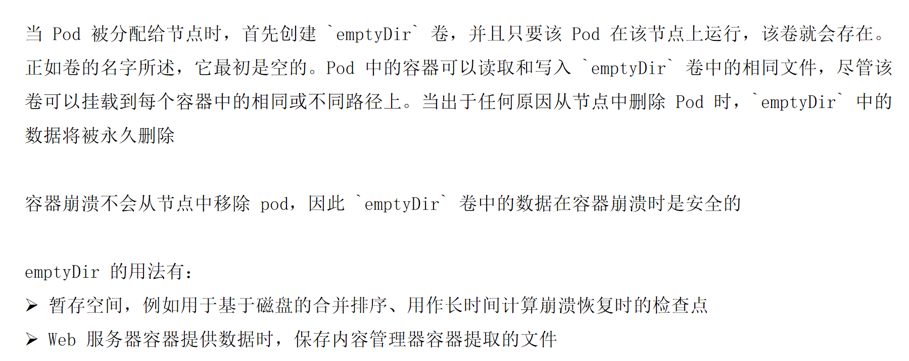


### Volume - emptyDir - 创建使用

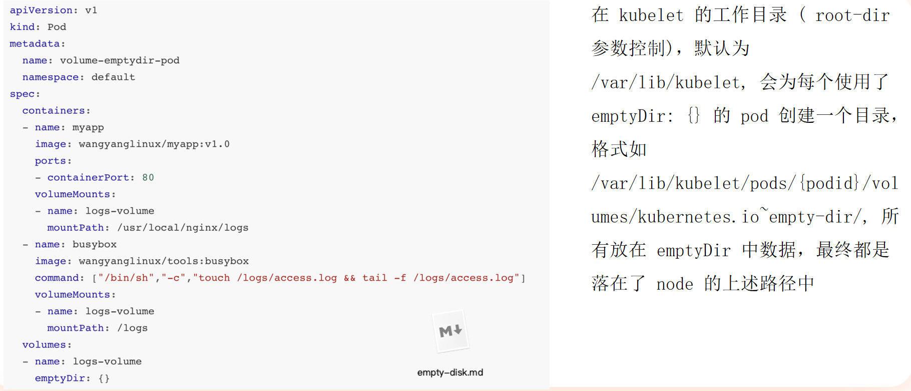


#### 15.pod.yaml


```yaml
apiVersion: v1
kind: Pod
metadata:
  name: volume-emptydir-pod
  namespace: default
spec:
  containers:
    - name: myapp
      image: nginx:alpine  
      ports:
        - containerPort: 80
      volumeMounts:
        - name: logs-volume
          mountPath: /var/log/nginx  # 标准Nginx日志路径
    - name: busybox
      image: busybox:latest  
      command: ["/bin/sh","-c","touch /logs/access.log && tail -f /logs/access.log"]
      volumeMounts:
        - name: logs-volume
          mountPath: /logs
  volumes:
    - name: logs-volume
      emptyDir: {}
```

这是一个使用 `emptyDir` 卷实现容器间共享日志的 Kubernetes Pod 配置，我来为您详细解释：

### 配置解析：
```yaml
apiVersion: v1
kind: Pod
metadata:
  name: volume-emptydir-pod  # Pod名称
  namespace: default         # 部署在default命名空间
spec:
  containers:
  - name: myapp             # 第一个容器：Nginx服务
    image: nginx:alpine     # 使用官方Nginx镜像
    ports:
    - containerPort: 80     # 暴露80端口
    volumeMounts:
    - name: logs-volume     # 挂载存储卷
      mountPath: /var/log/nginx  # Nginx默认日志目录
      
  - name: busybox           # 第二个容器：日志监控
    image: busybox:latest    # 使用官方BusyBox镜像
    command: ["/bin/sh","-c","touch /logs/access.log && tail -f /logs/access.log"] 
    volumeMounts:
    - name: logs-volume     # 挂载同一个存储卷
      mountPath: /logs      # 挂载到不同路径

  volumes:
  - name: logs-volume       # 定义存储卷
    emptyDir: {}            # 临时空目录卷
```

### 核心机制：
1. **emptyDir 卷**：
  - 生命周期与Pod绑定（Pod删除后数据消失）
  - 两个容器通过挂载同一个卷实现文件共享
  - 适合临时数据交换场景

2. **日志流工作原理**：
  - Nginx容器将日志写入 `/var/log/nginx/access.log`
  - 由于挂载了同一个卷，实际写入的是 `emptyDir` 的存储空间
  - BusyBox容器从 `/logs/access.log` 读取相同文件
  - `tail -f` 命令实现日志实时监控

3. **路径差异处理**：
  - 虽然挂载点不同（`/var/log/nginx` 和 `/logs`）
  - 但指向的是同一个物理存储位置

### 典型使用场景：
- 开发调试时实时查看容器日志
- 临时性的容器间数据交换
- 不需要持久化的中间数据处理

### 注意事项：
1. 生产环境如需持久化存储，应改用 `persistentVolumeClaim`
2. `emptyDir` 默认使用节点存储介质（可能影响IO性能）
3. 可以通过 `emptyDir.medium: Memory` 指定使用内存（临时性更高）

您可以通过以下命令验证日志共享：
```bash
kubectl exec volume-emptydir-pod -c myapp -- ls /var/log/nginx
kubectl exec volume-emptydir-pod -c busybox -- ls /logs
```

这个方案比通过 `kubectl logs` 命令查看日志的优势在于可以实时监控日志变化，适合调试场景。


```bash
[root@k8s-master01 7]# vim 15.pod.yaml
[root@k8s-master01 7]# kubectl apply -f 15.pod.yaml 
pod/volume-emptydir-pod created
[root@k8s-master01 7]# 
[root@k8s-master01 7]# kubectl get pod
NAME                          READY   STATUS    RESTARTS   AGE
curl                          1/1     Running   0          100m
downward-api-env-example      1/1     Running   0          13h
downward-api-volume-example   1/1     Running   0          13h
secret-volume-pod             1/1     Running   0          15h
volume-emptydir-pod           2/2     Running   0          60s
```

```bash
[root@k8s-master01 7]# kubectl get pod -o wide
NAME                          READY   STATUS    RESTARTS   AGE     IP              NODE         NOMINATED NODE   READINESS GATES
curl                          1/1     Running   0          108m    10.244.58.216   k8s-node02   <none>           <none>
downward-api-env-example      1/1     Running   0          13h     10.244.58.213   k8s-node02   <none>           <none>
downward-api-volume-example   1/1     Running   0          13h     10.244.85.251   k8s-node01   <none>           <none>
secret-volume-pod             1/1     Running   0          15h     10.244.58.212   k8s-node02   <none>           <none>
volume-emptydir-pod           2/2     Running   0          8m31s   10.244.58.214   k8s-node02   <none>           <none>
[root@k8s-master01 7]# while true;
> do
> curl 10.244.58.214
> done
```


再起一个终端：

```bash
[root@k8s-master01 14]# kubectl get pod
NAME                          READY   STATUS    RESTARTS   AGE
curl                          1/1     Running   0          104m
downward-api-env-example      1/1     Running   0          13h
downward-api-volume-example   1/1     Running   0          13h
secret-volume-pod             1/1     Running   0          15h
volume-emptydir-pod           2/2     Running   0          4m54s
[root@k8s-master01 14]# kubectl logs volume-emptydir-pod -c busybox
192.168.120.11 - - [12/Jul/2025:02:45:53 +0000] "GET / HTTP/1.1" 200 615 "-" "curl/7.76.1" "-"
192.168.120.11 - - [12/Jul/2025:02:45:55 +0000] "GET / HTTP/1.1" 200 615 "-" "curl/7.76.1" "-"
192.168.120.11 - - [12/Jul/2025:02:45:56 +0000] "GET / HTTP/1.1" 200 615 "-" "curl/7.76.1" "-"
192.168.120.11 - - [12/Jul/2025:02:45:57 +0000] "GET / HTTP/1.1" 200 615 "-" "curl/7.76.1" "-"
192.168.120.11 - - [12/Jul/2025:02:45:58 +0000] "GET / HTTP/1.1" 200 615 "-" "curl/7.76.1" "-"
192.168.120.11 - - [12/Jul/2025:02:45:59 +0000] "GET / HTTP/1.1" 200 615 "-" "curl/7.76.1" "-"
192.168.120.11 - - [12/Jul/2025:02:46:00 +0000] "GET / HTTP/1.1" 200 615 "-" "curl/7.76.1" "-"
192.168.120.11 - - [12/Jul/2025:02:46:01 +0000] "GET / HTTP/1.1" 200 615 "-" "curl/7.76.1" "-"
192.168.120.11 - - [12/Jul/2025:02:46:02 +0000] "GET / HTTP/1.1" 200 615 "-" "curl/7.76.1" "-"
192.168.120.11 - - [12/Jul/2025:02:46:03 +0000] "GET / HTTP/1.1" 200 615 "-" "curl/7.76.1" "-"
192.168.120.11 - - [12/Jul/2025:02:46:04 +0000] "GET / HTTP/1.1" 200 615 "-" "curl/7.76.1" "-"
192.168.120.11 - - [12/Jul/2025:02:46:05 +0000] "GET / HTTP/1.1" 200 615 "-" "curl/7.76.1" "-"
192.168.120.11 - - [12/Jul/2025:02:46:06 +0000] "GET / HTTP/1.1" 200 615 "-" "curl/7.76.1" "-"
192.168.120.11 - - [12/Jul/2025:02:46:07 +0000] "GET / HTTP/1.1" 200 615 "-" "curl/7.76.1" "-"
192.168.120.11 - - [12/Jul/2025:02:46:08 +0000] "GET / HTTP/1.1" 200 615 "-" "curl/7.76.1" "-"
192.168.120.11 - - [12/Jul/2025:02:46:09 +0000] "GET / HTTP/1.1" 200 615 "-" "curl/7.76.1" "-"
192.168.120.11 - - [12/Jul/2025:02:46:10 +0000] "GET / HTTP/1.1" 200 615 "-" "curl/7.76.1" "-"
192.168.120.11 - - [12/Jul/2025:02:46:11 +0000] "GET / HTTP/1.1" 200 615 "-" "curl/7.76.1" "-"
```

```bash
[root@k8s-master01 14]# kubectl exec -it volume-emptydir-pod -c myapp /bin/sh
kubectl exec [POD] [COMMAND] is DEPRECATED and will be removed in a future version. Use kubectl exec [POD] -- [COMMAND] instead.
/ # cd /var
/var # cd log
/var/log # ls
nginx
/var/log # cd nginx
/var/log/nginx # ls
access.log  error.log
/var/log/nginx # 
```


### 查看pod的uid

```bash
[root@k8s-master01 7]# kubectl get pod -o wide
NAME                          READY   STATUS    RESTARTS   AGE    IP              NODE         NOMINATED NODE   READINESS GATES
volume-emptydir-pod           2/2     Running   0          39m    10.244.58.214   k8s-node02   <none>           <none>
[root@k8s-master01 7]# 
[root@k8s-master01 7]# 
[root@k8s-master01 7]# 
[root@k8s-master01 7]# kubectl get pod volume-emptydir-pod -o yaml | grep uid
  uid: 5628286e-2fba-4fa1-9101-37d0e515d779
```
然后到node02节点

执行：

```bash
[root@k8s-node02 docker]# cd /var/lib/kubelet/pods
[root@k8s-node02 pods]# ls
2e02ae83-5e9e-4f13-bd50-31eda9ba034b  d435644c-9464-4878-87b6-5de57384822b
5628286e-2fba-4fa1-9101-37d0e515d779  d8f842b0-a567-4572-95cd-e2d8dd0ca939
71845854-3a1a-4e5e-8ea3-be4821ecb7e2  e5656dc1-a051-46a1-ad96-402228f761d9
[root@k8s-node02 pods]# cd 5628286e-2fba-4fa1-9101-37d0e515d779
[root@k8s-node02 5628286e-2fba-4fa1-9101-37d0e515d779]# ls
containers  etc-hosts  plugins  volumes
[root@k8s-node02 5628286e-2fba-4fa1-9101-37d0e515d779]# yum -y install tree
Last metadata expiration check: 0:37:10 ago on Sat Jul 12 12:39:55 2025.
Dependencies resolved.
=========================================================================================
 Package          Architecture       Version                    Repository          Size
=========================================================================================
Installing:
 tree             x86_64             1.8.0-10.el9               baseos              55 k

Transaction Summary
=========================================================================================
Install  1 Package

Total download size: 55 k
Installed size: 113 k
Downloading Packages:
tree-1.8.0-10.el9.x86_64.rpm                             107 kB/s |  55 kB     00:00    
-----------------------------------------------------------------------------------------
Total                                                    106 kB/s |  55 kB     00:00     
Running transaction check
Transaction check succeeded.
Running transaction test
Transaction test succeeded.
Running transaction
  Preparing        :                                                                 1/1 
  Installing       : tree-1.8.0-10.el9.x86_64                                        1/1 
  Running scriptlet: tree-1.8.0-10.el9.x86_64                                        1/1 
  Verifying        : tree-1.8.0-10.el9.x86_64                                        1/1 

Installed:
  tree-1.8.0-10.el9.x86_64                                                               

Complete!
[root@k8s-node02 5628286e-2fba-4fa1-9101-37d0e515d779]# tree .
.
├── containers
│   ├── busybox
│   │   └── bee3a6d5
│   └── myapp
│       └── bb4a9bcd
├── etc-hosts
├── plugins
│   └── kubernetes.io~empty-dir
│       ├── logs-volume
│       │   └── ready
│       └── wrapped_kube-api-access-jkzlt
│           └── ready
└── volumes
    ├── kubernetes.io~empty-dir
    │   └── logs-volume
    │       ├── access.log
    │       └── error.log
    └── kubernetes.io~projected
        └── kube-api-access-jkzlt
            ├── ca.crt -> ..data/ca.crt
            ├── namespace -> ..data/namespace
            └── token -> ..data/token

12 directories, 10 files
[root@k8s-node02 5628286e-2fba-4fa1-9101-37d0e515d779]# cd volumes/
[root@k8s-node02 volumes]# cd kubernetes.io~empty-dir/
[root@k8s-node02 kubernetes.io~empty-dir]# cd logs-volume/
[root@k8s-node02 logs-volume]# ls
access.log  error.log
[root@k8s-node02 logs-volume]# echo "tangfire216" >> access.log 
```


```bash
[root@k8s-node02 logs-volume]# kubectl logs volume-emptydir-pod -c busybox 
192.168.120.11 - - [12/Jul/2025:02:49:45 +0000] "GET / HTTP/1.1" 200 615 "-" "curl/7.76.1" "-"
192.168.120.11 - - [12/Jul/2025:02:49:45 +0000] "GET / HTTP/1.1" 200 615 "-" "curl/7.76.1" "-"
192.168.120.11 - - [12/Jul/2025:02:49:45 +0000] "GET / HTTP/1.1" 200 615 "-" "curl/7.76.1" "-"
tangfire216
```


### Volume - emptyDir - 共享内存

#### 16.pod.yaml

```yaml
apiVersion: v1
kind: Pod
metadata:
  name: volume-emptydir-mem
  namespace: default
spec:
  containers:
    - name: myapp
      image: nginx:1.25
      ports:
        - containerPort: 80
      resources:
        limits:
          cpu: "1"
          memory: "1024Mi"
        requests:
          cpu: "1"
          memory: "1024Mi"
      volumeMounts:
        - name: mem-volume
          mountPath: /data
  volumes:
    - name: mem-volume
      emptyDir:
        medium: Memory
        sizeLimit: 500Mi
```


### **Kubernetes Pod 配置解析**
这个 YAML 文件定义了一个使用 **内存临时卷（emptyDir）** 的 Pod，以下是逐部分解释：

---

#### **1. 基础信息**
```yaml
apiVersion: v1
kind: Pod
metadata:
  name: volume-emptydir-mem  # Pod名称
  namespace: default          # 部署在default命名空间
```
- **作用**：定义一个名为 `volume-emptydir-mem` 的 Pod，位于默认命名空间。

---

#### **2. 容器配置**
```yaml
spec:
  containers:
    - name: myapp                     # 容器名称
      image: wangyanglinux/myapp:v1.0 # 使用私有镜像
      ports:
        - containerPort: 80           # 暴露80端口
```
- **功能**：容器运行 `myapp` 服务，监听 80 端口。

---

#### **3. 资源限制**
```yaml
resources:
  limits:
    cpu: "1"         # 最多使用1核CPU
    memory: "1024Mi" # 最多使用1GB内存
  requests:
    cpu: "1"         # 至少需要1核CPU
    memory: "1024Mi" # 至少需要1GB内存
```
- **关键点**：
  - `limits` 是硬性限制（超过会被终止）
  - `requests` 是调度依据（K8s 根据此值分配资源）
  - 这里设置为相同值，表示要求独占资源。

---

#### **4. 内存临时卷（emptyDir）**
```yaml
volumeMounts:
  - name: mem-volume
    mountPath: /data  # 挂载到容器内的/data路径

volumes:
  - name: mem-volume
    emptyDir:
      medium: Memory   # 使用内存而非磁盘
      sizeLimit: 500Mi # 限制卷大小为500MB
```
- **核心特性**：
  - **内存存储**：数据存储在内存中，读写速度极快，但 **Pod 重启后数据丢失**。
  - **容量限制**：卷大小不超过 500MB（超过会触发 eviction）。
  - **共享性**：可被同一 Pod 内的多个容器挂载（本例中仅 `myapp` 容器使用）。

---

### **典型应用场景**
1. **临时缓存**
  - 例如缓存计算结果，加速后续处理。
2. **敏感数据处理**
  - 内存数据不会落盘，适合处理密码等敏感信息。
3. **高性能读写**
  - 避免磁盘 IO 瓶颈（如实时数据分析）。

---

### **注意事项**
1. **数据易失性**
  - Pod 崩溃或重启会导致数据丢失，**不可用于持久化存储**。
2. **资源监控**
  - 内存卷会计入容器的内存使用量，需确保 `sizeLimit` ≤ 容器内存限制。
3. **生产建议**
  - 替换私有镜像 `wangyanglinux/myapp:v1.0` 为公共镜像（如 `nginx:alpine`）。
  - 如需持久化，改用 `persistentVolumeClaim`。

---

### **操作验证**
```bash
# 1. 创建Pod
kubectl apply -f pod.yaml

# 2. 进入容器查看挂载点
kubectl exec volume-emptydir-mem -- ls /data

# 3. 监控资源使用
kubectl top pod volume-emptydir-mem
```


### Volume - hostPath - 概念


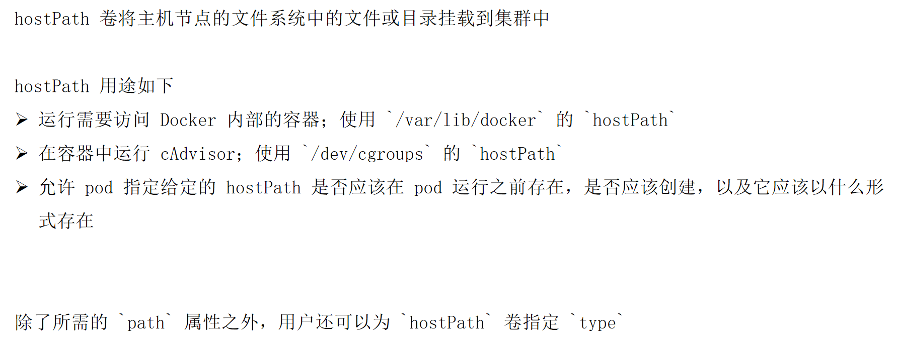

### Volume - hostPath - 类型

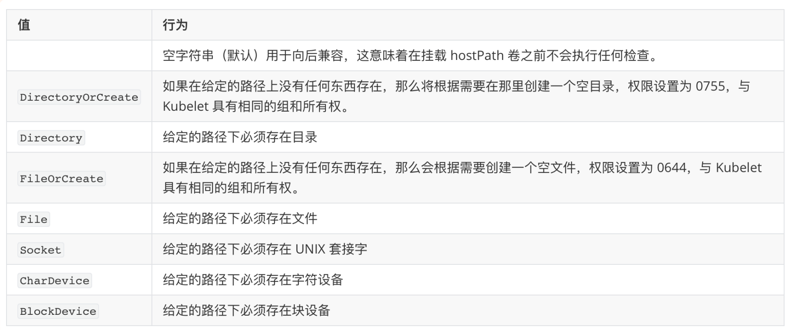


### Volume - hostPath - 注意

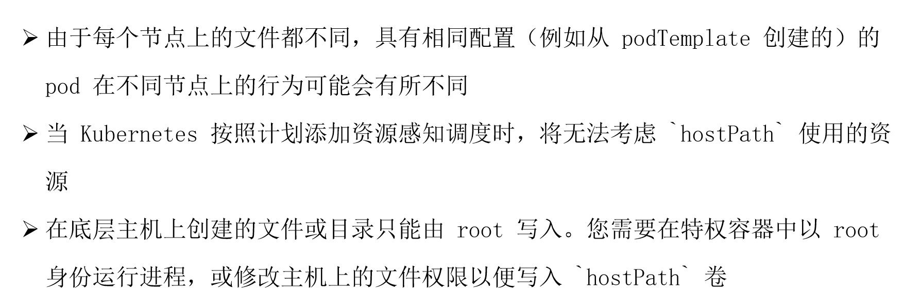


### Volume - hostPath 实验


#### 17.pod.yaml

```bash
apiVersion: v1
kind: Pod
metadata:
  name: hostpath-pod
spec:
  containers:
    - name: myapp
      image: nginx:1.25
      volumeMounts:
        - name: test-volume
          mountPath: /test-pd
  volumes:
    - name: test-volume
      hostPath:
        path: /test
        type: Directory
```


```bash
[root@k8s-master01 7]# kubectl get pod
NAME                          READY   STATUS              RESTARTS       AGE
curl                          1/1     Running             1 (160m ago)   5h27m
downward-api-env-example      1/1     Running             0              17h
downward-api-volume-example   1/1     Running             0              16h
hostpath-pod                  0/1     ContainerCreating   0              19m
secret-volume-pod             1/1     Running             0              18h
volume-emptydir-mem           1/1     Running             0              50m
volume-emptydir-pod           2/2     Running             0              3h47m
[root@k8s-master01 7]# kubectl describe pod hostpath-pod
Name:             hostpath-pod
Namespace:        default
Priority:         0
Service Account:  default
Node:             k8s-node02/192.168.120.13
Start Time:       Sat, 12 Jul 2025 14:06:49 +0800
Labels:           <none>
Annotations:      <none>
Status:           Pending
IP:               
IPs:              <none>
Containers:
  myapp:
    Container ID:   
    Image:          linux:1.25
    Image ID:       
    Port:           <none>
    Host Port:      <none>
    State:          Waiting
      Reason:       ContainerCreating
    Ready:          False
    Restart Count:  0
    Environment:    <none>
    Mounts:
      /test-pd from test-volume (rw)
      /var/run/secrets/kubernetes.io/serviceaccount from kube-api-access-v7g4h (ro)
Conditions:
  Type                        Status
  PodReadyToStartContainers   False 
  Initialized                 True 
  Ready                       False 
  ContainersReady             False 
  PodScheduled                True 
Volumes:
  test-volume:
    Type:          HostPath (bare host directory volume)
    Path:          /test
    HostPathType:  Directory
  kube-api-access-v7g4h:
    Type:                    Projected (a volume that contains injected data from multiple sources)
    TokenExpirationSeconds:  3607
    ConfigMapName:           kube-root-ca.crt
    ConfigMapOptional:       <nil>
    DownwardAPI:             true
QoS Class:                   BestEffort
Node-Selectors:              <none>
Tolerations:                 node.kubernetes.io/not-ready:NoExecute op=Exists for 300s
                             node.kubernetes.io/unreachable:NoExecute op=Exists for 300s
Events:
  Type     Reason       Age                 From               Message
  ----     ------       ----                ----               -------
  Normal   Scheduled    19m                 default-scheduler  Successfully assigned default/hostpath-pod to k8s-node02
  Warning  FailedMount  64s (x17 over 19m)  kubelet            MountVolume.SetUp failed for volume "test-volume" : hostPath type check failed: /test is not a directory
```


无法创建成功，因为当前每个节点上根本没有test目录


```bash
[root@k8s-master01 7]# kubectl delete -f 17.pod.yaml 
pod "hostpath-pod" deleted
```

去节点node1,节点node2执行：

```bash
[root@k8s-node01 pods]# cd ~
[root@k8s-node01 ~]# mkdir /test

[root@k8s-node01 ~]# hostname > /test/index.html
```

```bash
[root@k8s-node02 logs-volume]# cd ~
[root@k8s-node02 ~]# mkdir /test

[root@k8s-node02 ~]# hostname > /test/index.html
```


```bash
[root@k8s-master01 7]# kubectl apply -f 17.pod.yaml 
pod/hostpath-pod created
[root@k8s-master01 7]# kubectl get pod -o wide
NAME                          READY   STATUS    RESTARTS        AGE     IP              NODE         NOMINATED NODE   READINESS GATES
hostpath-pod                  1/1     Running   0               9s      10.244.58.220   k8s-node02   <none>           <none>

[root@k8s-master01 7]# kubectl exec -it hostpath-pod -- /bin/sh
# 
# cd /test-pd    
# ls
index.html
# cat index.html        
k8s-node02
```


## 06. pv/pvc


存储中的各司其职

### PV/PVC


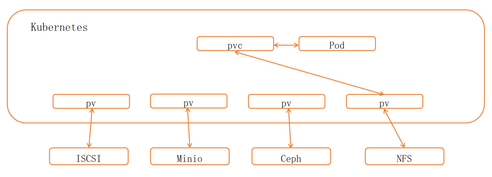


### PV/PVC - 关联条件


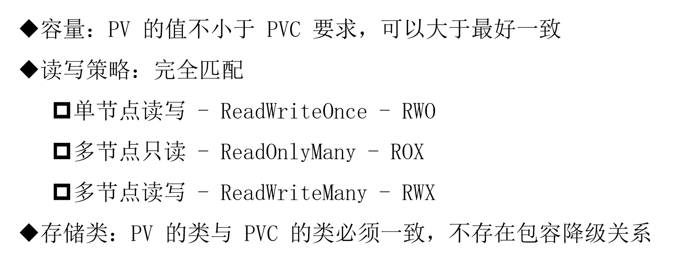


### PV/PVC - 回收策略

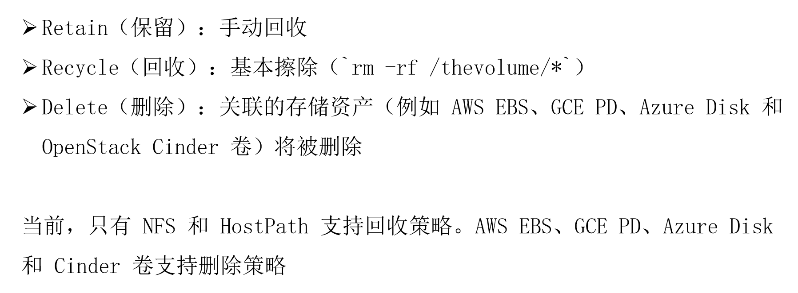

### PV/PVC - 状态


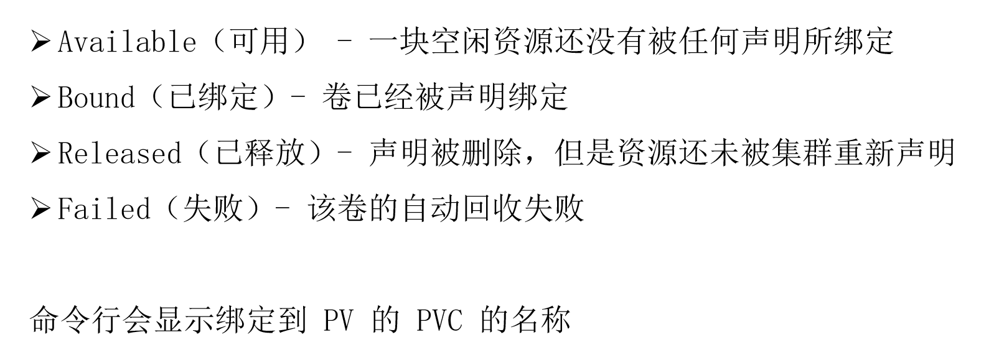


### PV/PVC - PVC保护

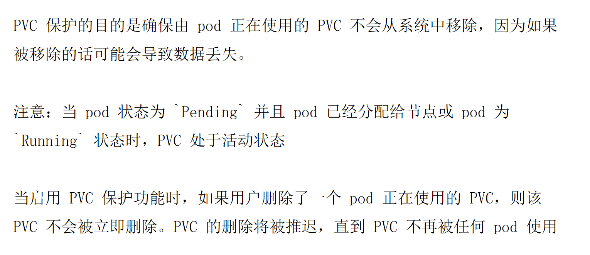


### PV/PVC - StatefulSet - 部署


#### 安装NFS服务器

在每个节点上执行：

##### 安装 NFS 服务端软件包

```bash
yum install -y nfs-utils rpcbind
```

正常情况下，我们会在一个独立的机器上部署这个NFS服务器，这边为了简单起见，就直接在master01上部署了

在master01节点是执行：

##### 创建共享目录并设置权限

```bash
mkdir -p /nfsdata
chmod 666 /nfsdata
chown nobody /nfsdata
```
##### 配置 NFS 共享（/etc/exports）


```bash
cat > /etc/exports <<EOF
/nfsdata *(rw,no_root_squash,no_all_squash,sync)
EOF
```


```bash
[root@k8s-master01 7]# cd /nfsdata/
[root@k8s-master01 nfsdata]# ls
[root@k8s-master01 nfsdata]# mkdir {1..10}
[root@k8s-master01 nfsdata]# ls
1  10  2  3  4  5  6  7  8  9
[root@k8s-master01 nfsdata]# echo "1" > 1/index.html
[root@k8s-master01 nfsdata]# echo "2" > 2/index.html
[root@k8s-master01 nfsdata]# echo "3" > 3/index.html
[root@k8s-master01 nfsdata]# echo "4" > 4/index.html
[root@k8s-master01 nfsdata]# echo "5" > 5/index.html
[root@k8s-master01 nfsdata]# echo "6" > 6/index.html
[root@k8s-master01 nfsdata]# echo "7" > 7/index.html
[root@k8s-master01 nfsdata]# echo "8" > 8/index.html
[root@k8s-master01 nfsdata]# echo "9" > 9/index.html
[root@k8s-master01 nfsdata]# echo "10" > 10/index.html
[root@k8s-master01 nfsdata]# cat 1/index.html 
1
```

```bash
[root@k8s-master01 nfsdata]# vim /etc/exports
```

改成这样：

```bash
/nfsdata/1 *(rw,no_root_squash,no_all_squash,sync)
/nfsdata/2 *(rw,no_root_squash,no_all_squash,sync)
/nfsdata/3 *(rw,no_root_squash,no_all_squash,sync)
/nfsdata/4 *(rw,no_root_squash,no_all_squash,sync)
/nfsdata/5 *(rw,no_root_squash,no_all_squash,sync)
/nfsdata/6 *(rw,no_root_squash,no_all_squash,sync)
/nfsdata/7 *(rw,no_root_squash,no_all_squash,sync)
/nfsdata/8 *(rw,no_root_squash,no_all_squash,sync)
/nfsdata/9 *(rw,no_root_squash,no_all_squash,sync)
/nfsdata/10 *(rw,no_root_squash,no_all_squash,sync)
```

```bash
systemctl restart rpcbind
systemctl restart nfs-server
```

```bash
[root@k8s-master01 nfsdata]# systemctl restart rpcbind
systemctl restart nfs-server
[root@k8s-master01 nfsdata]# showmount -e 192.168.120.11
Export list for 192.168.120.11:
/nfsdata/10 *
/nfsdata/9  *
/nfsdata/8  *
/nfsdata/7  *
/nfsdata/6  *
/nfsdata/5  *
/nfsdata/4  *
/nfsdata/3  *
/nfsdata/2  *
/nfsdata/1  *
```


在node1节点上执行：

```bash
[root@k8s-node01 ~]# mkdir /nfstest
[root@k8s-node01 ~]# mount -t nfs 192.168.120.11:/nfsdata/1 /nfstest/
[root@k8s-node01 ~]# cd /nfstest/
[root@k8s-node01 nfstest]# ls
index.html
[root@k8s-node01 nfstest]# cat index.html 
1
[root@k8s-node01 nfstest]# echo "tangfire" >> index.html
[root@k8s-node01 nfstest]# cat index.html 
1
tangfire
```

然后我们再看看master01节点：

```bash
[root@k8s-master01 nfsdata]# cat 1/index.html 
1
tangfire
```

然后我们在node1节点上执行：

```bash
[root@k8s-node01 nfstest]# umount /nfstest/
umount.nfs4: /nfstest: device is busy
[root@k8s-node01 nfstest]# cd 
[root@k8s-node01 ~]# umount /nfstest/
```


#### 部署PV

#### pv.yaml

```yaml
apiVersion: v1
kind: PersistentVolume
metadata:
  name: nfspv1
spec:
  capacity:
    storage: 1Gi
  accessModes:
    - ReadWriteOnce
  persistentVolumeReclaimPolicy: Recycle
  storageClassName: nfs
  nfs:
    path: /nfsdata/1
    server: 192.168.120.11

---


apiVersion: v1
kind: PersistentVolume
metadata:
  name: nfspv2
spec:
  capacity:
    storage: 0.9Gi
  accessModes:
    - ReadWriteOnce
  persistentVolumeReclaimPolicy: Recycle
  storageClassName: nfs
  nfs:
    path: /nfsdata/2
    server: 192.168.120.11

---


apiVersion: v1
kind: PersistentVolume
metadata:
  name: nfspv3
spec:
  capacity:
    storage: 1.2Gi
  accessModes:
    - ReadWriteOnce
  persistentVolumeReclaimPolicy: Recycle
  storageClassName: nfs
  nfs:
    path: /nfsdata/3
    server: 192.168.120.11

---


apiVersion: v1
kind: PersistentVolume
metadata:
  name: nfspv4
spec:
  capacity:
    storage: 1Gi
  accessModes:
    - ReadWriteOnce
  persistentVolumeReclaimPolicy: Recycle
  storageClassName: nfs
  nfs:
    path: /nfsdata/4
    server: 192.168.120.11

---


apiVersion: v1
kind: PersistentVolume
metadata:
  name: nfspv5
spec:
  capacity:
    storage: 1Gi
  accessModes:
    - ReadWriteMany
  persistentVolumeReclaimPolicy: Recycle
  storageClassName: nfs
  nfs:
    path: /nfsdata/5
    server: 192.168.120.11

---


apiVersion: v1
kind: PersistentVolume
metadata:
  name: nfspv6
spec:
  capacity:
    storage: 1Gi
  accessModes:
    - ReadWriteOnce
  persistentVolumeReclaimPolicy: Recycle
  storageClassName: nfs1
  nfs:
    path: /nfsdata/6
    server: 192.168.120.11

---


apiVersion: v1
kind: PersistentVolume
metadata:
  name: nfspv7
spec:
  capacity:
    storage: 1Gi
  accessModes:
    - ReadWriteOnce
  persistentVolumeReclaimPolicy: Retain
  storageClassName: nfs
  nfs:
    path: /nfsdata/7
    server: 192.168.120.11


```


```bash
[root@k8s-master01 18]# kubectl apply -f pv.yaml 
persistentvolume/nfspv1 created
persistentvolume/nfspv2 created
persistentvolume/nfspv3 created
persistentvolume/nfspv4 created
persistentvolume/nfspv5 created
persistentvolume/nfspv6 created
persistentvolume/nfspv7 created

[root@k8s-master01 18]# kubectl get pv
NAME     CAPACITY         ACCESS MODES   RECLAIM POLICY   STATUS      CLAIM   STORAGECLASS   VOLUMEATTRIBUTESCLASS   REASON   AGE
nfspv1   1Gi              RWO            Recycle          Available           nfs            <unset>                          25s
nfspv2   966367641600m    RWO            Recycle          Available           nfs            <unset>                          25s
nfspv3   1288490188800m   RWO            Recycle          Available           nfs            <unset>                          25s
nfspv4   1Gi              RWO            Recycle          Available           nfs            <unset>                          25s
nfspv5   1Gi              RWX            Recycle          Available           nfs            <unset>                          25s
nfspv6   1Gi              RWO            Recycle          Available           nfs1           <unset>                          25s
nfspv7   1Gi              RWO            Retain           Available           nfs            <unset>                          25s
```


#### 创建服务并使用PVC


#### statefulSet.yaml

```yaml
apiVersion: v1
kind: Service
metadata:
  name: nginx
  labels:
    app: nginx
spec:
  ports:
  - port: 80
    name: web
  clusterIP: None  # Headless Service 标识
  selector:
    app: nginx

---

apiVersion: apps/v1
kind: StatefulSet
metadata:
  name: web
spec:
  serviceName: "nginx"
  replicas: 3
  selector:
    matchLabels:
      app: nginx
  template:
    metadata:
      labels:
        app: nginx
    spec:
      containers:
        - name: nginx
          image: nginx:alpine  # 使用官方Nginx镜像替代私有镜像
          ports:
            - containerPort: 80
              name: web
          volumeMounts:
            - name: www
              mountPath: /usr/share/nginx/html  # 调整为标准Nginx路径
  volumeClaimTemplates:
    - metadata:
        name: www
      spec:
        accessModes: [ "ReadWriteOnce" ]
        storageClassName: "nfs"
        resources:
          requests:
            storage: 1Gi
```


```bash
[root@k8s-master01 18]# kubectl apply -f statefulSet.yaml 
service/nginx created
statefulset.apps/web created
[root@k8s-master01 18]# kubectl get pod
NAME    READY   STATUS    RESTARTS   AGE
web-0   1/1     Running   0          105s
web-1   1/1     Running   0          103s
web-2   1/1     Running   0          101s
```


#### 查看k8s中DNS服务器的VIP

在 Kubernetes 中，DNS 服务的 VIP（虚拟 IP）通常是 **CoreDNS** 或 **kube-dns** 服务的 ClusterIP。以下是查看方法：

---

### **1. 确认 DNS 服务名称**
```bash
kubectl get svc -n kube-system | grep -E 'kube-dns|CoreDNS'
```
输出示例：
```
NAME       TYPE        CLUSTER-IP     PORT(S)
coredns    ClusterIP   10.96.0.10     53/UDP,53/TCP
```
- **`10.96.0.10`** 就是 DNS 服务的 VIP（ClusterIP）。

---

### **2. 查看 DNS 服务的详细配置**
```bash
kubectl describe svc coredns -n kube-system
```
关键输出：
```
IP:                       10.96.0.10
Port:                      dns  53/UDP
TargetPort:                53/UDP
Endpoints:                 10.244.0.5:53,10.244.0.6:53
```
- **`IP: 10.96.0.10`** 是 VIP（所有 DNS 请求都会发往此 IP）。
- **`Endpoints`** 是实际运行 CoreDNS 的 Pod IP。

---

### **3. 查看 Pod 的 DNS 配置**
```bash
kubectl exec -it <任意Pod名称> -- cat /etc/resolv.conf
```
输出示例：
```
nameserver 10.96.0.10
search default.svc.cluster.local svc.cluster.local cluster.local
```
- **`nameserver 10.96.0.10`** 就是集群的 DNS VIP。

---

### **4. 直接测试 DNS 解析**
```bash
# 进入一个临时Pod测试
kubectl run -it --rm --image=busybox:latest test --restart=Never -- nslookup kubernetes.default
```
输出示例：
```
Server:    10.96.0.10
Address 1: 10.96.0.10 kube-dns.kube-system.svc.cluster.local
```
- **`Server: 10.96.0.10`** 即为 DNS 服务的 VIP。

---

### **5. 特殊情况说明**
1. **如果使用自定义 DNS**：
  - 检查 `kubelet` 配置中的 `--cluster-dns` 参数：
    ```bash
    ps aux | grep kubelet | grep cluster-dns
    ```
2. **如果 VIP 无法访问**：
  - 检查 CoreDNS Pod 是否正常运行：
    ```bash
    kubectl get pods -n kube-system -l k8s-app=kube-dns
    ```

---

### **总结**
| 项目               | 典型值          | 查看方式                      |
|--------------------|----------------|-----------------------------|
| **DNS VIP**        | `10.96.0.10`   | `kubectl get svc -n kube-system` |
| **DNS 解析测试**   | `nslookup`     | 临时 Pod 测试                  |
| **自定义配置**     | `kubelet` 参数 | 检查节点服务配置                |


---

```bash
[root@k8s-master01 18]# kubectl get pod
NAME    READY   STATUS    RESTARTS   AGE
web-0   1/1     Running   0          105s
web-1   1/1     Running   0          103s
web-2   1/1     Running   0          101s
[root@k8s-master01 18]# 
[root@k8s-master01 18]# kubectl get svc
NAME         TYPE        CLUSTER-IP   EXTERNAL-IP   PORT(S)   AGE
kubernetes   ClusterIP   10.0.0.1     <none>        443/TCP   8d
nginx        ClusterIP   None         <none>        80/TCP    3m51s
[root@k8s-master01 18]# kubectl get endpoints
NAME         ENDPOINTS                                            AGE
kubernetes   192.168.120.11:6443                                  8d
nginx        10.244.58.222:80,10.244.85.254:80,10.244.85.255:80   4m10s
[root@k8s-master01 18]# kubectl get svc -n kube-system | grep -E 'kube-dns|CoreDNS'
kube-dns       ClusterIP   10.0.0.10      <none>        53/UDP,53/TCP,9153/TCP   8d
[root@k8s-master01 18]# dig -t A nginx.default.svc.cluster.local. @10.0.0.10

; <<>> DiG 9.16.23-RH <<>> -t A nginx.default.svc.cluster.local. @10.0.0.10
;; global options: +cmd
;; Got answer:
;; WARNING: .local is reserved for Multicast DNS
;; You are currently testing what happens when an mDNS query is leaked to DNS
;; ->>HEADER<<- opcode: QUERY, status: NOERROR, id: 11981
;; flags: qr aa rd; QUERY: 1, ANSWER: 3, AUTHORITY: 0, ADDITIONAL: 1
;; WARNING: recursion requested but not available

;; OPT PSEUDOSECTION:
; EDNS: version: 0, flags:; udp: 4096
; COOKIE: 96df3d5dbd1006f9 (echoed)
;; QUESTION SECTION:
;nginx.default.svc.cluster.local. IN	A

;; ANSWER SECTION:
nginx.default.svc.cluster.local. 30 IN	A	10.244.85.255
nginx.default.svc.cluster.local. 30 IN	A	10.244.58.222
nginx.default.svc.cluster.local. 30 IN	A	10.244.85.254

;; Query time: 56 msec
;; SERVER: 10.0.0.10#53(10.0.0.10)
;; WHEN: Sat Jul 12 19:21:18 CST 2025
;; MSG SIZE  rcvd: 213

[root@k8s-master01 18]# kubectl get pod -o wide
NAME    READY   STATUS    RESTARTS   AGE     IP              NODE         NOMINATED NODE   READINESS GATES
web-0   1/1     Running   0          8m57s   10.244.85.254   k8s-node01   <none>           <none>
web-1   1/1     Running   0          8m55s   10.244.58.222   k8s-node02   <none>           <none>
web-2   1/1     Running   0          8m53s   10.244.85.255   k8s-node01   <none>           <none>
```

无头服务会将当前我们的标签选择器匹配到的pod，添加到当前的DNS解析结果里去


```bash
[root@k8s-master01 18]# kubectl get statefulSet
NAME   READY   AGE
web    3/3     12m
[root@k8s-master01 18]# kubectl scale statefulSet web --replicas=10
statefulset.apps/web scaled
[root@k8s-master01 18]# kubectl get pod
NAME    READY   STATUS    RESTARTS   AGE
web-0   1/1     Running   0          12m
web-1   1/1     Running   0          12m
web-2   1/1     Running   0          12m
web-3   1/1     Running   0          5s
web-4   0/1     Pending   0          3s

[root@k8s-master01 18]# kubectl describe pod web-4
Name:             web-4
Namespace:        default
Priority:         0
Service Account:  default
Node:             <none>
Labels:           app=nginx
                  apps.kubernetes.io/pod-index=4
                  controller-revision-hash=web-6578c54df4
                  statefulset.kubernetes.io/pod-name=web-4
Annotations:      <none>
Status:           Pending
IP:               
IPs:              <none>
Controlled By:    StatefulSet/web
Containers:
  nginx:
    Image:        nginx:alpine
    Port:         80/TCP
    Host Port:    0/TCP
    Environment:  <none>
    Mounts:
      /usr/share/nginx/html from www (rw)
      /var/run/secrets/kubernetes.io/serviceaccount from kube-api-access-wzkdn (ro)
Conditions:
  Type           Status
  PodScheduled   False 
Volumes:
  www:
    Type:       PersistentVolumeClaim (a reference to a PersistentVolumeClaim in the same namespace)
    ClaimName:  www-web-4
    ReadOnly:   false
  kube-api-access-wzkdn:
    Type:                    Projected (a volume that contains injected data from multiple sources)
    TokenExpirationSeconds:  3607
    ConfigMapName:           kube-root-ca.crt
    ConfigMapOptional:       <nil>
    DownwardAPI:             true
QoS Class:                   BestEffort
Node-Selectors:              <none>
Tolerations:                 node.kubernetes.io/not-ready:NoExecute op=Exists for 300s
                             node.kubernetes.io/unreachable:NoExecute op=Exists for 300s
Events:
  Type     Reason            Age                    From               Message
  ----     ------            ----                   ----               -------
  Warning  FailedScheduling  2m24s (x2 over 7m47s)  default-scheduler  0/3 nodes are available: pod has unbound immediate PersistentVolumeClaims. preemption: 0/3 nodes are available: 3 Preemption is not helpful for scheduling.
[root@k8s-master01 18]# kubectl get pv
NAME     CAPACITY         ACCESS MODES   RECLAIM POLICY   STATUS      CLAIM               STORAGECLASS   VOLUMEATTRIBUTESCLASS   REASON   AGE
nfspv1   1Gi              RWO            Recycle          Bound       default/www-web-1   nfs            <unset>                          34m
nfspv2   966367641600m    RWO            Recycle          Available                       nfs            <unset>                          34m
nfspv3   1288490188800m   RWO            Recycle          Bound       default/www-web-3   nfs            <unset>                          34m
nfspv4   1Gi              RWO            Recycle          Bound       default/www-web-2   nfs            <unset>                          34m
nfspv5   1Gi              RWX            Recycle          Available                       nfs            <unset>                          34m
nfspv6   1Gi              RWO            Recycle          Available                       nfs1           <unset>                          34m
nfspv7   1Gi              RWO            Retain           Bound       default/www-web-0   nfs            <unset>                          34m
```


```bash
[root@k8s-master01 18]# kubectl get pod -o wide
NAME    READY   STATUS    RESTARTS   AGE   IP              NODE         NOMINATED NODE   READINESS GATES
web-0   1/1     Running   0          32m   10.244.85.254   k8s-node01   <none>           <none>
web-1   1/1     Running   0          32m   10.244.58.222   k8s-node02   <none>           <none>
web-2   1/1     Running   0          32m   10.244.85.255   k8s-node01   <none>           <none>
web-3   1/1     Running   0          20m   10.244.58.221   k8s-node02   <none>           <none>
web-4   0/1     Pending   0          20m   <none>          <none>       <none>           <none>
[root@k8s-master01 18]# curl 10.244.85.254
7
[root@k8s-master01 18]# kubectl get pvc
NAME        STATUS    VOLUME   CAPACITY         ACCESS MODES   STORAGECLASS   VOLUMEATTRIBUTESCLASS   AGE
www-web-0   Bound     nfspv7   1Gi              RWO            nfs            <unset>                 34m
www-web-1   Bound     nfspv1   1Gi              RWO            nfs            <unset>                 33m
www-web-2   Bound     nfspv4   1Gi              RWO            nfs            <unset>                 33m
www-web-3   Bound     nfspv3   1288490188800m   RWO            nfs            <unset>                 21m
www-web-4   Pending                                            nfs            <unset>                 21m
```


```bash
[root@k8s-master01 18]# kubectl exec -it web-0 -- /bin/sh
/ # cd /usr/share/nginx/html
/usr/share/nginx/html # ls
index.html
/usr/share/nginx/html # echo "tangfire" >> index.html
/usr/share/nginx/html # exit
[root@k8s-master01 18]# curl 10.244.85.254
7
tangfire
[root@k8s-master01 18]# kubectl delete pod web-0
pod "web-0" deleted
[root@k8s-master01 18]# kubectl get pod -o wide
NAME    READY   STATUS    RESTARTS   AGE   IP              NODE         NOMINATED NODE   READINESS GATES
web-0   1/1     Running   0          11s   10.244.85.192   k8s-node01   <none>           <none>
web-1   1/1     Running   0          37m   10.244.58.222   k8s-node02   <none>           <none>
web-2   1/1     Running   0          37m   10.244.85.255   k8s-node01   <none>           <none>
web-3   1/1     Running   0          26m   10.244.58.221   k8s-node02   <none>           <none>
web-4   0/1     Pending   0          26m   <none>          <none>       <none>           <none>
[root@k8s-master01 18]# curl 10.244.85.192
7
tangfire
```


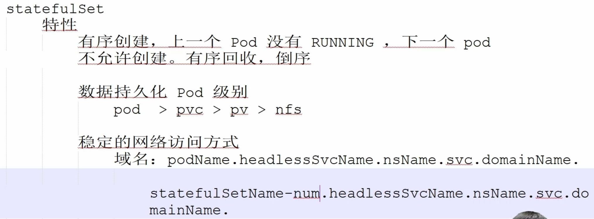


```bash
[root@k8s-master01 18]# kubectl delete -f statefulSet.yaml 
service "nginx" deleted
statefulset.apps "web" deleted
[root@k8s-master01 18]# kubectl get pod
No resources found in default namespace.
[root@k8s-master01 18]# kubectl get pv
NAME     CAPACITY         ACCESS MODES   RECLAIM POLICY   STATUS      CLAIM               STORAGECLASS   VOLUMEATTRIBUTESCLASS   REASON   AGE
nfspv1   1Gi              RWO            Recycle          Bound       default/www-web-1   nfs            <unset>                          62m
nfspv2   966367641600m    RWO            Recycle          Available                       nfs            <unset>                          62m
nfspv3   1288490188800m   RWO            Recycle          Bound       default/www-web-3   nfs            <unset>                          62m
nfspv4   1Gi              RWO            Recycle          Bound       default/www-web-2   nfs            <unset>                          62m
nfspv5   1Gi              RWX            Recycle          Available                       nfs            <unset>                          62m
nfspv6   1Gi              RWO            Recycle          Available                       nfs1           <unset>                          62m
nfspv7   1Gi              RWO            Retain           Bound       default/www-web-0   nfs            <unset>                          62m
[root@k8s-master01 18]# kubectl get pvc
NAME        STATUS    VOLUME   CAPACITY         ACCESS MODES   STORAGECLASS   VOLUMEATTRIBUTESCLASS   AGE
www-web-0   Bound     nfspv7   1Gi              RWO            nfs            <unset>                 48m
www-web-1   Bound     nfspv1   1Gi              RWO            nfs            <unset>                 48m
www-web-2   Bound     nfspv4   1Gi              RWO            nfs            <unset>                 48m
www-web-3   Bound     nfspv3   1288490188800m   RWO            nfs            <unset>                 36m
www-web-4   Pending                                            nfs            <unset>                 36m
[root@k8s-master01 18]# kubectl apply -f statefulSet.yaml 
service/nginx created
statefulset.apps/web created
[root@k8s-master01 18]# kubectl get pod -o wide
NAME    READY   STATUS    RESTARTS   AGE   IP              NODE         NOMINATED NODE   READINESS GATES
web-0   1/1     Running   0          9s    10.244.58.223   k8s-node02   <none>           <none>
web-1   1/1     Running   0          8s    10.244.85.193   k8s-node01   <none>           <none>
web-2   1/1     Running   0          6s    10.244.58.225   k8s-node02   <none>           <none>
[root@k8s-master01 18]# curl 10.244.58.223
7
tangfire
```


```bash
[root@k8s-master01 18]# kubectl delete -f statefulSet.yaml 
service "nginx" deleted
statefulset.apps "web" deleted
[root@k8s-master01 18]# kubectl delete pvc --all
persistentvolumeclaim "www-web-0" deleted
persistentvolumeclaim "www-web-1" deleted
persistentvolumeclaim "www-web-2" deleted
persistentvolumeclaim "www-web-3" deleted
persistentvolumeclaim "www-web-4" deleted
[root@k8s-master01 18]# kubectl get pv
NAME     CAPACITY         ACCESS MODES   RECLAIM POLICY   STATUS      CLAIM               STORAGECLASS   VOLUMEATTRIBUTESCLASS   REASON   AGE
nfspv1   1Gi              RWO            Recycle          Released    default/www-web-1   nfs            <unset>                          68m
nfspv2   966367641600m    RWO            Recycle          Available                       nfs            <unset>                          68m
nfspv3   1288490188800m   RWO            Recycle          Failed      default/www-web-3   nfs            <unset>                          68m
nfspv4   1Gi              RWO            Recycle          Failed      default/www-web-2   nfs            <unset>                          68m
nfspv5   1Gi              RWX            Recycle          Available                       nfs            <unset>                          68m
nfspv6   1Gi              RWO            Recycle          Available                       nfs1           <unset>                          68m
nfspv7   1Gi              RWO            Retain           Released    default/www-web-0   nfs            <unset>                          68m
```

---

#### PersistentVolume (PV) 从 `Released` 状态恢复为 `Available` 状态


在 Kubernetes 中，将 PersistentVolume (PV) 从 `Released` 状态恢复为 `Available` 状态，需要手动清理其绑定关系。以下是具体操作步骤和代码示例：

---

### **1. 查看当前 PV 状态**
```bash
kubectl get pv
```
输出示例：
```
NAME      CAPACITY  STATUS      CLAIM             STORAGECLASS
pv-nfs    1Gi       Released    default/www-web-0 nfs
```

---

### **2. 手动释放 PV（关键步骤）**
编辑 PV 配置，删除 `claimRef` 字段（这是导致状态为 Released 的根源）：
```bash
kubectl edit pv <pv-name>
```
找到并删除以下部分：
```yaml
spec:
  claimRef:
    apiVersion: v1
    kind: PersistentVolumeClaim
    name: www-web-0  # 原绑定的PVC名称
    namespace: default
```

---

### **3. 强制回收 PV（如果仍不生效）**
如果 PV 的回收策略是 `Retain`，需手动清理数据并重置状态：
```bash
kubectl patch pv <pv-name> -p '{"spec":{"claimRef":null}}'
```

---

### **4. 验证状态变更**
```bash
kubectl get pv <pv-name>
```
预期输出：
```
NAME      CAPACITY  STATUS      CLAIM  STORAGECLASS
pv-nfs    1Gi       Available          nfs
```

---

### **完整操作示例**
假设 PV 名称为 `pv-nfs`：
```bash
# 1. 查看PV
kubectl get pv pv-nfs -o yaml

# 2. 解除绑定
kubectl patch pv pv-nfs --type=json -p '[{"op":"remove","path":"/spec/claimRef"}]'

# 3. 验证
kubectl get pv pv-nfs
```

---

### **根本原因分析**
| 状态 | 触发条件 | 解决方案 |
|------|----------|----------|
| `Released` | PVC 被删除，但 PV 仍保留绑定记录 | 删除 `claimRef` |
| `Failed` | 存储后端故障 | 检查存储系统日志 |

---

### **注意事项**
1. **数据安全**：
  - 如果 PV 中原有数据重要，操作前先备份（尤其是回收策略为 `Delete` 时）。
2. **StatefulSet 关联**：
  - 确保对应的 StatefulSet 已删除或缩容，否则新 PVC 会再次绑定。
3. **NFS 存储**：
  - 如果是 NFS PV，需确保服务器共享目录 `/data/nfs` 已清空或可复用。


---

### PV/PVC - StatefulSet - 特性


## 07. storageClass

一种动态的申请存储的机制


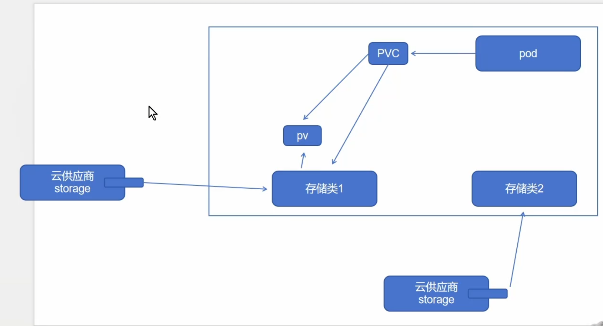


### storageClass概念


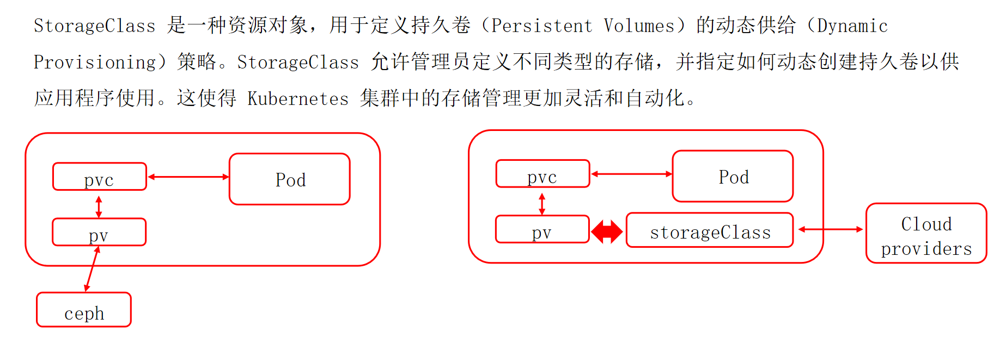


### nfs-client-provisioner

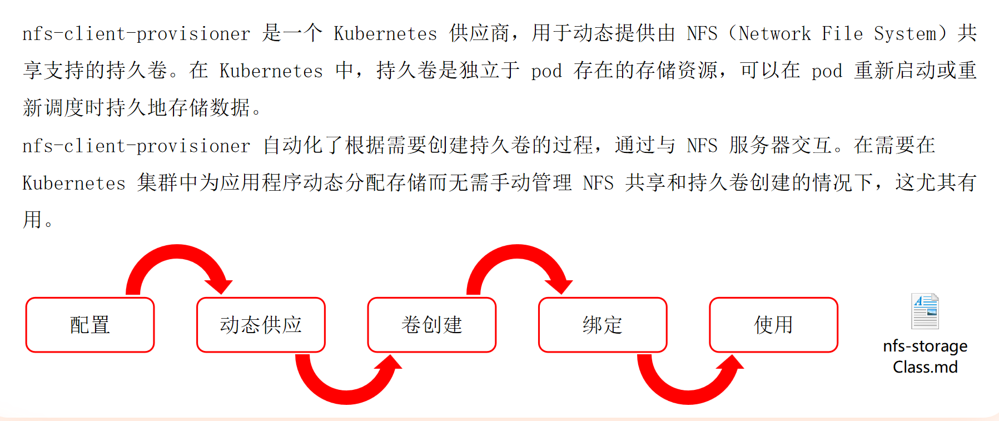


#### 搭建NFS服务器

略，上文已经搭建

#### 部署nfs-client-provisioner

```bash
[root@k8s-master01 18]# vim /etc/exports
```


加入这个：

```bash
/nfsdata/share *(rw,no_root_squash,no_all_squash,sync)
```

```bash
[root@k8s-master01 18]# mkdir -p /nfsdata/share
[root@k8s-master01 18]# chown -R nobody /nfsdata/share/
[root@k8s-master01 18]# systemctl restart nfs-server
[root@k8s-master01 18]# systemctl enable nfs-server
[root@k8s-master01 18]# systemctl enable rpcbind

[root@k8s-master01 18]# showmount -e 192.168.120.11
Export list for 192.168.120.11:
/nfsdata/share *
/nfsdata/10    *
/nfsdata/9     *
/nfsdata/8     *
/nfsdata/7     *
/nfsdata/6     *
/nfsdata/5     *
/nfsdata/4     *
/nfsdata/3     *
/nfsdata/2     *
/nfsdata/1     *
```

#### 部署nfs-client-provisioner

#### deployment.yaml

```yaml
apiVersion: apps/v1
kind: Deployment
metadata:
  name: nfs-client-provisioner
  namespace: nfs-storageclass
spec:
  replicas: 1
  selector:
    matchLabels:
      app: nfs-client-provisioner
  strategy:
    type: Recreate
  template:
    metadata:
      labels:
        app: nfs-client-provisioner
    spec:
      serviceAccountName: nfs-client-provisioner
      containers:
      - name: nfs-client-provisioner
        image: dyrnq/nfs-subdir-external-provisioner:v4.0.2
        volumeMounts:
        - name: nfs-client-root
          mountPath: /persistentvolumes
        env:
        - name: PROVISIONER_NAME
          value: k8s-sigs.io/nfs-subdir-external-provisioner
        - name: NFS_SERVER
          value: 192.168.120.11
        - name: NFS_PATH
          value: /nfsdata/share
      volumes:
      - name: nfs-client-root
        nfs:
          server: 192.168.120.11
          path: /nfsdata/share

```

#### rbac.yaml

```yaml
apiVersion: v1
kind: ServiceAccount
metadata:
  name: nfs-client-provisioner
  namespace: nfs-storageclass
---

apiVersion: rbac.authorization.k8s.io/v1
kind: ClusterRole
metadata:
  name: nfs-client-provisioner-runner
rules:
- apiGroups: [""]
  resources: ["nodes"]
  verbs: ["get", "list", "watch"]
- apiGroups: [""]
  resources: ["persistentvolumes"]
  verbs: ["get", "list", "watch", "create", "delete"]
- apiGroups: [""]
  resources: ["persistentvolumeclaims"]
  verbs: ["get", "list", "watch", "update"]
- apiGroups: ["storage.k8s.io"]
  resources: ["storageclasses"]
  verbs: ["get", "list", "watch"]
- apiGroups: [""]
  resources: ["events"]
  verbs: ["create", "update", "patch"]
---

apiVersion: rbac.authorization.k8s.io/v1
kind: ClusterRoleBinding
metadata:
  name: run-nfs-client-provisioner
subjects:
- kind: ServiceAccount
  name: nfs-client-provisioner
  namespace: nfs-storageclass
roleRef:
  kind: ClusterRole
  name: nfs-client-provisioner-runner
  apiGroup: rbac.authorization.k8s.io
---

apiVersion: rbac.authorization.k8s.io/v1
kind: Role
metadata:
  name: leader-locking-nfs-client-provisioner
  namespace: nfs-storageclass
rules:
- apiGroups: [""]
  resources: ["endpoints"]
  verbs: ["get", "list", "watch", "create", "update", "patch"]
---

apiVersion: rbac.authorization.k8s.io/v1
kind: RoleBinding
metadata:
  name: leader-locking-nfs-client-provisioner
  namespace: nfs-storageclass
subjects:
- kind: ServiceAccount
  name: nfs-client-provisioner
  namespace: nfs-storageclass
roleRef:
  kind: Role
  name: leader-locking-nfs-client-provisioner
  apiGroup: rbac.authorization.k8s.io
```


#### storageclass.yaml

```yaml
apiVersion: storage.k8s.io/v1
kind: StorageClass
metadata:
  name: nfs-client
  namespace: nfs-storageclass
provisioner: k8s-sigs.io/nfs-subdir-external-provisioner
parameters:
  pathPattern: "${.PVC.namespace}/${.PVC.name}"
  onDelete: "delete"
```


#### 创建名字空间

```bash
kubectl create ns nfs-storageclass
```

```bash
[root@k8s-master01 19]# vim deployment.yaml
[root@k8s-master01 19]# 
[root@k8s-master01 19]# vim rbac.yaml
[root@k8s-master01 19]# 
[root@k8s-master01 19]# vim storageclass.yaml
[root@k8s-master01 19]# 
[root@k8s-master01 19]# kubectl apply -f ../19/
clusterrole.rbac.authorization.k8s.io/nfs-client-provisioner-runner created
clusterrolebinding.rbac.authorization.k8s.io/run-nfs-client-provisioner created
storageclass.storage.k8s.io/nfs-client created
Error from server (NotFound): error when creating "../19/deployment.yaml": namespaces "nfs-storageclass" not found
Error from server (NotFound): error when creating "../19/rbac.yaml": namespaces "nfs-storageclass" not found
Error from server (NotFound): error when creating "../19/rbac.yaml": namespaces "nfs-storageclass" not found
Error from server (NotFound): error when creating "../19/rbac.yaml": namespaces "nfs-storageclass" not found

[root@k8s-master01 19]# kubectl create ns nfs-storageclass
namespace/nfs-storageclass created
[root@k8s-master01 19]# kubectl apply -f ../19/
deployment.apps/nfs-client-provisioner created
serviceaccount/nfs-client-provisioner created
clusterrole.rbac.authorization.k8s.io/nfs-client-provisioner-runner unchanged
clusterrolebinding.rbac.authorization.k8s.io/run-nfs-client-provisioner unchanged
role.rbac.authorization.k8s.io/leader-locking-nfs-client-provisioner created
rolebinding.rbac.authorization.k8s.io/leader-locking-nfs-client-provisioner created
storageclass.storage.k8s.io/nfs-client unchanged
```


```bash
[root@k8s-master01 19]# kubectl get pod -A
NAMESPACE          NAME                                       READY   STATUS              RESTARTS     AGE
default            recycler-for-nfspv3                        0/1     Terminating         0            33s
default            recycler-for-nfspv4                        0/1     ContainerCreating   0            18s
kube-system        calico-kube-controllers-558d465845-d8msr   1/1     Running             1            9d
kube-system        calico-node-59bdv                          1/1     Running             6 (8d ago)   9d
kube-system        calico-node-f7pk5                          1/1     Running             1            9d
kube-system        calico-node-wn5vm                          1/1     Running             1            9d
kube-system        calico-typha-5b56944f9b-t8n4m              1/1     Running             1            9d
kube-system        coredns-857d9ff4c9-drmqk                   1/1     Running             3 (8d ago)   9d
kube-system        coredns-857d9ff4c9-jknr4                   1/1     Running             3 (8d ago)   9d
kube-system        etcd-k8s-master01                          1/1     Running             3 (8d ago)   9d
kube-system        kube-apiserver-k8s-master01                1/1     Running             3 (8d ago)   9d
kube-system        kube-controller-manager-k8s-master01       1/1     Running             3 (8d ago)   9d
kube-system        kube-proxy-275ph                           1/1     Running             0            3d19h
kube-system        kube-proxy-n89sz                           1/1     Running             0            3d19h
kube-system        kube-proxy-pmv8z                           1/1     Running             0            3d19h
kube-system        kube-scheduler-k8s-master01                1/1     Running             3 (8d ago)   9d
nfs-storageclass   nfs-client-provisioner-8c5b9b749-z8v7p     1/1     Running             0            8m41s
[root@k8s-master01 19]# kubectl get storageclass
NAME         PROVISIONER                                   RECLAIMPOLICY   VOLUMEBINDINGMODE   ALLOWVOLUMEEXPANSION   AGE
nfs-client   k8s-sigs.io/nfs-subdir-external-provisioner   Delete          Immediate           false                  11h
```


#### 测试Pod

#### sctest.yaml

```yaml
---
# PersistentVolumeClaim 配置
apiVersion: v1
kind: PersistentVolumeClaim
metadata:
  name: test-claim
spec:
  accessModes:
    - ReadWriteMany
  resources:
    requests:
      storage: 1Mi
  storageClassName: nfs-client

---
# Pod 配置
apiVersion: v1
kind: Pod
metadata:
  name: test-pod
spec:
  containers:
  - name: nginx-container
    image: nginx:1.25  # 使用官方公共镜像替代私有镜像
    volumeMounts:
    - name: nfs-pvc
      mountPath: "/usr/share/nginx/html"  # 修改为标准路径
  restartPolicy: Never
  volumes:
  - name: nfs-pvc
    persistentVolumeClaim:
      claimName: test-claim
```


```bash
[root@k8s-master01 19]# vim sctest.yaml
[root@k8s-master01 19]# 
[root@k8s-master01 19]# 
[root@k8s-master01 19]# kubectl apply -f sctest.yaml 
persistentvolumeclaim/test-claim created
pod/test-pod created
[root@k8s-master01 19]# kubectl get pvc
NAME         STATUS   VOLUME                                     CAPACITY   ACCESS MODES   STORAGECLASS   VOLUMEATTRIBUTESCLASS   AGE
test-claim   Bound    pvc-0e77feef-020f-493e-9912-b4f049ba1668   1Mi        RWX            nfs-client     <unset>                 60s
[root@k8s-master01 19]# kubectl get pv
NAME                                       CAPACITY         ACCESS MODES   RECLAIM POLICY   STATUS      CLAIM                STORAGECLASS   VOLUMEATTRIBUTESCLASS   REASON   AGE
nfspv2                                     966367641600m    RWO            Recycle          Available                        nfs            <unset>                          14h
nfspv3                                     1288490188800m   RWO            Recycle          Failed      default/www-web-3    nfs            <unset>                          14h
nfspv4                                     1Gi              RWO            Recycle          Failed      default/www-web-2    nfs            <unset>                          14h
nfspv5                                     1Gi              RWX            Recycle          Available                        nfs            <unset>                          14h
nfspv6                                     1Gi              RWO            Recycle          Available                        nfs1           <unset>                          14h
nfspv7                                     1Gi              RWO            Retain           Released    default/www-web-0    nfs            <unset>                          14h
pvc-0e77feef-020f-493e-9912-b4f049ba1668   1Mi              RWX            Delete           Bound       default/test-claim   nfs-client     <unset>                          71s
```


```bash
[root@k8s-master01 19]# kubectl get pod
NAME                  READY   STATUS             RESTARTS   AGE
recycler-for-nfspv4   0/1     ImagePullBackOff   0          3m35s
test-pod              1/1     Running            0          12m
[root@k8s-master01 19]# kubectl exec -it test-pod -- /bin/sh
# 
# cd /usr/share/nginx/html    
# ls 
# hostname > /usr/share/nginx/html/hostname.html  
# echo "123" > index.html
# ls
hostname.html  index.html
# exit
[root@k8s-master01 19]# 
[root@k8s-master01 19]# 
[root@k8s-master01 19]# kubectl get pod -o wide
NAME       READY   STATUS    RESTARTS   AGE   IP              NODE         NOMINATED NODE   READINESS GATES
test-pod   1/1     Running   0          14m   10.244.58.244   k8s-node02   <none>           <none>
[root@k8s-master01 19]# curl 10.244.58.244
123
[root@k8s-master01 19]# cd /nfsdata/share/default/test-claim
[root@k8s-master01 test-claim]# ls
hostname.html  index.html
[root@k8s-master01 test-claim]# cat index.html 
123
[root@k8s-master01 test-claim]# echo "good morning" >> index.html
[root@k8s-master01 test-claim]# curl 10.244.58.244
123
good morning
```


## 08. 插曲

释放键入速度

### 命令补全

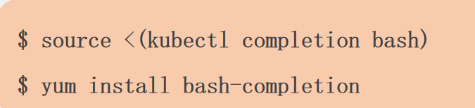

```bash
[root@k8s-master01 19]# yum -y install bash-completion
Last metadata expiration check: 3:26:45 ago on Sun Jul 13 06:40:40 2025.
Dependencies resolved.
=========================================================================================
 Package                     Architecture    Version               Repository       Size
=========================================================================================
Installing:
 bash-completion             noarch          1:2.11-5.el9          baseos          291 k
Installing dependencies:
 libpkgconf                  x86_64          1.7.3-10.el9          baseos           35 k
 pkgconf                     x86_64          1.7.3-10.el9          baseos           40 k
 pkgconf-m4                  noarch          1.7.3-10.el9          baseos           14 k
 pkgconf-pkg-config          x86_64          1.7.3-10.el9          baseos           10 k

Transaction Summary
=========================================================================================
Install  5 Packages

Total download size: 390 k
Installed size: 1.2 M
Downloading Packages:
(1/5): pkgconf-1.7.3-10.el9.x86_64.rpm                    93 kB/s |  40 kB     00:00    
(2/5): libpkgconf-1.7.3-10.el9.x86_64.rpm                 74 kB/s |  35 kB     00:00    
(3/5): bash-completion-2.11-5.el9.noarch.rpm             281 kB/s | 291 kB     00:01    
(4/5): pkgconf-m4-1.7.3-10.el9.noarch.rpm                 20 kB/s |  14 kB     00:00    
(5/5): pkgconf-pkg-config-1.7.3-10.el9.x86_64.rpm         15 kB/s |  10 kB     00:00    
-----------------------------------------------------------------------------------------
Total                                                    337 kB/s | 390 kB     00:01     
Running transaction check
Transaction check succeeded.
Running transaction test
Transaction test succeeded.
Running transaction
  Preparing        :                                                                 1/1 
  Installing       : pkgconf-m4-1.7.3-10.el9.noarch                                  1/5 
  Installing       : libpkgconf-1.7.3-10.el9.x86_64                                  2/5 
  Installing       : pkgconf-1.7.3-10.el9.x86_64                                     3/5 
  Installing       : pkgconf-pkg-config-1.7.3-10.el9.x86_64                          4/5 
  Installing       : bash-completion-1:2.11-5.el9.noarch                             5/5 
  Running scriptlet: bash-completion-1:2.11-5.el9.noarch                             5/5 
  Verifying        : bash-completion-1:2.11-5.el9.noarch                             1/5 
  Verifying        : pkgconf-1.7.3-10.el9.x86_64                                     2/5 
  Verifying        : libpkgconf-1.7.3-10.el9.x86_64                                  3/5 
  Verifying        : pkgconf-m4-1.7.3-10.el9.noarch                                  4/5 
  Verifying        : pkgconf-pkg-config-1.7.3-10.el9.x86_64                          5/5 

Installed:
  bash-completion-1:2.11-5.el9.noarch             libpkgconf-1.7.3-10.el9.x86_64         
  pkgconf-1.7.3-10.el9.x86_64                     pkgconf-m4-1.7.3-10.el9.noarch         
  pkgconf-pkg-config-1.7.3-10.el9.x86_64         

Complete!
[root@k8s-master01 19]# cd ~
[root@k8s-master01 ~]# vim .bashrc
```
在`bashrc`文件中添加

```bash
source <(kubectl completion bash)
```

然后退出终端，重新连接一下

```bash
[root@k8s-master01 ~]# kubectl ge
```

按tab，发现自动补全


```bash
[root@k8s-master01 ~]# kubectl get 
```

按tab tab,会出现

```bash
apiservices.apiregistration.k8s.io
bgpconfigurations.crd.projectcalico.org
bgpfilters.crd.projectcalico.org
bgppeers.crd.projectcalico.org
blockaffinities.crd.projectcalico.org
caliconodestatuses.crd.projectcalico.org
certificatesigningrequests.certificates.k8s.io
clusterinformations.crd.projectcalico.org
clusterrolebindings.rbac.authorization.k8s.io
clusterroles.rbac.authorization.k8s.io
componentstatuses
configmaps
controllerrevisions.apps
cronjobs.batch
csidrivers.storage.k8s.io
csinodes.storage.k8s.io
csistoragecapacities.storage.k8s.io
customresourcedefinitions.apiextensions.k8s.io
daemonsets.apps
deployments.apps
endpoints
endpointslices.discovery.k8s.io
events
events.events.k8s.io
felixconfigurations.crd.projectcalico.org
flowschemas.flowcontrol.apiserver.k8s.io
globalnetworkpolicies.crd.projectcalico.org
globalnetworksets.crd.projectcalico.org
horizontalpodautoscalers.autoscaling
hostendpoints.crd.projectcalico.org
ingressclasses.networking.k8s.io
ingresses.networking.k8s.io
ipamblocks.crd.projectcalico.org
ipamconfigs.crd.projectcalico.org
ipamhandles.crd.projectcalico.org
ippools.crd.projectcalico.org
ipreservations.crd.projectcalico.org
jobs.batch
kubecontrollersconfigurations.crd.projectcalico.org
[root@k8s-master01 ~]# kubectl get 
apiservices.apiregistration.k8s.io
bgpconfigurations.crd.projectcalico.org
bgpfilters.crd.projectcalico.org
bgppeers.crd.projectcalico.org
blockaffinities.crd.projectcalico.org
caliconodestatuses.crd.projectcalico.org
certificatesigningrequests.certificates.k8s.io
clusterinformations.crd.projectcalico.org
clusterrolebindings.rbac.authorization.k8s.io
clusterroles.rbac.authorization.k8s.io
componentstatuses
configmaps
controllerrevisions.apps
cronjobs.batch
csidrivers.storage.k8s.io
csinodes.storage.k8s.io
csistoragecapacities.storage.k8s.io
customresourcedefinitions.apiextensions.k8s.io
daemonsets.apps
deployments.apps
endpoints
endpointslices.discovery.k8s.io
events
events.events.k8s.io
felixconfigurations.crd.projectcalico.org
flowschemas.flowcontrol.apiserver.k8s.io
globalnetworkpolicies.crd.projectcalico.org
globalnetworksets.crd.projectcalico.org
horizontalpodautoscalers.autoscaling
hostendpoints.crd.projectcalico.org
ingressclasses.networking.k8s.io
ingresses.networking.k8s.io
ipamblocks.crd.projectcalico.org
ipamconfigs.crd.projectcalico.org
ipamhandles.crd.projectcalico.org
ippools.crd.projectcalico.org
ipreservations.crd.projectcalico.org
jobs.batch
kubecontrollersconfigurations.crd.projectcalico.org
```

`q`退出


