# k8s调度器

调度器 - Kubernetes中最核心的实现之一

## 调度器概念

理解特性，使用特性

### 调度器 - 概念

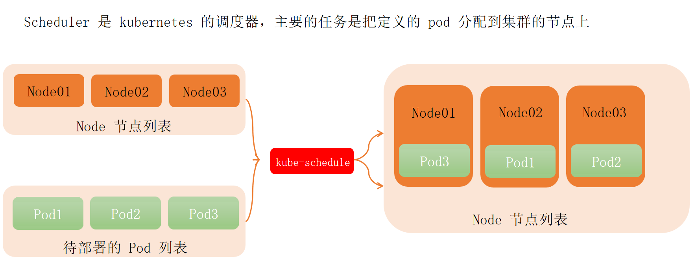


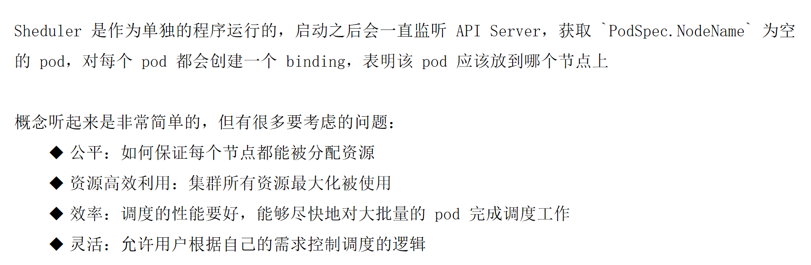


### 调度器 - 自定义调度器


#### 1.deployment.yaml

```yaml
apiVersion: apps/v1
kind: Deployment
metadata:
  labels:
    app: myapp
  name: myapp
spec:
  replicas: 1
  selector:
    matchLabels:
      app: myapp
  template:
    metadata:
      labels:
        app: myapp
    spec:
      schedulerName: my-scheduler  # 指定自定义调度器
      containers:
      - name: myapp
        image: nginx:1.25
        ports:
        - containerPort: 80
        resources:
          requests:
            cpu: 100m
            memory: 128Mi
          limits:
            cpu: 200m
            memory: 256Mi
```

```bash
[root@k8s-master01 8]# vim 1.deployment.yaml
[root@k8s-master01 8]# 
[root@k8s-master01 8]# 
[root@k8s-master01 8]# kubectl apply -f 1.deployment.yaml 
deployment.apps/myapp created
[root@k8s-master01 8]# kubectl get pod
NAME                     READY   STATUS    RESTARTS   AGE
myapp-758787775f-s5lnh   0/1     Pending   0          7s
```

### 自定义调度器

```bash
# 在kubernetes Master 节点开启 apiServer 的代理
kubectl proxy --port=8001
```

> 基于shell编写一个自定义调度器

### my-scheduler.sh


```shell
#!/bin/bash
SERVER='localhost:8001'
while true; do
    # 获取所有未被调度的Pod
    for PODNAME in $(kubectl --server $SERVER get pods --all-namespaces -o json | jq -r '.items[] | select(.spec.schedulerName=="my-scheduler") | select(.spec.nodeName==null) | .metadata.name'); do
        
        # 获取所有节点列表
        NODES=($(kubectl --server $SERVER get nodes -o json | jq -r '.items[].metadata.name'))
        NUMNODES=${#NODES[@]}
        
        # 随机选择一个节点
        CHOSEN=${NODES[$((RANDOM % NUMNODES))]}
        
        # 发送绑定请求
        curl --header "Content-Type: application/json" --request POST \
            --data "{\"apiVersion\": \"v1\", \"kind\": \"Binding\", \"metadata\": {\"name\": \"$PODNAME\"}, \"target\": {\"apiVersion\": \"v1\", \"kind\": \"Node\", \"name\": \"$CHOSEN\"}}" \
            "http://$SERVER/api/v1/namespaces/default/pods/$PODNAME/binding/"
        
        echo "Assigned $PODNAME to $CHOSEN"
    done
    sleep 1
done
```


这是一个自定义 Kubernetes 调度器的 Bash 脚本实现，它会持续监控集群中未被调度的 Pod，并随机分配到可用节点。以下是逐部分解析：

---

### **1. 基础设置**
```bash
#!/bin/bash
SERVER='localhost:8001'
```
- `#!/bin/bash`：指定使用 Bash 解释器执行脚本
- `SERVER='localhost:8001'`：定义 Kubernetes API Server 的代理地址（需提前运行 `kubectl proxy --port=8001`）

---

### **2. 主循环**
```bash
while true; do
    # 监控逻辑
    sleep 1
done
```
- 无限循环，每 1 秒执行一次调度检查（`sleep 1`）

---

### **3. 获取待调度 Pod**
```bash
for PODNAME in $(kubectl --server $SERVER get pods --all-namespaces -o json | 
                 jq -r '.items[] | select(.spec.schedulerName=="my-scheduler") | 
                 select(.spec.nodeName==null) | .metadata.name'); do
```
- **过滤条件**：
    - 使用自定义调度器 `my-scheduler` 的 Pod（`select(.spec.schedulerName=="my-scheduler")`）
    - 尚未分配节点的 Pod（`select(.spec.nodeName==null)`）
- **工具链**：
    - `kubectl --server $SERVER`：通过代理访问 API
    - `jq`：解析 JSON 并提取 Pod 名称

---

### **4. 节点选择逻辑**
```bash
NODES=($(kubectl --server $SERVER get nodes -o json | 
         jq -r '.items[].metadata.name'))
NUMNODES=${#NODES[@]}
CHOSEN=${NODES[$((RANDOM % NUMNODES))]}
```
1. **获取所有节点**：
    - 使用 `kubectl get nodes` 和 `jq` 提取节点名称数组
2. **随机选择**：
    - `$RANDOM % NUMNODES` 生成随机索引
    - `${NODES[index]}` 获取对应节点名

---

### **5. 绑定 Pod 到节点**
```bash
curl --header "Content-Type: application/json" --request POST \
     --data "{\"apiVersion\": \"v1\", \"kind\": \"Binding\", \"metadata\": {\"name\": \"$PODNAME\"}, \"target\": {\"apiVersion\": \"v1\", \"kind\": \"Node\", \"name\": \"$CHOSEN\"}}" \
     "http://$SERVER/api/v1/namespaces/default/pods/$PODNAME/binding/"
```
- **API 调用**：  
  向 Kubernetes API 发送 `Binding` 请求（HTTP POST）
- **关键数据**：
    - `target.name`：指定目标节点 `$CHOSEN`
    - `metadata.name`：待调度的 Pod 名称

---

### **6. 日志输出**
```bash
echo "Assigned $PODNAME to $CHOSEN"
```
- 打印调度结果，便于调试和监控

---

### **工作流程图**
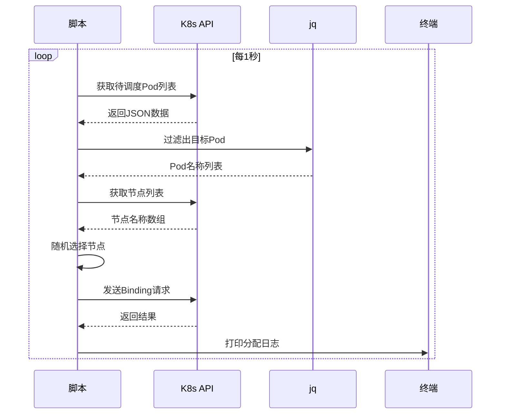

---

### **使用场景**
1. **测试自定义调度算法**
    - 可替换随机逻辑为其他策略（如基于资源利用率）
2. **多集群调度**
    - 修改 `SERVER` 地址指向不同集群的 API
3. **开发环境调试**
    - 快速验证调度逻辑，无需编译 Go 代码

---

### **注意事项**
1. **依赖工具**：
    - 需提前安装 `kubectl` 和 `jq`
    - 运行前启动 API 代理：`kubectl proxy --port=8001`
2. **权限控制**：
    - 确保 ServiceAccount 有 `create` Pods/binding 权限
3. **生产优化**：
    - 添加错误处理（如网络重试）
    - 记录详细日志到文件

---

再开一个终端执行：

```bash
[root@k8s-master01 ~]# vim my-scheduler.sh
[root@k8s-master01 ~]# 
[root@k8s-master01 ~]# cat my-scheduler.sh 
#!/bin/bash
SERVER='localhost:8001'
while true; do
    # 获取所有未被调度的Pod
    for PODNAME in $(kubectl --server $SERVER get pods --all-namespaces -o json | jq -r '.items[] | select(.spec.schedulerName=="my-scheduler") | select(.spec.nodeName==null) | .metadata.name'); do
        
        # 获取所有节点列表
        NODES=($(kubectl --server $SERVER get nodes -o json | jq -r '.items[].metadata.name'))
        NUMNODES=${#NODES[@]}
        
        # 随机选择一个节点
        CHOSEN=${NODES[$((RANDOM % NUMNODES))]}
        
        # 发送绑定请求
        curl --header "Content-Type: application/json" --request POST \
            --data "{\"apiVersion\": \"v1\", \"kind\": \"Binding\", \"metadata\": {\"name\": \"$PODNAME\"}, \"target\": {\"apiVersion\": \"v1\", \"kind\": \"Node\", \"name\": \"$CHOSEN\"}}" \
            "http://$SERVER/api/v1/namespaces/default/pods/$PODNAME/binding/"
        
        echo "Assigned $PODNAME to $CHOSEN"
    done
    sleep 1
done
[root@k8s-master01 ~]# 
[root@k8s-master01 ~]# 
[root@k8s-master01 ~]# chmod a+x my-scheduler.sh 
[root@k8s-master01 ~]# ./my-scheduler.sh 
{
  "kind": "Status",
  "apiVersion": "v1",
  "metadata": {},
  "status": "Success",
  "code": 201
}Assigned myapp-758787775f-s5lnh to k8s-node02
```


再开一个终端执行：

```bash
[root@k8s-master01 ~]# kubectl get pod
NAME                     READY   STATUS    RESTARTS   AGE
myapp-758787775f-s5lnh   1/1     Running   0          101m
[root@k8s-master01 ~]# kubectl get pod -o wide
NAME                     READY   STATUS    RESTARTS   AGE    IP              NODE         NOMINATED NODE   READINESS GATES
myapp-758787775f-s5lnh   1/1     Running   0          102m   10.244.58.207   k8s-node02   <none>           <none>
```

### 调度器 - 过程

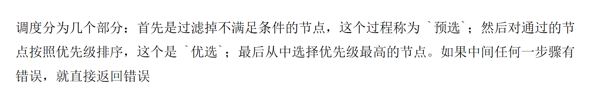


### 调度器 - 预选


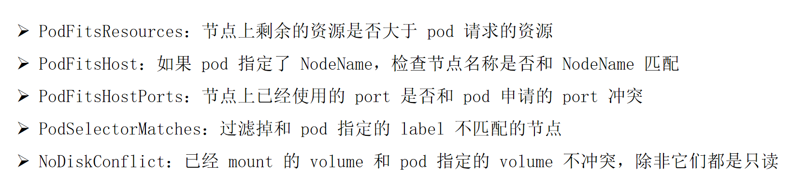


### 调度器 - 优选


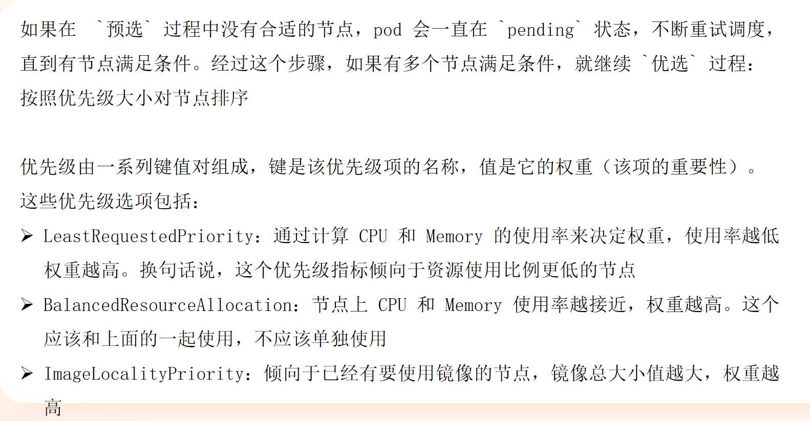

### 调度器 - 综合

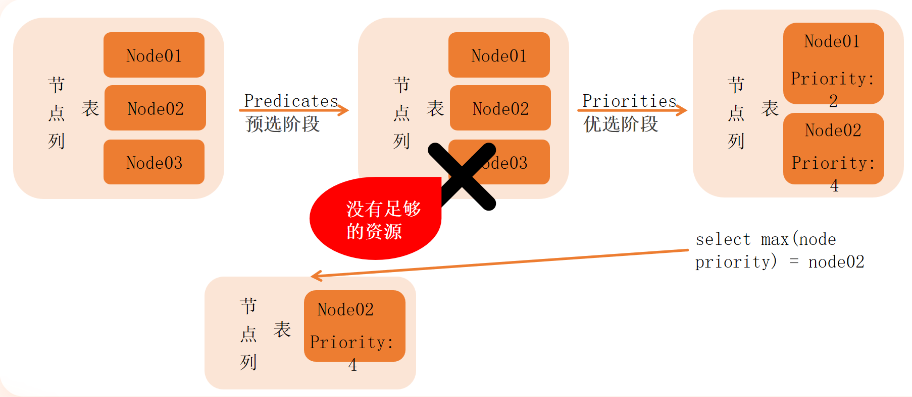


## 亲和性

一种调度的偏好特性


### **Kubernetes Node Affinity（节点亲和性）详解**

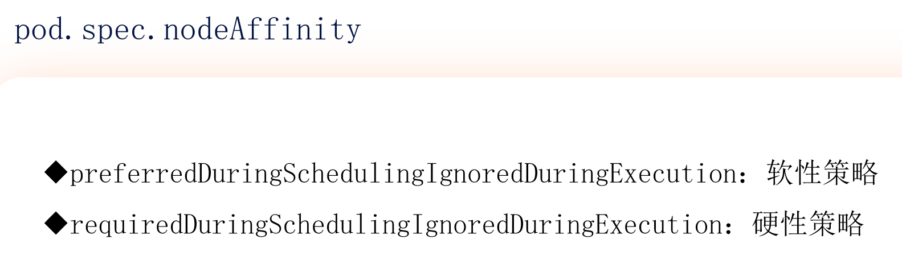


`pod.spec.nodeAffinity` 是 Kubernetes 中用于控制 Pod 调度到特定节点的关键字段，分为 **软性策略** 和 **硬性策略** 两种类型。以下是详细解析：

---

#### **1. 核心概念**
| **策略类型**       | **字段名称**                                      | **调度行为**                                                                 | **适用场景**                     |
|--------------------|------------------------------------------------|----------------------------------------------------------------------------|--------------------------------|
| **软性策略**       | `preferredDuringSchedulingIgnoredDuringExecution` | 优先尝试满足条件，但不强制（如果无匹配节点，仍会调度到其他节点）               | 优化调度（如优先选择 SSD 节点）    |
| **硬性策略**       | `requiredDuringSchedulingIgnoredDuringExecution`   | 必须满足条件，否则 Pod 保持 `Pending` 状态（除非节点标签变更）                | 强制要求（如必须运行在 GPU 节点） |

---

#### **2. 配置示例**
##### **硬性策略（必须满足）**
```yaml
apiVersion: v1
kind: Pod
metadata:
  name: gpu-pod
spec:
  affinity:
    nodeAffinity:
      requiredDuringSchedulingIgnoredDuringExecution:
        nodeSelectorTerms:
        - matchExpressions:
          - key: accelerator
            operator: In
            values: ["gpu"]
  containers:
  - name: nginx
    image: nginx
```
- **作用**：Pod 必须调度到带有 `accelerator=gpu` 标签的节点。
- **关键字段**：
    - `operator`：支持 `In`、`NotIn`、`Exists`、`DoesNotExist` 等。
    - `nodeSelectorTerms`：可定义多个匹配条件（逻辑 `OR` 关系）。

##### **软性策略（优先满足）**
```yaml
spec:
  affinity:
    nodeAffinity:
      preferredDuringSchedulingIgnoredDuringExecution:
      - weight: 80
        preference:
          matchExpressions:
          - key: disktype
            operator: In
            values: ["ssd"]
```
- **作用**：优先选择 `disktype=ssd` 的节点，权重为 80（相对其他软性策略的优先级）。
- **权重范围**：1-100，数值越大优先级越高。

---

#### **3. 行为说明**
- **`IgnoredDuringExecution`**：  
  表示 Pod 运行后，即使节点标签发生变化（如 `gpu` 标签被移除），**也不会驱逐已运行的 Pod**。  
  （如需驱逐，需使用 `requiredDuringSchedulingRequiredDuringExecution`，但当前版本未实现）

- **多条件组合**：
    - 同一策略中多个 `matchExpressions` 是 **`AND` 关系**（必须全部满足）。
    - 多个 `nodeSelectorTerms` 是 **`OR` 关系**（满足任意一个即可）。

---

#### **4. 与 `nodeSelector` 的对比**
| **特性**                | `nodeSelector`       | `nodeAffinity`                     |
|-------------------------|----------------------|------------------------------------|
| 匹配方式                | 简单键值匹配          | 支持复杂表达式（`In`、`NotIn` 等） |
| 多条件逻辑              | 仅 `AND`             | 支持 `AND`/`OR`                    |
| 软性策略                | 不支持               | 支持（`preferredDuringScheduling`）|
| 动态标签更新影响        | 会驱逐 Pod           | 默认不驱逐（`IgnoredDuringExecution`）|

---

#### **5. 使用建议**
1. **硬性策略**用于强制约束：
    - 必须运行在特定硬件（如 GPU、FPGA）
    - 必须满足区域/可用区要求（如 `topology.kubernetes.io/zone=us-east-1a`）

2. **软性策略**用于优化调度：
    - 优先选择空闲资源多的节点
    - 优先选择本地 SSD 磁盘的节点

3. **调试技巧**：
   ```bash
   # 查看节点标签
   kubectl get nodes --show-labels

   # 查看未调度 Pod 的原因
   kubectl describe pod <pending-pod> | grep -A 10 Events
   ```

---

#### **6. 完整示例（软硬策略结合）**
```yaml
apiVersion: v1
kind: Pod
metadata:
  name: advanced-affinity-pod
spec:
  affinity:
    nodeAffinity:
      requiredDuringSchedulingIgnoredDuringExecution:
        nodeSelectorTerms:
        - matchExpressions:
          - key: topology.kubernetes.io/region
            operator: In
            values: ["us-east"]
      preferredDuringSchedulingIgnoredDuringExecution:
      - weight: 60
        preference:
          matchExpressions:
          - key: disktype
            operator: In
            values: ["ssd"]
      - weight: 40
        preference:
          matchExpressions:
          - key: cpu-arch
            operator: In
            values: ["amd64"]
  containers:
  - name: nginx
    image: nginx
```

---

### **总结**
- **软性策略**（`preferred...`）：优化调度，但不保证绝对满足。
- **硬性策略**（`required...`）：强制执行，不满足则 Pod 无法调度。
- 结合使用可实现灵活的资源调度，满足生产环境复杂需求。


### 节点亲和性 - 软策略

#### 3.pod.yaml

```yaml
apiVersion: v1
kind: Pod
metadata:
  name: node-affinity-preferred
  labels:
    app: node-affinity-preferred
spec:
  containers:
  - name: node-affinity-preferred-pod
    image: nginx:1.25  
  affinity:
    nodeAffinity:
      preferredDuringSchedulingIgnoredDuringExecution:
      - weight: 1  # 权重值
        preference:
          matchExpressions:
          - key: domain  # 节点标签键
            operator: In  # 匹配操作符
            values:
            - tangfire  # 节点标签值
```

```bash
[root@k8s-master01 8]# vim 3.pod.yaml
[root@k8s-master01 8]# 
[root@k8s-master01 8]# 
[root@k8s-master01 8]# kubectl get node --show-labels
NAME           STATUS   ROLES           AGE   VERSION   LABELS
k8s-master01   Ready    control-plane   9d    v1.29.2   beta.kubernetes.io/arch=amd64,beta.kubernetes.io/os=linux,kubernetes.io/arch=amd64,kubernetes.io/hostname=k8s-master01,kubernetes.io/os=linux,node-role.kubernetes.io/control-plane=,node.kubernetes.io/exclude-from-external-load-balancers=
k8s-node01     Ready    <none>          9d    v1.29.2   beta.kubernetes.io/arch=amd64,beta.kubernetes.io/os=linux,kubernetes.io/arch=amd64,kubernetes.io/hostname=k8s-node01,kubernetes.io/os=linux
k8s-node02     Ready    <none>          9d    v1.29.2   beta.kubernetes.io/arch=amd64,beta.kubernetes.io/os=linux,kubernetes.io/arch=amd64,kubernetes.io/hostname=k8s-node02,kubernetes.io/os=linux
[root@k8s-master01 8]# kubectl apply -f 3.pod.yaml 
pod/node-affinity-preferred created
[root@k8s-master01 8]# kubectl get pod
NAME                      READY   STATUS    RESTARTS   AGE
node-affinity-preferred   1/1     Running   0          5s
[root@k8s-master01 8]# kubectl get pod -o wide
NAME                      READY   STATUS    RESTARTS   AGE   IP              NODE         NOMINATED NODE   READINESS GATES
node-affinity-preferred   1/1     Running   0          17s   10.244.85.209   k8s-node01   <none>           <none>
[root@k8s-master01 8]# while true;
> do
> kubectl delete -f 3.pod.yaml
> kubectl create -f 3.pod.yaml
> kubectl get pod -o wide
> done
pod "node-affinity-preferred" deleted
pod/node-affinity-preferred created
NAME                      READY   STATUS              RESTARTS   AGE   IP       NODE         NOMINATED NODE   READINESS GATES
node-affinity-preferred   0/1     ContainerCreating   0          1s    <none>   k8s-node01   <none>           <none>
pod "node-affinity-preferred" deleted
pod/node-affinity-preferred created
NAME                      READY   STATUS              RESTARTS   AGE   IP       NODE         NOMINATED NODE   READINESS GATES
node-affinity-preferred   0/1     ContainerCreating   0          0s    <none>   k8s-node02   <none>           <none>
pod "node-affinity-preferred" deleted
pod/node-affinity-preferred created
NAME                      READY   STATUS              RESTARTS   AGE   IP       NODE         NOMINATED NODE   READINESS GATES
node-affinity-preferred   0/1     ContainerCreating   0          0s    <none>   k8s-node01   <none>           <none>
pod "node-affinity-preferred" deleted
pod/node-affinity-preferred created
NAME                      READY   STATUS              RESTARTS   AGE   IP       NODE         NOMINATED NODE   READINESS GATES
node-affinity-preferred   0/1     ContainerCreating   0          0s    <none>   k8s-node02   <none>           <none>
pod "node-affinity-preferred" deleted
pod/node-affinity-preferred created
NAME                      READY   STATUS              RESTARTS   AGE   IP       NODE         NOMINATED NODE   READINESS GATES
node-affinity-preferred   0/1     ContainerCreating   0          0s    <none>   k8s-node02   <none>           <none>
pod "node-affinity-preferred" deleted
pod/node-affinity-preferred created
NAME                      READY   STATUS              RESTARTS   AGE   IP       NODE         NOMINATED NODE   READINESS GATES
node-affinity-preferred   0/1     ContainerCreating   0          0s    <none>   k8s-node02   <none>           <none>
pod "node-affinity-preferred" deleted
pod/node-affinity-preferred created
NAME                      READY   STATUS              RESTARTS   AGE   IP       NODE         NOMINATED NODE   READINESS GATES
node-affinity-preferred   0/1     ContainerCreating   0          0s    <none>   k8s-node02   <none>           <none>
pod "node-affinity-preferred" deleted
pod/node-affinity-preferred created
NAME                      READY   STATUS              RESTARTS   AGE   IP       NODE         NOMINATED NODE   READINESS GATES
node-affinity-preferred   0/1     ContainerCreating   0          0s    <none>   k8s-node02   <none>           <none>
pod "node-affinity-preferred" deleted
pod/node-affinity-preferred created
NAME                      READY   STATUS              RESTARTS   AGE   IP       NODE         NOMINATED NODE   READINESS GATES
node-affinity-preferred   0/1     ContainerCreating   0          0s    <none>   k8s-node01   <none>           <none>
pod "node-affinity-preferred" deleted
^CError from server (AlreadyExists): error when creating "3.pod.yaml": object is being deleted: pods "node-affinity-preferred" already exists
NAME                      READY   STATUS        RESTARTS   AGE   IP       NODE         NOMINATED NODE   READINESS GATES
node-affinity-preferred   0/1     Terminating   0          1s    <none>   k8s-node01   <none>           <none>
pod "node-affinity-preferred" deleted
pod/node-affinity-preferred created
NAME                      READY   STATUS              RESTARTS   AGE   IP       NODE         NOMINATED NODE   READINESS GATES
node-affinity-preferred   0/1     ContainerCreating   0          0s    <none>   k8s-node01   <none>           <none>
pod "node-affinity-preferred" deleted
^Cpod/node-affinity-preferred created
NAME                      READY   STATUS              RESTARTS   AGE   IP       NODE         NOMINATED NODE   READINESS GATES
node-affinity-preferred   0/1     ContainerCreating   0          0s    <none>   k8s-node01   <none>           <none>
pod "node-affinity-preferred" deleted
^CError from server (AlreadyExists): error when creating "3.pod.yaml": object is being deleted: pods "node-affinity-preferred" already exists
NAME                      READY   STATUS        RESTARTS   AGE   IP       NODE         NOMINATED NODE   READINESS GATES
node-affinity-preferred   0/1     Terminating   0          1s    <none>   k8s-node01   <none>           <none>
pod "node-affinity-preferred" deleted
pod/node-affinity-preferred created
NAME                      READY   STATUS              RESTARTS   AGE   IP       NODE         NOMINATED NODE   READINESS GATES
node-affinity-preferred   0/1     ContainerCreating   0          0s    <none>   k8s-node02   <none>           <none>
pod "node-affinity-preferred" deleted
^[pod/node-affinity-preferred created
NAME                      READY   STATUS              RESTARTS   AGE   IP       NODE         NOMINATED NODE   READINESS GATES
node-affinity-preferred   0/1     ContainerCreating   0          0s    <none>   k8s-node01   <none>           <none>
pod "node-affinity-preferred" deleted
qpod/node-affinity-preferred created
NAME                      READY   STATUS              RESTARTS   AGE   IP       NODE         NOMINATED NODE   READINESS GATES
node-affinity-preferred   0/1     ContainerCreating   0          0s    <none>   k8s-node02   <none>           <none>
pod "node-affinity-preferred" deleted
!
pod/node-affinity-preferred created
NAME                      READY   STATUS              RESTARTS   AGE   IP       NODE         NOMINATED NODE   READINESS GATES
node-affinity-preferred   0/1     ContainerCreating   0          0s    <none>   k8s-node02   <none>           <none>
pod "node-affinity-preferred" deleted
^CError from server (AlreadyExists): error when creating "3.pod.yaml": object is being deleted: pods "node-affinity-preferred" already exists
^C
```


```bash
[root@k8s-master01 8]# kubectl label node k8s-node02 domain=tangfire
node/k8s-node02 labeled
[root@k8s-master01 8]# kubectl get node --show-labels
NAME           STATUS   ROLES           AGE   VERSION   LABELS
k8s-master01   Ready    control-plane   9d    v1.29.2   beta.kubernetes.io/arch=amd64,beta.kubernetes.io/os=linux,kubernetes.io/arch=amd64,kubernetes.io/hostname=k8s-master01,kubernetes.io/os=linux,node-role.kubernetes.io/control-plane=,node.kubernetes.io/exclude-from-external-load-balancers=
k8s-node01     Ready    <none>          9d    v1.29.2   beta.kubernetes.io/arch=amd64,beta.kubernetes.io/os=linux,kubernetes.io/arch=amd64,kubernetes.io/hostname=k8s-node01,kubernetes.io/os=linux
k8s-node02     Ready    <none>          9d    v1.29.2   beta.kubernetes.io/arch=amd64,beta.kubernetes.io/os=linux,domain=tangfire,kubernetes.io/arch=amd64,kubernetes.io/hostname=k8s-node02,kubernetes.io/os=linux
[root@k8s-master01 8]# kubectl delete -f 3.pod.yaml 
Error from server (NotFound): error when deleting "3.pod.yaml": pods "node-affinity-preferred" not found
[root@k8s-master01 8]# kubectl get pod
No resources found in default namespace.
[root@k8s-master01 8]# kubectl apply -f 3.pod.yaml 
pod/node-affinity-preferred created
[root@k8s-master01 8]# kubectl get pod
NAME                      READY   STATUS    RESTARTS   AGE
node-affinity-preferred   1/1     Running   0          3s
[root@k8s-master01 8]# kubectl get pod -o wide
NAME                      READY   STATUS    RESTARTS   AGE   IP              NODE         NOMINATED NODE   READINESS GATES
node-affinity-preferred   1/1     Running   0          9s    10.244.58.204   k8s-node02   <none>           <none>
```


### 节点亲和性 - 硬策略

#### 4.pod.yaml

```yaml
apiVersion: v1
kind: Pod
metadata:
  name: node-affinity-required
  labels:
    app: node-affinity-required
spec:
  containers:
    - name: node-affinity-required-pod
      image: nginx:1.25  
      ports:
        - containerPort: 80  # 显式声明容器端口
  affinity:
    nodeAffinity:
      requiredDuringSchedulingIgnoredDuringExecution:
        nodeSelectorTerms:
          - matchExpressions:
              - key: kubernetes.io/hostname  # 内置节点主机名标签
                operator: In  # 匹配操作符
                values:
                  - k8s-node04  # 必须调度到该节点
```


```bash
[root@k8s-master01 8]# vim 4.pod.yaml
[root@k8s-master01 8]# 
[root@k8s-master01 8]# kubectl apply -f 4.pod.yaml 
pod/node-affinity-required created
[root@k8s-master01 8]# kubectl get pod 
NAME                     READY   STATUS    RESTARTS   AGE
node-affinity-required   0/1     Pending   0          6s
[root@k8s-master01 8]# kubectl delete -f 4.pod.yaml 
pod "node-affinity-required" deleted
[root@k8s-master01 8]# kubectl label node k8s-node01 disktype=ssd
node/k8s-node01 labeled
[root@k8s-master01 8]# kubectl label node k8s-node02 disktype=hdd
node/k8s-node02 labeled
[root@k8s-master01 8]# kubectl get node --show-labels
NAME           STATUS   ROLES           AGE   VERSION   LABELS
k8s-master01   Ready    control-plane   9d    v1.29.2   beta.kubernetes.io/arch=amd64,beta.kubernetes.io/os=linux,kubernetes.io/arch=amd64,kubernetes.io/hostname=k8s-master01,kubernetes.io/os=linux,node-role.kubernetes.io/control-plane=,node.kubernetes.io/exclude-from-external-load-balancers=
k8s-node01     Ready    <none>          9d    v1.29.2   beta.kubernetes.io/arch=amd64,beta.kubernetes.io/os=linux,disktype=ssd,kubernetes.io/arch=amd64,kubernetes.io/hostname=k8s-node01,kubernetes.io/os=linux
k8s-node02     Ready    <none>          9d    v1.29.2   beta.kubernetes.io/arch=amd64,beta.kubernetes.io/os=linux,disktype=hdd,domain=tangfire,kubernetes.io/arch=amd64,kubernetes.io/hostname=k8s-node02,kubernetes.io/os=linux
[root@k8s-master01 8]# ls
1.deployment.yaml  3.pod.yaml  4.pod.yaml
[root@k8s-master01 8]# cp -a 4.pod.yaml 5.pod.yaml
[root@k8s-master01 8]# vim 5.pod.yaml 
```

改成如下：


```yaml
apiVersion: v1
kind: Pod
metadata:
  name: node-affinity-required
  labels:
    app: node-affinity-required
spec:
  containers:
    - name: node-affinity-required-pod
      image: nginx:1.25
      ports:
        - containerPort: 80  # 显式声明容器端口
  affinity:
    nodeAffinity:
      requiredDuringSchedulingIgnoredDuringExecution:
        nodeSelectorTerms:
          - matchExpressions:
              - key: disktype
                operator: In  # 匹配操作符
                values:
                  - ssd
```


```bash
[root@k8s-master01 8]# kubectl apply -f 5.pod.yaml 
pod/node-affinity-required created
[root@k8s-master01 8]# kubectl get pod -o wide
NAME                     READY   STATUS    RESTARTS   AGE   IP              NODE         NOMINATED NODE   READINESS GATES
node-affinity-required   1/1     Running   0          5s    10.244.85.212   k8s-node01   <none>           <none>
```

### **Kubernetes Pod 亲和性（Affinity）与反亲和性（Anti-Affinity）详解**

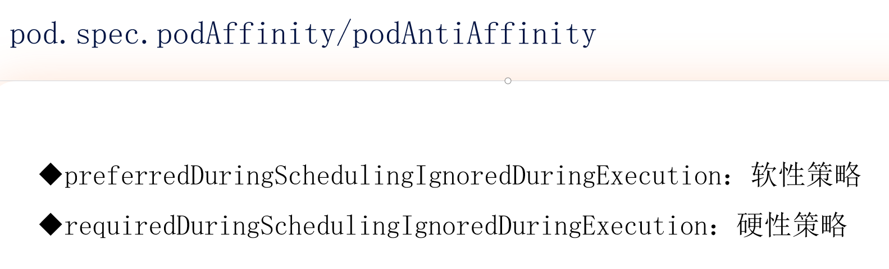

`pod.spec.podAffinity` 和 `pod.spec.podAntiAffinity` 是 Kubernetes 中用于控制 Pod **与其他 Pod 的共存关系**的核心调度策略。以下是两种策略的对比和详细说明：

---

#### **1. 核心概念对比**
| **策略类型**       | **作用**                                                                 | **典型应用场景**                     |
|--------------------|--------------------------------------------------------------------------|------------------------------------|
| **Pod Affinity**    | 让 Pod **靠近**某些 Pod 运行（例如：前端 Pod 和后端 Pod 部署在同一可用区） | 减少网络延迟、提高通信性能            |
| **Pod Anti-Affinity** | 让 Pod **远离**某些 Pod 运行（例如：同一服务的多个副本分散在不同节点）    | 提高容错性、避免资源竞争              |

---

#### **2. 调度约束强度**
图片中提到的两种策略强度适用于 `podAffinity` 和 `podAntiAffinity`：

##### **（1）软性策略**
`preferredDuringSchedulingIgnoredDuringExecution`
- **行为**：优先满足条件，但不强制（无合适节点时仍会调度）
- **示例**：
  ```yaml
  affinity:
    podAntiAffinity:
      preferredDuringSchedulingIgnoredDuringExecution:
      - weight: 100  # 权重值（1-100）
        podAffinityTerm:
          labelSelector:
            matchLabels:
              app: mysql  # 避免与mysql Pod同节点
          topologyKey: kubernetes.io/hostname
  ```

##### **（2）硬性策略**
`requiredDuringSchedulingIgnoredDuringExecution`
- **行为**：必须满足条件，否则 Pod 保持 `Pending` 状态
- **示例**：
  ```yaml
  affinity:
    podAffinity:
      requiredDuringSchedulingIgnoredDuringExecution:
      - labelSelector:
          matchLabels:
            app: cache  # 必须与cache Pod同区域
        topologyKey: topology.kubernetes.io/zone
  ```

---

#### **3. 关键字段解析**
| **字段**                     | **说明**                                                                 |
|------------------------------|--------------------------------------------------------------------------|
| `labelSelector.matchLabels`   | 选择目标 Pod 的标签（决定亲和/反亲和的对象）                                |
| `topologyKey`                | 指定拓扑域（如 `hostname`、`zone`、`region`）                            |
| `weight` (仅软性策略)        | 权重值（1-100），多个规则时决定优先级                                     |
| `IgnoredDuringExecution`     | Pod 运行后，即使条件不再满足也不会被驱逐                                   |

---

#### **4. 完整示例**
##### **场景 1：高可用 MySQL（反亲和性）**
```yaml
apiVersion: apps/v1
kind: Deployment
metadata:
  name: mysql
spec:
  replicas: 3
  template:
    spec:
      affinity:
        podAntiAffinity:
          requiredDuringSchedulingIgnoredDuringExecution:
          - labelSelector:
              matchLabels:
                app: mysql
            topologyKey: kubernetes.io/hostname  # 强制不同节点
      containers:
      - name: mysql
        image: mysql:8.0
```

##### **场景 2：前端与缓存就近部署（亲和性）**
```yaml
apiVersion: apps/v1
kind: Deployment
metadata:
  name: frontend
spec:
  template:
    spec:
      affinity:
        podAffinity:
          preferredDuringSchedulingIgnoredDuringExecution:
          - weight: 80
            podAffinityTerm:
              labelSelector:
                matchLabels:
                  app: redis-cache
              topologyKey: topology.kubernetes.io/zone  # 优先同可用区
      containers:
      - name: nginx
        image: nginx
```

---

#### **5. 注意事项**
1. **性能影响**：  
   复杂的亲和性规则会增加调度器计算负担，建议在超过 100 个节点的集群中慎用。

2. **拓扑域选择**：
    - `hostname`：节点级隔离
    - `zone`/`region`：跨可用区或地域部署

3. **调试命令**：
   ```bash
   # 查看未调度 Pod 的原因
   kubectl describe pod <pending-pod> | grep -A 10 Events
   
   # 检查节点拓扑标签
   kubectl get nodes --show-labels | grep -E 'hostname|zone|region'
   ```

---

### **总结**
- **亲和性** (`podAffinity`)：实现 Pod 的“聚拢”部署，优化性能
- **反亲和性** (`podAntiAffinity`)：实现 Pod 的“分散”部署，提高容错
- **软硬策略结合**：可构建精细化的调度规则，例如：
    - 必须分散在不同机柜（硬性）
    - 优先靠近日志收集 Pod（软性）


### Pod亲和性 - 软策略

#### 6.pod.yaml

```yaml
apiVersion: v1
kind: Pod
metadata:
  name: pod-aff-prefer
  labels:
    app: pod-aff
spec:
  containers:
  - name: myapp
    image: nginx:1.25
  affinity:
    podAffinity:
      preferredDuringSchedulingIgnoredDuringExecution:
      - weight: 1  # 权重值
        podAffinityTerm:
          labelSelector:
            matchExpressions:
            - key: app  # 目标Pod标签键
              operator: In  # 匹配操作符
              values:
              - pod-1  # 目标Pod标签值
          topologyKey: kubernetes.io/hostname  # 拓扑域
```

```bash
[root@k8s-master01 8]# vim 6.pod.yaml
[root@k8s-master01 8]# 
[root@k8s-master01 8]# kubectl get pod --show-labels
No resources found in default namespace.
[root@k8s-master01 8]# kubectl create -f 6.pod.yaml 
pod/pod-aff-prefer created
[root@k8s-master01 8]# kubectl get pod -o wide
NAME             READY   STATUS    RESTARTS   AGE   IP              NODE         NOMINATED NODE   READINESS GATES
pod-aff-prefer   1/1     Running   0          9s    10.244.85.210   k8s-node01   <none>           <none>
```

#### 7.pod.yaml

```yaml
apiVersion: v1
kind: Pod
metadata:
  name: target-pod
  labels:
    app: pod-1  # 这是亲和性规则要匹配的标签
spec:
  containers:
  - name: nginx
    image: nginx:1.25
    ports:
    - containerPort: 80
```


```bash
[root@k8s-master01 8]# kubectl delete -f 6.pod.yaml 
pod "pod-aff-prefer" deleted
[root@k8s-master01 8]# ls
1.deployment.yaml  3.pod.yaml  4.pod.yaml  5.pod.yaml  6.pod.yaml
[root@k8s-master01 8]# vim 7.pod.yaml
[root@k8s-master01 8]# 
[root@k8s-master01 8]# 
[root@k8s-master01 8]# kubectl create -f 7.pod.yaml 
pod/target-pod created
[root@k8s-master01 8]# 
[root@k8s-master01 8]# kubectl get pod
NAME         READY   STATUS    RESTARTS   AGE
target-pod   1/1     Running   0          5s
[root@k8s-master01 8]# kubectl get pod --show-labels
NAME         READY   STATUS    RESTARTS   AGE   LABELS
target-pod   1/1     Running   0          13s   app=pod-1
[root@k8s-master01 8]# kubectl get pod -o wide
NAME         READY   STATUS    RESTARTS   AGE   IP              NODE         NOMINATED NODE   READINESS GATES
target-pod   1/1     Running   0          34s   10.244.85.211   k8s-node01   <none>           <none>
[root@k8s-master01 8]# kubectl get node k8s-node02 --show-labels
NAME         STATUS   ROLES    AGE   VERSION   LABELS
k8s-node02   Ready    <none>   9d    v1.29.2   beta.kubernetes.io/arch=amd64,beta.kubernetes.io/os=linux,disktype=hdd,domain=tangfire,kubernetes.io/arch=amd64,kubernetes.io/hostname=k8s-node02,kubernetes.io/os=linux
[root@k8s-master01 8]# kubectl apply -f 6.pod.yaml 
pod/pod-aff-prefer created
[root@k8s-master01 8]# kubectl get pod -o wide
NAME             READY   STATUS    RESTARTS   AGE    IP              NODE         NOMINATED NODE   READINESS GATES
pod-aff-prefer   1/1     Running   0          6s     10.244.85.213   k8s-node01   <none>           <none>
target-pod       1/1     Running   0          114s   10.244.85.211   k8s-node01   <none>           <none>
```


### Pod亲和性 - 硬策略

#### 8.pod.yaml

```yaml
apiVersion: v1
kind: Pod
metadata:
  name: pod-aff-req
  labels:
    app: pod-aff-req
spec:
  containers:
    - name: pod-aff-req-c
      image: nginx:1.25
  affinity:
    podAffinity:
      requiredDuringSchedulingIgnoredDuringExecution:
        - labelSelector:
            matchExpressions:
              - key: app
                operator: In
                values:
                  - pod-1
          topologyKey: kubernetes.io/hostname  # 必须与目标Pod同节点
```


```bash
[root@k8s-master01 8]# vim 8.pod.yaml
[root@k8s-master01 8]# 
[root@k8s-master01 8]# kubectl apply -f 8.pod.yaml 
pod/pod-aff-req created
[root@k8s-master01 8]# kubectl get pod
NAME          READY   STATUS    RESTARTS   AGE
pod-aff-req   0/1     Pending   0          5s
[root@k8s-master01 8]# 
[root@k8s-master01 8]# kubectl apply -f 7.pod.yaml 
pod/target-pod created
[root@k8s-master01 8]# kubectl get pod -o wide
NAME          READY   STATUS    RESTARTS   AGE   IP              NODE         NOMINATED NODE   READINESS GATES
pod-aff-req   1/1     Running   0          14m   10.244.58.202   k8s-node02   <none>           <none>
target-pod    1/1     Running   0          5s    10.244.58.201   k8s-node02   <none>           <none>
```


### Pod反亲和性 - 软策略

#### 9.pod.yaml

```yaml
apiVersion: v1
kind: Pod
metadata:
  name: pod-antiaff-prefer
  labels:
    app: pod-aff
spec:
  containers:
  - name: myapp
    image: nginx:1.25  
  affinity:
    podAntiAffinity:
      preferredDuringSchedulingIgnoredDuringExecution:
      - weight: 1  # 权重值
        podAffinityTerm:
          labelSelector:
            matchExpressions:
            - key: app  # 目标Pod标签键
              operator: In  # 匹配操作符
              values:
              - pod-2  # 目标Pod标签值
          topologyKey: kubernetes.io/hostname  # 拓扑域

```

#### 10.pod.yaml

```yaml
apiVersion: v1
kind: Pod
metadata:
  name: target-pod
  labels:
    app: pod-2
spec:
  containers:
  - name: nginx
    image: nginx:1.25
    ports:
    - containerPort: 80
```


```bash
[root@k8s-master01 8]# kubectl apply -f 10.pod.yaml 
pod/target-pod created
[root@k8s-master01 8]# kubectl get pod -o wide
NAME         READY   STATUS    RESTARTS   AGE   IP              NODE         NOMINATED NODE   READINESS GATES
target-pod   1/1     Running   0          2s    10.244.85.215   k8s-node01   <none>           <none>
[root@k8s-master01 8]# kubectl apply -f 9.pod.yaml 
pod/pod-antiaff-prefer created
[root@k8s-master01 8]# kubectl get pod -o wide
NAME                 READY   STATUS    RESTARTS   AGE   IP              NODE         NOMINATED NODE   READINESS GATES
pod-antiaff-prefer   1/1     Running   0          1s    10.244.58.209   k8s-node02   <none>           <none>
target-pod           1/1     Running   0          10s   10.244.85.215   k8s-node01   <none>           <none>
```

### Pod反亲和性 - 硬策略


#### 11.pod.yaml

```yaml
apiVersion: v1
kind: Pod
metadata:
  name: pod-aff-req
  labels:
    app: pod-aff-req
spec:
  containers:
    - name: pod-aff-req-c
      image: nginx:1.25
  affinity:
    podAntiAffinity:
      requiredDuringSchedulingIgnoredDuringExecution:  # 硬性反亲和规则
      - labelSelector:
          matchExpressions:
          - key: app
            operator: In
            values:
            - pod-2
        topologyKey: kubernetes.io/hostname  # 节点级反亲和
```


#### 12.pod.yaml

```yaml
apiVersion: v1
kind: Pod
metadata:
  name: target-pod-01
  labels:
    app: pod-2
spec:
  nodeName: k8s-node01
  containers:
  - name: nginx
    image: nginx:1.25
    ports:
    - containerPort: 80
  
---

apiVersion: v1
kind: Pod
metadata:
  name: target-pod-02
  labels:
    app: pod-2
spec:
  nodeName: k8s-node02
  containers:
    - name: nginx
      image: nginx:1.25
      ports:
        - containerPort: 80
```


```bash
[root@k8s-master01 8]# kubectl delete pod --all
pod "pod-antiaff-prefer" deleted
pod "target-pod" deleted
[root@k8s-master01 8]# 
[root@k8s-master01 8]# 
[root@k8s-master01 8]# kubectl get pod
No resources found in default namespace.
[root@k8s-master01 8]# 
[root@k8s-master01 8]# vim 12.pod.yaml
[root@k8s-master01 8]# 
[root@k8s-master01 8]# kubectl apply -f 12.pod.yaml 
pod/target-pod-01 created
pod/target-pod-02 created
[root@k8s-master01 8]# kubectl get pod -o wide
NAME            READY   STATUS    RESTARTS   AGE   IP              NODE         NOMINATED NODE   READINESS GATES
target-pod-01   1/1     Running   0          6s    10.244.85.216   k8s-node01   <none>           <none>
target-pod-02   1/1     Running   0          6s    10.244.58.206   k8s-node02   <none>           <none>
[root@k8s-master01 8]# vim 11.pod.yaml
[root@k8s-master01 8]# 
[root@k8s-master01 8]# 
[root@k8s-master01 8]# kubectl apply -f 11.pod.yaml 
pod/pod-aff-req created
[root@k8s-master01 8]# kubectl get pod -o wide
NAME            READY   STATUS    RESTARTS   AGE   IP              NODE         NOMINATED NODE   READINESS GATES
pod-aff-req     0/1     Pending   0          7s    <none>          <none>       <none>           <none>
target-pod-01   1/1     Running   0          52s   10.244.85.216   k8s-node01   <none>           <none>
target-pod-02   1/1     Running   0          52s   10.244.58.206   k8s-node02   <none>           <none>
```


### 亲和性 - 总结


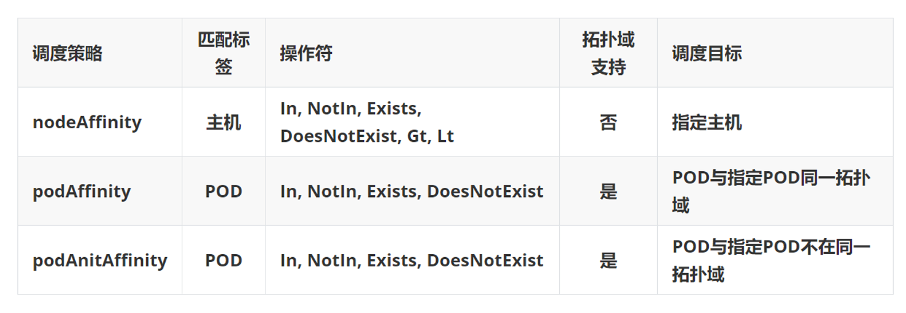


## 容忍与污点

一种排斥的特性

### 污点和容忍


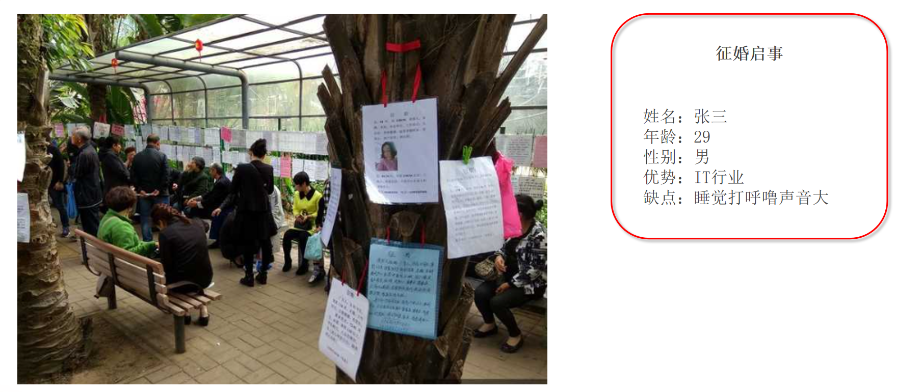


### 污点容忍 - 概念

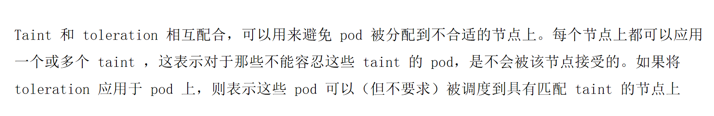


### 污点 - 组成

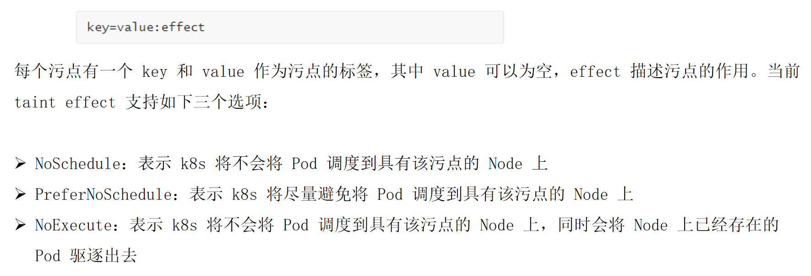


```bash
[root@k8s-master01 8]# kubectl describe node k8s-master01
Name:               k8s-master01
Roles:              control-plane
Labels:             beta.kubernetes.io/arch=amd64
                    beta.kubernetes.io/os=linux
                    kubernetes.io/arch=amd64
                    kubernetes.io/hostname=k8s-master01
                    kubernetes.io/os=linux
                    node-role.kubernetes.io/control-plane=
                    node.kubernetes.io/exclude-from-external-load-balancers=
Annotations:        kubeadm.alpha.kubernetes.io/cri-socket: unix:///var/run/cri-dockerd.sock
                    node.alpha.kubernetes.io/ttl: 0
                    projectcalico.org/IPv4Address: 192.168.120.11/24
                    volumes.kubernetes.io/controller-managed-attach-detach: true
CreationTimestamp:  Thu, 03 Jul 2025 20:55:33 +0800
Taints:             node-role.kubernetes.io/control-plane:NoSchedule
Unschedulable:      false
Lease:
  HolderIdentity:  k8s-master01
  AcquireTime:     <unset>
  RenewTime:       Sun, 13 Jul 2025 16:38:06 +0800
Conditions:
  Type                 Status  LastHeartbeatTime                 LastTransitionTime                Reason                       Message
  ----                 ------  -----------------                 ------------------                ------                       -------
  NetworkUnavailable   False   Fri, 04 Jul 2025 10:58:24 +0800   Fri, 04 Jul 2025 10:58:24 +0800   CalicoIsUp                   Calico is running on this node
  MemoryPressure       False   Sun, 13 Jul 2025 16:35:59 +0800   Thu, 03 Jul 2025 20:55:30 +0800   KubeletHasSufficientMemory   kubelet has sufficient memory available
  DiskPressure         False   Sun, 13 Jul 2025 16:35:59 +0800   Thu, 03 Jul 2025 20:55:30 +0800   KubeletHasNoDiskPressure     kubelet has no disk pressure
  PIDPressure          False   Sun, 13 Jul 2025 16:35:59 +0800   Thu, 03 Jul 2025 20:55:30 +0800   KubeletHasSufficientPID      kubelet has sufficient PID available
  Ready                True    Sun, 13 Jul 2025 16:35:59 +0800   Thu, 03 Jul 2025 21:22:30 +0800   KubeletReady                 kubelet is posting ready status
Addresses:
  InternalIP:  192.168.120.11
  Hostname:    k8s-master01
Capacity:
  cpu:                4
  ephemeral-storage:  97532Mi
  hugepages-1Gi:      0
  hugepages-2Mi:      0
  memory:             3714624Ki
  pods:               110
Allocatable:
  cpu:                4
  ephemeral-storage:  92042742837
  hugepages-1Gi:      0
  hugepages-2Mi:      0
  memory:             3612224Ki
  pods:               110
System Info:
  Machine ID:                 a89f8d4d64f8463e85263e4c761013a9
  System UUID:                72014d56-87ec-22b7-3752-26ed02c6d66b
  Boot ID:                    82220370-2156-4939-a005-3c1d7aece297
  Kernel Version:             5.14.0-427.13.1.el9_4.x86_64
  OS Image:                   Rocky Linux 9.4 (Blue Onyx)
  Operating System:           linux
  Architecture:               amd64
  Container Runtime Version:  docker://28.3.0
  Kubelet Version:            v1.29.2
  Kube-Proxy Version:         v1.29.2
PodCIDR:                      10.244.0.0/24
PodCIDRs:                     10.244.0.0/24
Non-terminated Pods:          (9 in total)
  Namespace                   Name                                        CPU Requests  CPU Limits  Memory Requests  Memory Limits  Age
  ---------                   ----                                        ------------  ----------  ---------------  -------------  ---
  kube-system                 calico-kube-controllers-558d465845-d8msr    0 (0%)        0 (0%)      0 (0%)           0 (0%)         9d
  kube-system                 calico-node-59bdv                           250m (6%)     0 (0%)      0 (0%)           0 (0%)         9d
  kube-system                 coredns-857d9ff4c9-drmqk                    100m (2%)     0 (0%)      70Mi (1%)        170Mi (4%)     9d
  kube-system                 coredns-857d9ff4c9-jknr4                    100m (2%)     0 (0%)      70Mi (1%)        170Mi (4%)     9d
  kube-system                 etcd-k8s-master01                           100m (2%)     0 (0%)      100Mi (2%)       0 (0%)         9d
  kube-system                 kube-apiserver-k8s-master01                 250m (6%)     0 (0%)      0 (0%)           0 (0%)         9d
  kube-system                 kube-controller-manager-k8s-master01        200m (5%)     0 (0%)      0 (0%)           0 (0%)         9d
  kube-system                 kube-proxy-275ph                            0 (0%)        0 (0%)      0 (0%)           0 (0%)         4d2h
  kube-system                 kube-scheduler-k8s-master01                 100m (2%)     0 (0%)      0 (0%)           0 (0%)         9d
Allocated resources:
  (Total limits may be over 100 percent, i.e., overcommitted.)
  Resource           Requests     Limits
  --------           --------     ------
  cpu                1100m (27%)  0 (0%)
  memory             240Mi (6%)   340Mi (9%)
  ephemeral-storage  0 (0%)       0 (0%)
  hugepages-1Gi      0 (0%)       0 (0%)
  hugepages-2Mi      0 (0%)       0 (0%)
Events:              <none>
```

我们可以看见：

```bash
Taints:             node-role.kubernetes.io/control-plane:NoSchedule
```

### 污点 - 设置和去除

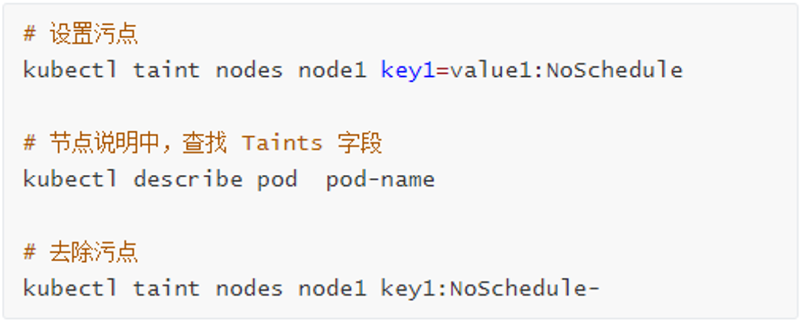


```bash
[root@k8s-master01 8]# kubectl taint node k8s-master01 computeengine=gpu:NoSchedule
node/k8s-master01 tainted
[root@k8s-master01 8]# kubectl taint node k8s-master01 computeengine=gpu:NoSchedule-
node/k8s-master01 untainted
```

```bash
[root@k8s-master01 8]# kubectl taint node k8s-master01 node-role.kubernetes.io/control-plane:NoSchedule-
node/k8s-master01 untainted

[root@k8s-master01 8]# kubectl create deployment myapp --image=nginx:1.25 --replicas=10
deployment.apps/myapp created
[root@k8s-master01 8]# kubectl get pod -o wide
NAME                    READY   STATUS    RESTARTS   AGE   IP              NODE           NOMINATED NODE   READINESS GATES
myapp-59469d48b-2mhjn   1/1     Running   0          17s   10.244.32.141   k8s-master01   <none>           <none>
myapp-59469d48b-7dh89   1/1     Running   0          17s   10.244.58.215   k8s-node02     <none>           <none>
myapp-59469d48b-92zr5   1/1     Running   0          17s   10.244.58.210   k8s-node02     <none>           <none>
myapp-59469d48b-dfzxs   1/1     Running   0          17s   10.244.85.218   k8s-node01     <none>           <none>
myapp-59469d48b-ds547   1/1     Running   0          17s   10.244.85.221   k8s-node01     <none>           <none>
myapp-59469d48b-kqx8b   1/1     Running   0          17s   10.244.32.143   k8s-master01   <none>           <none>
myapp-59469d48b-ljsg9   1/1     Running   0          17s   10.244.32.142   k8s-master01   <none>           <none>
myapp-59469d48b-ncrz4   1/1     Running   0          17s   10.244.58.211   k8s-node02     <none>           <none>
myapp-59469d48b-q4tcx   1/1     Running   0          17s   10.244.85.220   k8s-node01     <none>           <none>
myapp-59469d48b-zgwfb   1/1     Running   0          17s   10.244.85.217   k8s-node01     <none>           <none>
```


```bash
[root@k8s-master01 8]# kubectl taint node k8s-master01 node-role.kubernetes.io/control-plane:NoSchedule
node/k8s-master01 tainted
[root@k8s-master01 8]# kubectl describe node k8s-master0
Name:               k8s-master01
Roles:              control-plane
Labels:             beta.kubernetes.io/arch=amd64
                    beta.kubernetes.io/os=linux
                    kubernetes.io/arch=amd64
                    kubernetes.io/hostname=k8s-master01
                    kubernetes.io/os=linux
                    node-role.kubernetes.io/control-plane=
                    node.kubernetes.io/exclude-from-external-load-balancers=
Annotations:        kubeadm.alpha.kubernetes.io/cri-socket: unix:///var/run/cri-dockerd.sock
                    node.alpha.kubernetes.io/ttl: 0
                    projectcalico.org/IPv4Address: 192.168.120.11/24
                    volumes.kubernetes.io/controller-managed-attach-detach: true
CreationTimestamp:  Thu, 03 Jul 2025 20:55:33 +0800
Taints:             node-role.kubernetes.io/control-plane:NoSchedule
Unschedulable:      false
Lease:
  HolderIdentity:  k8s-master01
  AcquireTime:     <unset>
  RenewTime:       Sun, 13 Jul 2025 17:12:38 +0800
Conditions:
  Type                 Status  LastHeartbeatTime                 LastTransitionTime                Reason                       Message
  ----                 ------  -----------------                 ------------------                ------                       -------
  NetworkUnavailable   False   Fri, 04 Jul 2025 10:58:24 +0800   Fri, 04 Jul 2025 10:58:24 +0800   CalicoIsUp                   Calico is running on this node
  MemoryPressure       False   Sun, 13 Jul 2025 17:09:11 +0800   Thu, 03 Jul 2025 20:55:30 +0800   KubeletHasSufficientMemory   kubelet has sufficient memory available
  DiskPressure         False   Sun, 13 Jul 2025 17:09:11 +0800   Thu, 03 Jul 2025 20:55:30 +0800   KubeletHasNoDiskPressure     kubelet has no disk pressure
  PIDPressure          False   Sun, 13 Jul 2025 17:09:11 +0800   Thu, 03 Jul 2025 20:55:30 +0800   KubeletHasSufficientPID      kubelet has sufficient PID available
  Ready                True    Sun, 13 Jul 2025 17:09:11 +0800   Thu, 03 Jul 2025 21:22:30 +0800   KubeletReady                 kubelet is posting ready status
Addresses:
  InternalIP:  192.168.120.11
  Hostname:    k8s-master01
Capacity:
  cpu:                4
  ephemeral-storage:  97532Mi
  hugepages-1Gi:      0
  hugepages-2Mi:      0
  memory:             3714624Ki
  pods:               110
Allocatable:
  cpu:                4
  ephemeral-storage:  92042742837
  hugepages-1Gi:      0
  hugepages-2Mi:      0
  memory:             3612224Ki
  pods:               110
System Info:
  Machine ID:                 a89f8d4d64f8463e85263e4c761013a9
  System UUID:                72014d56-87ec-22b7-3752-26ed02c6d66b
  Boot ID:                    82220370-2156-4939-a005-3c1d7aece297
  Kernel Version:             5.14.0-427.13.1.el9_4.x86_64
  OS Image:                   Rocky Linux 9.4 (Blue Onyx)
  Operating System:           linux
  Architecture:               amd64
  Container Runtime Version:  docker://28.3.0
  Kubelet Version:            v1.29.2
  Kube-Proxy Version:         v1.29.2
PodCIDR:                      10.244.0.0/24
PodCIDRs:                     10.244.0.0/24
Non-terminated Pods:          (9 in total)
  Namespace                   Name                                        CPU Requests  CPU Limits  Memory Requests  Memory Limits  Age
  ---------                   ----                                        ------------  ----------  ---------------  -------------  ---
  kube-system                 calico-kube-controllers-558d465845-d8msr    0 (0%)        0 (0%)      0 (0%)           0 (0%)         9d
  kube-system                 calico-node-59bdv                           250m (6%)     0 (0%)      0 (0%)           0 (0%)         9d
  kube-system                 coredns-857d9ff4c9-drmqk                    100m (2%)     0 (0%)      70Mi (1%)        170Mi (4%)     9d
  kube-system                 coredns-857d9ff4c9-jknr4                    100m (2%)     0 (0%)      70Mi (1%)        170Mi (4%)     9d
  kube-system                 etcd-k8s-master01                           100m (2%)     0 (0%)      100Mi (2%)       0 (0%)         9d
  kube-system                 kube-apiserver-k8s-master01                 250m (6%)     0 (0%)      0 (0%)           0 (0%)         9d
  kube-system                 kube-controller-manager-k8s-master01        200m (5%)     0 (0%)      0 (0%)           0 (0%)         9d
  kube-system                 kube-proxy-275ph                            0 (0%)        0 (0%)      0 (0%)           0 (0%)         4d3h
  kube-system                 kube-scheduler-k8s-master01                 100m (2%)     0 (0%)      0 (0%)           0 (0%)         9d
Allocated resources:
  (Total limits may be over 100 percent, i.e., overcommitted.)
  Resource           Requests     Limits
  --------           --------     ------
  cpu                1100m (27%)  0 (0%)
  memory             240Mi (6%)   340Mi (9%)
  ephemeral-storage  0 (0%)       0 (0%)
  hugepages-1Gi      0 (0%)       0 (0%)
  hugepages-2Mi      0 (0%)       0 (0%)
Events:              <none>

```

```bash
[root@k8s-master01 8]# kubectl get pod -A | grep master01
kube-system        etcd-k8s-master01                          1/1     Running   3 (9d ago)   9d
kube-system        kube-apiserver-k8s-master01                1/1     Running   3 (9d ago)   9d
kube-system        kube-controller-manager-k8s-master01       1/1     Running   3 (9d ago)   9d
kube-system        kube-scheduler-k8s-master01                1/1     Running   3 (9d ago)   9d
```


### 容忍 - 概念

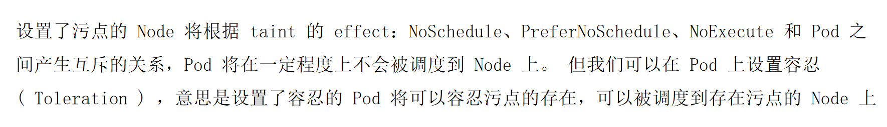


### 容忍 - 设置方式


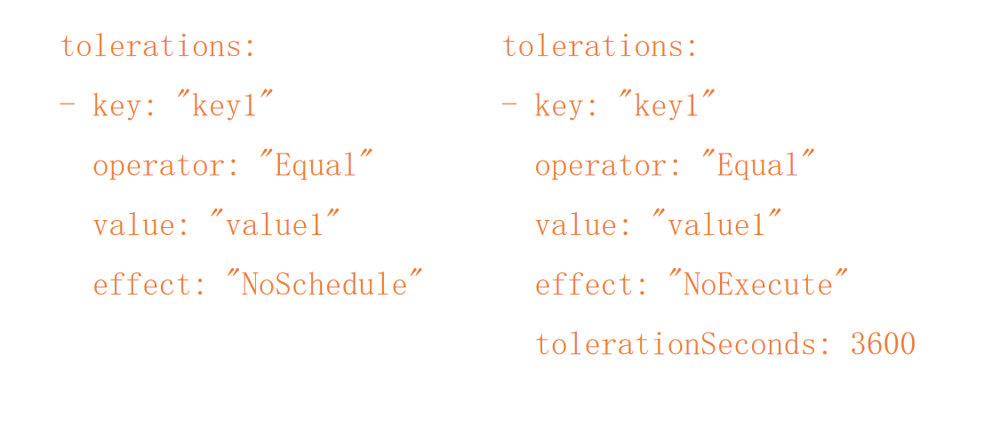


### 容忍 - 特殊类型 - 1

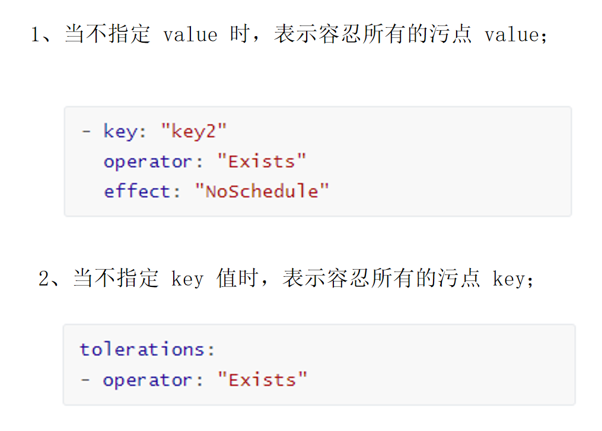


### 容忍 - 特殊类型 - 2


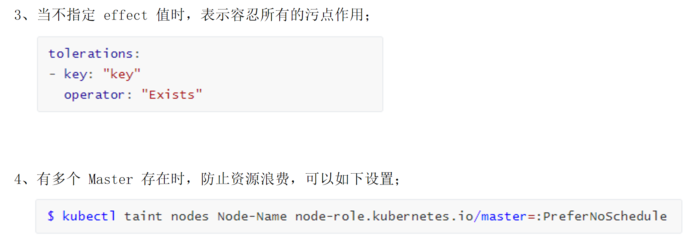


### 容忍 - 实验

```bash
[root@k8s-master01 8]# kubectl describe node k8s-master01
Name:               k8s-master01
Roles:              control-plane
Labels:             beta.kubernetes.io/arch=amd64
                    beta.kubernetes.io/os=linux
                    kubernetes.io/arch=amd64
                    kubernetes.io/hostname=k8s-master01
                    kubernetes.io/os=linux
                    node-role.kubernetes.io/control-plane=
                    node.kubernetes.io/exclude-from-external-load-balancers=
Annotations:        kubeadm.alpha.kubernetes.io/cri-socket: unix:///var/run/cri-dockerd.sock
                    node.alpha.kubernetes.io/ttl: 0
                    projectcalico.org/IPv4Address: 192.168.120.11/24
                    volumes.kubernetes.io/controller-managed-attach-detach: true
CreationTimestamp:  Thu, 03 Jul 2025 20:55:33 +0800
Taints:             node-role.kubernetes.io/control-plane:NoSchedule
Unschedulable:      false
Lease:
  HolderIdentity:  k8s-master01
  AcquireTime:     <unset>
  RenewTime:       Sun, 13 Jul 2025 19:09:42 +0800
Conditions:
  Type                 Status  LastHeartbeatTime                 LastTransitionTime                Reason                       Message
  ----                 ------  -----------------                 ------------------                ------                       -------
  NetworkUnavailable   False   Fri, 04 Jul 2025 10:58:24 +0800   Fri, 04 Jul 2025 10:58:24 +0800   CalicoIsUp                   Calico is running on this node
  MemoryPressure       False   Sun, 13 Jul 2025 19:06:37 +0800   Thu, 03 Jul 2025 20:55:30 +0800   KubeletHasSufficientMemory   kubelet has sufficient memory available
  DiskPressure         False   Sun, 13 Jul 2025 19:06:37 +0800   Thu, 03 Jul 2025 20:55:30 +0800   KubeletHasNoDiskPressure     kubelet has no disk pressure
  PIDPressure          False   Sun, 13 Jul 2025 19:06:37 +0800   Thu, 03 Jul 2025 20:55:30 +0800   KubeletHasSufficientPID      kubelet has sufficient PID available
  Ready                True    Sun, 13 Jul 2025 19:06:37 +0800   Thu, 03 Jul 2025 21:22:30 +0800   KubeletReady                 kubelet is posting ready status
Addresses:
  InternalIP:  192.168.120.11
  Hostname:    k8s-master01
Capacity:
  cpu:                4
  ephemeral-storage:  97532Mi
  hugepages-1Gi:      0
  hugepages-2Mi:      0
  memory:             3714624Ki
  pods:               110
Allocatable:
  cpu:                4
  ephemeral-storage:  92042742837
  hugepages-1Gi:      0
  hugepages-2Mi:      0
  memory:             3612224Ki
  pods:               110
System Info:
  Machine ID:                 a89f8d4d64f8463e85263e4c761013a9
  System UUID:                72014d56-87ec-22b7-3752-26ed02c6d66b
  Boot ID:                    82220370-2156-4939-a005-3c1d7aece297
  Kernel Version:             5.14.0-427.13.1.el9_4.x86_64
  OS Image:                   Rocky Linux 9.4 (Blue Onyx)
  Operating System:           linux
  Architecture:               amd64
  Container Runtime Version:  docker://28.3.0
  Kubelet Version:            v1.29.2
  Kube-Proxy Version:         v1.29.2
PodCIDR:                      10.244.0.0/24
PodCIDRs:                     10.244.0.0/24
Non-terminated Pods:          (9 in total)
  Namespace                   Name                                        CPU Requests  CPU Limits  Memory Requests  Memory Limits  Age
  ---------                   ----                                        ------------  ----------  ---------------  -------------  ---
  kube-system                 calico-kube-controllers-558d465845-d8msr    0 (0%)        0 (0%)      0 (0%)           0 (0%)         9d
  kube-system                 calico-node-59bdv                           250m (6%)     0 (0%)      0 (0%)           0 (0%)         9d
  kube-system                 coredns-857d9ff4c9-drmqk                    100m (2%)     0 (0%)      70Mi (1%)        170Mi (4%)     9d
  kube-system                 coredns-857d9ff4c9-jknr4                    100m (2%)     0 (0%)      70Mi (1%)        170Mi (4%)     9d
  kube-system                 etcd-k8s-master01                           100m (2%)     0 (0%)      100Mi (2%)       0 (0%)         9d
  kube-system                 kube-apiserver-k8s-master01                 250m (6%)     0 (0%)      0 (0%)           0 (0%)         9d
  kube-system                 kube-controller-manager-k8s-master01        200m (5%)     0 (0%)      0 (0%)           0 (0%)         9d
  kube-system                 kube-proxy-275ph                            0 (0%)        0 (0%)      0 (0%)           0 (0%)         4d5h
  kube-system                 kube-scheduler-k8s-master01                 100m (2%)     0 (0%)      0 (0%)           0 (0%)         9d
Allocated resources:
  (Total limits may be over 100 percent, i.e., overcommitted.)
  Resource           Requests     Limits
  --------           --------     ------
  cpu                1100m (27%)  0 (0%)
  memory             240Mi (6%)   340Mi (9%)
  ephemeral-storage  0 (0%)       0 (0%)
  hugepages-1Gi      0 (0%)       0 (0%)
  hugepages-2Mi      0 (0%)       0 (0%)
Events:              <none>
[root@k8s-master01 8]# kubectl taint node k8s-master01 node-role.kubernetes.io/control-plane:NoSchedule-
node/k8s-master01 untainted
[root@k8s-master01 8]# kubectl taint node k8s-master01 node-role.kubernetes.io/control-plane:PreferNoSchedule
node/k8s-master01 tainted
[root@k8s-master01 8]# kubectl describe node k8s-master01
Name:               k8s-master01
Roles:              control-plane
Labels:             beta.kubernetes.io/arch=amd64
                    beta.kubernetes.io/os=linux
                    kubernetes.io/arch=amd64
                    kubernetes.io/hostname=k8s-master01
                    kubernetes.io/os=linux
                    node-role.kubernetes.io/control-plane=
                    node.kubernetes.io/exclude-from-external-load-balancers=
Annotations:        kubeadm.alpha.kubernetes.io/cri-socket: unix:///var/run/cri-dockerd.sock
                    node.alpha.kubernetes.io/ttl: 0
                    projectcalico.org/IPv4Address: 192.168.120.11/24
                    volumes.kubernetes.io/controller-managed-attach-detach: true
CreationTimestamp:  Thu, 03 Jul 2025 20:55:33 +0800
Taints:             node-role.kubernetes.io/control-plane:PreferNoSchedule
Unschedulable:      false
Lease:
  HolderIdentity:  k8s-master01
  AcquireTime:     <unset>
  RenewTime:       Sun, 13 Jul 2025 19:11:23 +0800
Conditions:
  Type                 Status  LastHeartbeatTime                 LastTransitionTime                Reason                       Message
  ----                 ------  -----------------                 ------------------                ------                       -------
  NetworkUnavailable   False   Fri, 04 Jul 2025 10:58:24 +0800   Fri, 04 Jul 2025 10:58:24 +0800   CalicoIsUp                   Calico is running on this node
  MemoryPressure       False   Sun, 13 Jul 2025 19:06:37 +0800   Thu, 03 Jul 2025 20:55:30 +0800   KubeletHasSufficientMemory   kubelet has sufficient memory available
  DiskPressure         False   Sun, 13 Jul 2025 19:06:37 +0800   Thu, 03 Jul 2025 20:55:30 +0800   KubeletHasNoDiskPressure     kubelet has no disk pressure
  PIDPressure          False   Sun, 13 Jul 2025 19:06:37 +0800   Thu, 03 Jul 2025 20:55:30 +0800   KubeletHasSufficientPID      kubelet has sufficient PID available
  Ready                True    Sun, 13 Jul 2025 19:06:37 +0800   Thu, 03 Jul 2025 21:22:30 +0800   KubeletReady                 kubelet is posting ready status
Addresses:
  InternalIP:  192.168.120.11
  Hostname:    k8s-master01
Capacity:
  cpu:                4
  ephemeral-storage:  97532Mi
  hugepages-1Gi:      0
  hugepages-2Mi:      0
  memory:             3714624Ki
  pods:               110
Allocatable:
  cpu:                4
  ephemeral-storage:  92042742837
  hugepages-1Gi:      0
  hugepages-2Mi:      0
  memory:             3612224Ki
  pods:               110
System Info:
  Machine ID:                 a89f8d4d64f8463e85263e4c761013a9
  System UUID:                72014d56-87ec-22b7-3752-26ed02c6d66b
  Boot ID:                    82220370-2156-4939-a005-3c1d7aece297
  Kernel Version:             5.14.0-427.13.1.el9_4.x86_64
  OS Image:                   Rocky Linux 9.4 (Blue Onyx)
  Operating System:           linux
  Architecture:               amd64
  Container Runtime Version:  docker://28.3.0
  Kubelet Version:            v1.29.2
  Kube-Proxy Version:         v1.29.2
PodCIDR:                      10.244.0.0/24
PodCIDRs:                     10.244.0.0/24
Non-terminated Pods:          (9 in total)
  Namespace                   Name                                        CPU Requests  CPU Limits  Memory Requests  Memory Limits  Age
  ---------                   ----                                        ------------  ----------  ---------------  -------------  ---
  kube-system                 calico-kube-controllers-558d465845-d8msr    0 (0%)        0 (0%)      0 (0%)           0 (0%)         9d
  kube-system                 calico-node-59bdv                           250m (6%)     0 (0%)      0 (0%)           0 (0%)         9d
  kube-system                 coredns-857d9ff4c9-drmqk                    100m (2%)     0 (0%)      70Mi (1%)        170Mi (4%)     9d
  kube-system                 coredns-857d9ff4c9-jknr4                    100m (2%)     0 (0%)      70Mi (1%)        170Mi (4%)     9d
  kube-system                 etcd-k8s-master01                           100m (2%)     0 (0%)      100Mi (2%)       0 (0%)         9d
  kube-system                 kube-apiserver-k8s-master01                 250m (6%)     0 (0%)      0 (0%)           0 (0%)         9d
  kube-system                 kube-controller-manager-k8s-master01        200m (5%)     0 (0%)      0 (0%)           0 (0%)         9d
  kube-system                 kube-proxy-275ph                            0 (0%)        0 (0%)      0 (0%)           0 (0%)         4d5h
  kube-system                 kube-scheduler-k8s-master01                 100m (2%)     0 (0%)      0 (0%)           0 (0%)         9d
Allocated resources:
  (Total limits may be over 100 percent, i.e., overcommitted.)
  Resource           Requests     Limits
  --------           --------     ------
  cpu                1100m (27%)  0 (0%)
  memory             240Mi (6%)   340Mi (9%)
  ephemeral-storage  0 (0%)       0 (0%)
  hugepages-1Gi      0 (0%)       0 (0%)
  hugepages-2Mi      0 (0%)       0 (0%)
Events:              <none>
[root@k8s-master01 8]#  kubectl create deployment myapp --image=nginx:1.25 --replicas=100deployment.apps/myapp created
[root@k8s-master01 8]# kubectl get pod -o wide
NAME                    READY   STATUS              RESTARTS   AGE   IP       NODE         NOMINATED NODE   READINESS GATES
myapp-59469d48b-24684   0/1     ContainerCreating   0          6s    <none>   k8s-node02   <none>           <none>
myapp-59469d48b-26pmf   0/1     ContainerCreating   0          9s    <none>   k8s-node02   <none>           <none>
myapp-59469d48b-2jwdg   0/1     ContainerCreating   0          7s    <none>   k8s-node02   <none>           <none>
myapp-59469d48b-2k4qd   0/1     ContainerCreating   0          7s    <none>   k8s-node01   <none>           <none>
myapp-59469d48b-2w2s8   0/1     ContainerCreating   0          9s    <none>   k8s-node01   <none>           <none>
myapp-59469d48b-46xdh   0/1     ContainerCreating   0          5s    <none>   k8s-node01   <none>           <none>
myapp-59469d48b-475x2   0/1     ContainerCreating   0          8s    <none>   k8s-node01   <none>           <none>
myapp-59469d48b-4frtq   0/1     ContainerCreating   0          8s    <none>   k8s-node01   <none>           <none>
myapp-59469d48b-4ncq6   0/1     ContainerCreating   0          9s    <none>   k8s-node01   <none>           <none>
myapp-59469d48b-4pllq   0/1     ContainerCreating   0          7s    <none>   k8s-node01   <none>           <none>
myapp-59469d48b-4sfhq   0/1     ContainerCreating   0          6s    <none>   k8s-node02   <none>           <none>
myapp-59469d48b-4z6tt   0/1     ContainerCreating   0          7s    <none>   k8s-node01   <none>           <none>
myapp-59469d48b-5fd2v   0/1     ContainerCreating   0          7s    <none>   k8s-node02   <none>           <none>
myapp-59469d48b-6bl5h   0/1     ContainerCreating   0          9s    <none>   k8s-node02   <none>           <none>
myapp-59469d48b-6blr2   0/1     ContainerCreating   0          6s    <none>   k8s-node02   <none>           <none>
myapp-59469d48b-6btcn   0/1     ContainerCreating   0          6s    <none>   k8s-node01   <none>           <none>
myapp-59469d48b-6n2hj   0/1     ContainerCreating   0          9s    <none>   k8s-node01   <none>           <none>
myapp-59469d48b-72l6n   0/1     ContainerCreating   0          9s    <none>   k8s-node01   <none>           <none>
myapp-59469d48b-76pdt   0/1     ContainerCreating   0          9s    <none>   k8s-node02   <none>           <none>
myapp-59469d48b-779v8   0/1     ContainerCreating   0          5s    <none>   k8s-node01   <none>           <none>
myapp-59469d48b-79dqh   0/1     ContainerCreating   0          8s    <none>   k8s-node02   <none>           <none>
myapp-59469d48b-7fbv8   0/1     ContainerCreating   0          8s    <none>   k8s-node02   <none>           <none>
myapp-59469d48b-7wvqv   0/1     ContainerCreating   0          6s    <none>   k8s-node01   <none>           <none>
myapp-59469d48b-89w2n   0/1     ContainerCreating   0          6s    <none>   k8s-node01   <none>           <none>
myapp-59469d48b-8l6rt   0/1     ContainerCreating   0          9s    <none>   k8s-node01   <none>           <none>
myapp-59469d48b-8qm75   0/1     ContainerCreating   0          9s    <none>   k8s-node01   <none>           <none>
myapp-59469d48b-957s4   0/1     ContainerCreating   0          5s    <none>   k8s-node02   <none>           <none>
myapp-59469d48b-97jst   0/1     ContainerCreating   0          7s    <none>   k8s-node01   <none>           <none>
myapp-59469d48b-9w8j7   0/1     ContainerCreating   0          6s    <none>   k8s-node02   <none>           <none>
myapp-59469d48b-9zknh   0/1     ContainerCreating   0          5s    <none>   k8s-node02   <none>           <none>
myapp-59469d48b-b9n5x   0/1     ContainerCreating   0          9s    <none>   k8s-node02   <none>           <none>
myapp-59469d48b-b9zxq   0/1     ContainerCreating   0          6s    <none>   k8s-node02   <none>           <none>
myapp-59469d48b-brvkl   0/1     ContainerCreating   0          6s    <none>   k8s-node01   <none>           <none>
myapp-59469d48b-bx5sk   0/1     ContainerCreating   0          6s    <none>   k8s-node01   <none>           <none>
myapp-59469d48b-c6h52   0/1     ContainerCreating   0          9s    <none>   k8s-node02   <none>           <none>
myapp-59469d48b-cfx7g   0/1     ContainerCreating   0          9s    <none>   k8s-node02   <none>           <none>
myapp-59469d48b-cnpsj   0/1     ContainerCreating   0          7s    <none>   k8s-node02   <none>           <none>
myapp-59469d48b-d4xv7   0/1     ContainerCreating   0          9s    <none>   k8s-node02   <none>           <none>
myapp-59469d48b-drfrs   0/1     ContainerCreating   0          8s    <none>   k8s-node02   <none>           <none>
myapp-59469d48b-drr94   0/1     ContainerCreating   0          9s    <none>   k8s-node01   <none>           <none>
myapp-59469d48b-dv574   0/1     ContainerCreating   0          8s    <none>   k8s-node01   <none>           <none>
myapp-59469d48b-dxjs9   0/1     ContainerCreating   0          6s    <none>   k8s-node01   <none>           <none>
myapp-59469d48b-dzx4v   0/1     ContainerCreating   0          6s    <none>   k8s-node02   <none>           <none>
myapp-59469d48b-fg226   0/1     ContainerCreating   0          8s    <none>   k8s-node01   <none>           <none>
myapp-59469d48b-flj9f   0/1     ContainerCreating   0          5s    <none>   k8s-node02   <none>           <none>
myapp-59469d48b-fvfpf   0/1     ContainerCreating   0          5s    <none>   k8s-node01   <none>           <none>
myapp-59469d48b-fvrjw   0/1     ContainerCreating   0          5s    <none>   k8s-node01   <none>           <none>
myapp-59469d48b-fwgn5   0/1     ContainerCreating   0          7s    <none>   k8s-node01   <none>           <none>
myapp-59469d48b-fzxmx   0/1     ContainerCreating   0          9s    <none>   k8s-node02   <none>           <none>
myapp-59469d48b-gcv6b   0/1     ContainerCreating   0          9s    <none>   k8s-node01   <none>           <none>
myapp-59469d48b-glblr   0/1     ContainerCreating   0          6s    <none>   k8s-node01   <none>           <none>
myapp-59469d48b-gvg4n   0/1     ContainerCreating   0          8s    <none>   k8s-node02   <none>           <none>
myapp-59469d48b-hb55z   0/1     ContainerCreating   0          9s    <none>   k8s-node01   <none>           <none>
myapp-59469d48b-hd6b4   0/1     ContainerCreating   0          9s    <none>   k8s-node02   <none>           <none>
myapp-59469d48b-hsr5m   0/1     ContainerCreating   0          5s    <none>   k8s-node01   <none>           <none>
myapp-59469d48b-j9qsc   0/1     ContainerCreating   0          6s    <none>   k8s-node02   <none>           <none>
myapp-59469d48b-jjzd5   0/1     ContainerCreating   0          7s    <none>   k8s-node01   <none>           <none>
myapp-59469d48b-jrxwt   0/1     ContainerCreating   0          8s    <none>   k8s-node01   <none>           <none>
myapp-59469d48b-jz7sk   0/1     ContainerCreating   0          8s    <none>   k8s-node01   <none>           <none>
myapp-59469d48b-k7d7c   0/1     ContainerCreating   0          9s    <none>   k8s-node01   <none>           <none>
myapp-59469d48b-k7vnd   0/1     ContainerCreating   0          6s    <none>   k8s-node02   <none>           <none>
myapp-59469d48b-k9j5p   0/1     ContainerCreating   0          9s    <none>   k8s-node01   <none>           <none>
myapp-59469d48b-kbs4d   0/1     ContainerCreating   0          6s    <none>   k8s-node01   <none>           <none>
myapp-59469d48b-khhv6   0/1     ContainerCreating   0          9s    <none>   k8s-node02   <none>           <none>
myapp-59469d48b-lf8mb   0/1     ContainerCreating   0          5s    <none>   k8s-node02   <none>           <none>
myapp-59469d48b-lsl6q   0/1     ContainerCreating   0          5s    <none>   k8s-node01   <none>           <none>
myapp-59469d48b-n9r95   0/1     ContainerCreating   0          9s    <none>   k8s-node01   <none>           <none>
myapp-59469d48b-nbx54   0/1     ContainerCreating   0          9s    <none>   k8s-node02   <none>           <none>
myapp-59469d48b-nc7k8   0/1     ContainerCreating   0          7s    <none>   k8s-node02   <none>           <none>
myapp-59469d48b-nr7r4   0/1     ContainerCreating   0          9s    <none>   k8s-node01   <none>           <none>
myapp-59469d48b-nr9gj   0/1     ContainerCreating   0          6s    <none>   k8s-node01   <none>           <none>
myapp-59469d48b-ntk5q   0/1     ContainerCreating   0          9s    <none>   k8s-node01   <none>           <none>
myapp-59469d48b-p89x6   0/1     ContainerCreating   0          8s    <none>   k8s-node01   <none>           <none>
myapp-59469d48b-pl2vr   0/1     ContainerCreating   0          7s    <none>   k8s-node02   <none>           <none>
myapp-59469d48b-q54l4   0/1     ContainerCreating   0          9s    <none>   k8s-node01   <none>           <none>
myapp-59469d48b-qfp7p   0/1     ContainerCreating   0          6s    <none>   k8s-node02   <none>           <none>
myapp-59469d48b-qsqbq   0/1     ContainerCreating   0          9s    <none>   k8s-node02   <none>           <none>
myapp-59469d48b-rk2lg   0/1     ContainerCreating   0          6s    <none>   k8s-node01   <none>           <none>
myapp-59469d48b-rpx4b   0/1     ContainerCreating   0          8s    <none>   k8s-node02   <none>           <none>
myapp-59469d48b-rwp8d   0/1     ContainerCreating   0          9s    <none>   k8s-node02   <none>           <none>
myapp-59469d48b-rwzq6   0/1     ContainerCreating   0          7s    <none>   k8s-node02   <none>           <none>
myapp-59469d48b-rzj5x   0/1     ContainerCreating   0          5s    <none>   k8s-node02   <none>           <none>
myapp-59469d48b-rzp67   0/1     ContainerCreating   0          8s    <none>   k8s-node02   <none>           <none>
myapp-59469d48b-s4k96   0/1     ContainerCreating   0          7s    <none>   k8s-node01   <none>           <none>
myapp-59469d48b-s6kbb   0/1     ContainerCreating   0          5s    <none>   k8s-node02   <none>           <none>
myapp-59469d48b-sh95p   0/1     ContainerCreating   0          8s    <none>   k8s-node02   <none>           <none>
myapp-59469d48b-smqz4   0/1     ContainerCreating   0          7s    <none>   k8s-node01   <none>           <none>
myapp-59469d48b-t46hz   0/1     ContainerCreating   0          8s    <none>   k8s-node02   <none>           <none>
myapp-59469d48b-tggqz   0/1     ContainerCreating   0          8s    <none>   k8s-node01   <none>           <none>
myapp-59469d48b-v8bp8   0/1     ContainerCreating   0          7s    <none>   k8s-node01   <none>           <none>
myapp-59469d48b-vbrrc   0/1     ContainerCreating   0          7s    <none>   k8s-node02   <none>           <none>
myapp-59469d48b-vc9cl   0/1     ContainerCreating   0          9s    <none>   k8s-node02   <none>           <none>
myapp-59469d48b-vfbl6   0/1     ContainerCreating   0          7s    <none>   k8s-node01   <none>           <none>
myapp-59469d48b-vfm4n   0/1     ContainerCreating   0          8s    <none>   k8s-node02   <none>           <none>
myapp-59469d48b-vl9hr   0/1     ContainerCreating   0          8s    <none>   k8s-node01   <none>           <none>
myapp-59469d48b-vrtqm   0/1     ContainerCreating   0          8s    <none>   k8s-node02   <none>           <none>
myapp-59469d48b-xs8zd   0/1     ContainerCreating   0          6s    <none>   k8s-node02   <none>           <none>
myapp-59469d48b-xtlsn   0/1     ContainerCreating   0          9s    <none>   k8s-node02   <none>           <none>
myapp-59469d48b-zcztz   0/1     ContainerCreating   0          7s    <none>   k8s-node02   <none>           <none>
myapp-59469d48b-zflz5   0/1     ContainerCreating   0          7s    <none>   k8s-node02   <none>           <none>

[root@k8s-master01 8]# 
[root@k8s-master01 8]# kubectl get deployment
NAME    READY     UP-TO-DATE   AVAILABLE   AGE
myapp   100/100   100          100         5m30s
[root@k8s-master01 8]# kubectl scale deployment myapp --replicas=300
deployment.apps/myapp scaled
[root@k8s-master01 8]# kubectl get pod -o wide
NAME                    READY   STATUS              RESTARTS   AGE     IP              NOD
myapp-59469d48b-24684   1/1     Running             0          6m29s   10.244.58.237   k8s
myapp-59469d48b-26pmf   1/1     Running             0          6m32s   10.244.58.216   k8s
myapp-59469d48b-26zsd   0/1     ContainerCreating   0          5s      <none>          k8s
myapp-59469d48b-276qr   0/1     ContainerCreating   0          5s      <none>          k8s
myapp-59469d48b-2f8pd   0/1     Pending             0          1s      <none>          k8s
myapp-59469d48b-2fjps   0/1     ContainerCreating   0          6s      <none>          k8s
myapp-59469d48b-2h4wg   0/1     ContainerCreating   0          9s      <none>          k8s
myapp-59469d48b-2jkgc   0/1     ContainerCreating   0          9s      <none>          k8s
myapp-59469d48b-2jwdg   1/1     Running             0          6m30s   10.244.58.193   k8s
myapp-59469d48b-2k4qd   1/1     Running             0          6m30s   10.244.85.195   k8s
myapp-59469d48b-2qmf9   0/1     Pending             0          4s      <none>          k8s
myapp-59469d48b-2tp97   0/1     ContainerCreating   0          4s      <none>          k8s
myapp-59469d48b-2w2s8   1/1     Running             0          6m32s   10.244.85.236   k8s
myapp-59469d48b-2w7vm   0/1     ContainerCreating   0          9s      <none>          k8s
myapp-59469d48b-42868   0/1     ContainerCreating   0          10s     <none>          k8s
myapp-59469d48b-46xdh   1/1     Running             0          6m28s   10.244.85.197   k8s
myapp-59469d48b-475x2   1/1     Running             0          6m31s   10.244.85.239   k8s
myapp-59469d48b-4f489   0/1     ContainerCreating   0          6s      <none>          k8s
myapp-59469d48b-4frtq   1/1     Running             0          6m31s   10.244.85.193   k8s
myapp-59469d48b-4ksks   0/1     ContainerCreating   0          9s      <none>          k8s
myapp-59469d48b-4ncq6   1/1     Running             0          6m32s   10.244.85.235   k8s
myapp-59469d48b-4pllq   1/1     Running             0          6m30s   10.244.85.255   k8s
myapp-59469d48b-4prhh   0/1     Pending             0          3s      <none>          k8s
myapp-59469d48b-4rsl2   0/1     Pending             0          3s      <none>          k8s
myapp-59469d48b-4sfhq   1/1     Running             0          6m29s   10.244.58.200   k8s
myapp-59469d48b-4tclm   0/1     Pending             0          2s      <none>          k8s
myapp-59469d48b-4z6tt   1/1     Running             0          6m30s   10.244.85.242   k8s
myapp-59469d48b-52wsv   0/1     ContainerCreating   0          9s      <none>          k8s
myapp-59469d48b-58nlb   0/1     ContainerCreating   0          9s      <none>          k8s
myapp-59469d48b-58xz9   0/1     ContainerCreating   0          5s      <none>          k8s
myapp-59469d48b-5dg7b   0/1     ContainerCreating   0          5s      <none>          k8s
myapp-59469d48b-5fd2v   1/1     Running             0          6m30s   10.244.58.198   k8s
myapp-59469d48b-5lc65   0/1     ContainerCreating   0          9s      <none>          k8s
myapp-59469d48b-5lwj7   0/1     ContainerCreating   0          9s      <none>          k8s
myapp-59469d48b-5p6cp   0/1     Pending             0          2s      <none>          k8s
myapp-59469d48b-5z79r   0/1     Pending             0          1s      <none>          k8s
myapp-59469d48b-654hx   0/1     ContainerCreating   0          5s      <none>          k8s
myapp-59469d48b-65dj8   0/1     Pending             0          2s      <none>          k8s
myapp-59469d48b-6bl5h   1/1     Running             0          6m32s   10.244.58.223   k8s
myapp-59469d48b-6blr2   1/1     Running             0          6m29s   10.244.58.254   k8s
myapp-59469d48b-6btcn   1/1     Running             0          6m29s   10.244.85.206   k8s
myapp-59469d48b-6cfzh   0/1     ContainerCreating   0          9s      <none>          k8s
myapp-59469d48b-6jbxq   0/1     ContainerCreating   0          9s      <none>          k8s
myapp-59469d48b-6mntz   0/1     ContainerCreating   0          7s      <none>          k8s
myapp-59469d48b-6n2hj   1/1     Running             0          6m32s   10.244.85.237   k8s
myapp-59469d48b-6n85x   0/1     Pending             0          2s      <none>          k8s
myapp-59469d48b-72l6n   1/1     Running             0          6m32s   10.244.85.222   k8s
myapp-59469d48b-74wg5   0/1     ContainerCreating   0          9s      <none>          k8s
myapp-59469d48b-75hjl   0/1     ContainerCreating   0          7s      <none>          k8s
myapp-59469d48b-76kc4   0/1     Pending             0          4s      <none>          k8s
myapp-59469d48b-76pdt   1/1     Running             0          6m32s   10.244.58.217   k8s
myapp-59469d48b-777r8   0/1     Pending             0          3s      <none>          k8s
myapp-59469d48b-779v8   1/1     Running             0          6m28s   10.244.85.203   k8s
myapp-59469d48b-799m2   0/1     ContainerCreating   0          7s      <none>          k8s
myapp-59469d48b-79dqh   1/1     Running             0          6m31s   10.244.58.241   k8s
myapp-59469d48b-7bbt4   0/1     ContainerCreating   0          9s      <none>          k8s
myapp-59469d48b-7fbv8   1/1     Running             0          6m31s   10.244.58.236   k8s
myapp-59469d48b-7fp2h   0/1     Pending             0          3s      <none>          k8s
myapp-59469d48b-7gtq2   0/1     Pending             0          3s      <none>          k8s
myapp-59469d48b-7mrrg   0/1     ContainerCreating   0          7s      <none>          k8s
myapp-59469d48b-7wfjh   0/1     Pending             0          2s      <none>          k8s
myapp-59469d48b-7wvqv   1/1     Running             0          6m29s   10.244.85.247   k8s
myapp-59469d48b-7xwlt   0/1     Pending             0          1s      <none>          k8s
myapp-59469d48b-85xdt   0/1     ContainerCreating   0          6s      <none>          k8s
myapp-59469d48b-86t2d   0/1     ContainerCreating   0          6s      <none>          k8s
myapp-59469d48b-89w2n   1/1     Running             0          6m29s   10.244.85.252   k8s
myapp-59469d48b-8l6rt   1/1     Running             0          6m32s   10.244.85.224   k8s
myapp-59469d48b-8qjn9   0/1     ContainerCreating   0          8s      <none>          k8s
myapp-59469d48b-8qm75   1/1     Running             0          6m32s   10.244.85.223   k8s
myapp-59469d48b-8tkg8   0/1     ContainerCreating   0          9s      <none>          k8s
myapp-59469d48b-8wjf8   0/1     ContainerCreating   0          4s      <none>          k8s
myapp-59469d48b-957s4   1/1     Running             0          6m28s   10.244.58.249   k8s
myapp-59469d48b-96t9n   0/1     Pending             0          1s      <none>          k8s
myapp-59469d48b-97jst   1/1     Running             0          6m30s   10.244.85.254   k8s
myapp-59469d48b-9dmtg   0/1     ContainerCreating   0          9s      <none>          k8s
myapp-59469d48b-9g7xk   0/1     Pending             0          2s      <none>          k8s
myapp-59469d48b-9lwpd   0/1     ContainerCreating   0          5s      <none>          k8s
myapp-59469d48b-9rhb5   0/1     Pending             0          4s      <none>          k8s
myapp-59469d48b-9tc7r   0/1     Pending             0          2s      <none>          k8s
myapp-59469d48b-9tvjk   0/1     ContainerCreating   0          9s      <none>          k8s
myapp-59469d48b-9v8l8   0/1     ContainerCreating   0          6s      <none>          k8s
myapp-59469d48b-9w8j7   1/1     Running             0          6m29s   10.244.58.245   k8s
myapp-59469d48b-9xjv6   0/1     ContainerCreating   0          6s      <none>          k8s
myapp-59469d48b-9zknh   1/1     Running             0          6m28s   10.244.58.199   k8s
myapp-59469d48b-b9n5x   1/1     Running             0          6m32s   10.244.58.222   k8s
myapp-59469d48b-b9vtd   0/1     ContainerCreating   0          5s      <none>          k8s
myapp-59469d48b-b9zxq   1/1     Running             0          6m29s   10.244.58.195   k8s
myapp-59469d48b-bcqsx   0/1     ContainerCreating   0          7s      <none>          k8s
myapp-59469d48b-bdfz6   0/1     ContainerCreating   0          5s      <none>          k8s
myapp-59469d48b-bdrwg   0/1     Pending             0          3s      <none>          k8s
myapp-59469d48b-bj4hk   0/1     ContainerCreating   0          7s      <none>          k8s
myapp-59469d48b-bj5ph   0/1     ContainerCreating   0          6s      <none>          k8s
myapp-59469d48b-bl6zv   0/1     ContainerCreating   0          9s      <none>          k8s
myapp-59469d48b-bm2sl   0/1     ContainerCreating   0          7s      <none>          k8s
myapp-59469d48b-bmpcr   0/1     ContainerCreating   0          9s      <none>          k8s
myapp-59469d48b-bnxv2   0/1     Pending             0          2s      <none>          k8s
myapp-59469d48b-bppdx   0/1     ContainerCreating   0          9s      <none>          k8s
myapp-59469d48b-bpwp9   0/1     ContainerCreating   0          8s      <none>          k8s
myapp-59469d48b-brbxj   0/1     ContainerCreating   0          9s      <none>          k8s
myapp-59469d48b-brvkl   1/1     Running             0          6m29s   10.244.85.198   k8s
myapp-59469d48b-bvjjb   0/1     ContainerCreating   0          5s      <none>          k8s
myapp-59469d48b-bx5sk   1/1     Running             0          6m29s   10.244.85.249   k8s
myapp-59469d48b-c662t   0/1     ContainerCreating   0          7s      <none>          k8s
myapp-59469d48b-c6h52   1/1     Running             0          6m32s   10.244.58.225   k8s
myapp-59469d48b-cfx7g   1/1     Running             0          6m32s   10.244.58.213   k8s
myapp-59469d48b-cjvqt   0/1     Pending             0          2s      <none>          k8s
myapp-59469d48b-ckjrq   0/1     Pending             0          3s      <none>          k8s
myapp-59469d48b-cmkbl   0/1     ContainerCreating   0          5s      <none>          k8s
myapp-59469d48b-cn4k8   0/1     Pending             0          1s      <none>          k8s
myapp-59469d48b-cnpmd   0/1     ContainerCreating   0          9s      <none>          k8s
myapp-59469d48b-cnpsj   1/1     Running             0          6m30s   10.244.58.251   k8s
myapp-59469d48b-cvbgw   0/1     ContainerCreating   0          6s      <none>          k8s
myapp-59469d48b-d2hh4   0/1     ContainerCreating   0          5s      <none>          k8s
myapp-59469d48b-d4xv7   1/1     Running             0          6m32s   10.244.58.230   k8s
myapp-59469d48b-d9hmg   0/1     Pending             0          3s      <none>          k8s
myapp-59469d48b-dccdn   0/1     Pending             0          2s      <none>          k8s
myapp-59469d48b-dg895   0/1     ContainerCreating   0          6s      <none>          k8s
myapp-59469d48b-dg8fn   0/1     ContainerCreating   0          8s      <none>          k8s
myapp-59469d48b-dh677   0/1     ContainerCreating   0          8s      <none>          k8s
myapp-59469d48b-djkcm   0/1     ContainerCreating   0          8s      <none>          k8s
myapp-59469d48b-dnzsd   0/1     Pending             0          2s      <none>          k8s
myapp-59469d48b-dr7gb   0/1     ContainerCreating   0          7s      <none>          k8s
myapp-59469d48b-drdtw   0/1     ContainerCreating   0          6s      <none>          k8s
myapp-59469d48b-drfrs   1/1     Running             0          6m31s   10.244.58.228   k8s
myapp-59469d48b-drr94   1/1     Running             0          6m32s   10.244.85.230   k8s
myapp-59469d48b-ds8vv   0/1     Pending             0          3s      <none>          k8s
myapp-59469d48b-dv574   1/1     Running             0          6m31s   10.244.85.241   k8s
myapp-59469d48b-dwwtk   0/1     ContainerCreating   0          9s      <none>          k8s
myapp-59469d48b-dxjs9   1/1     Running             0          6m29s   10.244.85.243   k8s
myapp-59469d48b-dzx4v   1/1     Running             0          6m29s   10.244.58.192   k8s
myapp-59469d48b-f2frj   0/1     ContainerCreating   0          9s      <none>          k8s
myapp-59469d48b-f5g4k   0/1     ContainerCreating   0          7s      <none>          k8s
myapp-59469d48b-fbxjg   0/1     ContainerCreating   0          9s      <none>          k8s
myapp-59469d48b-fg226   1/1     Running             0          6m31s   10.244.85.238   k8s
myapp-59469d48b-fjvl6   0/1     ContainerCreating   0          9s      <none>          k8s
myapp-59469d48b-fkvsd   0/1     Pending             0          2s      <none>          k8s
myapp-59469d48b-flj9f   1/1     Running             0          6m28s   10.244.58.248   k8s
myapp-59469d48b-fr54l   0/1     ContainerCreating   0          5s      <none>          k8s
myapp-59469d48b-fss69   0/1     Pending             0          1s      <none>          k8s
myapp-59469d48b-fvfpf   1/1     Running             0          6m28s   10.244.85.202   k8s
myapp-59469d48b-fvrjw   1/1     Running             0          6m28s   10.244.85.194   k8s
myapp-59469d48b-fwgn5   1/1     Running             0          6m30s   10.244.85.201   k8s
myapp-59469d48b-fzxmx   1/1     Running             0          6m32s   10.244.58.212   k8s
myapp-59469d48b-g2gnb   0/1     ContainerCreating   0          9s      <none>          k8s
myapp-59469d48b-g6hvh   0/1     ContainerCreating   0          9s      <none>          k8s
myapp-59469d48b-gbnqm   0/1     Pending             0          3s      <none>          k8s
myapp-59469d48b-gcdj6   0/1     ContainerCreating   0          6s      <none>          k8s
myapp-59469d48b-gcv6b   1/1     Running             0          6m32s   10.244.85.232   k8s
myapp-59469d48b-gf5dr   0/1     ContainerCreating   0          8s      <none>          k8s
myapp-59469d48b-gfb47   0/1     ContainerCreating   0          8s      <none>          k8s
myapp-59469d48b-gkrbj   0/1     ContainerCreating   0          5s      <none>          k8s
myapp-59469d48b-glblr   1/1     Running             0          6m29s   10.244.85.196   k8s
myapp-59469d48b-gvg4n   1/1     Running             0          6m31s   10.244.58.227   k8s
myapp-59469d48b-h2nh8   0/1     Pending             0          1s      <none>          k8s
myapp-59469d48b-h59zm   0/1     ContainerCreating   0          9s      <none>          k8s
myapp-59469d48b-h64mq   0/1     ContainerCreating   0          9s      <none>          k8s
myapp-59469d48b-h7942   0/1     ContainerCreating   0          9s      <none>          k8s
myapp-59469d48b-hb55z   1/1     Running             0          6m32s   10.244.85.231   k8s
myapp-59469d48b-hbxwc   0/1     ContainerCreating   0          3s      <none>          k8s
myapp-59469d48b-hd6b4   1/1     Running             0          6m32s   10.244.58.219   k8s
myapp-59469d48b-hnm7p   0/1     ContainerCreating   0          9s      <none>          k8s
myapp-59469d48b-hsr5m   1/1     Running             0          6m28s   10.244.85.205   k8s
myapp-59469d48b-hvdn8   0/1     ContainerCreating   0          5s      <none>          k8s
myapp-59469d48b-j9qsc   1/1     Running             0          6m29s   10.244.58.229   k8s
myapp-59469d48b-jjzd5   1/1     Running             0          6m30s   10.244.85.192   k8s
myapp-59469d48b-jrxwt   1/1     Running             0          6m31s   10.244.85.228   k8s
myapp-59469d48b-jz7sk   1/1     Running             0          6m31s   10.244.85.248   k8s
myapp-59469d48b-k2qb5   0/1     Pending             0          1s      <none>          k8s
myapp-59469d48b-k7d7c   1/1     Running             0          6m32s   10.244.85.229   k8s
myapp-59469d48b-k7vnd   1/1     Running             0          6m29s   10.244.58.194   k8s
myapp-59469d48b-k9j5p   1/1     Running             0          6m32s   10.244.85.225   k8s
myapp-59469d48b-kbs4d   1/1     Running             0          6m29s   10.244.85.250   k8s
myapp-59469d48b-kgq4d   0/1     ContainerCreating   0          6s      <none>          k8s
myapp-59469d48b-khhv6   1/1     Running             0          6m32s   10.244.58.239   k8s
myapp-59469d48b-kkdtc   0/1     ContainerCreating   0          4s      <none>          k8s
myapp-59469d48b-kmxjr   0/1     Pending             0          3s      <none>          k8s
myapp-59469d48b-kn552   0/1     Pending             0          3s      <none>          k8s
myapp-59469d48b-knhpr   0/1     ContainerCreating   0          7s      <none>          k8s
myapp-59469d48b-kp8zv   0/1     ContainerCreating   0          8s      <none>          k8s
myapp-59469d48b-kvbnb   0/1     ContainerCreating   0          9s      <none>          k8s
myapp-59469d48b-l2pjm   0/1     Pending             0          3s      <none>          k8s
myapp-59469d48b-l74lz   0/1     ContainerCreating   0          9s      <none>          k8s
myapp-59469d48b-l9nqg   0/1     ContainerCreating   0          6s      <none>          k8s
myapp-59469d48b-lf8mb   1/1     Running             0          6m28s   10.244.58.243   k8s
myapp-59469d48b-lgdvm   0/1     ContainerCreating   0          6s      <none>          k8s
myapp-59469d48b-lkf8r   0/1     Pending             0          3s      <none>          k8s
myapp-59469d48b-lkw57   0/1     ContainerCreating   0          9s      <none>          k8s
myapp-59469d48b-lnxp4   0/1     Pending             0          4s      <none>          k8s
myapp-59469d48b-lqh6w   0/1     Pending             0          3s      <none>          k8s
myapp-59469d48b-lsl6q   1/1     Running             0          6m28s   10.244.85.246   k8s
myapp-59469d48b-lzrrw   0/1     Pending             0          4s      <none>          k8s
myapp-59469d48b-mc8s7   0/1     ContainerCreating   0          8s      <none>          k8s
myapp-59469d48b-mpm6g   0/1     ContainerCreating   0          8s      <none>          k8s
myapp-59469d48b-mxgpw   0/1     Pending             0          2s      <none>          k8s
myapp-59469d48b-n6wp2   0/1     ContainerCreating   0          8s      <none>          k8s
myapp-59469d48b-n7h9d   0/1     ContainerCreating   0          9s      <none>          k8s
myapp-59469d48b-n8gbm   0/1     ContainerCreating   0          8s      <none>          k8s
myapp-59469d48b-n8rdw   0/1     Pending             0          2s      <none>          k8s
myapp-59469d48b-n9r95   1/1     Running             0          6m32s   10.244.85.226   k8s
myapp-59469d48b-nbvvf   0/1     ContainerCreating   0          7s      <none>          k8s
myapp-59469d48b-nbx54   1/1     Running             0          6m32s   10.244.58.214   k8s
myapp-59469d48b-nc7k8   1/1     Running             0          6m30s   10.244.58.234   k8s
myapp-59469d48b-ngkhj   0/1     ContainerCreating   0          9s      <none>          k8s
myapp-59469d48b-nk6ks   0/1     Pending             0          1s      <none>          k8s
myapp-59469d48b-nltwl   0/1     ContainerCreating   0          7s      <none>          k8s
myapp-59469d48b-nnspb   0/1     Pending             0          4s      <none>          k8s
myapp-59469d48b-nr7r4   1/1     Running             0          6m32s   10.244.85.219   k8s
myapp-59469d48b-nr9gj   1/1     Running             0          6m29s   10.244.85.253   k8s
myapp-59469d48b-ntk5q   1/1     Running             0          6m32s   10.244.85.233   k8s
myapp-59469d48b-nxn9c   0/1     ContainerCreating   0          9s      <none>          k8s
myapp-59469d48b-p4spv   0/1     ContainerCreating   0          8s      <none>          k8s
myapp-59469d48b-p89x6   1/1     Running             0          6m31s   10.244.85.227   k8s
myapp-59469d48b-p8hl9   0/1     ContainerCreating   0          8s      <none>          k8s
myapp-59469d48b-pj7qx   0/1     ContainerCreating   0          8s      <none>          k8s
myapp-59469d48b-pjhv4   0/1     Pending             0          4s      <none>          k8s
myapp-59469d48b-pl2vr   1/1     Running             0          6m30s   10.244.58.197   k8s
myapp-59469d48b-pptwl   0/1     ContainerCreating   0          6s      <none>          k8s
myapp-59469d48b-pt7qg   0/1     Pending             0          4s      <none>          k8s
myapp-59469d48b-pz4vf   0/1     ContainerCreating   0          6s      <none>          k8s
myapp-59469d48b-q44n2   0/1     ContainerCreating   0          8s      <none>          k8s
myapp-59469d48b-q54l4   1/1     Running             0          6m32s   10.244.85.234   k8s
myapp-59469d48b-q6r4x   0/1     Pending             0          3s      <none>          k8s
myapp-59469d48b-q7n2s   0/1     ContainerCreating   0          6s      <none>          k8s
myapp-59469d48b-q7wk6   0/1     ContainerCreating   0          7s      <none>          k8s
myapp-59469d48b-q9tlw   0/1     Pending             0          2s      <none>          k8s
myapp-59469d48b-qfp7p   1/1     Running             0          6m29s   10.244.58.196   k8s
myapp-59469d48b-qlbkf   0/1     ContainerCreating   0          5s      <none>          k8s
myapp-59469d48b-qm976   0/1     Pending             0          2s      <none>          k8s
myapp-59469d48b-qpl52   0/1     ContainerCreating   0          6s      <none>          k8s
myapp-59469d48b-qprcd   0/1     Pending             0          4s      <none>          k8s
myapp-59469d48b-qsqbq   1/1     Running             0          6m32s   10.244.58.220   k8s
myapp-59469d48b-qv4nv   0/1     ContainerCreating   0          5s      <none>          k8s
myapp-59469d48b-qvbvk   0/1     ContainerCreating   0          9s      <none>          k8s
myapp-59469d48b-r95m8   0/1     Pending             0          3s      <none>          k8s
myapp-59469d48b-rhrz8   0/1     ContainerCreating   0          7s      <none>          k8s
myapp-59469d48b-rk2lg   1/1     Running             0          6m29s   10.244.85.207   k8s
myapp-59469d48b-rnsdb   0/1     ContainerCreating   0          5s      <none>          k8s
myapp-59469d48b-rp5m4   0/1     ContainerCreating   0          5s      <none>          k8s
myapp-59469d48b-rpltq   0/1     ContainerCreating   0          8s      <none>          k8s
myapp-59469d48b-rpx4b   1/1     Running             0          6m31s   10.244.58.226   k8s
myapp-59469d48b-rpzxj   0/1     ContainerCreating   0          6s      <none>          k8s
myapp-59469d48b-rq8z7   0/1     ContainerCreating   0          8s      <none>          k8s
myapp-59469d48b-rr695   0/1     ContainerCreating   0          9s      <none>          k8s
myapp-59469d48b-rwp8d   1/1     Running             0          6m32s   10.244.58.224   k8s
myapp-59469d48b-rwzq6   1/1     Running             0          6m30s   10.244.58.233   k8s
myapp-59469d48b-rzj5x   1/1     Running             0          6m28s   10.244.58.253   k8s
myapp-59469d48b-rzp67   1/1     Running             0          6m31s   10.244.58.240   k8s
myapp-59469d48b-s4k96   1/1     Running             0          6m30s   10.244.85.245   k8s
myapp-59469d48b-s6kbb   1/1     Running             0          6m28s   10.244.58.250   k8s
myapp-59469d48b-sh95p   1/1     Running             0          6m31s   10.244.58.255   k8s
myapp-59469d48b-skg5k   0/1     Pending             0          4s      <none>          k8s
myapp-59469d48b-sm6rw   0/1     Pending             0          3s      <none>          k8s
myapp-59469d48b-smqz4   1/1     Running             0          6m30s   10.244.85.244   k8s
myapp-59469d48b-snldh   0/1     Pending             0          1s      <none>          k8s
myapp-59469d48b-swxlv   0/1     ContainerCreating   0          9s      <none>          k8s
myapp-59469d48b-t46hz   1/1     Running             0          6m31s   10.244.58.246   k8s
myapp-59469d48b-t9gn6   0/1     Pending             0          3s      <none>          k8s
myapp-59469d48b-t9hpg   0/1     ContainerCreating   0          9s      <none>          k8s
myapp-59469d48b-tcdt2   0/1     Pending             0          1s      <none>          k8s
myapp-59469d48b-tggqz   1/1     Running             0          6m31s   10.244.85.199   k8s
myapp-59469d48b-tlmpq   0/1     ContainerCreating   0          9s      <none>          k8s
myapp-59469d48b-tmhzw   0/1     Pending             0          4s      <none>          k8s
myapp-59469d48b-tsg8p   0/1     ContainerCreating   0          8s      <none>          k8s
myapp-59469d48b-tsv88   0/1     ContainerCreating   0          5s      <none>          k8s
myapp-59469d48b-ttrz9   0/1     Pending             0          1s      <none>          k8s
myapp-59469d48b-txmf4   0/1     ContainerCreating   0          9s      <none>          k8s
myapp-59469d48b-tzm5v   0/1     ContainerCreating   0          7s      <none>          k8s
myapp-59469d48b-tznhk   0/1     ContainerCreating   0          7s      <none>          k8s
myapp-59469d48b-v2w2g   0/1     ContainerCreating   0          7s      <none>          k8s
myapp-59469d48b-v5w7j   0/1     Pending             0          2s      <none>          k8s
myapp-59469d48b-v8bp8   1/1     Running             0          6m30s   10.244.85.200   k8s
myapp-59469d48b-vb8zs   0/1     ContainerCreating   0          9s      <none>          k8s
myapp-59469d48b-vbksz   0/1     ContainerCreating   0          9s      <none>          k8s
myapp-59469d48b-vbrrc   1/1     Running             0          6m30s   10.244.58.247   k8s
myapp-59469d48b-vc9cl   1/1     Running             0          6m32s   10.244.58.218   k8s
myapp-59469d48b-vfbl6   1/1     Running             0          6m30s   10.244.85.240   k8s
myapp-59469d48b-vfm4n   1/1     Running             0          6m31s   10.244.58.231   k8s
myapp-59469d48b-vl9hr   1/1     Running             0          6m31s   10.244.85.251   k8s
myapp-59469d48b-vnhdn   0/1     Pending             0          4s      <none>          k8s
myapp-59469d48b-vpl7m   0/1     ContainerCreating   0          9s      <none>          k8s
myapp-59469d48b-vpzb9   0/1     ContainerCreating   0          9s      <none>          k8s
myapp-59469d48b-vrtqm   1/1     Running             0          6m31s   10.244.58.235   k8s
myapp-59469d48b-vspxs   0/1     Pending             0          2s      <none>          k8s
myapp-59469d48b-vt5k2   0/1     ContainerCreating   0          5s      <none>          k8s
myapp-59469d48b-vtchr   0/1     ContainerCreating   0          6s      <none>          k8s
myapp-59469d48b-w797d   0/1     Pending             0          4s      <none>          k8s
myapp-59469d48b-wbznr   0/1     ContainerCreating   0          9s      <none>          k8s
myapp-59469d48b-xbsd5   0/1     ContainerCreating   0          7s      <none>          k8s
myapp-59469d48b-xcqk4   0/1     Pending             0          2s      <none>          k8s
myapp-59469d48b-xlksv   0/1     ContainerCreating   0          7s      <none>          k8s
myapp-59469d48b-xs8zd   1/1     Running             0          6m29s   10.244.58.252   k8s
myapp-59469d48b-xtlsn   1/1     Running             0          6m32s   10.244.58.242   k8s
myapp-59469d48b-z84h9   0/1     ContainerCreating   0          4s      <none>          k8s
myapp-59469d48b-zb457   0/1     ContainerCreating   0          8s      <none>          k8s
myapp-59469d48b-zcztz   1/1     Running             0          6m30s   10.244.58.238   k8s
myapp-59469d48b-zflz5   1/1     Running             0          6m30s   10.244.58.232   k8s
myapp-59469d48b-zk5cp   0/1     Pending             0          4s      <none>          k8s
myapp-59469d48b-zknnv   0/1     ContainerCreating   0          4s      <none>          k8s
myapp-59469d48b-zphhj   0/1     ContainerCreating   0          9s      <none>          k8s
myapp-59469d48b-zvgrk   0/1     Pending             0          2s      <none>          k8s
[root@k8s-master01 8]# kubectl get pod -o wide | grep k8s-master01 | wc -l
86
```


## 固定节点调度

停止花里胡哨，给我去......

### 指定节点调度

`pod.spec.nodeName`将Pod直接调度到指定的Node节点上，会跳过Scheduler的调度策略，该匹配规则是强制匹配

#### 13.pod.yaml

```yaml
apiVersion: apps/v1
kind: Deployment
metadata:
  name: nodename-test
spec:
  replicas: 7
  selector:
    matchLabels:
      app: nodename
  template:
    metadata:
      labels:
        app: nodename
    spec:
      nodeName: k8s-master01  # 强制调度到指定节点
      containers:
      - name: myweb
        image: nginx:1.25 
        ports:
        - containerPort: 80
```

```bash
[root@k8s-master01 8]# kubectl describe node k8s-master01
Name:               k8s-master01
Roles:              control-plane
Labels:             beta.kubernetes.io/arch=amd64
                    beta.kubernetes.io/os=linux
                    kubernetes.io/arch=amd64
                    kubernetes.io/hostname=k8s-master01
                    kubernetes.io/os=linux
                    node-role.kubernetes.io/control-plane=
                    node.kubernetes.io/exclude-from-external-load-balancers=
Annotations:        kubeadm.alpha.kubernetes.io/cri-socket: unix:///var/run/cri-dockerd.sock
                    node.alpha.kubernetes.io/ttl: 0
                    projectcalico.org/IPv4Address: 192.168.120.11/24
                    volumes.kubernetes.io/controller-managed-attach-detach: true
CreationTimestamp:  Thu, 03 Jul 2025 20:55:33 +0800
Taints:             node-role.kubernetes.io/control-plane:PreferNoSchedule
Unschedulable:      false
Lease:
  HolderIdentity:  k8s-master01
  AcquireTime:     <unset>
  RenewTime:       Sun, 13 Jul 2025 19:52:04 +0800
Conditions:
  Type                 Status  LastHeartbeatTime                 LastTransitionTime                Reason                       Message
  ----                 ------  -----------------                 ------------------                ------                       -------
  NetworkUnavailable   False   Sun, 13 Jul 2025 19:33:54 +0800   Sun, 13 Jul 2025 19:33:54 +0800   CalicoIsUp                   Calico is running on this node
  MemoryPressure       False   Sun, 13 Jul 2025 19:49:00 +0800   Thu, 03 Jul 2025 20:55:30 +0800   KubeletHasSufficientMemory   kubelet has sufficient memory available
  DiskPressure         False   Sun, 13 Jul 2025 19:49:00 +0800   Thu, 03 Jul 2025 20:55:30 +0800   KubeletHasNoDiskPressure     kubelet has no disk pressure
  PIDPressure          False   Sun, 13 Jul 2025 19:49:00 +0800   Thu, 03 Jul 2025 20:55:30 +0800   KubeletHasSufficientPID      kubelet has sufficient PID available
  Ready                True    Sun, 13 Jul 2025 19:49:00 +0800   Sun, 13 Jul 2025 19:33:41 +0800   KubeletReady                 kubelet is posting ready status
Addresses:
  InternalIP:  192.168.120.11
  Hostname:    k8s-master01
Capacity:
  cpu:                4
  ephemeral-storage:  97532Mi
  hugepages-1Gi:      0
  hugepages-2Mi:      0
  memory:             3714624Ki
  pods:               110
Allocatable:
  cpu:                4
  ephemeral-storage:  92042742837
  hugepages-1Gi:      0
  hugepages-2Mi:      0
  memory:             3612224Ki
  pods:               110
System Info:
  Machine ID:                 a89f8d4d64f8463e85263e4c761013a9
  System UUID:                72014d56-87ec-22b7-3752-26ed02c6d66b
  Boot ID:                    82220370-2156-4939-a005-3c1d7aece297
  Kernel Version:             5.14.0-427.13.1.el9_4.x86_64
  OS Image:                   Rocky Linux 9.4 (Blue Onyx)
  Operating System:           linux
  Architecture:               amd64
  Container Runtime Version:  docker://28.3.0
  Kubelet Version:            v1.29.2
  Kube-Proxy Version:         v1.29.2
PodCIDR:                      10.244.0.0/24
PodCIDRs:                     10.244.0.0/24
Non-terminated Pods:          (9 in total)
  Namespace                   Name                                        CPU Requests  CPU Limits  Memory Requests  Memory Limits  Age
  ---------                   ----                                        ------------  ----------  ---------------  -------------  ---
  kube-system                 calico-kube-controllers-558d465845-d8msr    0 (0%)        0 (0%)      0 (0%)           0 (0%)         9d
  kube-system                 calico-node-59bdv                           250m (6%)     0 (0%)      0 (0%)           0 (0%)         9d
  kube-system                 coredns-857d9ff4c9-drmqk                    100m (2%)     0 (0%)      70Mi (1%)        170Mi (4%)     9d
  kube-system                 coredns-857d9ff4c9-jknr4                    100m (2%)     0 (0%)      70Mi (1%)        170Mi (4%)     9d
  kube-system                 etcd-k8s-master01                           100m (2%)     0 (0%)      100Mi (2%)       0 (0%)         9d
  kube-system                 kube-apiserver-k8s-master01                 250m (6%)     0 (0%)      0 (0%)           0 (0%)         9d
  kube-system                 kube-controller-manager-k8s-master01        200m (5%)     0 (0%)      0 (0%)           0 (0%)         9d
  kube-system                 kube-proxy-275ph                            0 (0%)        0 (0%)      0 (0%)           0 (0%)         4d6h
  kube-system                 kube-scheduler-k8s-master01                 100m (2%)     0 (0%)      0 (0%)           0 (0%)         9d
Allocated resources:
  (Total limits may be over 100 percent, i.e., overcommitted.)
  Resource           Requests     Limits
  --------           --------     ------
  cpu                1100m (27%)  0 (0%)
  memory             240Mi (6%)   340Mi (9%)
  ephemeral-storage  0 (0%)       0 (0%)
  hugepages-1Gi      0 (0%)       0 (0%)
  hugepages-2Mi      0 (0%)       0 (0%)
Events:
  Type     Reason             Age                From             Message
  ----     ------             ----               ----             -------
  Warning  SystemOOM          26m                kubelet          System OOM encountered, victim process: kube-controller, pid: 685201
  Warning  ContainerGCFailed  26m                kubelet          rpc error: code = DeadlineExceeded desc = context deadline exceeded
  Normal   RegisteredNode     22m                node-controller  Node k8s-master01 event: Registered Node k8s-master01 in Controller
  Normal   NodeNotReady       18m (x3 over 26m)  kubelet          Node k8s-master01 status is now: NodeNotReady
  Normal   NodeReady          18m (x3 over 9d)   kubelet          Node k8s-master01 status is now: NodeReady
  Normal   RegisteredNode     17m                node-controller  Node k8s-master01 event: Registered Node k8s-master01 in Controller
[root@k8s-master01 8]# kubectl taint node k8s-master01 node-role.kubernetes.io/control-plane:PreferNoSchedule-
node/k8s-master01 untainted
[root@k8s-master01 8]# kubectl taint node k8s-master01 node-role.kubernetes.io/control-plane:NoSchedule
node/k8s-master01 tainted
```


```bash
[root@k8s-master01 8]# vim 13.pod.yaml
[root@k8s-master01 8]# 
[root@k8s-master01 8]# kubectl apply -f 13.pod.yaml 
deployment.apps/nodename-test created
[root@k8s-master01 8]# kubectl get pod -o wide
NAME                          READY   STATUS    RESTARTS   AGE   IP              NODE           NOMINATED NODE   READINESS GATES
nodename-test-6b44dfc-28sg4   1/1     Running   0          6s    10.244.32.182   k8s-master01   <none>           <none>
nodename-test-6b44dfc-29r6q   1/1     Running   0          6s    10.244.32.149   k8s-master01   <none>           <none>
nodename-test-6b44dfc-7mgvd   1/1     Running   0          6s    10.244.32.152   k8s-master01   <none>           <none>
nodename-test-6b44dfc-d7q67   1/1     Running   0          5s    10.244.32.155   k8s-master01   <none>           <none>
nodename-test-6b44dfc-rfqdc   1/1     Running   0          5s    10.244.32.135   k8s-master01   <none>           <none>
nodename-test-6b44dfc-w6lkn   1/1     Running   0          5s    10.244.32.167   k8s-master01   <none>           <none>
nodename-test-6b44dfc-x5xwf   1/1     Running   0          5s    10.244.32.159   k8s-master01   <none>           <none>
```

### 指定节点标签调度

`pod.spec.nodeSelector`: 通过kubernetes的label-selector机制选择节点，由调度器调度策略匹配label，而后调度Pod到目标节点，该匹配规则属于强制约束

#### 14.pod.yaml

```yaml
apiVersion: apps/v1
kind: Deployment
metadata:
  name: nodeselect-test
spec:
  replicas: 2
  selector:
    matchLabels:
      app: nodeselect
  template:
    metadata:
      labels:
        app: nodeselect
    spec:
      nodeSelector:
        type: nodeselect  # 通过节点标签选择目标节点
      containers:
      - name: myweb
        image: nginx:1.25  
        ports:
        - containerPort: 80
```


### **Kubernetes Deployment 配置解析**

#### **1. 基础信息**
```yaml
apiVersion: apps/v1  # 使用 apps/v1 API 版本
kind: Deployment     # 资源类型为 Deployment
metadata:
  name: nodeselect-test  # 部署名称
```
- **作用**：定义一个名为 `nodeselect-test` 的 Deployment 资源，用于管理 Pod 的生命周期。

---

#### **2. 副本与选择器**
```yaml
spec:
  replicas: 2  # 维持 2 个 Pod 副本
  selector:
    matchLabels:
      app: nodeselect  # 选择标签为 app=nodeselect 的 Pod
```
- **关键点**：
    - `replicas: 2`：确保始终有 2 个 Pod 实例运行。
    - `selector.matchLabels`：Deployment 通过此标签关联和管理 Pod。

---

#### **3. Pod 模板**
```yaml
template:
  metadata:
    labels:
      app: nodeselect  # 为 Pod 打上标签（需与 selector 匹配）
  spec:
    nodeSelector:
      type: nodeselect  # 调度到带有 type=nodeselect 标签的节点
```
- **节点选择**：
    - `nodeSelector`：硬性要求 Pod 必须运行在满足 `type=nodeselect` 标签的节点上。
    - **前提条件**：需提前为节点打标签：
      ```bash
      kubectl label nodes <节点名称> type=nodeselect
      ```

---

#### **4. 容器配置**
```yaml
containers:
- name: myweb          # 容器名称
  image: nginx:1.25    # 使用 Nginx 1.25 镜像
  ports:
  - containerPort: 80  # 容器监听端口
```
- **功能说明**：
    - 运行一个名为 `myweb` 的容器，基于 `nginx:1.25` 镜像。
    - 暴露 `80` 端口，用于 HTTP 流量。

---

### **核心机制图示**
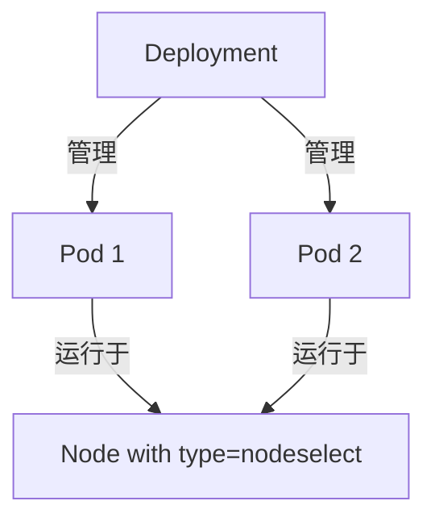

---

### **使用场景**
1. **定向部署**：  
   将 Pod 强制调度到特定类型的节点（如 GPU 节点、高内存节点）。
2. **多节点负载均衡**：  
   若多个节点有 `type=nodeselect` 标签，副本会均匀分布。
3. **资源隔离**：  
   例如将日志处理服务与计算服务分离到不同节点。

---

### **操作步骤**
1. **标记节点**：
   ```bash
   kubectl label nodes k8s-node01 type=nodeselect
   kubectl label nodes k8s-node02 type=nodeselect
   ```

2. **部署应用**：
   ```bash
   kubectl apply -f deployment.yaml
   ```

3. **验证调度**：
   ```bash
   kubectl get pods -o wide -l app=nodeselect
   # 查看 Pod 是否运行在正确节点
   kubectl describe nodes -l type=nodeselect
   ```

---

### **注意事项**
1. **标签冲突**：  
   若无节点满足 `type=nodeselect`，Pod 将处于 `Pending` 状态。  
   **解决方法**：
   ```bash
   kubectl describe pod <Pending-Pod> | grep -A 10 Events
   ```

2. **生产建议**：
    - 使用更灵活的 `affinity` 替代 `nodeSelector`（支持软性约束）。
    - 添加资源限制：
      ```yaml
      resources:
        limits:
          cpu: "500m"
          memory: "512Mi"
      ```

3. **镜像优化**：  
   原配置中的 `wangyanglinux/myapp:v1.0` 已替换为公共镜像 `nginx:1.25`，避免私有仓库依赖问题。

---

### **扩展知识**
- **替代方案**：  
  使用 `affinity` 实现更复杂的调度规则：
  ```yaml
  affinity:
    nodeAffinity:
      requiredDuringSchedulingIgnoredDuringExecution:
        nodeSelectorTerms:
        - matchExpressions:
          - key: type
            operator: In
            values: [nodeselect]
  ```


```bash
[root@k8s-master01 8]# vim 14.pod.yaml
[root@k8s-master01 8]# 
[root@k8s-master01 8]# kubectl apply -f 14.pod.yaml 
deployment.apps/nodeselect-test created
[root@k8s-master01 8]# kubectl get pod -o wide
NAME                              READY   STATUS    RESTARTS   AGE   IP       NODE     NOMINATED NODE   READINESS GATES
nodeselect-test-8fd98cd49-kzm4q   0/1     Pending   0          6s    <none>   <none>   <none>           <none>
nodeselect-test-8fd98cd49-xbk5f   0/1     Pending   0          6s    <none>   <none>   <none>           <none>
[root@k8s-master01 8]# kubectl label node k8s-master01 type=nodeselect
node/k8s-master01 labeled
[root@k8s-master01 8]# kubectl get pod -o wide
NAME                              READY   STATUS    RESTARTS   AGE   IP       NODE     NOMINATED NODE   READINESS GATES
nodeselect-test-8fd98cd49-kzm4q   0/1     Pending   0          92s   <none>   <none>   <none>           <none>
nodeselect-test-8fd98cd49-xbk5f   0/1     Pending   0          92s   <none>   <none>   <none>           <none>
[root@k8s-master01 8]# kubectl label node k8s-node01 type=nodeselect
node/k8s-node01 labeled
[root@k8s-master01 8]# kubectl get pod -o wide
NAME                              READY   STATUS    RESTARTS   AGE     IP             NODE         NOMINATED NODE   READINESS GATES
nodeselect-test-8fd98cd49-kzm4q   1/1     Running   0          6m18s   10.244.86.43   k8s-node01   <none>           <none>
nodeselect-test-8fd98cd49-xbk5f   1/1     Running   0          6m18s   10.244.86.44   k8s-node01   <none>           <none>
```


