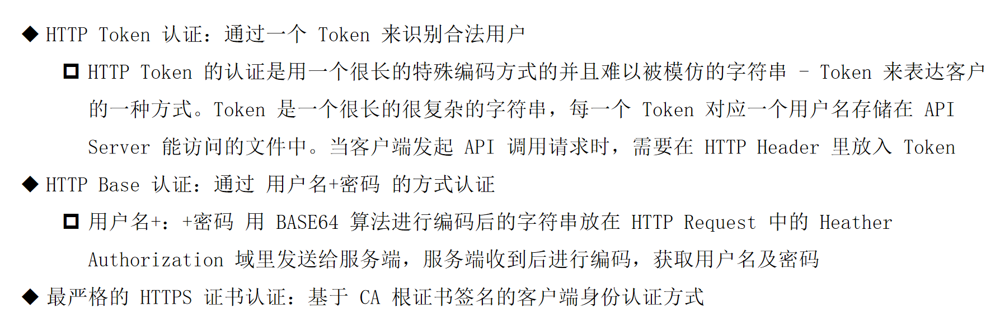
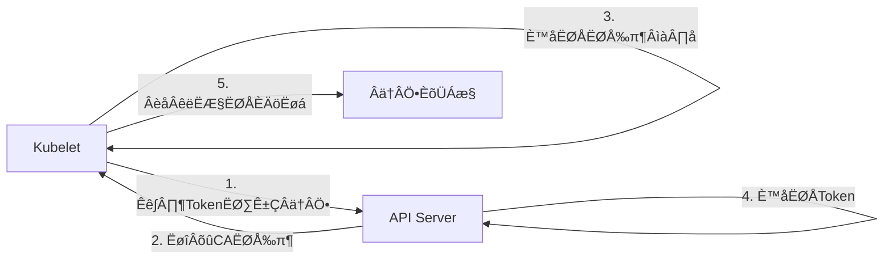

# k8s集群安全机制

守住Kubernetes的底线


## 01. 安全机制说明

如何安全，如何安心


### 机制说明


## 02. 认证

老弟你是自己人嘛？

### 认证模式 - 类型




### 认证模式 - 基于HTTPS


#### HTTPS认证

- HTTPS
  - 单向HTTPS认证
    - 客户端认证服务器端
      - www.baidu.com
  - 双向HTTPS认证
    - 客户端与服务器端双向认证
      - ATM

### **HTTPS 认证类型详解**

HTTPS 认证分为两种核心类型，以下是详细解析：

---

#### **1. 单向 HTTPS 认证**
- **认证方向**：  
  🔒 **客户端 → 服务器端**  
  （客户端验证服务器身份，服务器不验证客户端）

- **工作原理**：
    1. 服务器提供数字证书（含公钥和域名信息）
    2. 客户端通过 CA 机构验证证书有效性
    3. 建立加密连接（如 TLS 1.3）

- **典型场景**：  
  🌐 普通网站（如 `www.baidu.com`）  
  ✅ **用户只需确认网站真实性**，无需提交自身证书

- **技术要点**：
    - 证书必须由可信 CA（如 Let's Encrypt）签发
    - 浏览器自动检查证书是否过期/被吊销

---

#### **2. 双向 HTTPS 认证**
- **认证方向**：  
  🔄 **客户端 ↔ 服务器端**  
  （双方互相验证身份）

- **工作原理**：
    1. 服务器要求客户端提供证书
    2. 客户端发送个人证书（需提前由服务器信任的 CA 签发）
    3. 双向验证通过后建立连接

- **典型场景**：  
  🏦 高安全系统（如 `ATM` 机、企业 VPN）  
  ✅ **确保双方身份合法**，防止中间人攻击

- **技术要点**：
    - 需预装客户端证书（如 .p12 文件）
    - 服务器配置强制客户端证书验证

---

### **对比总结**
| **维度**         | **单向认证**                | **双向认证**                |
|------------------|---------------------------|---------------------------|
| **认证方向**     | 客户端→服务器               | 客户端↔服务器               |
| **证书要求**     | 仅服务器需证书              | 双方均需证书                |
| **安全性**       | 基础防窃听                  | 防窃听+防伪装               |
| **用户体验**     | 无感自动完成                | 需手动选择/安装客户端证书     |
| **适用场景**     | 普通网站、API               | 网银、政务系统、内网服务      |

---

### **技术实现示例**
#### 单向认证（Nginx 配置片段）：
```nginx
server {
    listen 443 ssl;
    ssl_certificate /path/to/server.crt;
    ssl_certificate_key /path/to/server.key;
    # 无需客户端证书验证
}
```

#### 双向认证（Nginx 配置片段）：
```nginx
server {
    listen 443 ssl;
    ssl_certificate /path/to/server.crt;
    ssl_certificate_key /path/to/server.key;
    ssl_client_certificate /path/to/ca.crt;  # 信任的CA证书
    ssl_verify_client on;  # 强制要求客户端证书
}
```

---

### **问题排查建议**
1. **单向认证失败**：
    - 检查证书链是否完整 `openssl verify -CAfile ca.crt server.crt`
    - 确认域名匹配 `openssl x509 -in server.crt -text | grep DNS`

2. **双向认证失败**：
    - 检查客户端证书是否过期
    - 验证服务器信任的 CA 是否包含客户端证书的签发者

如需具体场景的配置指导，请提供更多细节！


### 需要认证的节点


### 一定需要吗？


### 证书签发模式


```bash
kubeadm join 192.168.120.11:6443 --token 6sujko.tsdhg36oyfanquw4 	--discovery-token-ca-cert-hash sha256:092d7d8d7d6f1984c35542b23c9a8183d8cffbcc6b994b5ed1016c8b5b2dabb8  --cri-socket unix:///var/run/cri-dockerd.sock
```


### **命令解析：`kubeadm join`**

这条命令用于将一个新的工作节点（Worker Node）加入现有的 Kubernetes 集群。以下是每个参数的详细解释：

---

#### **1. 核心参数**
| **参数**                     | **作用**                                                                 |
|------------------------------|--------------------------------------------------------------------------|
| `192.168.120.11:6443`         | 集群控制平面（Control Plane）的 API Server 地址和端口                     |
| `--token 6sujko.tsdhg36oyfanquw4` | 加入集群的临时认证令牌（24小时有效）                                       |
| `--discovery-token-ca-cert-hash sha256:092d7d...` | 集群 CA 证书的哈希值，用于验证控制平面身份                                |
| `--cri-socket unix:///var/run/cri-dockerd.sock` | 指定容器运行时接口（CRI）的套接字路径（使用 cri-dockerd 适配 Docker）     |

---

### **2. 工作流程**
1. **节点初始化**
    - 通过 `cri-dockerd.sock` 检查容器运行时（Docker）是否就绪
    - 验证网络连通性（能否访问 `192.168.120.11:6443`）

2. **安全认证**
    - 使用 Token (`6sujko.tsdhg36oyfanquw4`) 向 API Server 发起临时认证
    - 通过 CA 证书哈希校验控制平面身份（防止中间人攻击）

3. **加入集群**
    - 从 API Server 获取集群配置（如 Pod CIDR、DNS 设置）
    - 自动部署 kubelet 和 kube-proxy 组件
    - 注册节点到集群的 Node 列表

---

### **3. 关键文件与路径**
| **文件/路径**                | **作用**                                  | **默认位置**                          |
|-----------------------------|-----------------------------------------|--------------------------------------|
| `/var/run/cri-dockerd.sock` | cri-dockerd 的 Unix 域套接字              | `/var/run/cri-dockerd.sock`          |
| `/etc/kubernetes/kubelet.conf` | kubelet 配置文件                        | `/etc/kubernetes/kubelet.conf`        |
| `/var/lib/kubelet`           | kubelet 数据目录（Pod 卷、证书等）         | `/var/lib/kubelet`                    |

---

### **4. 常见问题排查**
#### **问题 1：Token 过期**
```bash
# 重新生成 Token（在控制平面节点执行）
kubeadm token create --print-join-command
```

#### **问题 2：CRI 套接字不可用**
```bash
# 检查 cri-dockerd 是否运行
systemctl status cri-docker
# 查看套接字文件是否存在
ls /var/run/cri-dockerd.sock
```

#### **问题 3：CA 证书哈希不匹配**
```bash
# 在控制平面节点获取正确哈希值
openssl x509 -pubkey -in /etc/kubernetes/pki/ca.crt | \
openssl rsa -pubin -outform der 2>/dev/null | \
openssl dgst -sha256 -hex | sed 's/^.* //'
```

---

### **5. 完整加入流程示例**
#### **步骤 1：准备工作节点**
```bash
# 安装依赖
apt-get install -y kubelet kubeadm cri-dockerd
systemctl enable kubelet cri-docker
```

#### **步骤 2：执行加入命令**
```bash
kubeadm join 192.168.120.11:6443 \
  --token 6sujko.tsdhg36oyfanquw4 \
  --discovery-token-ca-cert-hash sha256:092d7d8d7d6f1984c35542b23c9a8183d8cffbcc6b994b5ed1016c8b5b2dabb8 \
  --cri-socket unix:///var/run/cri-dockerd.sock
```

#### **步骤 3：验证结果**
```bash
# 在控制平面节点查看节点状态
kubectl get nodes
```

---

### **6. 注意事项**
1. **Token 有效期**：默认 24 小时，过期需重新生成
2. **网络要求**：
    - 工作节点必须能访问控制平面的 6443 端口
    - 开放协议：TCP（HTTPS）、UDP（CoreDNS）
3. **生产建议**：
    - 使用 `--config` 指定配置文件替代命令行参数
    - 为 Token 设置更长的有效期：
      ```bash
      kubeadm token create --ttl 48h
      ```

---


### **Kubeadm Join 认证机制详解**

#### --token 用于ApiServer识别kubelet是否合法，--discovery-token-ca-cert-hash用于kubelet确认apiServer发送来的证书是否合法

您提到的两个参数是 Kubernetes 节点加入集群时的双向安全认证核心：

---

#### **1. `--token`：API Server 认证 Kubelet**
- **‰ΩúÁî®**  
  API Server 通过 Token 验证加入节点的合法性，防止未授权节点接入集群。

- **技术实现**
    - Token 内容格式：`<6字符>.<16字符>`（如 `6sujko.tsdhg36oyfanquw4`）
    - 实质是 JWT 令牌，存储在 Kubernetes Secret 中：
      ```bash
      kubectl -n kube-system get secret | grep bootstrap-token
      ```
    - 校验流程：
      ```mermaid
      sequenceDiagram
          Kubelet->>API Server: 携带Token发起加入请求
          API Server->>etcd: 验证Token是否在bootstrap-token列表中
          etcd-->>API Server: 返回验证结果
          API Server->>Kubelet: 通过认证后下发正式证书
      ```

- **安全特性**
    - 默认 24 小时有效期
    - 需配合 RBAC 规则使用（`system:bootstrappers` 用户组）

---

#### **2. `--discovery-token-ca-cert-hash`：Kubelet 认证 API Server**
- **‰ΩúÁî®**  
  Kubelet 通过 CA 证书哈希验证 API Server 身份，防止中间人攻击。

- **技术实现**
    - 哈希值来源：
      ```bash
      openssl x509 -pubkey -in /etc/kubernetes/pki/ca.crt | \
      openssl rsa -pubin -outform der 2>/dev/null | \
      openssl dgst -sha256 -hex
      ```
    - 校验流程：
        1. Kubelet 从 API Server 获取证书
        2. 计算证书哈希并与传入参数比对
        3. 不一致则立即终止加入流程

- **安全特性**
    - 防止攻击者伪造 API Server
    - 必须与集群 CA 证书严格匹配

---

### **双向认证全流程**


---

### **生产环境最佳实践**
1. **Token 管理**
    - 查看现有 Token：
      ```bash
      kubeadm token list
      ```
    - 创建长期有效 Token：
      ```bash
      kubeadm token create --ttl 48h --print-join-command
      ```

2. **CA 证书哈希更新**
    - 当集群 CA 证书轮换时，需重新生成哈希：
      ```bash
      kubeadm init phase upload-certs --upload-certs
      ```

3. **审计与监控**
    - 检查异常加入请求：
      ```bash
      kubectl -n kube-system get events | grep -i join
      ```

---

### **故障排查示例**
#### **场景：Token 失效**
```bash
# 错误现象
[kubelet] Error: couldn't validate the identity of the API Server

# 解决方案
# 在控制平面节点执行
kubeadm token create --print-join-command
```

#### **场景：CA 哈希不匹配**
```bash
# 错误现象
[discovery] Failed to request cluster info: x509: certificate signed by unknown authority

# 验证当前集群CA哈希
openssl x509 -pubkey -in /etc/kubernetes/pki/ca.crt | openssl sha256 -hex
```

---

通过这种双向认证机制，Kubernetes 确保了节点加入过程的安全性，既防止了恶意节点接入，也避免了节点被引导到伪造的控制平面。


---


### kubeconfig


```yaml
[root@k8s-master01 ~]# cat /root/.kube/config
apiVersion: v1
clusters:
- cluster:
    certificate-authority-data: LS0tLS1CRUdJTiBDRVJUSUZJQ0FURS0tLS0tCk1JSURCVENDQWUyZ0F3SUJBZ0lJZnYwdmhMVWZwb013RFFZSktvWklodmNOQVFFTEJRQXdGVEVUTUJFR0ExVUUKQXhNS2EzVmlaWEp1WlhSbGN6QWVGdzB5TlRBM01ETXhNalV3TVRkYUZ3MHpOVEEzTURFeE1qVTFNVGRhTUJVeApFekFSQmdOVkJBTVRDbXQxWW1WeWJtVjBaWE13Z2dFaU1BMEdDU3FHU0liM0RRRUJBUVVBQTRJQkR3QXdnZ0VLCkFvSUJBUUN6TjgrRkpVOGtyZmE1N3QrN2hjYVIvdFR5SlFiWVRRZDdicmh3OGo3NnVZVnJ5N3pLR0gwQklCUmUKcnhqVFVtZTh4Ny9qYlZSRGdvKzM0NXNjeEF2NnJTaVZKd040S0NEVnQrQkQ1djVpSUJhN2Q1Yncxb1EyeVgwYQpxbzMzMXZMLzlXTzBXZndGVWIxZFFOeGE2bHVQMHlKTFNXUG8rUnNiWXRCN3Fzd0ZMM1FqcWUwVTgydGFVb29sCmx4bmxGcjk3MEh3RC9wQVVhMFA5UDVyUHE0b1RQRHFzT3NWMWxkTnBLV05ZUVIwTnlxL0s3b0g5d1JQaVlManAKYnFxUzVQZUFQcVlYYWlPb0hTcVZVZm9xcVh2RHIwL3Yza240V0FLeVZ0cmNaakNSOS95QVU3SmRvblRXSldjcwpCZG0zVkVlODNuc2t5dEdwSGdVMUV2cTczS0hSQWdNQkFBR2pXVEJYTUE0R0ExVWREd0VCL3dRRUF3SUNwREFQCkJnTlZIUk1CQWY4RUJUQURBUUgvTUIwR0ExVWREZ1FXQkJRRHY3NWNlQ1F3b2EvMGpzSU5hS2NJRnpzdktqQVYKQmdOVkhSRUVEakFNZ2dwcmRXSmxjbTVsZEdWek1BMEdDU3FHU0liM0RRRUJDd1VBQTRJQkFRQ28rek5RVDhkcwpqVEppdXE2ZWhaM3hYUXZWK2ZuTnd3eFQ3Y2ZLVk5tUkFBdHlOdWxkMjVrQVVScit3dGJ0VTR5K0tRQ0o4SWczCkcxdGozMUU4S1V0YkJUUjA4YmtUR3hGeTZmMmV4eHRoMU9zWDY5bzJVNmROb0ZFWkZNOWhoalhZMHdrL0lZSUIKakFSNmhYVkRmaHd5b1VqNzRkbmtyVFNyWlAxVFVNSmVuekNPT0E5YWdMVTVzWE5hL0xVbmI3VmhHNExvYVl3SAo0QXVqUFlETC9hYVhYNi80S3BPZHdnSG9JTEhjQkxsMGVRYVBlRk9TL0J2bXVtR3ZvM0s4aUJ1bnBZOTZCUHY3CmtCZUt3UTNQVEJPSzJqd3NTekdVVWUvNG42UGpMWFpZYkpndjVmTkdGdE8xWVBTY3VFTlg4bzQ1Y0lsOWJjMDYKOENzMHVpT3NGN3NDCi0tLS0tRU5EIENFUlRJRklDQVRFLS0tLS0K
    server: https://192.168.120.11:6443
  name: kubernetes
contexts:
- context:
    cluster: kubernetes
    user: kubernetes-admin
  name: kubernetes-admin@kubernetes
current-context: kubernetes-admin@kubernetes
kind: Config
preferences: {}
users:
- name: kubernetes-admin
  user:
    client-certificate-data: LS0tLS1CRUdJTiBDRVJUSUZJQ0FURS0tLS0tCk1JSURLVENDQWhHZ0F3SUJBZ0lJRllkZnI4SnJmckF3RFFZSktvWklodmNOQVFFTEJRQXdGVEVUTUJFR0ExVUUKQXhNS2EzVmlaWEp1WlhSbGN6QWVGdzB5TlRBM01ETXhNalV3TVRkYUZ3MHlOakEzTURNeE1qVTFNakZhTUR3eApIekFkQmdOVkJBb1RGbXQxWW1WaFpHMDZZMngxYzNSbGNpMWhaRzFwYm5NeEdUQVhCZ05WQkFNVEVHdDFZbVZ5CmJtVjBaWE10WVdSdGFXNHdnZ0VpTUEwR0NTcUdTSWIzRFFFQkFRVUFBNElCRHdBd2dnRUtBb0lCQVFDN1ZhMHYKUksybGNrVkRwZDI1ZS80dnFCbCtxQjM0eGxkS1FXNGpXZjR1cUM1VldXTW8vampzS1pWZjc2aG54cWxCOXFmUQpYT2FtM0JQT003MnZheE5ITWc3Y0JYZ00razY5azUyY0xYYXMwcWhQZjNQNDQ1NndGTXdBMytBTi83TlhGTXozCkljcWwxTXlrTFhQVGhMNnlVRXBOdmlvRTA0ejlsdWorcEUvd3FVUDZGbGRDVDFOMWlEOUM4R2Zob1NrK21HNU0KZzUyd0JQVDhCa3ZWV0hsK2NjWVBCRzhUREdwOXNESmU0K2dxaHNTazMvNkZMS1R1MXpMOFROMWxrMlA5SFBiRQp4RDFhcXRUaVRCYmkyNG0zUlZkRENlbi8rZFZnWmRWZy9IM1IwREhkMStOb2ZPU1VJMWtxZHZzRGV5VGFWYlB6ClV1TlJ3a1Y2S3RHVlpRMHZBZ01CQUFHalZqQlVNQTRHQTFVZER3RUIvd1FFQXdJRm9EQVRCZ05WSFNVRUREQUsKQmdnckJnRUZCUWNEQWpBTUJnTlZIUk1CQWY4RUFqQUFNQjhHQTFVZEl3UVlNQmFBRkFPL3ZseDRKRENoci9TTwp3ZzFvcHdnWE95OHFNQTBHQ1NxR1NJYjNEUUVCQ3dVQUE0SUJBUUFrMWtCS2RLTFd6VG9TU1czL3llTWROeVBjCitPQXZZaEMxL1lYM2NENkRJVGhCWW4rWWtScWk3ZjdLcnlaUnBhT3BtU25TdGg5VE5vRndxZ1poV3NUNkxyMFAKL1Z0Y3VUUVlkL0JHSGhDV2dJWjlKTjJoTUFoTTArRFQvdnZPS1I3SzVhQlZLWHE0bXZoTTlqWTVpbk9kb2toUQo4Y244eXR5WmtROVFSY1EwQWJqOFR1Yi9vbWoxcEVPUW1INVY0N200T0EvSDBuV0puM2svRk1ZZ1dGT2w3VWJzCkhneTdqVWRWMnlqVTBLMHhzTVlSZzArV3pKUmR5N2JUTzUxczdkbTJLS0EwRVo4OFYxbnVncGYzWW1nbXI5aU8KOWxWNDRMUmxyM3RZKzlDNytOdmV1TkwyRkJ4d2tvVGRscktRSTMrVUppQXhpYnlpK3J2akhOemtXWlUrCi0tLS0tRU5EIENFUlRJRklDQVRFLS0tLS0K
    client-key-data: LS0tLS1CRUdJTiBSU0EgUFJJVkFURSBLRVktLS0tLQpNSUlFcEFJQkFBS0NBUUVBdTFXdEwwU3RwWEpGUTZYZHVYditMNmdaZnFnZCtNWlhTa0Z1STFuK0xxZ3VWVmxqCktQNDQ3Q21WWCsrb1o4YXBRZmFuMEZ6bXB0d1R6ak85cjJzVFJ6SU8zQVY0RFBwT3ZaT2RuQzEyck5Lb1QzOXoKK09PZXNCVE1BTi9nRGYrelZ4VE05eUhLcGRUTXBDMXowNFMrc2xCS1RiNHFCTk9NL1piby9xUlA4S2xEK2haWApRazlUZFlnL1F2Qm40YUVwUHBodVRJT2RzQVQwL0FaTDFWaDVmbkhHRHdSdkV3eHFmYkF5WHVQb0tvYkVwTi8rCmhTeWs3dGN5L0V6ZFpaTmovUnoyeE1ROVdxclU0a3dXNHR1SnQwVlhRd25wLy9uVllHWFZZUHg5MGRBeDNkZmoKYUh6a2xDTlpLbmI3QTNzazJsV3o4MUxqVWNKRmVpclJsV1VOTHdJREFRQUJBb0lCQUQ4OEdtdDhPVWxCbTFQTQpaMTIzRndRckwvL3E2OE1QNEdNMlZ1RWovWUx1VGtXTkdNVzdtcWROR2hqNkl0UjA0S2xkZ3lQNFYvczNDcEJ1Ck1yZEY0NG9Dd2JWUE8waldMVUljMC9UbCs4czJpSTNkTGQ1enB4czB5ZS81b2YzWHRFZk93NmtnQlBHWk5VS3QKL1EwSEgvKzh6bmdUbXNkcVNZdElKM25kS1FiSTUvb3J2SHlCYnJsOHFTaVdJTnhHei9vTkhFcTlwQys0d0JOQwppUFhpZk9JYXJBaW82Qm1VOFhBQzZ3d2phcGZGT1hTNjNJUXF6SFhQYmRNL0ZZZm1WWVVtNit2RmhEOGdTd2tqCjhyNnR1dFdxb2ZOL3FTN2wzY0w2WW9zWWQ3djRmZHNEV2R6Yk5QOUtnTWxUM3hzQktVZ2cxaFpyMjFPOXdQZmYKa2ZWS1NrRUNnWUVBNmN5bDlXZi9TMm5HQTFCaVVoMlZPR09zWjhmbWhFYjIyM2VRRVpLenQ3SlpmOXNZdTBNYwowbjNza3VtM1dtbmpWRGhYa0x3WloveE9hYXJCNjZYdHVJTHhIZURqN0pXUU13NmdiOC9nQTkrQ2JDR3BGU2dxCk9uMVIwcGIzTE9HVVRDeUx5UkhWM3ovYitsNjRBeUxRdmFra0pnNnJjcHltcDN0R0hmY1NIZDhDZ1lFQXpSK0kKVkQyMysxUTdIQndKdW95U3h1NUNFb0l2TFFWaWNLM1dRRVhqNHRGQzI3a202NG5MM3NONEMxSktRenlyMlhvUgpsMWRDVG5YdEh4dGYxeXJnYXIrVGY1MCsvN3ZvMHRSK0NWQ1dYVWNYajlqdzJkdmZTZzZjYmU0MDlmbldGazB2CkVkZVQwQXVLc2tlVmZSQTVhSzUrOGxOQy94NldZOUNsQ0l4aVdyRUNnWUVBdk82RHJpeThRVlRZanhVR1h4VkkKNEtpclNiSmd0Y1FpK0hkR0ZPMVlEYm95V1AvVW5IOC9hMW9YTXlGcTZjVm56MGM0ZTkyRkttTFplc3BpcXVzTApqMjlCS2NQeWE5enhDbEZubFBPSE01b0s2eGJJYkRCbzc1c1Y0L2ZiQm9uRUxVcFNLOG9kNnFyUU9TTVIwSGJ4CitGSVd4Q3BXb2VlMVJPSjVadjJoeGtFQ2dZRUFtMVlMeWEvTGlqcnBZSW9qRy9Da25wMkR6N3hpdVhkZ2F2QmEKVmVZWGc0YnhXSy9JTjRyc3BzL2tNcjZvbW01eHZZbmhsSGh5TURUQjAxTEpxNG8rMU5ncmZQSzU2TFNHeGxKQQorQkRkTGRwT2o1SzhJbCtOb3VtWnNPNDVrU1VYNlYrZUM2Ynp1eE5pZjB3U2V0azBnSC9VaHZKaXhBeUgyeU1BCk40OElWS0VDZ1lBTVZCS3g3WWtlUUx6UHJmdnYyR1d1bzFrSVUvK0dyeUU4LzdtY29EekloNmlDeEZ3Z1JGSHoKRk5QdVVYcEtZK3dBQVdycjREQlpyYWRlY2dEajVHc3AvSGZSdmNHampOdlJuUmw5d1VxZCs4U1RjMHBsdzNSWApjMGlDK09iYUZVUGxhay9nMDU5Mlk0S1ZFSHBTM0VVVVNEbTRzTUw3ZjFhNGRBQXI5V0NLMHc9PQotLS0tLUVORCBSU0EgUFJJVkFURSBLRVktLS0tLQo=
```

```bash
[root@k8s-master01 ~]# kubectl get pod
NAME                              READY   STATUS    RESTARTS   AGE
nodeselect-test-8fd98cd49-kzm4q   1/1     Running   0          108m
nodeselect-test-8fd98cd49-xbk5f   1/1     Running   0          108m
[root@k8s-master01 ~]# mv /root/.kube/config .
[root@k8s-master01 ~]# kubectl get pod
E0713 22:03:21.206688 1189343 memcache.go:265] couldn't get current server API group list: Get "http://localhost:8080/api?timeout=32s": dial tcp [::1]:8080: connect: connection refused
E0713 22:03:21.208061 1189343 memcache.go:265] couldn't get current server API group list: Get "http://localhost:8080/api?timeout=32s": dial tcp [::1]:8080: connect: connection refused
E0713 22:03:21.208976 1189343 memcache.go:265] couldn't get current server API group list: Get "http://localhost:8080/api?timeout=32s": dial tcp [::1]:8080: connect: connection refused
E0713 22:03:21.211572 1189343 memcache.go:265] couldn't get current server API group list: Get "http://localhost:8080/api?timeout=32s": dial tcp [::1]:8080: connect: connection refused
E0713 22:03:21.213115 1189343 memcache.go:265] couldn't get current server API group list: Get "http://localhost:8080/api?timeout=32s": dial tcp [::1]:8080: connect: connection refused
The connection to the server localhost:8080 was refused - did you specify the right host or port?
[root@k8s-master01 ~]# ls
1    4    8                cri-dockerd                          my-scheduler.sh
1.1  5    anaconda-ks.cfg  cri-dockerd-0.3.9.amd64.tgz
2.1  6    calico           fire.file
2.2  6.1  calico.zip       kubernetes-1.29.2-150500.1.1
2.3  7    config           kubernetes-1.29.2-150500.1.1.tar.gz
[root@k8s-master01 ~]# mv config .kube/
[root@k8s-master01 ~]# kubectl get pod
NAME                              READY   STATUS    RESTARTS   AGE
nodeselect-test-8fd98cd49-kzm4q   1/1     Running   0          109m
nodeselect-test-8fd98cd49-xbk5f   1/1     Running   0          109m
```


### **Kubernetes 配置文件 (`~/.kube/config`) 详解**

这是 Kubernetes 的客户端配置文件（kubeconfig），用于认证和访问集群。以下是逐层解析：

---

#### **1. 文件结构总览**
```yaml
apiVersion: v1          # Kubernetes API 版本
kind: Config            # 资源类型为配置文件
clusters: [...]        # 集群列表
contexts: [...]        # 上下文列表（关联用户、集群和命名空间）
current-context: ...   # 当前使用的上下文
users: [...]           # 用户认证信息
```

---

#### **2. 集群配置 (`clusters`)**
```yaml
- cluster:
    certificate-authority-data: LS0tLS1CRUdJTiBDRVJUSUZJQ0FURS0tLS0t...  # Base64编码的CA证书
    server: https://192.168.120.11:6443  # API Server地址
  name: kubernetes  # 集群名称
```
- **作用**：定义如何连接 Kubernetes 集群。
- **关键字段**：
    - `certificate-authority-data`：集群的根证书（用于验证 API Server 的 TLS 证书）。
    - `server`ÔºöAPI Server ÁöÑ HTTPS Á´ØÁÇπ„ÄÇ

---

#### **3. 用户配置 (`users`)**
```yaml
- name: kubernetes-admin  # 用户名
  user:
    client-certificate-data: LS0tLS1CRUdJTiBDRVJUSUZJQ0FURS0tLS0t...  # Base64编码的客户端证书
    client-key-data: LS0tLS1CRUdJTiBSU0EgUFJJVkFURSBLRVktLS0tLQo=...  # Base64编码的私钥
```
- **作用**：定义用户身份认证信息（双向 TLS 认证）。
- **关键字段**：
    - `client-certificate-data`：客户端证书（包含公钥和身份信息）。
    - `client-key-data`：与证书配对的私钥（**需严格保密**）。

---

#### **4. 上下文配置 (`contexts`)**
```yaml
- context:
    cluster: kubernetes          # 引用的集群名称
    user: kubernetes-admin      # 引用的用户名
  name: kubernetes-admin@kubernetes  # 上下文名称
current-context: kubernetes-admin@kubernetes  # 当前激活的上下文
```
- **作用**：绑定用户、集群和命名空间（本例未指定命名空间，默认用 `default`）。
- **使用场景**：快速切换不同集群/用户（如开发、测试、生产环境）。

---

#### **5. 安全机制解析**
##### **认证流程（双向 TLS）**
1. **客户端验证服务端**：
    - 用 `certificate-authority-data` 验证 API Server 证书的合法性。
2. **服务端验证客户端**：
    - API Server 校验 `client-certificate-data` 是否由集群 CA 签发。
3. **通信加密**：
    - 所有数据传输通过 TLS 1.2/1.3 加密。

##### **证书内容解码示例**
```bash
# 查看CA证书内容
echo "LS0tLS1CRUdJTiBDRVJUSUZJQ0FURS0tLS0t..." | base64 -d | openssl x509 -text

# 查看客户端证书
echo "LS0tLS1CRUdJTiBDRVJUSUZJQ0FURS0tLS0t..." | base64 -d | openssl x509 -text
```

---

#### **6. 使用场景示例**
##### **通过 kubectl 访问集群**
```bash
kubectl get nodes  # 自动使用 ~/.kube/config 中的配置
```

##### **手动指定配置文件**
```bash
kubectl --kubeconfig=/path/to/config get pods
```

##### **切换上下文**
```bash
kubectl config use-context another-context
```

---

#### **7. 生产环境建议**
1. **权限控制**：
    - 限制 `client-certificate-data` 的权限（通过 RBAC）。
    - 避免直接使用 `kubernetes-admin` 等高权限账户。

2. **配置文件管理**：
    - 设置文件权限为 `600`：
      ```bash
      chmod 600 ~/.kube/config
      ```
    - 敏感信息可替换为路径引用（而非直接嵌入 Base64）：
      ```yaml
      user:
        client-certificate: /path/to/client.crt
        client-key: /path/to/client.key
      ```

3. **多集群管理工具**：
    - 使用 `kubectx` + `kubens` 快速切换上下文和命名空间。

---

### **附：配置文件生成方式**
此文件通常由以下命令自动生成：
```bash
# 初始化集群时生成
kubeadm init --output yaml > config.yaml

# 或从集群获取配置
kubectl config view --raw > config.yaml
```

---


### ApiServer需要认证的类型

- ApiServer需要认证的类型
  - 组件
    - 无需加密，基于Kubeadm部署与ApiServer处于同一台机器，通过127.0.0.1非安全地址访问即可
      - Controller Manager„ÄÅScheduler
    - 需要加密
      - 证书手动颁发
        - kube-proxy„ÄÅkubectl
      - 自动颁发
        - kubelet
  - Pod
    - SA


### ServiceAccount


### ServiceAccount的组成


- Pod
  - SA
    - ca.crt: 集群的根证书，用于pod确认apiServer的安全性
    - token: 使用apiServer的私钥签发基于JWT标准的字符串，用于apiServer确认pod的安全性
    - namespace: 用于标识当前的pod的作用域


### ServiceAccountË°•ÂÖÖ


```bash
[root@k8s-master01 ~]# kubectl create ns test
namespace/test created
[root@k8s-master01 ~]# kubectl get sa -n test
NAME      SECRETS   AGE
default   0         10s
[root@k8s-master01 ~]# kubectl get pod -A
NAMESPACE          NAME                                       READY   STATUS    RESTARTS      AGE
default            nodeselect-test-8fd98cd49-kzm4q            1/1     Running   0             12h
default            nodeselect-test-8fd98cd49-xbk5f            1/1     Running   0             12h
kube-system        calico-kube-controllers-558d465845-d8msr   1/1     Running   3 (13h ago)   10d
kube-system        calico-node-59bdv                          1/1     Running   7 (13h ago)   10d
kube-system        calico-node-f7pk5                          1/1     Running   1             10d
kube-system        calico-node-wn5vm                          1/1     Running   1             10d
kube-system        calico-typha-5b56944f9b-t8n4m              1/1     Running   2 (13h ago)   10d
kube-system        coredns-857d9ff4c9-drmqk                   1/1     Running   3 (9d ago)    10d
kube-system        coredns-857d9ff4c9-jknr4                   1/1     Running   3 (9d ago)    10d
kube-system        etcd-k8s-master01                          1/1     Running   3 (9d ago)    10d
kube-system        kube-apiserver-k8s-master01                1/1     Running   3 (9d ago)    10d
kube-system        kube-controller-manager-k8s-master01       1/1     Running   6 (13h ago)   10d
kube-system        kube-proxy-275ph                           1/1     Running   0             4d19h
kube-system        kube-proxy-n89sz                           1/1     Running   0             4d19h
kube-system        kube-proxy-pmv8z                           1/1     Running   0             4d19h
kube-system        kube-scheduler-k8s-master01                1/1     Running   5 (13h ago)   10d
nfs-storageclass   nfs-client-provisioner-8c5b9b749-z8v7p     1/1     Running   4 (13h ago)   23h
[root@k8s-master01 ~]# kubectl exec -it -n kube-system calico-node-f7pk5 -- /bin/sh
Defaulted container "calico-node" out of: calico-node, upgrade-ipam (init), install-cni (init), mount-bpffs (init)
sh-4.4# cd /run/secrets/kubernetes.io/serviceaccount/
sh-4.4# ls
ca.crt	namespace  token
sh-4.4# cat ca.crt 
-----BEGIN CERTIFICATE-----
MIIDBTCCAe2gAwIBAgIIfv0vhLUfpoMwDQYJKoZIhvcNAQELBQAwFTETMBEGA1UE
AxMKa3ViZXJuZXRlczAeFw0yNTA3MDMxMjUwMTdaFw0zNTA3MDExMjU1MTdaMBUx
EzARBgNVBAMTCmt1YmVybmV0ZXMwggEiMA0GCSqGSIb3DQEBAQUAA4IBDwAwggEK
AoIBAQCzN8+FJU8krfa57t+7hcaR/tTyJQbYTQd7brhw8j76uYVry7zKGH0BIBRe
rxjTUme8x7/jbVRDgo+345scxAv6rSiVJwN4KCDVt+BD5v5iIBa7d5bw1oQ2yX0a
qo331vL/9WO0WfwFUb1dQNxa6luP0yJLSWPo+RsbYtB7qswFL3Qjqe0U82taUool
lxnlFr970HwD/pAUa0P9P5rPq4oTPDqsOsV1ldNpKWNYQR0Nyq/K7oH9wRPiYLjp
bqqS5PeAPqYXaiOoHSqVUfoqqXvDr0/v3kn4WAKyVtrcZjCR9/yAU7JdonTWJWcs
Bdm3VEe83nskytGpHgU1Evq73KHRAgMBAAGjWTBXMA4GA1UdDwEB/wQEAwICpDAP
BgNVHRMBAf8EBTADAQH/MB0GA1UdDgQWBBQDv75ceCQwoa/0jsINaKcIFzsvKjAV
BgNVHREEDjAMggprdWJlcm5ldGVzMA0GCSqGSIb3DQEBCwUAA4IBAQCo+zNQT8ds
jTJiuq6ehZ3xXQvV+fnNwwxT7cfKVNmRAAtyNuld25kAURr+wtbtU4y+KQCJ8Ig3
G1tj31E8KUtbBTR08bkTGxFy6f2exxth1OsX69o2U6dNoFEZFM9hhjXY0wk/IYIB
jAR6hXVDfhwyoUj74dnkrTSrZP1TUMJenzCOOA9agLU5sXNa/LUnb7VhG4LoaYwH
4AujPYDL/aaXX6/4KpOdwgHoILHcBLl0eQaPeFOS/BvmumGvo3K8iBunpY96BPv7
kBeKwQ3PTBOK2jwsSzGUUe/4n6PjLXZYbJgv5fNGFtO1YPScuENX8o45cIl9bc06
8Cs0uiOsF7sC
-----END CERTIFICATE-----
sh-4.4# cat token 
eyJhbGciOiJSUzI1NiIsImtpZCI6Ink0QTBmeUZFMEM2bFI5NWt4VDdMYnNWQmZpSER1Z09EdmhDclhuRjhwM0EifQ.eyJhdWQiOlsiaHR0cHM6Ly9rdWJlcm5ldGVzLmRlZmF1bHQuc3ZjLmNsdXN0ZXIubG9jYWwiXSwiZXhwIjoxNzgzOTkwMTYwLCJpYXQiOjE3NTI0NTQxNjAsImlzcyI6Imh0dHBzOi8va3ViZXJuZXRlcy5kZWZhdWx0LnN2Yy5jbHVzdGVyLmxvY2FsIiwia3ViZXJuZXRlcy5pbyI6eyJuYW1lc3BhY2UiOiJrdWJlLXN5c3RlbSIsInBvZCI6eyJuYW1lIjoiY2FsaWNvLW5vZGUtZjdwazUiLCJ1aWQiOiJiMGIzOTY4My00MjJkLTQ2ZDEtYWQ4Ni0wMzg2MjY5MzI3MmMifSwic2VydmljZWFjY291bnQiOnsibmFtZSI6ImNhbGljby1ub2RlIiwidWlkIjoiM2VhN2I1ZTEtMTNmYS00YTYwLThlZmEtZmEwZmEyZGUzOTZmIn0sIndhcm5hZnRlciI6MTc1MjQ1Nzc2N30sIm5iZiI6MTc1MjQ1NDE2MCwic3ViIjoic3lzdGVtOnNlcnZpY2VhY2NvdW50Omt1YmUtc3lzdGVtOmNhbGljby1ub2RlIn0.QI2FdWrugzZgOi3WiW6w7SNV2RBT7DJIR87aXfzUX9FNKccDgbcVGUSRAHo5Ij96NTwK_vBlXCTnvbU1tusTNwgeNkecgyEumat2fJnzvH0e8dvEhfXjMzRVwva65qym4ctLIeKI-Bwqgtp3UuBE053ccdrFZR16Ov3vwGKlp_-1VRjWvfyKutaKFkwzPxK88WnmXOXcnuO8oJSztu3ecBJJfwzZkQhJKTHCvwUSzOm590HoRxtIw0b99N08n5uvFBFlenZ5ONs2jQXOocfsyWbaUla2fOKmSVT8ktTO8JHafp09IR4dt2smbVJMVUH19s_NamdnU85T0eL-JLMTSwsh-4.4# 
sh-4.4# cat namespace 
kube-systemsh-4.4# 
```

#### 创建sa

```bash
[root@k8s-master01 ~]# kubectl create sa tangfire -n default
serviceaccount/tangfire created
```


```bash
[root@k8s-master01 ~]# kubectl create sa fireshine -n default --dry-run -o yaml
W0714 10:00:13.768788 1955085 helpers.go:704] --dry-run is deprecated and can be replaced with --dry-run=client.
apiVersion: v1
kind: ServiceAccount
metadata:
  creationTimestamp: null
  name: fireshine
  namespace: default
```

### ServiceAccount总结


## 03. 鉴权


是自己人但是权限够吗？


### 鉴权 - 类型


### RBAC - 特性优势


### RBAC - 资源对象


###  RBAC - 用户哪里来


### Role


### ClusterRole


### RoleBinding + Role


### RoleBinding + ClusterRole


### ClusterRoleBinding


### Resources


### Subjects


### 创建一个用户只能管理dev名字空间

> 创建证书 > 转换为kubeconfig文件 > 创建名字空间 > 角色绑定


#### devuser.json

```json
{
  "CN": "devuser",
  "hosts": [],
  "key": {
    "algo": "rsa",
    "size": 2048
  },
  "names": [
    {
      "C": "CN",
      "ST": "BeiJing",
      "L": "BeiJing",
      "O": "k8s",
      "OU": "System"
    }
  ]
}
```

#### 下载证书生成工具


```bash
# 下载证书生成工具
wget https://pkg.cfssl.org/R1.2/cfssl_linux-amd64
mv cfssl_linux-amd64 /usr/local/bin/cfssl

wget https://pkg.cfssl.org/R1.2/cfssljson_linux-amd64
mv cfssljson_linux-amd64 /usr/local/bin/cfssljson

wget https://pkg.cfssl.org/R1.2/cfssl-certinfo_linux-amd64
mv cfssl-certinfo_linux-amd64 /usr/local/bin/cfssl-certinfo

```


下载速度太慢了，可以直接在`software_package`中找到这3个软件包


```bash
[root@k8s-master01 ~]# cd /
[root@k8s-master01 /]# ls
afs  boot   cfssl-certinfo  data  etc   lib    media  nfsdata  proc  run   srv  tmp  var
bin  cfssl  cfssljson       dev   home  lib64  mnt    opt      root  sbin  sys  usr
[root@k8s-master01 /]# mv cfssl* /usr/local/bin/
[root@k8s-master01 /]# chmod a+x /usr/local/bin/cfssl*
[root@k8s-master01 /]# cfssl
No command is given.
Usage:
Available commands:
	info
	certinfo
	ocspdump
	scan
	ocsprefresh
	sign
	serve
	gencert
	ocspsign
	revoke
	version
	genkey
	gencrl
	print-defaults
	bundle
	ocspserve
	selfsign
Top-level flags:
  -allow_verification_with_non_compliant_keys
    	Allow a SignatureVerifier to use keys which are technically non-compliant with RFC6962.
  -loglevel int
    	Log level (0 = DEBUG, 5 = FATAL) (default 1)
```

#### 生成用户证书

```bash
cfssl gencert -ca=ca.crt -ca-key=ca.key -profile=kubernetes /root/devuser-csr.json | cfssljson -bare devuser
```

```bash
[root@k8s-master01 pki]# ls
apiserver-etcd-client.crt     apiserver.crt  devuser.json        front-proxy-client.crt
apiserver-etcd-client.key     apiserver.key  etcd                front-proxy-client.key
apiserver-kubelet-client.crt  ca.crt         front-proxy-ca.crt  sa.key
apiserver-kubelet-client.key  ca.key         front-proxy-ca.key  sa.pub
[root@k8s-master01 pki]# cfssl gencert -ca=ca.crt -ca-key=ca.key -profile=kubernetes devuser.json | cfssljson -bare devuser
2025/07/14 13:36:59 [INFO] generate received request
2025/07/14 13:36:59 [INFO] received CSR
2025/07/14 13:36:59 [INFO] generating key: rsa-2048
2025/07/14 13:36:59 [INFO] encoded CSR
2025/07/14 13:36:59 [INFO] signed certificate with serial number 252446268061961222221469062878126146271502606852
2025/07/14 13:36:59 [WARNING] This certificate lacks a "hosts" field. This makes it unsuitable for
websites. For more information see the Baseline Requirements for the Issuance and Management
of Publicly-Trusted Certificates, v.1.1.6, from the CA/Browser Forum (https://cabforum.org);
specifically, section 10.2.3 ("Information Requirements").
[root@k8s-master01 pki]# ls
apiserver-etcd-client.crt     ca.key              front-proxy-ca.key
apiserver-etcd-client.key     devuser-key.pem     front-proxy-client.crt
apiserver-kubelet-client.crt  devuser.csr         front-proxy-client.key
apiserver-kubelet-client.key  devuser.json        sa.key
apiserver.crt                 devuser.pem         sa.pub
apiserver.key                 etcd
ca.crt                        front-proxy-ca.crt
```


我们可以发现，生成了`devuser.csr`证书请求文件，`devuser.pem`证书，`devuser-key.pem`私钥

我们先看看官方的kubeconfig文件

```bash
[root@k8s-master01 pki]# cat /etc/kubernetes/admin.conf 
apiVersion: v1
clusters:
- cluster:
    certificate-authority-data: LS0tLS1CRUdJTiBDRVJUSUZJQ0FURS0tLS0tCk1JSURCVENDQWUyZ0F3SUJBZ0lJZnYwdmhMVWZwb013RFFZSktvWklodmNOQVFFTEJRQXdGVEVUTUJFR0ExVUUKQXhNS2EzVmlaWEp1WlhSbGN6QWVGdzB5TlRBM01ETXhNalV3TVRkYUZ3MHpOVEEzTURFeE1qVTFNVGRhTUJVeApFekFSQmdOVkJBTVRDbXQxWW1WeWJtVjBaWE13Z2dFaU1BMEdDU3FHU0liM0RRRUJBUVVBQTRJQkR3QXdnZ0VLCkFvSUJBUUN6TjgrRkpVOGtyZmE1N3QrN2hjYVIvdFR5SlFiWVRRZDdicmh3OGo3NnVZVnJ5N3pLR0gwQklCUmUKcnhqVFVtZTh4Ny9qYlZSRGdvKzM0NXNjeEF2NnJTaVZKd040S0NEVnQrQkQ1djVpSUJhN2Q1Yncxb1EyeVgwYQpxbzMzMXZMLzlXTzBXZndGVWIxZFFOeGE2bHVQMHlKTFNXUG8rUnNiWXRCN3Fzd0ZMM1FqcWUwVTgydGFVb29sCmx4bmxGcjk3MEh3RC9wQVVhMFA5UDVyUHE0b1RQRHFzT3NWMWxkTnBLV05ZUVIwTnlxL0s3b0g5d1JQaVlManAKYnFxUzVQZUFQcVlYYWlPb0hTcVZVZm9xcVh2RHIwL3Yza240V0FLeVZ0cmNaakNSOS95QVU3SmRvblRXSldjcwpCZG0zVkVlODNuc2t5dEdwSGdVMUV2cTczS0hSQWdNQkFBR2pXVEJYTUE0R0ExVWREd0VCL3dRRUF3SUNwREFQCkJnTlZIUk1CQWY4RUJUQURBUUgvTUIwR0ExVWREZ1FXQkJRRHY3NWNlQ1F3b2EvMGpzSU5hS2NJRnpzdktqQVYKQmdOVkhSRUVEakFNZ2dwcmRXSmxjbTVsZEdWek1BMEdDU3FHU0liM0RRRUJDd1VBQTRJQkFRQ28rek5RVDhkcwpqVEppdXE2ZWhaM3hYUXZWK2ZuTnd3eFQ3Y2ZLVk5tUkFBdHlOdWxkMjVrQVVScit3dGJ0VTR5K0tRQ0o4SWczCkcxdGozMUU4S1V0YkJUUjA4YmtUR3hGeTZmMmV4eHRoMU9zWDY5bzJVNmROb0ZFWkZNOWhoalhZMHdrL0lZSUIKakFSNmhYVkRmaHd5b1VqNzRkbmtyVFNyWlAxVFVNSmVuekNPT0E5YWdMVTVzWE5hL0xVbmI3VmhHNExvYVl3SAo0QXVqUFlETC9hYVhYNi80S3BPZHdnSG9JTEhjQkxsMGVRYVBlRk9TL0J2bXVtR3ZvM0s4aUJ1bnBZOTZCUHY3CmtCZUt3UTNQVEJPSzJqd3NTekdVVWUvNG42UGpMWFpZYkpndjVmTkdGdE8xWVBTY3VFTlg4bzQ1Y0lsOWJjMDYKOENzMHVpT3NGN3NDCi0tLS0tRU5EIENFUlRJRklDQVRFLS0tLS0K
    server: https://192.168.120.11:6443
  name: kubernetes
contexts:
- context:
    cluster: kubernetes
    user: kubernetes-admin
  name: kubernetes-admin@kubernetes
current-context: kubernetes-admin@kubernetes
kind: Config
preferences: {}
users:
- name: kubernetes-admin
  user:
    client-certificate-data: LS0tLS1CRUdJTiBDRVJUSUZJQ0FURS0tLS0tCk1JSURLVENDQWhHZ0F3SUJBZ0lJRllkZnI4SnJmckF3RFFZSktvWklodmNOQVFFTEJRQXdGVEVUTUJFR0ExVUUKQXhNS2EzVmlaWEp1WlhSbGN6QWVGdzB5TlRBM01ETXhNalV3TVRkYUZ3MHlOakEzTURNeE1qVTFNakZhTUR3eApIekFkQmdOVkJBb1RGbXQxWW1WaFpHMDZZMngxYzNSbGNpMWhaRzFwYm5NeEdUQVhCZ05WQkFNVEVHdDFZbVZ5CmJtVjBaWE10WVdSdGFXNHdnZ0VpTUEwR0NTcUdTSWIzRFFFQkFRVUFBNElCRHdBd2dnRUtBb0lCQVFDN1ZhMHYKUksybGNrVkRwZDI1ZS80dnFCbCtxQjM0eGxkS1FXNGpXZjR1cUM1VldXTW8vampzS1pWZjc2aG54cWxCOXFmUQpYT2FtM0JQT003MnZheE5ITWc3Y0JYZ00razY5azUyY0xYYXMwcWhQZjNQNDQ1NndGTXdBMytBTi83TlhGTXozCkljcWwxTXlrTFhQVGhMNnlVRXBOdmlvRTA0ejlsdWorcEUvd3FVUDZGbGRDVDFOMWlEOUM4R2Zob1NrK21HNU0KZzUyd0JQVDhCa3ZWV0hsK2NjWVBCRzhUREdwOXNESmU0K2dxaHNTazMvNkZMS1R1MXpMOFROMWxrMlA5SFBiRQp4RDFhcXRUaVRCYmkyNG0zUlZkRENlbi8rZFZnWmRWZy9IM1IwREhkMStOb2ZPU1VJMWtxZHZzRGV5VGFWYlB6ClV1TlJ3a1Y2S3RHVlpRMHZBZ01CQUFHalZqQlVNQTRHQTFVZER3RUIvd1FFQXdJRm9EQVRCZ05WSFNVRUREQUsKQmdnckJnRUZCUWNEQWpBTUJnTlZIUk1CQWY4RUFqQUFNQjhHQTFVZEl3UVlNQmFBRkFPL3ZseDRKRENoci9TTwp3ZzFvcHdnWE95OHFNQTBHQ1NxR1NJYjNEUUVCQ3dVQUE0SUJBUUFrMWtCS2RLTFd6VG9TU1czL3llTWROeVBjCitPQXZZaEMxL1lYM2NENkRJVGhCWW4rWWtScWk3ZjdLcnlaUnBhT3BtU25TdGg5VE5vRndxZ1poV3NUNkxyMFAKL1Z0Y3VUUVlkL0JHSGhDV2dJWjlKTjJoTUFoTTArRFQvdnZPS1I3SzVhQlZLWHE0bXZoTTlqWTVpbk9kb2toUQo4Y244eXR5WmtROVFSY1EwQWJqOFR1Yi9vbWoxcEVPUW1INVY0N200T0EvSDBuV0puM2svRk1ZZ1dGT2w3VWJzCkhneTdqVWRWMnlqVTBLMHhzTVlSZzArV3pKUmR5N2JUTzUxczdkbTJLS0EwRVo4OFYxbnVncGYzWW1nbXI5aU8KOWxWNDRMUmxyM3RZKzlDNytOdmV1TkwyRkJ4d2tvVGRscktRSTMrVUppQXhpYnlpK3J2akhOemtXWlUrCi0tLS0tRU5EIENFUlRJRklDQVRFLS0tLS0K
    client-key-data: LS0tLS1CRUdJTiBSU0EgUFJJVkFURSBLRVktLS0tLQpNSUlFcEFJQkFBS0NBUUVBdTFXdEwwU3RwWEpGUTZYZHVYditMNmdaZnFnZCtNWlhTa0Z1STFuK0xxZ3VWVmxqCktQNDQ3Q21WWCsrb1o4YXBRZmFuMEZ6bXB0d1R6ak85cjJzVFJ6SU8zQVY0RFBwT3ZaT2RuQzEyck5Lb1QzOXoKK09PZXNCVE1BTi9nRGYrelZ4VE05eUhLcGRUTXBDMXowNFMrc2xCS1RiNHFCTk9NL1piby9xUlA4S2xEK2haWApRazlUZFlnL1F2Qm40YUVwUHBodVRJT2RzQVQwL0FaTDFWaDVmbkhHRHdSdkV3eHFmYkF5WHVQb0tvYkVwTi8rCmhTeWs3dGN5L0V6ZFpaTmovUnoyeE1ROVdxclU0a3dXNHR1SnQwVlhRd25wLy9uVllHWFZZUHg5MGRBeDNkZmoKYUh6a2xDTlpLbmI3QTNzazJsV3o4MUxqVWNKRmVpclJsV1VOTHdJREFRQUJBb0lCQUQ4OEdtdDhPVWxCbTFQTQpaMTIzRndRckwvL3E2OE1QNEdNMlZ1RWovWUx1VGtXTkdNVzdtcWROR2hqNkl0UjA0S2xkZ3lQNFYvczNDcEJ1Ck1yZEY0NG9Dd2JWUE8waldMVUljMC9UbCs4czJpSTNkTGQ1enB4czB5ZS81b2YzWHRFZk93NmtnQlBHWk5VS3QKL1EwSEgvKzh6bmdUbXNkcVNZdElKM25kS1FiSTUvb3J2SHlCYnJsOHFTaVdJTnhHei9vTkhFcTlwQys0d0JOQwppUFhpZk9JYXJBaW82Qm1VOFhBQzZ3d2phcGZGT1hTNjNJUXF6SFhQYmRNL0ZZZm1WWVVtNit2RmhEOGdTd2tqCjhyNnR1dFdxb2ZOL3FTN2wzY0w2WW9zWWQ3djRmZHNEV2R6Yk5QOUtnTWxUM3hzQktVZ2cxaFpyMjFPOXdQZmYKa2ZWS1NrRUNnWUVBNmN5bDlXZi9TMm5HQTFCaVVoMlZPR09zWjhmbWhFYjIyM2VRRVpLenQ3SlpmOXNZdTBNYwowbjNza3VtM1dtbmpWRGhYa0x3WloveE9hYXJCNjZYdHVJTHhIZURqN0pXUU13NmdiOC9nQTkrQ2JDR3BGU2dxCk9uMVIwcGIzTE9HVVRDeUx5UkhWM3ovYitsNjRBeUxRdmFra0pnNnJjcHltcDN0R0hmY1NIZDhDZ1lFQXpSK0kKVkQyMysxUTdIQndKdW95U3h1NUNFb0l2TFFWaWNLM1dRRVhqNHRGQzI3a202NG5MM3NONEMxSktRenlyMlhvUgpsMWRDVG5YdEh4dGYxeXJnYXIrVGY1MCsvN3ZvMHRSK0NWQ1dYVWNYajlqdzJkdmZTZzZjYmU0MDlmbldGazB2CkVkZVQwQXVLc2tlVmZSQTVhSzUrOGxOQy94NldZOUNsQ0l4aVdyRUNnWUVBdk82RHJpeThRVlRZanhVR1h4VkkKNEtpclNiSmd0Y1FpK0hkR0ZPMVlEYm95V1AvVW5IOC9hMW9YTXlGcTZjVm56MGM0ZTkyRkttTFplc3BpcXVzTApqMjlCS2NQeWE5enhDbEZubFBPSE01b0s2eGJJYkRCbzc1c1Y0L2ZiQm9uRUxVcFNLOG9kNnFyUU9TTVIwSGJ4CitGSVd4Q3BXb2VlMVJPSjVadjJoeGtFQ2dZRUFtMVlMeWEvTGlqcnBZSW9qRy9Da25wMkR6N3hpdVhkZ2F2QmEKVmVZWGc0YnhXSy9JTjRyc3BzL2tNcjZvbW01eHZZbmhsSGh5TURUQjAxTEpxNG8rMU5ncmZQSzU2TFNHeGxKQQorQkRkTGRwT2o1SzhJbCtOb3VtWnNPNDVrU1VYNlYrZUM2Ynp1eE5pZjB3U2V0azBnSC9VaHZKaXhBeUgyeU1BCk40OElWS0VDZ1lBTVZCS3g3WWtlUUx6UHJmdnYyR1d1bzFrSVUvK0dyeUU4LzdtY29EekloNmlDeEZ3Z1JGSHoKRk5QdVVYcEtZK3dBQVdycjREQlpyYWRlY2dEajVHc3AvSGZSdmNHampOdlJuUmw5d1VxZCs4U1RjMHBsdzNSWApjMGlDK09iYUZVUGxhay9nMDU5Mlk0S1ZFSHBTM0VVVVNEbTRzTUw3ZjFhNGRBQXI5V0NLMHc9PQotLS0tLUVORCBSU0EgUFJJVkFURSBLRVktLS0tLQo=
```


现在我们要生成自己的kubeconfig文件

#### 设置集群参数


```bash
export KUBE_APISERVER="https://192.168.120.11:6443"
kubectl config set-cluster kubernetes \
--certificate-authority=ca.crt \
--embed-certs=true \
--server=${KUBE_APISERVER} \
--kubeconfig=devuser.kubeconfig
```

```bash
[root@k8s-master01 pki]# export KUBE_APISERVER="https://192.168.120.11:6443"
[root@k8s-master01 pki]# 
[root@k8s-master01 pki]# kubectl config set-cluster kubernetes \
--certificate-authority=ca.crt \
--embed-certs=true \
--server=${KUBE_APISERVER} \
--kubeconfig=devuser.kubeconfig
Cluster "kubernetes" set.
[root@k8s-master01 pki]# cat devuser.kubeconfig 
apiVersion: v1
clusters:
- cluster:
    certificate-authority-data: LS0tLS1CRUdJTiBDRVJUSUZJQ0FURS0tLS0tCk1JSURCVENDQWUyZ0F3SUJBZ0lJZnYwdmhMVWZwb013RFFZSktvWklodmNOQVFFTEJRQXdGVEVUTUJFR0ExVUUKQXhNS2EzVmlaWEp1WlhSbGN6QWVGdzB5TlRBM01ETXhNalV3TVRkYUZ3MHpOVEEzTURFeE1qVTFNVGRhTUJVeApFekFSQmdOVkJBTVRDbXQxWW1WeWJtVjBaWE13Z2dFaU1BMEdDU3FHU0liM0RRRUJBUVVBQTRJQkR3QXdnZ0VLCkFvSUJBUUN6TjgrRkpVOGtyZmE1N3QrN2hjYVIvdFR5SlFiWVRRZDdicmh3OGo3NnVZVnJ5N3pLR0gwQklCUmUKcnhqVFVtZTh4Ny9qYlZSRGdvKzM0NXNjeEF2NnJTaVZKd040S0NEVnQrQkQ1djVpSUJhN2Q1Yncxb1EyeVgwYQpxbzMzMXZMLzlXTzBXZndGVWIxZFFOeGE2bHVQMHlKTFNXUG8rUnNiWXRCN3Fzd0ZMM1FqcWUwVTgydGFVb29sCmx4bmxGcjk3MEh3RC9wQVVhMFA5UDVyUHE0b1RQRHFzT3NWMWxkTnBLV05ZUVIwTnlxL0s3b0g5d1JQaVlManAKYnFxUzVQZUFQcVlYYWlPb0hTcVZVZm9xcVh2RHIwL3Yza240V0FLeVZ0cmNaakNSOS95QVU3SmRvblRXSldjcwpCZG0zVkVlODNuc2t5dEdwSGdVMUV2cTczS0hSQWdNQkFBR2pXVEJYTUE0R0ExVWREd0VCL3dRRUF3SUNwREFQCkJnTlZIUk1CQWY4RUJUQURBUUgvTUIwR0ExVWREZ1FXQkJRRHY3NWNlQ1F3b2EvMGpzSU5hS2NJRnpzdktqQVYKQmdOVkhSRUVEakFNZ2dwcmRXSmxjbTVsZEdWek1BMEdDU3FHU0liM0RRRUJDd1VBQTRJQkFRQ28rek5RVDhkcwpqVEppdXE2ZWhaM3hYUXZWK2ZuTnd3eFQ3Y2ZLVk5tUkFBdHlOdWxkMjVrQVVScit3dGJ0VTR5K0tRQ0o4SWczCkcxdGozMUU4S1V0YkJUUjA4YmtUR3hGeTZmMmV4eHRoMU9zWDY5bzJVNmROb0ZFWkZNOWhoalhZMHdrL0lZSUIKakFSNmhYVkRmaHd5b1VqNzRkbmtyVFNyWlAxVFVNSmVuekNPT0E5YWdMVTVzWE5hL0xVbmI3VmhHNExvYVl3SAo0QXVqUFlETC9hYVhYNi80S3BPZHdnSG9JTEhjQkxsMGVRYVBlRk9TL0J2bXVtR3ZvM0s4aUJ1bnBZOTZCUHY3CmtCZUt3UTNQVEJPSzJqd3NTekdVVWUvNG42UGpMWFpZYkpndjVmTkdGdE8xWVBTY3VFTlg4bzQ1Y0lsOWJjMDYKOENzMHVpT3NGN3NDCi0tLS0tRU5EIENFUlRJRklDQVRFLS0tLS0K
    server: https://192.168.120.11:6443
  name: kubernetes
contexts: null
current-context: ""
kind: Config
preferences: {}
users: null
```


#### 设置客户端认证参数

```bash
kubectl config set-credentials devuser \
  --client-certificate=devuser.pem \
  --client-key=devuser-key.pem \
  --embed-certs=true \
  --kubeconfig=devuser.kubeconfig
```


```bash
[root@k8s-master01 pki]# cat devuser.kubeconfig 
apiVersion: v1
clusters:
- cluster:
    certificate-authority-data: LS0tLS1CRUdJTiBDRVJUSUZJQ0FURS0tLS0tCk1JSURCVENDQWUyZ0F3SUJBZ0lJZnYwdmhMVWZwb013RFFZSktvWklodmNOQVFFTEJRQXdGVEVUTUJFR0ExVUUKQXhNS2EzVmlaWEp1WlhSbGN6QWVGdzB5TlRBM01ETXhNalV3TVRkYUZ3MHpOVEEzTURFeE1qVTFNVGRhTUJVeApFekFSQmdOVkJBTVRDbXQxWW1WeWJtVjBaWE13Z2dFaU1BMEdDU3FHU0liM0RRRUJBUVVBQTRJQkR3QXdnZ0VLCkFvSUJBUUN6TjgrRkpVOGtyZmE1N3QrN2hjYVIvdFR5SlFiWVRRZDdicmh3OGo3NnVZVnJ5N3pLR0gwQklCUmUKcnhqVFVtZTh4Ny9qYlZSRGdvKzM0NXNjeEF2NnJTaVZKd040S0NEVnQrQkQ1djVpSUJhN2Q1Yncxb1EyeVgwYQpxbzMzMXZMLzlXTzBXZndGVWIxZFFOeGE2bHVQMHlKTFNXUG8rUnNiWXRCN3Fzd0ZMM1FqcWUwVTgydGFVb29sCmx4bmxGcjk3MEh3RC9wQVVhMFA5UDVyUHE0b1RQRHFzT3NWMWxkTnBLV05ZUVIwTnlxL0s3b0g5d1JQaVlManAKYnFxUzVQZUFQcVlYYWlPb0hTcVZVZm9xcVh2RHIwL3Yza240V0FLeVZ0cmNaakNSOS95QVU3SmRvblRXSldjcwpCZG0zVkVlODNuc2t5dEdwSGdVMUV2cTczS0hSQWdNQkFBR2pXVEJYTUE0R0ExVWREd0VCL3dRRUF3SUNwREFQCkJnTlZIUk1CQWY4RUJUQURBUUgvTUIwR0ExVWREZ1FXQkJRRHY3NWNlQ1F3b2EvMGpzSU5hS2NJRnpzdktqQVYKQmdOVkhSRUVEakFNZ2dwcmRXSmxjbTVsZEdWek1BMEdDU3FHU0liM0RRRUJDd1VBQTRJQkFRQ28rek5RVDhkcwpqVEppdXE2ZWhaM3hYUXZWK2ZuTnd3eFQ3Y2ZLVk5tUkFBdHlOdWxkMjVrQVVScit3dGJ0VTR5K0tRQ0o4SWczCkcxdGozMUU4S1V0YkJUUjA4YmtUR3hGeTZmMmV4eHRoMU9zWDY5bzJVNmROb0ZFWkZNOWhoalhZMHdrL0lZSUIKakFSNmhYVkRmaHd5b1VqNzRkbmtyVFNyWlAxVFVNSmVuekNPT0E5YWdMVTVzWE5hL0xVbmI3VmhHNExvYVl3SAo0QXVqUFlETC9hYVhYNi80S3BPZHdnSG9JTEhjQkxsMGVRYVBlRk9TL0J2bXVtR3ZvM0s4aUJ1bnBZOTZCUHY3CmtCZUt3UTNQVEJPSzJqd3NTekdVVWUvNG42UGpMWFpZYkpndjVmTkdGdE8xWVBTY3VFTlg4bzQ1Y0lsOWJjMDYKOENzMHVpT3NGN3NDCi0tLS0tRU5EIENFUlRJRklDQVRFLS0tLS0K
    server: https://192.168.120.11:6443
  name: kubernetes
contexts: null
current-context: ""
kind: Config
preferences: {}
users:
- name: devuser
  user:
    client-certificate-data: LS0tLS1CRUdJTiBDRVJUSUZJQ0FURS0tLS0tCk1JSURoRENDQW15Z0F3SUJBZ0lVTERnVkNQdUYwalQzUFkzSXREQTkyMWRmSWdRd0RRWUpLb1pJaHZjTkFRRUwKQlFBd0ZURVRNQkVHQTFVRUF4TUthM1ZpWlhKdVpYUmxjekFlRncweU5UQTNNVFF3TlRNeU1EQmFGdzB5TmpBMwpNVFF3TlRNeU1EQmFNR0l4Q3pBSkJnTlZCQVlUQWtOT01SQXdEZ1lEVlFRSUV3ZENaV2xLYVc1bk1SQXdEZ1lEClZRUUhFd2RDWldsS2FXNW5NUXd3Q2dZRFZRUUtFd05yT0hNeER6QU5CZ05WQkFzVEJsTjVjM1JsYlRFUU1BNEcKQTFVRUF4TUhaR1YyZFhObGNqQ0NBU0l3RFFZSktvWklodmNOQVFFQkJRQURnZ0VQQURDQ0FRb0NnZ0VCQU5LeQoxYisxSm5FazM5Y3k2ZElMVjdIMWszaUZVOU9TM2dPRUZHUjZnWExNTHRLU1hoaXdjRE02WEZOUEpvbkd4VHdzCmVpa05LbEZKQm1WVmM4M1JKYVVvWDdVZFkwWUF5TFVNUEVLMWlNSWtrR1ZmRUlZOXZMdndPc25QRFpFVjNXWm4KdnEwSFVDUytWNlBWZzhqSUtYWm03cGJLZ2QybENaaWR1U1ZkaG9JQzEvYmxRZHg3ejdkWS80d2w5T2dxL1NlYgpDaHduWUZQZ0MxVnJXTmM2aGZscmZDazdWeThpM0J0OG1Eb3pHS01vdWt1OFpndU42RWxROHVzUExLMlpGMW5OCmF4QTFVN1lSR0NnN05oaVVKOU4zWUd6elB5QWV2TkkweUpCRDJKeEU1dUdudUNoc2R6K3lPMXFDK1JJRkdlV2EKaFVKOGtHRDh6NmsxdU5TR1VSVUNBd0VBQWFOL01IMHdEZ1lEVlIwUEFRSC9CQVFEQWdXZ01CMEdBMVVkSlFRVwpNQlFHQ0NzR0FRVUZCd01CQmdnckJnRUZCUWNEQWpBTUJnTlZIUk1CQWY4RUFqQUFNQjBHQTFVZERnUVdCQlRVCkJEQmVwckNhZTdianV5ZVYzSGl5cTdxSzVqQWZCZ05WSFNNRUdEQVdnQlFEdjc1Y2VDUXdvYS8wanNJTmFLY0kKRnpzdktqQU5CZ2txaGtpRzl3MEJBUXNGQUFPQ0FRRUFkM0VvRytoSnR1bFgvYjI4dnBiYjFGbGlRclI2YTR4SwpsRmZHOTN0OW9VUWRWQ0liWnhRNmpralVjTEI0WjJ1MEtyeXVodDMrTUxoK2Q0M2I4MkJqWTFyaWVpNldRWXlhCmhvNWFIR0RXUlRqY0hYUWFJSlJUL1kwcENKaWVDQTFUbXk4eVAvTmNzalNoVHJkUGpCYUN2blErUk5ycXdVVk8KdnpYeEpYaG9KQkozSHRlV3A1MUtmMW5ES2xld0JLTys2amh5MFFHSHVVTUJiRC9wYm9HRmNzaFdxRTFScVJ4egpiU0tYUm1aVWRkb2ltSlV1OHoyams2Q2ttclZyZTlmemJEZnZvRUp3NlN2QnJvc1FyQmcvWmR2eVEvaXBnc294CmxlMUQ0dDFrSzNWZVZuVUxzNHJBa0lYWXNWU0gzeExPN2ZUekkxOXJ1VmRxbDNjNGVkWDh1UT09Ci0tLS0tRU5EIENFUlRJRklDQVRFLS0tLS0K
    client-key-data: LS0tLS1CRUdJTiBSU0EgUFJJVkFURSBLRVktLS0tLQpNSUlFcGdJQkFBS0NBUUVBMHJMVnY3VW1jU1RmMXpMcDBndFhzZldUZUlWVDA1TGVBNFFVWkhxQmNzd3UwcEplCkdMQndNenBjVTA4bWljYkZQQ3g2S1EwcVVVa0daVlZ6emRFbHBTaGZ0UjFqUmdESXRRdzhRcldJd2lTUVpWOFEKaGoyOHUvQTZ5YzhOa1JYZFptZStyUWRRSkw1WG85V0R5TWdwZG1idWxzcUIzYVVKbUoyNUpWMkdnZ0xYOXVWQgozSHZQdDFqL2pDWDA2Q3I5SjVzS0hDZGdVK0FMVld0WTF6cUYrV3Q4S1R0WEx5TGNHM3lZT2pNWW95aTZTN3htCkM0M29TVkR5Nnc4c3Jaa1hXYzFyRURWVHRoRVlLRHMyR0pRbjAzZGdiUE0vSUI2ODBqVElrRVBZbkVUbTRhZTQKS0d4M1A3STdXb0w1RWdVWjVacUZRbnlRWVB6UHFUVzQxSVpSRlFJREFRQUJBb0lCQVFDNFl5cnVGMURxQ1ZRZQoxdjZMQThRZUNBU2puMEpwMElpY1dSVWpqWllGYWF5OE9MMUNLLzQweHFrUGV5QUZ5TDdJMXorYzkxbUdRenJtCnFXNnJ1cEdRUkpIbFJTK2dqb1VXOC9zMGdmdUpzMGZ1ZnRCT09tOFZwYms4N1FjNVpnSVlZVWdiMGwrUG1FZkkKSjgycGc0bk5oV3pjNTZIWTMxcFRoZ3dHS0IvVFc2UURHVFZUR0tBc0pPZEQ1cHowcVhPcVRmUzkzMlprVk9WVwpaSnBnVy91OVpOQ1RnQ01EY3NJOGxLL296RndMTW1ENVM0d3AxWU9yNTQ3OEZNK1Nya3RadFlibnVMSGJic2xjCkJEQzlkQVRhdnZ1bHBNZ0NyQ216Q0FyNDkvbktkWG5pREJPSHdSRlZTcGxneUc5Y3BYMDhYY3VJSmd5STlxdjQKNVlzTWEveE5Bb0dCQVByTy9NdzN4ZUZHS0tjZ2ZYQ0ZTMVNCbGp1b0dsVGhQL2RGOXN0citOeUgzRndPL1NtegpWUy91VTFJakxPNlV1cUtMaWNQcmkrZ0duR3ZOazJYSlJJc3ZFRy9ySWxCenRIK1NPSmFVWXM5SWFwVEhCMkh2ClU3Y25nUUIrZnprVEVGc0ovSk5HR3ZmSkpKU2ttM3AwVWo1WVFhWVRXZmtNa0lpOVRvSlQ0VjE3QW9HQkFOY1AKVHVrTEo1WWoyMTJuR2JKSjI2QnZ4U0lhQjF0ZnVJSlFhTjRtNmJZQnhDQkxCSXZJZlNNemEyVW9wa3FwRGtFZQo2SVNVTC95eE9od3BETEJTWTdTcVAvOTI1d29VT2trUEpTQ3hzaFFwZnAxN29hVWpxMW54WVR5R09BRGpwM2JWCm9QeWgxL24xeXVicHZzU29nWE5pMXgyb0hqV1U2RTZWT3ovQ21SNnZBb0dCQU51Y2JMekF4Vk1KSk1XYWJGd2YKU3lPMnlINTZKbnhXTTdWb0hMNW9UNk9DanhCSXk2STg5Z1dmTUhRR2V1eDViS2F4ZWpNRVNDQWwwY2VQWFZaTwpFdWV3a1RyK2I3QjBjQU1ZWE5aMUhjUVV5OFowTStHc051aHovY0FhQTNwTldBL3ZRYXNQUXNQZTYxb0FmR2VQCi9RZThMZGVtc0N5anROY1dzK3pvVjdpTEFvR0JBTWVtWFlKNXFZbDN4a20rUEZ2SXQwek5GbnlmSDE5VGtLM2gKeWtrYVpQTmoxbGlJYkRMOHNEZUNuOXZzamR4WDczVERKZWNXenluT3VmeTBteVFCaUxDTE1SaVBvTk01amhhUApLYytkUjQzeUs2bzF3UTNXL0ZkbWYvZTVQcnFNbmNYemN4MjFmaFIrZTV3OU9hM0dKVThpWGtRWTg5cVlYOFc4ClFxSGhuVmJmQW9HQkFNQW5vaDZMV3pvdTQycXBGMmpYSkVsU0tOQzZ1ejFnazNkTXg1ZFQwZWlPL2JIYk5vQTEKR2krRGx2UDd4RHlnR2EzUWlaOUNhck9kZjhuaU44RHkwd1VZQzMyRGl3Y0J0bEFhbVFYOVJFci9hSkF6V21aYQp0dHdNL294WVpnU1hBSXF5UmJyUEVzbC9PcWhheFYwZ01RK01JeEpLSFN5UzN2L0lhSnk3eG5YagotLS0tLUVORCBSU0EgUFJJVkFURSBLRVktLS0tLQo=
```


#### 设置上下文参数

```bash
kubectl config set-context kubernetes \
  --cluster=kubernetes \
  --user=devuser \
  --namespace=dev \
  --kubeconfig=devuser.kubeconfig

```

```bash
[root@k8s-master01 pki]# kubectl config set-context kubernetes \
  --cluster=kubernetes \
  --user=devuser \
  --namespace=dev \
  --kubeconfig=devuser.kubeconfig
Context "kubernetes" created.
[root@k8s-master01 pki]# cat devuser.kubeconfig 
apiVersion: v1
clusters:
- cluster:
    certificate-authority-data: LS0tLS1CRUdJTiBDRVJUSUZJQ0FURS0tLS0tCk1JSURCVENDQWUyZ0F3SUJBZ0lJZnYwdmhMVWZwb013RFFZSktvWklodmNOQVFFTEJRQXdGVEVUTUJFR0ExVUUKQXhNS2EzVmlaWEp1WlhSbGN6QWVGdzB5TlRBM01ETXhNalV3TVRkYUZ3MHpOVEEzTURFeE1qVTFNVGRhTUJVeApFekFSQmdOVkJBTVRDbXQxWW1WeWJtVjBaWE13Z2dFaU1BMEdDU3FHU0liM0RRRUJBUVVBQTRJQkR3QXdnZ0VLCkFvSUJBUUN6TjgrRkpVOGtyZmE1N3QrN2hjYVIvdFR5SlFiWVRRZDdicmh3OGo3NnVZVnJ5N3pLR0gwQklCUmUKcnhqVFVtZTh4Ny9qYlZSRGdvKzM0NXNjeEF2NnJTaVZKd040S0NEVnQrQkQ1djVpSUJhN2Q1Yncxb1EyeVgwYQpxbzMzMXZMLzlXTzBXZndGVWIxZFFOeGE2bHVQMHlKTFNXUG8rUnNiWXRCN3Fzd0ZMM1FqcWUwVTgydGFVb29sCmx4bmxGcjk3MEh3RC9wQVVhMFA5UDVyUHE0b1RQRHFzT3NWMWxkTnBLV05ZUVIwTnlxL0s3b0g5d1JQaVlManAKYnFxUzVQZUFQcVlYYWlPb0hTcVZVZm9xcVh2RHIwL3Yza240V0FLeVZ0cmNaakNSOS95QVU3SmRvblRXSldjcwpCZG0zVkVlODNuc2t5dEdwSGdVMUV2cTczS0hSQWdNQkFBR2pXVEJYTUE0R0ExVWREd0VCL3dRRUF3SUNwREFQCkJnTlZIUk1CQWY4RUJUQURBUUgvTUIwR0ExVWREZ1FXQkJRRHY3NWNlQ1F3b2EvMGpzSU5hS2NJRnpzdktqQVYKQmdOVkhSRUVEakFNZ2dwcmRXSmxjbTVsZEdWek1BMEdDU3FHU0liM0RRRUJDd1VBQTRJQkFRQ28rek5RVDhkcwpqVEppdXE2ZWhaM3hYUXZWK2ZuTnd3eFQ3Y2ZLVk5tUkFBdHlOdWxkMjVrQVVScit3dGJ0VTR5K0tRQ0o4SWczCkcxdGozMUU4S1V0YkJUUjA4YmtUR3hGeTZmMmV4eHRoMU9zWDY5bzJVNmROb0ZFWkZNOWhoalhZMHdrL0lZSUIKakFSNmhYVkRmaHd5b1VqNzRkbmtyVFNyWlAxVFVNSmVuekNPT0E5YWdMVTVzWE5hL0xVbmI3VmhHNExvYVl3SAo0QXVqUFlETC9hYVhYNi80S3BPZHdnSG9JTEhjQkxsMGVRYVBlRk9TL0J2bXVtR3ZvM0s4aUJ1bnBZOTZCUHY3CmtCZUt3UTNQVEJPSzJqd3NTekdVVWUvNG42UGpMWFpZYkpndjVmTkdGdE8xWVBTY3VFTlg4bzQ1Y0lsOWJjMDYKOENzMHVpT3NGN3NDCi0tLS0tRU5EIENFUlRJRklDQVRFLS0tLS0K
    server: https://192.168.120.11:6443
  name: kubernetes
contexts:
- context:
    cluster: kubernetes
    namespace: dev
    user: devuser
  name: kubernetes
current-context: ""
kind: Config
preferences: {}
users:
- name: devuser
  user:
    client-certificate-data: LS0tLS1CRUdJTiBDRVJUSUZJQ0FURS0tLS0tCk1JSURoRENDQW15Z0F3SUJBZ0lVTERnVkNQdUYwalQzUFkzSXREQTkyMWRmSWdRd0RRWUpLb1pJaHZjTkFRRUwKQlFBd0ZURVRNQkVHQTFVRUF4TUthM1ZpWlhKdVpYUmxjekFlRncweU5UQTNNVFF3TlRNeU1EQmFGdzB5TmpBMwpNVFF3TlRNeU1EQmFNR0l4Q3pBSkJnTlZCQVlUQWtOT01SQXdEZ1lEVlFRSUV3ZENaV2xLYVc1bk1SQXdEZ1lEClZRUUhFd2RDWldsS2FXNW5NUXd3Q2dZRFZRUUtFd05yT0hNeER6QU5CZ05WQkFzVEJsTjVjM1JsYlRFUU1BNEcKQTFVRUF4TUhaR1YyZFhObGNqQ0NBU0l3RFFZSktvWklodmNOQVFFQkJRQURnZ0VQQURDQ0FRb0NnZ0VCQU5LeQoxYisxSm5FazM5Y3k2ZElMVjdIMWszaUZVOU9TM2dPRUZHUjZnWExNTHRLU1hoaXdjRE02WEZOUEpvbkd4VHdzCmVpa05LbEZKQm1WVmM4M1JKYVVvWDdVZFkwWUF5TFVNUEVLMWlNSWtrR1ZmRUlZOXZMdndPc25QRFpFVjNXWm4KdnEwSFVDUytWNlBWZzhqSUtYWm03cGJLZ2QybENaaWR1U1ZkaG9JQzEvYmxRZHg3ejdkWS80d2w5T2dxL1NlYgpDaHduWUZQZ0MxVnJXTmM2aGZscmZDazdWeThpM0J0OG1Eb3pHS01vdWt1OFpndU42RWxROHVzUExLMlpGMW5OCmF4QTFVN1lSR0NnN05oaVVKOU4zWUd6elB5QWV2TkkweUpCRDJKeEU1dUdudUNoc2R6K3lPMXFDK1JJRkdlV2EKaFVKOGtHRDh6NmsxdU5TR1VSVUNBd0VBQWFOL01IMHdEZ1lEVlIwUEFRSC9CQVFEQWdXZ01CMEdBMVVkSlFRVwpNQlFHQ0NzR0FRVUZCd01CQmdnckJnRUZCUWNEQWpBTUJnTlZIUk1CQWY4RUFqQUFNQjBHQTFVZERnUVdCQlRVCkJEQmVwckNhZTdianV5ZVYzSGl5cTdxSzVqQWZCZ05WSFNNRUdEQVdnQlFEdjc1Y2VDUXdvYS8wanNJTmFLY0kKRnpzdktqQU5CZ2txaGtpRzl3MEJBUXNGQUFPQ0FRRUFkM0VvRytoSnR1bFgvYjI4dnBiYjFGbGlRclI2YTR4SwpsRmZHOTN0OW9VUWRWQ0liWnhRNmpralVjTEI0WjJ1MEtyeXVodDMrTUxoK2Q0M2I4MkJqWTFyaWVpNldRWXlhCmhvNWFIR0RXUlRqY0hYUWFJSlJUL1kwcENKaWVDQTFUbXk4eVAvTmNzalNoVHJkUGpCYUN2blErUk5ycXdVVk8KdnpYeEpYaG9KQkozSHRlV3A1MUtmMW5ES2xld0JLTys2amh5MFFHSHVVTUJiRC9wYm9HRmNzaFdxRTFScVJ4egpiU0tYUm1aVWRkb2ltSlV1OHoyams2Q2ttclZyZTlmemJEZnZvRUp3NlN2QnJvc1FyQmcvWmR2eVEvaXBnc294CmxlMUQ0dDFrSzNWZVZuVUxzNHJBa0lYWXNWU0gzeExPN2ZUekkxOXJ1VmRxbDNjNGVkWDh1UT09Ci0tLS0tRU5EIENFUlRJRklDQVRFLS0tLS0K
    client-key-data: LS0tLS1CRUdJTiBSU0EgUFJJVkFURSBLRVktLS0tLQpNSUlFcGdJQkFBS0NBUUVBMHJMVnY3VW1jU1RmMXpMcDBndFhzZldUZUlWVDA1TGVBNFFVWkhxQmNzd3UwcEplCkdMQndNenBjVTA4bWljYkZQQ3g2S1EwcVVVa0daVlZ6emRFbHBTaGZ0UjFqUmdESXRRdzhRcldJd2lTUVpWOFEKaGoyOHUvQTZ5YzhOa1JYZFptZStyUWRRSkw1WG85V0R5TWdwZG1idWxzcUIzYVVKbUoyNUpWMkdnZ0xYOXVWQgozSHZQdDFqL2pDWDA2Q3I5SjVzS0hDZGdVK0FMVld0WTF6cUYrV3Q4S1R0WEx5TGNHM3lZT2pNWW95aTZTN3htCkM0M29TVkR5Nnc4c3Jaa1hXYzFyRURWVHRoRVlLRHMyR0pRbjAzZGdiUE0vSUI2ODBqVElrRVBZbkVUbTRhZTQKS0d4M1A3STdXb0w1RWdVWjVacUZRbnlRWVB6UHFUVzQxSVpSRlFJREFRQUJBb0lCQVFDNFl5cnVGMURxQ1ZRZQoxdjZMQThRZUNBU2puMEpwMElpY1dSVWpqWllGYWF5OE9MMUNLLzQweHFrUGV5QUZ5TDdJMXorYzkxbUdRenJtCnFXNnJ1cEdRUkpIbFJTK2dqb1VXOC9zMGdmdUpzMGZ1ZnRCT09tOFZwYms4N1FjNVpnSVlZVWdiMGwrUG1FZkkKSjgycGc0bk5oV3pjNTZIWTMxcFRoZ3dHS0IvVFc2UURHVFZUR0tBc0pPZEQ1cHowcVhPcVRmUzkzMlprVk9WVwpaSnBnVy91OVpOQ1RnQ01EY3NJOGxLL296RndMTW1ENVM0d3AxWU9yNTQ3OEZNK1Nya3RadFlibnVMSGJic2xjCkJEQzlkQVRhdnZ1bHBNZ0NyQ216Q0FyNDkvbktkWG5pREJPSHdSRlZTcGxneUc5Y3BYMDhYY3VJSmd5STlxdjQKNVlzTWEveE5Bb0dCQVByTy9NdzN4ZUZHS0tjZ2ZYQ0ZTMVNCbGp1b0dsVGhQL2RGOXN0citOeUgzRndPL1NtegpWUy91VTFJakxPNlV1cUtMaWNQcmkrZ0duR3ZOazJYSlJJc3ZFRy9ySWxCenRIK1NPSmFVWXM5SWFwVEhCMkh2ClU3Y25nUUIrZnprVEVGc0ovSk5HR3ZmSkpKU2ttM3AwVWo1WVFhWVRXZmtNa0lpOVRvSlQ0VjE3QW9HQkFOY1AKVHVrTEo1WWoyMTJuR2JKSjI2QnZ4U0lhQjF0ZnVJSlFhTjRtNmJZQnhDQkxCSXZJZlNNemEyVW9wa3FwRGtFZQo2SVNVTC95eE9od3BETEJTWTdTcVAvOTI1d29VT2trUEpTQ3hzaFFwZnAxN29hVWpxMW54WVR5R09BRGpwM2JWCm9QeWgxL24xeXVicHZzU29nWE5pMXgyb0hqV1U2RTZWT3ovQ21SNnZBb0dCQU51Y2JMekF4Vk1KSk1XYWJGd2YKU3lPMnlINTZKbnhXTTdWb0hMNW9UNk9DanhCSXk2STg5Z1dmTUhRR2V1eDViS2F4ZWpNRVNDQWwwY2VQWFZaTwpFdWV3a1RyK2I3QjBjQU1ZWE5aMUhjUVV5OFowTStHc051aHovY0FhQTNwTldBL3ZRYXNQUXNQZTYxb0FmR2VQCi9RZThMZGVtc0N5anROY1dzK3pvVjdpTEFvR0JBTWVtWFlKNXFZbDN4a20rUEZ2SXQwek5GbnlmSDE5VGtLM2gKeWtrYVpQTmoxbGlJYkRMOHNEZUNuOXZzamR4WDczVERKZWNXenluT3VmeTBteVFCaUxDTE1SaVBvTk01amhhUApLYytkUjQzeUs2bzF3UTNXL0ZkbWYvZTVQcnFNbmNYemN4MjFmaFIrZTV3OU9hM0dKVThpWGtRWTg5cVlYOFc4ClFxSGhuVmJmQW9HQkFNQW5vaDZMV3pvdTQycXBGMmpYSkVsU0tOQzZ1ejFnazNkTXg1ZFQwZWlPL2JIYk5vQTEKR2krRGx2UDd4RHlnR2EzUWlaOUNhck9kZjhuaU44RHkwd1VZQzMyRGl3Y0J0bEFhbVFYOVJFci9hSkF6V21aYQp0dHdNL294WVpnU1hBSXF5UmJyUEVzbC9PcWhheFYwZ01RK01JeEpLSFN5UzN2L0lhSnk3eG5YagotLS0tLUVORCBSU0EgUFJJVkFURSBLRVktLS0tLQo=
```

```bash
[root@k8s-master01 pki]# kubectl create ns dev
namespace/dev created
```

#### 创建角色绑定（授予devuser在dev命名空间的管理员权限）

```bash

kubectl create rolebinding devuser-admin-binding \
  --clusterrole=admin \
  --user=devuser \
  --namespace=dev
```

```bash
[root@k8s-master01 pki]# kubectl create rolebinding devuser-admin-binding \
  --clusterrole=admin \
  --user=devuser \
  --namespace=dev
rolebinding.rbac.authorization.k8s.io/devuser-admin-binding created
```

#### 设置默认上下文

```bash
# 设置默认上下文
kubectl config use-context kubernetes --kubeconfig=devuser.kubeconfig

# 复制配置文件到默认位置
cp -f ./devuser.kubeconfig /root/.kube/config


```


```bash
[root@k8s-master01 pki]# kubectl config use-context kubernetes --kubeconfig=devuser.kubeconfig
Switched to context "kubernetes".
[root@k8s-master01 pki]# 
[root@k8s-master01 pki]# cd
[root@k8s-master01 ~]# ls
1    4    8                cri-dockerd-0.3.9.amd64.tgz
1.1  5    anaconda-ks.cfg  fire.file
2.1  6    calico           kubernetes-1.29.2-150500.1.1
2.2  6.1  calico.zip       kubernetes-1.29.2-150500.1.1.tar.gz
2.3  7    cri-dockerd      my-scheduler.sh
[root@k8s-master01 ~]# mv /root/.kube/config /root/
[root@k8s-master01 ~]# cp -a /etc/kubernetes/pki/devuser.kubeconfig /root/.kube/config
[root@k8s-master01 ~]# kubectl get pod
No resources found in dev namespace.
[root@k8s-master01 ~]# kubectl get pod -n default
Error from server (Forbidden): pods is forbidden: User "devuser" cannot list resource "pods" in API group "" in the namespace "default"
[root@k8s-master01 ~]# 
[root@k8s-master01 ~]# 
[root@k8s-master01 ~]# kubectl create deployment dev-deploy --image=nginx:1.25
deployment.apps/dev-deploy created
[root@k8s-master01 ~]# mv .kube/config /root/dev-config
[root@k8s-master01 ~]# ls
1    5                calico                       fire.file
1.1  6                calico.zip                   kubernetes-1.29.2-150500.1.1
2.1  6.1              config                       kubernetes-1.29.2-150500.1.1.tar.gz
2.2  7                cri-dockerd                  my-scheduler.sh
2.3  8                cri-dockerd-0.3.9.amd64.tgz
4    anaconda-ks.cfg  dev-config
[root@k8s-master01 ~]# mv config /root/.kube/
[root@k8s-master01 ~]# kubecl get pod
-bash: kubecl: command not found
[root@k8s-master01 ~]# kubectl get pod
NAME                              READY   STATUS    RESTARTS   AGE
nodeselect-test-8fd98cd49-kzm4q   1/1     Running   0          17h
nodeselect-test-8fd98cd49-xbk5f   1/1     Running   0          17h
[root@k8s-master01 ~]# kubectl get pod -A
NAMESPACE          NAME                                       READY   STATUS    RESTARTS      AGE
default            nodeselect-test-8fd98cd49-kzm4q            1/1     Running   0             17h
default            nodeselect-test-8fd98cd49-xbk5f            1/1     Running   0             17h
dev                dev-deploy-5858f4bf6b-4675b                1/1     Running   0             53s
kube-system        calico-kube-controllers-558d465845-d8msr   1/1     Running   3 (18h ago)   10d
kube-system        calico-node-59bdv                          1/1     Running   7 (18h ago)   10d
kube-system        calico-node-f7pk5                          1/1     Running   1             10d
kube-system        calico-node-wn5vm                          1/1     Running   1             10d
kube-system        calico-typha-5b56944f9b-t8n4m              1/1     Running   2 (18h ago)   10d
kube-system        coredns-857d9ff4c9-drmqk                   1/1     Running   3 (10d ago)   10d
kube-system        coredns-857d9ff4c9-jknr4                   1/1     Running   3 (10d ago)   10d
kube-system        etcd-k8s-master01                          1/1     Running   3 (10d ago)   10d
kube-system        kube-apiserver-k8s-master01                1/1     Running   3 (10d ago)   10d
kube-system        kube-controller-manager-k8s-master01       1/1     Running   6 (18h ago)   10d
kube-system        kube-proxy-275ph                           1/1     Running   0             5d
kube-system        kube-proxy-n89sz                           1/1     Running   0             5d
kube-system        kube-proxy-pmv8z                           1/1     Running   0             5d
kube-system        kube-scheduler-k8s-master01                1/1     Running   5 (18h ago)   10d
nfs-storageclass   nfs-client-provisioner-8c5b9b749-z8v7p     1/1     Running   4 (18h ago)   28h
```

### 配合上linux系统用户，完成不同的名字空间管理员的隔离


```bash
[root@k8s-master01 ~]# useradd dev
[root@k8s-master01 ~]# passwd dev
Changing password for user dev.
New password: 
BAD PASSWORD: The password is shorter than 8 characters
Retype new password: 
passwd: all authentication tokens updated successfully.
[root@k8s-master01 ~]# mkdir /home/dev/.kube
[root@k8s-master01 ~]# mv dev-config /home/dev/.kube/config
[root@k8s-master01 ~]# chown -R dev:dev /home/dev/.kube
```
密码: 123123

新建一个连接

连接地址是`192.168.120.11`

用户名:dev
密码:123123

```bash
[dev@k8s-master01 ~]$ id
uid=1000(dev) gid=1000(dev) groups=1000(dev)
[dev@k8s-master01 ~]$ 
[dev@k8s-master01 ~]$ kubectl get pod
NAME                          READY   STATUS    RESTARTS   AGE
dev-deploy-5858f4bf6b-4675b   1/1     Running   0          15m
[dev@k8s-master01 ~]$ kubectl scale deployment dev-deploy --replicas=10
deployment.apps/dev-deploy scaled
[dev@k8s-master01 ~]$ kubectl get pod
NAME                          READY   STATUS    RESTARTS   AGE
dev-deploy-5858f4bf6b-4675b   1/1     Running   0          16m
dev-deploy-5858f4bf6b-4d7vs   1/1     Running   0          10s
dev-deploy-5858f4bf6b-9sgvz   1/1     Running   0          10s
dev-deploy-5858f4bf6b-ccfsp   1/1     Running   0          10s
dev-deploy-5858f4bf6b-n25jh   1/1     Running   0          10s
dev-deploy-5858f4bf6b-pld92   1/1     Running   0          10s
dev-deploy-5858f4bf6b-pqhs6   1/1     Running   0          10s
dev-deploy-5858f4bf6b-pr6r9   1/1     Running   0          10s
dev-deploy-5858f4bf6b-wqdb5   1/1     Running   0          10s
dev-deploy-5858f4bf6b-zmdqw   1/1     Running   0          10s
```


### 补充 - 资源与角色类型的匹配


```bash
[root@k8s-master01 ~]# kubectl get rolebinding devuser-admin-binding -n dev -o yaml
apiVersion: rbac.authorization.k8s.io/v1
kind: RoleBinding
metadata:
  creationTimestamp: "2025-07-14T06:00:18Z"
  name: devuser-admin-binding
  namespace: dev
  resourceVersion: "1488510"
  uid: 44cbbfaa-e479-4dff-8c77-f09d596008e2
roleRef:
  apiGroup: rbac.authorization.k8s.io
  kind: ClusterRole
  name: admin
subjects:
- apiGroup: rbac.authorization.k8s.io
  kind: User
  name: devuser
```


### 补充 - 常见的预定义角色


```bash
[root@k8s-master01 ~]# kubectl get clusterrole
NAME                                                                   CREATED AT
admin                                                                  2025-07-03T12:55:34Z
calico-cni-plugin                                                      2025-07-03T13:22:23Z
calico-kube-controllers                                                2025-07-03T13:22:23Z
calico-node                                                            2025-07-03T13:22:23Z
cluster-admin                                                          2025-07-03T12:55:34Z
edit                                                                   2025-07-03T12:55:34Z
kubeadm:get-nodes                                                      2025-07-03T12:55:37Z
nfs-client-provisioner-runner                                          2025-07-12T13:50:15Z
system:aggregate-to-admin                                              2025-07-03T12:55:34Z
system:aggregate-to-edit                                               2025-07-03T12:55:34Z
system:aggregate-to-view                                               2025-07-03T12:55:34Z
system:auth-delegator                                                  2025-07-03T12:55:34Z
system:basic-user                                                      2025-07-03T12:55:34Z
system:certificates.k8s.io:certificatesigningrequests:nodeclient       2025-07-03T12:55:34Z
system:certificates.k8s.io:certificatesigningrequests:selfnodeclient   2025-07-03T12:55:34Z
system:certificates.k8s.io:kube-apiserver-client-approver              2025-07-03T12:55:34Z
system:certificates.k8s.io:kube-apiserver-client-kubelet-approver      2025-07-03T12:55:34Z
system:certificates.k8s.io:kubelet-serving-approver                    2025-07-03T12:55:34Z
system:certificates.k8s.io:legacy-unknown-approver                     2025-07-03T12:55:34Z
system:controller:attachdetach-controller                              2025-07-03T12:55:35Z
system:controller:certificate-controller                               2025-07-03T12:55:35Z
system:controller:clusterrole-aggregation-controller                   2025-07-03T12:55:35Z
system:controller:cronjob-controller                                   2025-07-03T12:55:35Z
system:controller:daemon-set-controller                                2025-07-03T12:55:35Z
system:controller:deployment-controller                                2025-07-03T12:55:35Z
system:controller:disruption-controller                                2025-07-03T12:55:35Z
system:controller:endpoint-controller                                  2025-07-03T12:55:35Z
system:controller:endpointslice-controller                             2025-07-03T12:55:35Z
system:controller:endpointslicemirroring-controller                    2025-07-03T12:55:35Z
system:controller:ephemeral-volume-controller                          2025-07-03T12:55:35Z
system:controller:expand-controller                                    2025-07-03T12:55:35Z
system:controller:generic-garbage-collector                            2025-07-03T12:55:35Z
system:controller:horizontal-pod-autoscaler                            2025-07-03T12:55:35Z
system:controller:job-controller                                       2025-07-03T12:55:35Z
system:controller:legacy-service-account-token-cleaner                 2025-07-03T12:55:35Z
system:controller:namespace-controller                                 2025-07-03T12:55:35Z
system:controller:node-controller                                      2025-07-03T12:55:35Z
system:controller:persistent-volume-binder                             2025-07-03T12:55:35Z
system:controller:pod-garbage-collector                                2025-07-03T12:55:35Z
system:controller:pv-protection-controller                             2025-07-03T12:55:35Z
system:controller:pvc-protection-controller                            2025-07-03T12:55:35Z
system:controller:replicaset-controller                                2025-07-03T12:55:35Z
system:controller:replication-controller                               2025-07-03T12:55:35Z
system:controller:resourcequota-controller                             2025-07-03T12:55:35Z
system:controller:root-ca-cert-publisher                               2025-07-03T12:55:35Z
system:controller:route-controller                                     2025-07-03T12:55:35Z
system:controller:service-account-controller                           2025-07-03T12:55:35Z
system:controller:service-controller                                   2025-07-03T12:55:35Z
system:controller:statefulset-controller                               2025-07-03T12:55:35Z
system:controller:ttl-after-finished-controller                        2025-07-03T12:55:35Z
system:controller:ttl-controller                                       2025-07-03T12:55:35Z
system:coredns                                                         2025-07-03T12:55:37Z
system:discovery                                                       2025-07-03T12:55:34Z
system:heapster                                                        2025-07-03T12:55:34Z
system:kube-aggregator                                                 2025-07-03T12:55:34Z
system:kube-controller-manager                                         2025-07-03T12:55:34Z
system:kube-dns                                                        2025-07-03T12:55:34Z
system:kube-scheduler                                                  2025-07-03T12:55:34Z
system:kubelet-api-admin                                               2025-07-03T12:55:34Z
system:monitoring                                                      2025-07-03T12:55:34Z
system:node                                                            2025-07-03T12:55:34Z
system:node-bootstrapper                                               2025-07-03T12:55:34Z
system:node-problem-detector                                           2025-07-03T12:55:34Z
system:node-proxier                                                    2025-07-03T12:55:34Z
system:persistent-volume-provisioner                                   2025-07-03T12:55:34Z
system:public-info-viewer                                              2025-07-03T12:55:34Z
system:service-account-issuer-discovery                                2025-07-03T12:55:34Z
system:volume-scheduler                                                2025-07-03T12:55:34Z
view                                                                   2025-07-03T12:55:34Z
```


## 04. 准入控制


合法但无理的控制


### 准入控制 - 列举几个插件的功能


