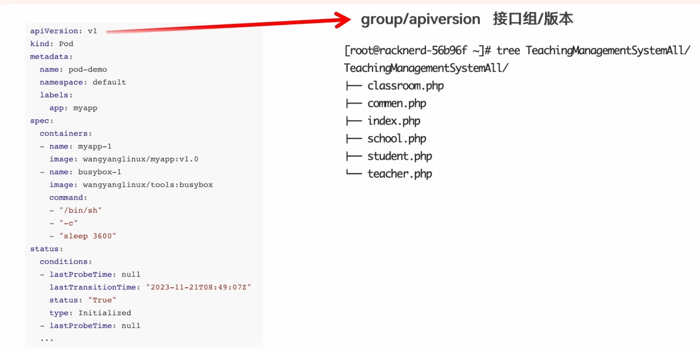
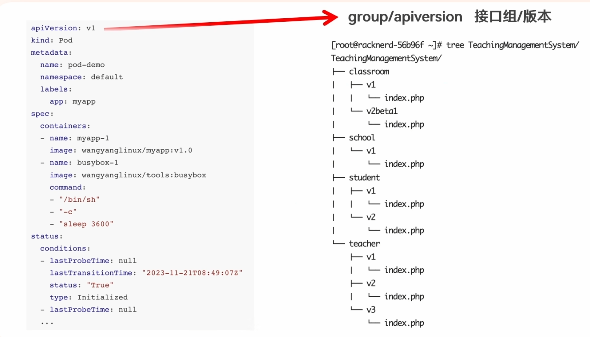
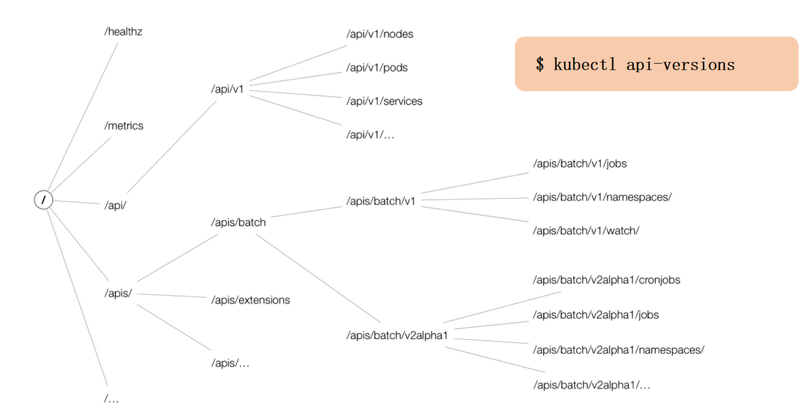
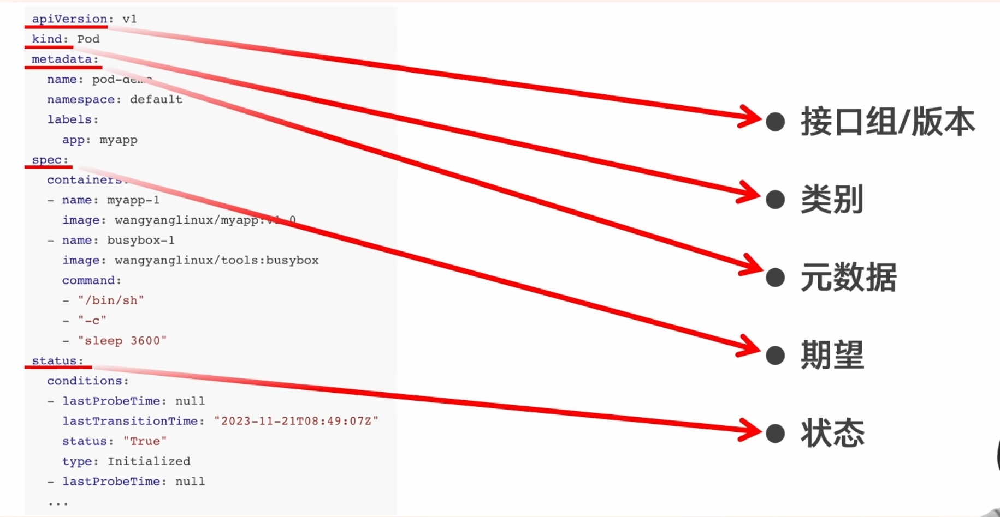
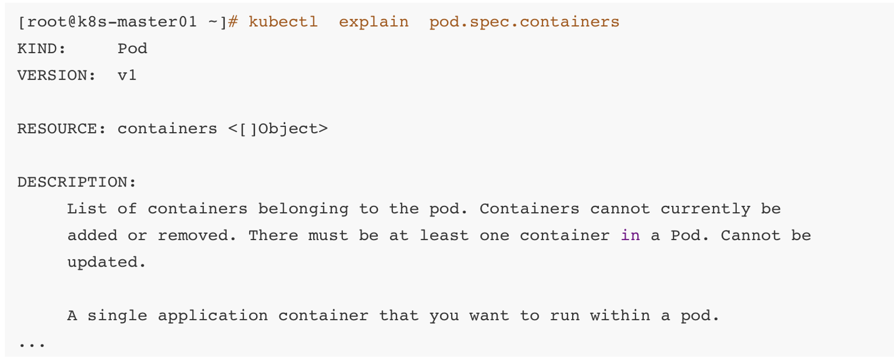
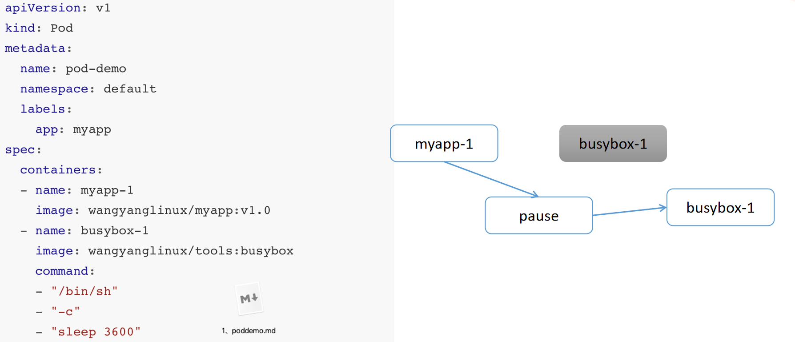

# 什么是资源

资源就是Kubernetes中的一切


## 基本概述 - 1


## 基本概述 - 2


## 资源类别


# 资源清单的编写(结构、定义、编写)

## 资源清单 - 结构 - apiVersion - 1





## 资源清单 - 结构 - apiVersion - 2



## 资源清单 - 结构 - apiVersion - 3



## 资源清单 - 对象属性查询



## 资源清单 - pod demo



```shell
cd
mkdir 4
cd 4
vi 1.pod.yaml

```
将下面这个粘贴进我们的1.pod.yaml中

```yaml
apiVersion: v1
kind: Pod
metadata:
  name: pod-demo
spec:
  containers:
    - name: myapp-1
      image: nginx:alpine  # 替换为公共镜像
    - name: busybox-1
      image: busybox:latest  # 官方镜像
      command: ["/bin/sh", "-c", "sleep 3600"]
```

然后执行: `kubectl create -f 1.pod.yaml`

等待资源创建成功


如果失败，可能是docker源的问题，可以去/etc/docker/daemon.json中，将这个文件里面改成如下，记得所有节点都要更改

```json
{
    "registry-mirrors": [
    	"https://docker.m.daocloud.io",
    	"https://docker.imgdb.de",
    	"https://docker-0.unsee.tech",
    	"https://docker.hlmirror.com",
    	"https://docker.1ms.run",
    	"https://func.ink",
    	"https://lispy.org",
    	"https://docker.xiaogenban1993.com"
    ]
}


```

然后执行: `sudo systemctl restart docker`

然后删除刚刚创建失败的pod `kubectl delete pod pod-demo`

然后执行:

```shell
kubectl create -f 1.pod.yaml
kubectl get pod 
```

通过`kubectl describe pod pod-demo`可以查看资源创建情况

## kubectl常用命令

doc/kubectl 常用命令.docx


# Pod的生命周期

# Pod是如何被调度运行的？

