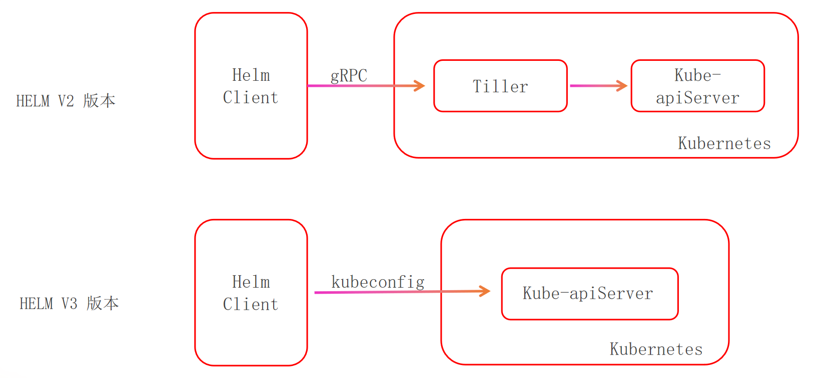

# HELM - Kubernetes中的类YUM工具

## 01. HELM概念

基于它，您就放心部署吧


### 什么是HELM


### HELM 重要概念


### HELM组件结构




### HELM V2历史包袱、V3优势


## 02. HELM安装及演示

安装后演示跑通环节

### 认证模式 - 类型

### 安装初始化

#### 安装

```bash
# 下载 Helm 安装脚本（官方推荐方式）
curl -fsSL -o get_helm.sh https://raw.githubusercontent.com/helm/helm/main/scripts/get-helm-3

# 添加执行权限
chmod 700 get_helm.sh

# 运行安装脚本（自动安装最新稳定版）
./get_helm.sh
```


## 03. Ingress - nginx


