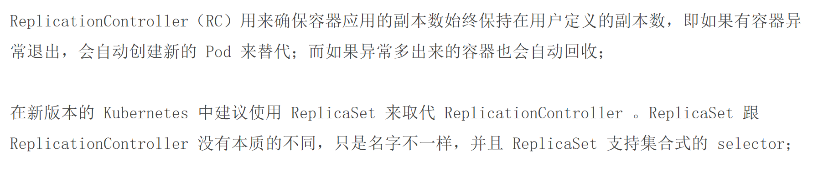
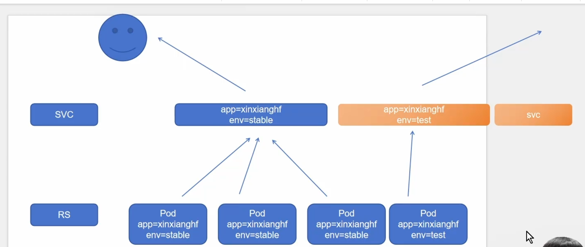
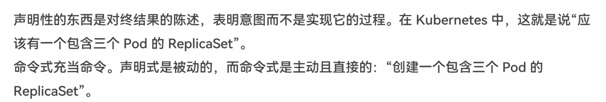
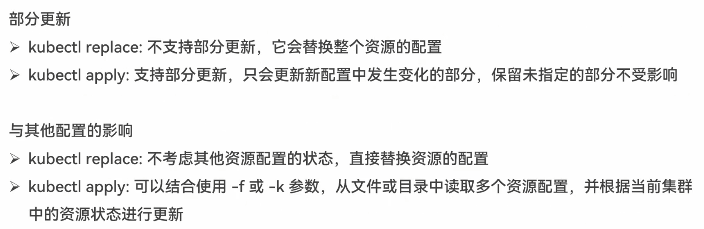
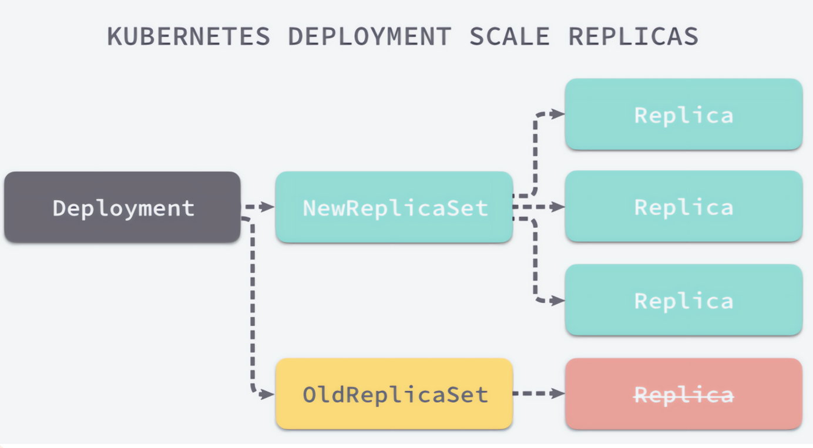

# Pod控制器-核心灵魂

## 控制器

### 控制器 - 概述


### 控制器 - 控制循环


### 控制器 - Pod控制器


## Pod控制器(pod的监护人)

### pod控制器 - ReplicationController和ReplicaSet




- RC控制器：保障当前的Pod数量与期望值一致
- RS控制器：功能与RC控制器类似，但是多了标签选择的运算方式


### RC控制器

#### 1.rc.yaml

```yaml
apiVersion: v1
kind: ReplicationController
metadata:
  name: rc-demo
spec:
  replicas: 3
  selector:
    app: rc-demo
  template:
    metadata:
      labels:
        app: rc-demo
    spec:
      containers:
      - name: rc-demo-container
        image: nginx:1.25  
        env:
        - name: GET_HOSTS_FROM
          value: dns
        - name: zhangsan    # 修正原YAML中的格式错误（原配置缺少`-`）
          value: "123"
        ports:
        - containerPort: 80
```

```bash
kubectl apply -f 1.rc.yaml
kubectl get rc
kubectl get pod
```

如果我们删除某个pod,rc会自动帮我们重新创建一个pod，以保持pod的数量为3

#### 测试改变label，rc的情况


执行如下：

```bash
[root@k8s-master01 5]# kubectl get pod --show-labels
```

得到下面的结果：

```bash
NAME            READY   STATUS    RESTARTS   AGE     LABELS
rc-demo-84wkq   1/1     Running   0          9m23s   app=rc-demo
rc-demo-fbpbr   1/1     Running   0          9m23s   app=rc-demo
rc-demo-sxvx5   1/1     Running   0          7m18s   app=rc-demo
```

执行:

```bash
kubectl label pod rc-demo-84wkq app=tangfire --overwrite
```

然后我们再执行：

```bash
[root@k8s-master01 5]# kubectl get pod --show-labels

```

可以发现：

```bash
NAME            READY   STATUS    RESTARTS   AGE     LABELS
rc-demo-84wkq   1/1     Running   0          11m     app=tangfire
rc-demo-fbpbr   1/1     Running   0          11m     app=rc-demo
rc-demo-sxvx5   1/1     Running   0          9m32s   app=rc-demo
rc-demo-t6n57   1/1     Running   0          3s      app=rc-demo
```


然后我们再执行：

```bash
kubectl label pod rc-demo-84wkq app=rc-demo --overwrite
```

```bash
kubectl get pod --show-labels
```

得到如下：

```bash
NAME            READY   STATUS    RESTARTS   AGE   LABELS
rc-demo-84wkq   1/1     Running   0          15m   app=rc-demo
rc-demo-fbpbr   1/1     Running   0          15m   app=rc-demo
rc-demo-sxvx5   1/1     Running   0          13m   app=rc-demo
```

会优先删除最新创建的pod


#### 调整当前副本数量

```bash
kubectl scale rc rc-demo --replicas=10
```
```bash
[root@k8s-master01 5]# kubectl get pod --show-labels
NAME            READY   STATUS    RESTARTS   AGE   LABELS
rc-demo-78qh4   1/1     Running   0          16s   app=rc-demo
rc-demo-7prln   1/1     Running   0          16s   app=rc-demo
rc-demo-84wkq   1/1     Running   0          19m   app=rc-demo
rc-demo-8v79g   1/1     Running   0          16s   app=rc-demo
rc-demo-fbpbr   1/1     Running   0          19m   app=rc-demo
rc-demo-j7tbn   1/1     Running   0          17s   app=rc-demo
rc-demo-kz757   1/1     Running   0          17s   app=rc-demo
rc-demo-sgtm5   1/1     Running   0          16s   app=rc-demo
rc-demo-sxvx5   1/1     Running   0          17m   app=rc-demo
rc-demo-tm88g   1/1     Running   0          17s   app=rc-demo
```


### RS控制器

#### 2.rs.yaml

```yaml
apiVersion: apps/v1
kind: ReplicaSet
metadata:
  name: rs-ml-demo
spec:
  replicas: 3
  selector:
    matchLabels:
      app: rs-ml-demo
      domain: fire
  template:
    metadata:
      labels:
        app: rs-ml-demo
        domain: fire
        version: v1
    spec:
      containers:
      - name: rs-ml-demo-container
        image: nginx:1.25  
        env:
        - name: GET_HOSTS_FROM
          value: dns
        ports:
        - containerPort: 80
```

```shell
kubectl apply -f 2.rs.yaml
kubectl get pod
kubectl get rs
```

### selector.matchExpressions


rs在标签选择器上，除了可以定义键值对的选择形式，还支持matchExpressions字段，可以提供多种选择。
目前支持的操作包括：

- In: label的值在某个列表中
- Notin: label的值不在某个列表中
- Exists: 某个label存在
- DoesNotExist: 某个label不存在

#### 3.rs.yaml

```yaml
apiVersion: apps/v1
kind: ReplicaSet
metadata:
  name: rs-me-exists-demo
spec:
  selector:
    matchExpressions:
      - key: app
        operator: Exists
  template:
    metadata:
      labels:
        app: spring-k8s
    spec:
      containers:
      - name: rs-me-exists-demo-container
        image: nginx:1.25  
        ports:
        - containerPort: 80
```

```bash
kubectl get pod --show-labels
rs-me-exists-demo-z8g4m   1/1     Running   0          8m38s   app=spring-k8s
```

```bash
kubectl label pod rs-me-exists-demo-z8g4m app=tangfire --overwrite
```

会发现label改掉了，但是rs控制器并没有创建新pod，只要当前label存在，key为app即可

#### 4.rs.yaml

```yaml
apiVersion: apps/v1
kind: ReplicaSet
metadata:
  name: rs-me-in-demo
spec:
  selector:
    matchExpressions:
      - key: app
        operator: In
        values:
          - spring-k8s
          - hahahah
  template:
    metadata:
      labels:
        app: sg-k8s
    spec:
      containers:
      - name: rs-me-in-demo-container
        image: nginx:1.25  
        ports:
        - containerPort: 80
```

```bash
[root@k8s-master01 5]# kubectl apply -f 4.rs.yaml 
The ReplicaSet "rs-me-in-demo" is invalid: spec.template.metadata.labels: Invalid value: map[string]string{"app":"sg-k8s"}: `selector` does not match template `labels`
```


#### 4.rs.yaml

```yaml
apiVersion: apps/v1
kind: ReplicaSet
metadata:
  name: rs-me-in-demo
spec:
  selector:
    matchExpressions:
      - key: app
        operator: In
        values:
          - spring-k8s
          - hahahah
  template:
    metadata:
      labels:
        app: hahahah
    spec:
      containers:
      - name: rs-me-in-demo-container
        image: nginx:1.25  
        ports:
        - containerPort: 80
```


```bash
[root@k8s-master01 5]# kubectl get pod --show-labels
NAME                      READY   STATUS    RESTARTS   AGE     LABELS
rs-me-in-demo-fnk5q       1/1     Running   0          4m59s   app=hahahah
```

```bash
kubectl label pod rs-me-in-demo-fnk5q app=spring-k8s --overwrite
```

```bash
[root@k8s-master01 5]# kubectl get pod --show-labels
NAME                      READY   STATUS    RESTARTS   AGE     LABELS
rs-me-in-demo-fnk5q       1/1     Running   0          6m24s   app=spring-k8s
```





### pod控制器 - Deployment - 基本概念


#### 滚动升级和回滚应用

Kubernetes Deployment 的 **滚动升级（Rolling Update）** 和 **回滚（Rollback）** 功能，这是 Deployment 管理应用更新的核心优势。

**核心思想：** Deployment 旨在以**可控、最小化服务中断**的方式更新运行中的应用程序。

---

### 一、滚动升级 (Rolling Update)

当您需要更新应用程序（例如，使用新版本的容器镜像、修改环境变量、更新资源请求等）时，Deployment 默认采用 **RollingUpdate** 策略。

**滚动升级的过程：**

1.  **触发升级：** 您修改 Deployment 的配置（通常是 `.spec.template` 部分，比如 `image: nginx:1.25` -> `image: nginx:1.26`），然后使用 `kubectl apply -f deployment.yaml` 或 `kubectl set image deployment/myapp-deploy myapp=nginx:1.26` 应用更改。
2.  **创建新 ReplicaSet：** Deployment 控制器检测到 Pod 模板（`.spec.template`）发生了变化。它不会直接修改现有的 Pod，而是会创建一个**新的 ReplicaSet** 对象。这个新 ReplicaSet 的模板包含您的新配置（例如，`nginx:1.26`）。
3.  **逐步扩展新 Pod：** Deployment 控制器开始根据新模板**创建新的 Pod**。新 Pod 会带上新模板中定义的标签（例如，`version: v2`）。
4.  **逐步缩减旧 Pod：** 在创建新 Pod 的同时，Deployment 控制器开始**优雅地终止**旧 ReplicaSet 管理的旧 Pod（例如，运行 `nginx:1.25` 的 Pod）。
5.  **控制节奏：** 这个过程不是一次性完成的。Deployment 严格按照定义的 **滚动更新策略** (`spec.strategy.rollingUpdate`) 来控制节奏：
    *   **`maxSurge`** (默认为 25%)： 允许创建的、超过期望副本数 (`replicas`) 的新 Pod 的最大数量。可以是绝对数（如 `2`）或百分比（如 `25%`）。例如，如果 `replicas: 4` 且 `maxSurge: 1`，则在升级过程中，最多允许同时存在 `4 (期望) + 1 (maxSurge) = 5` 个 Pod。
    *   **`maxUnavailable`** (默认为 25%)： 在更新过程中，相对于期望副本数，允许**不可用**的旧 Pod 的最大数量。可以是绝对数或百分比。例如，如果 `replicas: 4` 且 `maxUnavailable: 1`，则在升级过程中的任何时刻，至少要有 `4 - 1 = 3` 个 Pod（可以是旧的、新的或混合）处于可用状态。
6.  **持续监控与替换：** 新 Pod 启动并通过**就绪探针 (Readiness Probe)** 后（如果配置了），会被视为可用。控制器会继续按策略创建新 Pod 并终止旧 Pod，直到**所有旧 Pod 被新 Pod 替换**，且新 Pod 的数量达到 `replicas` 指定的期望值。
7.  **完成：** 当所有旧 Pod 被终止，新 ReplicaSet 完全接管并管理着指定数量的新 Pod 时，滚动升级完成。旧的 ReplicaSet 会被保留（但缩容到 0 个副本），这是为了支持回滚。

**滚动升级的关键优势：**

*   **零停机（或接近零停机）：** 在整个更新过程中，始终有 Pod 在运行并处理请求（受 `maxUnavailable` 约束），确保服务持续可用。
*   **渐进式：** 更新是逐步进行的，降低了风险。如果新版本有问题，通常只会在部分新 Pod 上体现，影响范围有限。
*   **可控性：** 通过 `maxSurge` 和 `maxUnavailable` 参数，您可以精细控制更新速度和允许的服务中断程度。
*   **自动健康检查：** 结合就绪探针，Kubernetes 可以确保新 Pod 真正准备好接收流量后才将旧 Pod 下线。

**查看滚动升级状态：**

```bash
kubectl rollout status deployment/myapp-deploy  # 实时查看更新进度
kubectl describe deployment/myapp-deploy       # 查看详细事件和状态
kubectl get replicasets                        # 查看新旧 ReplicaSet
kubectl get pods                               # 查看新旧 Pod 的状态和标签
```

---

### 二、回滚应用 (Rollback)

如果在滚动升级后，您发现新版本的应用存在问题（例如，Bug、性能下降、配置错误），Deployment 提供了简便的**回滚（Rollback）** 机制，可以将应用**快速恢复到之前的稳定状态**。

**回滚的过程：**

1.  **触发回滚：** 使用 `kubectl rollout undo` 命令：
    ```bash
    kubectl rollout undo deployment/myapp-deploy
    ```
2.  **识别历史版本：** Deployment 控制器会查找该 Deployment 的**修订历史（Revision History）**。每次对 Pod 模板 (`spec.template`) 的更改（触发滚动升级）都会创建一个新的修订版本（Revision）。默认情况下，Deployment 会保留一定数量的旧 ReplicaSet（及其配置）来支持回滚（保留数量由 `spec.revisionHistoryLimit` 指定，默认为 10）。
3.  **回滚到上一版：** 默认情况下，`kubectl rollout undo` 会将 Deployment **回滚到上一个修订版本**。这意味着：
    *   控制器会找到**上一个稳定版本**对应的 ReplicaSet（例如，之前运行 `nginx:1.25` 的那个）。
    *   它会启动一个**新的滚动升级过程**（可以看作是“逆向滚动升级”）：
        *   逐步扩展旧稳定版（`nginx:1.25`）的 Pod（通过旧 ReplicaSet）。
        *   逐步缩减问题新版（`nginx:1.26`）的 Pod。
4.  **完成回滚：** 过程与滚动升级类似，受相同的 `maxSurge` 和 `maxUnavailable` 策略控制。最终，旧稳定版 ReplicaSet 再次管理所有 Pod，应用恢复到升级前的状态。
5.  **回滚到特定版本：** 如果需要回滚到更早的某个特定修订版本，可以先查看历史，然后指定版本号：
    ```bash
    kubectl rollout history deployment/myapp-deploy          # 查看修订历史
    kubectl rollout history deployment/myapp-deploy --revision=2  # 查看某个修订的详细信息
    kubectl rollout undo deployment/myapp-deploy --to-revision=2  # 回滚到特定修订版本 (e.g., rev=2)
    ```

**回滚的关键优势：**

*   **快速恢复：** 在发现新版本有问题时，能迅速恢复到已知稳定的旧版本，最小化故障影响时间和范围。
*   **操作简单：** 使用简单的 `kubectl` 命令即可完成，无需手动操作 Pod 或 ReplicaSet。
*   **基于历史：** 依赖保留的 ReplicaSet 历史记录，确保了回滚目标的准确性。

---

### 总结

*   **滚动升级**是 Deployment 更新应用的标准方式，通过逐步用新 Pod 替换旧 Pod，确保服务不中断或中断最小化。它由 `maxSurge` 和 `maxUnavailable` 策略控制节奏。
*   **回滚**是 Deployment 的安全网。当升级导致问题时，它能快速、可靠地将应用恢复到之前的稳定版本，依赖于保存的修订历史（旧 ReplicaSet）。

**常用命令回顾：**

```bash
# 触发更新 (修改yaml后应用)
kubectl apply -f deployment.yaml

# 触发更新 (直接修改镜像)
kubectl set image deployment/myapp-deploy myapp=nginx:1.26

# 查看滚动升级状态
kubectl rollout status deployment/myapp-deploy

# 暂停滚动升级 (用于金丝雀发布等)
kubectl rollout pause deployment/myapp-deploy

# 恢复暂停的滚动升级
kubectl rollout resume deployment/myapp-deploy

# 回滚到上一版本
kubectl rollout undo deployment/myapp-deploy

# 查看修订历史
kubectl rollout history deployment/myapp-deploy

# 回滚到特定版本
kubectl rollout undo deployment/myapp-deploy --to-revision=2
```

掌握滚动升级和回滚是安全、可靠地在 Kubernetes 上部署和管理应用程序的关键。


### 声明式与命令式




```bash
kubectl replace -f deployment.yaml
kubectl apply -f deployment.yaml
kubectl diff -f deployment.yaml
```

以下是关于 `kubectl replace`、`kubectl apply` 和 `kubectl diff` 命令的详细解释和对比：

---

### **1. `kubectl replace -f deployment.yaml`**
#### **作用**
- **完全替换**：用 YAML 文件中的配置 **强制覆盖** 集群中现有的资源。
- **要求**：资源必须已存在，否则会报错（`Error from server (NotFound)`）。

#### **使用场景**
- 当需要 **完全重置** 资源的配置时（如修复错误的更新）。
- 不保留任何原有配置（如未在 YAML 中定义的字段会被删除）。

#### **示例**
```bash
kubectl replace -f deployment.yaml
```
#### **注意事项**
- 如果资源不存在，必须改用 `kubectl create -f deployment.yaml`。
- **破坏性操作**：可能触发 Pod 重建（若模板字段被修改）。

---

### **2. `kubectl apply -f deployment.yaml`**
#### **作用**
- **声明式更新**：将 YAML 文件的配置 **合并到** 集群中现有的资源。
- **智能合并**：
    - 如果资源不存在，则创建它（等同于 `create`）。
    - 如果资源已存在，则按字段差异进行更新（保留未修改的字段）。

#### **使用场景**
- **日常部署和更新**（推荐使用）。
- 支持 **幂等操作**（多次执行结果一致）。

#### **示例**
```bash
kubectl apply -f deployment.yaml
```
#### **底层机制**
- Kubernetes 会记录当前配置的 **最后应用版本**（存储在 `metadata.annotations` 中），用于计算差异。

---

### **3. `kubectl diff -f deployment.yaml`**
#### **作用**
- **预览变更**：显示 YAML 文件与集群中现有资源之间的差异（**dry-run**）。
- **只读操作**：不会实际修改集群状态。

#### **使用场景**
- 确认修改是否符合预期，避免直接操作导致意外后果。
- 调试或审计变更内容。

#### **示例**
```bash
kubectl diff -f deployment.yaml
```
#### **输出示例**
```diff
spec.template.spec.containers[0].image:
- nginx:1.25
+ nginx:1.26
```

---

### **三者的核心区别**
| **命令**               | **资源不存在时** | **更新策略**       | **是否触发重建**       | **典型用途**               |
|------------------------|----------------|-------------------|----------------------|--------------------------|
| `kubectl replace`      | 报错            | 完全覆盖           | 是（若模板修改）       | 强制回滚或修复配置           |
| `kubectl apply`        | 自动创建         | 智能合并           | 仅更新变化的字段       | 日常部署和滚动更新（推荐）    |
| `kubectl diff`         | 无效果          | 仅显示差异         | 否                   | 变更预检或调试             |

---

### **使用建议**
1. **优先使用 `apply`**
    - 适合大多数场景，避免意外覆盖未修改的字段。
    - 例如更新镜像版本：
      ```bash
      kubectl apply -f deployment.yaml
      ```

2. **谨慎使用 `replace`**
    - 仅在需要完全重置配置时使用（如修复损坏的资源）。
    - 示例：
      ```bash
      kubectl replace -f deployment.yaml --force --grace-period=0
      ```

3. **预检变更用 `diff`**
    - 在关键操作前验证修改：
      ```bash
      kubectl diff -f deployment.yaml
      ```

---

### **补充：其他相关命令**
- **创建资源**（仅首次）：
  ```bash
  kubectl create -f deployment.yaml
  ```
- **删除资源**：
  ```bash
  kubectl delete -f deployment.yaml
  ```


### replace于apply对比 - 1


### replace于apply对比 - 2




### Deployment

#### 5.deployment.yaml

```yaml
apiVersion: apps/v1
kind: Deployment
metadata:
  labels:
    app: myapp-deploy
  name: myapp-deploy
spec:
  selector:
    matchLabels:
      app: myapp-deploy
  template:
    metadata:
      labels:
        app: myapp-deploy
        version: v1
    spec:
      containers:
      - image: nginx:1.25  
        name: myapp
        ports:
        - containerPort: 80 
```

```bash
kubectl apply -f 5.deployment.yaml
kubectl get pod
```


这是一个 Kubernetes **Deployment** 的 YAML 配置文件。它的核心目的是声明式地定义和管理一个 **Pod** 以及多个该 Pod 的副本（Replicas），确保指定数量的 Pod 实例始终在运行。即使某个 Pod 崩溃或被删除，Deployment 控制器会自动创建新的 Pod 来替换它。

让我们逐部分解释：

1.  **`apiVersion: apps/v1`**
    *   指定使用的 Kubernetes API 版本。`apps/v1` 是当前稳定版本，用于 Deployment、StatefulSet 等应用工作负载资源。

2.  **`kind: Deployment`**
    *   明确声明要创建的资源类型是 `Deployment`。

3.  **`metadata:`**
    *   定义 Deployment 自身的元数据。
    *   **`labels:`**
        *   `app: myapp-deploy`: 给这个 Deployment 对象打上一个标签 `app=myapp-deploy`。标签用于组织和选择资源。
    *   **`name: myapp-deploy`**
        *   这个 Deployment 对象在 Kubernetes 集群中的唯一名称。

4.  **`spec:`**
    *   定义 Deployment 的**期望状态**（Desired State），即你希望这个 Deployment 最终呈现的样子。
    *   **`selector:`**
        *   定义 Deployment 如何查找由它管理的 Pod。这是连接 Deployment 和它创建/管理的 Pod 的关键。
        *   **`matchLabels:`**
            *   `app: myapp-deploy`: Deployment 将管理所有拥有标签 `app=myapp-deploy` 的 Pod。**必须**与下面 Pod 模板中定义的标签匹配。
    *   **`template:`**
        *   定义由 Deployment 创建的 Pod 的模板。每当 Deployment 需要创建一个新的 Pod（比如启动时、滚动更新时、替换故障 Pod 时），它就会使用这个模板。
        *   **`metadata:`**
            *   定义 Pod 的元数据。
            *   **`labels:`**
                *   `app: myapp-deploy`: 给 Pod 打上标签 `app=myapp-deploy`。这个标签**必须**与上面 `spec.selector.matchLabels` 中定义的选择器匹配，这样 Deployment 才能识别和管理这些 Pod。
                *   `version: v1`: 给 Pod 打上另一个标签 `version=v1`。这常用于区分不同版本的 Pod（例如，在蓝绿部署或金丝雀发布中）。
        *   **`spec:`**
            *   定义 Pod 内部容器的期望状态。
            *   **`containers:`**
                *   一个数组，列出 Pod 中运行的一个或多个容器。
                *   **`- image: nginx:1.25`**
                    *   指定容器使用的镜像及其版本标签。这里使用官方 Nginx 镜像的 1.25 版本。
                *   **`name: myapp`**
                    *   给这个容器命名（在 Pod 内部唯一）。用于日志、命令执行等。
                *   **`ports:`**
                    *   声明容器**暴露**的端口列表。这主要是信息性的，告诉 Kubernetes 这个容器监听了哪些端口。
                    *   **`- containerPort: 80`**
                        *   声明容器内部监听的端口号是 80（Nginx 的默认 HTTP 端口）。**注意：这并不会自动在节点上开放端口或提供外部访问！** 要外部访问 Pod，通常需要创建一个 `Service` 资源。

**总结这个配置文件的作用：**

1.  **创建 Deployment：** 在 Kubernetes 集群中创建一个名为 `myapp-deploy` 的 Deployment 对象。
2.  **管理 Pod 副本：** 这个 Deployment 的目标是确保**至少一个**（因为 `spec.replicas` 没有显式设置，默认为 1）符合特定标签的 Pod 始终在运行。
3.  **识别 Pod：** Deployment 通过标签选择器 `app=myapp-deploy` 来识别哪些 Pod 是由它管理的。
4.  **Pod 模板：** 当需要创建新的 Pod 时，Deployment 使用模板中的定义：
    *   Pod 会被打上两个标签：`app=myapp-deploy` (用于被 Deployment 管理) 和 `version=v1` (用于版本标识)。
    *   Pod 内部运行**一个**容器：
        *   容器名为 `myapp`。
        *   使用 `nginx:1.25` 镜像启动。
        *   容器内部监听端口 `80`。
5.  **自动恢复：** 如果这个 Pod 意外终止（崩溃、节点故障等），Deployment 控制器会检测到当前状态（1个 Pod）与期望状态（1个 Pod）不符，并**立即自动创建一个新的 Pod** 来替换它，确保始终有 1 个 Pod 在运行。

**关键点强调：**

*   **`selector.matchLabels` 和 `template.metadata.labels` 必须匹配：** 这是 Deployment 能够找到并管理它创建的那些 Pod 的机制。如果它们不匹配，Deployment 将无法关联到它创建的 Pod。
*   **`containerPort` 是声明性的：** 它告诉 Kubernetes 容器监听了哪个端口，但**本身并不提供网络访问**。要让外部流量或集群内其他服务访问这个 Nginx Pod，你需要创建一个 Kubernetes `Service` 资源（例如 `ClusterIP`, `NodePort`, 或 `LoadBalancer` 类型），该 Service 会使用标签选择器（如 `app=myapp-deploy`）找到这些 Pod 并将流量转发到它们的 `80` 端口。
*   **默认副本数：** 这个配置没有显式设置 `spec.replicas` 字段，所以 Kubernetes 默认会创建并维护 **1 个** Pod 副本。如果你想运行多个副本（例如 3 个以实现高可用），需要在 `spec:` 下添加 `replicas: 3`。

**部署后的效果：**

运行 `kubectl apply -f your-file.yaml` 后，你会看到：

1.  一个名为 `myapp-deploy` 的 Deployment 被创建 (`kubectl get deployments`).
2.  该 Deployment 创建了一个对应的 ReplicaSet (`kubectl get replicasets`，名字通常以 `myapp-deploy-` 开头加哈希值)。ReplicaSet 是 Deployment 用来管理 Pod 副本的实际控制器。
3.  ReplicaSet 创建了一个（或指定数量的）Pod (`kubectl get pods`，名字通常以 `myapp-deploy-` 开头加 ReplicaSet 哈希值再加 Pod 哈希值)。这些 Pod 会有标签 `app=myapp-deploy` 和 `version=v1`。
4.  这个 Pod 内部运行着 `nginx:1.25` 容器。


### pod控制器 - Deployment - 与RS的关联



### pod控制器 - Deployment - 常用命令


#### Deployment

```yaml
apiVersion: apps/v1
kind: Deployment
metadata:
  labels:
    app: deployment-demo
  name: deployment-demo
spec:
  replicas: 5
  selector:
    matchLabels:
      app: deployment-demo
  template:
    metadata:
      labels:
        app: deployment-demo
    spec:
      containers:
      - image: nginx:1.25 
        name: deployment-demo-container
```


### kubectl create、apply、replace


- create 创建资源对象
  - -f 通过基于文件的创建，但是如果此文件描述的对象存在，那么那怕文件描述的信息发生了改变，再次提交时也不会应用
- apply 创建资源对象、修改资源对象
  - -f 基于文件创建，如果目标对象与文件本身发生改变，那么会根据文件的指定一一修改目标对象的属性（部分更新）
- replace 创建资源对象、修改资源对象
  - -f 基于文件创建，如果目标对象与文件本身发生改变，那么会重建此对象（替换)


