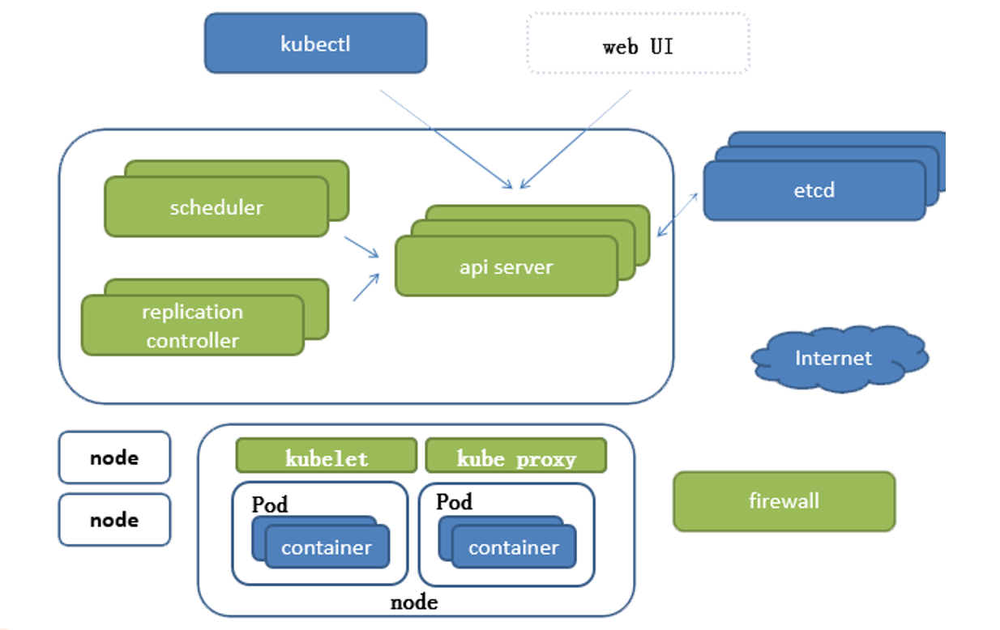
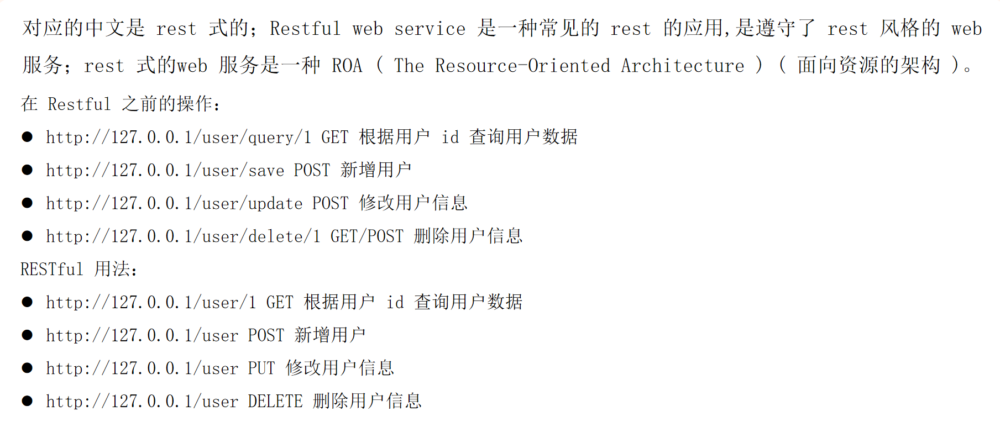
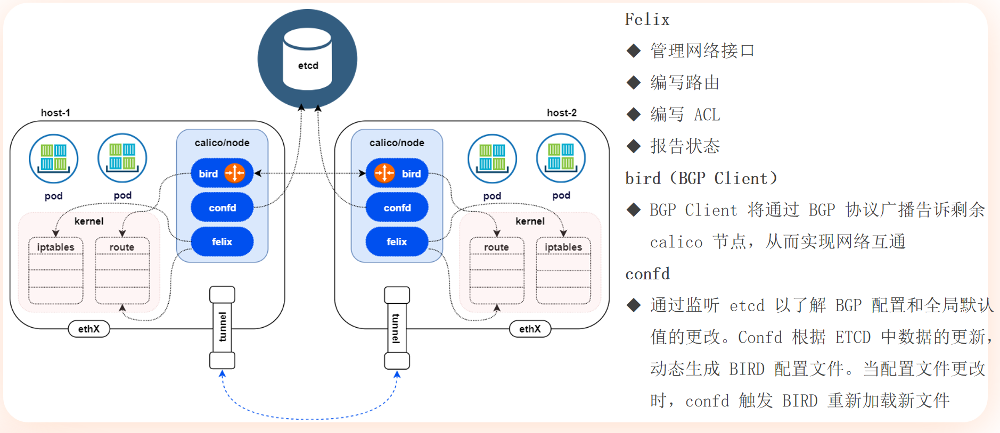

# 基础设施的迭代 - 单机场景


## Traditional Deployment


安全性问题：多个应用放在一个机器上，比如apache,mysql,nginx放在同一个机器上，万一apache被劫持，然后mysql与apache又在同一个物理机，mysql对应的数据目录就被分享出去，以此mysql数据泄露

那如果不装在同一个机器不就好了嘛？

资源利用率问题：这样的话，一台机器就运行一个apache，资源利用率太低了，企业接受不了

资源利用率高，安全性下降，安全性高，资源利用率下降

## Virtualized Deployment


提高了安全性，相对提高了资源利用率

但是我们发现，底层的这些操作系统，它需要消耗资源，但是它本身又不提供资源

那随着虚拟机数量增加，不得已提供的系统资源就会增加，那相对浪费的资源就更多

## Container Deployment


对比传统虚拟机的方式，安全性下降，但还是越过了及格线，少了底层操作系统的开销，资源利用率远远高于传统虚拟化


# 基础设施的迭代 - 集群场景 - IAAS


# 基础设施的迭代 - 集群场景 - PAAS


# 基础设施的迭代 - 集群场景 - SAAS

不讨论

# 平台对比 - PAAS


# Kubernetes 优势


# 平台支持的规模数量


# 那些前辈们


# Kubernetes-宏观架构


Master节点数量一般是3,5,7,9 大于1的奇数个
Node节点数量无所谓，实际运行任务的节点


# Kubernetes-微观架构




通过k8s可以将数以千计的物理机组成成一个大集群，我们如果想运行应用，只需要向这个大集群发送请求，它就可以自动帮我们选择位于哪一个节点去部署对应的容器

## Master节点

- api server 其实就是整个集群的入口
- 作用：接受到请求以后，审核请求的通过以后，将请求的数据存储在后端的ETCD服务器内部
- scheduler调度器
- 作用：调度器会去绑定我们需要运行的容器和节点之间的关系，这样对应的节点就能运行我们希望的容器
- replication controller(controller manager)集群管家
- 作用：集群管家保障整个集群的当前可用


梳理：我们通过kubectl（命令行工具）下发一个容器的任务的创建运行，那这个请求会被发至api server，api server审核是否有权限，如果没问题，就会把这个任务保存至ETCD中，
scheduler(调度器)会定期的通过api server获取我们当前需要运行的任务有没有跟节点进行绑定，如果还有没跟节点绑定的，负责绑定
controller manager定期检查集群运行状态是否跟预期相符

## Node节点

- kubelet
- 作用：监听api server有没有容器需要创建，如果有容器需要创建，通过接口调用docker,podman等实现容器的创建，承上启下，解决容器的创建删除问题
- kube proxy
- 作用：监听api server,发现当前节点上有没有一些防火墙规则，负载均衡规则需要去创建，承上启下，解决我们当前节点网络，负载均衡问题


# Restful



# Kubernetes - 组件、插件、附件


## 插件

在 Kubernetes 中，**插件（Addons）** 是扩展集群核心功能的附加组件，用于增强运维、网络、安全、监控等能力。它们不是 Kubernetes 核心的一部分，但通常是生产环境不可或缺的组件。以下是分类详解：

---

### **1. 插件的主要类型**
#### **(1) 网络插件（CNI）**
- **作用**：实现 Pod 间网络通信，满足 Kubernetes 网络模型要求。
- **代表插件**：
    - **Calico**：基于 BGP 的高性能网络，支持网络策略。
    - **Flannel**：简单的 Overlay 网络，适合中小集群。
    - **Cilium**：基于 eBPF，提供网络和安全能力。
- **必须性**：★★★（无 CNI 则 Pod 无法跨节点通信）

#### **(2) 服务发现插件（DNS）**
- **作用**：为 Service 和 Pod 提供集群内 DNS 解析。
- **默认插件**：
    - **CoreDNS**：轻量级 DNS 服务器，替代早期的 kube-dns。
- **示例**：
  ```bash
  kubectl get svc -n kube-system | grep coredns
  ```
- **必须性**：★★★（服务发现依赖 DNS）

#### **(3) 监控插件**
- **作用**：收集集群指标、日志和性能数据。
- **代表插件**：
    - **Metrics Server**：提供基础的 CPU/内存监控数据（`kubectl top` 依赖它）。
    - **Prometheus + Grafana**：全功能监控告警系统。
    - **Elasticsearch + Fluentd + Kibana (EFK)**：日志收集分析套件。
- **必须性**：★★☆（生产环境强烈推荐）

#### **(4) 存储插件（CSI）**
- **作用**：为 Pod 提供持久化存储卷支持。
- **代表插件**：
    - **AWS EBS CSI Driver**：为 AWS EBS 卷提供动态供给。
    - **Rook/Ceph**：开源分布式存储方案。
- **必须性**：★★☆（需要持久化存储时必备）

#### **(5) 网络策略插件**
- **作用**：实现 Pod 间的网络隔离（如防火墙规则）。
- **代表插件**：
    - **Calico NetworkPolicy**：扩展 Kubernetes 原生 NetworkPolicy。
    - **Cilium NetworkPolicies**：基于 eBPF 的高性能策略。
- **必须性**：★★☆（多租户安全隔离场景必备）

#### **(6) 可视化插件**
- **作用**：提供图形化管理界面。
- **代表插件**：
    - **Kubernetes Dashboard**：官方 Web UI。
    - **Lens**：功能强大的桌面客户端。
- **必须性**：★☆☆（非必需但方便）

---

### **2. 插件的部署方式**
#### **(1) 官方托管插件**
部分插件由 Kubernetes 官方维护，可通过 `kubeadm` 直接部署：
```bash
kubeadm init --apiserver-advertise-address=192.168.1.100 \
             --pod-network-cidr=10.244.0.0/16 \
             --upload-certs \
             --skip-phases=addon/kube-proxy,addon/coredns  # 可选跳过某些插件
```

#### **(2) 手动部署（YAML/Helm）**
大多数插件通过 YAML 或 Helm 安装：
```bash
# 示例：用 Helm 安装 Metrics Server
helm install metrics-server bitnami/metrics-server -n kube-system
```

#### **(3) 云厂商托管插件**
公有云平台（如 AWS EKS、Azure AKS）提供预集成的插件管理：
```bash
# AWS EKS 启用 CoreDNS 自动伸缩
eksctl utils update-coredns --cluster my-cluster --auto-scaler-enabled
```

---

### **3. 插件的核心交互机制**
#### **(1) 与 Kubernetes API 的交互**
- **监听资源变化**：如 CoreDNS 监听 Service 和 Endpoint 变化。
- **扩展 API**：如 Metrics Server 提供 `metrics.k8s.io` API。

#### **(2) 与节点组件的协作**
- **kubelet**：通过 CRI（容器运行时接口）和 CNI（网络插件接口）调用插件。
- **kube-proxy**：与网络插件协同管理 Service 的 IPVS/iptables 规则。

---

### **4. 生产环境插件选型建议**
| **需求场景**       | **推荐插件组合**                          |
|--------------------|------------------------------------------|
| **中小型集群**     | Calico + CoreDNS + Metrics Server        |
| **大规模混合云**   | Cilium + ExternalDNS + Prometheus        |
| **严格安全合规**   | Calico + Kyverno（策略管理） + Falco（安全监控） |
| **边缘计算**       | Kube-OVN + KubeEdge                      |

---

### **5. 常见问题**
**Q：插件与 Operator 的区别？**  
A：插件是功能组件，Operator 是管理插件的控制器（如 Prometheus Operator 用于部署 Prometheus）。

**Q：如何查看已安装的插件？**
```bash
kubectl get pods -n kube-system  # 核心插件通常部署在 kube-system 命名空间
```

**Q：插件冲突如何处理？**  
A：避免同时安装同类插件（如 Calico 和 Flannel），卸载冲突插件后重启 kubelet。

---

### **总结**
Kubernetes 插件是集群能力的“乐高积木”，通过灵活组合可构建适合不同场景的容器平台。设计生产环境时，应优先选择成熟稳定的插件，并关注其与 Kubernetes 版本的兼容性（可通过 [Kubernetes 版本偏差策略](https://kubernetes.io/releases/version-skew-policy/) 验证）。


# Pod概念

最小部署模块


## Pause特性


在 Kubernetes 中，**Pause 容器**（也称为 `infra` 容器）是一个特殊的轻量级容器，它是每个 Pod 的基础设施容器，负责创建并维护 Pod 的共享环境。以下是它的核心作用和工作原理：

---

### **1. Pause 容器的核心作用**
- **命名空间共享**：  
  为 Pod 内的所有业务容器提供共享的 **Linux 命名空间**（Network、PID、IPC 等），使它们仿佛运行在同一个"虚拟机"中。
- **资源回收**：  
  作为 Pod 内所有容器的"父进程"，负责回收僵尸进程，避免资源泄漏。
- **稳定性锚点**：  
  即使业务容器崩溃重启，Pause 容器始终保持运行，确保 Pod 的网络和存储等资源不被释放。

---

### **2. 为什么需要 Pause 容器？**
#### **场景示例**
假设一个 Pod 包含两个容器：`Nginx` 和 `Sidecar`。
- **没有 Pause 容器时**：  
  如果 `Nginx` 先启动，`Sidecar` 后启动，两者可能分配到不同的网络命名空间，导致无法通过 `localhost` 通信。
- **有 Pause 容器时**：  
  所有容器共享 Pause 容器的网络栈，确保通信一致性和资源隔离。

---

### **3. Pause 容器的关键特性**
| **特性**               | **说明**                                                                 |
|------------------------|--------------------------------------------------------------------------|
| **极简设计**           | 仅运行一个 `/pause` 二进制文件（约 300KB），几乎不消耗 CPU/内存。         |
| **生命周期**           | 与 Pod 同生命周期，Pod 创建时第一个启动，销毁时最后一个终止。              |
| **共享的命名空间**     | 包括：<br>- `Network`（同一 IP）<br>- `PID`（共享进程树）<br>- `IPC`（进程间通信） |
| **Kubernetes 托管**    | 由 kubelet 自动创建和管理，用户无需手动操作。                              |

---

### **4. 工作原理**
1. **Pod 启动时**：
    - kubelet 首先启动 Pause 容器，创建 Pod 的命名空间（如网络、PID 等）。
    - 其他业务容器通过 Docker 的 `--net=container:<pause-id>` 参数加入这些命名空间。

2. **运行时**：
   ```bash
   # 查看 Pod 的 Pause 容器（示例）
   docker ps | grep pause
   # 输出类似：
   # a1b2c3d4  k8s.gcr.io/pause:3.2  "/pause"  2 hours ago  Up 2 hours
   ```

3. **终止时**：
    - 业务容器终止后，Pause 容器会确保网络设备等资源被正确释放。
    - 最后 kubelet 删除 Pause 容器，完成 Pod 的销毁。

---

### **5. 与普通容器的区别**
| **对比项**       | **Pause 容器**                          | **普通业务容器**                     |
|------------------|----------------------------------------|------------------------------------|
| **镜像**         | 极小（如 `k8s.gcr.io/pause:3.2`）      | 包含业务代码（如 `nginx:alpine`）    |
| **进程**         | 执行 `/pause`（睡眠状态）              | 运行用户指定的进程（如 `nginx`）     |
| **可见性**       | 用户通常不可见（基础设施层）            | 用户直接配置和监控                  |
| **资源占用**     | 几乎为零                                | 根据业务需求占用 CPU/内存           |

---

### **6. 如何验证 Pause 容器？**
```bash
# 1. 查看 Pod 的容器列表（包含隐藏的 pause 容器）
kubectl get pods <pod-name> -o jsonpath='{.status.containerStatuses[*].containerID}'

# 2. 在节点上通过 docker 查看
docker ps --filter "name=k8s_POD_<pod-name>"

# 3. 查看命名空间共享
docker inspect <pause容器ID> --format '{{.State.Pid}}'  # 获取 PID
ls -l /proc/<PID>/ns/  # 查看共享的命名空间
```

---

### **7. 常见问题**
**Q：能删除或替换 Pause 容器吗？**  
A：不能。它是 Kubernetes Pod 的核心组件，删除会导致 Pod 崩溃。

**Q：Pause 容器会引发性能问题吗？**  
A：不会。它的资源消耗可以忽略不计（每个 Pod 仅多约 100KB 内存）。

**Q：为什么不同 Kubernetes 版本使用不同的 Pause 镜像？**  
A：Pause 容器会随 Kubernetes 升级修复安全漏洞或优化功能（如从 `pause:3.1` 升级到 `pause:3.2`）。

---

### **总结**
Pause 容器是 Kubernetes Pod 的"隐形守护者"，它通过共享命名空间和托管资源，让多个容器能够像单一逻辑主机一样协同工作。理解它有助于诊断 Pod 网络问题或进程隔离异常。


## 其他容器特性


在 Kubernetes 中，**Pause 容器**（也称为 "Pod 基础设施容器"）是一个特殊的容器，它为 Pod 内的其他容器提供共享的命名空间环境。以下是 Pause 容器中 `network`、`pid` 和 `ipc` 命名空间的详细解释：

---

### **1. Network 命名空间 (`network`)**
- **作用**：  
  Pause 容器创建并持有 **Pod 级别的网络命名空间**，Pod 内的所有容器共享同一个网络栈（相同的 IP、端口范围等）。
- **关键特性**：
    - 所有容器通过 `localhost` 直接通信。
    - 共享同一个 IP 地址（由 Pause 容器分配）。
    - 容器间端口不能冲突（例如两个容器不能同时监听 80 端口）。
- **示例**：
  ```bash
  # 查看 Pod 内容器的网络命名空间
  ls -l /proc/<pause容器PID>/ns/net
  ```

---

### **2. PID 命名空间 (`pid`)**
- **作用**：  
  Pause 容器作为 Pod 的 **PID 1 进程**（类似 Linux 系统的 init 进程），其他容器进程作为其子进程存在。
- **关键特性**：
    - 共享进程树：Pod 内容器可以通过 `ps` 看到彼此的进程。
    - 信号传递：向 Pause 容器发送信号会影响整个 Pod。
    - 进程隔离：不同 Pod 的 PID 命名空间完全隔离。
- **示例**：
  ```bash
  # 在 Pod 内查看进程树（所有容器共享同一视图）
  pstree -p <pause容器PID>
  ```

---

### **3. IPC 命名空间 (`ipc`)**
- **作用**：  
  允许 Pod 内容器通过 **System V IPC 或 POSIX 消息队列** 进行进程间通信。
- **关键特性**：
    - 共享内存（`shmget`）、信号量（`semget`）、消息队列（`msgget`）。
    - 不同 Pod 的 IPC 完全隔离。
- **典型用例**：
    - 数据库和缓存服务（如 Redis）在同一个 Pod 内通过共享内存通信。

---

### **为什么需要 Pause 容器？**
1. **命名空间锚点**：  
   保持 Pod 的命名空间（network/pid/ipc）持续存在，即使业务容器崩溃重启。

2. **资源回收**：  
   作为僵尸进程的父进程，避免僵尸进程累积（Kubernetes 会监控 Pause 容器状态）。

3. **简化设计**：  
   所有容器共享 Pause 容器的命名空间，无需为每个容器单独配置。

---

### **查看 Pause 容器的命名空间**
```bash
# 1. 找到 Pause 容器的 PID
PAUSE_PID=$(docker inspect <pause容器ID> --format '{{.State.Pid}}')

# 2. 查看其命名空间
ls -l /proc/$PAUSE_PID/ns/
# 输出示例：
# net -> net:[4026531234]
# pid -> pid:[4026531235]
# ipc -> ipc:[4026531236]
```

---

### **与普通容器的区别**
| **特性**       | Pause 容器                  | 普通容器                     |
|----------------|----------------------------|----------------------------|
| **目的**       | 维护共享命名空间            | 运行实际业务逻辑            |
| **进程**       | 永远暂停（`pause` 命令）    | 运行用户指定进程            |
| **生命周期**   | 与 Pod 同生命周期           | 可独立重启                  |
| **资源占用**   | 几乎不消耗 CPU/内存         | 根据业务需求占用资源        |

---

### **总结**
- **`network`**：Pod 内容器共享 IP、端口、网络设备。
- **`pid`**：所有容器进程在同一进程树下，相互可见。
- **`ipc`**：支持共享内存等高效进程间通信。  
  Pause 容器是 Kubernetes Pod 的"基础设施"，确保了 Pod 的命名空间隔离和资源共享机制。


# Kubernetes网络


## 基本概述


在 Kubernetes 中，**扁平网络（Flat Network）** 是一种网络模型设计目标，旨在让集群中的所有 Pod、Service 和节点能够像在同一个局域网（LAN）中一样直接通信，无需经过复杂的 NAT 或路由转换。以下是详细解析：

---

### **1. 什么是扁平网络？**
- **核心思想**：  
  消除网络层级，使集群内所有 Pod 无论分布在哪个节点上，都能通过 **IP 直接互通**，就像它们连接在同一台交换机上。
- **关键特性**：
    - **Pod IP 全局唯一**：每个 Pod 拥有集群内唯一的 IP 地址。
    - **跨节点直连**：Node A 上的 Pod1 可以直接通过 IP 访问 Node B 上的 Pod2，无需网关转发。
    - **无 NAT**：Pod 之间的通信不经过地址转换（性能更高，调试更简单）。

---

### **2. Kubernetes 为什么要实现扁平网络？**
- **微服务通信需求**：  
  服务网格（如 Istio）、StatefulSet 等场景需要 Pod 之间稳定、低延迟的直接通信。
- **简化网络模型**：  
  避免传统多层网络带来的复杂性（如 VLAN、隧道、NAT 规则）。
- **兼容性**：  
  支持任何网络插件（如 Calico、Flannel、Cilium），只需满足扁平网络的基本要求。

---

### **3. 扁平网络的实现方式**
Kubernetes 本身不提供网络实现，而是通过 **CNI（Container Network Interface）插件** 实现扁平化。常见方案：

| **网络插件**       | **实现原理**                                   | **扁平化方式**                     |
|--------------------|----------------------------------------------|----------------------------------|
| **Calico**         | 基于 BGP 协议的路由                           | 节点间直接路由 Pod IP             |
| **Flannel**        | Overlay 网络（如 VXLAN）                      | 通过隧道封装实现跨节点 Pod 通信    |
| **Cilium**         | eBPF 技术加速网络                             | 绕过内核协议栈，直接转发数据包     |
| **AWS VPC CNI**    | 直接分配 AWS VPC IP 给 Pod                    | Pod IP 即 EC2 实例的辅助 IP       |

---

### **4. 扁平网络的实际表现**
- **Pod-to-Pod 通信**：
  ```bash
  # Pod1 (10.244.1.2) 直接 ping Pod2 (10.244.2.3)，无论是否在同一节点
  kubectl exec -it pod1 -- ping 10.244.2.3
  ```
- **Service IP 透明性**：  
  Service 的 ClusterIP 通过 kube-proxy 或 CNI 插件（如 Cilium）转换为 Pod IP，最终仍走扁平网络。

---

### **5. 与传统分层网络的区别**
| **对比维度**       | **扁平网络**                                | **传统分层网络**                     |
|--------------------|-------------------------------------------|------------------------------------|
| **IP 分配**        | Pod IP 全局唯一，跨节点不重复               | 不同节点可能使用相同子网（需 NAT）    |
| **通信路径**       | 直接路由或隧道封装                          | 通过网关和防火墙层层转发              |
| **性能**           | 延迟低（无 NAT 开销）                       | 较高延迟（经过多次地址转换）          |
| **调试难度**       | 简单（IP 直接可达）                         | 复杂（需跟踪 NAT 映射）              |

---

### **6. 扁平网络的挑战**
- **IP 地址管理**：  
  大规模集群需要精细的 IPAM（IP 地址管理），避免耗尽私有 IP 空间。
- **安全策略**：  
  所有 Pod 默认互通，需通过 NetworkPolicy（如 Calico 的规则）实现隔离。
- **云厂商限制**：  
  某些云平台（如 AWS）对单个 VPC 的 IP 数量有限制。

---

### **7. 如何验证你的集群是否是扁平网络？**
```bash
# 1. 查看 Pod IP 分配是否跨节点唯一
kubectl get pods -o wide --all-namespaces

# 2. 测试跨节点 Pod 通信（无 NAT）
kubectl exec -it pod-on-node1 -- ping <pod-on-node2-IP>

# 3. 检查节点路由表（Calico 等路由型插件）
ip route show | grep 10.244.0.0/16  # 假设 Pod 网段是 10.244.0.0/16
```

---

### **总结**
Kubernetes 的扁平网络设计是容器编排的核心基础，它通过 CNI 插件实现了“IP-per-Pod”模型，使得微服务之间的通信像局域网内一样简单高效。实际部署时，需根据业务规模和安全需求选择合适的网络插件（如 Calico 适合需要高性能路由的场景，Flannel 适合简单 Overlay 网络）。


## Kubernetes - 网络模型原则


## CNI-1


## CNI-2


## CNI-3


## CNI-4


## CNI-5


## Kubernetes-网络插件


## Kubernetes-人气数据


## Kubernetes-功能说明


## 网络模型


## 举例-underlay


## 举例-overlay


## 大概是目前最主流的网络解决方案 - calico

Calico是一个纯三层的虚拟网络，**它没有复用docker的docker0网桥，而是自己实现的**，calico网络不对数据包
进行额外封装，不需要NAT和端口映射


Calico 是 Kubernetes 生态中广泛使用的**容器网络解决方案**，专为云原生环境设计，提供高性能、可扩展的网络连接和网络安全策略管理。以下是它的核心解析：

---

### **1. Calico 的核心功能**
| **功能**               | **说明**                                                                 |
|------------------------|--------------------------------------------------------------------------|
| **网络互联**           | 为 Pod、节点和外部服务提供扁平化、低延迟的 IP 网络                        |
| **网络安全**           | 通过 NetworkPolicy 实现精细化的网络隔离（如允许/拒绝特定 Pod 间的流量）   |
| **跨集群通信**         | 支持多集群网络互联（通过 BGP 或 WireGuard 加密隧道）                      |
| **混合云支持**         | 无缝集成公有云、私有云和边缘计算环境                                      |

---

### **2. 核心架构与组件**
#### **（1）数据平面**
- **Felix**：  
  运行在每个节点上的代理，负责配置路由、ACL 规则和接口，确保数据包正确转发。
- **BIRD**：  
  开源 BGP 路由守护进程，用于在节点间同步路由信息（非 Overlay 模式）。
- **eBPF（可选）**：  
  高性能数据平面替代传统 iptables，降低延迟并提升吞吐量。

#### **（2）控制平面**
- **Typha**：  
  用于大规模集群的轻量级代理，减轻 Kubernetes API 服务器的负载。
- **CNI 插件**：  
  与 kubelet 集成，在 Pod 创建/销毁时配置网络。

#### **（3）管理工具**
- **calicoctl**：  
  命令行工具，用于配置和诊断 Calico 网络及策略。

---

### **3. 两种网络模式**
#### **（1）BGP 路由模式（推荐）**
- **原理**：  
  节点间通过 BGP 协议交换路由信息，Pod 流量直接通过底层网络转发，**无隧道封装**。
- **优势**：
    - 高性能（接近物理网络速度）
    - 低资源消耗
- **要求**：  
  底层网络需支持 BGP（如裸金属或特定云环境）。

#### **（2）IP-in-IP 或 VXLAN 隧道模式**
- **原理**：  
  通过封装数据包实现跨节点通信，适用于不支持 BGP 的网络（如大多数公有云）。
- **代价**：  
  轻微性能损耗（约 10% 额外开销）。

---

### **4. 网络安全能力**
Calico 的 **NetworkPolicy** 支持比 Kubernetes 原生更强大的策略：
```yaml
apiVersion: projectcalico.org/v3
kind: NetworkPolicy
metadata:
  name: allow-frontend-to-db
spec:
  selector: app == 'frontend'
  ingress:
    - action: Allow
      source:
        selector: app == 'backend'
      destination:
        ports: [6379]  # 仅允许访问 Redis 端口
```

**策略类型**：
- **Default Deny**：默认拒绝所有流量，显式放通所需流量。
- **基于标签的规则**：按 Pod/Namespace 标签过滤流量。
- **服务账户级控制**：限制特定服务账户的访问。

---

### **5. 性能对比（vs 其他 CNI 插件）**
| **指标**       | **Calico (BGP)** | **Flannel (VXLAN)** | **Cilium (eBPF)** |
|---------------|-----------------|---------------------|------------------|
| **延迟**      | 最低（无封装）    | 中等（VXLAN 开销）   | 极低（eBPF 加速） |
| **吞吐量**    | 最高             | 中等                | 最高             |
| **策略执行**  | iptables/eBPF    | 无                  | eBPF             |
| **适用规模**  | 大/中/小集群     | 中小集群            | 大集群           |

---

### **6. 安装与配置**
#### **快速部署（使用 kubectl）**
```bash
kubectl create -f https://docs.projectcalico.org/manifests/calico.yaml
```

#### **关键配置参数**
```yaml
# calico.yaml 片段示例
- name: CALICO_IPV4POOL_CIDR
  value: "10.244.0.0/16"  # 自定义 Pod 网段
- name: IP_AUTODETECTION_METHOD
  value: "interface=ens.*"  # 指定节点间通信的网卡
```

---

### **7. 典型使用场景**
1. **需要高性能网络**：  
   如金融交易系统，要求微秒级延迟。
2. **严格安全合规**：  
   如多租户隔离，需精细控制 Pod 间流量。
3. **混合云/边缘计算**：  
   统一管理跨云、边缘节点的网络策略。

---

### **8. 常见问题**
**Q：Calico 是否依赖 etcd？**  
A：支持 etcd 和 Kubernetes API 两种数据存储后端，现代部署通常直接使用 K8s API。

**Q：如何排查网络问题？**  
A：使用 `calicoctl` 工具：
```bash
calicoctl node status  # 检查 BGP 邻居状态
calicoctl get workloadendpoints  # 查看 Pod 网络端点
```

**Q：能否与 Istio 协同工作？**  
A：可以，Calico 负责 L3/L4 安全，Istio 管理 L7 流量。

---

### **总结**
Calico 是 Kubernetes 生产环境的首选网络方案之一，尤其适合需要高性能网络和复杂安全策略的场景。其灵活的架构（支持 BGP/eBPF）和强大的策略引擎，使其从小型集群到数千节点的超大规模部署都能游刃有余。


## calico-架构




## calico - 架构 - VXLAN - 1


## calico - 架构 - VXLAN - 2


## calico - 架构 - VXLAN - 3


## calico - 架构 - VXLAN - 4


