# HELM - Kubernetes中的类YUM工具

## 01. HELM概念

基于它，您就放心部署吧


### 什么是HELM


### HELM 重要概念


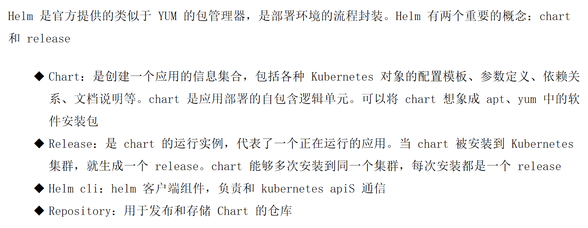


### HELM组件结构


### HELM V2历史包袱、V3优势

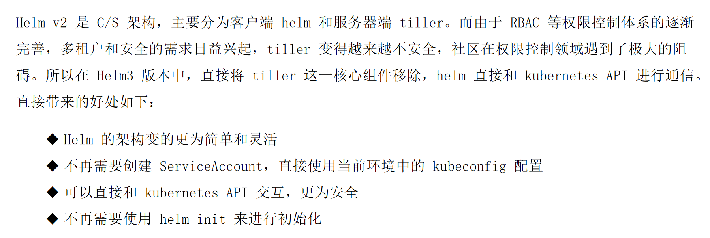


## 02. HELM安装及演示

安装后演示跑通环节

### 认证模式 - 类型

### 安装初始化

#### 安装

```bash
# 下载 Helm 安装脚本（官方推荐方式）
curl -fsSL -o get_helm.sh https://raw.githubusercontent.com/helm/helm/main/scripts/get-helm-3

# 添加执行权限
chmod 700 get_helm.sh

# 运行安装脚本（自动安装最新稳定版）
./get_helm.sh
```


下载速度慢，所以我们可以直接在`software-package/10/helm-v3.12.3-linux-amd64.tar.gz`拿到


```bash
[root@k8s-master01 ~]# ls
1    4    8                cri-dockerd-0.3.9.amd64.tgz          my-scheduler.sh
1.1  5    anaconda-ks.cfg  fire.file
2.1  6    calico           helm-v3.12.3-linux-amd64.tar.gz
2.2  6.1  calico.zip       kubernetes-1.29.2-150500.1.1
2.3  7    cri-dockerd      kubernetes-1.29.2-150500.1.1.tar.gz
[root@k8s-master01 ~]# tar -zxvf helm-v3.12.3-linux-amd64.tar.gz 
linux-amd64/
linux-amd64/LICENSE
linux-amd64/README.md
linux-amd64/helm
[root@k8s-master01 ~]# ls
1    4    8                cri-dockerd-0.3.9.amd64.tgz          linux-amd64
1.1  5    anaconda-ks.cfg  fire.file                            my-scheduler.sh
2.1  6    calico           helm-v3.12.3-linux-amd64.tar.gz
2.2  6.1  calico.zip       kubernetes-1.29.2-150500.1.1
2.3  7    cri-dockerd      kubernetes-1.29.2-150500.1.1.tar.gz
[root@k8s-master01 ~]# cp -a linux-amd64/helm /usr/local/bin/
[root@k8s-master01 ~]# chmod a+x /usr/local/bin/helm
[root@k8s-master01 ~]# helm version
version.BuildInfo{Version:"v3.12.3", GitCommit:"3a31588ad33fe3b89af5a2a54ee1d25bfe6eaa5e", GitTreeState:"clean", GoVersion:"go1.20.7"}
```


#### 初始化

当您已经安装好了Helm之后，您可以添加一个chart仓库。从Artifact Hub中查找有效的Helm chart仓库


[Helm Charts Hub](https://helm-charts.itboon.top/docs/)

> 本站提供热门 Kubernetes Helm Charts 资源聚合和网络加速，使用国内 CDN 发布，涵盖 Helm 仓库和文档资源。


```bash
helm repo add bitnami "https://helm-charts.itboon.top/bitnami" --force-update
```

当添加完成，您将可以看到可以被您安装的charts列表：

```bash
helm search repo bitnami
```


```bash
[root@k8s-master01 repository]# helm search repo bitnami
NAME                                        	CHART VERSION	APP VERSION  	DESCRIPTION
bitnami/airflow                             	24.2.0       	3.0.2        	           
bitnami/apache                              	11.3.18      	2.4.63       	           
bitnami/apisix                              	5.0.4        	3.13.0       	           
bitnami/appsmith                            	6.0.12       	1.78.0       	           
bitnami/argo-cd                             	9.0.25       	3.0.9        	           
bitnami/argo-workflows                      	12.0.6       	3.6.10       	           
bitnami/aspnet-core                         	7.0.10       	9.0.6        	           
bitnami/cadvisor                            	0.1.10       	0.53.0       	           
bitnami/cassandra                           	12.3.8       	5.0.4        	           
bitnami/cert-manager                        	1.5.6        	1.18.1       	           
bitnami/chainloop                           	4.0.27       	1.12.1       	           
bitnami/cilium                              	3.0.5        	1.17.5       	           
bitnami/clickhouse                          	9.3.8        	25.6.2       	           
bitnami/clickhouse-operator                 	0.2.19       	0.25.0       	           
bitnami/cloudnative-pg                      	1.0.1        	1.26.0       	           
bitnami/common                              	2.31.3       	2.31.3       	           
bitnami/concourse                           	5.1.39       	7.13.2       	           
bitnami/consul                              	11.4.23      	1.21.2       	           
bitnami/contour                             	21.0.7       	1.32.0       	           
bitnami/deepspeed                           	2.3.21       	0.17.1       	           
bitnami/discourse                           	16.0.3       	3.4.6        	           
bitnami/dokuwiki                            	16.2.10      	20240206.1.0 	           
bitnami/dremio                              	3.0.4        	26.0.0       	           
bitnami/drupal                              	22.0.1       	11.2.2       	           
bitnami/ejbca                               	18.0.0       	9.1.1        	           
bitnami/elasticsearch                       	22.0.10      	9.0.3        	           
bitnami/envoy-gateway                       	1.1.0        	1.4.1        	           
bitnami/etcd                                	12.0.6       	3.6.1        	           
bitnami/external-dns                        	8.8.7        	0.17.0       	           
bitnami/flink                               	2.0.4        	2.0.0        	           
bitnami/fluent-bit                          	3.1.6        	4.0.3        	           
bitnami/fluentd                             	7.1.9        	1.18.0       	           
bitnami/flux                                	2.4.27       	1.6.2        	           
bitnami/ghost                               	23.0.20      	5.128.0      	           
bitnami/gitea                               	3.2.12       	1.24.2       	           
bitnami/gitlab-runner                       	1.0.5        	18.1.1       	           
bitnami/grafana                             	12.0.8       	12.0.2       	           
bitnami/grafana-alloy                       	0.2.4        	1.9.2        	           
bitnami/grafana-k6-operator                 	0.1.8        	0.0.21       	           
bitnami/grafana-loki                        	5.0.3        	3.5.1        	           
bitnami/grafana-mimir                       	3.0.8        	2.16.1       	           
bitnami/grafana-operator                    	4.9.23       	5.18.0       	           
bitnami/grafana-tempo                       	4.0.10       	2.8.1        	           
bitnami/haproxy                             	2.2.26       	3.2.1        	           
bitnami/harbor                              	26.7.8       	2.13.1       	           
bitnami/influxdb                            	7.1.6        	3.2.0        	           
bitnami/jaeger                              	5.1.22       	2.7.0        	           
bitnami/janusgraph                          	1.4.5        	1.1.0        	           
bitnami/jasperreports                       	18.2.1       	8.2.0        	           
bitnami/jenkins                             	13.6.9       	2.504.3      	           
bitnami/joomla                              	20.0.3       	5.1.2        	           
bitnami/jupyterhub                          	9.0.16       	5.3.0        	           
bitnami/kafka                               	32.3.1       	4.0.0        	           
bitnami/keycloak                            	24.7.4       	26.2.5       	           
bitnami/keydb                               	0.5.13       	6.3.4        	           
bitnami/kiam                                	2.3.13       	4.2.0        	           
bitnami/kibana                              	12.1.4       	9.0.3        	           
bitnami/kong                                	15.4.14      	3.9.1        	           
bitnami/kube-arangodb                       	0.1.16       	1.2.49       	           
bitnami/kube-prometheus                     	11.2.7       	0.83.0       	           
bitnami/kube-state-metrics                  	5.0.11       	2.16.0       	           
bitnami/kubeapps                            	17.1.6       	2.12.1       	           
bitnami/kuberay                             	1.4.18       	1.4.0        	           
bitnami/kubernetes-event-exporter           	3.5.6        	1.7.0        	           
bitnami/logstash                            	7.0.5        	9.0.3        	           
bitnami/magento                             	28.0.4       	2.4.7        	           
bitnami/mariadb                             	21.0.1       	11.8.2       	           
bitnami/mariadb-galera                      	15.0.1       	11.8.2       	           
bitnami/mastodon                            	13.0.4       	4.3.8        	           
bitnami/matomo                              	10.0.0       	5.3.2        	           
bitnami/mediawiki                           	21.0.3       	1.42.1       	           
bitnami/memcached                           	7.8.6        	1.6.38       	           
bitnami/metallb                             	6.4.18       	0.15.2       	           
bitnami/metrics-server                      	7.4.7        	0.7.2        	           
bitnami/milvus                              	15.0.8       	2.5.14       	           
bitnami/minio                               	17.0.9       	2025.6.13    	           
bitnami/minio-operator                      	0.2.2        	7.1.1        	           
bitnami/mlflow                              	5.1.0        	3.1.1        	           
bitnami/mongodb                             	16.5.27      	8.0.11       	           
bitnami/mongodb-sharded                     	9.4.1        	8.0.11       	           
bitnami/moodle                              	27.0.0       	5.0.1        	           
bitnami/multus-cni                          	2.2.17       	4.2.1        	           
bitnami/mxnet                               	3.5.1        	1.9.1        	           
bitnami/mysql                               	13.0.2       	9.3.0        	           
bitnami/nats                                	9.0.21       	2.11.5       	           
bitnami/neo4j                               	0.4.8        	5.26.8       	           
bitnami/nessie                              	2.0.20       	0.104.2      	           
bitnami/nginx                               	21.0.3       	1.29.0       	           
bitnami/nginx-ingress-controller            	11.6.25      	1.12.3       	           
bitnami/node-exporter                       	4.5.16       	1.9.1        	           
bitnami/oauth2-proxy                        	7.0.3        	7.9.0        	           
bitnami/odoo                                	28.2.6       	18.0.20250605	           
bitnami/opencart                            	19.0.3       	4.0.2-3      	           
bitnami/opensearch                          	2.0.5        	3.1.0        	           
bitnami/osclass                             	18.2.2       	8.2.0        	           
bitnami/parse                               	25.1.6       	8.2.1        	           
bitnami/phpbb                               	19.0.3       	3.3.12       	           
bitnami/phpmyadmin                          	19.0.0       	5.2.2        	           
bitnami/pinniped                            	2.4.19       	0.39.0       	           
bitnami/postgresql                          	16.7.14      	17.5.0       	           
bitnami/postgresql-ha                       	16.0.15      	17.5.0       	           
bitnami/prestashop                          	22.0.3       	8.1.7        	           
bitnami/prometheus                          	2.1.9        	3.4.2        	           
bitnami/pytorch                             	4.3.17       	2.7.1        	           
bitnami/rabbitmq                            	16.0.9       	4.1.1        	           
bitnami/rabbitmq-cluster-operator           	4.4.23       	2.15.0       	           
bitnami/redis                               	21.2.6       	8.0.2        	           
bitnami/redis-cluster                       	12.0.10      	8.0.2        	           
bitnami/redmine                             	33.0.0       	6.0.5        	           
bitnami/schema-registry                     	26.0.1       	8.0.0        	           
bitnami/scylladb                            	4.0.4        	2025.1.3     	           
bitnami/sealed-secrets                      	2.5.15       	0.30.0       	           
bitnami/seaweedfs                           	5.0.1        	3.92.0       	           
bitnami/solr                                	9.6.5        	9.8.1        	           
bitnami/sonarqube                           	8.1.9        	25.6.0       	           
bitnami/spark                               	10.0.0       	4.0.0        	           
bitnami/spring-cloud-dataflow               	37.0.5       	2.11.5       	           
bitnami/suitecrm                            	14.1.0       	7.13.4       	           
bitnami/supabase                            	5.3.3        	1.24.5       	           
bitnami/superset                            	4.0.0        	5.0.0        	           
bitnami/tensorflow-resnet                   	4.3.10       	2.19.0       	           
bitnami/thanos                              	17.0.5       	0.39.0       	           
bitnami/tomcat                              	11.7.12      	10.1.42      	           
bitnami/valkey                              	3.0.16       	8.1.2        	           
bitnami/valkey-cluster                      	3.0.14       	8.1.2        	           
bitnami/vault                               	1.7.16       	1.19.5       	           
bitnami/victoriametrics                     	0.1.20       	1.120.0      	           
bitnami/wavefront-hpa-adapter               	1.5.1        	0.9.10       	           
bitnami/wavefront-prometheus-storage-adapter	2.3.2        	1.0.7        	           
bitnami/whereabouts                         	1.2.13       	0.9.0        	           
bitnami/wildfly                             	24.0.8       	36.0.1       	           
bitnami/wordpress                           	25.0.0       	6.8.1        	           
bitnami/zipkin                              	1.3.6        	3.5.1        	           
bitnami/zookeeper                           	13.8.4       	3.9.3        
```


```bash
[root@k8s-master01 repository]# cd
[root@k8s-master01 ~]# ls -a
.              .docker   2.3              calico.zip
..             .kube     4                cri-dockerd
.bash_history  .ssh      5                cri-dockerd-0.3.9.amd64.tgz
.bash_logout   .tcshrc   6                fire.file
.bash_profile  .viminfo  6.1              helm-v3.12.3-linux-amd64.tar.gz
.bashrc        1         7                kubernetes-1.29.2-150500.1.1
.cache         1.1       8                kubernetes-1.29.2-150500.1.1.tar.gz
.config        2.1       anaconda-ks.cfg  linux-amd64
.cshrc         2.2       calico           my-scheduler.sh
[root@k8s-master01 ~]# cd .cache/
[root@k8s-master01 .cache]# ls
helm
[root@k8s-master01 .cache]# cd helm/
[root@k8s-master01 helm]# ls
repository
[root@k8s-master01 helm]# cd repository/
[root@k8s-master01 repository]# ls
bitnami-charts.txt  
bitnami-index.yaml 
```


#### 安装chart示例

```bash
helm repo update # 确定我们可以拿到最新的charts列表
helm show values bitnami/apache
helm install bitnami/apache --generate-name
```

```bash
[root@k8s-master01 repository]# helm install bitnami/apache --generate-name
NAME: apache-1752501503
LAST DEPLOYED: Mon Jul 14 21:58:25 2025
NAMESPACE: default
STATUS: deployed
REVISION: 1
TEST SUITE: None
NOTES:
CHART NAME: apache
CHART VERSION: 11.3.18
APP VERSION: 2.4.63

Did you know there are enterprise versions of the Bitnami catalog? For enhanced secure software supply chain features, unlimited pulls from Docker, LTS support, or application customization, see Bitnami Premium or Tanzu Application Catalog. See https://www.arrow.com/globalecs/na/vendors/bitnami for more information.

** Please be patient while the chart is being deployed **

1. Get the Apache URL by running:

** Please ensure an external IP is associated to the apache-1752501503 service before proceeding **
** Watch the status using: kubectl get svc --namespace default -w apache-1752501503 **

  export SERVICE_IP=$(kubectl get svc --namespace default apache-1752501503 --template "{{ range (index .status.loadBalancer.ingress 0) }}{{ . }}{{ end }}")
  echo URL            : http://$SERVICE_IP/


WARNING: You did not provide a custom web application. Apache will be deployed with a default page. Check the README section "Deploying your custom web application" in https://github.com/bitnami/charts/blob/main/bitnami/apache/README.md#deploying-a-custom-web-application.


WARNING: There are "resources" sections in the chart not set. Using "resourcesPreset" is not recommended for production. For production installations, please set the following values according to your workload needs:
  - resources
+info https://kubernetes.io/docs/concepts/configuration/manage-resources-containers/

[root@k8s-master01 repository]# helm list -n default
NAME             	NAMESPACE	REVISION	UPDATED                                	STATUS  	CHART         	APP VERSION
apache-1752501503	default  	1       	2025-07-14 21:58:25.878984451 +0800 CST	deployed	apache-11.3.18	2.4.63     
[root@k8s-master01 repository]# kubectl get svc
NAME                TYPE           CLUSTER-IP     EXTERNAL-IP   PORT(S)                      AGE
apache-1752501503   LoadBalancer   10.3.115.175   <pending>     80:31232/TCP,443:30322/TCP   78s
kubernetes          ClusterIP      10.0.0.1       <none>        443/TCP                      11d
[root@k8s-master01 repository]# kubectl get pod
NAME                                 READY   STATUS     RESTARTS   AGE
apache-1752501503-657d87b6b8-fpj8t   0/1     Init:0/1   0          92s
```


```bash
helm show chart bitnami/apache  # chart 的基本信息
helm show all bitnami/apache # chart 的所有信息
```


#### 卸载一个版本

```bash
helm uninstall apache-1752501503

      --keep-history  # 选项. Helm将会保留版本历史
      
helm status apache-1752502089
```

```bash
[root@k8s-master01 repository]# helm list
NAME             	NAMESPACE	REVISION	UPDATED                                	STATUS  	CHART         	APP VERSION
apache-1752501503	default  	1       	2025-07-14 21:58:25.878984451 +0800 CST	deployed	apache-11.3.18	2.4.63     
[root@k8s-master01 repository]# helm uninstall apache-1752501503
release "apache-1752501503" uninstalled
[root@k8s-master01 repository]# helm list --all
NAME	NAMESPACE	REVISION	UPDATED	STATUS	CHART	APP VERSION
```


```bash
[root@k8s-master01 repository]# helm install bitnami/apache --generate-name
NAME: apache-1752502089
LAST DEPLOYED: Mon Jul 14 22:08:10 2025
NAMESPACE: default
STATUS: deployed
REVISION: 1
TEST SUITE: None
NOTES:
CHART NAME: apache
CHART VERSION: 11.3.18
APP VERSION: 2.4.63

Did you know there are enterprise versions of the Bitnami catalog? For enhanced secure software supply chain features, unlimited pulls from Docker, LTS support, or application customization, see Bitnami Premium or Tanzu Application Catalog. See https://www.arrow.com/globalecs/na/vendors/bitnami for more information.

** Please be patient while the chart is being deployed **

1. Get the Apache URL by running:

** Please ensure an external IP is associated to the apache-1752502089 service before proceeding **
** Watch the status using: kubectl get svc --namespace default -w apache-1752502089 **

  export SERVICE_IP=$(kubectl get svc --namespace default apache-1752502089 --template "{{ range (index .status.loadBalancer.ingress 0) }}{{ . }}{{ end }}")
  echo URL            : http://$SERVICE_IP/


WARNING: You did not provide a custom web application. Apache will be deployed with a default page. Check the README section "Deploying your custom web application" in https://github.com/bitnami/charts/blob/main/bitnami/apache/README.md#deploying-a-custom-web-application.


WARNING: There are "resources" sections in the chart not set. Using "resourcesPreset" is not recommended for production. For production installations, please set the following values according to your workload needs:
  - resources
+info https://kubernetes.io/docs/concepts/configuration/manage-resources-containers/
[root@k8s-master01 repository]# 
[root@k8s-master01 repository]# helm list
NAME             	NAMESPACE	REVISION	UPDATED                                	STATUS  	CHART         	APP VERSION
apache-1752502089	default  	1       	2025-07-14 22:08:10.099623984 +0800 CST	deployed	apache-11.3.18	2.4.63     
[root@k8s-master01 repository]# helm status apache-1752502089
NAME: apache-1752502089
LAST DEPLOYED: Mon Jul 14 22:08:10 2025
NAMESPACE: default
STATUS: deployed
REVISION: 1
TEST SUITE: None
NOTES:
CHART NAME: apache
CHART VERSION: 11.3.18
APP VERSION: 2.4.63

Did you know there are enterprise versions of the Bitnami catalog? For enhanced secure software supply chain features, unlimited pulls from Docker, LTS support, or application customization, see Bitnami Premium or Tanzu Application Catalog. See https://www.arrow.com/globalecs/na/vendors/bitnami for more information.

** Please be patient while the chart is being deployed **

1. Get the Apache URL by running:

** Please ensure an external IP is associated to the apache-1752502089 service before proceeding **
** Watch the status using: kubectl get svc --namespace default -w apache-1752502089 **

  export SERVICE_IP=$(kubectl get svc --namespace default apache-1752502089 --template "{{ range (index .status.loadBalancer.ingress 0) }}{{ . }}{{ end }}")
  echo URL            : http://$SERVICE_IP/


WARNING: You did not provide a custom web application. Apache will be deployed with a default page. Check the README section "Deploying your custom web application" in https://github.com/bitnami/charts/blob/main/bitnami/apache/README.md#deploying-a-custom-web-application.


WARNING: There are "resources" sections in the chart not set. Using "resourcesPreset" is not recommended for production. For production installations, please set the following values according to your workload needs:
  - resources
+info https://kubernetes.io/docs/concepts/configuration/manage-resources-containers/
```


### 三大概念


Chart代表着Helm包。它包含在Kubernetes集群内部运行应用程序，工具或服务所需的所有资源定 义。你可以把它看作是Homebrew formula,Apt dpkg,或Yum RPM在Kubernetes中的等价物


#### `helm search`: 查找Charts

```bash
# 用于在Helm Hub上搜索Helm charts
helm search hub wordpress
# 用于在配置的Helm仓库中搜索Helm charts,~/.config/helm/repositories.yaml中被定义持久化
helm search repo wordpress
# Helm搜索使用模糊字符串匹配算法，所以你可以只输入名字的一部分
```

```bash
[root@k8s-master01 repository]# helm search repo wordpress
NAME             	CHART VERSION	APP VERSION	DESCRIPTION
bitnami/wordpress	25.0.0       	6.8.1      	
```

```bash
[root@k8s-master01 repository]# cat ~/.config/helm/repositories.yaml 
apiVersion: ""
generated: "0001-01-01T00:00:00Z"
repositories:
- caFile: ""
  certFile: ""
  insecure_skip_tls_verify: false
  keyFile: ""
  name: bitnami
  pass_credentials_all: false
  password: ""
  url: https://helm-charts.itboon.top/bitnami
  username: ""
```

#### `helm install`: 安装一个helm包

```bash
helm install my-apache bitnami/apache
```


#### 安装资源顺序


### 改成自己的方式

#### 安装前自定义chart

```bash
helm show values bitnami/apache  # 查看 chart 中的可配置选项

# 使用 YAML 格式的文件覆盖上述任意配置项，并在安装过程中使用该文件
vi values.yaml

service:
  type: NodePort
  
helm install -f values.yaml bitnami/apache --generate-name
```

```bash
[root@k8s-master01 10]# vim values.yaml
[root@k8s-master01 10]# 
[root@k8s-master01 10]# 
[root@k8s-master01 10]# helm list
NAME             	NAMESPACE	REVISION	UPDATED                                	STATUS  	CHART         	APP VERSION
apache-1752502089	default  	1       	2025-07-14 22:08:10.099623984 +0800 CST	deployed	apache-11.3.18	2.4.63     
[root@k8s-master01 10]# helm delete apache-1752502089
release "apache-1752502089" uninstalled
[root@k8s-master01 10]# 
[root@k8s-master01 10]# 
[root@k8s-master01 10]# helm list
NAME	NAMESPACE	REVISION	UPDATED	STATUS	CHART	APP VERSION
[root@k8s-master01 10]# helm install -f values.yaml bitnami/apache --generate-name
NAME: apache-1752543913
LAST DEPLOYED: Tue Jul 15 09:45:14 2025
NAMESPACE: default
STATUS: deployed
REVISION: 1
TEST SUITE: None
NOTES:
CHART NAME: apache
CHART VERSION: 11.3.18
APP VERSION: 2.4.63

Did you know there are enterprise versions of the Bitnami catalog? For enhanced secure software supply chain features, unlimited pulls from Docker, LTS support, or application customization, see Bitnami Premium or Tanzu Application Catalog. See https://www.arrow.com/globalecs/na/vendors/bitnami for more information.

** Please be patient while the chart is being deployed **

1. Get the Apache URL by running:

  export NODE_PORT=$(kubectl get --namespace default -o jsonpath="{.spec.ports[0].nodePort}" services apache-1752543913)
  export NODE_IP=$(kubectl get nodes --namespace default -o jsonpath="{.items[0].status.addresses[0].address}")
  echo http://$NODE_IP:$NODE_PORT/


WARNING: You did not provide a custom web application. Apache will be deployed with a default page. Check the README section "Deploying your custom web application" in https://github.com/bitnami/charts/blob/main/bitnami/apache/README.md#deploying-a-custom-web-application.


WARNING: There are "resources" sections in the chart not set. Using "resourcesPreset" is not recommended for production. For production installations, please set the following values according to your workload needs:
  - resources
+info https://kubernetes.io/docs/concepts/configuration/manage-resources-containers/

[root@k8s-master01 10]# 
[root@k8s-master01 10]# 
[root@k8s-master01 10]# 
[root@k8s-master01 10]# kubectl get svc
NAME                TYPE        CLUSTER-IP    EXTERNAL-IP   PORT(S)                      AGE
apache-1752543913   NodePort    10.13.186.8   <none>        80:31843/TCP,443:31067/TCP   50s
kubernetes          ClusterIP   10.0.0.1      <none>        443/TCP                      11d
[root@k8s-master01 10]# kubectl get pod
NAME                                 READY   STATUS    RESTARTS   AGE
apache-1752543913-86d9f55fb4-lvpxh   0/1     Running   0          60s
nodeselect-test-8fd98cd49-9mzzj      1/1     Running   0          11h
nodeselect-test-8fd98cd49-qnzqj      1/1     Running   0          11h
[root@k8s-master01 10]# kubectl get pod
NAME                                 READY   STATUS    RESTARTS   AGE
apache-1752543913-86d9f55fb4-lvpxh   1/1     Running   0          79s
nodeselect-test-8fd98cd49-9mzzj      1/1     Running   0          11h
nodeselect-test-8fd98cd49-qnzqj      1/1     Running   0          11h
```


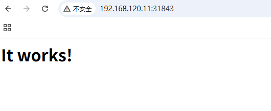


#### 安装过程中有两种方式传递配置数据


## 配置数据传递方式

### 1. 通过 YAML 文件 (`--values`/`-f`)
```bash
helm install -f config.yaml [其他参数]
```
- 可指定多个文件，最右边的文件优先级最高
- 示例：`helm install -f config1.yaml -f config2.yaml`

### 2. 通过命令行参数 (`--set`)
```bash
helm install --set key=value [其他参数]
```
- 优先级高于 `--values`
- 设置的值会保存在 ConfigMap 中

### 两种方式的交互
- 同时使用时，`--set` 值会合并到 `--values` 中
- `--set` 的值具有更高优先级

可以通过`helm get values <release-name>`来查看指定release中`--set`设置的值。也可以通过运行`helm upgrade`并指定`--reset-values`字段来清除`--set`中设置的值


## `--set` 使用详解

### 基本语法
```bash
--set name=value
```
对应 YAML：
```yaml
name: value
```

### 多值设置
```bash
--set a=b,c=d
```
对应 YAML：
```yaml
a: b
c: d
```

### 嵌套结构
```bash
--set outer.inner=value
```
对应 YAML：
```yaml
outer:
  inner: value
```

### 列表设置
```bash
--set name={a,b,c}
```
对应 YAML：
```yaml
name:
  - a
  - b
  - c
```

### 特殊值设置
```bash
--set name=[],a=null
```
对应 YAML：
```yaml
name: []
a: null
```

### 数组元素访问 (v2.5.0+)
```bash
--set servers[0].port=80
```
对应 YAML：
```yaml
servers:
  - port: 80
```

### 多值数组设置
```bash
--set servers[0].port=80,servers[0].host=example
```
对应 YAML：
```yaml
servers:
  - port: 80
    host: example
```

### 特殊字符转义
```bash
--set name=value1\,value2
```
对应 YAML：
```yaml
name: "value1,value2"
```

### 带点的键名
```bash
--set nodeSelector."kubernetes.io/role"=master
```
对应 YAML：
```yaml
nodeSelector:
  kubernetes.io/role: master
```

## 安装来源

1. **Chart 仓库** (已添加的仓库)
   ```bash
   helm install my-release bitnami/nginx
   ```

2. **本地 chart 压缩包**
   ```bash
   helm install foo foo-0.1.1.tgz
   ```

3. **解压后的 chart 目录**
   ```bash
   helm install foo path/to/foo
   ```

4. **完整 URL**
   ```bash
   helm install foo https://example.com/charts/foo-1.2.3.tgz
   ```

## 管理设置值

- 查看已设置的 values：
  ```bash
  helm get values <release-name>
  ```

- 清除 `--set` 设置的值：
  ```bash
  helm upgrade --reset-values <release-name>
  ```


### `helm upgrade`和`helm rollback`: 升级release和失败时恢复


当你想升级到chart的新版本，或是修改release的配置，你可以使用`helm upgrade`命令。Helm会尝试执行最小侵入式升级。即它只会更新自上次发布以来发生了更改的内容

```bash
helm upgrade -f 2.values.yaml apache-1752543913 bitnami/apache
```

```bash
[root@k8s-master01 10]# ls
values.yaml
[root@k8s-master01 10]# mv values.yaml 1.values.yaml
[root@k8s-master01 10]# ls
1.values.yaml
[root@k8s-master01 10]# cp -a 1.values.yaml 2.values.yaml
[root@k8s-master01 10]# vim 2.values.yaml 
```

改成：

```yaml
service:
  type: ClusterIP
```

```bash
[root@k8s-master01 10]# kubectl get svc
NAME                TYPE        CLUSTER-IP    EXTERNAL-IP   PORT(S)                      AGE
apache-1752543913   NodePort    10.13.186.8   <none>        80:31843/TCP,443:31067/TCP   41m
kubernetes          ClusterIP   10.0.0.1      <none>        443/TCP                      11d
[root@k8s-master01 10]# helm list
NAME             	NAMESPACE	REVISION	UPDATED                                	STATUS  	CHART         	APP VERSION
apache-1752543913	default  	1       	2025-07-15 09:45:14.290198593 +0800 CST	deployed	apache-11.3.18	2.4.63     
[root@k8s-master01 10]# helm upgrade -f 2.values.yaml apache-1752543913 bitnami/apache
Release "apache-1752543913" has been upgraded. Happy Helming!
NAME: apache-1752543913
LAST DEPLOYED: Tue Jul 15 10:27:54 2025
NAMESPACE: default
STATUS: deployed
REVISION: 2
TEST SUITE: None
NOTES:
CHART NAME: apache
CHART VERSION: 11.3.18
APP VERSION: 2.4.63

Did you know there are enterprise versions of the Bitnami catalog? For enhanced secure software supply chain features, unlimited pulls from Docker, LTS support, or application customization, see Bitnami Premium or Tanzu Application Catalog. See https://www.arrow.com/globalecs/na/vendors/bitnami for more information.

** Please be patient while the chart is being deployed **

1. Get the Apache URL by running:
  kubectl port-forward --namespace default svc/apache-1752543913 8080:80
  echo URL            : http://127.0.0.1:8080/


WARNING: You did not provide a custom web application. Apache will be deployed with a default page. Check the README section "Deploying your custom web application" in https://github.com/bitnami/charts/blob/main/bitnami/apache/README.md#deploying-a-custom-web-application.


WARNING: There are "resources" sections in the chart not set. Using "resourcesPreset" is not recommended for production. For production installations, please set the following values according to your workload needs:
  - resources
+info https://kubernetes.io/docs/concepts/configuration/manage-resources-containers/
[root@k8s-master01 10]# kubectl get svc
NAME                TYPE        CLUSTER-IP    EXTERNAL-IP   PORT(S)          AGE
apache-1752543913   ClusterIP   10.13.186.8   <none>        80/TCP,443/TCP   42m
kubernetes          ClusterIP   10.0.0.1      <none>        443/TCP          11d
```


在上面的例子中，`apache-1752543913`这个release使用相同的chart进行升级，但是使用了一个新的
YAML文件：
```yaml
service.type:clusterIP
```
我们可以使用`helm get values`命令来看看配置值是否真的生效了：

```bash
helm get values apache-1752543913
```

```bash
[root@k8s-master01 10]# helm get values apache-1752543913
USER-SUPPLIED VALUES:
service:
  type: ClusterIP
```


现在，假勋如在一次发布过程中，发生了不符合预期的事情，也很容易通过`helm ro11back[RELEASE] [REVISION]`命令回滚到之前的发布版本

```bash
helm rollback apache-1752543913 1
```

```bash
[root@k8s-master01 10]# helm get values apache-1752543913
USER-SUPPLIED VALUES:
service:
  type: ClusterIP
[root@k8s-master01 10]# 
[root@k8s-master01 10]# 
[root@k8s-master01 10]# helm list
NAME             	NAMESPACE	REVISION	UPDATED                                	STATUS  	CHART         	APP VERSION
apache-1752543913	default  	2       	2025-07-15 10:27:54.591841442 +0800 CST	deployed	apache-11.3.18	2.4.63     
[root@k8s-master01 10]# helm history apache-1752543913
REVISION	UPDATED                 	STATUS    	CHART         	APP VERSION	DESCRIPTION     
1       	Tue Jul 15 09:45:14 2025	superseded	apache-11.3.18	2.4.63     	Install complete
2       	Tue Jul 15 10:27:54 2025	deployed  	apache-11.3.18	2.4.63     	Upgrade complete
[root@k8s-master01 10]# helm rollback apache-1752543913 1
Rollback was a success! Happy Helming!
[root@k8s-master01 10]# kubectl get svc
NAME                TYPE        CLUSTER-IP    EXTERNAL-IP   PORT(S)                      AGE
apache-1752543913   NodePort    10.13.186.8   <none>        80:32181/TCP,443:31056/TCP   50m
kubernetes          ClusterIP   10.0.0.1      <none>        443/TCP                      11d
```

上面这条命令将我们的`apache-1752543913`回滚到了它最初的版本。release版本其实是一个增量修订
(revision)。每当发生了一次安装、升级或回滚操作，revision的值就会加1。第一次revision的值
永远是1。我们可以使用`helm history [RELEASE]`命令来查看一个特定release的修订版本号


### 安装、升级、回滚时的有用选项


- --timeout:一个Go duration类型的值，用来表示等待Kubernetes命令完成的超时时间，默认 值为5m0s。such as"300ms","-1.5h"or"2h45m".Valid time units are"ns","us"(or"μs"),"ms","s","m","h"。
- --wait:表示必须要等到所有的Pods都处于ready状态，PVC都被绑定，Deployments都至少拥有最小ready状态Pods个数(Desired)减去maxUnavailable),并且Services都具有IP地址(如果是LoadBalancer,则为Ingress),才会标记该release为成功。最长等待时间由 -- timeout值指定。如果达到超时时间，release将被标记为FAILED。注意：当Deployment的replicas被设置为1，但其滚动升级策略中的maxUnavailable没有被设置为O时，-wait将返回就绪，因为已经满足了最小ready Pod数
- --no-hooks：不运行当前命令的钩子，即为安装此chart时的已定义的安装前或者安装后的动作
- --recreate-pods:(仅适用于upgrade和ro11back):这个参数会导致重建所有的Pod(deployment中的Pod除外)。（在Helm3中已被废弃）


### `helm uninstall`: 卸载release

```bash
helm uninstall apache-23213213 # 使用helm uninstall 命令从集群中卸载一个
release
```


helm v2版本中，当一个release被删除，会保留一条删除记录。而在Helm3中，删除也会移除
release的记录。如果你想保留删除记录，使用`helm uninstall --keep-history`。使用`helm list --uninstalled`只会展示使用了`--keep-history`删除的release
`helm list --all`会展示Helm保留的所有release记录，包括失败或删除的条目（指定了`--keep history`）


### `helm repo`: 使用仓库

```bash
# 1. 查看已配置的仓库列表（v3+版本默认无仓库）
helm repo list

# 2. 添加自定义仓库（示例：添加开发环境仓库）
helm repo add dev https://example.com/dev-charts

# 3. 更新所有仓库的索引（获取最新Chart版本）
helm repo update

# 4. 移除指定仓库（示例：移除dev仓库）
helm repo remove dev
```

### 创建一个自己的Chart

#### 基本模式

根据图片中的 Helm 部署流程，以下是完整的代码实现：

### 1. 创建 Helm Chart 模板
```bash
helm create myapp
```

### 2. 清理默认文件（保留必要结构）
```bash
rm -rf myapp/templates/*  # 清空模板目录
rm myapp/values.yaml     # 删除默认values文件
```

### 3. 创建 Service 模板 (`templates/nodePort.yaml`)
```yaml
apiVersion: v1
kind: Service
metadata:
  labels:
    app: myapp-test
  name: myapp-test-202401110926-svc
spec:
  ports:
    - name: 80-80
      port: 80
      protocol: TCP
      targetPort: 80
      nodePort: 31231
  selector:
    app: myapp-test
  type: NodePort
```

### 4. 创建 Deployment 模板 (`templates/deployment.yaml`)
```yaml
apiVersion: apps/v1
kind: Deployment
metadata:
  labels:
    app: myapp-test
  name: myapp-test-202401110926-deploy
spec:
  replicas: 5
  selector:
    matchLabels:
      app: myapp-test
  template:
    metadata:
      labels:
        app: myapp-test
    spec:
      containers:
        - image: nginx:1.25
          name: myapp
```

### 5. 安装 Chart
```bash
helm install myapp myapp/
```

### 完整目录结构
```
myapp/
├── Chart.yaml          # Chart元数据
├── templates/
│   ├── nodePort.yaml   # Service定义
│   └── deployment.yaml # Deployment定义
└── .helmignore         # 忽略文件规则
```

### 验证部署
```bash
# 查看Release状态
helm ls

# 检查Pod
kubectl get pods -l app=myapp-test

# 访问服务（根据实际节点IP）
curl http://<NodeIP>:31111
```

### 生产环境建议
1. 添加Values变量化配置（`values.yaml`）：
```yaml
replicaCount: 5
image:
  repository: wangyanglinux/myapp
  tag: v1.0
service:
  type: NodePort
  port: 80
  nodePort: 31111
```

2. 模板中使用变量引用：
```yaml
# deployment.yaml 修改片段
spec:
  replicas: {{ .Values.replicaCount }}
  template:
    spec:
      containers:
        - image: "{{ .Values.image.repository }}:{{ .Values.image.tag }}"
```

3. 升级命令：
```bash
helm upgrade --install myapp myapp/ -f values.yaml
```


#### 实验

```bash
[root@k8s-master01 10]# helm create myapp
Creating myapp
[root@k8s-master01 10]# ls
1.values.yaml  2.values.yaml  myapp
[root@k8s-master01 10]# cd myapp/
[root@k8s-master01 myapp]# ls
Chart.yaml  charts  templates  values.yaml
[root@k8s-master01 myapp]# rm -rf values.yaml templates/*
[root@k8s-master01 myapp]# ls
Chart.yaml  charts  templates
[root@k8s-master01 myapp]# vim templates/nodePort.yaml
[root@k8s-master01 myapp]# vim templates/deployment.yaml
[root@k8s-master01 myapp]# helm list
NAME             	NAMESPACE	REVISION	UPDATED                                	STATUS  	CHART         	APP VERSION
apache-1752543913	default  	3       	2025-07-15 10:35:10.167518259 +0800 CST	deployed	apache-11.3.18	2.4.63     
[root@k8s-master01 myapp]# helm uninstall apache-1752543913
release "apache-1752543913" uninstalled
[root@k8s-master01 myapp]# helm list
NAME	NAMESPACE	REVISION	UPDATED	STATUS	CHART	APP VERSION
[root@k8s-master01 myapp]# 
[root@k8s-master01 myapp]# 
[root@k8s-master01 myapp]# helm install myapp myapp/
Error: INSTALLATION FAILED: repo myapp not found
[root@k8s-master01 myapp]# cd ..
[root@k8s-master01 10]# ls
1.values.yaml  2.values.yaml  myapp
[root@k8s-master01 10]# helm install myapp myapp/
NAME: myapp
LAST DEPLOYED: Tue Jul 15 11:08:51 2025
NAMESPACE: default
STATUS: deployed
REVISION: 1
TEST SUITE: None
[root@k8s-master01 10]# helm list
NAME 	NAMESPACE	REVISION	UPDATED                                	STATUS  CHART      	APP VERSION
myapp	default  	1       	2025-07-15 11:08:51.783249517 +0800 CST	deployedmyapp-0.1.0	1.16.0     
[root@k8s-master01 10]# 
[root@k8s-master01 10]# kubectl get pod
NAME                                             READY   STATUS    RESTARTS   AGE
myapp-test-202401110926-deploy-d44865454-46n5k   1/1     Running   0          95s
myapp-test-202401110926-deploy-d44865454-6plgz   1/1     Running   0          95s
myapp-test-202401110926-deploy-d44865454-l9mhw   1/1     Running   0          95s
myapp-test-202401110926-deploy-d44865454-lfbfl   1/1     Running   0          95s
myapp-test-202401110926-deploy-d44865454-rknlz   1/1     Running   0          95s
nodeselect-test-8fd98cd49-9mzzj                  1/1     Running   0          13h
nodeselect-test-8fd98cd49-qnzqj                  1/1     Running   0          13h
[root@k8s-master01 10]# kubectl get svc
NAME                          TYPE        CLUSTER-IP    EXTERNAL-IP   PORT(S)        AGE
kubernetes                    ClusterIP   10.0.0.1      <none>        443/TCP        11d
myapp-test-202401110926-svc   NodePort    10.6.110.45   <none>        80:31231/TCP   103s     
```


#### 注入HELM灵魂


### 1. 创建 Chart 目录结构
```bash
helm create myapp
rm -rf myapp/templates/*  # 清空默认模板
```

### 2. 创建 NOTES.txt 模板 (`templates/NOTES.txt`)
```text
1. 这是测试用的 myapp chart
2. myapp release 名字: {{ now | date "20060102030405" }}-deploy
3. service 名字: {{ now | date "20060102030405" }}-svc
```

### 3. 创建 Deployment 模板 (`templates/deployment.yaml`)
```yaml
apiVersion: apps/v1
kind: Deployment
metadata:
  labels:
    app: myapp-test
  name: myapp-test-{{ now | date "20060102030405" }}-deploy
spec:
  replicas: {{ .Values.replicaCount }}
  selector:
    matchLabels:
      app: myapp-test
  template:
    metadata:
      labels:
        app: myapp-test
    spec:
      containers:
        - image: {{ .Values.image.repository }}:{{ .Values.image.tag }}
          name: myapp
```

### 4. 创建 Service 模板 (`templates/service.yaml`)
```yaml
apiVersion: v1
kind: Service
metadata:
  labels:
    app: myapp-test
  name: myapp-test-{{ now | date "20060102030405" }}-svc
spec:
  ports:
    - name: 80-80
      port: 80
      protocol: TCP
      targetPort: 80
      {{- if eq .Values.service.type "NodePort" }}
      nodePort: {{ .Values.service.nodePort }}
      {{- end }}
  selector:
    app: myapp-test
  type: {{ .Values.service.type | quote }}
```

### 5. 配置默认值 (`values.yaml`)
```yaml
# default values for myapp
replicaCount: 5
image:
  repository: nginx
  tag: "1.25"
service:
  type: NodePort
  nodePort: 32321
```

### 6. 安装 Chart
```bash
helm install myapp-test ./myapp
```

### 7. 验证安装
```bash
# 查看Deployment
kubectl get deployment -l app=myapp-test

# 查看Service
kubectl get svc -l app=myapp-test

# 访问服务（根据实际节点IP）
curl http://<NodeIP>:32321
```

### 关键特性说明：
1. **动态命名**：使用 `{{ .Release.Name }}` 自动生成资源名称
2. **条件判断**：Service 模板中通过 `if` 判断 NodePort 配置
3. **值引用**：所有配置参数都来自 `values.yaml`

如果需要自定义安装参数，可以通过 `--set` 覆盖默认值：
```bash
helm install myapp-test ./myapp \
  --set replicaCount=3 \
  --set service.nodePort=32500
```

#### 实验


```bash
[root@k8s-master01 10]# ls
1.values.yaml  2.values.yaml  myapp
[root@k8s-master01 10]# cd myapp/
[root@k8s-master01 myapp]# vim templates/NOTES.txt
[root@k8s-master01 myapp]# vim templates/deployment.yaml
[root@k8s-master01 myapp]# ls
Chart.yaml  charts  templates
[root@k8s-master01 myapp]# rm -f templates/deployment.yaml 
[root@k8s-master01 myapp]# vim templates/deployment.yaml
[root@k8s-master01 myapp]# 
[root@k8s-master01 myapp]# vim templates/service.yaml
[root@k8s-master01 myapp]# rm -f templates/nodePort.yaml 
[root@k8s-master01 myapp]# ls
Chart.yaml  charts  templates
[root@k8s-master01 myapp]# vim values.yaml
[root@k8s-master01 myapp]# vim values.yaml
[root@k8s-master01 myapp]# 
[root@k8s-master01 myapp]# 
[root@k8s-master01 myapp]# cat values.yaml 
# default values for myapp
replicaCount: 5
image:
  repository: nginx
  tag: "1.25"
service:
  type: NodePort
  nodePort: 32321
[root@k8s-master01 myapp]# helm list
NAME 	NAMESPACE	REVISION	UPDATED                                	STATUS  CHART      	APP VERSION
myapp	default  	1       	2025-07-15 11:08:51.783249517 +0800 CST	deployedmyapp-0.1.0	1.16.0     
[root@k8s-master01 myapp]# helm uninstall myapp
release "myapp" uninstalled
[root@k8s-master01 myapp]# ls
Chart.yaml  charts  templates  values.yaml
[root@k8s-master01 myapp]# helm install myapp ../myapp/ -f values.yaml 
NAME: myapp
LAST DEPLOYED: Tue Jul 15 13:18:56 2025
NAMESPACE: default
STATUS: deployed
REVISION: 1
TEST SUITE: None
NOTES:
1. 这是测试用的 myapp chart
2. myapp release 名字: 20250715011856-deploy
3. service 名字: 20250715011856-svc
[root@k8s-master01 myapp]# kubectl get svc
NAME                            TYPE        CLUSTER-IP     EXTERNAL-IP   PORT(S)        AGE
kubernetes                      ClusterIP   10.0.0.1       <none>        443/TCP        11d
myapp-test-20250715011856-svc   NodePort    10.0.143.136   <none>        80:32321/TCP   21s
```


## 03. Ingress - nginx

另一种暴露服务的方式


### 基于LVS的HTTPS负载均衡


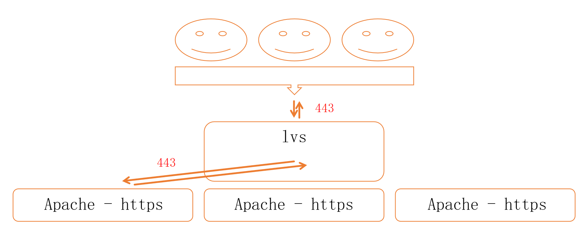


- 负载均衡
  - 四层负载
    - 特性：一次完整的TCP连接，由C（客户端）与RS（真实服务器）建立，D（调度器）只起到转发的作用


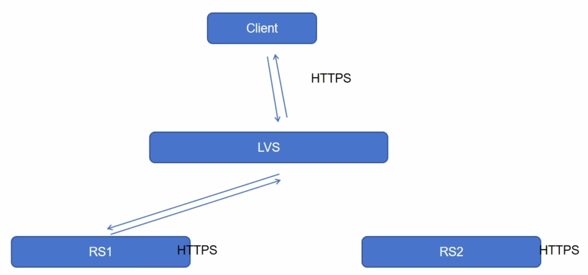

### 基于Nginx的HTTPS负载均衡


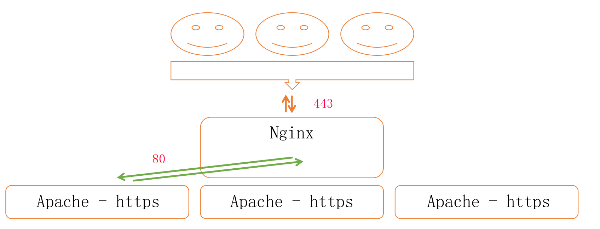


- 负载均衡
    - 七层负载
        - 特性：两次完整的TCP连接，由C（客户端）与D（调度器）建立，D（调度器）与RS（真实服务器）建立


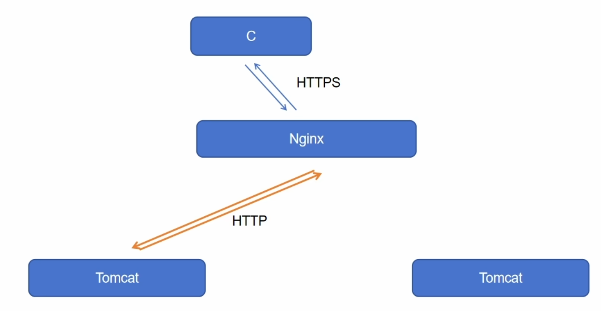


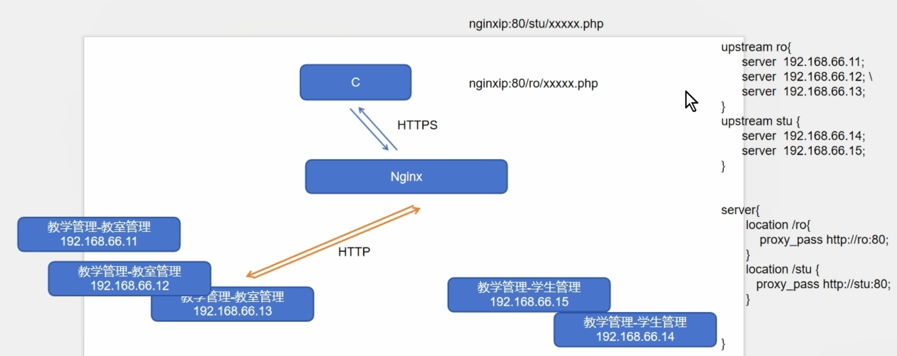


### 基于手动的七层实现

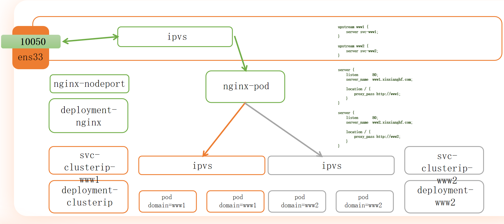

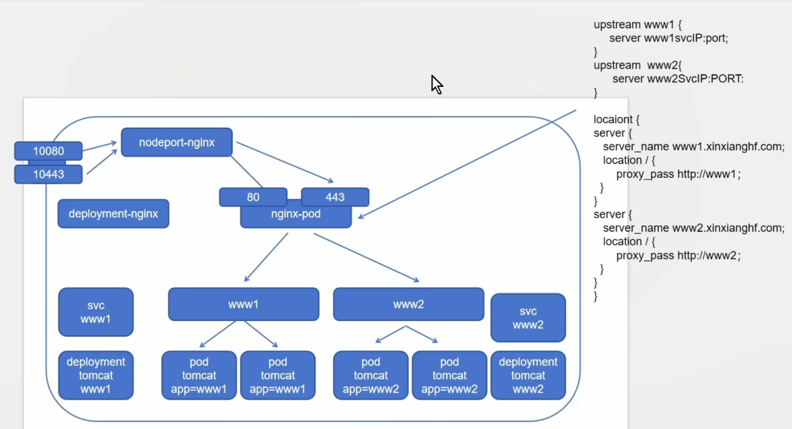


根据图片中的 Nginx 配置内容，这是一个典型的 **基于域名的反向代理配置**，用于将不同域名的请求分发到不同的上游服务。以下是详细解析：

---

### **配置结构解析**
```nginx
upstream www1 {
    server www1svclP:port;  # 上游服务器1的地址和端口
}

upstream www2 {
    server www2SvclP:PORT;  # 上游服务器2的地址和端口
}

server {
    server_name www1.xinxianghf.com;  # 域名1
    location / {
        proxy_pass http://www1;      # 转发到www1上游组
    }
}

server {
    server_name www2.xinxianghf.com;  # 域名2
    location / {
        proxy_pass http://www2;      # 转发到www2上游组
    }
}
```

---

### **核心功能说明**
1. **上游服务定义 (`upstream`)**
    - 定义了两个后端服务组 `www1` 和 `www2`
    - 每组包含一个服务器地址（实际配置需替换 `www1svclP:port` 为真实IP和端口）

2. **请求路由规则 (`server`)**
    - 当访问 `www1.xinxianghf.com` 时，所有请求(`/`)转发到 `www1` 上游组
    - 当访问 `www2.xinxianghf.com` 时，所有请求(`/`)转发到 `www2` 上游组

3. **代理行为 (`proxy_pass`)**
    - Nginx 会修改请求头中的 `Host` 字段为目标上游地址
    - 保持原始客户端IP需额外配置：
      ```nginx
      proxy_set_header X-Real-IP $remote_addr;
      ```

---


### 添加Ingress接口


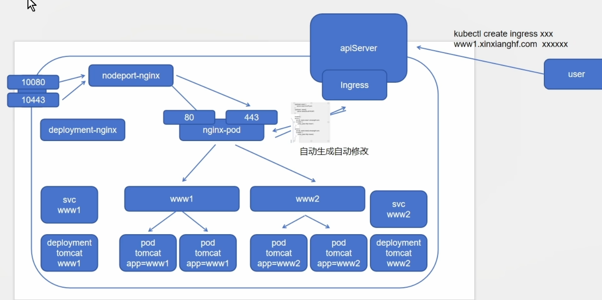


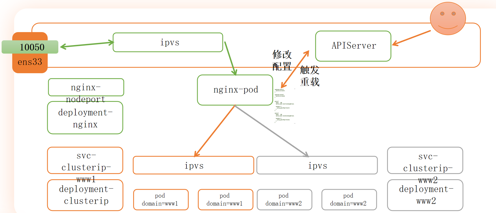


### 流量分析

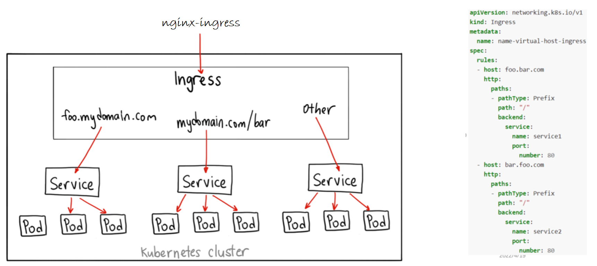


### 展望


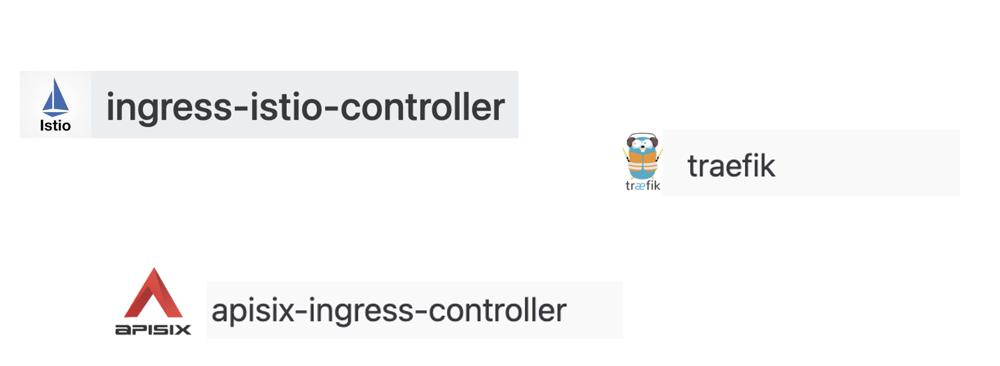

### 架构图

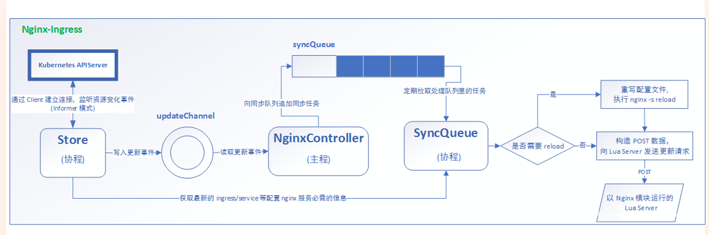


### 安装

可以去`software-package/11/ingress-nginx.zip`将这个压缩包上传到k8s-master01节点上

在master01节点上执行：

```bash
[root@k8s-master01 10]# cd ..
[root@k8s-master01 ~]# ls
1    4    anaconda-ks.cfg              helm-v3.12.3-linux-amd64.tar.gz
1.1  5    calico                       ingress-nginx.zip
10   6    calico.zip                   kubernetes-1.29.2-150500.1.1
2.1  6.1  cri-dockerd                  kubernetes-1.29.2-150500.1.1.tar.gz
2.2  7    cri-dockerd-0.3.9.amd64.tgz  linux-amd64
2.3  8    fire.file                    my-scheduler.sh
[root@k8s-master01 ~]# mv ingress-nginx.zip 10/4
[root@k8s-master01 ~]# cd 10/4/
[root@k8s-master01 4]# ls
ingress-nginx.zip
[root@k8s-master01 4]# unzip ingress-nginx.zip
Archive:  ingress-nginx.zip
   creating: 2、ingress-nginx/
  inflating: 2、ingress-nginx/.DS_Store  
  inflating: __MACOSX/2、ingress-nginx/._.DS_Store  
  inflating: 2、ingress-nginx/安装文档.md  
  inflating: __MACOSX/2、ingress-nginx/._安装文档.md  
   creating: 2、ingress-nginx/chart/
   creating: 2、ingress-nginx/image/
  inflating: 2、ingress-nginx/chart/ingress-nginx-4.8.3.tgz  
  inflating: 2、ingress-nginx/chart/values.yaml  
  inflating: __MACOSX/2、ingress-nginx/chart/._values.yaml  
  inflating: 2、ingress-nginx/image/registry.k8s.io-ingress-nginx-controller-v1.9.4.tar  
  inflating: 2、ingress-nginx/image/ingress-nginx-kube-webhook-certgen-v20231011-8b53cabe0.tar  
[root@k8s-master01 4]# 
[root@k8s-master01 4]# 
[root@k8s-master01 4]# ls
2、ingress-nginx  __MACOSX  ingress-nginx.zip
[root@k8s-master01 4]# cd 2、ingress-nginx/
[root@k8s-master01 2、ingress-nginx]# ls
chart  image  安装文档.md
[root@k8s-master01 2、ingress-nginx]# cd image/
[root@k8s-master01 image]# ls
ingress-nginx-kube-webhook-certgen-v20231011-8b53cabe0.tar
registry.k8s.io-ingress-nginx-controller-v1.9.4.tar
[root@k8s-master01 image]# docker load -i ingress-nginx-kube-webhook-certgen-v20231011-8b53cabe0.tar 
e6d41e7aa1ad: Loading layer   51.2MB/51.2MB
Loaded image: registry.k8s.io/ingress-nginx/kube-webhook-certgen:v20231011-8b53cabe0
[root@k8s-master01 image]# docker load -i registry.k8s.io-ingress-nginx-controller-v1.9.4.tar 
cc2447e1835a: Loading layer  7.626MB/7.626MB
78ff06882b9f: Loading layer  111.4MB/111.4MB
b512e5705c87: Loading layer  4.096kB/4.096kB
95822e611184: Loading layer  32.41MB/32.41MB
86995fdf8357: Loading layer  17.88MB/17.88MB
5f70bf18a086: Loading layer  1.024kB/1.024kB
508ca3d79d2a: Loading layer    404kB/404kB
6fb794e16dcd: Loading layer  321.5kB/321.5kB
7568868fc5d2: Loading layer   6.78MB/6.78MB
1d12dbaa3ad9: Loading layer   41.8MB/41.8MB
b7c0991b024f: Loading layer  3.041MB/3.041MB
f4cdbe75ec48: Loading layer  6.144kB/6.144kB
fe09ab97547b: Loading layer  53.84MB/53.84MB
d6f798101e24: Loading layer  3.584kB/3.584kB
Loaded image: registry.k8s.io/ingress-nginx/controller:v1.9.4
[root@k8s-master01 image]# ls
ingress-nginx-kube-webhook-certgen-v20231011-8b53cabe0.tar
registry.k8s.io-ingress-nginx-controller-v1.9.4.tar
[root@k8s-master01 image]# scp * root@n1:/root/
root@n1's password: 
ingress-nginx-kube-webhook-certgen-v20231011-8b53cabe0 100%   53MB  21.7MB/s   00:02    
registry.k8s.io-ingress-nginx-controller-v1.9.4.tar    100%  263MB  44.3MB/s   00:05    
[root@k8s-master01 image]# scp * root@n2:/root/
root@n2's password: 
ingress-nginx-kube-webhook-certgen-v20231011-8b53cabe0 100%   53MB  17.7MB/s   00:02    
registry.k8s.io-ingress-nginx-controller-v1.9.4.tar    100%  263MB  47.8MB/s   00:05 
```


在node01节点上执行：

```bash
[root@k8s-node01 ~]# ls
anaconda-ks.cfg      ingress-nginx-kube-webhook-certgen-v20231011-8b53cabe0.tar
calico-images        kubernetes-1.29.2-150500.1.1
docker-ce-ustc.repo  registry.k8s.io-ingress-nginx-controller-v1.9.4.tar
[root@k8s-node01 ~]# docker load -i ingress-nginx-kube-webhook-certgen-v20231011-8b53cabe0.tar 
54ad2ec71039: Loading layer  327.7kB/327.7kB
6fbdf253bbc2: Loading layer   51.2kB/51.2kB
7bea6b893187: Loading layer  3.205MB/3.205MB
ff5700ec5418: Loading layer  10.24kB/10.24kB
d52f02c6501c: Loading layer  10.24kB/10.24kB
e624a5370eca: Loading layer  10.24kB/10.24kB
1a73b54f556b: Loading layer  10.24kB/10.24kB
d2d7ec0f6756: Loading layer  10.24kB/10.24kB
4cb10dd2545b: Loading layer  225.3kB/225.3kB
e6d41e7aa1ad: Loading layer   51.2MB/51.2MB
Loaded image: registry.k8s.io/ingress-nginx/kube-webhook-certgen:v20231011-8b53cabe0
[root@k8s-node01 ~]# docker load -i registry.k8s.io-ingress-nginx-controller-v1.9.4.tar 
cc2447e1835a: Loading layer  7.626MB/7.626MB
78ff06882b9f: Loading layer  111.4MB/111.4MB
b512e5705c87: Loading layer  4.096kB/4.096kB
95822e611184: Loading layer  32.41MB/32.41MB
86995fdf8357: Loading layer  17.88MB/17.88MB
5f70bf18a086: Loading layer  1.024kB/1.024kB
508ca3d79d2a: Loading layer    404kB/404kB
6fb794e16dcd: Loading layer  321.5kB/321.5kB
7568868fc5d2: Loading layer   6.78MB/6.78MB
1d12dbaa3ad9: Loading layer   41.8MB/41.8MB
b7c0991b024f: Loading layer  3.041MB/3.041MB
f4cdbe75ec48: Loading layer  6.144kB/6.144kB
fe09ab97547b: Loading layer  53.84MB/53.84MB
d6f798101e24: Loading layer  3.584kB/3.584kB
Loaded image: registry.k8s.io/ingress-nginx/controller:v1.9.4
```


在node02节点上执行：

```bash
[root@k8s-node02 ~]# ls
anaconda-ks.cfg
calico-images
ingress-nginx-kube-webhook-certgen-v20231011-8b53cabe0.tar
kubernetes-1.29.2-150500.1.1
registry.k8s.io-ingress-nginx-controller-v1.9.4.tar
[root@k8s-node02 ~]# docker load -i registry.k8s.io-ingress-nginx-controller-v1.9.4.tar 
cc2447e1835a: Loading layer  7.626MB/7.626MB
78ff06882b9f: Loading layer  111.4MB/111.4MB
b512e5705c87: Loading layer  4.096kB/4.096kB
95822e611184: Loading layer  32.41MB/32.41MB
86995fdf8357: Loading layer  17.88MB/17.88MB
5f70bf18a086: Loading layer  1.024kB/1.024kB
508ca3d79d2a: Loading layer    404kB/404kB
6fb794e16dcd: Loading layer  321.5kB/321.5kB
7568868fc5d2: Loading layer   6.78MB/6.78MB
1d12dbaa3ad9: Loading layer   41.8MB/41.8MB
b7c0991b024f: Loading layer  3.041MB/3.041MB
f4cdbe75ec48: Loading layer  6.144kB/6.144kB
fe09ab97547b: Loading layer  53.84MB/53.84MB
d6f798101e24: Loading layer  3.584kB/3.584kB
Loaded image: registry.k8s.io/ingress-nginx/controller:v1.9.4
[root@k8s-node02 ~]# docker load -i ingress-nginx-kube-webhook-certgen-v20231011-8b53cabe0.tar 
54ad2ec71039: Loading layer  327.7kB/327.7kB
6fbdf253bbc2: Loading layer   51.2kB/51.2kB
7bea6b893187: Loading layer  3.205MB/3.205MB
ff5700ec5418: Loading layer  10.24kB/10.24kB
d52f02c6501c: Loading layer  10.24kB/10.24kB
e624a5370eca: Loading layer  10.24kB/10.24kB
1a73b54f556b: Loading layer  10.24kB/10.24kB
d2d7ec0f6756: Loading layer  10.24kB/10.24kB
4cb10dd2545b: Loading layer  225.3kB/225.3kB
e6d41e7aa1ad: Loading layer   51.2MB/51.2MB
Loaded image: registry.k8s.io/ingress-nginx/kube-webhook-certgen:v20231011-8b53cabe0
```

回到master01执行：

```bash
[root@k8s-master01 4]# cd 2、ingress-nginx/
[root@k8s-master01 2、ingress-nginx]# ls
chart  image  安装文档.md
[root@k8s-master01 2、ingress-nginx]# cd chart/
[root@k8s-master01 chart]# ls
ingress-nginx-4.8.3.tgz  values.yaml
[root@k8s-master01 chart]# tar -zxvf ingress-nginx-4.8.3.tgz 
ingress-nginx/Chart.yaml
ingress-nginx/values.yaml
ingress-nginx/templates/NOTES.txt
ingress-nginx/templates/_helpers.tpl
ingress-nginx/templates/_params.tpl
ingress-nginx/templates/admission-webhooks/cert-manager.yaml
ingress-nginx/templates/admission-webhooks/job-patch/clusterrole.yaml
ingress-nginx/templates/admission-webhooks/job-patch/clusterrolebinding.yaml
ingress-nginx/templates/admission-webhooks/job-patch/job-createSecret.yaml
ingress-nginx/templates/admission-webhooks/job-patch/job-patchWebhook.yaml
ingress-nginx/templates/admission-webhooks/job-patch/networkpolicy.yaml
ingress-nginx/templates/admission-webhooks/job-patch/psp.yaml
ingress-nginx/templates/admission-webhooks/job-patch/role.yaml
ingress-nginx/templates/admission-webhooks/job-patch/rolebinding.yaml
ingress-nginx/templates/admission-webhooks/job-patch/serviceaccount.yaml
ingress-nginx/templates/admission-webhooks/validating-webhook.yaml
ingress-nginx/templates/clusterrole.yaml
ingress-nginx/templates/clusterrolebinding.yaml
ingress-nginx/templates/controller-configmap-addheaders.yaml
ingress-nginx/templates/controller-configmap-proxyheaders.yaml
ingress-nginx/templates/controller-configmap-tcp.yaml
ingress-nginx/templates/controller-configmap-udp.yaml
ingress-nginx/templates/controller-configmap.yaml
ingress-nginx/templates/controller-daemonset.yaml
ingress-nginx/templates/controller-deployment.yaml
ingress-nginx/templates/controller-hpa.yaml
ingress-nginx/templates/controller-ingressclass.yaml
ingress-nginx/templates/controller-keda.yaml
ingress-nginx/templates/controller-networkpolicy.yaml
ingress-nginx/templates/controller-poddisruptionbudget.yaml
ingress-nginx/templates/controller-prometheusrules.yaml
ingress-nginx/templates/controller-psp.yaml
ingress-nginx/templates/controller-role.yaml
ingress-nginx/templates/controller-rolebinding.yaml
ingress-nginx/templates/controller-secret.yaml
ingress-nginx/templates/controller-service-internal.yaml
ingress-nginx/templates/controller-service-metrics.yaml
ingress-nginx/templates/controller-service-webhook.yaml
ingress-nginx/templates/controller-service.yaml
ingress-nginx/templates/controller-serviceaccount.yaml
ingress-nginx/templates/controller-servicemonitor.yaml
ingress-nginx/templates/default-backend-deployment.yaml
ingress-nginx/templates/default-backend-hpa.yaml
ingress-nginx/templates/default-backend-networkpolicy.yaml
ingress-nginx/templates/default-backend-poddisruptionbudget.yaml
ingress-nginx/templates/default-backend-psp.yaml
ingress-nginx/templates/default-backend-role.yaml
ingress-nginx/templates/default-backend-rolebinding.yaml
ingress-nginx/templates/default-backend-service.yaml
ingress-nginx/templates/default-backend-serviceaccount.yaml
ingress-nginx/.helmignore
ingress-nginx/CHANGELOG.md
ingress-nginx/OWNERS
ingress-nginx/README.md
ingress-nginx/README.md.gotmpl
ingress-nginx/changelog/.gitkeep
ingress-nginx/changelog/Changelog-4.5.2.md
ingress-nginx/changelog/Changelog-4.6.0.md
ingress-nginx/changelog/Changelog-4.6.1.md
ingress-nginx/changelog/Changelog-4.7.0.md
ingress-nginx/changelog/Changelog-4.7.1.md
ingress-nginx/changelog/Changelog-4.7.2.md
ingress-nginx/changelog/Changelog-4.8.0-beta.0.md
ingress-nginx/changelog/Changelog-4.8.0.md
ingress-nginx/changelog/Changelog-4.8.1.md
ingress-nginx/changelog/Changelog-4.8.2.md
ingress-nginx/changelog/Changelog-4.8.3.md
ingress-nginx/changelog.md.gotmpl
ingress-nginx/ci/controller-admission-tls-cert-manager-values.yaml
ingress-nginx/ci/controller-custom-ingressclass-flags.yaml
ingress-nginx/ci/daemonset-customconfig-values.yaml
ingress-nginx/ci/daemonset-customnodeport-values.yaml
ingress-nginx/ci/daemonset-extra-modules.yaml
ingress-nginx/ci/daemonset-headers-values.yaml
ingress-nginx/ci/daemonset-internal-lb-values.yaml
ingress-nginx/ci/daemonset-nodeport-values.yaml
ingress-nginx/ci/daemonset-podannotations-values.yaml
ingress-nginx/ci/daemonset-tcp-udp-configMapNamespace-values.yaml
ingress-nginx/ci/daemonset-tcp-udp-portNamePrefix-values.yaml
ingress-nginx/ci/daemonset-tcp-udp-values.yaml
ingress-nginx/ci/daemonset-tcp-values.yaml
ingress-nginx/ci/deamonset-default-values.yaml
ingress-nginx/ci/deamonset-metrics-values.yaml
ingress-nginx/ci/deamonset-psp-values.yaml
ingress-nginx/ci/deamonset-webhook-and-psp-values.yaml
ingress-nginx/ci/deamonset-webhook-values.yaml
ingress-nginx/ci/deployment-autoscaling-behavior-values.yaml
ingress-nginx/ci/deployment-autoscaling-values.yaml
ingress-nginx/ci/deployment-customconfig-values.yaml
ingress-nginx/ci/deployment-customnodeport-values.yaml
ingress-nginx/ci/deployment-default-values.yaml
ingress-nginx/ci/deployment-extra-modules-default-container-sec-context.yaml
ingress-nginx/ci/deployment-extra-modules-specific-container-sec-context.yaml
ingress-nginx/ci/deployment-extra-modules.yaml
ingress-nginx/ci/deployment-headers-values.yaml
ingress-nginx/ci/deployment-internal-lb-values.yaml
ingress-nginx/ci/deployment-metrics-values.yaml
ingress-nginx/ci/deployment-nodeport-values.yaml
ingress-nginx/ci/deployment-podannotations-values.yaml
ingress-nginx/ci/deployment-psp-values.yaml
ingress-nginx/ci/deployment-tcp-udp-configMapNamespace-values.yaml
ingress-nginx/ci/deployment-tcp-udp-portNamePrefix-values.yaml
ingress-nginx/ci/deployment-tcp-udp-values.yaml
ingress-nginx/ci/deployment-tcp-values.yaml
ingress-nginx/ci/deployment-webhook-and-psp-values.yaml
ingress-nginx/ci/deployment-webhook-extraEnvs-values.yaml
ingress-nginx/ci/deployment-webhook-resources-values.yaml
ingress-nginx/ci/deployment-webhook-values.yaml
[root@k8s-master01 chart]# cd ingress-nginx/
[root@k8s-master01 ingress-nginx]# ls
CHANGELOG.md  OWNERS     README.md.gotmpl  changelog.md.gotmpl  templates
Chart.yaml    README.md  changelog         ci                   values.yaml
[root@k8s-master01 ingress-nginx]# vim values.yaml 
```


修改：

```yaml
# ========== 网络配置 ==========
controller:
  hostNetwork: true  # 启用主机网络模式
  dnsPolicy: ClusterFirstWithHostNet  # DNS策略
  
  # ========== 部署类型 ==========
  kind: DaemonSet  # 改为DaemonSet
  
  # ========== 镜像配置 ==========
  # 关闭所有镜像的digest
  #digest: sha256:a7943503b45d552785aa3b5e457f169a5661fb94d82b8a3373bcd9ebaf9aac80

  #digest: sha256:5b161f051d017e55d358435f295f5e9a297e66158f136321d9b04520ec6c48a3
  #digestChroot: sha256:5976b1067cfbca8a21d0ba53d71f83543a73316a61ea7f7e436d6cf84ddf9b26
  
  
  # ========== IngressClass配置 ==========
  ingressClassResource:
    default: true  # 设为默认IngressClass
```


### 配置说明表
| 配置项 | 原默认值 | 修改后值 | 作用 |
|--------|----------|----------|------|
| `hostNetwork` | `false` | `true` | 让Pod使用节点网络，避免NodePort映射 |
| `dnsPolicy` | `ClusterFirst` | `ClusterFirstWithHostNet` | 配合hostNetwork的DNS解析策略 |
| `kind` | `Deployment` | `DaemonSet` | 每个节点部署一个实例 |
| `image.digest` | SHA256值 | `""` | 禁用固定digest，使用浮动tag |
| `ingressClassResource.default` | `false` | `true` | 设为集群默认Ingress控制器 |


#### 关于dnsPolicy

ClusterFirstWithHostNet:
- 当Pod的hostNetwork设置为true时，使用该DNS策略。
- 这意味着Pod的网络命名空间与主机共享，Pod使用主机的网络栈。
- 在此配置下，Pod将首先尝试通过主机上的DNS解析DNS请求。如果主机上没有找到，则会将请求发送到kube-dns服务，由kube-dns服务进行处理：这种策略适用于需要与主机网络共享的特殊情况，但它不会为Pod提供专用的DNS解析功能。

ClusterFirst:
- 这是Kubernetes中默认的DNS策略。
- 当Pod的hostNetwork设置为false或未设置时，使用该策略。
- 在此策略下，Pod首先尝试通过kube-dns服务解析DNS请求。如果kube-dns无法解析，则会向上级DNS服务器继续发起请求。
- 这种策略适用于大多数情况，其中Pod需要使用Kubernetes集群的DNS服务解析其他Pod或服务的主机名。


```bash
[root@k8s-master01 ingress-nginx]# kubectl create ns ingress
namespace/ingress created
[root@k8s-master01 ingress-nginx]# helm install ingress-nginx -n ingress . -f values.yaml 
NAME: ingress-nginx
LAST DEPLOYED: Tue Jul 15 16:22:43 2025
NAMESPACE: ingress
STATUS: deployed
REVISION: 1
TEST SUITE: None
NOTES:
The ingress-nginx controller has been installed.
It may take a few minutes for the LoadBalancer IP to be available.
You can watch the status by running 'kubectl --namespace ingress get services -o wide -w ingress-nginx-controller'

An example Ingress that makes use of the controller:
  apiVersion: networking.k8s.io/v1
  kind: Ingress
  metadata:
    name: example
    namespace: foo
  spec:
    ingressClassName: nginx
    rules:
      - host: www.example.com
        http:
          paths:
            - pathType: Prefix
              backend:
                service:
                  name: exampleService
                  port:
                    number: 80
              path: /
    # This section is only required if TLS is to be enabled for the Ingress
    tls:
      - hosts:
        - www.example.com
        secretName: example-tls

If TLS is enabled for the Ingress, a Secret containing the certificate and key must also be provided:

  apiVersion: v1
  kind: Secret
  metadata:
    name: example-tls
    namespace: foo
  data:
    tls.crt: <base64 encoded cert>
    tls.key: <base64 encoded key>
  type: kubernetes.io/tls
  
[root@k8s-master01 ingress-nginx]# kubectl get pod -n ingress
NAME                             READY   STATUS    RESTARTS   AGE
ingress-nginx-controller-6b2nc   1/1     Running   0          11s
ingress-nginx-controller-sshjb   1/1     Running   0          18m
```


### 实验1 - Ingress-nginx http代理


#### 5.ingress.yaml

```yaml
apiVersion: apps/v1
kind: Deployment
metadata:
  name: ingress-httpproxy-www1
spec:
  replicas: 2
  selector:
    matchLabels:
      hostname: www1
  template:
    metadata:
      labels:
        hostname: www1
    spec:
      containers:
        - name: nginx
          image: nginx:1.25
          imagePullPolicy: IfNotPresent
          ports:
            - containerPort: 80

---

apiVersion: v1
kind: Service
metadata:
  name: ingress-httpproxy-www1
spec:
  ports:
    - port: 80
      targetPort: 80
      protocol: TCP
  selector:
    hostname: www1


---

apiVersion: networking.k8s.io/v1
kind: Ingress
metadata:
  name: ingress-httpproxy-www1
spec:
  ingressClassName: nginx
  rules:
    - host: www1.xinxianghf.com
      http:
        paths:
          - path: /
            pathType: Prefix
            backend:
              service:
                name: ingress-httpproxy-www1
                port:
                  number: 80
```


```bash
[root@k8s-master01 10]# vim 5.ingress.yaml
[root@k8s-master01 10]# 
[root@k8s-master01 10]# 
[root@k8s-master01 10]# kubectl apply -f 5.ingress.yaml 
deployment.apps/ingress-httpproxy-www1 created
service/ingress-httpproxy-www1 created
ingress.networking.k8s.io/ingress-httpproxy-www1 created
[root@k8s-master01 10]# kubectl get pod
NAME                                      READY   STATUS    RESTARTS   AGE
ingress-httpproxy-www1-778f7966bb-79ckw   1/1     Running   0          9s
ingress-httpproxy-www1-778f7966bb-9b2kj   1/1     Running   0          9s
[root@k8s-master01 10]# kubectl get svc
NAME                     TYPE        CLUSTER-IP     EXTERNAL-IP   PORT(S)   AGE
ingress-httpproxy-www1   ClusterIP   10.12.116.15   <none>        80/TCP    3m43s
kubernetes               ClusterIP   10.0.0.1       <none>        443/TCP   11d
[root@k8s-master01 10]# kubectl get ingress
NAME                     CLASS   HOSTS                 ADDRESS   PORTS   AGE
ingress-httpproxy-www1   nginx   www1.xinxianghf.com             80      3m53s
[root@k8s-master01 10]# kubectl get pod -n ingress -o wide
NAME                             READY   STATUS    RESTARTS   AGE   IP               NODE         NOMINATED NODE   READINESS GATES
ingress-nginx-controller-6b2nc   1/1     Running   0          27m   192.168.120.12   k8s-node01   <none>           <none>
ingress-nginx-controller-sshjb   1/1     Running   0          46m   192.168.120.13   k8s-node02   <none>           <none>
```


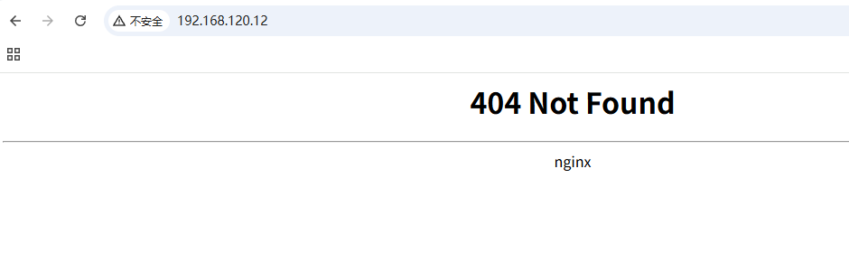


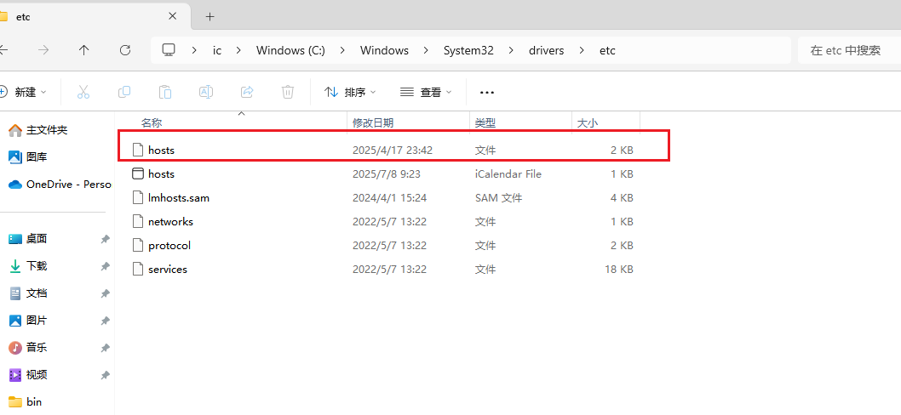

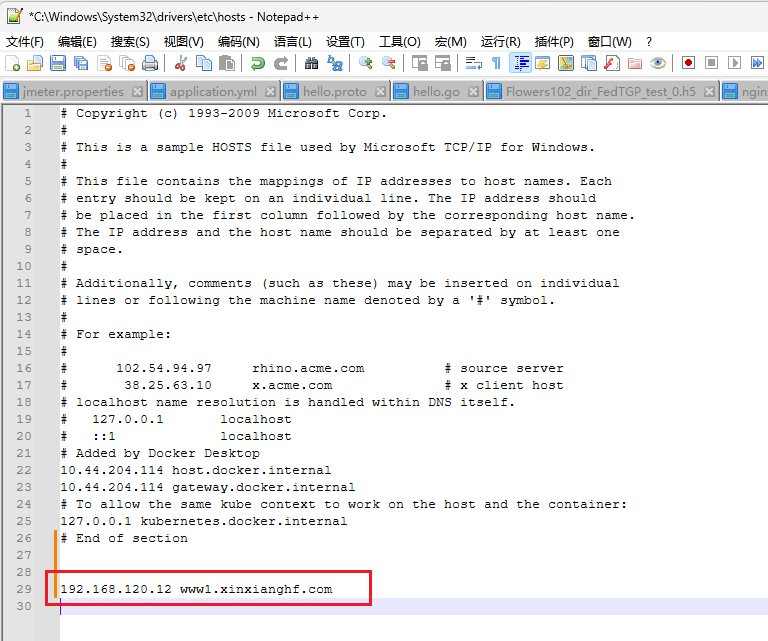


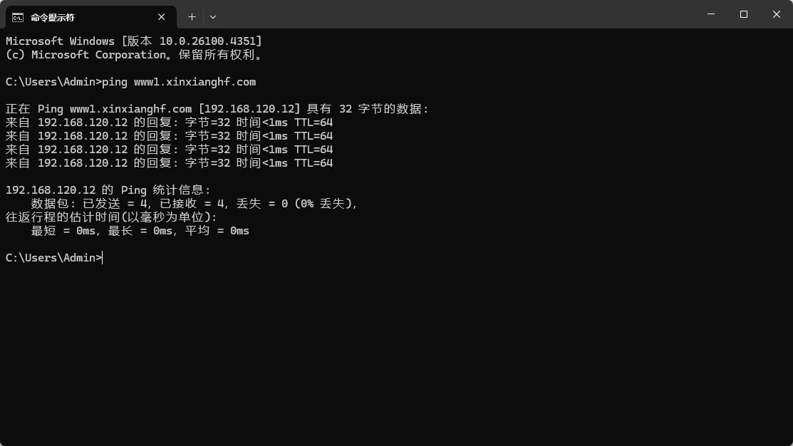


```bash
[root@k8s-master01 10]# cp -a 5.ingress.yaml 6.ingress.yaml
[root@k8s-master01 10]# vim 6.ingress.yaml 
```

```bash
:%s/www1/www2/gh
```

将`www1`改成`www2`

```bash
[root@k8s-master01 10]# kubectl apply -f 6.ingress.yaml 
deployment.apps/ingress-httpproxy-www2 created
service/ingress-httpproxy-www2 created
ingress.networking.k8s.io/ingress-httpproxy-www2 created
```


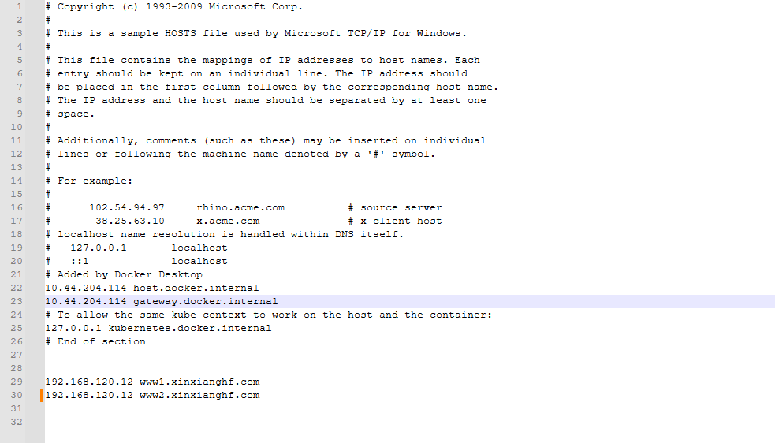

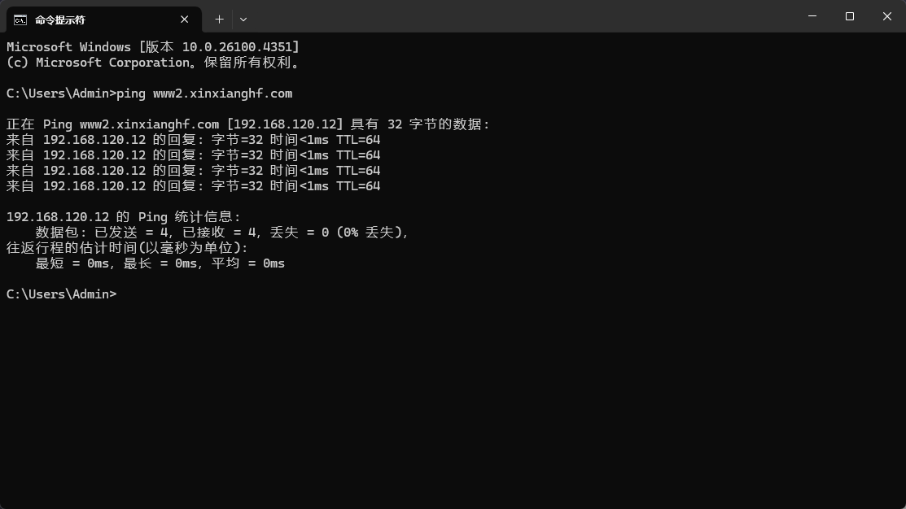


### Ingress-nginx https代理


根据图片中的命令，以下是完整的 Kubernetes TLS 证书生成和配置代码：

### 1. 生成自签名证书（OpenSSL）
```bash
openssl req -x509 -sha256 -nodes -days 365 -newkey rsa:2048 \
  -keyout tls.key \
  -out tls.crt \
  -subj "/CN=nginxsvc/O=nginxsvc"
```

### 2. 创建 Kubernetes TLS Secret
```bash
kubectl create secret tls ingress-nginx-tls \
  --key tls.key \
  --cert tls.crt \
  --namespace=default  # 可指定命名空间
```


#### deployment.yaml

```yaml
apiVersion: apps/v1
kind: Deployment
metadata:
  name: ingress-httpproxy-ssl
spec:
  replicas: 2
  selector:
    matchLabels:
      hostname: ssl
  template:
    metadata:
      labels:
        hostname: ssl
    spec:
      containers:
        - name: nginx
          image: nginx:1.25
          imagePullPolicy: IfNotPresent
          ports:
            - containerPort: 80
          resources:
            limits:
              cpu: "1"
              memory: "512Mi"
            requests:
              cpu: "100m"
              memory: "128Mi"

---

apiVersion: v1
kind: Service
metadata:
  name: ingress-httpproxy-ssl
spec:
  ports:
    - port: 80
      targetPort: 80
      protocol: TCP
  selector:
    hostname: ssl


```

#### ingress.yaml


```yaml
apiVersion: networking.k8s.io/v1
kind: Ingress
metadata:
  name: ingress-httpproxy-ssl
  namespace: default
  annotations:
    nginx.ingress.kubernetes.io/ssl-redirect: "true"
spec:
  ingressClassName: nginx
  tls:
    - hosts:
        - ssl.xinxianghf.com
      secretName: tls-secret
  rules:
    - host: ssl.xinxianghf.com
      http:
        paths:
          - path: /
            pathType: Prefix
            backend:
              service:
                name: ingress-httpproxy-ssl
                port:
                  number: 80
```

#### 实验


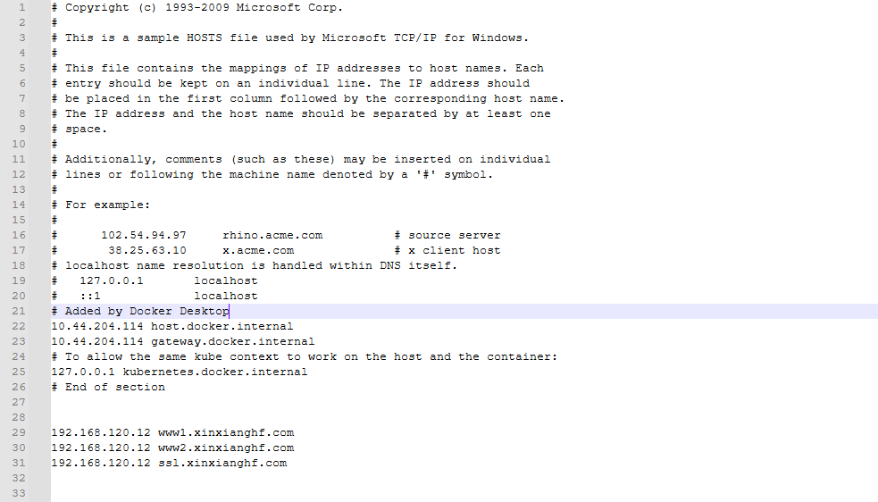


```bash
[root@k8s-master01 10]# mkdir 7
[root@k8s-master01 10]# cd 7/
[root@k8s-master01 7]# ls
[root@k8s-master01 7]# openssl req -x509 -sha256 -nodes -days 365 -newkey rsa:2048 \
  -keyout tls.key \
  -out tls.crt \
  -subj "/CN=nginxsvc/O=nginxsvc"
.+........+.........+...+....+...+.....+.+++++++++++++++++++++++++++++++++++++++++++++++++++++++++++++++++*......+....+.....+.+..+.........+.+........+.+..............+.+...+...+..+......+...............+......+++++++++++++++++++++++++++++++++++++++++++++++++++++++++++++++++*...+..+...+.+.....+...+................+......+.....+.+..+......+...............+......+..........+.....+.........+.+.........+...........+.+........+......+.+...+..+....+......+.........+...+...+.....+............+..........+.....+.+..+..................+....+............+...............+.....+.........+.+...+..+......+.......+......+...........+....+..+...+.......+...+..+.........+...+.........................+..+...+...+...+.+..................+++++++++++++++++++++++++++++++++++++++++++++++++++++++++++++++++
.+...+.+.....+++++++++++++++++++++++++++++++++++++++++++++++++++++++++++++++++*......+..+...+....+.....+.+.....+.+.........+............+..+...........................+.............+...........+.+++++++++++++++++++++++++++++++++++++++++++++++++++++++++++++++++*....+......+.......+..+.............+..+...+..................+....+........+......+.+...+............+.....+...+.+......+........+..........+..................+............+...........+.+........+...............+.............+..+.+............+............+...+........+....+........+....+...+..+...+.+......+..............+.........+.+............+...+++++++++++++++++++++++++++++++++++++++++++++++++++++++++++++++++
-----
[root@k8s-master01 7]# 
[root@k8s-master01 7]# ls
tls.crt  tls.key
[root@k8s-master01 7]# kubectl create secret tls ingress-nginx-tls \
  --key tls.key \
  --cert tls.crt \
  --namespace=default  # 可指定命名空间
secret/ingress-nginx-tls created
[root@k8s-master01 7]# 
[root@k8s-master01 7]# vim deployment.yaml
[root@k8s-master01 7]# vim ingress.yaml
[root@k8s-master01 7]# 
[root@k8s-master01 7]# kubectl apply -f deployment.yaml 
deployment.apps/ingress-httpproxy-ssl created
service/ingress-httpproxy-ssl created
[root@k8s-master01 7]# kubectl apply -f ingress.yaml 
ingress.networking.k8s.io/ingress-httpproxy-ssl created
[root@k8s-master01 7]# kubectl get pod
NAME                                      READY   STATUS    RESTARTS   AGE
ingress-httpproxy-ssl-7f89fd979f-4zbw6    1/1     Running   0          15s
ingress-httpproxy-ssl-7f89fd979f-lw2vl    1/1     Running   0          15s
ingress-httpproxy-www1-778f7966bb-79ckw   1/1     Running   0          144m
ingress-httpproxy-www1-778f7966bb-9b2kj   1/1     Running   0          144m
ingress-httpproxy-www2-77d5bfc6b7-7bh5z   1/1     Running   0          45m
ingress-httpproxy-www2-77d5bfc6b7-gbhs4   1/1     Running   0          45m
[root@k8s-master01 7]# kubectl get ingress
NAME                     CLASS   HOSTS                 ADDRESS   PORTS     AGE
ingress-httpproxy-ssl    nginx   ssl.xinxianghf.com              80, 443   22s
ingress-httpproxy-www1   nginx   www1.xinxianghf.com             80        144m
ingress-httpproxy-www2   nginx   www2.xinxianghf.com             80        46m
[root@k8s-master01 7]# kubectl get pod
NAME                                      READY   STATUS    RESTARTS   AGE
ingress-httpproxy-ssl-7f89fd979f-4zbw6    1/1     Running   0          9m7s
ingress-httpproxy-ssl-7f89fd979f-lw2vl    1/1     Running   0          9m7s
ingress-httpproxy-www1-778f7966bb-79ckw   1/1     Running   0          153m
ingress-httpproxy-www1-778f7966bb-9b2kj   1/1     Running   0          153m
ingress-httpproxy-www2-77d5bfc6b7-7bh5z   1/1     Running   0          54m
ingress-httpproxy-www2-77d5bfc6b7-gbhs4   1/1     Running   0          54m
```


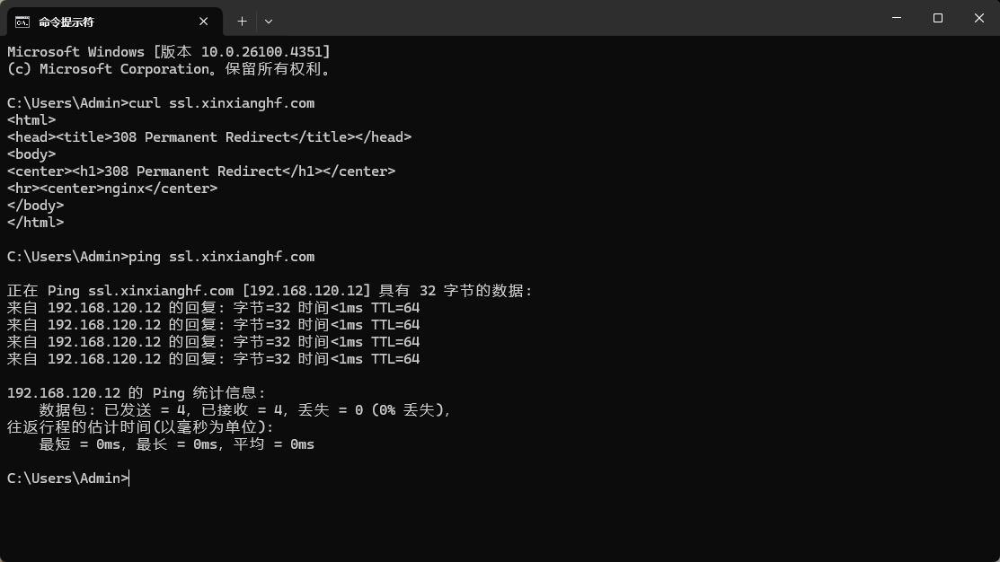


### 实验3 - Ingress-nginx BasicAuth代理


#### 安装httpd-tools

```bash
yum -y install httpd-tools
```

#### 创建认证文件

```bash
htpasswd -c auth xinxianghf  # 会提示输入密码
```

#### 创建Kubernetes Secret

```bash
kubectl create secret generic ingress-basic-auth \
  --from-file=auth \
  -n <命名空间>  # 可选，默认default
```


#### ingress.yaml

```yaml
apiVersion: networking.k8s.io/v1
kind: Ingress
metadata:
  name: ingress-with-auth
  annotations:
    nginx.ingress.kubernetes.io/auth-type: basic
    nginx.ingress.kubernetes.io/auth-secret: ingress-basic-auth
    nginx.ingress.kubernetes.io/auth-realm: 'Authentication Required - xinxianghf'
spec:
  ingressClassName: nginx
  rules:
  - host: auth.xinxianghf.com
    http:
      paths:
      - path: /
        pathType: ImplementationSpecific
        backend:
          service:
            name: ingress-httpproxy-auth
            port: 
              number: 80
```


#### deployment.yaml

```bash
apiVersion: apps/v1
kind: Deployment
metadata:
  name: ingress-httpproxy-auth
spec:
  replicas: 2
  selector:
    matchLabels:
      hostname: auth
  template:
    metadata:
      labels:
        hostname: auth
    spec:
      containers:
        - name: nginx
          image: nginx:1.25
          imagePullPolicy: IfNotPresent
          ports:
            - containerPort: 80
          resources:
            limits:
              cpu: "1"
              memory: "512Mi"
            requests:
              cpu: "100m"
              memory: "128Mi"

---

apiVersion: v1
kind: Service
metadata:
  name: ingress-httpproxy-auth
spec:
  ports:
    - port: 80
      targetPort: 80
      protocol: TCP
  selector:
    hostname: auth
```


#### 实验


```bash
[root@k8s-master01 8]# vim ingress.yaml
[root@k8s-master01 8]# vim deployment.yaml
[root@k8s-master01 8]# yum -y install httpd-tools
Last metadata expiration check: 2:24:19 ago on Tue Jul 15 17:53:21 2025.
Dependencies resolved.
=========================================================================================
 Package                  Architecture   Version                 Repository         Size
=========================================================================================
Installing:
 httpd-tools              x86_64         2.4.62-4.el9            appstream          78 k
Installing dependencies:
 apr                      x86_64         1.7.0-12.el9_3          appstream         122 k
 apr-util                 x86_64         1.6.1-23.el9            appstream          94 k
 apr-util-bdb             x86_64         1.6.1-23.el9            appstream          12 k
Installing weak dependencies:
 apr-util-openssl         x86_64         1.6.1-23.el9            appstream          14 k

Transaction Summary
=========================================================================================
Install  5 Packages

Total download size: 321 k
Installed size: 736 k
Downloading Packages:
(1/5): apr-util-bdb-1.6.1-23.el9.x86_64.rpm               35 kB/s |  12 kB     00:00    
(2/5): apr-util-1.6.1-23.el9.x86_64.rpm                  204 kB/s |  94 kB     00:00    
(3/5): httpd-tools-2.4.62-4.el9.x86_64.rpm               143 kB/s |  78 kB     00:00    
(4/5): apr-util-openssl-1.6.1-23.el9.x86_64.rpm           62 kB/s |  14 kB     00:00    
(5/5): apr-1.7.0-12.el9_3.x86_64.rpm                     236 kB/s | 122 kB     00:00    
-----------------------------------------------------------------------------------------
Total                                                    324 kB/s | 321 kB     00:00     
Running transaction check
Transaction check succeeded.
Running transaction test
Transaction test succeeded.
Running transaction
  Preparing        :                                                                 1/1 
  Installing       : apr-1.7.0-12.el9_3.x86_64                                       1/5 
  Installing       : apr-util-openssl-1.6.1-23.el9.x86_64                            2/5 
  Installing       : apr-util-1.6.1-23.el9.x86_64                                    3/5 
  Installing       : apr-util-bdb-1.6.1-23.el9.x86_64                                4/5 
  Installing       : httpd-tools-2.4.62-4.el9.x86_64                                 5/5 
  Running scriptlet: httpd-tools-2.4.62-4.el9.x86_64                                 5/5 
  Verifying        : apr-util-bdb-1.6.1-23.el9.x86_64                                1/5 
  Verifying        : apr-util-1.6.1-23.el9.x86_64                                    2/5 
  Verifying        : httpd-tools-2.4.62-4.el9.x86_64                                 3/5 
  Verifying        : apr-util-openssl-1.6.1-23.el9.x86_64                            4/5 
  Verifying        : apr-1.7.0-12.el9_3.x86_64                                       5/5 

Installed:
  apr-1.7.0-12.el9_3.x86_64                 apr-util-1.6.1-23.el9.x86_64                 
  apr-util-bdb-1.6.1-23.el9.x86_64          apr-util-openssl-1.6.1-23.el9.x86_64         
  httpd-tools-2.4.62-4.el9.x86_64          

Complete!
[root@k8s-master01 8]#  
[root@k8s-master01 8]# htpasswd -c auth xinxianghf
New password: 
Re-type new password: 
Adding password for user xinxianghf
[root@k8s-master01 8]# kubectl create secret generic ingress-basic-auth \
  --from-file=auth
secret/ingress-basic-auth created
[root@k8s-master01 8]# kubectl apply -f deployment.yaml 
deployment.apps/ingress-httpproxy-auth created
service/ingress-httpproxy-auth created
[root@k8s-master01 8]# kubectl apply -f ingress.yaml 
ingress.networking.k8s.io/ingress-with-auth created
[root@k8s-master01 8]# kubectl get ingress
NAME                     CLASS   HOSTS                 ADDRESS   PORTS     AGE
ingress-httpproxy-ssl    nginx   ssl.xinxianghf.com              80, 443   50m
ingress-httpproxy-www1   nginx   www1.xinxianghf.com             80        3h14m
ingress-httpproxy-www2   nginx   www2.xinxianghf.com             80        96m
ingress-with-auth        nginx   auth.xinxianghf.com             80        31s
[root@k8s-master01 8]# kubectl get pod
NAME                                      READY   STATUS    RESTARTS   AGE
ingress-httpproxy-auth-b85bd974c-jn2dv    1/1     Running   0          3m1s
ingress-httpproxy-auth-b85bd974c-lpdcb    1/1     Running   0          3m1s
ingress-httpproxy-ssl-7f89fd979f-4zbw6    1/1     Running   0          52m
ingress-httpproxy-ssl-7f89fd979f-lw2vl    1/1     Running   0          52m
ingress-httpproxy-www1-778f7966bb-79ckw   1/1     Running   0          3h17m
ingress-httpproxy-www1-778f7966bb-9b2kj   1/1     Running   0          3h17m
ingress-httpproxy-www2-77d5bfc6b7-7bh5z   1/1     Running   0          98m
ingress-httpproxy-www2-77d5bfc6b7-gbhs4   1/1     Running   0          98m
```

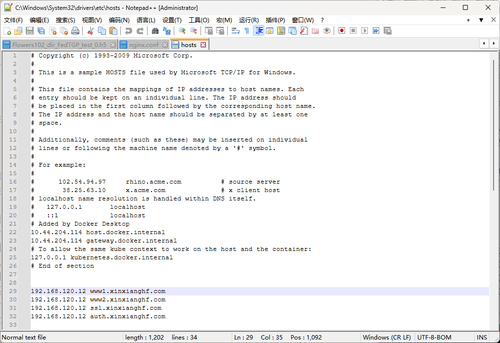


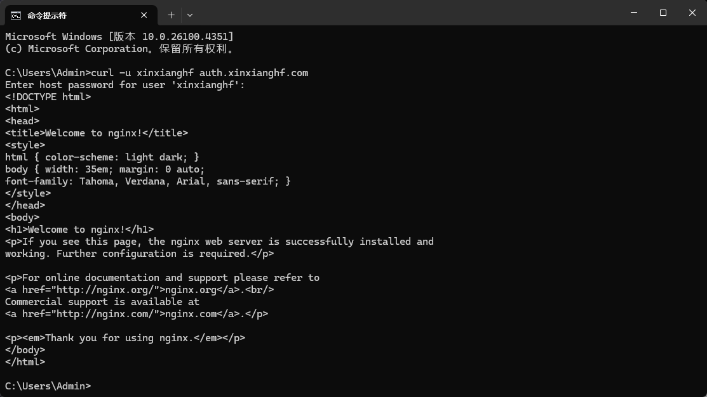


### 实验4 - Ingress-nginx 域名重定向


#### 9.red.yaml

```yaml
apiVersion: networking.k8s.io/v1
kind: Ingress
metadata:
  name: redirect.xinxianghf.com
  namespace: default
  annotations:
    kubernetes.io/ingress.class: "nginx"
    nginx.ingress.kubernetes.io/permanent-redirect: https://www.baidu.com
    nginx.ingress.kubernetes.io/permanent-redirect-code: '301'
spec:
  ingressClassName: "nginx"
  rules:
  - host: redirect.xinxianghf.com
    http:
```


```bash
[root@k8s-master01 9]# vim 9.red.yaml
[root@k8s-master01 9]# 
[root@k8s-master01 9]# 
[root@k8s-master01 9]# kubectl apply -f 9.red.yaml 
ingress.networking.k8s.io/redirect.xinxianghf.com created
[root@k8s-master01 9]# kubectl get ingress
NAME                      CLASS   HOSTS                     ADDRESS   PORTS     AGE
ingress-httpproxy-ssl     nginx   ssl.xinxianghf.com                  80, 443   94m
ingress-httpproxy-www1    nginx   www1.xinxianghf.com                 80        3h59m
ingress-httpproxy-www2    nginx   www2.xinxianghf.com                 80        140m
ingress-with-auth         nginx   auth.xinxianghf.com                 80        45m
redirect.xinxianghf.com   nginx   redirect.xinxianghf.com             80        5s
```

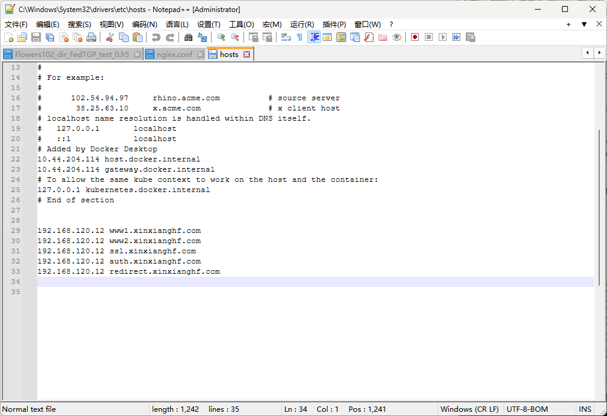


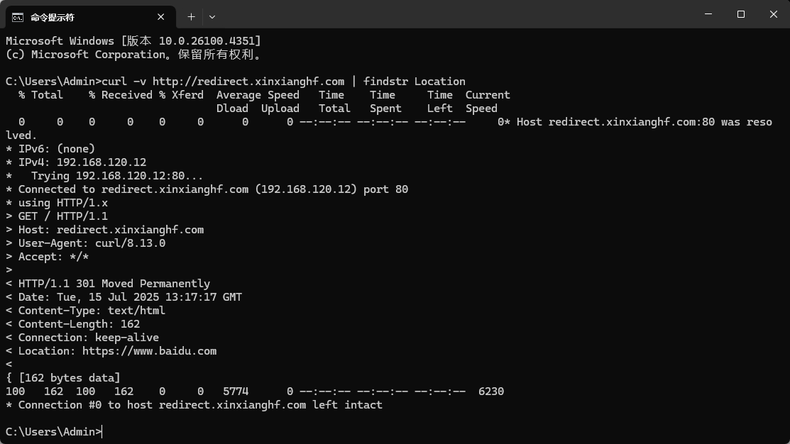


```bash
[root@k8s-master01 9]# echo "192.168.120.12 redirect.xinxianghf.com" >> /etc/hosts
[root@k8s-master01 9]# curl redirect.xinxianghf.com -I
HTTP/1.1 301 Moved Permanently
Date: Tue, 15 Jul 2025 13:19:46 GMT
Content-Type: text/html
Content-Length: 162
Connection: keep-alive
Location: https://www.baidu.com
```

这段命令和输出表明您正在 **测试 Kubernetes Ingress 的重定向功能**。以下是详细解析：

---

### **1. 命令解析**
#### (1) 修改本地 hosts 文件
```bash
echo "192.168.120.12 redirect.xinxianghf.com" >> /etc/hosts
```
- **作用**：将域名 `redirect.xinxianghf.com` 强制解析到 `192.168.120.12`（通常是 Ingress 控制器的 IP）
- **必要性**：
    - 当 DNS 未正确配置时临时测试用
    - 绕过 DNS 直接验证 Ingress 行为

#### (2) 发送 HTTP 请求并仅获取响应头
```bash
curl redirect.xinxianghf.com -I
```
- `-I` 参数：只显示响应头（HEAD 请求）
- 典型用途：检查重定向规则和状态码

---

### **2. 输出解析**
```http
HTTP/1.1 301 Moved Permanently
Location: https://www.baidu.com
...
```
| 字段 | 含义 |
|------|------|
| `301 Moved Permanently` | 永久重定向（浏览器会缓存此跳转） |
| `Location: https://www.baidu.com` | 重定向目标地址 |
| 其他头字段 | 服务器基础信息 |

---

### **3. 对应 Ingress 配置（推测）**
```yaml
apiVersion: networking.k8s.io/v1
kind: Ingress
metadata:
  name: redirect-demo
  annotations:
    nginx.ingress.kubernetes.io/permanent-redirect: "https://www.baidu.com"
    nginx.ingress.kubernetes.io/permanent-redirect-code: "301"
spec:
  rules:
  - host: redirect.xinxianghf.com
    http:
      paths:
      - path: /
        pathType: Prefix
        backend:
          service:
            name: dummy-service  # 占位服务
            port:
              number: 80
```

---

### **4. 生产环境建议**
#### (1) 避免硬编码 IP
```bash
# 更好的做法是用DNS解析
dig redirect.xinxianghf.com
```

#### (2) 检查重定向链
```bash
curl -Lv http://redirect.xinxianghf.com
```
- `-L`：自动跟随重定向
- `-v`：显示详细过程

#### (3) HTTPS 强化
```yaml
spec:
  tls:
  - hosts:
    - redirect.xinxianghf.com
    secretName: tls-secret
```

---

### **5. 完整调试流程**
```bash
# 1. 验证域名解析
ping redirect.xinxianghf.com

# 2. 检查Ingress实际配置
kubectl get ingress -o yaml | grep -A10 "redirect.xinxianghf.com"

# 3. 测试真实访问（模拟浏览器）
curl -L http://redirect.xinxianghf.com
```


这条命令 **`echo "192.168.120.12 redirect.xinxianghf.com" >> /etc/hosts`** 的作用是 **手动修改本地 hosts 文件**，将域名 `redirect.xinxianghf.com` 强制解析到指定的 IP 地址 `192.168.120.12`。以下是详细解析：

---

### **1. 命令功能**
| 部分 | 作用 |
|------|------|
| `echo "192.168.120.12 redirect.xinxianghf.com"` | 生成一行 hosts 记录 |
| `>> /etc/hosts` | 追加到系统 hosts 文件末尾 |

- **本质**：绕过 DNS 解析，直接告诉系统 `redirect.xinxianghf.com` 的 IP 是 `192.168.120.12`

---

### **2. 典型使用场景**
#### (1) **本地开发测试**
- 当域名尚未配置 DNS 解析时，临时绑定到测试服务器 IP

#### (2) **绕过 DNS 缓存**
- 强制让域名指向新 IP（无需等待 DNS 生效）

#### (3) **Kubernetes/Ingress 调试**
- 测试 Ingress 控制器时，直接访问特定节点的 IP（如图片中的场景）

---

### **3. 文件格式说明**
`/etc/hosts` 内容示例：
```
192.168.120.12 redirect.xinxianghf.com
```
- **每行一条记录**，格式为：`<IP地址> <域名> [别名...]`
- **优先级**：比 DNS 解析更高

---

### **4. 验证是否生效**
```bash
ping redirect.xinxianghf.com
# 应返回 192.168.120.12

nslookup redirect.xinxianghf.com
# 在非Windows系统检查
```

---

### **5. 生产环境注意事项**
1. **不要在生产服务器上随意修改 hosts**
    - 应通过正规 DNS 解析管理域名

2. **临时修改后需清理**  
   删除 hosts 中的记录：
   ```bash
   sed -i '/redirect.xinxianghf.com/d' /etc/hosts
   ```

3. **Windows 系统对应操作**  
   修改 `C:\Windows\System32\drivers\etc\hosts`（需管理员权限）

---

### **6. 在 Kubernetes 中的典型用途**
配合 Ingress 测试时：
```bash
# 1. 获取Ingress控制器IP
kubectl get svc -n ingress-nginx

# 2. 假设IP是192.168.120.12，绑定测试域名
echo "192.168.120.12 test.example.com" >> /etc/hosts

# 3. 访问测试
curl http://test.example.com
```

---

### **7. 安全提示**
- 修改 hosts 文件需 root 权限
- 错误的 hosts 记录可能导致服务不可用
- 容器内修改 hosts 需在 `docker run` 时挂载文件：
  ```bash
  docker run -v /etc/hosts:/etc/hosts ...
  ```

### 实验5 - Ingress-nginx Rewrite

#### deployment.yaml

```yaml
apiVersion: apps/v1
kind: Deployment
metadata:
  name: ingress-httpproxy-rew
spec:
  replicas: 2
  selector:
    matchLabels:
      hostname: rew
  template:
    metadata:
      labels:
        hostname: rew
    spec:
      containers:
        - name: nginx
          image: nginx:1.25
          imagePullPolicy: IfNotPresent
          ports:
            - containerPort: 80
          resources:
            limits:
              cpu: "1"
              memory: "512Mi"
            requests:
              cpu: "100m"
              memory: "128Mi"

---

apiVersion: v1
kind: Service
metadata:
  name: ingress-httpproxy-rew
spec:
  ports:
    - port: 80
      targetPort: 80
      protocol: TCP
  selector:
    hostname: rew
```

#### ingress.yaml

```yaml
apiVersion: networking.k8s.io/v1
kind: Ingress
metadata:
  name: rew.xinxianghf.com
  annotations:
    nginx.ingress.kubernetes.io/rewrite-target: /$2
    nginx.ingress.kubernetes.io/use-regex: "true"
spec:
  ingressClassName: nginx
  rules:
    - host: rew.xinxianghf.com
      http:
        paths:
          - path: /api(/|$)(.*)
            pathType: ImplementationSpecific
            backend:
              service:
                name: www1svc
                port:
                  number: 80
```


这是 Kubernetes 的 **Ingress 资源配置定义**，主要用于实现 URL 路径重写和流量转发。以下是逐层解析：

---

### **1. 核心功能**
- **路径重写**：将 `/api/xxx` 的请求转发到后端服务的 `/xxx` 路径
- **正则匹配**：通过正则表达式动态捕获路径片段
- **流量分发**：所有访问 `rew.xinxianghf.com` 域名的请求由 Nginx Ingress 控制器处理

---

### **2. 关键配置解析**
#### **(1) 注解（Annotations）**
```yaml
annotations:
  nginx.ingress.kubernetes.io/rewrite-target: /$2  # 重写目标路径
  nginx.ingress.kubernetes.io/use-regex: "true"    # 启用正则表达式
```
- **`rewrite-target: /$2`**  
  将匹配到的第2个正则分组作为新路径。例如：  
  `请求 /api/user/profile` → `实际转发 /user/profile`

- **`use-regex: "true"`**  
  允许在 `path` 中使用正则表达式（PCRE格式）

#### **(2) 路径规则（Path Rule）**
```yaml
path: /api(/|$)(.*)
```
- **正则分解**：
    - `/api`：匹配固定前缀
    - `(/|$)`：匹配 `/` 或路径结束（第1分组）
    - `(.*)`：捕获 `/api/` 后的所有内容（第2分组）

#### **(3) 转发目标（Backend）**
```yaml
backend:
  service:
    name: www1svc  # 后端Service名称
    port: 80       # Service暴露的端口
```

---

### **3. 完整工作流程**
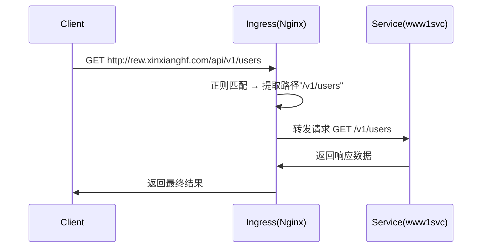
```mermaid
sequenceDiagram
    participant C as Client
    participant I as Ingress(Nginx)
    participant S as Service(www1svc)
    
    C->>I: GET http://rew.xinxianghf.com/api/v1/users
    I->>I: 正则匹配 → 提取路径"/v1/users"
    I->>S: 转发请求 GET /v1/users
    S->>I: 返回响应数据
    I->>C: 返回最终结果
```

---

### **4. 实际效果示例**
| 客户端请求 | 实际转发到后端的路径 |
|------------|----------------------|
| `http://rew.xinxianghf.com/api/hello` | `/hello` |
| `http://rew.xinxianghf.com/api/v2/data` | `/v2/data` |
| `http://rew.xinxianghf.com/api` | `/` |

---

### **5. 生产环境注意事项**
#### **(1) 必须存在的依赖**
- 已安装 **Nginx Ingress 控制器**
- 名为 `www1svc` 的 Service 需提前部署
- 域名 `rew.xinxianghf.com` 需解析到 Ingress 控制器 IP

#### **(2) 建议补充配置**
```yaml
# HTTPS 支持
spec:
  tls:
  - hosts:
    - rew.xinxianghf.com
    secretName: tls-cert

# 资源限制
annotations:
  nginx.ingress.kubernetes.io/limit-rps: "100"  # 限流100请求/秒
```

#### **(3) 调试命令**
```bash
# 查看生效的Ingress规则
kubectl describe ingress rew.xinxianghf.com

# 测试路径重写
curl -v http://rew.xinxianghf.com/api/test
```

---

### **6. 常见问题排查**
#### **(1) 404 错误**
- 检查后端服务是否正常运行：
  ```bash
  kubectl get pods -l app=www1svc
  ```
- 验证 Service 端口映射：
  ```bash
  kubectl describe service www1svc
  ```

#### **(2) 正则不匹配**
- 测试正则表达式在线工具（如 [regex101.com](https://regex101.com)）验证 `/api(/|$)(.*)` 的匹配效果

#### **(3) 性能问题**
- 监控 Nginx 控制器日志：
  ```bash
  kubectl logs -n ingress-nginx <pod-name> | grep rew.xinxianghf.com
  ```

如果需要更具体的帮助，请提供：
1. 后端服务 `www1svc` 的 Deployment 配置
2. 访问时返回的具体错误信息


#### 实验

```bash
[root@k8s-master01 10]# vim deployment.yaml
[root@k8s-master01 10]# kubectl apply -f deployment.yaml 
deployment.apps/ingress-httpproxy-rew created
service/ingress-httpproxy-rew created
[root@k8s-master01 10]# vim ingress.yaml
[root@k8s-master01 10]# 
[root@k8s-master01 10]# 
[root@k8s-master01 10]# kubectl apply -f ingress.yaml 
ingress.networking.k8s.io/rew.xinxianghf.com created
[root@k8s-master01 10]# kubectl get pod
NAME                                      READY   STATUS    RESTARTS   AGE
ingress-httpproxy-auth-b85bd974c-jn2dv    1/1     Running   0          88m
ingress-httpproxy-auth-b85bd974c-lpdcb    1/1     Running   0          88m
ingress-httpproxy-rew-79697bf647-p7bt9    1/1     Running   0          3m52s
ingress-httpproxy-rew-79697bf647-w5pml    1/1     Running   0          3m52s
ingress-httpproxy-ssl-7f89fd979f-4zbw6    1/1     Running   0          138m
ingress-httpproxy-ssl-7f89fd979f-lw2vl    1/1     Running   0          138m
ingress-httpproxy-www1-778f7966bb-79ckw   1/1     Running   0          4h42m
ingress-httpproxy-www1-778f7966bb-9b2kj   1/1     Running   0          4h42m
ingress-httpproxy-www2-77d5bfc6b7-7bh5z   1/1     Running   0          3h3m
ingress-httpproxy-www2-77d5bfc6b7-gbhs4   1/1     Running   0          3h3m
[root@k8s-master01 10]# kubectl get ingress
NAME                      CLASS   HOSTS                     ADDRESS   PORTS     AGE
ingress-httpproxy-ssl     nginx   ssl.xinxianghf.com                  80, 443   138m
ingress-httpproxy-www1    nginx   www1.xinxianghf.com                 80        4h42m
ingress-httpproxy-www2    nginx   www2.xinxianghf.com                 80        3h4m
ingress-with-auth         nginx   auth.xinxianghf.com                 80        88m
redirect.xinxianghf.com   nginx   redirect.xinxianghf.com             80        43m
rew.xinxianghf.com        nginx   rew.xinxianghf.com                  80        3m1s
```


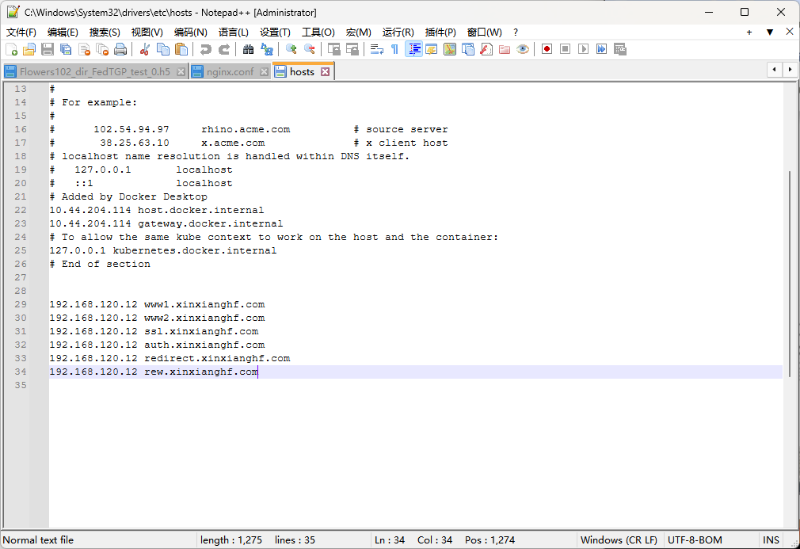


### rewrite和redirect

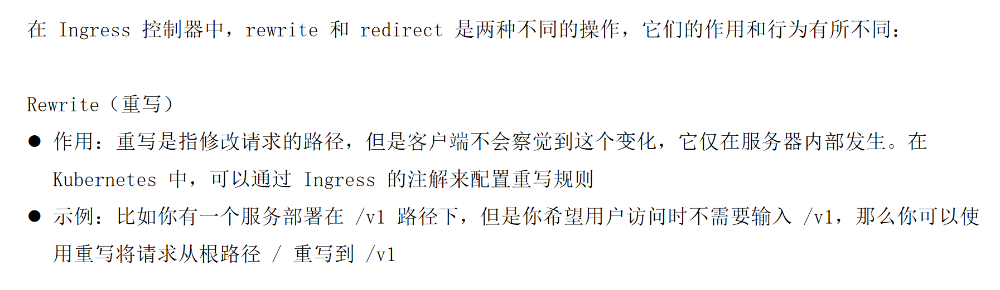


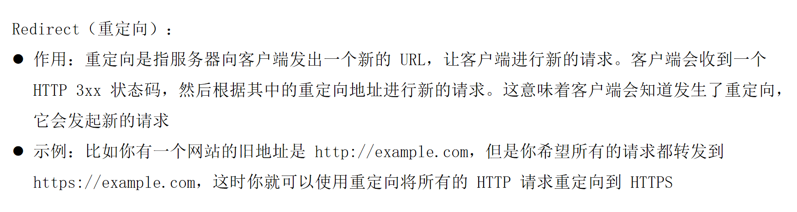


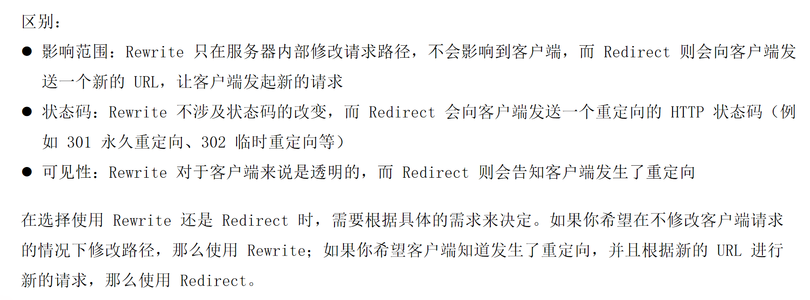


### 实验6 - Ingress-nginx 错误代码重定向 - 默认错误后端


```bash
helm uninstall ingress-nginx -n ingress
```

然后重新进入`values.yaml`文件中，将`defaultBackend`修改如下：

```yaml
defaultBackend:
  enabled: true
  name: defaultbackend
  image:
    registry: docker.io
    image: wangyanglinux/tools
    tag: "errweb1.0"
  port: 80
```

```bash
helm install ingress-nginx -n ingress -f values.yaml .
```


