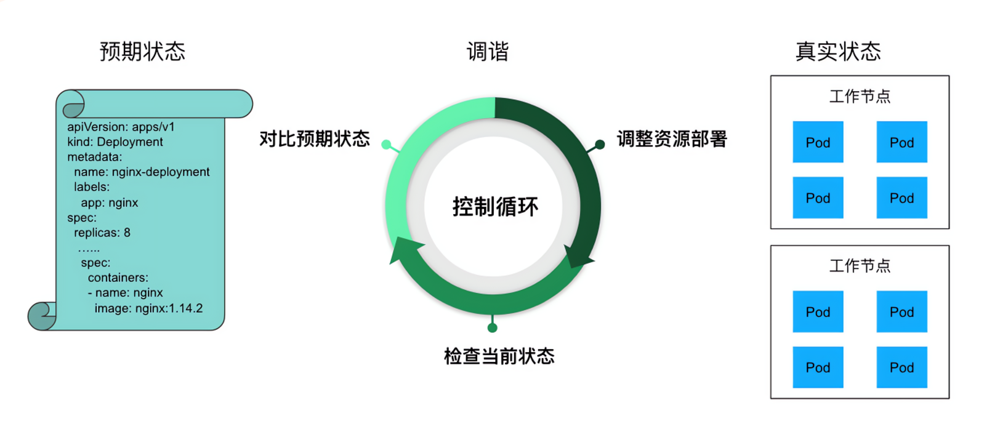
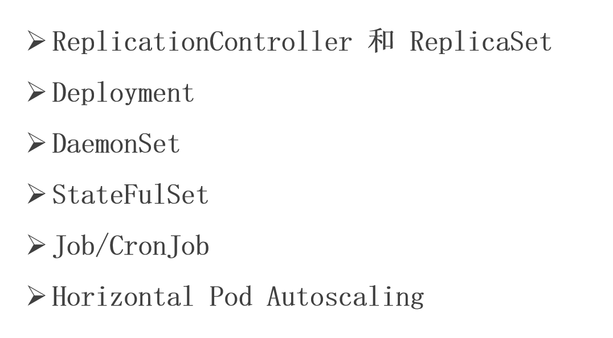

# Pod控制器-核心灵魂

## 控制器

### 控制器 - 概述


### 控制器 - 控制循环



### 控制器 - Pod控制器





## Pod控制器(pod的监护人)

### pod控制器 - ReplicationController和ReplicaSet


- RC控制器：保障当前的Pod数量与期望值一致


### RC控制器

#### 1.rc.yaml

```yaml
apiVersion: v1
kind: ReplicationController
metadata:
  name: rc-demo
spec:
  replicas: 3
  selector:
    app: rc-demo
  template:
    metadata:
      labels:
        app: rc-demo
    spec:
      containers:
      - name: rc-demo-container
        image: nginx:1.25  
        env:
        - name: GET_HOSTS_FROM
          value: dns
        - name: zhangsan    # 修正原YAML中的格式错误（原配置缺少`-`）
          value: "123"
        ports:
        - containerPort: 80
```

```bash
kubectl apply -f 1.rc.yaml
kubectl get rc
kubectl get pod
```

如果我们删除某个pod,rc会自动帮我们重新创建一个pod，以保持pod的数量为3

#### 测试改变label，rc的情况


执行如下：

```bash
[root@k8s-master01 5]# kubectl get pod --show-labels
```

得到下面的结果：

```bash
NAME            READY   STATUS    RESTARTS   AGE     LABELS
rc-demo-84wkq   1/1     Running   0          9m23s   app=rc-demo
rc-demo-fbpbr   1/1     Running   0          9m23s   app=rc-demo
rc-demo-sxvx5   1/1     Running   0          7m18s   app=rc-demo
```

执行:

```bash
kubectl label pod rc-demo-84wkq app=tangfire --overwrite
```

然后我们再执行：

```bash
[root@k8s-master01 5]# kubectl get pod --show-labels

```

可以发现：

```bash
NAME            READY   STATUS    RESTARTS   AGE     LABELS
rc-demo-84wkq   1/1     Running   0          11m     app=tangfire
rc-demo-fbpbr   1/1     Running   0          11m     app=rc-demo
rc-demo-sxvx5   1/1     Running   0          9m32s   app=rc-demo
rc-demo-t6n57   1/1     Running   0          3s      app=rc-demo
```


然后我们再执行：

```bash
kubectl label pod rc-demo-84wkq app=rc-demo --overwrite
```

```bash
kubectl get pod --show-labels
```

得到如下：

```bash
NAME            READY   STATUS    RESTARTS   AGE   LABELS
rc-demo-84wkq   1/1     Running   0          15m   app=rc-demo
rc-demo-fbpbr   1/1     Running   0          15m   app=rc-demo
rc-demo-sxvx5   1/1     Running   0          13m   app=rc-demo
```

会优先删除最新创建的pod


#### 调整当前副本数量

```bash
kubectl scale rc rc-demo --replicas=10
```
```bash
[root@k8s-master01 5]# kubectl get pod --show-labels
NAME            READY   STATUS    RESTARTS   AGE   LABELS
rc-demo-78qh4   1/1     Running   0          16s   app=rc-demo
rc-demo-7prln   1/1     Running   0          16s   app=rc-demo
rc-demo-84wkq   1/1     Running   0          19m   app=rc-demo
rc-demo-8v79g   1/1     Running   0          16s   app=rc-demo
rc-demo-fbpbr   1/1     Running   0          19m   app=rc-demo
rc-demo-j7tbn   1/1     Running   0          17s   app=rc-demo
rc-demo-kz757   1/1     Running   0          17s   app=rc-demo
rc-demo-sgtm5   1/1     Running   0          16s   app=rc-demo
rc-demo-sxvx5   1/1     Running   0          17m   app=rc-demo
rc-demo-tm88g   1/1     Running   0          17s   app=rc-demo
```


### RS控制器

```yaml
apiVersion: apps/v1
kind: ReplicaSet
metadata:
  name: rs-ml-demo
spec:
  replicas: 3
  selector:
    matchLabels:
      app: rs-ml-demo
  template:
    metadata:
      labels:
        app: rs-ml-demo
    spec:
      containers:
      - name: rs-ml-demo-container
        image: nginx:1.25  
        env:
        - name: GET_HOSTS_FROM
          value: dns
        ports:
        - containerPort: 80
```


