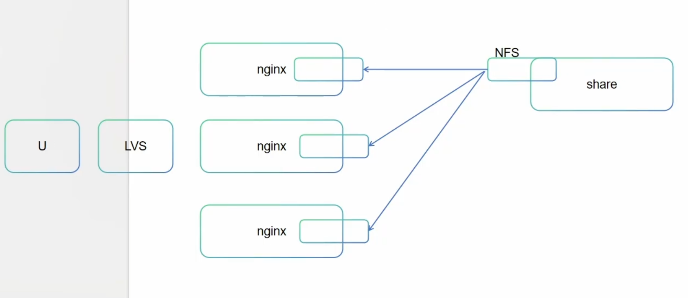

# 存储 - 给数据一个可靠的家

## 01. 存储分类


## 02. configMap

配置信息的保存方式

### configMap - 模型


### configMap - 定义


### 多个服务之间的文件（如配置文件、静态资源、数据文件等）保持一致性的两种思想：共享和注入




- 多个不同的服务内部的文件达到一致
  - 共享
    - 每一次在读取文件的时候，都会发生网络IO
  - 注入  configmap
    - 一次注入后，多次读取不再消耗网络IO


---

在分布式系统或微服务架构中，确保多个服务之间的文件（如配置文件、静态资源、数据文件等）保持一致性是一个常见需求。以下是两种核心思想：**共享（Sharing）** 和 **注入（Injection）**，分别通过不同的机制实现文件一致性。

---

## 1. **共享（Sharing）思想**
**核心逻辑**：多个服务通过访问同一个共享存储或中间媒介来获取文件，确保所有服务读取的内容始终一致。  
**适用场景**：文件较大、更新频率低、需要多服务实时同步的场景（如配置文件、静态资源）。

### 实现方式：
#### （1）**共享存储卷（Volume）**
- **工具**：Kubernetes 的 `PersistentVolume (PV)`、`PersistentVolumeClaim (PVC)`，或云存储（如 AWS S3、NFS）。
- **原理**：将文件存储在共享卷中，多个服务挂载同一卷，直接读取同一份文件。
- **示例**：
  ```yaml
  # Kubernetes Deployment挂载共享PVC
  volumes:
    - name: shared-config
      persistentVolumeClaim:
        claimName: my-pvc  # 多个Pod共用同一个PVC
  ```

#### （2）**分布式文件系统**
- **工具**：HDFS、Ceph、GlusterFS。
- **原理**：文件在分布式系统中全局可见，服务通过统一接口访问。

#### （3）**中间件同步**
- **工具**：数据库（如 MySQL）、配置中心（如 Apollo、Nacos）。
- **原理**：将文件内容存入数据库或配置中心，服务定期拉取或监听变更。

### 优缺点：
| **优点**                     | **缺点**                     |
|------------------------------|------------------------------|
| 文件单点存储，强一致性       | 共享存储可能成为性能瓶颈     |
| 更新时只需修改一次           | 需要处理并发读写冲突         |
| 适合大文件或频繁读场景       | 依赖外部存储系统，复杂度高   |

---

## 2. **注入（Injection）思想**
**核心逻辑**：将文件内容通过某种机制主动分发到各个服务中，服务本地持有文件的副本。  
**适用场景**：文件较小、需要版本控制、或服务需离线运行的场景（如容器启动配置）。

### 实现方式：
#### （1）**配置即代码（Configuration as Code）**
- **工具**：Git 仓库 + CI/CD（如 Jenkins、GitLab CI）。
- **原理**：文件存储在代码库中，服务部署时通过流水线将文件打包到容器镜像或直接注入环境变量。
- **示例**：
  ```dockerfile
  # Dockerfile中复制配置文件
  COPY ./configs/app.conf /etc/service/app.conf
  ```

#### （2）**配置管理工具**
- **工具**：Ansible、Chef、Puppet。
- **原理**：工具将文件推送到各个服务的本地目录。

#### （3）**容器启动时注入**
- **工具**：Kubernetes 的 `ConfigMap`、`Secret`。
- **原理**：将文件内容定义为 `ConfigMap`，挂载为容器的卷或环境变量。
- **示例**：
  ```yaml
  # 将ConfigMap挂载为Pod的文件
  volumes:
    - name: config-volume
      configMap:
        name: app-config
  ```

### 优缺点：
| **优点**                     | **缺点**                     |
|------------------------------|------------------------------|
| 服务本地访问文件，性能高     | 更新需重新分发，可能延迟     |
| 无共享依赖，部署更简单       | 多副本间可能存在短暂不一致   |
| 适合敏感配置（如密钥）       | 文件版本管理需额外设计       |

---

## **对比与选型建议**
| **维度**         | **共享（Sharing）**          | **注入（Injection）**        |
|------------------|-----------------------------|-----------------------------|
| **一致性强度**   | 强一致性（实时同步）        | 最终一致性（需分发时间）     |
| **性能影响**     | 依赖共享存储性能            | 本地读取，性能高            |
| **复杂度**       | 需维护共享存储系统          | 需设计分发机制              |
| **适用场景**     | 多服务实时读写大文件        | 敏感配置或离线服务          |

### **实际组合使用案例**
- **Kubernetes 最佳实践**：
    - 用 `ConfigMap`（注入）管理配置文件，通过卷挂载到多个 Pod。
    - 用 `PV/PVC`（共享）存储日志或大数据文件。
- **混合架构**：
    - 数据库连接字符串通过 `Secret`（注入）分发，静态资源通过 CDN（共享）访问。

---

## **总结**
- **选择共享**：当需要强一致性、文件较大或多服务频繁读写时（如共享日志存储）。
- **选择注入**：当需要快速启动、隔离性高或配置敏感时（如微服务配置）。

两种思想并非互斥，实际系统中常结合使用，例如用共享存储存放大数据，同时用 ConfigMap 注入关键配置。


---


### **通俗版解释：共享 vs 注入**

想象一下，你和几个同事（代表不同的服务）需要一起完成一个项目，而项目资料（文件）需要保持一致。有两种方法可以做到：

---

### **1. 共享（Sharing）——大家一起看同一份资料**
**场景**：
- 你们所有人都在一个办公室里，资料放在办公室中央的一个共享文件夹里。
- 谁需要看资料，就直接去文件夹里拿。
- 如果有人更新了资料，其他人立刻就能看到最新版本。

**例子**：
- **云盘共享**：比如用百度网盘或Google Drive存文件，所有人访问同一个链接，文件一改大家都能看到。
- **Kubernetes共享存储**：多个服务挂载同一个磁盘（比如NFS），文件改了所有服务都能读到。

**优点**：
- 文件只有一份，不会乱（强一致性）。
- 改一次，所有人马上生效。

**缺点**：
- 如果共享文件夹挂了（比如网盘崩了），所有人都没法干活。
- 如果很多人同时改文件，可能会冲突（比如两个人同时改同一行）。

---

### **2. 注入（Injection）——每人发一份资料副本**
**场景**：
- 你们不在一个办公室，没法实时共享文件。
- 领导（系统管理员）把资料打印好，每人发一份，放各自桌上。
- 如果资料有更新，领导得重新打印，再发一遍（可能有点延迟）。

**例子**：
- **配置文件打包进软件**：比如APP的配置直接写在代码里，更新时要重新发布新版本。
- **Kubernetes ConfigMap**：把配置文件“注入”到每个服务里，改配置后要重启服务才能生效。

**优点**：
- 每人有自己的文件，不依赖别人（高可用）。
- 适合敏感信息（比如密码），因为不用共享存储。

**缺点**：
- 如果文件更新了，不能马上同步（得等领导重新发）。
- 如果每人手里的版本不一样，可能会乱（最终一致性）。

---

### **现实中的例子**
- **共享（Sharing）**
  - 公司用 **Excel 在线协作**（比如腾讯文档），所有人编辑同一份表格。
  - 风险：如果腾讯文档崩了，所有人都没法工作。

- **注入（Injection）**
  - 公司发 **PDF 文件**给每个员工，如果更新了得重新发邮件。
  - 风险：有人可能没收到最新版，还在用旧文件。

---

### **怎么选？**
| **方式** | **适合场景** | **不适用场景** |
|----------|------------|--------------|
| **共享** | 需要实时同步（如多人编辑文档） | 文件很大、共享存储不可靠 |
| **注入** | 需要独立运行（如APP配置） | 要求强一致性（不能容忍延迟） |

**实际应用**：
- **微服务配置**：用 **注入**（ConfigMap），因为每个服务要独立运行。
- **日志存储**：用 **共享**（NFS），因为日志要集中管理。

简单来说：
- **共享** = 大家一起看同一本书（实时，但依赖书不能丢）。
- **注入** = 每人发一本（独立，但更新慢）。

根据你的需求选就行！ 😊

---


### configMap - 创建

- `kubectl create configmap game-config --from-file=fire.file`
- `kubectl create configmap literal-config --from-literal=name=dave --from-literal=password=pass`

### **通俗解释：`kubectl create configmap game-config --from-file=fire.file`**

这条命令的作用是：**把本地的一个文件（`fire.file`）变成 Kubernetes 里的一个“配置包”（`ConfigMap`），名字叫 `game-config`，方便 Pod（容器）读取里面的内容。**

---

### **1. 什么是 `ConfigMap`？**
- **`ConfigMap` 是 Kubernetes 用来存配置的东西**，比如配置文件、环境变量等。
- 它不会存敏感信息（密码用 `Secret`），适合存普通配置，比如游戏参数、服务器地址等。
- Pod 可以像读文件或环境变量一样读取 `ConfigMap` 的内容。

---

### **2. `--from-file=fire.file` 是什么意思？**
- **`fire.file`**：是你电脑上的一个文件（比如内容可能是 `max_players=10`）。
- **`--from-file`**：告诉 Kubernetes “把这个文件的内容塞进 `ConfigMap` 里”。
- 文件内容会被存到 `ConfigMap` 的 `data` 字段下，键名默认是文件名（`fire.file`）。

---

### **3. 执行命令后会发生什么？**
- Kubernetes 会创建一个叫 `game-config` 的 `ConfigMap`。
- `fire.file` 的内容会被存进去，比如：
  ```yaml
  apiVersion: v1
  kind: ConfigMap
  metadata:
    name: game-config
  data:
    fire.file: |  # 键名是文件名，值是文件内容
      max_players=10
      level=hard
  ```

---

### **4. Pod 怎么用这个 `ConfigMap`？**
#### **方式1：挂载成文件（最常用）**
让 Pod 把 `ConfigMap` 的内容变成一个文件（比如 `/etc/game/config`）：
```yaml
volumes:
  - name: config-volume
    configMap:
      name: game-config  # 使用刚创建的ConfigMap
containers:
  volumeMounts:
    - name: config-volume
      mountPath: /etc/game  # Pod内会看到文件：/etc/game/fire.file
```

#### **方式2：注入环境变量**
把 `ConfigMap` 的值变成环境变量：
```yaml
env:
  - name: MAX_PLAYERS  # 环境变量名
    valueFrom:
      configMapKeyRef:
        name: game-config
        key: fire.file  # 直接引用整个文件内容
```

---

### **5. 实际例子**
假设 `fire.file` 内容：
```ini
max_players=10
level=hard
```

**创建 ConfigMap：**
```bash
kubectl create configmap game-config --from-file=fire.file
```

**查看内容：**
```bash
kubectl get configmap game-config -o yaml
```
输出：
```yaml
data:
  fire.file: |
    max_players=10
    level=hard
```

---

### **6. 其他用法**
- **多个文件**：可以一次塞多个文件进去：
  ```bash
  kubectl create configmap my-config --from-file=file1 --from-file=file2
  ```
- **目录**：直接塞整个目录的文件：
  ```bash
  kubectl create configmap dir-config --from-file=./configs/
  ```

---

### **总结**
- **这条命令的作用**：把本地文件 `fire.file` 变成 Kubernetes 的 `ConfigMap`（`game-config`）。
- **Pod 怎么用**：挂载成文件或环境变量。
- **适用场景**：存游戏的配置、服务器参数等非敏感信息。

相当于把文件“上传”到 Kubernetes，让所有 Pod 都能方便地读取！ 🚀


---


### **通俗解释：`kubectl create configmap literal-config --from-literal=name=dave --from-literal=password=pass`**

这条命令的作用是：**直接在 Kubernetes 里创建一个叫 `literal-config` 的“配置包”（`ConfigMap`），并往里面存两对键值（`name=dave` 和 `password=pass`），方便 Pod（容器）读取这些值。**

---

### **1. 什么是 `ConfigMap`？**
- **`ConfigMap` 是 Kubernetes 用来存配置的东西**，比如环境变量、配置文件内容等。
- 它**不适合存敏感信息**（比如密码），敏感信息应该用 `Secret`。
- 这里只是举例，实际密码不要用 `ConfigMap` 存！

---

### **2. `--from-literal` 是什么意思？**
- **`--from-literal`**：直接告诉 Kubernetes “我要存一个键值对”。
- **`name=dave`**：键是 `name`，值是 `dave`。
- **`password=pass`**：键是 `password`，值是 `pass`（⚠️ 实际别这么干，用 `Secret`）。

---

### **3. 执行命令后会发生什么？**
Kubernetes 会创建一个 `ConfigMap`，内容如下：
```yaml
apiVersion: v1
kind: ConfigMap
metadata:
  name: literal-config  # 你指定的名字
data:
  name: dave      # 键值对1
  password: pass  # 键值对2（⚠️ 实际别这么存密码！）
```

---

### **4. Pod 怎么用这个 `ConfigMap`？**
#### **方式1：作为环境变量（常用）**
让 Pod 读取 `ConfigMap` 的值变成环境变量：
```yaml
env:
  - name: PLAYER_NAME  # Pod内的环境变量名
    valueFrom:
      configMapKeyRef:
        name: literal-config  # ConfigMap名字
        key: name             # 读取的键（dave）
  - name: PLAYER_PASSWORD    # 另一个环境变量
    valueFrom:
      configMapKeyRef:
        name: literal-config
        key: password         # 读取的键（pass）
```

#### **方式2：挂载成文件**
把 `ConfigMap` 的键值对变成文件：
```yaml
volumes:
  - name: config-volume
    configMap:
      name: literal-config
containers:
  volumeMounts:
    - name: config-volume
      mountPath: /etc/config
```
Pod 内会看到：
```
/etc/config/name      # 内容：dave
/etc/config/password  # 内容：pass
```

---

### **5. 实际例子**
**创建 ConfigMap：**
```bash
kubectl create configmap literal-config --from-literal=name=dave --from-literal=password=pass
```

**查看内容：**
```bash
kubectl get configmap literal-config -o yaml
```
输出：
```yaml
data:
  name: dave
  password: pass
```

---

### **6. 注意事项**
1. **不要用 `ConfigMap` 存密码！**
  - 这个例子是为了演示，实际密码要用 `Secret`：
    ```bash
    kubectl create secret generic my-secret --from-literal=password=pass
    ```
2. **`--from-literal` vs `--from-file`**
  - `--from-literal`：直接写键值对（适合少量配置）。
  - `--from-file`：从文件加载（适合大配置）。

---

### **总结**
- **这条命令的作用**：直接创建一个 `ConfigMap`，并往里存 `name=dave` 和 `password=pass`。
- **Pod 怎么用**：可以变成环境变量或文件。
- **适用场景**：存普通配置（如用户名、服务器地址），**密码用 `Secret`**！

相当于往 Kubernetes 里“手写”了一个配置表，让 Pod 随便取用！ 🛠️


#### fire.file

```yaml
name=tangfire
password=123
```


```bash
[root@k8s-master01 ~]# vim fire.file
[root@k8s-master01 ~]# 
[root@k8s-master01 ~]# 
[root@k8s-master01 ~]# kubectl create configmap game-config --from-file=fire.file
configmap/game-config created
[root@k8s-master01 ~]# 
[root@k8s-master01 ~]# kubectl get cm
NAME               DATA   AGE
game-config        1      6s
kube-root-ca.crt   1      7d1h

```

```bash
[root@k8s-master01 ~]# kubectl get cm game-config -o yaml
apiVersion: v1
data:
  fire.file: |
    name=tangfire
    password=123
kind: ConfigMap
metadata:
  creationTimestamp: "2025-07-10T14:09:14Z"
  name: game-config
  namespace: default
  resourceVersion: "925246"
  uid: 4f99811f-996b-4294-89f6-b2149065b981

```


```bash
[root@k8s-master01 ~]# kubectl describe cm game-config
Name:         game-config
Namespace:    default
Labels:       <none>
Annotations:  <none>

Data
====
fire.file:
----
name=tangfire
password=123


BinaryData
====

Events:  <none>
```


```bash
[root@k8s-master01 ~]# kubectl create configmap literal-config --from-literal=name=dave --from-literal=password=pass
configmap/literal-config created
```

```bash
[root@k8s-master01 ~]# kubectl get cm
NAME               DATA   AGE
game-config        1      7m1s
kube-root-ca.crt   1      7d1h
literal-config     2      91s
[root@k8s-master01 ~]# kubectl get cm literal-config -o yaml
apiVersion: v1
data:
  name: dave
  password: pass
kind: ConfigMap
metadata:
  creationTimestamp: "2025-07-10T14:14:44Z"
  name: literal-config
  namespace: default
  resourceVersion: "925746"
  uid: 2defc3aa-84e3-4de5-9163-a076d2000436
```


### configMap - 环境变量


 

## 03. Secret

## 04. Downward API

## 05. volume

## 06. pv/pvc


## 07. storageClass


## 08. 插曲

