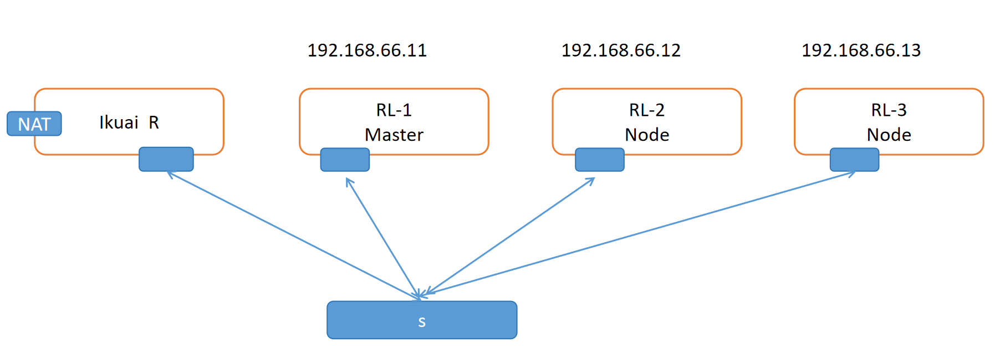

# 前置知识

## 网卡仅主机模式

“**网卡仅主机模式**”（英文：**Host-Only Adapter**）是**虚拟机网络模式**中的一种，它常见于虚拟机软件如 **VirtualBox、VMware、KVM** 等。

---

## 🔷 什么是“网卡仅主机模式”？

“仅主机模式”是一种虚拟网络连接方式，其本质是：

> **虚拟机的网络适配器只和宿主机通信，不能直接访问外部网络或互联网。**

虚拟机和宿主机之间可以互相通信，但虚拟机无法访问宿主机以外的设备（比如外部网络、局域网或互联网）。

---

## 🔧 工作原理（以 VirtualBox 为例）：

* VirtualBox 会创建一个**虚拟的 Host-Only 网络接口**（例如 `vboxnet0`）。
* 宿主机会自动有一个该网络的 IP（如 `192.168.56.1`）。
* 虚拟机连接这个网卡，也会被分配一个同网段的 IP（如 `192.168.56.101`）。
* 它们之间通过这个网卡进行通信，但这个网卡**不连接外部物理网络**。

---

## 🔍 类比理解：

| 模式     | 网络访问能力               |
| ------ | -------------------- |
| 桥接模式   | 虚拟机像真实主机一样出现在局域网，可上网 |
| NAT 模式 | 虚拟机可上网，但对局域网设备不可见    |
| 仅主机模式  | 虚拟机只能访问宿主机，**无法上网**  |
| 内部网络模式 | 虚拟机之间通信，但无法访问宿主机和外网  |

---

## 🧠 应用场景：

* 你想让虚拟机和主机之间交换数据，但不希望虚拟机访问外网。
* 在无网络环境中测试内部服务或本地开发。
* 用于构建安全隔离的测试环境。

---

## ⚠️ 注意：

* 如果你希望虚拟机既能访问主机，又能访问互联网，应该选择：

    * **桥接模式**（虚拟机和主机在同一物理网络）
    * **NAT + Host-Only 双网卡模式**

---

## ✅ 总结一句话：

> “网卡仅主机模式”指虚拟机网卡只与宿主机通信，不能访问互联网，也不能被其他网络设备访问，适用于需要隔离但主机与虚拟机之间仍需通信的场景。

## 在同一个 Host-Only（仅主机）网络下的虚拟机和宿主机属于同一个广播域

**在同一个“仅主机模式（Host-Only）”下的虚拟机和宿主机**，可以被认为是**处于同一个广播域**，具体原因和条件如下：

---

## ✅ 同一广播域（前提：连接到同一个 Host-Only 网络）

### 📌 广播域的定义：

广播域是指：在一个网络中，**二层广播（如 ARP 请求）可以被所有设备接收到的范围**。

---

### 🧠 为什么仅主机模式属于同一广播域？

* 当你在 VirtualBox 或 VMware 中启用“仅主机模式”，软件会创建一个**虚拟的交换机（虚拟网桥）**，比如 `vboxnet0`。
* 所有连接到这个网络的虚拟机网卡（VM1, VM2, ...）以及宿主机的虚拟接口，**都接到这个虚拟交换机上**。
* 所以：

    * ARP 广播、DHCP 广播等二层广播会在这个网络中传播；
    * 它们共享一个二层网络环境（即 MAC 层互通）；
    * 因此，**这些虚拟机处在同一个广播域中**。

---

### ✅ 示例：

假设你在 VirtualBox 中：

* 创建了 Host-Only 网络 `vboxnet0`（IP：192.168.56.1）
* 虚拟机 VM1：192.168.56.101
* 虚拟机 VM2：192.168.56.102

它们都连接到 `vboxnet0`，则：

* `VM1` 发出的 ARP 广播请求 `“谁是 192.168.56.102”`，`VM2` 能收到；
* 也就是说，它们的网卡位于**同一个广播域**；
* 宿主机也能参与通信，等同于三台主机连到同一个二层交换机上。

---

## ❗ 但注意：

* 如果虚拟机连接到**不同的 Host-Only 网络**（比如 `vboxnet0` 和 `vboxnet1`），它们就**不是一个广播域**。
* Host-Only 模式不连接到物理网络，因此它的广播域范围仅限于该虚拟网络内部。

---

## ✅ 总结一句话：

> **在同一个 Host-Only（仅主机）网络下的虚拟机和宿主机属于同一个广播域**，它们之间可以进行 ARP 广播、L2 通信，就像都接在同一个虚拟交换机上。

## ikuai

**iKuai（爱快）** 是一个由国内厂商开发的 **路由器系统 / 操作系统**，主要用于企业、小型办公、学校、酒店等场景下，提供丰富的网络管理和优化功能。它既可以安装在 x86 架构的 PC/服务器上，也有对应的软路由硬件。

---

## 🔷 iKuai 是什么？

**iKuai = 一款功能强大的网络管理操作系统（软路由系统）**

它具备：

* 类似于路由器固件的系统（如 OpenWRT、RouterOS）
* 专注于**上网行为管理、宽带优化、流控、多拨、负载均衡等功能**
* 支持 Web 管理界面，配置便捷

---

## 🔧 iKuai 的常见功能：

| 功能模块       | 描述                          |
| ---------- | --------------------------- |
| 📊 流量控制    | 精细化带宽管理（IP、端口、应用级别），限制上下行速率 |
| 🌐 上网行为管理  | 黑名单、白名单、网站过滤、关键字过滤          |
| 🌍 多拨/负载均衡 | 支持多条 WAN 接入，自动负载、策略路由       |
| 👥 认证系统    | 提供 PPPoE、Web 认证、短信认证、扫码认证等  |
| 🔐 防火墙/NAT | 支持端口映射、访问控制、MAC/IP 绑定       |
| 🧩 插件支持    | 支持 DNS 劫持、广告屏蔽、DDNS、微信认证等   |
| 📁 旁路由部署   | 可不作为主网关使用，集成至现有网络结构中        |
| 🔄 云平台     | iKuai Cloud 可远程管理多台设备       |

---

## 💻 使用方式

1. **软路由方式**：
   将 iKuai 安装到 x86 架构 PC/工控机上，作为软路由系统使用。

2. **硬件整机**：
   官方也销售内置 iKuai 的网关设备，一键使用，无需自行安装。

3. **旁路由部署**：
   iKuai 不作为主路由，插在原有网络旁边（网桥或透明模式）以实现流控和行为监控。

---

## ⚙️ iKuai vs OpenWRT vs RouterOS 对比

| 特性   | iKuai        | OpenWRT         | RouterOS (MikroTik) |
| ---- | ------------ | --------------- | ------------------- |
| 管理界面 | 简洁中文 Web UI  | 高度可定制           | 功能强但界面复杂            |
| 功能定位 | 企业级流控、行为管理   | 极客级自定义系统        | 专业网络功能，需学习成本        |
| 上手难度 | ⭐⭐（非常易用）     | ⭐⭐⭐⭐            | ⭐⭐⭐⭐⭐               |
| 硬件支持 | x86、部分 ARM   | 广泛（x86、ARM、MTK） | MikroTik 自家设备为主     |
| 插件支持 | 内建功能丰富，扩展性一般 | 插件多、自由度高        | 插件少，需脚本/命令行配置       |

---

## 📦 应用场景：

* 酒店、民宿（认证上网 + 流控）
* 教育/企业网络（审计、行为控制）
* 多拨加速、家庭网络优化
* 内网穿透、广告屏蔽、分流等

---

## 🧠 举个例子：

你有 2 条宽带，每条 500 Mbps，平时下载速度总是跑不满。

→ 装上 iKuai，可以：

* 绑定多拨，模拟多个 PPPoE 会话，提高带宽利用率；
* 设置智能分流：视频走宽带 1，游戏走宽带 2；
* 分用户限速，防止某台电脑占满带宽；
* 可视化查看每个设备流量。

---

## ✅ 总结一句话：

> **iKuai 是一款专注于带宽管理、行为控制、多线接入的中文软路由系统，界面友好、功能丰富，适合中小企业和高阶家庭用户使用。**

# 基础网络结构说明

# Kubernetes集群安装